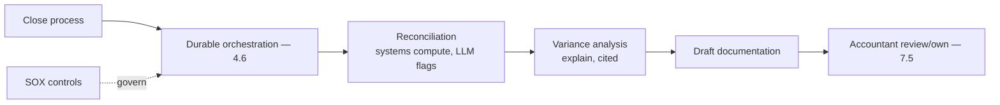
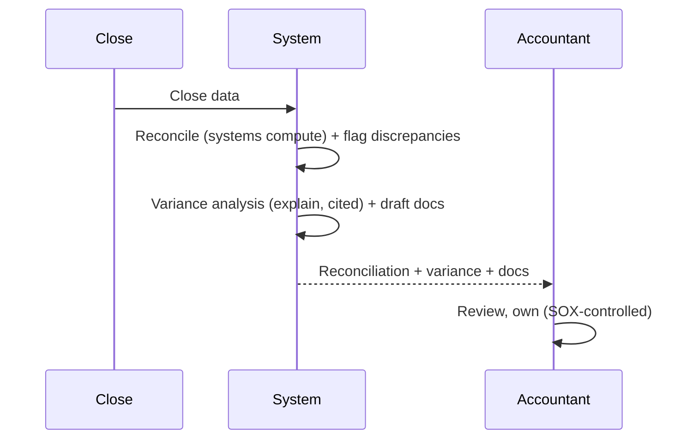
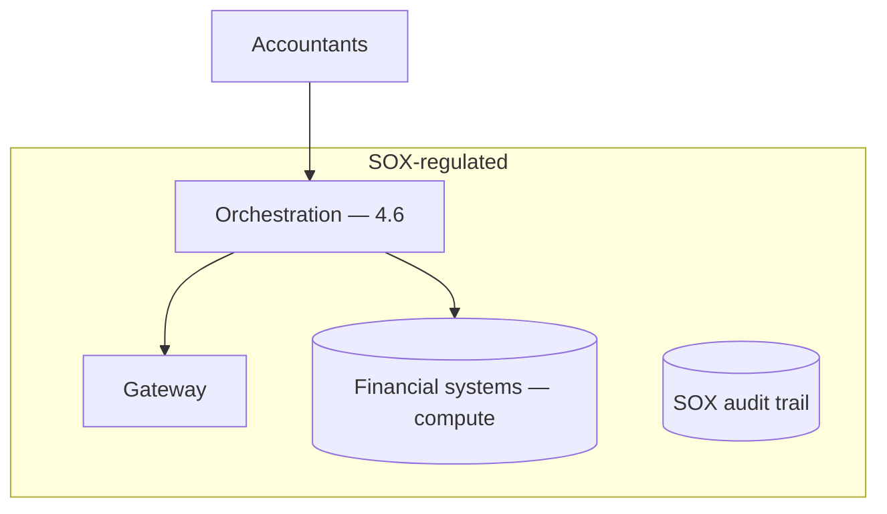

# Case Study CS47 — Financial Close Acceleration

| | |
|---|---|
| **Industry** | Finance (Corporate) |
| **Company profile** | Halvard Industries — fictional corporate, finance/accounting, SOX-regulated |
| **System type** | Document + reconciliation agents (SOX-class controls, numeric accuracy) |
| **Maturity level exercised** | 4 Architect |

## Business Problem

The financial close (monthly/quarterly) is a time-pressured, multi-step process: reconciliations, journal entries, variance analysis, documentation — with SOX-class controls (every step controlled and auditable) and numeric accuracy critical (errors are material misstatements). The goal: a system that assists reconciliations and variance analysis, drafting documentation for the accountant to review — with SOX controls, numeric accuracy (computations by systems, not the LLM), and auditability. The defining challenges: SOX controls (auditable, controlled), numeric accuracy (the LLM never computes financials), and durable orchestration (multi-step close). Target: faster close, SOX-compliant, numerically accurate, auditable.

## Stakeholders

| Stakeholder | Role | What they care about | Success measure |
|-------------|------|----------------------|-----------------|
| Accountants | Users | Reconciliation support, accuracy | Close time |
| Controller | Sponsor | Close speed, accuracy | Close cycle time |
| Auditors (internal/external) | Gatekeeper | SOX controls, auditability | Audit pass |
| CFO | Sponsor | Close reliability | Reliability |

## Requirements

### Functional
- FR-1: Assist reconciliations (match, flag discrepancies).
- FR-2: Variance analysis (explain variances, cited to data).
- FR-3: Draft close documentation (accountant reviews/owns — 7.5).
- FR-4: Numeric accuracy (systems compute; LLM assists/explains).

### Non-functional
- NFR-1 (SOX): SOX-class controls (auditable, controlled steps — 4.14).
- NFR-2 (Numeric accuracy): Financials computed by systems (deterministic); LLM explains, doesn't compute.
- NFR-3 (Durability): Multi-step close survives (durable orchestration — 4.6).
- NFR-4 (Auditability): Full audit trail.

### Constraints
- SOX controls (the defining constraint); numeric accuracy (LLM never computes); durable multi-step; auditability.

## Architecture

Durable orchestration (4.6, multi-step close) + reconciliation (systems compute, LLM flags — the numeric-accuracy split) + variance explanation (cited) + accountant review (7.5) + SOX controls. Numbers are computed by systems; the LLM explains and drafts (like CS08/CS28).

## Sequence Diagram

## Deployment Diagram

## Threat Model

| Threat | Vector | Impact | Likelihood | Mitigation |
|--------|--------|--------|------------|------------|
| Numeric error | LLM computes | Material misstatement | Med | Systems compute (deterministic); LLM explains only (3.1) |
| SOX control gap | Missing control | Audit failure | Med | SOX-class controls, audit trail (4.14) |
| Un-auditable step | Missing documentation | Audit failure | Med | Full audit trail, durable orchestration (4.6) |
| Autonomous close entry | Bypass | Uncontrolled entry | Low | Accountant review/own (7.5) |

## Cost Estimation

| Item | Assumption | Monthly |
|------|-----------|---------|
| Inference | Close volume (periodic, document-heavy) | ~$25K |
| Orchestration + systems | Durable, financial systems | ~$8K |
| **Total** | | **~$33K** |

Dominant: close-period document processing. Optimization: tiering, batch (7.8).

## Scaling Strategy

Periodic (close cycles — monthly/quarterly peaks). Orchestration scales for the close; reconciliation systems (existing) compute; accountant review capacity-bounded. Close-cycle provisioning.

## Monitoring Strategy

SOX + accuracy: numeric accuracy (systems-computed, verified), SOX-control compliance, audit-trail completeness, close-cycle-time. The numeric accuracy and SOX controls are critical.

## Lessons Learned

1. **Systems compute, the LLM explains** — financials are computed by the deterministic financial systems (numeric accuracy — errors are material misstatements — 3.1); the LLM assists reconciliation and explains variances, never computes.
2. **SOX controls govern every step** — the close is SOX-controlled (4.14); every step auditable and controlled, the durable orchestration (4.6) providing the audit trail.
3. **The accountant owns the close** — the accountant reviews and owns (7.5); no autonomous close entries — the SOX control requires human ownership.

---

**Related chapters:** [4.6 Orchestration](../curriculum/part-4-enterprise-genai-systems/chapter-06-orchestration-workflows.md), [4.14 Privacy/Compliance](../curriculum/part-4-enterprise-genai-systems/chapter-14-privacy-compliance-governance.md), [3.1 LLM Limits](../curriculum/part-3-core-building-blocks-of-genai/chapter-01-llm-capabilities-limits.md) · **Related patterns:** Checkpoint-and-Resume (7.4), Human-in-the-Loop (7.5), Anti-corruption layer (6.4) · **Similar case studies:** [CS03](cs03-prior-authorization-automation.md), [CS48](cs48-fpa-narrative-reporting.md)
