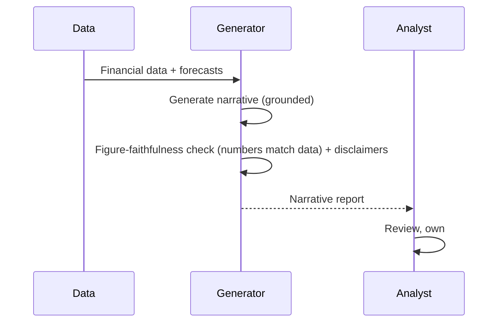
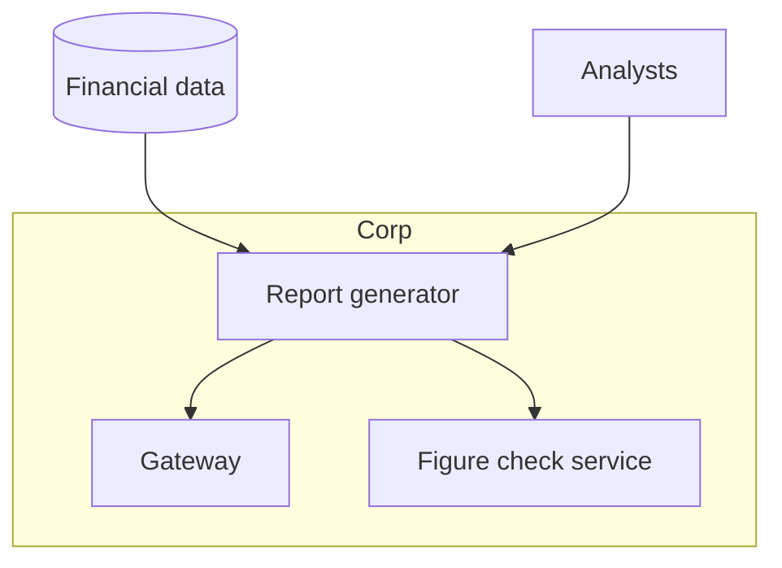

# Case Study CS48 — FP&A Narrative Reporting

| | |
|---|---|
| **Industry** | Finance (Corporate) |
| **Company profile** | Halvard Industries — fictional corporate, FP&A (financial planning & analysis) |
| **System type** | Data-grounded generation (figure faithfulness, forecast disclaimers) |
| **Maturity level exercised** | 3 Engineer → 4 Architect |

## Business Problem

FP&A teams produce recurring narrative reports (management reporting, board decks) explaining financial results and forecasts — synthesizing data into narrative, time-intensive, with figure faithfulness critical (the narrative's numbers must match the data exactly) and forecast disclaimers required (forecasts carry uncertainty). The goal: a system that generates the narrative from the financial data, with exact figure faithfulness and appropriate forecast disclaimers. The defining challenges: figure faithfulness (numbers in narrative match data exactly) and forecast disclaimers. Target: faster reporting, figure-faithful, appropriately-disclaimed.

## Stakeholders

| Stakeholder | Role | What they care about | Success measure |
|-------------|------|----------------------|-----------------|
| FP&A analysts | Users | Narrative generation, accuracy | Reporting time |
| Finance leadership | Sponsor | Reporting quality, speed | Quality, speed |
| Management/Board | Consumers | Accurate, clear reporting | Report quality |
| Compliance | Gatekeeper | Figure accuracy, disclaimers | Accuracy compliance |

## Requirements

### Functional
- FR-1: Generate narrative from financial data (grounded).
- FR-2: Figure faithfulness (numbers match data exactly).
- FR-3: Forecast disclaimers (uncertainty appropriately noted).
- FR-4: Analyst review/own (7.5).

### Non-functional
- NFR-1 (Figure faithfulness): Every number in the narrative matches the source data exactly (span-check to data — 3.4).
- NFR-2 (Disclaimers): Forecasts carry appropriate uncertainty disclaimers.
- NFR-3 (Accuracy): Faithful narrative synthesis.

### Constraints
- Figure faithfulness (the defining constraint — numbers must match); forecast disclaimers; analyst ownership.

## Architecture

Data-grounded generation + figure-faithfulness check (span-check numbers to source data — 3.4) + forecast disclaimers + analyst review (7.5). The figure faithfulness (numbers match data exactly) is the defining accuracy control.

## Sequence Diagram

## Deployment Diagram

## Threat Model

| Threat | Vector | Impact | Likelihood | Mitigation |
|--------|--------|--------|------------|------------|
| Wrong figure in narrative | Hallucination | Misreporting | Med | Figure-faithfulness check (span-check to data — 3.4), analyst review |
| Missing forecast disclaimer | Generation gap | Misleading forecast | Med | Disclaimer enforcement |
| Narrative error | Hallucination | Wrong report | Med | Grounding, analyst review |

## Cost Estimation

| Item | Assumption | Monthly |
|------|-----------|---------|
| Inference | Reporting cycles, data-grounded | ~$12K |
| Figure check + data | Verification | ~$4K |
| **Total** | | **~$16K** |

Dominant: reporting cycles. Optimization: tiering (7.8).

## Scaling Strategy

Periodic (reporting cycles). Generation scales for cycles; figure-check per report; analyst review capacity-bounded. Cycle-driven load.

## Monitoring Strategy

Faithfulness + quality: figure-faithfulness (numbers match data — the critical metric), disclaimer completeness, narrative quality. Figure faithfulness is the critical monitor.

## Lessons Learned

1. **Figure faithfulness is the accuracy control** — every number in the narrative must match the source data exactly; the figure-faithfulness check (span-check numbers to data — 3.4) prevents misreporting.
2. **Forecasts need disclaimers** — forecasts carry uncertainty; the disclaimer enforcement ensures forecasts are appropriately qualified.
3. **The analyst owns the report** — the analyst reviews and owns (7.5); the reporting judgment stays human.

---

**Related chapters:** [3.4 Structured Outputs](../curriculum/part-3-core-building-blocks-of-genai/chapter-04-structured-outputs.md), [5.5 Data Architecture](../curriculum/part-5-cloud-infrastructure-platform/chapter-05-data-architecture.md), [7.5 Human-in-the-Loop](../curriculum/part-7-enterprise-ai-architecture-patterns/chapter-05-human-in-the-loop-patterns.md) · **Related patterns:** Citation-First (7.2), Draft-Not-Send (7.5), Dual-Model Verification (7.6) · **Similar case studies:** [CS47](cs47-financial-close-acceleration.md), [CS08](cs08-credit-memo-drafting.md)
