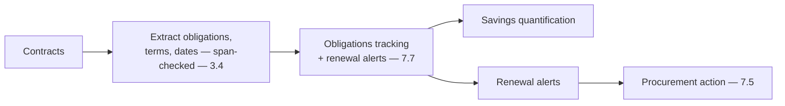
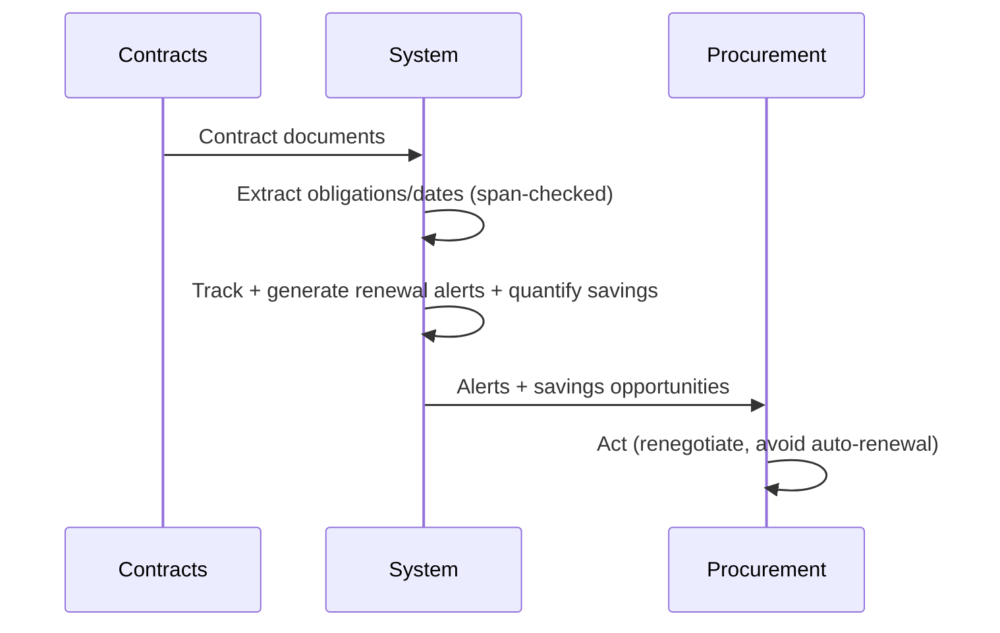
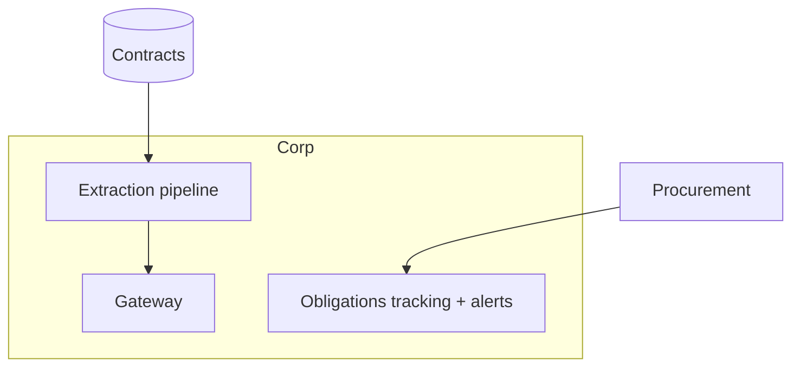

# Case Study CS49 — Procurement Contract Intelligence

| | |
|---|---|
| **Industry** | Finance (Corporate) |
| **Company profile** | Halvard Industries — fictional corporate, procurement / vendor management |
| **System type** | Extraction + obligations tracking (renewal risk, savings quantification) |
| **Maturity level exercised** | 3 Engineer → 4 Architect |

## Business Problem

Procurement manages many vendor contracts with obligations, renewal dates, and terms buried in the documents — missed renewals auto-renew unfavorable contracts (cost), and un-tracked obligations create risk. The goal: a system that extracts contract obligations, terms, and dates, tracks them (renewal alerts, obligation monitoring), and quantifies savings opportunities. The defining challenges: obligations tracking (extract and monitor) and renewal-risk (don't miss renewals). Target: complete obligation/renewal tracking, savings quantification, no missed renewals.

## Stakeholders

| Stakeholder | Role | What they care about | Success measure |
|-------------|------|----------------------|-----------------|
| Procurement | Users | Obligation/renewal tracking, savings | Tracking completeness, savings |
| Vendor management | Beneficiary | Contract oversight | Oversight |
| Finance | Sponsor | Savings, cost avoidance | Savings, avoided auto-renewals |
| Legal | Gatekeeper | Obligation accuracy | Accuracy |

## Requirements

### Functional
- FR-1: Extract contract obligations, terms, dates (structured — 3.4).
- FR-2: Track obligations + renewal alerts (freshness — 7.7).
- FR-3: Quantify savings opportunities.

### Non-functional
- NFR-1 (Tracking completeness): All obligations/renewals tracked (no missed renewals).
- NFR-2 (Accuracy): Accurate extraction (span-checked); legal-reviewed.
- NFR-3 (Timeliness): Renewal alerts timely (freshness).

### Constraints
- Obligations tracking (the defining constraint); renewal-risk (no missed renewals); accuracy.

## Architecture

Extraction (3.4, span-checked) + obligations tracking (with renewal alerts — freshness — 7.7) + savings quantification + human procurement action (7.5). The obligations tracking and renewal alerts are defining.

## Sequence Diagram

## Deployment Diagram

## Threat Model

| Threat | Vector | Impact | Likelihood | Mitigation |
|--------|--------|--------|------------|------------|
| Missed renewal | Tracking gap | Unfavorable auto-renewal (cost) | Med | Renewal alerts, freshness (7.7), completeness monitoring |
| Wrong obligation extraction | Hallucination | Wrong tracking | Med | Span-check (3.4), legal review |
| Missed obligation | Extraction gap | Un-tracked risk | Med | Extraction coverage, review |

## Cost Estimation

| Item | Assumption | Monthly |
|------|-----------|---------|
| Extraction | Contract volume, batch | ~$15K |
| Tracking + alerts | Obligations DB, alerts | ~$5K |
| **Total** | | **~$20K** |

Positive ROI (avoided auto-renewals + savings >> cost). Optimization: batch (7.8).

## Scaling Strategy

Batch extraction + continuous tracking. Extraction scales (batch — 7.8); tracking/alerts continuous; renewal alerts time-driven.

## Monitoring Strategy

Completeness + savings: obligation/renewal-tracking completeness (no missed renewals — the key metric), extraction accuracy (span-checked), savings realized, avoided auto-renewals. Tracking completeness and savings are key.

## Lessons Learned

1. **Renewal alerts prevent costly auto-renewals** — missed renewals auto-renew unfavorable contracts; the renewal alerts (freshness/tracking — 7.7) with completeness monitoring prevent them.
2. **Span-checks make obligations trustworthy** — obligations/dates extracted with span-checks to source (3.4); legal review confirms the extraction.
3. **Savings quantification drives action** — quantifying savings opportunities (renegotiation, consolidation) makes the intelligence actionable.

---

**Related chapters:** [3.4 Structured Outputs](../curriculum/part-3-core-building-blocks-of-genai/chapter-04-structured-outputs.md), [7.7 Knowledge & Data Patterns](../curriculum/part-7-enterprise-ai-architecture-patterns/chapter-07-knowledge-data-patterns.md), [4.3 Ingestion](../curriculum/part-4-enterprise-genai-systems/chapter-03-document-ingestion.md) · **Related patterns:** Freshness Pipeline (7.7), Human-in-the-Loop (7.5), Batch Lanes (7.8) · **Similar case studies:** [CS23](cs23-contract-review-platform.md), [CS16](cs16-supplier-document-intelligence.md)
