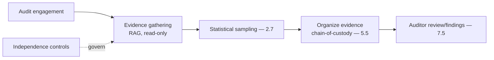
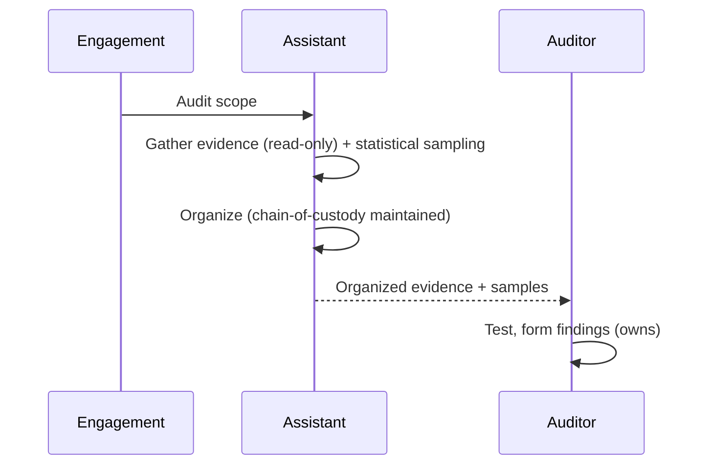
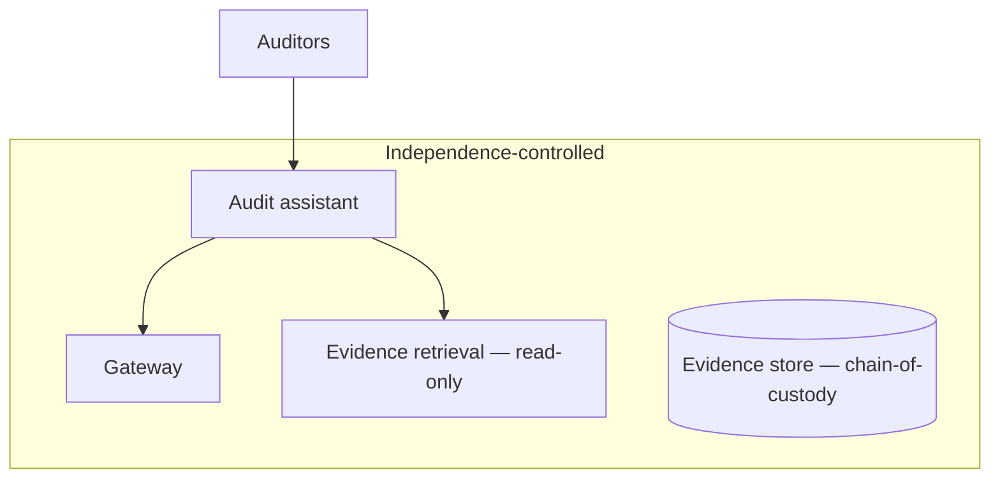

# Case Study CS50 — Audit Evidence Assistant

| | |
|---|---|
| **Industry** | Finance (Corporate) |
| **Company profile** | Halvard Industries — fictional corporate, internal audit |
| **System type** | RAG + sampling workflows (independence rules, evidence chain-of-custody) |
| **Maturity level exercised** | 4 Architect |

## Business Problem

Internal audit gathers and organizes evidence for audit engagements — sampling transactions, gathering documentation, testing controls — time-intensive, with independence rules (audit independence from the audited functions) and evidence chain-of-custody (evidence must be traceable and unaltered). The goal: an assistant that helps gather and organize audit evidence and manage sampling, with independence controls and evidence chain-of-custody. The defining challenges: independence (audit separation) and chain-of-custody (evidence integrity). This closes the case-study catalog — a fitting synthesis (research, evidence, sampling, controls). Target: faster audit evidence gathering, independence-preserving, chain-of-custody-maintained.

## Stakeholders

| Stakeholder | Role | What they care about | Success measure |
|-------------|------|----------------------|-----------------|
| Auditors | Users | Evidence gathering, organization | Audit efficiency |
| Chief audit executive | Sponsor | Audit quality, efficiency | Audit quality |
| Audit committee | Oversight | Independence, quality | Independence |
| External auditors | Consumers | Evidence integrity | Evidence quality |

## Requirements

### Functional
- FR-1: Gather and organize audit evidence (RAG + sampling workflows).
- FR-2: Manage sampling (statistical sampling for testing — 2.7).
- FR-3: Maintain evidence chain-of-custody (traceable, unaltered).
- FR-4: Auditor reviews/owns findings (7.5).

### Non-functional
- NFR-1 (Independence): Audit independence preserved (separation controls).
- NFR-2 (Chain-of-custody): Evidence traceable and integrity-maintained (lineage — 5.5).
- NFR-3 (Sampling): Statistically valid sampling (2.7).

### Constraints
- Independence (the defining constraint); evidence chain-of-custody; statistical sampling validity.

## Architecture

RAG evidence gathering (7.2, read-only) + statistical sampling (2.7) + evidence organization with chain-of-custody (lineage — 5.5) + auditor findings (7.5) + independence controls. Independence and chain-of-custody are defining.

## Sequence Diagram

## Deployment Diagram

## Threat Model

| Threat | Vector | Impact | Likelihood | Mitigation |
|--------|--------|--------|------------|------------|
| Independence compromise | Improper access/influence | Audit invalidity | Med | Independence controls, read-only, separation |
| Chain-of-custody break | Evidence alteration | Evidence invalidity | Med | Chain-of-custody, lineage, immutability (5.5) |
| Invalid sampling | Poor sampling | Un-defensible audit | Med | Statistical sampling validity (2.7) |
| Hallucinated evidence | Fabrication | Wrong findings | Med | Evidence-to-source verification, auditor review |

## Cost Estimation

| Item | Assumption | Monthly |
|------|-----------|---------|
| Inference | Audit engagement volume | ~$15K |
| Retrieval + custody + sampling | Evidence store | ~$6K |
| **Total** | | **~$21K** |

Dominant: engagement volume. Optimization: tiering (7.8).

## Scaling Strategy

Engagement-driven. Evidence gathering scales; sampling per engagement; chain-of-custody maintained. Auditor findings capacity-bounded.

## Monitoring Strategy

Independence + integrity: independence-control compliance, chain-of-custody integrity, sampling validity, evidence accuracy. Independence and chain-of-custody are critical.

## Lessons Learned

1. **Independence is preserved by controls** — audit independence from the audited functions (separation controls, read-only access); the independence is an audit-validity requirement.
2. **Chain-of-custody maintains evidence integrity** — evidence must be traceable and unaltered (lineage, immutability — 5.5); the chain-of-custody makes the evidence defensible.
3. **Statistical sampling is defensible** — the sampling must be statistically valid (2.7, like CS24 eDiscovery); the auditor owns the findings, the sampling supports them. A fitting synthesis to close the catalog — research, evidence, sampling, controls, human judgment.

---

**Related chapters:** [2.7 Evaluating ML](../curriculum/part-2-artificial-intelligence/chapter-07-evaluating-ml-systems.md), [5.5 Data Architecture](../curriculum/part-5-cloud-infrastructure-platform/chapter-05-data-architecture.md), [3.8 Agents](../curriculum/part-3-core-building-blocks-of-genai/chapter-08-agents-concepts.md) · **Related patterns:** Bounded Agent Loop (7.4), Human-in-the-Loop (7.5), Feedback-to-Dataset (7.7) · **Similar case studies:** [CS07](cs07-aml-investigation-assistant.md), [CS24](cs24-ediscovery-triage.md)
