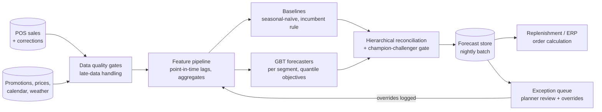
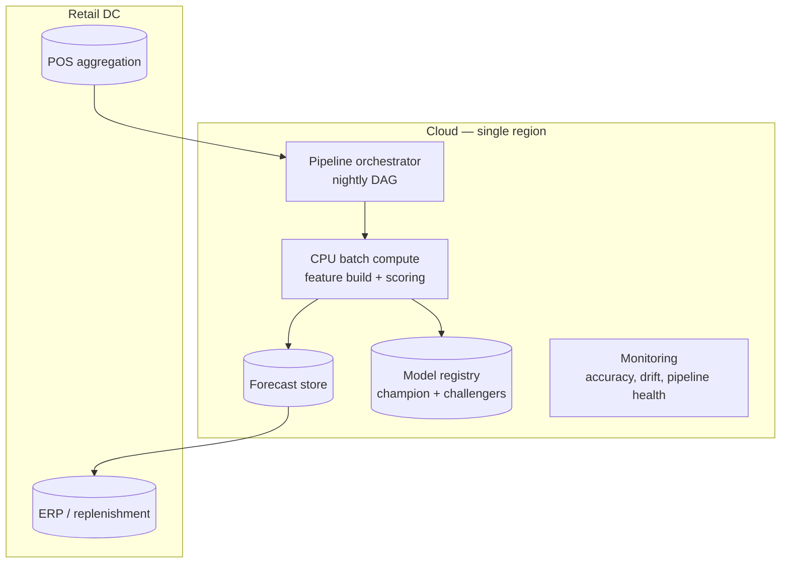

# Case Study CS51 — Demand Forecasting for Store Replenishment

| | |
|---|---|
| **Industry** | Retail |
| **Company profile** | Suvarna Retail — fictional Indian grocery & general-merchandise chain, now 1,400 stores after a three-year expansion (400 stores at the time of [2.11](../curriculum/part-2-artificial-intelligence/chapter-11-choosing-the-right-ai-approach.md)'s triage), ~85,000 SKUs, thin-margin, monsoon-seasonal demand |
| **System type** | Classical ML — hierarchical demand forecasting, batch scoring (no LLM in the forecast path) |
| **Maturity level exercised** | 3 Engineer → 4 Architect |

## Business Problem

Store replenishment ran on planner judgment plus a fixed "last year same week × trend" spreadsheet rule. The result, measured over a quarter: fresh-category waste of ₹14 crore/month (over-ordering perishables) and an estimated ₹22 crore/month in lost sales from stockouts (under-ordering promoted and seasonal items), with planner time consumed firefighting the worst SKUs. Ordering decisions happen nightly for 1,400 stores × active assortment — roughly 40 million SKU×store decisions a week — far beyond manual review. The goal: daily SKU×store demand forecasts with calibrated uncertainty, feeding the replenishment system's order calculation, beating the incumbent rule enough to move both waste and stockouts. This is [2.11](../curriculum/part-2-artificial-intelligence/chapter-11-choosing-the-right-ai-approach.md)'s rung-2 problem *par excellence* — structured historical data, structured output, measured in crores — and the case the "forecasting-with-vibes" anti-pattern warns about if an LLM had been forced into it.

## Stakeholders

| Stakeholder | Role | What they care about | Success measure |
|-------------|------|----------------------|-----------------|
| Supply-chain planners | End users | Trustworthy numbers, exception surfacing, override ability | Override rate falls; exceptions ranked usefully |
| Merchandising VP | Sponsor | Waste and stockout money | Fresh waste −25%, stockout lost sales −20% |
| Store operations | Downstream | Delivery stability, backroom space | Order-quantity volatility within bounds |
| Data engineering | Operator | Pipeline reliability, POS data quality | Forecasts land by 04:00 IST daily, ≥99% of SKU×store |
| Finance | Gatekeeper | ROI vs. model/platform cost | Payback within two quarters |

## Requirements

### Functional
- FR-1: Daily demand forecasts per SKU×store, horizons 1–14 days, with calibrated prediction intervals (order quantity uses the interval, not the point — the newsvendor logic lives in replenishment).
- FR-2: Promotion, price-change, holiday/festival, and weather regressors; planners enter promotions ahead of time and the forecast responds.
- FR-3: Hierarchical coherence — SKU×store forecasts reconcile to store, region, and category totals (planners and finance read different levels of the same numbers).
- FR-4: New-SKU cold start via attribute-based analogues (category, price band, pack size) until sales history accrues.
- FR-5: Exception queue — the ~0.5% of SKU×store forecasts with widest intervals or largest baseline disagreement, ranked for planner review ([7.5](../curriculum/part-7-enterprise-ai-architecture-patterns/chapter-05-human-in-the-loop-patterns.md) review-sampling, classical edition).

### Non-functional
- NFR-1 (Accuracy): Beat the incumbent rule *and* a seasonal-naïve baseline by ≥15% weighted MAPE overall (the 2.11-era pilot beat its incumbent by 14% at 400-store scale; this program sets a slightly higher bar at 3.5× the estate) — reported by segment (stable staples vs. promo-driven vs. fresh), because the aggregate hides where the money is ([2.7](../curriculum/part-2-artificial-intelligence/chapter-07-evaluating-ml-systems.md)'s operating-point discipline).
- NFR-2 (Calibration): 90% prediction intervals contain actuals 88–92% of the time per segment — miscalibrated intervals corrupt every order quantity downstream.
- NFR-3 (Timeliness): Full batch scored and delivered to replenishment by 04:00 IST; a missed batch falls back to the incumbent rule automatically (fail-degraded, never fail-silent).
- NFR-4 (Explainability): Per-forecast driver attribution (base, seasonality, promo uplift, weather) — planners will not act on numbers they cannot interrogate.

### Constraints
- POS data arrives with store-level gaps and late corrections (up to 48h); ERP replenishment expects order quantities, not forecasts, so the interface contract matters; **stockout censoring** — recorded sales understate true demand exactly where forecasting matters most; no GPU budget and none needed — this is CPU-scale ([2.9](../curriculum/part-2-artificial-intelligence/chapter-09-classical-ml-system-design.md)).

## Architecture



The shape is [2.9](../curriculum/part-2-artificial-intelligence/chapter-09-classical-ml-system-design.md)'s system-around-the-model: the model is a set of segment-scoped gradient-boosted-tree forecasters with quantile objectives; the architecture is the point-in-time feature pipeline, the baseline harness, the reconciliation step, and the batch lane. Five defining decisions: (1) **batch, not online** — orders are nightly; per-request inference would buy nothing ([2.9](../curriculum/part-2-artificial-intelligence/chapter-09-classical-ml-system-design.md)'s batch-by-default); (2) **baselines are permanent residents** — seasonal-naïve runs forever alongside the champion, per segment, because stable staples are genuinely hard to beat and the delta *is* the business case; (3) **quantile forecasts, not points** — replenishment consumes the interval; (4) **segment-scoped models** over one global model — fresh, promo-driven, and stable segments have different error economics and different retraining cadences; (5) **stockout-censoring correction** — days flagged out-of-stock are treated as censored, not as zero-demand observations, or the model learns to starve exactly the stores it starved before (the feedback-loop trap from [2.2](../curriculum/part-2-artificial-intelligence/chapter-02-machine-learning-fundamentals.md)).

## Sequence Diagram

```mermaid
sequenceDiagram
    participant P as POS/ERP sources
    participant F as Feature pipeline
    participant M as Forecasters + baselines
    participant R as Reconciliation + gate
    participant O as Replenishment
    participant PL as Planner
    P->>F: Day's sales, corrections, promo calendar (by 23:30)
    F->>F: Data-quality gates; late-data window; censoring flags
    F->>M: Point-in-time features
    M->>R: Quantile forecasts + baseline forecasts
    R->>R: Reconcile hierarchy; compare champion vs baselines
    alt batch healthy
        R->>O: Order-ready forecasts (by 04:00)
        R->>PL: Exception queue (top ~0.5%)
        PL-->>O: Overrides (logged as labels)
    else batch failed or degraded
        R->>O: Incumbent-rule fallback + alert
    end
```

## Deployment Diagram



## Threat Model

Classical-ML systems shift the threat surface from adversarial prompts to data and feedback pathologies ([2.9](../curriculum/part-2-artificial-intelligence/chapter-09-classical-ml-system-design.md)):

| Threat | Vector | Impact | Likelihood | Mitigation |
|--------|--------|--------|------------|------------|
| Feature leakage | Late POS corrections computed into "historical" features as if known at forecast time | Inflated backtests, production model quietly worse | High | Point-in-time feature discipline; backtest replays the actual data-availability timeline |
| Stockout censoring feedback loop | Zero-sales days from stockouts read as zero demand | Model perpetuates under-ordering at worst stores | High | Censoring flags; demand un-censoring estimate; monitor stockout rate as an *input* metric |
| Silent upstream schema/quality break | Store migration changes POS feed semantics | Garbage forecasts shipped at scale | Med | Data-quality gates fail the batch loudly; incumbent-rule fallback |
| Promotion data missing/late | Planners skip promo entry | Promo SKUs revert to base demand — stockouts on the highest-visibility items | Med | Promo-coverage check per batch; exceptions ranked to planners |
| Gaming via overrides | Store managers over-override to pad safety stock | Waste creeps back; model blamed | Low | Overrides logged and attributed; override-vs-actual review monthly |

## Cost Estimation

| Item | Assumption | Monthly |
|------|-----------|---------|
| CPU batch compute | ~3h nightly on a modest autoscaled pool (feature build dominates, not training) | ~₹6 L |
| Storage + orchestration | Forecast store, feature tables, registry, DAG runs | ~₹3 L |
| Weekly retraining | Per-segment GBTs, CPU | ~₹1 L |
| Monitoring + dashboards | Accuracy/drift/pipeline planes | ~₹1.5 L |
| **Total** | | **~₹11.5 L (~$14K)** |

Dominant driver: the *data pipeline*, not the model — training and scoring are rounding errors ([2.9](../curriculum/part-2-artificial-intelligence/chapter-09-classical-ml-system-design.md)). Worth stating in the memo: the entire platform costs less monthly than most single GenAI case studies in this catalog, against a benefit case measured in crores — classical ML's unit economics are its quiet superpower ([6.10](../curriculum/part-6-enterprise-architecture/chapter-10-tco-business-case.md)).

## Scaling Strategy

Scale axis is assortment × stores, not requests. The nightly batch parallelizes trivially by segment and region (embarrassingly parallel scoring); the first real bottleneck is the feature build against growing history — mitigated by incremental feature computation rather than full recompute. Capacity trigger: batch completion creeping past 03:00 IST for a week. What needs redesign rather than scale: moving any segment to intraday re-forecasting (e.g., fresh with same-day second delivery) — that changes the serving pattern from batch to scheduled micro-batch and revives the latency conversation deliberately avoided here.

## Monitoring Strategy

Three layers ordered by detection speed ([2.9](../curriculum/part-2-artificial-intelligence/chapter-09-classical-ml-system-design.md)): **pipeline health** (batch completion, data-quality gate pass rates, promo coverage — minutes); **drift** (feature-distribution shift via PSI per segment, forecast-distribution shift, baseline-vs-champion divergence — days); **outcome accuracy** (weighted MAPE and interval coverage per segment against actuals as they land — label lag is short here, 1–14 days, which makes forecasting a *forgiving first classical system*). Dashboards per segment, not aggregate. Alerts: batch late, gate failures, PSI breach, champion losing to seasonal-naïve on any segment for two consecutive weeks — the last one pages the ML lead because it means the champion should be demoted ([2.9](../curriculum/part-2-artificial-intelligence/chapter-09-classical-ml-system-design.md)'s champion–challenger, run in reverse).

## Lessons Learned

1. **The baseline was the hardest opponent, and that was the finding** — on stable staples, seasonal-naïve was within 3% of the GBT; the model earns its keep on promo-driven and fresh segments. Reporting the delta *by segment* is what kept finance's trust — an aggregate "12% better" would have hidden that a third of the estate didn't need ML at all.
2. **Sales are not demand** — the first champion trained on raw sales learned the stockouts and kept causing them. Censoring correction moved fresh-segment results more than any modeling change. The general form: when the system's own actions shape its training data, correct for it or compound it ([2.2](../curriculum/part-2-artificial-intelligence/chapter-02-machine-learning-fundamentals.md), P21's control-slice discipline).
3. **Interval calibration beat point accuracy for the business outcome** — replenishment converts intervals to order quantities; a well-calibrated slightly-worse point forecast produced better orders than a sharper miscalibrated one. The eval suite had to test calibration explicitly ([2.7](../curriculum/part-2-artificial-intelligence/chapter-07-evaluating-ml-systems.md)) or the "better" model would have shipped.

---

**Related chapters:** [2.9 Classical ML System Design](../curriculum/part-2-artificial-intelligence/chapter-09-classical-ml-system-design.md), [2.11 Choosing the Right AI Approach](../curriculum/part-2-artificial-intelligence/chapter-11-choosing-the-right-ai-approach.md), [2.7 Evaluating ML Systems](../curriculum/part-2-artificial-intelligence/chapter-07-evaluating-ml-systems.md), [6.10 TCO](../curriculum/part-6-enterprise-architecture/chapter-10-tco-business-case.md) · **Related patterns:** batch scoring & champion–challenger ([2.9](../curriculum/part-2-artificial-intelligence/chapter-09-classical-ml-system-design.md)), Review Sampling ([7.5](../curriculum/part-7-enterprise-ai-architecture-patterns/chapter-05-human-in-the-loop-patterns.md)) · **Similar:** [P21 Churn Prediction](../projects/p21-churn-prediction-service/README.md), [CS52](cs52-card-fraud-scoring.md)
