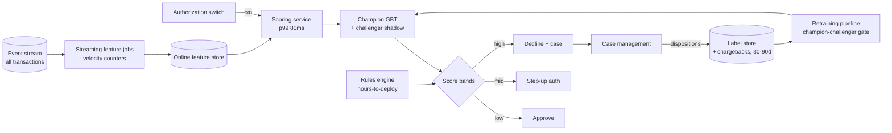
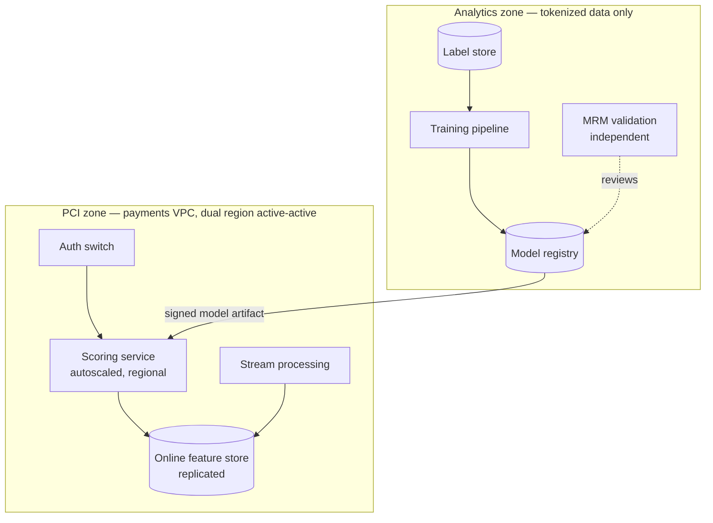

# Case Study CS52 — Real-Time Card Fraud Scoring

| | |
|---|---|
| **Industry** | Banking |
| **Company profile** | Tembusu Bank — fictional Southeast-Asian retail bank, 9M active cards, card-present + e-commerce mix, regulated under an SR 11-7-style model-risk regime |
| **System type** | Classical ML — online fraud scoring in the authorization path (no LLM in the decision path) |
| **Maturity level exercised** | 3 Engineer → 4 Architect |

## Business Problem

Fraud ran on a hand-maintained rules engine: 400+ rules accreted over a decade, catching 61% of fraud value while falsely declining 1 in 140 legitimate transactions. Both directions cost money: fraud losses of ~$3.1M/month, and false declines whose cost is worse than it looks — a falsely declined customer reduces card usage for months and calls the contact center that day. The asymmetry runs opposite to intuition per transaction (a missed $80 fraud loses $80; a false decline can cost a customer relationship), but at portfolio scale both are P&L lines. The goal: a learned risk score inside the authorization flow — under a hard latency budget, under model-risk governance, against an adversary who *adapts*. This is [2.9](../curriculum/part-2-artificial-intelligence/chapter-09-classical-ml-system-design.md)'s classification family in its most demanding configuration: online, adversarial, imbalanced (~0.1% fraud rate), with labels arriving 30–90 days late via chargebacks.

## Stakeholders

| Stakeholder | Role | What they care about | Success measure |
|-------------|------|----------------------|-----------------|
| Head of Fraud | Sponsor | Net fraud loss AND customer friction, jointly | Fraud value caught +25% at equal or lower decline rate |
| Fraud operations | End users | Case queue quality, alert volume sanity | Precision of review queue; investigator time per case |
| Model Risk Management | Gatekeeper (independent) | Validation, documentation, reason codes, ongoing monitoring | Model approved and re-validated on schedule ([4.14](../curriculum/part-4-enterprise-genai-systems/chapter-14-privacy-compliance-governance.md)) |
| Payments engineering | Operator | Authorization latency and availability | p99 score latency ≤80ms; zero auth outages attributable to scoring |
| Customer experience | Downstream | False declines, step-up friction | Decline complaints; step-up completion rate |

## Requirements

### Functional
- FR-1: Score every authorization in-flight; decision = approve / decline / step-up (3-D Secure or OTP) — the middle band routes to friction, not refusal (confidence-based routing, [7.5](../curriculum/part-7-enterprise-ai-architecture-patterns/chapter-05-human-in-the-loop-patterns.md), on calibrated scores).
- FR-2: Online features: velocity counters (txn count/value per card per 5min/1h/24h), merchant risk profile, device/geo novelty — computed on the stream, served in single-digit ms.
- FR-3: Case management feed: declined-and-confirmed and high-score-approved transactions queue for investigator review; dispositions become labels.
- FR-4: Rules engine retained and layered — rules for instant response to new attack patterns (deployable in hours), model for the broad surface (retrained on cadence); score and rules compose, neither alone decides.
- FR-5: Reason codes on every adverse decision — top contributing features in human-readable form, for investigators, customer service, and the regulator.

### Non-functional
- NFR-1 (Quality): Recall of fraud *value* (not count) at a fixed false-positive rate — the operating point is chosen by the fraud-economics curve, reviewed quarterly by the business, not set by the data-science team ([2.7](../curriculum/part-2-artificial-intelligence/chapter-07-evaluating-ml-systems.md)'s threshold-as-business-decision).
- NFR-2 (Latency): p99 ≤80ms for feature-fetch + score inside a ~2s authorization budget.
- NFR-3 (Availability): 99.99%. **Fail-open** — if scoring times out, the rules engine alone decides; a scoring outage must never become a card outage. This is an ADR with the CRO's signature on it.
- NFR-4 (Governance): Independent validation before deployment; documented limitations; monthly performance attestation; challenger tracked against champion continuously ([2.10](../curriculum/part-2-artificial-intelligence/chapter-10-mlops-vs-llmops.md)).

### Constraints
- PCI-DSS scope minimization (tokenized PANs only in the feature path); label lag 30–90 days (chargebacks) with *permanent* label loss on declined transactions — a declined transaction is never labeled, so the model's own actions censor its training data; class imbalance ~1:1000; adversarial drift is a certainty, not a risk.

## Architecture



Defining decisions: (1) **rules and model layered, not replaced** — rules are the fast-twitch response (a new attack pattern blocked in hours), the model is the slow-twitch generalizer; retiring the rules engine was considered and rejected, with the rationale recorded ([1.4](../curriculum/part-1-professional-foundation/chapter-04-tradeoff-analysis.md)); (2) **online feature store with a shared code path** — the velocity features computed on the stream are the same code that computes training features from history, because training–serving skew is the classic silent killer here ([2.9](../curriculum/part-2-artificial-intelligence/chapter-09-classical-ml-system-design.md)); (3) **three-band decisioning** — step-up authentication converts the model's uncertain middle from a decline/approve coin-flip into a customer-recoverable action; (4) **challenger always running in shadow** — scoring silently on live traffic, compared on matured labels, promoted only through the gate ([2.10](../curriculum/part-2-artificial-intelligence/chapter-10-mlops-vs-llmops.md)); (5) **fail-open with rules fallback** — availability of the payment rail outranks marginal fraud catch.

## Sequence Diagram

```mermaid
sequenceDiagram
    participant SW as Auth switch
    participant SC as Scoring service
    participant FS as Online feature store
    participant RU as Rules engine
    participant CM as Case mgmt
    SW->>SC: Authorization (tokenized)
    SC->>FS: Fetch features (velocity, profile, novelty)
    FS-->>SC: Feature vector (<10ms)
    SC->>SC: Champion scores; challenger scores in shadow
    SC->>RU: Score + rule evaluation
    alt low risk
        RU-->>SW: Approve
    else middle band
        RU-->>SW: Step-up (3DS/OTP)
    else high risk
        RU-->>SW: Decline
        RU->>CM: Open case (score, reason codes)
    end
    Note over SC,SW: Timeout at 80ms → fail-open: rules decide alone, event logged
```

## Deployment Diagram



## Threat Model

| Threat | Vector | Impact | Likelihood | Mitigation |
|--------|--------|--------|------------|------------|
| Adversarial adaptation | Fraud rings probe thresholds with small transactions, adapt patterns | Recall decays in weeks, silently | High | Drift monitors on score and feature distributions; rules for fast response; retraining cadence tied to observed decay, not calendar |
| Decline-censoring bias | Declined txns never labeled → training data over-represents approved patterns | Model blind spots harden over time | High | Small randomized approve-rate on borderline band (explicitly risk-budgeted); imported industry consortium labels |
| Training–serving skew | Offline feature logic drifts from streaming logic | Offline metrics great, production worse | Med | Shared feature code path; daily online/offline feature-parity check on sampled txns |
| Feature-pipeline lag | Velocity counters delayed under load spike | Scores computed on stale features exactly during attack bursts | Med | Feature-freshness SLO monitored per feature; degrade to rules if freshness breached |
| Label poisoning via disputes | Coordinated false fraud claims | Corrupted training labels | Low | Disposition quality review; investigator-confirmed labels weighted above raw chargebacks |

## Cost Estimation

| Item | Assumption | Monthly |
|------|-----------|---------|
| Online serving + feature store | Dual-region, ~1,400 TPS peak, in-memory feature replicas | ~$38K |
| Stream processing | Velocity jobs on full transaction stream | ~$22K |
| Training + backtesting | Weekly retrains + continuous challenger eval, CPU | ~$6K |
| Case-management integration + monitoring | | ~$9K |
| **Total** | | **~$75K** |

Dominant driver: the always-on online serving and streaming layer — the price of moving from batch to in-request scoring ([2.9](../curriculum/part-2-artificial-intelligence/chapter-09-classical-ml-system-design.md)'s batch-unless-the-decision-is-in-request rule, correctly failing here because the decision *is* in-request). Set against ~$3.1M/month fraud losses, the platform pays for itself at a 2.5% improvement; the business case cleared at the first quarterly review.

## Scaling Strategy

Load profile: diurnal with seasonal spikes (festival shopping ~4× baseline) and attack bursts that are *precisely correlated with feature-pipeline stress*. Scoring service and feature store scale horizontally; stream processing is partitioned by card token. The bottleneck order: feature-store read latency → stream lag under burst → retraining backtest time as history grows. Capacity triggers: p99 feature fetch >10ms sustained, stream lag >30s. What needs redesign, not scale: adding graph features (card–merchant–device rings) — a different feature-computation architecture, deliberately deferred to a v2 with its own ADR.

## Monitoring Strategy

Four planes: **system** (score latency p99, fail-open rate — a fail-open spike is the top-severity page); **feature** (freshness per feature, online/offline parity); **drift** (PSI on inputs and score distribution daily — the early-warning proxy while labels mature, [2.9](../curriculum/part-2-artificial-intelligence/chapter-09-classical-ml-system-design.md)); **outcome** (recall of fraud value / FPR / precision at the operating point, computed on matured labels with the 30–90 day lag explicit on the dashboard — today's "performance" describes last quarter's model). Monthly attestation pack to MRM: performance vs. limits, drift events, overrides, challenger comparison ([4.14](../curriculum/part-4-enterprise-genai-systems/chapter-14-privacy-compliance-governance.md)). Runbook: drift breach → freeze threshold changes, accelerate challenger eval; fail-open breach → payments incident process, not ML process.

## Lessons Learned

1. **The threshold is a P&L instrument, not a model parameter** — moving the operating point moved millions in each direction; putting the fraud-economics curve in front of the business quarterly, with decline costs priced in, turned threshold reviews from a data-science chore into the system's most valuable governance ritual ([2.7](../curriculum/part-2-artificial-intelligence/chapter-07-evaluating-ml-systems.md)).
2. **The adversary is a drift generator** — fraud drift is not the gentle covariate shift of churn models; recall decayed measurably within six weeks of each major attack innovation. The architecture answer was two-speed: rules absorb novelty in hours, the model consolidates in weeks. Teams that shipped model-only systems rebuilt their rules engines within a year.
3. **Label economics shaped the architecture more than the algorithm choice did** — 30–90 day chargeback lag, permanently missing labels on declines, and the risk-budgeted exploration band to keep the training data honest: none of this is visible in an offline benchmark, and all of it dominated the design reviews ([2.9](../curriculum/part-2-artificial-intelligence/chapter-09-classical-ml-system-design.md)'s label-acquisition discipline).

---

**Related chapters:** [2.9 Classical ML System Design](../curriculum/part-2-artificial-intelligence/chapter-09-classical-ml-system-design.md), [2.10 MLOps and LLMOps](../curriculum/part-2-artificial-intelligence/chapter-10-mlops-vs-llmops.md), [2.7 Evaluating ML Systems](../curriculum/part-2-artificial-intelligence/chapter-07-evaluating-ml-systems.md), [4.14 Privacy, Compliance & Governance](../curriculum/part-4-enterprise-genai-systems/chapter-14-privacy-compliance-governance.md) · **Related patterns:** online inference, champion–challenger, shadow scoring ([2.9](../curriculum/part-2-artificial-intelligence/chapter-09-classical-ml-system-design.md)/[2.10](../curriculum/part-2-artificial-intelligence/chapter-10-mlops-vs-llmops.md)), Confidence-Based Routing ([7.5](../curriculum/part-7-enterprise-ai-architecture-patterns/chapter-05-human-in-the-loop-patterns.md)) · **Similar:** [P21 Churn Prediction](../projects/p21-churn-prediction-service/README.md), [CS07 AML Investigation Assistant](cs07-aml-investigation-assistant.md), [CS51](cs51-demand-forecasting-replenishment.md)
