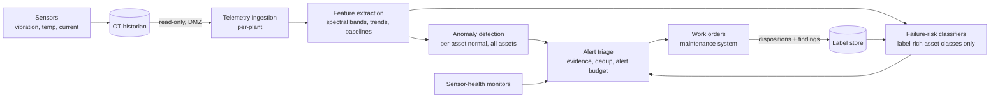
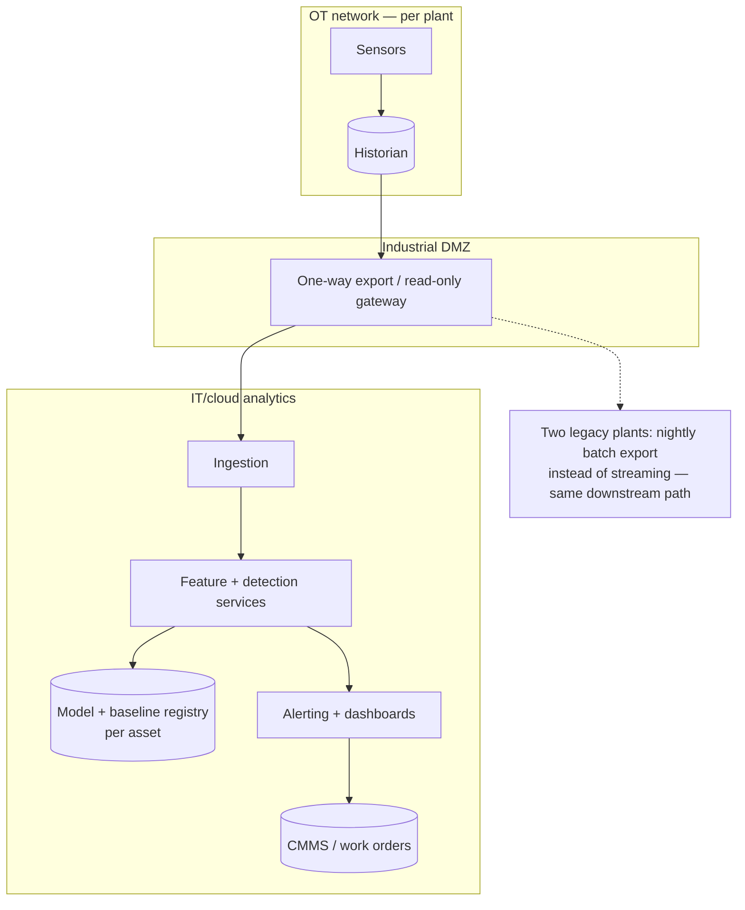

# Case Study CS53 — Predictive Maintenance for Production Lines

| | |
|---|---|
| **Industry** | Manufacturing |
| **Company profile** | Ironvale Components — fictional automotive-parts manufacturer, 6 plants, ~900 monitored assets (CNC machines, presses, compressors), OT/IT-segmented networks |
| **System type** | Classical ML — sensor-based anomaly detection + failure-risk classification, edge + batch (no LLM in the detection path) |
| **Maturity level exercised** | 3 Engineer → 4 Architect |

## Business Problem

Maintenance ran on fixed time-based schedules: parts replaced on calendar intervals whether worn or not, and unplanned failures still got through — 14 line-stopping failures last year, averaging 9 hours of downtime at ~$85K/hour, plus expedited-parts and overtime costs. Time-based servicing *also* wastes money in the other direction: teardowns of healthy machines cause a documented share of subsequent failures (maintenance-induced). The goal: per-asset health monitoring from existing sensor telemetry (vibration, temperature, current draw, cycle counts), raising work orders with enough lead time to schedule repairs into planned windows. The catch that shapes everything: **failures are rare and labels are scarce** — 900 assets produced only ~40 well-documented failure events in three years of history, unevenly spread across asset types. This is the problem family [2.9](../curriculum/part-2-artificial-intelligence/chapter-09-classical-ml-system-design.md) lists but the GenAI-era curriculum rarely teaches: high-value, label-poor, physics-adjacent.

## Stakeholders

| Stakeholder | Role | What they care about | Success measure |
|-------------|------|----------------------|-----------------|
| Plant maintenance managers | End users | Alert trust, lead time, schedulability | ≥72h median lead time; alert precision high enough to act on |
| Maintenance technicians | End users / label source | Fewer false alarms; feedback taken seriously | False-alarm rate under the agreed budget; disposition loop closed |
| VP Manufacturing | Sponsor | Unplanned downtime, maintenance spend | Unplanned line-stops −50%; parts spend −15% |
| OT engineering | Gatekeeper | Control-network isolation, sensor integrity | Zero writes to OT network; read-only historian access |
| Reliability engineering | Domain authority | Physical plausibility of alerts | Alerts reference interpretable features (spectral bands, trends) |

## Requirements

### Functional
- FR-1: Per-asset health score updated hourly from telemetry features (vibration spectral bands, temperature trends, current-draw signatures, cycle counts).
- FR-2: Two detection layers: **unsupervised anomaly detection on every asset** (no labels required — deviation from the asset's own learned normal), and **supervised failure-risk classification where labels exist** (asset classes with enough failure history), predicting failure-within-14-days.
- FR-3: Alert → triage → work order: alerts carry interpretable evidence (which features deviated, since when); maintenance planner accepts, defers, or dismisses; every disposition is logged as a label.
- FR-4: Technician findings (confirmed wear, no fault found, sensor fault) close the loop into the label store.
- FR-5: Sensor-health monitoring as a first-class function — a drifting sensor is indistinguishable from a degrading machine until checked.

### Non-functional
- NFR-1 (Lead time): Median ≥72h between first alert and failure for caught failures — an alert during the failure is a postmortem, not a prediction.
- NFR-2 (Alert budget): ≤3 actionable alerts per plant per day at steady state — the alert budget is a *design input*, not an outcome; beyond it, planners stop reading ([2.8](../curriculum/part-2-artificial-intelligence/chapter-08-responsible-ai.md)'s automation-fatigue lesson in industrial form).
- NFR-3 (Isolation): Read-only from the OT historian across a data diode / DMZ; nothing on the IT side can write toward control networks.
- NFR-4 (Coverage honesty): Assets without enough history run anomaly-only, and the dashboard says so — no fabricated risk scores on label-poor assets.

### Constraints
- Label scarcity (~40 documented failures; some asset classes have 2); heterogeneous fleet (same model machine, different duty cycles); historian data quality varies by plant vintage; maintenance windows are weekly, so lead time under ~5 days has limited scheduling value; no cloud connectivity from two older plants (batch export instead).

## Architecture



Defining decisions: (1) **unsupervised first, supervised where earned** — anomaly detection covers the whole fleet on day one with zero labels; classifiers exist only for asset classes whose failure history supports them, and the boundary moves as labels accrue ([2.11](../curriculum/part-2-artificial-intelligence/chapter-11-choosing-the-right-ai-approach.md)'s data-shape question deciding the rung, per asset class); (2) **interpretable features over end-to-end learning** — spectral bands and trend features that reliability engineers recognize, because an alert a domain expert can't interrogate is an alert that gets dismissed ([2.9](../curriculum/part-2-artificial-intelligence/chapter-09-classical-ml-system-design.md)'s explainability-as-adoption); (3) **the alert budget shapes the operating point** — thresholds are set to the planner's capacity, then improved for recall within that budget, not the reverse ([2.7](../curriculum/part-2-artificial-intelligence/chapter-07-evaluating-ml-systems.md)); (4) **dispositions are the label factory** — the system is architected to *produce* its own future training data, converting the label-scarcity constraint into a flywheel (P21's label-loop discipline, industrial edition); (5) **sensor health is a peer subsystem** — a third of early "machine anomalies" were sensor faults; the architecture now checks the instrument before accusing the machine.

## Sequence Diagram

```mermaid
sequenceDiagram
    participant H as Historian (OT)
    participant F as Feature + detection
    participant T as Triage
    participant P as Planner
    participant TE as Technician
    participant L as Label store
    H->>F: Hourly telemetry (read-only)
    F->>F: Features; anomaly score; risk score (if classifier exists)
    F->>T: Candidate alerts + evidence
    T->>T: Sensor-health check; dedup; budget check
    alt sensor suspect
        T->>P: Sensor work order (calibration/replacement)
    else asset alert
        T->>P: Alert with evidence + lead-time estimate
        P->>TE: Scheduled work order
        TE->>L: Finding (confirmed wear / no fault / sensor fault)
    end
    L-->>F: Labels mature → classifier retraining gate
```

## Deployment Diagram



## Threat Model

| Threat | Vector | Impact | Likelihood | Mitigation |
|--------|--------|--------|------------|------------|
| Sensor drift read as machine degradation | Uncalibrated/aging sensors shift baselines | False alerts erode planner trust — the adoption killer | High | Sensor-health subsystem; cross-sensor consistency checks; calibration schedule as model input |
| Alert fatigue | Thresholds tuned for recall without a budget | Planners ignore alerts; real failure missed *with* an alert on record | High | Hard alert budget as NFR; precision tracked per plant; dismissed-alert review monthly |
| Survivorship/label bias | Only failures that happened get labels; prevented failures look like false alarms | Model punished for succeeding | Med | "Confirmed wear" findings count as true positives even without failure; disposition taxonomy designed for this |
| Duty-cycle confounding | Same asset model, different workloads → shared model mislearns "normal" | Systematic false alerts on hard-worked assets | Med | Per-asset baselines; duty-cycle features; asset-class models only where residuals validate |
| OT boundary violation | Analytics-side compromise reaching control network | Safety/production incident | Low | Read-only diode/DMZ; no return path; OT security review of the export path only |

## Cost Estimation

| Item | Assumption | Monthly |
|------|-----------|---------|
| Ingestion + feature compute | 900 assets, hourly features, streaming for 4 plants + batch for 2 | ~$11K |
| Detection + retraining | Anomaly models per asset (cheap); classifier retrains monthly, CPU | ~$3K |
| Storage | Telemetry features, baselines, labels (raw stays in historian) | ~$4K |
| Dashboards, alerting, CMMS integration | | ~$5K |
| **Total** | | **~$23K** |

Dominant driver: ingestion and feature computation across plants. One avoided nine-hour line-stop (~$765K) funds the platform for over two years — the memo led with that sentence ([6.10](../curriculum/part-6-enterprise-architecture/chapter-10-tco-business-case.md)).

## Scaling Strategy

Scale axes: assets and sensor channels, not requests. Per-asset anomaly models parallelize trivially; the constraint is feature-extraction throughput as sensor density grows (vibration at kHz sampling is the heavy channel — spectral features are computed close to ingestion, raw waveforms stay in the historian). Rollout scaling is organizational: plant-by-plant, each with a calibration period to learn per-asset normals before alerts go live — turning alerts on fleet-wide on day one would blow the alert budget and burn trust irrecoverably. What needs redesign, not scale: adding camera-based visual inspection (a CV build-vs-buy decision with its own annotation economics — deliberately a separate future case, not smuggled in here).

## Monitoring Strategy

The system monitors machines; this section is about monitoring *the system*. **Pipeline plane**: ingestion lag per plant, feature completeness, historian export health. **Model plane**: anomaly-score distribution stability per asset class (a fleet-wide score shift usually means an upstream data change, not simultaneous mass degradation); classifier PSI on inputs; per-asset baseline age. **Outcome plane** (slow, honest): caught vs. missed failures with lead-time distribution, alert precision from dispositions, false-alarm trend per plant — reviewed monthly with reliability engineering because label volume is too small for weekly statistics to mean anything ([2.7](../curriculum/part-2-artificial-intelligence/chapter-07-evaluating-ml-systems.md)'s noise-floor discipline: with ~40 lifetime failures, most weekly "trends" are noise). Runbook: score-distribution shift → check upstream data first, machines second; missed failure → reliability + data joint postmortem, alert-history replay.

## Lessons Learned

1. **Trust is spent in false alarms and earned in lead time** — the first plant went live with recall-tuned thresholds, fired 11 alerts/day, and planners stopped reading within three weeks. Re-launch with the alert budget as a hard constraint (and the precision to honor it) is what made plant 2–6 rollouts succeed. The operating point is an adoption decision before it is a statistical one.
2. **Check the instrument before accusing the machine** — roughly a third of early anomalies were sensor faults. Promoting sensor health from "data-quality footnote" to peer subsystem removed the largest single source of false alarms and, unexpectedly, produced its own ROI line (sensor work orders).
3. **Architect for the labels you don't have yet** — the disposition taxonomy (confirmed wear / no fault found / sensor fault, plus prevented-failure credit) was designed before the first model was trained. Two years on, the label store — not the models — is the system's most valuable asset, and asset classes graduate from anomaly-only to supervised as it grows ([2.9](../curriculum/part-2-artificial-intelligence/chapter-09-classical-ml-system-design.md)'s label-acquisition question, answered in advance).

---

**Related chapters:** [2.9 Classical ML System Design](../curriculum/part-2-artificial-intelligence/chapter-09-classical-ml-system-design.md), [2.11 Choosing the Right AI Approach](../curriculum/part-2-artificial-intelligence/chapter-11-choosing-the-right-ai-approach.md), [2.7 Evaluating ML Systems](../curriculum/part-2-artificial-intelligence/chapter-07-evaluating-ml-systems.md), [2.8 Responsible AI](../curriculum/part-2-artificial-intelligence/chapter-08-responsible-ai.md) · **Related patterns:** anomaly detection + label-loop design ([2.9](../curriculum/part-2-artificial-intelligence/chapter-09-classical-ml-system-design.md)), Review Sampling / alert-budget HITL ([7.5](../curriculum/part-7-enterprise-ai-architecture-patterns/chapter-05-human-in-the-loop-patterns.md)) · **Similar:** [CS15 Maintenance Manual Assistant](cs15-maintenance-manual-assistant.md) (the GenAI complement on the same shop floor), [P22 Hybrid Claims Intake](../projects/p22-hybrid-claims-intake/README.md), [CS51](cs51-demand-forecasting-replenishment.md)
