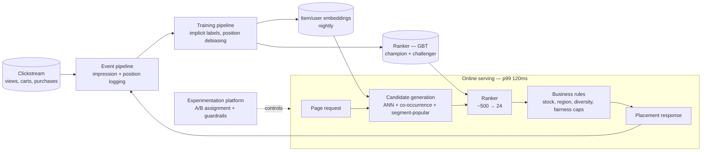
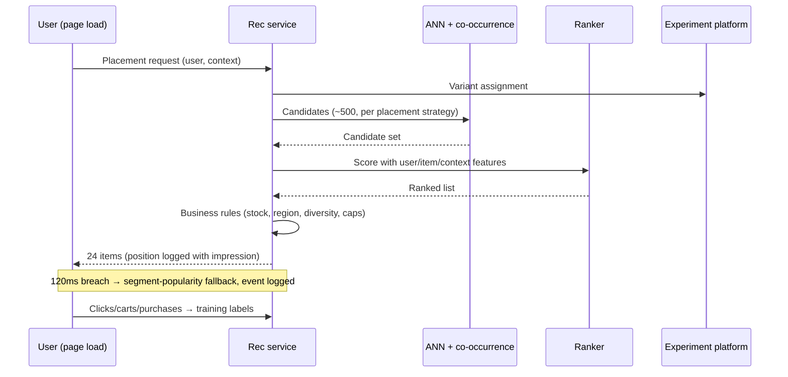
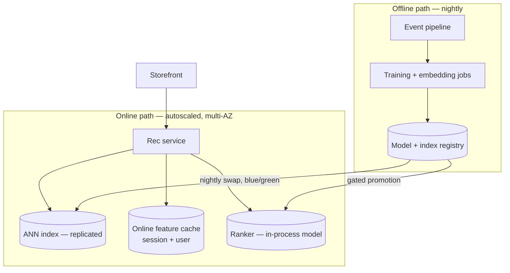

# Case Study CS54 — Product Recommendations at Marketplace Scale

| | |
|---|---|
| **Industry** | Retail |
| **Company profile** | Loomora — fictional e-commerce marketplace, 30M monthly active users, 2M-SKU catalog across 4,000 third-party sellers |
| **System type** | Classical ML — two-stage recommender (retrieve-then-rank), implicit feedback, online serving |
| **Maturity level exercised** | 3 Engineer → 4 Architect |

## Business Problem

Product discovery ran on category browsing and a "bestsellers" carousel — identical for every user. Search converts well when users know what they want; the money left on the table is *discovery*: 91% of sessions ended with no add-to-cart (a ~9% add-to-cart rate, typical for the category), and the bestseller carousel's click-through had decayed to 1.1% (everyone had seen it). The goal: personalized recommendations on the home page, product pages ("similar / bought together"), and cart ("complete the look") — driven by *implicit* feedback (views, carts, purchases — nobody rates products), serving in-request at page-load latency, and measured by incremental conversion in controlled experiments, not by offline metrics alone. This is [2.9](../curriculum/part-2-artificial-intelligence/chapter-09-classical-ml-system-design.md)'s ranking/recommendation family — the one the chapter compresses to "two-stage retrieve-then-rank" and this case expands to a working architecture.

## Stakeholders

| Stakeholder | Role | What they care about | Success measure |
|-------------|------|----------------------|-----------------|
| E-commerce VP | Sponsor | Incremental revenue, not vanity CTR | Conversion lift in A/B vs. bestseller control |
| Merchandising | Co-owner | Catalog exposure breadth, seller fairness | Long-tail exposure share; no seller starvation |
| Growth/experimentation team | Gatekeeper | Experiment integrity | Powered, guardrailed A/B tests ([2.7](../curriculum/part-2-artificial-intelligence/chapter-07-evaluating-ml-systems.md)) |
| Platform engineering | Operator | Page-load latency, availability | p99 recs ≤120ms; graceful fallback |
| Privacy | Gatekeeper | Behavioral-data consent, no sensitive inference | Consent-scoped features; audit pass |

## Requirements

### Functional
- FR-1: Home, product-page, and cart placements, each with its own candidate strategy and ranking objective (home = discovery; product page = similarity + complements; cart = complements only).
- FR-2: **Two-stage architecture**: candidate generation (retrieve ~500 from 2M via embedding similarity, co-occurrence, and popularity-by-segment) → ranker (GBT scoring candidates with user, item, and context features).
- FR-3: Implicit-feedback training: views, add-to-carts, purchases weighted by strength; *impressions without clicks* recorded as negatives — position-corrected, because rank-1 items get clicked partly for being at rank 1 (position bias).
- FR-4: Cold-start paths: new items via content features (category, attributes, seller, price band); new users via segment priors that update within-session.
- FR-5: Business-rule layer after the ranker: in-stock, region-eligible, category diversity floor, seller-fairness caps — rules are code, not model features ([2.11](../curriculum/part-2-artificial-intelligence/chapter-11-choosing-the-right-ai-approach.md)'s rung-1 doing what it does best).

### Non-functional
- NFR-1 (Impact): Ship only what wins a powered A/B on conversion-per-session with guardrails (revenue/session, return rate, page latency) — offline NDCG gates the *candidate* models; the experiment gates the *release* ([2.7](../curriculum/part-2-artificial-intelligence/chapter-07-evaluating-ml-systems.md)).
- NFR-2 (Latency): p99 ≤120ms for retrieve+rank+rules within page load; timeout falls back to segment-popularity — never a blank slot.
- NFR-3 (Freshness): Co-occurrence and embedding candidates refreshed nightly; within-session signals (viewed items) enter features in near-real-time.
- NFR-4 (Health of the ecosystem): Long-tail exposure share monitored — a recommender left to optimize clicks alone collapses onto popular items (the popularity feedback loop) and quietly strangles the marketplace's seller diversity.

### Constraints
- No explicit ratings exist — implicit signals only, with their systematic biases (position, availability, price promotions); GDPR-class consent scoping on behavioral history; the offline–online gap is a *known* hazard: offline metric gains routinely fail to convert to online lift, so the experiment pipeline is part of the system, not an afterthought.

## Architecture

Defining decisions: (1) **two-stage because 2M items can't be scored per request** — the retrieval stage's ANN search reuses the same vector infrastructure GenAI systems use ([5.6](../curriculum/part-5-cloud-infrastructure-platform/chapter-06-vector-search-infrastructure.md)) with product embeddings instead of text chunks — the lineage [2.9](../curriculum/part-2-artificial-intelligence/chapter-09-classical-ml-system-design.md) notes ("an ancestor of 4.2's funnel") runs in both directions; (2) **impression logging designed before the first model** — you cannot train on implicit feedback you didn't log, and position must be recorded at impression time or the negatives are poisoned; (3) **the experiment is the release gate** — offline NDCG selects challengers, the A/B decides promotion, because the offline–online gap is real and repeated; (4) **rules after ranking, not inside the model** — stock, eligibility, and fairness are deterministic constraints that must hold exactly; (5) **diversity and long-tail exposure as guarded metrics** — optimizing a single engagement metric invites the feedback loop where the recommender amplifies what it caused.

## Sequence Diagram

## Deployment Diagram

## Threat Model

| Threat | Vector | Impact | Likelihood | Mitigation |
|--------|--------|--------|------------|------------|
| Popularity feedback loop | Model trains on exposure it caused | Long-tail collapse; marketplace health erodes slowly and invisibly | High | Exposure-share dashboards; diversity floor in rules; exploration slice of traffic |
| Position-bias poisoning | Impressions-as-negatives without position correction | Ranker learns "rank 8 items are bad" — self-fulfilling | High | Position logged at impression; debiasing in label weighting |
| Offline–online divergence | Shipping on NDCG gains alone | Regressions ship with "better" models | Med | A/B as the only promotion gate; guardrail metrics with auto-stop |
| Seller gaming | Sellers manufacture co-occurrence (bot carts) | Manipulated placements | Med | Anomalous-interaction filtering in the event pipeline; seller-level exposure caps |
| Sensitive inference | Behavioral features proxy protected traits | Privacy/regulatory exposure | Low | Feature review; consent scoping; no demographic-proxy features in the ranker |

## Cost Estimation

| Item | Assumption | Monthly |
|------|-----------|---------|
| Online serving + ANN + feature cache | 30M MAU, ~900 QPS peak across placements | ~$42K |
| Nightly training + embedding builds | Implicit-feedback datasets, GBT + embedding jobs | ~$8K |
| Event pipeline + storage | Full impression logging (the expensive honesty) | ~$14K |
| Experimentation platform share | | ~$5K |
| **Total** | | **~$69K** |

Dominant driver: impression logging — recording *what was shown at which position* multiplies event volume by well over an order of magnitude versus click-only logging (with 24-item placements and ~1% CTR, every click arrives with dozens of logged impressions behind it), and it is non-negotiable: it is the training data. A conversion lift of 0.15 points at Loomora's volume pays for the platform ~30× over ([6.10](../curriculum/part-6-enterprise-architecture/chapter-10-tco-business-case.md)).

## Scaling Strategy

Online path scales horizontally (stateless service, replicated ANN, cached features); the offline path's bottleneck arrives first in embedding builds as the catalog grows — mitigated by incremental (changed-item) embedding refresh. Traffic is spiky (sale events: 6× baseline) — the fallback ladder is load-shedding by design: full personalization → cached-user personalization → segment popularity, degrading gracefully under pressure rather than adding latency to page loads. Redesign trigger, not scale trigger: sequence-aware models (session-based recommendations) — a different model family and feature pipeline, taken as a v2 with its own experiment plan.

## Monitoring Strategy

**System plane**: p99 latency per placement, fallback rate (a rising fallback rate silently un-personalizes the site). **Model plane**: candidate-coverage (how often the eventual purchase was even *in* the candidate set — localizes failures to retrieve vs. rank, [2.9](../curriculum/part-2-artificial-intelligence/chapter-09-classical-ml-system-design.md)'s localize-before-fixing applied to the funnel), score distributions, feature freshness. **Business plane**: conversion/session and revenue/session by variant, CTR per placement, long-tail exposure share, category diversity. **Experiment plane**: active tests, guardrail breaches, sample-size progress. The candidate-coverage metric deserves the emphasis: when recommendations degrade, the first diagnostic question is *retrieval miss or ranking miss* — teams that can't answer it re-tune the wrong stage for a quarter.

## Lessons Learned

1. **The log is the model** — the impression-with-position log, designed before any model existed, determined everything downstream. The team that logs only clicks trains on survivorship and can never compute position-corrected negatives. Instrumentation-first is to recommenders what point-in-time correctness is to churn models ([2.9](../curriculum/part-2-artificial-intelligence/chapter-09-classical-ml-system-design.md)).
2. **Offline metrics choose candidates; experiments choose winners** — two ranker challengers with +4% and +6% offline NDCG went to A/B; the +4% won online and the +6% *lost to control* (it had learned to recommend items users would have bought anyway — no incrementality). The experiment pipeline is not QA; it is the definition of success.
3. **A marketplace recommender is an ecosystem intervention** — pure engagement optimization began starving mid-tail sellers within two months (visible only because exposure share was dashboarded). The diversity floor and exposure caps cost ~0.3% short-term conversion and were the right call; the alternative compounds into a catalog nobody browses. Guarded metrics are architecture, not ethics decoration ([2.8](../curriculum/part-2-artificial-intelligence/chapter-08-responsible-ai.md)).

---

**Related chapters:** [2.9 Classical ML System Design](../curriculum/part-2-artificial-intelligence/chapter-09-classical-ml-system-design.md), [2.7 Evaluating ML Systems](../curriculum/part-2-artificial-intelligence/chapter-07-evaluating-ml-systems.md), [5.6 Vector & Search Infrastructure](../curriculum/part-5-cloud-infrastructure-platform/chapter-06-vector-search-infrastructure.md), [2.8 Responsible AI](../curriculum/part-2-artificial-intelligence/chapter-08-responsible-ai.md) · **Related patterns:** two-stage retrieve-then-rank, online inference, exploration slice ([2.9](../curriculum/part-2-artificial-intelligence/chapter-09-classical-ml-system-design.md)) · **Similar:** [CS12 Conversational Shopping Assistant](cs12-conversational-shopping-assistant.md) (the GenAI complement — conversational discovery over this system's engine), [CS45 L&D Recommender](cs45-learning-development-recommender.md) (the small-data contrast), [CS51](cs51-demand-forecasting-replenishment.md)
