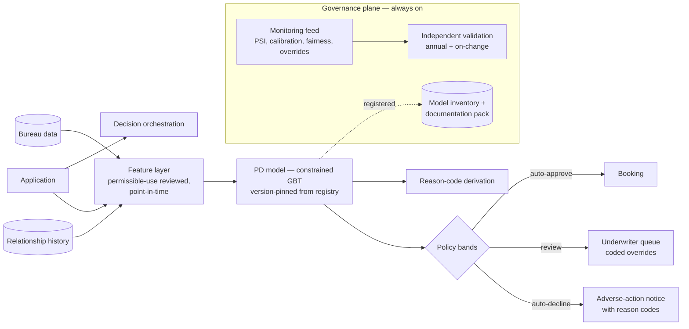
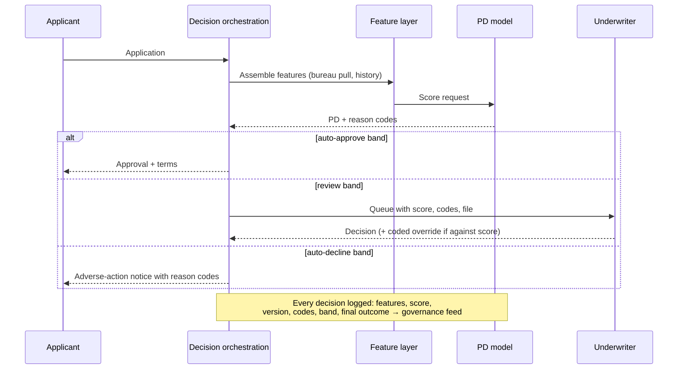
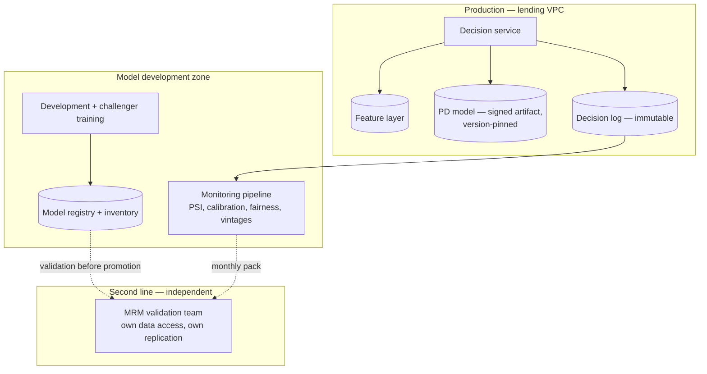

# Case Study CS55 — Credit Risk Scoring under Model Risk Management

| | |
|---|---|
| **Industry** | Banking |
| **Company profile** | Tembusu Bank (see [CS52](cs52-card-fraud-scoring.md)) — personal-lending division: unsecured loans, 40K applications/month, supervised under an SR 11-7-style model-risk regime with fair-lending obligations |
| **System type** | Classical ML — application credit scoring, batch + on-application, governance-dominant |
| **Maturity level exercised** | 4 Architect (the governance is the architecture) |

## Business Problem

Personal-loan underwriting ran on a decade-old purchased scorecard plus manual review: approval decisions took 2–4 days, the scorecard's discrimination had decayed (its development population no longer resembled today's applicants), and manual overrides had grown to 30% of decisions — unexamined, inconsistent, and invisible to governance. The bank wants an in-house application score: faster decisions, better risk separation, controlled override behavior. But the *hard* requirements are not statistical: every adverse decision needs **reason codes** the customer receives (adverse-action obligations), the model must pass **independent validation** before touching a single application, fair-lending analysis must show no disparate impact on protected groups, and the regulator examines the full model lifecycle. This case is the curriculum's clearest demonstration that in regulated classical ML, **the model is a governed artifact first and a predictor second** — the single sentence [4.14](../curriculum/part-4-enterprise-genai-systems/chapter-14-privacy-compliance-governance.md) devotes to model risk management, expanded to a working architecture.

## Stakeholders

| Stakeholder | Role | What they care about | Success measure |
|-------------|------|----------------------|-----------------|
| Chief Credit Officer | Sponsor & decision owner | Loss rates, approval rates, decision speed | Default rate flat-or-better at +8% approval rate; decisions in minutes |
| Model Risk Management | Independent gatekeeper (second line) | Conceptual soundness, validation, documentation, ongoing monitoring | Validation report approved; findings closed; annual re-validation |
| Fair-lending / Compliance | Gatekeeper | Disparate impact, adverse-action correctness | Fairness analysis passes; reason codes legally adequate |
| Underwriters | Users | Score trust, clear override lanes | Override rate ≤10%, all overrides coded and reviewed |
| Internal audit / Regulator | Third line / external | Lifecycle evidence | Examination without findings |

## Requirements

### Functional
- FR-1: Probability-of-default score at application time (sub-minute), from bureau data, application data, and bank relationship history — every feature passing a **permissible-use review** (some available data is legally unusable).
- FR-2: **Reason codes**: for every decline, the top factors driving the score deficit, in customer-comprehensible language, mechanically derived from the model (not narrated after the fact).
- FR-3: Decision bands: auto-approve / underwriter review / auto-decline, with band thresholds owned by credit policy, not by the model team ([2.7](../curriculum/part-2-artificial-intelligence/chapter-07-evaluating-ml-systems.md)'s threshold-as-business-decision, here a *governed* business decision).
- FR-4: Override workflow: underwriter overrides captured with coded reasons; override performance tracked against model performance quarterly.
- FR-5: Model inventory registration, versioned model documentation pack, and a monitoring feed to MRM — the governance artifacts are system outputs, not documents someone writes later.

### Non-functional
- NFR-1 (Discrimination): Beat the incumbent scorecard by ≥5 Gini points on out-of-time validation — *out-of-time*, not just out-of-sample, because credit populations drift and yesterday's random split flatters the model ([2.7](../curriculum/part-2-artificial-intelligence/chapter-07-evaluating-ml-systems.md)).
- NFR-2 (Calibration): Predicted PDs calibrated within tolerance per risk band — pricing and provisioning consume the *probability*, not the rank.
- NFR-3 (Fairness): Disparate-impact analysis (e.g., adverse-impact ratios by protected group at the operating thresholds) within policy bounds; drivers of any disparity examined for business necessity ([2.8](../curriculum/part-2-artificial-intelligence/chapter-08-responsible-ai.md)).
- NFR-4 (Stability): Population Stability Index monitored monthly; label-maturity discipline — a vintage's true default rate is unknown for 12–24 months, so "current performance" is always a lagged estimate.

### Constraints
- **Interpretability constraint on model choice**: the bank chose a constrained GBT (monotonicity constraints on key features, capped interaction depth) over an unconstrained one — sacrificing ~1 Gini point for defensible reason codes and validator acceptance; the ADR records the trade honestly ([1.4](../curriculum/part-1-professional-foundation/chapter-04-tradeoff-analysis.md)). **Reject inference**: declined applicants never generate repayment labels, so the training population is systematically censored — the same decline-censoring as CS52, but here it is a *validation finding* if unaddressed. Bureau data licensing; 12–24-month label lag; regulator-paced change control (a model change is a governed event, not a deploy).

## Architecture

Defining decisions: (1) **the governance plane is a first-class subsystem** — inventory registration, the documentation pack, and the monitoring feed are built as system components, because "we'll document it for the validators later" is how models fail validation; (2) **constrained model over maximal model** — monotonicity constraints make reason codes mechanically honest (more debt cannot *improve* your score) and made the validation review tractable; (3) **reject inference addressed explicitly** — declined-population performance inferred via bureau outcomes on applicants declined here but approved elsewhere, documented with its assumptions, because the validator will ask; (4) **thresholds live in credit policy** with quarterly review against the loss/approval curve; (5) **champion–challenger with regulator-paced promotion** — challengers run on retained data continuously, but promotion is an annual governed event with full re-validation, not a weekly deploy ([2.10](../curriculum/part-2-artificial-intelligence/chapter-10-mlops-vs-llmops.md)'s cadence inverted by regulation: the gate is heavier than the training).

## Sequence Diagram

## Deployment Diagram

## Threat Model

| Threat | Vector | Impact | Likelihood | Mitigation |
|--------|--------|--------|------------|------------|
| Disparate impact | Facially neutral features proxying protected attributes | Fair-lending violation — regulatory action, remediation of booked decisions | Med | Fairness testing at thresholds pre-launch and quarterly; proxy analysis in feature review; business-necessity documentation |
| Population drift outpacing labels | Economy or marketing shifts applicant mix; defaults surface 12–24 months later | Mispriced risk booked at scale before outcomes visible | Med | PSI monthly as the early warning ([2.9](../curriculum/part-2-artificial-intelligence/chapter-09-classical-ml-system-design.md)); early-delinquency (30/60-day) proxies; vintage curves vs. expectation |
| Reason-code drift | Model updated, code derivation not re-verified | Legally inadequate adverse-action notices at volume | Low | Reason-code verification in the promotion gate; codes derived from the model, never from a lookup table maintained separately |
| Override erosion | Underwriter overrides quietly reintroduce the judgment inconsistency the model replaced | Uncontrolled risk channel | Med | Coded overrides, quarterly override-vs-model performance review; override rate as a governed metric |
| Unvalidated change | "Small" feature or threshold change ships without MRM review | Examination finding; model inventory breach | Low | Change control on the composite (features + model + thresholds); the deployable is the governed unit ([2.10](../curriculum/part-2-artificial-intelligence/chapter-10-mlops-vs-llmops.md)) |

## Cost Estimation

| Item | Assumption | Monthly |
|------|-----------|---------|
| Decision service + feature layer | 40K applications/month — tiny compute | ~$4K |
| Bureau data | Per-pull licensing (the real variable cost) | ~$46K |
| Monitoring + governance pipeline | PSI/calibration/fairness/vintage packs | ~$5K |
| Model development + validation support | Amortized challenger work, documentation tooling | ~$12K |
| **Total** | | **~$67K** |

Dominant driver: bureau data, then *people-time* — validation and documentation effort exceeds all compute combined. The honest TCO for regulated classical ML is dominated by governance labor, a line item absent from GenAI-shaped cost models ([6.10](../curriculum/part-6-enterprise-architecture/chapter-10-tco-business-case.md)).

## Scaling Strategy

Compute is trivial at 40K applications/month and stays trivial at 10×. The scaling dimensions that matter are governance-bound: more products (each score use requires inventory registration and validation of fit-for-purpose), more markets (each jurisdiction's adverse-action and fairness regime), faster model refresh (the promotion process, not the training, is the bottleneck — streamlining validation evidence *is* the scaling work). This is the case study where "scaling strategy" means scaling an operating model, not infrastructure.

## Monitoring Strategy

Monthly governance pack, machine-produced: **stability** (PSI on inputs and score distribution vs. development population), **calibration** (predicted vs. observed by band, on matured vintages), **discrimination** (Gini/KS on the newest matured vintage), **fairness** (adverse-impact ratios at current thresholds), **overrides** (rate, coded reasons, performance vs. model), **vintage curves** (each quarter's bookings tracked against expected loss). Early-warning layer: 30/60-day delinquency proxies bridge the label lag. Every metric carries its maturity window on the dashboard — the design principle from CS52 made governance-grade: *a credit score's report card always describes the past*, and pretending otherwise is how model risk compounds ([2.9](../curriculum/part-2-artificial-intelligence/chapter-09-classical-ml-system-design.md)).

## Lessons Learned

1. **Build the governance artifacts as system outputs** — the documentation pack, monitoring feed, and inventory registration were designed into the pipeline, so validation consumed *evidence the system already produced*. The competing bank pattern — a model built first, then a documentation sprint for the validators — routinely adds six months and fails first review. The general lesson transfers to GenAI compliance verbatim ([4.14](../curriculum/part-4-enterprise-genai-systems/chapter-14-privacy-compliance-governance.md)'s evidence-from-engineering-artifacts).
2. **A Gini point traded for defensibility is usually a good trade** — the constrained model lost ~1 Gini point to the unconstrained challenger and won everywhere else: validation passed faster, reason codes were mechanically sound, underwriters trusted monotone behavior. "Best model" means best *governed* model in this domain ([2.11](../curriculum/part-2-artificial-intelligence/chapter-11-choosing-the-right-ai-approach.md)'s explainability question deciding the design, not decorating it).
3. **The override channel is a model too** — tracking overrides as a parallel decision system exposed that a subset of overrides consistently underperformed the score they overrode. The fix was training and a tightened override policy, worth roughly as much as the model upgrade itself. Any human-in-the-loop lane left unmeasured becomes the unmanaged risk channel ([7.5](../curriculum/part-7-enterprise-ai-architecture-patterns/chapter-05-human-in-the-loop-patterns.md)'s rubber-stamp problem, in reverse).

---

**Related chapters:** [2.9 Classical ML System Design](../curriculum/part-2-artificial-intelligence/chapter-09-classical-ml-system-design.md), [2.8 Responsible AI](../curriculum/part-2-artificial-intelligence/chapter-08-responsible-ai.md), [2.7 Evaluating ML Systems](../curriculum/part-2-artificial-intelligence/chapter-07-evaluating-ml-systems.md), [4.14 Privacy, Compliance & Governance](../curriculum/part-4-enterprise-genai-systems/chapter-14-privacy-compliance-governance.md), [6.9 Architecture Governance](../curriculum/part-6-enterprise-architecture/chapter-09-architecture-governance.md) · **Related patterns:** champion–challenger under governed promotion, reason-code derivation, override review ([2.9](../curriculum/part-2-artificial-intelligence/chapter-09-classical-ml-system-design.md)/[2.10](../curriculum/part-2-artificial-intelligence/chapter-10-mlops-vs-llmops.md)) · **Similar:** [CS52 Card Fraud Scoring](cs52-card-fraud-scoring.md) (same bank, opposite latency/governance balance), [CS08 Credit Memo Drafting](cs08-credit-memo-drafting.md) (the GenAI complement upstream of this decision), [CS28 Underwriting Copilot](cs28-underwriting-copilot.md)
