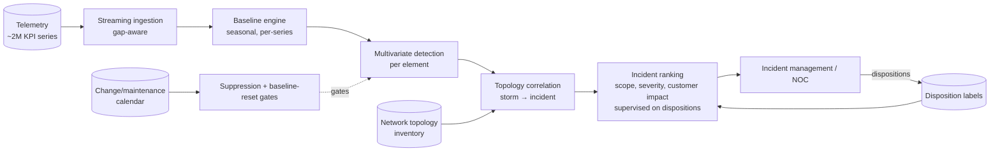
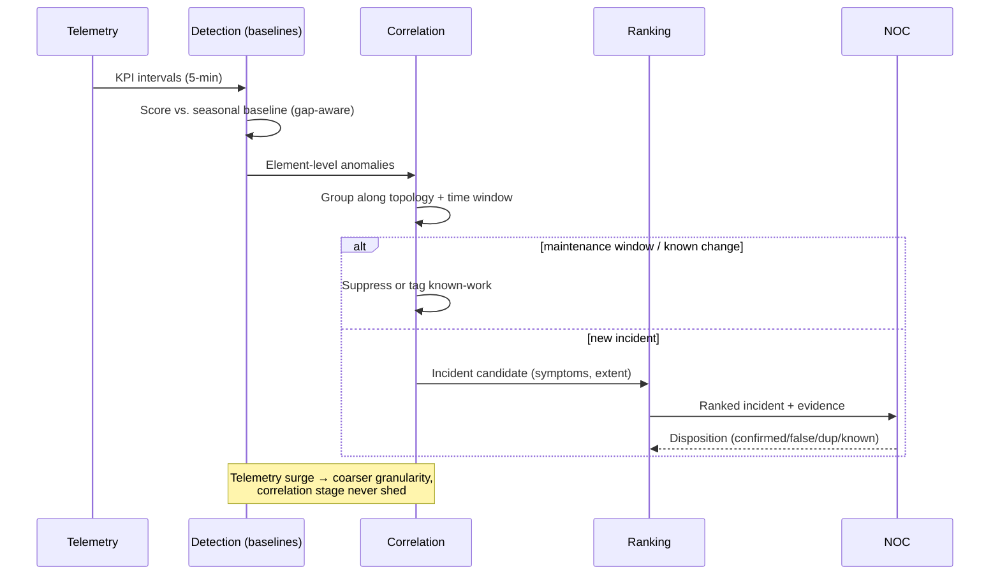
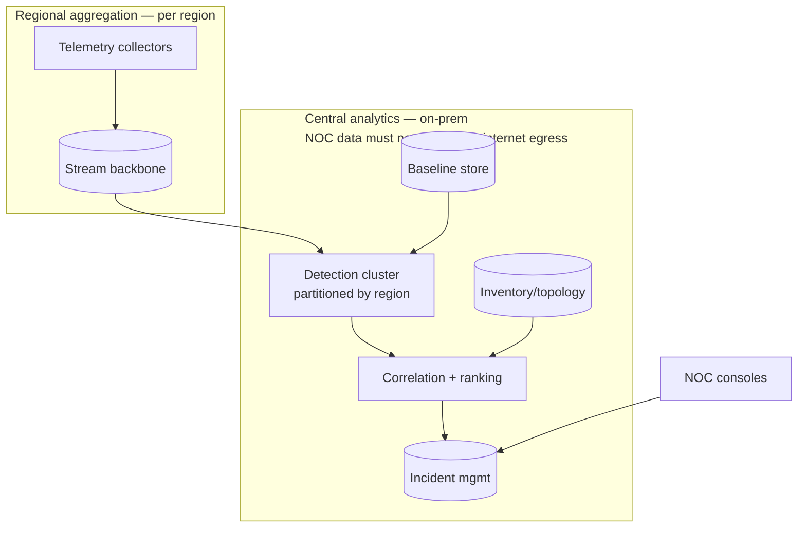

# Case Study CS56 — Network Anomaly Detection at Telecom Scale

| | |
|---|---|
| **Industry** | Telecommunications |
| **Company profile** | Varuna Telecom (the operator from [2.9](../curriculum/part-2-artificial-intelligence/chapter-09-classical-ml-system-design.md)'s churn example) — fictional operator, 8M subscribers, ~45,000 cell sites, national fiber backbone, 24×7 NOC |
| **System type** | Classical ML — multivariate anomaly detection on operational telemetry, streaming + batch |
| **Maturity level exercised** | 3 Engineer → 4 Architect |

## Business Problem

The Network Operations Center watched ~2M KPI time series (per-cell throughput, drop rates, latency, interference; per-link utilization and errors) through static thresholds configured years ago. Two failure modes, both expensive: **alert floods** — a single backbone event cascades into thousands of threshold alerts, burying the cause under its symptoms (mean time to identify a root region: 47 minutes); and **silent degradations** — a cell slowly degrading *within* thresholds never alerts, discovered only through churn-correlated complaint clusters weeks later (and churn is Varuna's most expensive metric, as its own churn model — 2.9 — quantifies). The goal: learned per-series baselines that catch deviations static thresholds cannot, with topology-aware correlation that compresses event storms into a handful of ranked incidents. The constraint that shapes everything: the NOC can act on **a few dozen incidents per shift, nationally** — detection quality is capped by triage capacity, not by model capability.

## Stakeholders

| Stakeholder | Role | What they care about | Success measure |
|-------------|------|----------------------|-----------------|
| NOC director | Sponsor | Time-to-identify, alert volume sanity | MTTI −50%; incidents/shift within triage capacity |
| NOC engineers | Users | Ranked, correlated, evidenced incidents | Actionable-incident precision; storm compression ratio |
| Field operations | Downstream | Dispatch accuracy | Truck rolls per confirmed fault; no-fault-found rate down |
| Customer experience | Beneficiary | Silent degradations caught pre-complaint | Complaint clusters preceded by an incident record |
| Network engineering | Domain authority | Physically plausible detections | Detections reference interpretable KPIs and topology |

## Requirements

### Functional
- FR-1: Learned baselines per KPI series — hour-of-week seasonality, trend, special-event calendars (a stadium cell's Saturday spike is normal; the same spike Tuesday 3 a.m. is not).
- FR-2: Multivariate detection per element — joint deviation across a cell's KPI vector scores higher than any single KPI's deviation (degradations are correlated signatures, not single-metric spikes).
- FR-3: **Topology-aware correlation**: anomalies grouped along network topology (cells → controllers → backhaul → core) within time windows, so one backbone cut is *one incident with 3,000 symptoms*, ranked by scope and severity — the storm-compression function that makes the system usable.
- FR-4: Incident records with evidence (which series deviated, when, how far from baseline, topological extent) feeding the incident-management system; NOC dispositions (confirmed / false / duplicate / known-work) captured as labels.
- FR-5: Maintenance-window suppression — planned work must not generate incidents (the classic trust-killer in ops detection).

### Non-functional
- NFR-1 (Latency): Detection within 5 minutes of telemetry arrival for cell/link KPIs — minutes, not seconds, is honest: KPI aggregation intervals dominate, and faster detection than the data supports is theater.
- NFR-2 (Alert budget): ≤40 new incidents per shift nationally at steady state — the operating point derives from triage capacity ([2.7](../curriculum/part-2-artificial-intelligence/chapter-07-evaluating-ml-systems.md)'s operating-point discipline; CS53's alert-budget principle at 50× the asset count).
- NFR-3 (Coverage honesty): Series with insufficient history (new cells, reconfigured sectors) run threshold-only with a "learning" badge until baselines mature.
- NFR-4 (Storm resilience): The detection pipeline must survive the telemetry surge that accompanies exactly the major events it exists to catch — degrading to coarser granularity under backpressure, never dropping the correlation stage.

### Constraints
- Label scarcity of a specific kind: *dispositions* are plentiful (every incident gets one) but *root-cause labels* are inconsistent, and silent degradations by definition lack tickets in history — so supervised "incident classifiers" trained on ticket history inherit the old thresholds' blind spots; unsupervised baselines with a supervised *ranking* layer trained on dispositions is the honest split. Telemetry gaps during the very outages being detected (the observer effect); network changes (new frequency, re-parenting) reset baselines legitimately — change-events feed must gate baseline resets or every planned change becomes a week of false alerts.

## Architecture

Defining decisions: (1) **unsupervised detection, supervised ranking** — baselines need no labels and cover everything; the scarce, biased ticket history trains only the *ranking* of incidents already detected, where its bias does least harm; (2) **correlation is the product** — raw anomaly detection at 2M series would *increase* NOC load; the topology-aware compression from symptoms to incidents is where the value concentrates, and it consumes an asset most ML systems ignore: the network inventory ([2.11](../curriculum/part-2-artificial-intelligence/chapter-11-choosing-the-right-ai-approach.md)'s rung-1 structure doing heavy lifting beside the rung-2 models); (3) **change-calendar integration as a hard gate** — planned-work suppression and legitimate baseline resets are the difference between adoption and abandonment; (4) **per-series baselines, shared model *architecture*** — one method fleet-wide, parameters per series, so 2M series stay operable by one team; (5) **customer-impact weighting in ranking** — subscribers affected, not just KPI deviation magnitude, orders the queue (a rural cell hard-down can rank below an urban cluster degrading — an explicit, recorded policy choice).

## Sequence Diagram

## Deployment Diagram

## Threat Model

| Threat | Vector | Impact | Likelihood | Mitigation |
|--------|--------|--------|------------|------------|
| Baseline poisoning by slow degradation | A gradually failing element teaches the baseline that sick is normal | The silent-degradation blind spot rebuilt inside the ML | High | Long-window trend tests beside short-window baselines; periodic comparison against cohort-of-peers (same hardware, similar load) |
| Alert-budget breach in novel events | Mass event (weather, power) overwhelms correlation assumptions | NOC floods at the worst moment | Med | Storm-mode: aggressive scope-merging, top-N cap with "N more suppressed" honesty; post-event replay to verify nothing critical was buried |
| Telemetry gaps mistaken for outages (and vice versa) | Collection fails during incidents; missing data ≠ zero traffic | False incidents, or real ones scored on absent data | Med | Gap-aware scoring (missing data scored as *unknown*, propagated to ranking confidence); collector health as its own monitored layer |
| Change-feed incompleteness | Unlogged field work resets element behavior | False-alert clusters after every undocumented change | Med | Post-change baseline-relearn detection (a step-change signature triggers "relearn?" review rather than a week of alerts); feedback pressure on change-logging discipline |
| Ranking bias from disposition labels | NOC habits (what gets confirmed) train the ranker toward familiar incident types | Novel failure modes ranked low precisely because they're novel | Med | Ranking floor for high-magnitude/high-scope anomalies regardless of learned score; quarterly review of low-ranked-but-large anomalies |

## Cost Estimation

| Item | Assumption | Monthly |
|------|-----------|---------|
| Streaming + detection compute | 2M series at 5-min intervals, regional partitions, on-prem cluster amortization | ~₹28 lakh |
| Baseline + telemetry feature storage | Rolling windows; raw telemetry stays in existing collectors | ~₹8 lakh |
| Correlation/ranking + incident integration | Topology joins, ranking retrains (CPU, monthly) | ~₹5 lakh |
| Dashboards + disposition tooling | | ~₹3 lakh |
| **Total** | | **~₹44 lakh** |

Dominant driver: always-on streaming detection across 2M series. Benchmark for the memo: one hour of national MTTI improvement across last year's incident log prices out at ~₹16 crore in SLA credits and churn-adjacent impact — and the churn model ([2.9](../curriculum/part-2-artificial-intelligence/chapter-09-classical-ml-system-design.md)) independently values the silent-degradation catch, since network-quality dissatisfaction is one of its top churn drivers. Two classical systems, one reinforcing business case.

## Scaling Strategy

Scale axes: series count (5G densification roughly doubles it) and telemetry granularity (5-min → 1-min multiplies volume 5×). Detection partitions by region and scales horizontally; the correlation stage is the bottleneck to watch — its topology joins grow with incident scope, and it is deliberately never load-shed (a correlation failure during a storm is the system failing at its only job). Granularity increases roll out per-region behind capacity checks. Redesign trigger, not scale trigger: cross-layer correlation into service-level telemetry (video QoE, voice MOS) — a data-integration project wearing an ML costume, scheduled as its own phase.

## Monitoring Strategy

**Pipeline plane**: ingestion lag per region, collector gap rates, baseline-store health, storm-mode activations. **Model plane**: baseline-fit residuals by series cohort, fraction of series in "learning" state, score-distribution stability (a fleet-wide score shift means an upstream change, not a national simultaneous degradation — CS53's rule at telecom scale). **Outcome plane**: incident precision from dispositions, storm-compression ratio (symptoms per incident), MTTI trend, silent-degradation catches (incidents opened before any complaint cluster — the headline metric), false-suppression audits of maintenance windows. Monthly review with network engineering on the ranking floor's catches: the low-learned-score/high-magnitude anomalies are where novel failure modes first appear ([2.7](../curriculum/part-2-artificial-intelligence/chapter-07-evaluating-ml-systems.md)'s noise-floor honesty applied to rare events).

## Lessons Learned

1. **Detection was the easy third** — learned baselines outperformed static thresholds within weeks; the *value* arrived only when correlation compressed 3,000-symptom storms into single ranked incidents. Teams that ship anomaly scores without the correlation layer make the flood worse and get switched off. The scarce resource was never detection capability; it was NOC attention ([2.9](../curriculum/part-2-artificial-intelligence/chapter-09-classical-ml-system-design.md)'s system-around-the-model, where the "system" is triage).
2. **The change calendar is a model input, not an ops courtesy** — the single biggest false-alert source was legitimate network change resetting element behavior. Wiring the change feed into suppression and baseline-reset gates cut false incidents by more than any algorithmic improvement — and exposed (usefully, uncomfortably) how much field work went unlogged.
3. **Don't let sick become the baseline** — per-series adaptive baselines quietly learn slow degradations as normal, rebuilding *inside the ML* the exact blind spot static thresholds had. The peer-cohort comparison (element vs. same-hardware/same-load cohort) is what catches what self-referential baselines cannot. Adaptive normality always needs an external reference frame.

---

**Related chapters:** [2.9 Classical ML System Design](../curriculum/part-2-artificial-intelligence/chapter-09-classical-ml-system-design.md), [2.7 Evaluating ML Systems](../curriculum/part-2-artificial-intelligence/chapter-07-evaluating-ml-systems.md), [2.11 Choosing the Right AI Approach](../curriculum/part-2-artificial-intelligence/chapter-11-choosing-the-right-ai-approach.md) · **Related patterns:** anomaly detection with alert budgets, unsupervised-detect/supervised-rank split, peer-cohort reference ([2.9](../curriculum/part-2-artificial-intelligence/chapter-09-classical-ml-system-design.md)) · **Similar:** [CS31 Network Operations Copilot](cs31-network-operations-copilot.md) (the GenAI complement — the runbook assistant consuming this system's incidents), [CS53 Predictive Maintenance](cs53-predictive-maintenance.md) (the small-fleet, physics-adjacent contrast), [P21 Churn Prediction](../projects/p21-churn-prediction-service/README.md) (same operator, the downstream churn connection)
