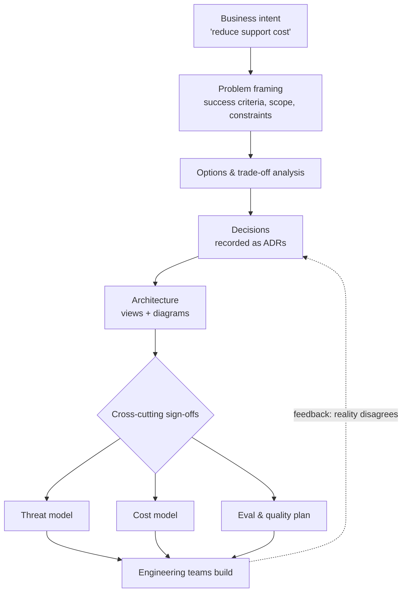

# Chapter 1.1 — From Software Engineer to Solution Architect

| | |
|---|---|
| **Part** | 1 — Professional Foundation |
| **Maturity level** | 1 — Understand |
| **Difficulty** | Beginner |
| **Estimated study time** | 3–4 hours (reading 90 min, exercise 2 h) |
| **Prerequisites** | 5+ years of professional software engineering; none within this curriculum |

## Learning Objectives

After this chapter you will be able to:

1. Describe what an AI Solution Architect owns, produces, and is accountable for — and how each differs from a senior engineer's scope.
2. Identify the three currencies of the role — trade-offs, communication, and trust — and give a concrete example of each.
3. Audit your own engineer-to-architect gap against a competency map and pick your two highest-leverage development areas.
4. Recognize the failure pattern of "engineering harder" at architecture problems, in yourself and others.

## Introduction

You already build systems that work. The transition this curriculum guides you through is not about building better — it is about changing *what you are for*. An engineer is paid to solve a defined problem well. An architect is paid to decide which problem to solve, to what standard, at what cost, and to make dozens of people — engineers, executives, security officers, auditors — act coherently on that decision.

This shift feels uncomfortable precisely because your engineering instincts are excellent. When a project wobbles, your reflex is to open the code. The architect's reflex is to ask who disagrees about the goal. Neither reflex is wrong; they belong to different jobs. This chapter maps the difference so the rest of the curriculum lands in the right mental slot: Parts 2–5 will *feel* like engineering material, but you should read all of it while asking the architect's questions — *what does this constrain, what does it cost, who has to agree, and what happens when it fails?*

GenAI raises the stakes on this transition. Because generative systems are probabilistic, every GenAI architecture is an explicit negotiation between quality, cost, latency, and risk — there is no "correct" build, only defensible positions. That makes architectural judgment, not framework fluency, the scarce skill.

## Business Motivation

Enterprises fund the architect role because bad early decisions are catastrophically expensive and invisible until late. A mid-size insurer that builds a customer-facing assistant without ACL-aware retrieval discovers the problem as a data-exposure incident, not a code review comment — remediation means re-architecting ingestion, re-indexing the corpus, and a regulatory disclosure. A realistic bill for that mistake: 6–9 months of a 6-person team (≈ $700K–$1.2M fully loaded) plus incident costs, versus roughly two weeks of architecture work to get the tenancy model right up front.

The asymmetry generalizes: architecture decisions are cheap to make and ruinous to remake. Boehm's classic result — defect cost grows roughly 10× per lifecycle phase — is amplified in GenAI systems, where "defects" include unbounded inference spend, hallucinated commitments to customers, and prompt-injection exposure. Organizations don't pay architects to draw diagrams; they pay them to move failure discovery from production to the whiteboard.

## Theory

### What the role owns

An AI Solution Architect is accountable for four things:

1. **Problem framing** — translating a business intent ("reduce support cost") into a solvable technical problem with success criteria ("deflect 30% of tier-1 tickets at CSAT ≥ current baseline, ≤ $0.40/conversation").
2. **The decision record** — the set of consequential choices (model strategy, retrieval design, tenancy, human-in-the-loop points) each made from explicit options with explicit trade-offs, written down (see [ADRs](../../adr/)).
3. **System integrity** — the design holds together across functional behavior, security, cost, reliability, and compliance *simultaneously*. Specialists optimize dimensions; the architect owns the intersection.
4. **Alignment** — engineers, security, data, finance, and business stakeholders share one picture of what is being built and why. Alignment is produced by communication artifacts (diagrams, briefs, ADRs), not meetings.

### Engineer vs. architect: the same event, two jobs

| Event | Engineer's move | Architect's move |
|---|---|---|
| Model output quality complaints | Improve the prompt, add retrieval | Ask: measured how? Against what baseline? Is this an eval gap, an expectation gap, or a real regression? |
| "Can we add agents to this?" | Prototype an agent | Ask what task success looks like, what actions are consequential, what the error budget is — then usually recommend a workflow ([Glossary](../../GLOSSARY.md): *workflow* vs. *agent*) |
| Provider price cut announced | Switch models | Re-run the model bake-off evals, check contract/data terms, decide if the switch is worth the revalidation cost |
| Security asks "is this safe?" | List the controls implemented | Produce the threat model: what we protect, from whom, residual risks, and who accepted them |

The pattern: the engineer's unit of work is a *solution*; the architect's unit of work is a *decision with its justification*.

### The three currencies

- **Trade-offs.** Architects never answer "which is best?"; they answer "which is best *given these constraints*, and what are we giving up?" Chapter 1.4 builds this into a formal skill.
- **Communication.** A design that lives only in your head has zero organizational value. The artifacts of Chapter 1.5 — one-page briefs, C4-style diagrams, ADRs — are the role's actual output format.
- **Trust.** Your leverage is that people act on your recommendation without re-deriving it. Trust compounds through calibrated claims ("this will work" vs. "this should work, and here's how we'll know by Friday") and through visibly owning your wrong calls.

### The transition failure mode

The most common failure is **engineering harder**: responding to architectural problems (misaligned stakeholders, unowned risks, missing success criteria) with more building. Its signature is a technically excellent system that gets cancelled — the demo impressed, but nobody agreed on what "good" meant, security never signed off, and finance discovered the inference bill at month three. If a project is wobbling and your instinct says "I'll fix it this weekend," check whether the wobble is in the code at all.

## Architecture Perspective

The architect operates at a specific altitude: below strategy (which picks *whether* to invest) and above implementation (which picks *how* each component is coded). The deliverables at that altitude form a chain, each artifact feeding the next:

Two properties of this chain matter. First, it is *decision-shaped*, not code-shaped — every box is something a person signs, not something a machine runs. Second, the feedback edge is where architects earn their pay in GenAI: probabilistic systems routinely disprove design assumptions (retrieval quality, cost per request, user behavior), and the architect's job is to route that evidence back into recorded decisions rather than letting the design and the system silently diverge.

## Real-world Example

**Nordgren Mutual**, a fictional 4,000-employee insurer, gave a strong senior engineer, Priya, the "AI architect" role for a claims-summarization initiative. Sprint one, she did what excellent engineers do: built a working pipeline — ingestion, summarization, a clean UI. The demo drew applause.

Then the initiative stalled for eleven weeks. Legal asked who had approved sending claims files (with health details) to an external model API — no one had asked. Adjusters refused to use summaries in decisions because nobody could say how accurate they were — there was no eval baseline, so "accurate" had no meaning. Finance flagged that the per-document cost, fine at demo volume, projected to $85K/month at portfolio scale — nobody had multiplied.

Priya's recovery is the lesson. She stopped building for three weeks and produced four artifacts: a one-page problem framing with measurable success criteria agreed with the head of claims (summary acceptance rate ≥ 80%, error flags < 2%); a data-flow diagram that got legal to a concrete requirement (EU processing region + PII pseudonymization) instead of a veto; a 200-document golden set with an eval rubric adjusters helped write; and a cost model showing model tiering (small model for routine claims, large for complex) cut the projection to $19K/month. The system shipped seven months later — a slightly *less* impressive pipeline than her demo, wrapped in decisions everyone had signed. Her summary afterward: "I thought the job was the pipeline. The pipeline was the easy 20%."

## Hands-on Exercise

**Gap audit + role artifact.** Two parts, ~2 hours.

**Part A — Competency self-audit (45 min).** Rate yourself 1–5 on each competency below, with one line of *evidence* per rating (an artifact or event, not a feeling):

| Competency | Evidence looks like |
|---|---|
| Problem framing | You've turned a vague ask into written success criteria |
| Trade-off analysis | A written comparison of options that others used to decide |
| Communication artifacts | Diagrams/docs that people act on without you in the room |
| Cross-cutting design (security, cost, reliability) | You've been the one to raise the concern nobody owned |
| Stakeholder alignment | You've changed a skeptic's position without authority |
| GenAI fundamentals | You can explain RAG, agents, and evals precisely ([Glossary](../../GLOSSARY.md)) |

Pick your two lowest-scoring, highest-impact areas; note which GSAC chapters address them.

**Part B — Reframe a past project (75 min).** Take a project you shipped as an engineer. Write the one-page architect's version *as it should have existed at kickoff*: business intent, success criteria (measurable), the three most consequential decisions with the options that were realistically on the table, and the top risk with its owner. One page maximum — the compression is the exercise.

**Acceptance criteria:**
- [ ] Self-audit has evidence lines, not just scores, and names two target chapters
- [ ] Part B fits on one page and contains at least one measurable success criterion
- [ ] Part B's decisions each name a rejected alternative and why it lost
- [ ] You showed Part B to one colleague and captured what they challenged

## Enterprise Considerations

In large organizations the architect role comes with machinery this chapter's successors cover in depth: architecture review boards that must approve your design (Chapter 6.9), model risk management functions in regulated industries that treat your LLM like a credit model (Chapter 4.14), and procurement/vendor management that constrains which providers you may even evaluate. Two practical notes now: first, learn who your *actual* approvers are in week one — security, data protection, and finance sign-offs gate GenAI systems everywhere; second, expect title inflation and deflation across companies ("solution architect" ranges from pre-sales support to principal-level system ownership) — scope, not title, tells you what the job is (Chapter 8.1 maps the variants).

## Trade-offs

The role itself is a standing trade-off between depth and breadth:

| Decision | Option A | Option B | Choose A when… | Choose B when… |
|----------|----------|----------|----------------|----------------|
| Hands-on depth | Keep coding regularly | Go fully artifact/decision-focused | Team is small, credibility with engineers is your gap, tech is moving fast (GenAI: often) | Org is large, alignment is the bottleneck, you have strong tech leads |
| Where you spend review time | Deep-dive few components | Shallow coverage of everything | A component is novel/high-risk (e.g., the agent loop) | System integrity risks are in the seams, not the parts |
| Decision speed | Decide fast, revise openly | Decide slowly with full analysis | Decision is reversible (most prompt/retrieval choices) | Decision is one-way (data residency, platform, tenancy model) |

The reversibility test in the last row is the single most reusable heuristic in this book: match decision effort to reversal cost.

## Common Mistakes

1. **Engineering harder** — treating alignment and framing gaps as technical debt you can code away. It costs months and reputational capital; the fix is diagnosing *which kind* of problem you have before choosing the tool.
2. **The ivory tower flip** — overcorrecting into pure diagram-production, losing touch with what the technology actually does. GenAI punishes this brutally: model behavior changes monthly, and an architect who hasn't touched the systems designs against a stale mental model.
3. **Presenting conclusions without the trade-off** — telling stakeholders "we should use RAG" instead of showing what it beat and why. It reads as opinion, invites bikeshedding, and builds no trust.
4. **Confusing the demo with the deliverable** — a working prototype answers "can this be built?" but the architect is paid to answer "should it, at what cost, and what must be true to run it?" Nordgren's eleven-week stall lives here.
5. **Waiting for authority** — architecture is influence-shaped; if you wait to be anointed before framing problems and writing decision records, you'll wait indefinitely. Do the job's artifacts and the role follows (Chapter 1.8).

## Best Practices

1. **Write decisions down at the moment of deciding** — an ADR takes 20 minutes now and saves the archaeology later; it is also how you become auditable, which regulated GenAI work requires.
2. **Ask "what would make this fail?" before "how do we build this?"** — pre-mortems surface the cross-cutting risks (data, cost, compliance) that demos hide.
3. **Keep one artifact per audience** — a one-pager for executives, a diagram set for engineers, a threat model for security; never make one document serve all three.
4. **Quantify by default** — "expensive" becomes "$0.11/request against a $0.04 target"; calibrated numbers are the difference between an opinion and a position.
5. **Maintain a personal build cadence** — one small GenAI build per month keeps your judgment attached to reality; this curriculum's [projects](../../projects/) are structured for exactly that.

## Architecture Checklist

Before you accept (or continue in) an architect role on a GenAI initiative:

- [ ] Success criteria exist, are measurable, and a named business owner agreed to them
- [ ] You know who must sign off (security, data protection, finance, business) and have met them
- [ ] The consequential decisions are identified and each has an ADR or a date by which it will
- [ ] A cost model exists at target scale, not demo scale
- [ ] Quality has an operational definition (eval plan), not an adjective
- [ ] You know which decisions are one-way doors and have matched effort accordingly

## Interview Questions

1. *"What's the difference between a senior engineer and a solution architect?"* — A strong answer centers on unit of output (solutions vs. justified decisions), accountability for cross-cutting integrity, and alignment as a deliverable — not seniority or coding hours.
2. *"Tell me about a time you changed a technical decision because of a business constraint."* — Strong answers show the constraint was discovered proactively, the trade-off was made explicit, and the reasoning was recorded and communicated.
3. *"A stakeholder demands agents because a competitor announced them. Walk me through your response."* — Strong answers neither comply nor dismiss: extract the underlying goal, define task success, compare agentic vs. workflow options on evidence, and give the stakeholder a defensible story either way.
4. *"How do you stay technically credible without being the one writing the code?"* — Strong answers name a concrete practice (regular small builds, deep-diving one risky component per project, pairing on spikes) rather than asserting credibility.

## Further Reading

- Anthropic, *Building Effective Agents* (anthropic.com/engineering) — the workflow-vs-agent framing this curriculum uses; a model of concept-first architectural writing.
- *Software Architecture in Practice* (Bass, Clements, Kazman; SEI series) — the canonical treatment of quality attributes and trade-offs; Part 1 of this book maps many of its ideas to GenAI.
- Michael Nygard, *Documenting Architecture Decisions* (cognitect.com blog) — the original ADR essay; 10 minutes that will change your practice.
- Gregor Hohpe, *The Software Architect Elevator* — the definitive account of the architect's altitude problem: riding between the boardroom and the engine room.

## Summary

- The architect's unit of work is a **justified, recorded decision**; the engineer's is a working solution. Both matter — they are different jobs.
- The role owns four things: **problem framing, the decision record, cross-cutting system integrity, and stakeholder alignment**.
- The three currencies are **trade-offs, communication, and trust**; all are learnable and Parts 1.4–1.8 train them deliberately.
- GenAI amplifies the role because probabilistic systems make every design an explicit **quality/cost/latency/risk negotiation** with no "correct" answer, only defensible ones.
- The signature failure is **engineering harder** at alignment problems; the signature discipline is matching **decision effort to reversal cost**.
- Demos answer *can we*; architects answer *should we, at what cost, and how will we know it's working*.

---

**Previous:** [Part 1 index](README.md) · **Next:** [Chapter 1.2 — Systems Thinking & Design Thinking](chapter-02-systems-thinking-design-thinking.md) · **Related:** [1.4 Trade-off Analysis](chapter-04-tradeoff-analysis.md), [1.5 Communicating Architecture](chapter-05-communicating-architecture.md), [ADRs](../../adr/)
