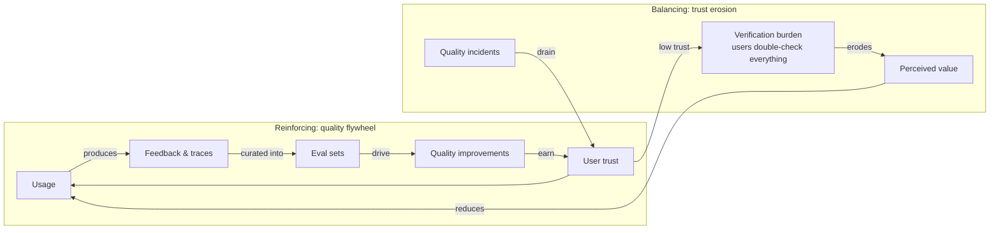

# Chapter 1.2 — Systems Thinking & Design Thinking

| | |
|---|---|
| **Part** | 1 — Professional Foundation |
| **Maturity level** | 1 — Understand |
| **Difficulty** | Beginner |
| **Estimated study time** | 3–4 hours (reading 90 min, exercise 2 h) |
| **Prerequisites** | [Chapter 1.1 — From Software Engineer to Solution Architect](chapter-01-from-engineer-to-architect.md) |

## Learning Objectives

After this chapter you will be able to:

1. Model a business-plus-software situation as a system: stocks, flows, feedback loops, delays, and incentives.
2. Predict second-order effects of an AI intervention before building it, using causal loop sketches.
3. Run a design-thinking loop — empathize, define, ideate, prototype, test — to discover what should be built rather than assuming the first framing is right.
4. Recognize local optimization and metric gaming as system behaviors, not user misbehavior.

## Introduction

Chapter 1.1 argued that the architect's job is decisions, not code. This chapter supplies the two thinking disciplines those decisions depend on. **Systems thinking** is how you predict what a change will actually do once it's embedded in an organization full of incentives, delays, and feedback — instead of what it does in a demo. **Design thinking** is how you discover the right problem before committing a system to the wrong one.

They are complements: design thinking runs *forward* from human needs to a candidate solution; systems thinking runs the candidate *outward* through its consequences. GenAI work needs both more than classical software did, because generative systems change user behavior (people trust, over-trust, then adapt), and because their quality is a moving property of a feedback loop — usage produces data, data produces evals, evals change the system — rather than a fixed property of code.

## Business Motivation

Interventions that ignore system structure reliably produce expensive surprises. The canonical GenAI example: a company deploys a support chatbot targeted on *deflection rate* (tickets that never reach a human). Deflection hits 40% and the dashboard glows — while customers who needed a human churn quietly, repeat-contact rate climbs, and six months later NPS has dropped enough that the support VP is defending the program to the board. The bot did exactly what it was asked; the *system* — metric, incentives, customer adaptation — did the damage. Choosing the right target metric is a one-hour systems-thinking exercise; discovering the wrong one in churn data costs quarters.

The design-thinking failure is quieter but larger: building the wrong thing well. Industry post-mortems of stalled AI pilots repeatedly find the same root cause — the tool solved a problem its buyers had, not one its users had. A two-week discovery phase costs perhaps 5% of a project; rebuilding for the real workflow costs the whole project.

## Theory

### Systems thinking: the core vocabulary

A **system** is a set of elements connected such that they produce their own pattern of behavior over time. The architect's working kit:

- **Stocks and flows.** Stocks are accumulations (open tickets, indexed documents, user trust, eval-set coverage); flows fill or drain them. Most "sudden" crises are stocks that drained slowly — trust erodes one hallucination at a time, then "suddenly" nobody uses the assistant.
- **Feedback loops.** *Reinforcing* loops compound (more usage → more feedback data → better evals → better quality → more usage — the flywheel every AI product wants). *Balancing* loops resist change (faster answers → more questions asked → higher load → slower answers). Every GenAI business case that projects a straight line is ignoring at least one balancing loop.
- **Delays.** Effects arrive late: model quality changes show up in user trust weeks later; trust changes show up in usage months later. Delays cause oscillation and — worse — cause organizations to conclude an intervention "didn't work" and reverse it just before its effect lands.
- **Emergence and local optimization.** System behavior is not the sum of component intentions. Each team optimizing its own metric (deflection, cost per ticket, handle time) can jointly degrade the outcome nobody owns (customer retention). When you see gaming, look for the incentive, not the villain.
- **Leverage points.** Interventions differ enormously in power. Adjusting parameters (temperature, top-k) is weak leverage; changing information flows (showing agents *why* the AI suggested something) is stronger; changing the goal of the system (deflection → resolution) is stronger still.

### Design thinking: the discovery loop

Design thinking is a disciplined loop for problems where the framing itself is uncertain — which describes most enterprise AI initiatives:

1. **Empathize** — observe real users doing the real work. Not interviews about the work; the work. Watch a claims adjuster process a claim before designing their copilot.
2. **Define** — state the problem from the user's perspective with a testable point of view: "Adjusters need to locate policy exclusions in seconds because credibility with claimants dies during silence," not "build a policy chatbot."
3. **Ideate** — generate options wide before narrowing. Include non-AI options; their presence keeps the AI options honest (foreshadowing Chapter 1.4's requirement that every analysis includes "do nothing").
4. **Prototype** — the cheapest artifact that can be wrong: a Wizard-of-Oz test (human plays the AI), a prompt in a playground, a clickable mock. In GenAI, prototyping is anomalously cheap — a prompt *is* a prototype — which is both a gift and a trap (see Common Mistakes).
5. **Test** — put it in front of users and harvest disconfirming evidence. The goal of the loop is to be wrong early and cheaply.

### Where the two disciplines meet

Design thinking finds a promising intervention; systems thinking stress-tests it: *Who adapts when this ships? Which metric will be gamed? Which stock is being drained invisibly? Where are the delays that will be misread as failure?* An architect who runs both habitually produces designs that survive contact with the organization — the quality Chapter 1.1 called system integrity, extended in time.

## Architecture Perspective

Systems thinking turns architecture from a static diagram into a dynamic model. For any GenAI system, draw the *loops*, not just the boxes. The two loops below govern almost every deployed assistant:

Design consequences follow directly: the flywheel only turns if feedback capture is *designed in* (thumbs, edits, escalations wired to traces — Chapter 4.7); the erosion loop means quality incidents must be bounded by guardrails (Chapter 4.8) because trust drains faster than it fills; and the delays in both loops mean leadership must be shown *leading* indicators (eval scores, acceptance rate) or they will judge the system on lagging ones (usage) and kill it during the delay.

## Real-world Example

**Averline Retail Group** (fictional, 900 stores) launched an AI assistant for store associates to answer merchandising and policy questions. Version one was built from headquarters' framing: "associates can't find policy documents." Usage peaked in week two and collapsed by week six.

A two-person team then did what should have come first: three days of store visits. The observation that changed everything — associates never had both hands and eyes free; they were on the floor with customers. Reading a three-paragraph grounded answer on a handheld was worse than shouting to a colleague. The *defined* problem became: "associates need a yes/no-with-source in under five seconds, hands mostly full." Version two led with a one-line answer, source citation behind a tap, and voice input. The team also ran the systems pass: the metric was changed from "questions answered" to "answers accepted without escalation," because the first metric would have rewarded verbose confidence — and a balancing loop was anticipated: as associates trusted the tool, they'd ask harder questions, so quality on the *hard* tail was monitored separately rather than letting the average hide it.

Usage recovered and held. Total cost of the discovery pass: two people, three days, six stores. Total cost of skipping it the first time: a wasted quarter and a burned first impression — the trust stock version two had to refill.

## Hands-on Exercise

**Model an AI intervention as a system.** Pick a GenAI initiative you know (or use CS32, customer care deflection, from the [case-study catalog](../../case-studies/README.md)). ~2 hours.

1. **Loop diagram (45 min).** Draw the system in Mermaid or on paper: at least one reinforcing loop, one balancing loop, one delay, and one stock that could drain invisibly. Label the target metric.
2. **Gaming forecast (30 min).** Write down how each party — users, operators, the vendor, the AI itself via its optimization target — could satisfy the metric while defeating the goal.
3. **Redefine (30 min).** Run a mini design-thinking pass: write the problem statement from the *user's* point of view (one sentence, with a "because" clause). Propose the leading indicators you'd show leadership during the trust delay.
4. **Leverage check (15 min).** List three possible interventions and rank them by leverage (parameter < information flow < goal).

**Acceptance criteria:**
- [ ] Diagram contains a reinforcing loop, a balancing loop, and a marked delay
- [ ] At least three distinct gaming paths identified, each traced to an incentive
- [ ] Problem statement is user-voiced and testable (someone could observe whether it's true)
- [ ] Leading vs. lagging indicators explicitly separated

## Enterprise Considerations

In enterprises, the system you're intervening in includes the org chart. Metrics are attached to bonuses; a deflection target is somebody's OKR, and your proposal to change it is a political act — bring the systems diagram to that meeting, because it depersonalizes the argument. Discovery work (design thinking's empathize phase) often requires works-council or union notification when it involves observing employees, and always requires it when instrumenting their behavior — plan weeks, not days, in regulated or unionized environments (Chapter 6.7 and Chapter 4.14 cover the governance side). Finally, enterprises run on annual budget cycles that punish "we learned the framing was wrong" unless discovery was *scoped in* — sell the two-week discovery phase as de-risking, in the business case itself (Chapter 6.10).

## Trade-offs

| Decision | Option A | Option B | Choose A when… | Choose B when… |
|----------|----------|----------|----------------|----------------|
| Discovery depth | Days of field observation before design | Ship a prototype and learn from usage | Users are hard to re-win (external customers, skeptical professionals) | Users are tolerant insiders and iteration is genuinely cheap |
| Target metric | Outcome metric (resolution, retention) | Activity metric (deflection, volume) | You can measure the outcome, even lagged | Only as a *paired* guardrail metric, never alone |
| Modeling effort | Full causal-loop workshop with stakeholders | Architect sketches loops solo in an hour | The system crosses team boundaries and incentives conflict | Single-team scope, low blast radius |
| Prototype fidelity | Wizard-of-Oz / prompt-only fake | Working vertical slice | Testing the *framing* (do users want this at all?) | Testing feasibility (can the model actually do this?) |

## Common Mistakes

1. **Optimizing a proxy until it detaches from the goal** — deflection, answer volume, and handle time are all proxies; unpaired, each one is an invitation to game. Pair every proxy with the outcome it stands for.
2. **Reading a delay as a failure** — killing the initiative at month two because usage hasn't moved, when the trust loop hasn't had time to turn. Publish expected lag at kickoff so the delay is a prediction, not an excuse.
3. **Empathizing with the buyer instead of the user** — the executive sponsor describes the work as they imagine it; the workflow on the floor is different. Averline's version one was built entirely from the sponsor's description.
4. **Prototype lock-in** — because a prompt demos in an afternoon, the demo becomes the design and discovery never happens. GenAI's cheap prototyping is only an advantage if you throw prototypes away as easily as you make them.
5. **Boxes without loops** — architecture diagrams that show components but not the feedback structure, so the design is evaluated statically and the dynamic failure modes (erosion, gaming, oscillation) are discovered in production.

## Best Practices

1. **Draw the loops before the boxes** — a ten-minute causal sketch at design start catches the metric and incentive problems that no amount of component design fixes.
2. **Pair every target metric with a countervailing guardrail metric** — deflection with repeat-contact rate; acceptance with error-flag rate. Gaming one moves the other.
3. **Watch the work before designing for it** — even one day of observation beats ten stakeholder interviews; the interview describes the process, the observation reveals it.
4. **State the delay** — for every intervention, write down when its effect should be measurable; you're inoculating the initiative against premature judgment.
5. **Include a non-AI option in every ideation round** — it keeps the AI options honest and occasionally wins, which is the cheapest possible project.

## Architecture Checklist

Before committing to a design touching user workflows and metrics:

- [ ] The system's reinforcing and balancing loops are sketched and reviewed
- [ ] The target metric is an outcome (or a proxy explicitly paired with a guardrail metric)
- [ ] Gaming paths per stakeholder have been forecast and mitigations noted
- [ ] Real users were observed (not just interviewed) doing the current work
- [ ] The problem statement is user-voiced and was validated with users
- [ ] Expected measurement delays are documented with leading indicators for the gap
- [ ] Feedback capture (the flywheel's fuel line) is in the design, not deferred

## Interview Questions

1. *"Your support bot's deflection rate is 40% and rising, but NPS is falling. Walk me through your diagnosis."* — Strong answers reach for the system: proxy-goal detachment, who is being deflected, repeat-contact and churn data, and propose a paired-metric fix rather than a bot fix.
2. *"How would you decide what an AI copilot for underwriters should actually do?"* — Strong answers start with observing underwriters work, a user-voiced problem definition, and cheap prototypes to kill bad framings — not with a feature list or a model choice.
3. *"Give an example of a reinforcing loop and a balancing loop in an AI product."* — Strong answers produce the data flywheel and a saturation/erosion loop, with the delays identified and a design consequence drawn from each.
4. *"A stakeholder's bonus is tied to the metric you believe is wrong. What do you do?"* — Strong answers depersonalize via the systems model, propose paired metrics as a transition, and escalate with evidence rather than either capitulating or crusading.

## Further Reading

- Donella Meadows, *Thinking in Systems* — the standard introduction; her "leverage points" essay (donellameadows.org) is the source of this chapter's leverage ranking.
- IDEO / Stanford d.school, *Design Thinking Bootleg* (dschool.stanford.edu) — the canonical, free reference for the five-mode loop.
- Goodhart's law literature — start with Marilyn Strathern's formulation ("when a measure becomes a target, it ceases to be a good measure") and map it onto every AI metric you own.
- John Gall, *Systemantics* — short, funny, and permanently useful on why complex systems built from scratch fail ("a complex system that works is invariably found to have evolved from a simple system that worked").

## Summary

- **Systems thinking predicts what your design does after the organization reacts to it**: stocks (trust), flows, reinforcing loops (data flywheel), balancing loops (erosion, saturation), delays, and incentive-driven gaming.
- **Design thinking discovers the right problem** through observation, user-voiced definition, wide ideation, and prototypes cheap enough to throw away.
- GenAI needs both disciplines unusually badly: its quality lives in a feedback loop, its prototypes are seductively cheap, and its metrics are unusually gameable.
- **Pair every proxy metric with a guardrail metric**, publish expected delays, and design the feedback fuel line in from day one.
- The deliverables of this chapter's thinking — loop diagrams, user-voiced problem statements, paired metrics — feed directly into trade-off analysis (Chapter 1.4) and requirements (Chapter 1.6).

---

**Previous:** [1.1 From Software Engineer to Solution Architect](chapter-01-from-engineer-to-architect.md) · **Next:** [Chapter 1.3 — Business Understanding for Architects](chapter-03-business-understanding.md) · **Related:** [1.4 Trade-off Analysis](chapter-04-tradeoff-analysis.md), [4.7 Evaluation Systems](../part-4-enterprise-genai-systems/chapter-07-evaluation-systems.md), [7.10 Anti-patterns](../part-7-enterprise-ai-architecture-patterns/chapter-10-anti-patterns.md)
