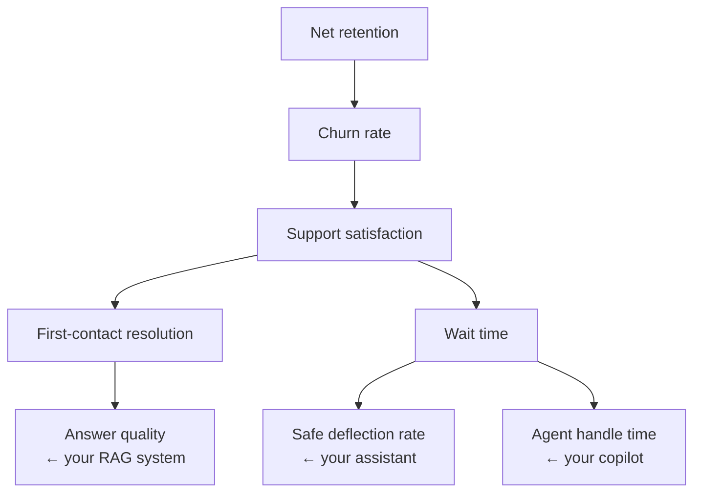

# Chapter 1.3 — Business Understanding for Architects

| | |
|---|---|
| **Part** | 1 — Professional Foundation |
| **Maturity level** | 1 — Understand |
| **Difficulty** | Beginner |
| **Estimated study time** | 3–4 hours (reading 90 min, exercise 2 h) |
| **Prerequisites** | [Chapter 1.1](chapter-01-from-engineer-to-architect.md); [Chapter 1.2](chapter-02-systems-thinking-design-thinking.md) |

## Learning Objectives

After this chapter you will be able to:

1. Read an income statement well enough to locate where a proposed AI system touches revenue, cost, or risk.
2. Build a KPI tree connecting a technical capability to a financial outcome an executive already cares about.
3. Use the language of business cases — OPEX/CAPEX, unit economics, payback period, risk-adjusted return — accurately in design discussions.
4. Classify any AI initiative as a revenue play, a cost play, or a risk play, and know how each is judged differently.

## Introduction

Architects who can't follow the money design in the dark. Every constraint you will negotiate — latency budgets, model tier, compliance scope, headcount — is downstream of a business logic that someone in the room holds and you need to hold too. This chapter is not an MBA compression; it is the specific subset of business literacy that changes architectural decisions: where money enters and leaves the company, how initiatives are judged, and how to speak about your designs in those terms.

The payoff is concrete. The architect who says "this reduces average handle time by 90 seconds" is reporting a technical fact. The architect who says "90 seconds off handle time is roughly $2.1M/year at our contact volume, which pays back the platform in five months" has made the same fact *decidable*. Chapter 1.7 will teach the estimation mechanics; this chapter teaches the map of the business those numbers live in.

## Business Motivation

The motivation here is reflexive: this chapter *is* the business motivation skill. But there is a specific, expensive failure it prevents — the **orphaned initiative**. AI projects funded on enthusiasm ("we need an AI strategy") rather than on a line in someone's P&L are the first to die in a budget cycle, regardless of technical quality, because no owner loses anything when they're cut. Industry surveys of stalled GenAI pilots consistently find the majority never had a quantified business owner. An architect who insists on locating every initiative in the P&L — *whose* number does this move, by how much, and who signed up for that — is doing more for the project's survival than any technology choice will.

## Theory

### The income statement as a map

You need three lines and their neighborhoods:

- **Revenue** — what customers pay. AI touches it through conversion (more visitors buy), retention/churn (customers stay longer), capacity (sell more without hiring), and new offerings. Revenue plays are judged on *growth* and are forgiven higher risk.
- **Cost of revenue / operating expense** — what it takes to earn and run. AI touches it through automation (fewer hours per unit of work), deflection, error reduction, and cycle-time compression. Cost plays are judged on *payback period* and demand harder evidence, because the baseline is measurable.
- **Risk (off the statement, on the balance sheet's nightmares)** — fines, incidents, lawsuits, brand damage. AI touches it both ways: it can reduce risk (consistent compliance checks at scale) and *be* the risk (hallucinated advice, data exposure). Risk plays are judged on avoided-loss expectation — probability × impact — and on regulator credibility.

Every AI initiative you will ever architect is one of these three plays, sometimes two. Identify which, first, because the play determines the evidence standard, the metrics, and the executive who owns it.

### Unit economics: the architect's bridge

Unit economics restate the business per unit of work: cost per ticket, revenue per order, cost per claim processed. They are the natural meeting point between architecture and finance because your design decisions move them directly and calculably:

> cost per conversation = (tokens per conversation × price per token) + amortized platform cost per conversation + human escalation rate × cost per escalation

Every term in that equation is an architectural lever (prompt size, model tier, caching, guardrail-driven escalation policy) — which is why Chapter 4.11 (Cost Engineering) is really applied unit economics. An architect fluent in unit economics can answer the only cost question executives actually ask: *what does one more customer/document/conversation cost us, and what's the trend?*

### The KPI tree

A KPI tree decomposes an executive-level number into factors until you reach quantities a system can move:

The tree does three jobs: it locates your system in a chain of numbers the business already tracks; it exposes the assumptions between your metric and the money (each edge is a claimed causal link — systems thinking from Chapter 1.2 applies); and it gives you the *leading indicators* to report while the financial effect is still in its delay.

### Business-case vocabulary that changes designs

- **OPEX vs. CAPEX** — ongoing spend vs. capitalizable investment. Inference is OPEX, and OPEX scrutiny is continuous; a design that trades build cost for inference cost is moving money somewhere it will be examined monthly. CFO preferences here legitimately shape build-vs-buy decisions.
- **Payback period & ROI** — how fast the investment returns, and how much. Cost plays under ~12-month payback are easy approvals; over 24 months they need strategic framing.
- **Risk-adjusted value** — expected value discounted by probability of achieving it. This is why phased delivery (Chapter 6.10) beats big-bang in business terms, not just engineering terms: each phase converts risk into evidence and re-rates the remaining plan.
- **Opportunity cost** — every architect-hour and GPU-dollar has an alternative use; "is this the best use of the team" is a legitimate architecture question and review boards will ask it.

### Value chains: knowing whose workflow you're in

A value chain traces how the company turns inputs into paid outcomes (insurer: acquire → underwrite → service → handle claims → renew). Locating your system on the chain tells you its blast radius and its evidence standard: an underwriting copilot sits on a step that prices risk — errors compound into the loss ratio for years; a marketing-copy generator sits on a step where errors cost a rewrite. Same technology, different architectures, because the value chain position sets the stakes (this is why the [case studies](../../case-studies/README.md) always name the industry and workflow).

## Architecture Perspective

Business understanding enters the architecture through the **quality-cost-risk budget** every GenAI design must allocate. The play type sets the budget:

| Play type | Quality bar | Cost posture | Risk posture | Typical architecture consequence |
|---|---|---|---|---|
| Revenue (conversion, capacity) | Good enough to delight | Spend for latency & quality | Moderate | Larger models, streaming UX, aggressive caching for speed |
| Cost (automation, deflection) | Must beat human baseline *measurably* | Unit cost is the product | Low tolerance — errors eat the savings | Model tiering, batch lanes, strong evals as the ROI evidence |
| Risk (compliance, consistency) | Extremely high on the guarded dimension | Secondary | The point of the system | Human-in-the-loop, audit trails, conservative refusal behavior |

An architect who knows the play can defend a design's asymmetries: why the compliance assistant refuses aggressively (risk play — a wrong answer costs more than no answer), while the shopping assistant almost never refuses (revenue play — friction costs conversions). Without the play, these look like inconsistent taste; with it, they're derived positions.

## Real-world Example

**Bellhaven Insurance** (fictional, mid-size commercial insurer) had two GenAI proposals competing for the same budget. Proposal A: a claims-summarization copilot, pitched as "modernizing claims with AI." Proposal B: a submission-intake extractor for underwriting, pitched by an architect, Tomás, who had done the P&L homework.

Tomás's pitch was a KPI tree. Bellhaven's growth constraint was underwriting capacity: brokers submitted more risks than underwriters could quote, and unquoted submissions went to competitors — a *revenue* problem. Submission intake (re-keying broker PDFs into the rating system) consumed ~35% of underwriter time. His chain: extraction system → 35% intake time recovered → ~50% more submissions quoted → at Bellhaven's historical quote-to-bind rate, ~$14M additional premium/year — against a $600K build and ~$8K/month run cost. He also classified it honestly: a revenue play through a capacity mechanism, with a cost-play evidence standard on the extraction quality (underwriters would verify fields, so errors cost trust and time, not mispriced risk — that design decision, human-verified fields rather than straight-through processing, came *from* the value-chain stakes analysis).

Proposal A had a real benefit too, but its sponsor couldn't say whose number it moved. B was funded, shipped, and the intake-time metric became the department's own KPI. The architecture was almost the easy part; the business location of the system was the decision.

## Hands-on Exercise

**Locate a GenAI system in a real business.** ~2 hours. Pick a public company you know (or your employer).

1. **P&L skim (30 min).** From the latest annual report, extract: revenue, cost of revenue, operating expenses, operating margin. One sentence: what is the expensive thing this company does?
2. **KPI tree (45 min).** Choose one plausible GenAI use case for this company. Build the tree from an executive metric down to the system metric your design would move. Mark each edge with its causal assumption.
3. **Classify the play (15 min).** Revenue, cost, or risk? State the evidence standard and payback expectation that follow.
4. **Unit economics sketch (30 min).** Write the cost-per-unit equation for your use case with guessed-but-stated numbers (token math from [Chapter 1.7](chapter-07-estimation.md) can refine later). Identify which term your architecture controls most.

**Acceptance criteria:**
- [ ] KPI tree reaches an executive metric that appears (or clearly rolls up) in the actual annual report
- [ ] Every tree edge has a written causal assumption someone could challenge
- [ ] Play classification includes the judgment standard (growth / payback / avoided loss)
- [ ] Unit-cost equation has all assumptions stated with numbers, however rough

## Enterprise Considerations

Three enterprise realities shape how this literacy gets used. **Budget cycles:** initiatives are funded annually; an architect who can restate a design's value in the sponsor's budget language, at the right time of year, ships more systems than a better architect who can't. **Benefits realization:** large organizations increasingly audit whether promised savings appeared — the KPI tree you pitch becomes the measurement contract you live with, so build the telemetry for it into the system (Chapter 4.10). **Chargeback politics:** when your platform's inference costs are charged back to consuming departments (Chapter 7.9), unit economics stop being analysis and become invoices; expect every term of your cost equation to be negotiated, and design metering in from the start.

## Trade-offs

| Decision | Option A | Option B | Choose A when… | Choose B when… |
|----------|----------|----------|----------------|----------------|
| Value framing | Hard financial case (defensible numbers) | Strategic/capability case | The play is cost or near-term revenue | Genuine option value (platform, learning) — but cap the spend accordingly |
| Benefit claim | Conservative, telemetry-backed | Ambitious, assumption-heavy | You'll be audited against it (you will) | Competing for attention pre-funding — then convert to A before build |
| Where savings go | Headcount reduction | Capacity redeployment | Only when leadership has already decided it | Almost always — it's truer (work expands) and doesn't poison user adoption |
| Optimization target | Unit cost | Total value per unit | Volume is fixed, margins thin | Quality improvements change the outcome value (most revenue plays) |

## Common Mistakes

1. **Pitching activity instead of money** — "the assistant answered 40,000 questions" is activity; nobody budgets for activity. Always finish the chain: questions → time → capacity → number on the statement.
2. **Claiming headcount savings that users will hear about** — the fastest way to kill adoption is a business case that tells users the tool exists to eliminate them. Frame (and usually mean) capacity redeployment.
3. **One KPI tree edge doing all the work** — trees with a heroic causal link ("better answers → 2 points of NPS → $30M retention") get demolished in review. Instrument the weak edge or weaken the claim.
4. **Ignoring the play type** — bringing a revenue play's optimism to a cost play's review (where the CFO has the baseline numbers) or a cost play's caution to a land-grab revenue moment.
5. **Treating finance as the enemy of quality** — the finance partner who stress-tests your unit economics before funding is saving you from the month-three inference-bill ambush (Chapter 1.1's Nordgren case). Recruit them early.

## Best Practices

1. **Name the number and its owner before designing** — "this system exists to move [metric] owned by [name]" is the first line of the architecture document; if it can't be written, stop.
2. **Carry a one-line unit-economics model of every system you own** — updated from real telemetry, ready for any hallway executive encounter.
3. **Report leading indicators against the KPI tree during the value delay** — eval scores and acceptance rates now, financial effect at the promised lag (Chapter 1.2's delay discipline).
4. **Read your company's (or client's) last annual report** — two hours that make every subsequent conversation with sponsors measurably sharper; repeat yearly.
5. **Put the business case under version control next to the architecture** — when reality diverges, revise both together; a stale business case is a stale requirement set.

## Architecture Checklist

Before design work begins on any AI initiative:

- [ ] The initiative is classified: revenue, cost, or risk play — and the evidence standard matches
- [ ] A KPI tree connects the system metric to an executive metric, with assumptions written on the edges
- [ ] A named business owner has agreed to the target number
- [ ] Unit economics are modeled with stated assumptions; the architecture's biggest cost lever is identified
- [ ] Telemetry to *prove* the benefit is in the design, not deferred
- [ ] The value delay is stated, with leading indicators chosen for the gap

## Interview Questions

1. *"How would you build the business case for a RAG-based knowledge assistant?"* — Strong answers classify the play, build the KPI chain to a real financial line, state unit economics with token math, and include the measurement plan — not just "saves employees time."
2. *"Your CFO asks why the inference bill doubled last month. Walk me through your answer."* — Strong answers reach for unit economics: did volume double (good news if it's a revenue play) or did cost-per-unit double (a design regression — caching, prompt growth, model routing)? The decomposition *is* the answer.
3. *"When is a technically inferior design the right business decision?"* — Strong answers produce a concrete trade: e.g., a smaller model missing 3% of hard cases but enabling a unit cost that makes the whole play viable, with the 3% routed to humans.
4. *"What's the difference between how you'd justify a compliance-checking AI and a sales-assist AI?"* — Strong answers contrast risk-play logic (avoided loss, regulator credibility, refusal-heavy design) with revenue-play logic (growth, conversion, friction-averse design).

## Further Reading

- Karen Berman & Joe Knight, *Financial Intelligence* — the standard "finance for non-financial managers" text; read the income statement and ratio chapters, skip nothing else matters as much.
- Your target company's latest annual report (10-K for US-listed firms, sec.gov/EDGAR) — the only reading on this list that changes *this week's* conversations.
- Douglas Hubbard, *How to Measure Anything* — the antidote to "intangible benefits"; pairs with Chapter 1.7's estimation methods.
- Marty Cagan, *Inspired* — for the product lens on value discovery that complements this chapter's financial lens.

## Summary

- Every AI initiative is a **revenue play, cost play, or risk play**; the classification sets the evidence standard, the metrics, and the design's quality-cost-risk budget.
- **KPI trees** connect your system's metric to a number executives already track — and become both the pitch and the measurement contract.
- **Unit economics** are the bridge between architecture and finance: every term of cost-per-unit is a design lever, and Chapter 4.11 is this idea industrialized.
- Fund-ability failures kill more AI projects than technical failures: **name the number and its owner** before designing, and build the proof telemetry into the system.
- Value-chain position sets the stakes: the same technology needs different architectures depending on whose workflow, and whose losses, it touches.

---

**Previous:** [1.2 Systems Thinking & Design Thinking](chapter-02-systems-thinking-design-thinking.md) · **Next:** [Chapter 1.4 — Trade-off Analysis & Decision Making](chapter-04-tradeoff-analysis.md) · **Related:** [1.7 Estimation](chapter-07-estimation.md), [4.11 Cost Engineering](../part-4-enterprise-genai-systems/chapter-11-cost-engineering.md), [6.10 TCO & the Business Case](../part-6-enterprise-architecture/chapter-10-tco-business-case.md)
