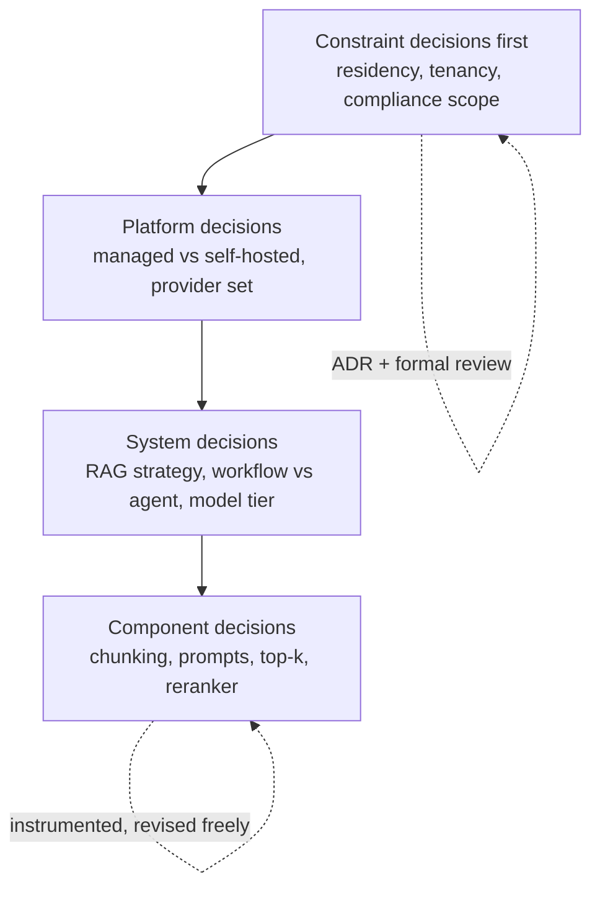

# Chapter 1.4 — Trade-off Analysis & Decision Making

| | |
|---|---|
| **Part** | 1 — Professional Foundation |
| **Maturity level** | 2 — Build |
| **Difficulty** | Intermediate |
| **Estimated study time** | 4–5 hours (reading 2 h, exercise 2–3 h) |
| **Prerequisites** | [Chapter 1.1](chapter-01-from-engineer-to-architect.md); [Chapter 1.3](chapter-03-business-understanding.md) |

## Learning Objectives

After this chapter you will be able to:

1. Produce a written trade-off analysis — options, criteria, evidence, decision — that a CTO would sign.
2. Classify decisions by reversibility and blast radius, and match analysis effort to the classification.
3. Use quality attributes (latency, cost, accuracy, security, operability) as the criteria vocabulary for GenAI decisions.
4. Detect and defuse the standard decision pathologies: analysis paralysis, decision by fatigue, HiPPO capture, and post-hoc rationalization.

## Introduction

If Chapter 1.1 defined the architect's unit of work as *a justified decision*, this chapter is the manufacturing process. Trade-off analysis is not a document format; it is the discipline of making the disagreement explicit — what we optimize, what we sacrifice, and why this option's sacrifices are the ones we can afford. Done well, it converts architecture from a taste contest into an evidence process that survives the departure of the person who made it.

GenAI multiplies the need. Classical software decisions often had converging best practices; GenAI decisions rarely do. Model choice, prompting vs. RAG vs. fine-tuning, workflow vs. agent, managed API vs. self-hosted — each is a genuine multi-way trade with the answer dependent on your constraints. An architect without a trade-off method either freezes or guesses. This chapter gives you the method; nearly every later chapter's *Trade-offs* section is an application of it.

## Business Motivation

Organizations pay for decision quality twice: once in the outcome, and once in the *speed and reusability* of the deciding. A mid-size enterprise typically spends 4–8 weeks converging on its first "which LLM provider" decision, mostly in meetings re-litigating opinions. A written trade-off analysis with explicit criteria compresses that to days — and the *next* model decision (they recur quarterly, as providers ship) reuses the criteria and the bake-off harness, taking hours. Multiply across the dozens of consequential decisions in an AI program and decision method is worth engineer-years.

The reverse case is sharper: undocumented decisions get re-made. A platform team that chose its vector database for defensible reasons but wrote nothing down will fight the same battle every time a new stakeholder arrives with a preference — and may lose it, paying a migration for nothing. The ADR (Chapter 1.1, [templates](../../templates/adr-template.md)) is cheap insurance against decision churn.

## Theory

### The anatomy of a trade-off analysis

Five parts, in order, each doing distinct work:

1. **The decision, framed.** One sentence, phrased as a choice with stakes: "Choose the retrieval strategy for the claims assistant, given a 2-second latency budget and PHI constraints." Framing smuggles in half the answer — a decision framed as "which vector DB" has already excluded hybrid search and managed retrieval; frame at the *problem* level, not the product level.
2. **Options — including the null.** Three to five real options. Fewer than three means you're rationalizing a foregone conclusion; more than five means you haven't done the pre-filtering that is also your job. Always include *do nothing* or *the boring option* — its presence calibrates the others and occasionally wins.
3. **Criteria, weighted, from stakes.** Criteria come from the quality attributes the business case (Chapter 1.3) makes important — not from what's easy to measure. Weight them *before* scoring options, in writing, or the weights will quietly bend toward your favorite.
4. **Evidence per cell.** Scores need provenance: a measured benchmark, a vendor document, an estimate with stated assumptions, or an honest "unknown — spike needed." The evidence column is what separates analysis from opinion arranged in a grid.
5. **The decision and its losers.** State what you chose, what you gave up, and the conditions that would reopen it ("revisit if p95 latency exceeds 3s at 10× volume"). Naming the sacrifice is the credibility move: a recommendation without a stated cost reads as advocacy.

### Reversibility: the master variable

Match analysis effort to the cost of being wrong:

- **Two-way doors** (reversible cheaply): prompt structure, top-k, most library choices, model *within* a provider. Decide fast, instrument, revise. A week of analysis on a two-way door is waste.
- **One-way doors** (expensive to reverse): data residency and processing region, tenancy model, PII entering third-party systems, core platform commitments, anything contractual or regulatory. These deserve the full apparatus — written analysis, spikes to convert unknowns into evidence, formal review.
- **Doors that look two-way but aren't:** the escape hatch that erodes. "We can always swap the model" is true on day one and false after a year of prompt tuning, eval baselines, and behavioral quirks baked into the UX. Reversibility decays with integration depth; audit it, don't assume it.

Blast radius is the second axis: a reversible decision that touches every team (a naming convention, a shared prompt registry schema) still deserves deliberateness, because reversal costs coordination even when it's technically cheap.

### Quality attributes: the criteria vocabulary

Architecture trade-offs are trades *between quality attributes*. For GenAI systems the recurring set is: **task quality** (accuracy/faithfulness, per evals), **latency**, **unit cost**, **security & privacy posture**, **operability** (can you debug, monitor, roll back), **flexibility** (cost of the next change), and **time-to-ship**. Two disciplines make them useful. First, make each concrete as a scenario, not an adjective: not "scalable," but "handles Monday 9am peak of 40 req/s at p95 < 2s without manual intervention." Second, accept that they conflict *structurally* — quality wants bigger models, cost wants smaller, latency wants less retrieval, faithfulness wants more. The conflicts are the analysis; a proposal that claims to optimize everything hasn't been analyzed.

### Decision pathologies

- **Analysis paralysis** — usually a misclassified two-way door, or a missing decision owner. Fix with reversibility triage and a named decider with a date.
- **HiPPO capture** (highest-paid person's opinion) — the analysis exists to decorate a conclusion. Fix by getting criteria and weights agreed *before* options are scored, ideally before the HiPPO has a favorite.
- **Decision by fatigue** — the last option standing in week six wins. A symptom of missing weights; the criteria fight was never resolved, so it re-fights through every option.
- **Post-hoc rationalization** — the matrix built after the choice. Sometimes honest (documenting an intuition for review); corrosive when disguised. If you're doing it, label it: "decision made on X grounds; this analysis stress-tests it."
- **Score laundering** — false precision (7.3 vs 7.1) hiding judgment calls. Use coarse scales (strong/adequate/weak) and put the reasoning in the evidence column where it can be attacked.

## Architecture Perspective

Trade-off analysis is the *engine* of the decision chain from Chapter 1.1 — it's the box between options and ADRs. Architecturally, the practice shapes systems in a specific way: **decisions cluster, and early ones constrain late ones.** Choosing managed model APIs (vs. self-hosting) constrains the data-residency options; the residency answer constrains which providers are in the next bake-off; the provider constrains the tool-calling design. Good architects therefore sequence decisions deliberately — one-way doors and constraint-setters first, preference decisions last:

The diagram is also an effort map: apparatus-heavy analysis at the top, decide-and-instrument at the bottom. Teams that invert this — weeks debating chunk size while the tenancy model drifts undecided — are spending their analysis budget where it buys nothing.

## Real-world Example

**Corvid Logistics** (fictional, European 3PL) needed document extraction for customs paperwork: 60K documents/month, 14 languages, hard error costs (a wrong tariff code triggers customs penalties). The architect, Lena, ran the method under a three-week deadline pressure to "just use the big model API like the pilot did."

She framed at problem level: *choose the extraction strategy* (not "which model"). Options: (1) large frontier model per document; (2) tiered — small model with confidence-based escalation to large; (3) fine-tuned compact model, self-hosted; (4) the incumbent OCR+rules vendor (the boring option). Criteria weighted from the business case: field-level accuracy on the penalty-bearing fields (0.35), unit cost at 60K/month (0.25), EU data processing (0.20 — a *gate*, not a weight: options failing it are out regardless of score), operability with a 4-person team (0.10), time-to-ship (0.10).

The evidence pass changed the decision twice. A 400-document golden set (two days to build — the spike that mattered) showed the frontier model's accuracy advantage was concentrated in three languages; the tiered option matched it elsewhere at 30% of the cost. Then the self-hosted option — her initial favorite — failed the operability criterion honestly scored: the team had no GPU-ops experience, and the analysis said so in writing. Decision: option 2, with the three hard languages routed straight to the large model; revisit trigger written down (if volume passes 150K/month, re-price option 3 including a hired ML engineer). The losing options' scores were kept in the ADR. Eight months later a new VP arrived advocating self-hosting; the re-litigation took one meeting, because the analysis was sitting there with its assumptions labeled — two had changed, they re-scored those cells, and the decision held.

## Hands-on Exercise

**Write a real trade-off analysis.** Pick a live decision — from your job, or "choose the model strategy for [P06](../../projects/README.md)". ~2–3 hours.

1. **Frame and classify (20 min).** One-sentence decision framing at problem level. Classify: one-way or two-way door? Blast radius? State the analysis effort this justifies.
2. **Options (30 min).** 3–5 including the null/boring option. One paragraph each: what it is, its characteristic sacrifice.
3. **Criteria before scores (30 min).** Derive criteria from stakes (Chapter 1.3's play type helps). Weight them. Mark any *gates*. Get one other person to challenge the weights **before** you score.
4. **Evidence grid (60 min).** Score coarsely; fill the evidence column for every cell. Mark cells that need a spike, and define the cheapest spike that would settle each.
5. **Decide and record (30 min).** Decision, named sacrifices, revisit triggers. Compress to ADR form ([template](../../templates/adr-template.md)).

**Acceptance criteria:**
- [ ] Framing is at problem level (a product name doesn't appear in the decision sentence)
- [ ] Null/boring option present and honestly scored
- [ ] Weights were reviewed by someone else before scoring
- [ ] Every score has evidence or an explicit "spike needed" with the spike defined
- [ ] Decision section names what was sacrificed and the reopen conditions

## Enterprise Considerations

In enterprises, trade-off analyses are also *political documents*: they allocate wins and losses between teams. Expect stakeholders to fight at the weights (the legitimate venue) and at the framing (watch for scope capture — "the decision is which of my team's two options"). Formal governance (Chapter 6.9) will demand this artifact at review boards; producing it unprompted is how architects build the trust ledger from Chapter 1.1. Procurement adds constraints — scored criteria may be contractually required for vendor selection, and your analysis can become part of an auditable record in regulated industries (Chapter 4.14), so write every cell as if a regulator will read it. Finally: enterprises have decision *inventories* — many past one-way doors (approved vendor lists, cloud commitments, data classifications) are standing constraints; discover them before analyzing, not after (Chapter 6.1).

## Trade-offs

The method applied to itself:

| Decision | Option A | Option B | Choose A when… | Choose B when… |
|----------|----------|----------|----------------|----------------|
| Analysis depth | Full written analysis + spikes | Decide now, instrument, revise | One-way door or wide blast radius | Two-way door — most component-level GenAI choices |
| Criteria agreement | Negotiate weights with all stakeholders first | Architect sets weights, invites challenge | Contested decision, political heat | Time-critical, trust established, low contention |
| Unknowns | Spike to convert to evidence | Score conservatively and proceed | The unknown cell could flip the decision | It couldn't — don't spike what doesn't matter |
| Decision authority | Consensus | Named decider, consulted stakeholders | Genuinely shared ownership, small group | Default — consensus scales terribly and breeds fatigue decisions |

## Common Mistakes

1. **Framing at product level** — "Pinecone vs. Weaviate" when the decision was "do we need a dedicated vector DB at all" (often: no — Chapter 5.6). The frame excluded the winner.
2. **Weights after scores** — the most common corruption, usually unconscious. The favorite option's strengths mysteriously become the important criteria. Sequence is the safeguard.
3. **Treating gates as weights** — averaging a compliance failure into a high overall score. Requirements that must hold are pass/fail filters *before* the matrix, not columns in it.
4. **Spiking for comfort, not consequence** — running benchmarks on cells that can't change the outcome while the decisive unknown stays unexamined. Ask of every spike: which decision does this flip?
5. **Deciding without a revisit trigger** — conditions change and un-triggered decisions either ossify (constraining everything downstream past their validity) or churn (re-litigated on every personnel change). The trigger is one sentence; write it.
6. **Confusing speed with courage on one-way doors** — "bias for action" is a two-way-door virtue. Applied to residency or tenancy decisions it's just gambling with someone else's cleanup budget.

## Best Practices

1. **Triage by reversibility first** — before any analysis, ask "what does it cost to be wrong?"; let the answer set the process. This single habit eliminates both paralysis and recklessness.
2. **Criteria and weights in writing before options are scored** — and socialized with whoever must live with the decision.
3. **Build the golden set early** — for GenAI decisions, a few hundred labeled examples (Chapter 4.7) is the spike that converts model-choice debates from opinion to measurement; it's reusable for every future bake-off.
4. **Keep the losers** — record rejected options and why in the ADR; it's the vaccine against re-litigation and the syllabus for your successors.
5. **Audit your escape hatches quarterly** — for every "we can always switch later" in your decision record, check whether it's still true and what it now costs.
6. **State your recommendation** — an analysis that ends "it depends" outsources your job to the reader. Weigh, decide, recommend, and show the sacrifice.

## Architecture Checklist

For any consequential decision on your project right now:

- [ ] Reversibility and blast radius classified; analysis effort matches
- [ ] Framed at problem level, with the stakes in the framing sentence
- [ ] ≥3 options including the boring one; gates separated from weighted criteria
- [ ] Weights fixed and socialized before scoring
- [ ] Decision-flipping unknowns spiked; others left alone
- [ ] ADR written: decision, sacrifices, losers, revisit triggers
- [ ] Downstream decisions this one constrains are identified and sequenced

## Interview Questions

1. *"Walk me through a significant technical decision you made. How did you decide?"* — Strong answers exhibit the machinery unprompted: options considered, criteria from business stakes, evidence gathered, what was sacrificed, how it was recorded. Weak answers narrate a conclusion.
2. *"How would you choose between prompting, RAG, and fine-tuning for a use case?"* — Strong answers refuse to answer in the abstract: they name the criteria (knowledge freshness, behavior vs. knowledge gap, data volume, unit cost, team capability), the gates, and the cheap experiments that settle it (full framework in Chapter 4.13).
3. *"Your team spent three weeks debating chunk size while the data-residency question sits open. Diagnose."* — Strong answers name the inverted effort map: analysis budget spent on a two-way door while a one-way door drifts; prescribe reversibility triage and a decider with a date.
4. *"A senior stakeholder wants option X and asks you to 'write it up.' What do you do?"* — Strong answers neither refuse nor launder: negotiate criteria and weights first, score honestly, and if X wins, fine — if it doesn't, the analysis is the professional way to say so (and label a post-hoc stress-test as what it is).

## Further Reading

- Jeff Bezos, 2015 Amazon shareholder letter (aboutamazon.com) — the origin of the one-way/two-way door framing; three paragraphs that will structure your whole practice.
- *Software Architecture in Practice* (Bass, Clements, Kazman) — quality-attribute scenarios and the ATAM method; this chapter is a field-weight version of that apparatus.
- Michael Nygard, *Documenting Architecture Decisions* — the ADR essay, re-linked from Chapter 1.1 because this chapter is where you start writing them weekly.
- Annie Duke, *Thinking in Bets* — decision quality vs. outcome quality under uncertainty; the mindset for defending good decisions that got unlucky.

## Summary

- A trade-off analysis is five parts: **problem-level framing, options including the null, pre-committed weighted criteria, evidence per score, and a decision that names its sacrifices and revisit triggers**.
- **Reversibility is the master variable**: full apparatus for one-way doors, decide-and-instrument for two-way doors — and audit escape hatches, because reversibility decays with integration depth.
- Quality attributes are the criteria vocabulary; their structural conflicts (quality vs. cost vs. latency) *are* the analysis.
- Sequence decisions constraint-first: residency, tenancy, and platform before components — the effort map follows the same order.
- The pathologies — paralysis, HiPPO capture, fatigue, laundering — are all defeated by the same safeguard: **criteria and weights fixed, in writing, before options are scored**.
- Output format is the ADR; keep the losers, and the decision stops being re-made every quarter.

---

**Previous:** [1.3 Business Understanding for Architects](chapter-03-business-understanding.md) · **Next:** [Chapter 1.5 — Communicating Architecture](chapter-05-communicating-architecture.md) · **Related:** [4.13 Prompting vs. RAG vs. Fine-tuning](../part-4-enterprise-genai-systems/chapter-13-prompting-rag-finetuning.md), [3.10 Model Selection & Benchmarking](../part-3-core-building-blocks-of-genai/chapter-10-model-selection-benchmarking.md), [ADR template](../../templates/adr-template.md)
