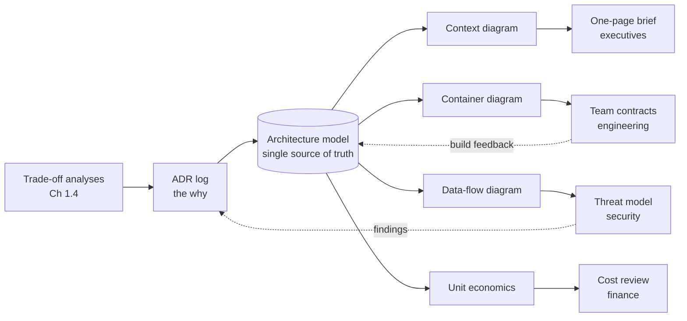

# Chapter 1.5 — Communicating Architecture

| | |
|---|---|
| **Part** | 1 — Professional Foundation |
| **Maturity level** | 2 — Build |
| **Difficulty** | Intermediate |
| **Estimated study time** | 4 hours (reading 90 min, exercise 2.5 h) |
| **Prerequisites** | [Chapter 1.1](chapter-01-from-engineer-to-architect.md); [Chapter 1.4](chapter-04-tradeoff-analysis.md) |

## Learning Objectives

After this chapter you will be able to:

1. Choose the right artifact per audience: one-page brief for executives, C4-style diagrams for engineers, ADRs for reviewers, threat/cost models for specialists.
2. Produce a C4 context and container diagram for a GenAI system in Mermaid.
3. Structure any architecture document with SCQA (Situation–Complication–Question–Answer) so the decision arrives before the reader's patience runs out.
4. Treat diagrams as claims: every box, arrow, and boundary is an assertion someone can verify or refute.

## Introduction

Chapter 1.1 named communication one of the architect's three currencies and made a blunt claim: a design that lives only in your head has zero organizational value. This chapter turns that claim into craft. Architecture communication is not "writing up" a finished design — it is how the design gets *tested* (reviewers attack what they can see), *decided* (sign-offs attach to artifacts, not conversations), and *executed* (five teams build from the same picture or from five different memories of a meeting).

The failure mode this chapter targets is producing the right content in the wrong form: the sixty-page design document nobody reads, the whiteboard photo that becomes load-bearing infrastructure, the executive briefing that opens with a component inventory. The craft is matching artifact to audience and question — and GenAI raises the difficulty, because your audiences now include people reasoning about probabilistic behavior for the first time, and your diagrams must show things classical notation never had to: model calls, trust boundaries around untrusted content, feedback loops.

## Business Motivation

Communication failures bill by the team-month. The common case: an architecture agreed verbally in a kickoff drifts as three teams implement three recollections of it; integration reveals the divergence at month four. A container diagram plus ten ADRs — perhaps three days of architect time — is the cheap alternative to a month of rework and a missed quarter. The executive version of the same failure: initiatives lose funding not because the architecture was wrong but because the sponsor couldn't re-explain it to their peers. Your one-page brief is literally the artifact your sponsor uses to defend your budget in rooms you're not in; if it doesn't exist, they improvise, and improvisations lose to whoever brought a crisp page. Review latency is the third bill: security and compliance reviews (mandatory for GenAI systems touching customer data) turn around in days when the threat model and data-flow diagram arrive prepared, and in months when reviewers must extract the design interrogatively.

## Theory

### The audience–artifact matrix

Every audience arrives with one governing question. Serve the question, not your enthusiasm:

| Audience | Their question | Artifact | Fatal error |
|---|---|---|---|
| Executives / sponsors | Should this proceed, and what do I tell my peers? | One-page brief (SCQA) | Component detail; unexplained jargon |
| Engineering teams | What do I build and where are my boundaries? | C4 container/component diagrams + ADRs + interface contracts | Vagueness at the seams between teams |
| Security & compliance | What can go wrong and who accepted it? | Data-flow diagram, threat model, control mapping | Prose assurances instead of diagrams and evidence |
| Finance | What does it cost at scale and when do we know? | Unit-economics model (Chapter 1.3) with assumptions | Point estimates without assumptions |
| Review boards | Was this decided well? | Trade-off analysis + ADRs (Chapter 1.4) | Presenting the conclusion without the losers |
| Future maintainers | Why is it like this? | The ADR log, kept honest | Documentation of *what* with no *why* |

One design, many projections. The architect maintains a single source of truth (the model in the repo) and *derives* audience views from it — never forks it.

### C4: altitude control for diagrams

The C4 model's insight is that diagram chaos is usually altitude mixing — a cloud icon, a class name, and a department on one canvas. C4 fixes four zoom levels: **Context** (your system as one box among users and neighboring systems — the executive- and scope-setting view), **Container** (the deployable/runnable pieces and their interactions — the primary engineering view, where GenAI components like *model gateway*, *vector index*, *eval service* appear), **Component** (inside one container — drawn only for the containers where the complexity lives), and **Code** (almost never drawn; generated if needed). Two disciplines carry most of the value: never mix altitudes on one diagram, and label every arrow with *what* flows and *how* ("retrieves top-k chunks, gRPC" — an unlabeled arrow is an unmade decision hiding in plain sight).

For GenAI systems, add two conventions on top of C4: mark **trust boundaries** (where untrusted content — user input, retrieved documents, tool results — enters a prompt; Chapter 4.9 depends on seeing these), and mark **probabilistic edges** (calls whose output quality is a distribution, not a contract) so reviewers can see where evals and guardrails must attach.

### SCQA: the shape of a brief

Executives read until the point arrives, then stop. SCQA front-loads it: **Situation** (the agreed state of the world — one or two sentences), **Complication** (what changed or threatens — the reason this document exists), **Question** (the decision at hand, phrased as the reader's choice), **Answer** (your recommendation, with its cost and its safeguards). Then — only then — supporting evidence, in descending order of importance, so the document survives being read only 30% of the way. This is the "pyramid principle," and it inverts engineering instinct, which builds arguments foundation-first and delivers conclusions last. Practice until the inversion is habit: **conclusion first, always, in writing for decision-makers.**

### Diagrams are claims

A diagram is a set of falsifiable assertions: this component exists; these two communicate; this data crosses this boundary; nothing else does. Treat it accordingly. Every box must have an owner; every arrow a payload and protocol; every boundary a meaning (network? trust? team?). What is *not* drawn is also a claim — the absent arrow asserts the absence of coupling, and reviewers rely on that. This is why whiteboard photos are dangerous as records: they memorialize an exploration as if it were an assertion. Redraw before it circulates. Diagrams-as-code (Mermaid, in this curriculum) supports the discipline: versioned, diffable, reviewable next to the ADRs that justify them.

## Architecture Perspective

Communication artifacts are not documentation *of* the architecture; operationally, they **are** the architecture, because they're what everyone but you builds from. Where each artifact binds in the decision chain:

The load-bearing property is the single model with derived views. When the views are maintained independently — the exec deck says three components, the repo has five, security reviewed four — every audience is confidently wrong in a different way, and the discrepancies surface as incidents. In GenAI systems the highest-value view is usually the **data-flow diagram**: where prompts are assembled, what untrusted content enters them, where completions go, what gets logged. It is simultaneously the security review input, the privacy review input, and the debugging map (Chapter 4.10); draw it early and keep it true.

## Real-world Example

**Meridian Health Partners** (fictional, hospital network) had a clinician-facing RAG assistant stalled in security review for nine weeks. The team had submitted a 45-page design document; the security office responded with three rounds of written questions, each round costing two weeks of latency. The document was thorough and almost useless: prose descriptions of data handling scattered across sections, no single picture of where PHI traveled.

A newly assigned architect, Dana, spent four days producing three artifacts instead of revising the document. A **data-flow diagram** showing every path PHI could take: into prompts (with the de-identification step marked), into logs (redaction marked), into the vector index (ACL model marked), into the model provider (region and retention terms marked on the arrow itself). A **threat model table** derived from that diagram — twelve threats, each with a mitigation or an explicitly accepted risk with a named owner. And a **one-page SCQA brief** for the CISO, whose actual question was never technical: it was "can I defend approving this?"

Security approved in eight days, with two findings — both legitimate, both cheap to fix because they were caught as diagram edits ("this log path lacks redaction") rather than production incidents. Dana's observation in the retro became a team rule: *the 45 pages answered every question except the ones reviewers had.* The document had been organized by the team's build structure; the artifacts that worked were organized by the audiences' questions.

## Hands-on Exercise

**One system, three audiences.** Take a system you know well (or the [P06 Production RAG Service](../../projects/README.md) design). ~2.5 hours.

1. **Container diagram (60 min).** Mermaid, C4 container altitude. Every arrow labeled with payload and protocol; trust boundaries marked where untrusted content enters prompt assembly; probabilistic edges marked. No altitude mixing.
2. **One-page brief (45 min).** SCQA structure, for a named executive. The Answer must include cost and the top risk with its safeguard. Hard limit: one page. Jargon test: a non-engineer must be able to read every sentence aloud without stumbling.
3. **ADR (30 min).** Pick the most contestable decision visible in your diagram; write its ADR ([template](../../templates/adr-template.md)) including the losing options.
4. **The claims audit (15 min).** Hand the diagram to someone else with the instruction "tell me what this asserts." Log every mismatch between what they read and what you meant.

**Acceptance criteria:**
- [ ] Diagram has zero unlabeled arrows and zero altitude mixing
- [ ] Trust boundaries drawn where user input, retrieved docs, or tool results enter prompts
- [ ] Brief fits one page with conclusion in the first three sentences
- [ ] ADR includes at least two rejected options with reasons
- [ ] Claims audit performed; mismatches written down (they are your growth list)

## Enterprise Considerations

Enterprises industrialize this craft, which cuts both ways. There are house standards — an EA repository, mandated notations or tooling, document templates for review boards (Chapter 6.2 covers operating inside them) — and your artifacts must comply to be *admissible*, whatever their intrinsic quality. Sign-off culture means your diagrams become contractual: the approved data-flow diagram is what the DPO approved, and deviating from it in implementation is a compliance event, not a refactor — build the update loop (diagram changes re-reviewed at defined thresholds) into the delivery process. In regulated industries, architecture artifacts are discoverable records: date them, version them, and never let a "draft" circulate unlabeled. Finally, multinational enterprises translate: your one-pager will be re-presented by others, in other languages, without you — which is the strongest argument for making it genuinely self-contained.

## Trade-offs

| Decision | Option A | Option B | Choose A when… | Choose B when… |
|----------|----------|----------|----------------|----------------|
| Documentation weight | Comprehensive model, all views current | Minimum viable set (context + container + DFD + ADRs) | Regulated domain, many teams, long system life | Default — a small true set beats a large stale one |
| Diagram tooling | Diagrams-as-code (Mermaid/PlantUML) | Visual tools (draw.io, Visio, EA suites) | Engineer-maintained, review-in-PR culture | House standard mandates it; heavy spatial layouts for workshops |
| Brief timing | Artifact before the meeting (pre-read) | Present live, document after | Decision meetings — the pre-read *is* the meeting's quality | Exploration sessions where the artifact would anchor too early |
| Precision vs. accessibility | Technically precise vocabulary | Simplified with analogies | Engineering and security audiences | Executive audiences — but simplify by *omission of detail*, never by falsehood; wrong-but-vivid analogies become policy |

## Common Mistakes

1. **One document for all audiences** — Meridian's 45 pages. It optimizes author effort and pessimizes every reader; each audience pays to excavate their question from everyone else's answers.
2. **Conclusion last** — the engineering habit of building the argument before revealing the recommendation. Decision-makers stop reading before you arrive; SCQA is the corrective.
3. **Unlabeled arrows and mixed altitudes** — every unlabeled arrow ships an assumption; every altitude mix hides a scope question. These are the two mechanical errors that account for most diagram-driven confusion.
4. **The whiteboard photo as system of record** — explorations memorialized as assertions. Redraw within a day or accept that you have no architecture, only archaeology.
5. **Diagrams that flatter instead of assert** — vendor-style marketing diagrams (everything connects to everything, all of it glowing) that no one can falsify. If a reviewer can't point at a box and say "that's wrong," it isn't an architecture diagram.
6. **Letting views fork** — the deck, the wiki, and the repo each evolving separately until every audience holds a different architecture. One model, derived views, or the discrepancies become incidents.

## Best Practices

1. **Lead with the answer, everywhere** — briefs, emails, review presentations, even PR descriptions. The supporting reasoning follows for those who want it.
2. **Maintain the minimum true set** — context diagram, container diagram, data-flow diagram, ADR log, one-pager. Keep these five true; generate everything else on demand.
3. **Label arrows or delete them** — payload + protocol on every edge; an arrow you can't label is a design question you haven't answered.
4. **Draw the data-flow diagram before security asks** — for GenAI systems it's the single highest-leverage artifact: it accelerates review, anchors the threat model, and doubles as the debugging map.
5. **Pre-read culture for decisions** — send the brief 48 hours ahead; open the meeting by confirming the question, not by presenting slides.
6. **Version artifacts like code** — in the repo, reviewed in PRs, dated. An undated diagram is a rumor.

## Architecture Checklist

Before any review or kickoff on your current system:

- [ ] The five-artifact minimum set exists and is current (context, container, DFD, ADR log, one-pager)
- [ ] Every diagram passes the mechanical audit: labeled arrows, single altitude, marked trust boundaries
- [ ] Each pending audience has an artifact answering *their* question
- [ ] The one-pager's first three sentences contain the recommendation and its cost
- [ ] Artifacts are versioned in the repo and the views derive from one model
- [ ] Someone who wasn't in the room has read the artifacts cold and told you what they claim

## Interview Questions

1. *"How do you communicate the same architecture to a CTO and to the implementing team?"* — Strong answers produce the audience–question–artifact mapping concretely (SCQA one-pager vs. container diagrams and contracts) and mention keeping both derived from one source.
2. *"Sketch the architecture of a RAG system for me."* — This is a communication test disguised as a design test. Strong answers narrate altitude ("context first, then I'll zoom into containers"), label the arrows as they draw, and mark where untrusted content enters the prompt.
3. *"Your design was approved but the built system diverged from the reviewed diagrams. What went wrong and what do you change?"* — Strong answers identify the missing update loop and the fork between views, and propose diagram-as-code in the repo with re-review thresholds rather than blaming the builders.
4. *"What makes a diagram good?"* — Strong answers define diagrams as falsifiable claims: owned boxes, labeled edges, meaningful boundaries, one altitude — and the reviewer's ability to point at something and say "wrong."

## Further Reading

- Simon Brown, *The C4 Model* (c4model.com) — the canonical, free reference; an hour here upgrades every diagram you'll ever draw.
- Barbara Minto, *The Pyramid Principle* — the source of SCQA and conclusion-first writing; the first two chapters carry most of the value.
- Mermaid documentation (mermaid.js.org) — this curriculum's diagram notation; learn `flowchart`, `sequenceDiagram`, and `C4Context` first.
- Gregor Hohpe, *The Software Architect Elevator* — re-linked from Chapter 1.1; its chapters on communicating across organizational levels are the practitioner's companion to this one.

## Summary

- Artifacts are the architecture's *interface*: designs get tested, approved, funded, and built through them — match each to its audience's one governing question.
- **C4 gives altitude discipline** (context → container → component; never mixed); GenAI adds two markings: trust boundaries where untrusted content enters prompts, and probabilistic edges where evals must attach.
- **SCQA puts the conclusion first** — the structural inversion engineers must practice hardest.
- **Diagrams are falsifiable claims**: labeled arrows, owned boxes, meaningful boundaries; what's absent is asserted too.
- Maintain **one model with derived views** — the five-artifact minimum true set — versioned like code; forked views become incidents.
- For GenAI systems, the **data-flow diagram** is the highest-leverage artifact: security input, privacy input, and debugging map in one.

---

**Previous:** [1.4 Trade-off Analysis & Decision Making](chapter-04-tradeoff-analysis.md) · **Next:** [Chapter 1.6 — Requirements Engineering & Stakeholder Management](chapter-06-requirements-stakeholders.md) · **Related:** [6.2 Architecture Views & Documentation](../part-6-enterprise-architecture/chapter-02-architecture-views-documentation.md), [4.9 GenAI Security & Threat Modeling](../part-4-enterprise-genai-systems/chapter-09-genai-security-threat-modeling.md), [ADR template](../../templates/adr-template.md)
