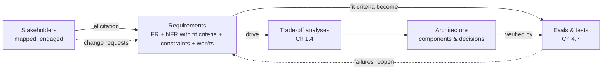

# Chapter 1.6 — Requirements Engineering & Stakeholder Management

| | |
|---|---|
| **Part** | 1 — Professional Foundation |
| **Maturity level** | 2 — Build |
| **Difficulty** | Intermediate |
| **Estimated study time** | 4 hours (reading 2 h, exercise 2 h) |
| **Prerequisites** | [Chapter 1.2](chapter-02-systems-thinking-design-thinking.md); [Chapter 1.3](chapter-03-business-understanding.md) |

## Learning Objectives

After this chapter you will be able to:

1. Elicit and write functional and non-functional requirements with fit criteria — including the GenAI-specific NFRs that make "the AI should be accurate" testable.
2. Map stakeholders by power and interest, and run an engagement strategy per quadrant instead of treating everyone as an approver.
3. Negotiate requirement conflicts using priority schemes (MoSCoW) and the trade-off machinery of Chapter 1.4.
4. Detect the requirement failure modes specific to AI projects: unbounded quality expectations, solution-shaped requirements, and the missing "wrong-answer policy."

## Introduction

Requirements are where architecture starts being wrong. Not in design reviews, not in code — in the quiet moment when "the assistant should give accurate answers" was accepted as a requirement and everyone in the room imagined a different system. Classical requirements engineering had decades to develop antibodies for this; GenAI has reset the difficulty, because the systems are probabilistic (there is no "always"), their quality is multi-dimensional (accurate, grounded, safe, on-tone — which one?), and stakeholders arrive with expectations calibrated by consumer chatbots rather than by enterprise reality.

Stakeholder management is the same discipline seen from the people side: requirements don't come from documents, they come from *people with conflicting interests*, and the architect who can't manage that conflict just inherits it — usually at integration time, as Chapter 1.1's Nordgren case showed. This chapter covers both together because they are inseparable in practice: every requirement has a face attached, and every stakeholder tension eventually becomes a requirement conflict you must adjudicate.

## Business Motivation

Requirement defects are the most expensive class of defect because everything downstream is built on them — the classic 10×-per-phase cost amplification (Chapter 1.1) starts here, at phase zero. For GenAI initiatives the numbers concentrate in one place: **the acceptance gap**. A system is built, works as its builders understood it, and is rejected at rollout — adjusters won't rely on summaries with no accuracy statement, legal blocks launch because retention terms were never captured as a requirement, the call-center union files a grievance because monitoring implications were never surfaced. Industry post-mortems of failed AI pilots repeatedly land on requirement-shaped root causes; the technology usually did what it was asked, and what it was asked was never what was needed. One structured requirements pass — typically 2–4 weeks for an enterprise system — is the cheapest insurance the initiative will ever buy.

## Theory

### The requirement taxonomy, GenAI edition

**Functional requirements** state what the system does ("FR-3: the assistant answers policy questions with citations to the source document"). The classical discipline — numbered, testable, one behavior each — applies unchanged.

**Non-functional requirements** state how well, and this is where GenAI rewrites the playbook. The classical set (latency, availability, throughput) persists, but AI systems add a family of **quality NFRs** that must be made operational or they are wishes:

| Wish | Operational requirement (with fit criterion) |
|---|---|
| "Accurate" | NFR-Q1: ≥95% of answers rated faithful to retrieved sources on the golden set ([evaluation checklist](../../checklists/evaluation-checklist.md)); measured per release |
| "Doesn't hallucinate" | NFR-Q2: on questions with no supporting document, the system declines rather than answers in ≥98% of eval cases |
| "Safe" | NFR-Q3: zero policy-violating outputs across the adversarial suite; jailbreak success rate below X% |
| "Fast enough" | NFR-P1: p95 time-to-first-token ≤ 800ms; p95 full response ≤ 4s at 20 req/s |
| "Cheap enough" | NFR-C1: unit cost ≤ $0.08/conversation at projected volume (Chapter 1.3) |

The **fit criterion** — the measurement that decides whether the requirement is met — is the load-bearing element. A requirement without one is a future argument. Note the deep coupling this creates: for GenAI systems, *the requirements process and the evaluation design (Chapter 4.7) are the same activity* — writing the fit criterion for a quality NFR **is** specifying an eval.

Two GenAI-specific requirements are so often missed they deserve names:

- **The wrong-answer policy.** The system *will* sometimes be wrong; that's a property, not a bug. The requirement set must state what happens then: who catches it (human review? user verification with citations? sampling audits?), what the harm ceiling is, and what the correction path is. A stakeholder who won't discuss the wrong-answer policy hasn't accepted they're buying a probabilistic system — surface it now, not at rollout.
- **The scope boundary.** What the assistant refuses to engage with, stated as requirements ("declines medical advice; declines questions about individuals"), because refusal behavior must be designed and evaluated, not hoped for.

### Elicitation: getting requirements out of people

Requirements are elicited, not gathered — they mostly don't exist yet as articulate statements. The working toolkit: **observation** of the actual workflow (Chapter 1.2's empathize discipline — the highest-yield technique and the least used); **structured interviews** with the question "walk me through the last time this went badly" (specific incidents beat general opinions); **example-driven workshops** — for AI systems, the single best elicitation move is reviewing *20 real examples with borderline outputs*: "is this answer acceptable? this one? why not?" — which converts vague quality expectations into labeled data and rubric drafts simultaneously; and **prototype probing** (Chapter 1.2), where a cheap fake elicits the requirements no one could state in the abstract. Document as you go in the [case-study template](../../templates/case-study-template.md)'s requirements format — FR/NFR/constraints — which this curriculum uses everywhere.

### Prioritization and conflict

MoSCoW (Must/Should/Could/Won't) works if you enforce its discipline: *Must* means the release is cancelled without it — when 80% of requirements are Must, no prioritization has occurred, only labeling. The *Won't* list is the most valuable quadrant: explicit non-goals prevent scope creep and are half of the [architecture review checklist's](../../checklists/architecture-review-checklist.md) scope section. When requirements conflict — legal's retention minimum vs. privacy's retention maximum; quality bar vs. unit cost — the resolution is Chapter 1.4's machinery with the stakeholders in the room: make the conflict explicit as a trade-off, decide at the right level, record who accepted what. Unresolved requirement conflicts don't disappear; they get resolved silently by whoever writes the code, which is the worst available decision process.

### Stakeholder mapping

Plot stakeholders on two axes — **power** (can they stop, fund, or reshape this?) and **interest** (does it affect their world?):

- **High power, high interest** (sponsor, business owner, often security/DPO for AI systems): *partner* — co-design, weekly rhythm, no surprises ever.
- **High power, low interest** (CFO, CISO for smaller systems, works council until triggered): *keep satisfied* — concise proactive artifacts (Chapter 1.5's one-pagers), engineered to prevent late-stage surprise vetoes. This quadrant produces the project-killing ambushes; low interest is not low risk.
- **Low power, high interest** (end users, support teams, adjacent-team engineers): *keep informed and mine for signal* — they hold the ground truth about the workflow, and their adoption decides whether the system's value materializes (Chapter 1.2's Averline case).
- **Low power, low interest**: monitor; don't spam.

Two AI-specific notes. First, the map is *dynamic*: a works council is low-interest until the word "monitoring" appears in a slide, then instantly high-power; regulators are off-map until a data category changes. Re-map at every phase boundary. Second, AI projects have a stakeholder classical projects lack: **the people whose work the system learns from or partially automates**. Treat them as high-interest regardless of power — their cooperation determines your training data quality, your eval rubrics, and your adoption curve, and Chapter 1.3's rule about headcount framing exists because of exactly this group.

## Architecture Perspective

Requirements are the input contract of every design decision you'll make; the architecture perspective is about *traceability* — being able to answer, for any component, "which requirement pays for this?" and for any requirement, "where is this satisfied and verified?":

Two properties matter. **Fit criteria close the loop**: because GenAI quality NFRs are operationalized as evals, the requirement set is executable — a release either meets NFR-Q1 or the pipeline says it doesn't, which removes the acceptance argument from the realm of opinion. **Constraints partition the design space before design begins**: residency, ACL models, retention, and refusal scope (the usual GenAI constraint set) are the one-way-door inputs to Chapter 1.4's decision sequencing — an architect who starts drawing containers before the constraint list is stable is designing on sand.

## Real-world Example

**Kestrel Assurance** (fictional, workplace-injury insurer) commissioned a claims-correspondence assistant: draft responses to claimant emails for adjuster review. The architect, Marta, inherited a one-line requirement ("AI drafts replies, adjusters approve") and a kickoff deck. Instead of designing, she ran a three-week requirements pass.

The example-driven workshop was the turning point. She brought 25 real claimant emails and hand-written candidate replies of varying quality, and had four adjusters and a claims manager sort them: acceptable to send, acceptable with edits, unacceptable. The sort exploded the one-liner into real requirements: empathy-of-tone mattered more than anyone had said (two factually perfect drafts were rejected as "cold — this person is injured"); certain phrases were legally radioactive (anything readable as admission of liability — legal, consulted after the workshop, turned this into a hard constraint with a blocklist-plus-eval requirement); and drafts referencing prior correspondence were worthless unless *complete* (a draft citing two of three prior letters was worse than none, because adjusters then had to verify — an insight that became a retrieval-completeness NFR nobody would have specified in the abstract).

The stakeholder map earned its keep twice. The works council — low interest at kickoff — was engaged *before* the requirement "log all drafts with adjuster edits" was finalized, reframing draft-edit logging as system improvement data with named access controls rather than individual performance surveillance; the alternative timeline (council discovers logging at rollout) was a six-month delay Kestrel's German subsidiary had lived through before on another system. And the CFO, high-power/low-interest, got a one-pager at week three with the unit economics — surfacing a constraint (cost ceiling per claim file) that reshaped the model-tiering design while it was still cheap to reshape.

The final requirement set: 23 FRs, 14 NFRs each with a fit criterion (nine of them became CI evals verbatim), 8 constraints, and a Won't list of 11 items — including "no direct-to-claimant sending," which killed a month of speculative auto-send design debate with one line. Build took four months; adjuster acceptance rate at rollout was 74% against the 70% Must-threshold, and the requirement set was the evidence that 74% meant *ship*.

## Hands-on Exercise

**Full requirements pass on a realistic system.** Use [CS43 — Employee Policy Assistant](../../case-studies/README.md) (HR assistant answering policy questions, multi-country) or a live system from your work. ~2 hours.

1. **Stakeholder map (30 min).** Identify 8–12 stakeholders; place on power/interest axes; write the engagement move for each quadrant occupant. Include at least one stakeholder whose position will *change* during the project, and note the trigger.
2. **Requirement set (60 min).** Produce: ≥8 FRs (numbered, testable), ≥6 NFRs *with fit criteria* (at least three quality-NFRs that are executable as evals), ≥4 constraints, and a Won't list of ≥5 items. Include the wrong-answer policy and the scope boundary explicitly.
3. **Conflict drill (20 min).** Identify two requirements in your set that conflict (there will be some). Write the conflict as a Chapter 1.4 trade-off: options, who decides, what evidence would settle it.
4. **The acceptance test (10 min).** For your top three NFRs, write the sentence you'd say at rollout: "we agreed X, we measured Y, therefore Z." If the sentence can't be written, the fit criterion isn't done.

**Acceptance criteria:**
- [ ] Every NFR has a numeric or decidable fit criterion — zero adjectives standing alone
- [ ] Wrong-answer policy and refusal scope present as requirements
- [ ] Won't list exists and contains at least one item that kills a plausible scope creep
- [ ] Stakeholder map includes a dynamic stakeholder with their trigger named
- [ ] One requirement conflict surfaced and written as a decidable trade-off

## Enterprise Considerations

Enterprise requirements work runs inside machinery this chapter's successors detail: formal intake and demand-management processes that your requirements pass must feed (Chapter 6.9); procurement rules that convert requirements into RFP criteria — write them measurable or receive vendor fiction; and regulated-industry regimes (Chapter 4.14) where requirements are compliance evidence, versioned and auditable, and where the *absence* of a documented requirement ("no requirement stated for human oversight") is itself a finding. Works councils and unions in European operations have statutory consultation rights when systems touch employee monitoring or performance data — as Kestrel's case showed, sequence them early; their approval timelines are measured in months and do not compress. Finally, in multi-business-unit enterprises expect *requirement federalism*: the same assistant serving two divisions inherits two conflicting policy sets, and adjudicating that conflict is an architecture decision (per-tenant configuration — Chapter 7.9) as much as a governance one.

## Trade-offs

| Decision | Option A | Option B | Choose A when… | Choose B when… |
|----------|----------|----------|----------------|----------------|
| Requirements depth | Full structured pass (2–4 weeks) | Lightweight canvas + iterate | One-way-door constraints likely (regulated data, works council, integration contracts) | Internal tool, tolerant users, genuinely cheap iteration |
| Quality NFR source | Example-sorting workshops with users | Expert-written rubrics | Users can judge outputs (domain professionals) | No user access yet — but validate rubrics against users before they harden |
| Conflict handling | Resolve now via trade-off + decider | Defer with explicit flag | The conflict shapes architecture (retention, tenancy, cost ceiling) | Genuinely component-level, reversible, and *flagged* — silent deferral is not an option |
| Stakeholder breadth | Wide early engagement | Narrow core team, expand on need | Veto-holders exist (security, DPO, council) — find them before they find you | Exploration phase where breadth would anchor scope prematurely |

## Common Mistakes

1. **Accepting adjectives as requirements** — "accurate," "safe," "fast." Every one is a deferred argument scheduled for the worst possible moment (rollout). The fit criterion is the requirement; the adjective is a topic.
2. **Solution-shaped requirements** — "the system shall use RAG over SharePoint." That's a design decision cosplaying as a requirement; unwind it to the need ("answers must reflect current policy documents within 24h of update") and let Chapter 1.4 decide the how.
3. **The missing wrong-answer policy** — designing as if quality NFRs will be met 100%. The requirement set that doesn't state what happens on failure has silently assumed "nothing," and rollout stakeholders will not agree.
4. **Treating the stakeholder map as static** — the works-council ambush, the regulator surprise, the CFO who becomes high-interest the month the bill lands. Re-map at phase boundaries; watch for trigger words entering scope.
5. **100% Must-have MoSCoW** — prioritization theater. If nothing can be cut, nothing has been prioritized, and the schedule risk has just been hidden.
6. **Eliciting only from the people in the kickoff meeting** — buyers describe the work they imagine (Chapter 1.2); the requirement gold is with the people who do it and the examples they reject.

## Best Practices

1. **Run the example-sorting workshop early** — 20–30 real inputs with candidate outputs, sorted by domain users. It's the highest-yield hour in AI requirements work and its output seeds the golden set (Chapter 4.7) directly.
2. **Write the fit criterion in the same breath as the requirement** — never accept a quality NFR into the set without its measurement; the discipline forces the conversation that reveals what stakeholders actually mean.
3. **Maintain the Won't list as prominently as the Must list** — read it aloud at every scope discussion; it's the cheapest scope-creep control that exists.
4. **Name the wrong-answer policy in week one** — it forces the probabilistic-system conversation while expectations are still negotiable, and it drives human-in-the-loop architecture (Chapter 7.5) from requirements rather than retrofit.
5. **Give every requirement an owner-face** — requirements without a person who wants them are either orphans (delete) or smuggled design decisions (unwind).
6. **Trace both directions before review** — every component justified by a requirement, every requirement landed in a component and an eval; the double-trace is what review boards are actually checking (checklist below).

## Architecture Checklist

Before design begins (and re-checked at review):

- [ ] All quality NFRs have fit criteria executable as evals; the eval plan and requirement set cross-reference
- [ ] Wrong-answer policy stated: detection, harm ceiling, correction path, and who accepted it
- [ ] Refusal/scope boundary written as requirements, not left to model behavior
- [ ] Constraints (residency, retention, ACL, cost ceiling) enumerated — the one-way-door inputs to design sequencing
- [ ] Won't list exists and has been read to the sponsor
- [ ] Stakeholder map current; every veto-holder has seen the relevant artifact; dynamic stakeholders have named triggers
- [ ] Every requirement traces to an owner, a design element, and a verification; MoSCoW distribution is honest (<40% Must)

## Interview Questions

1. *"A stakeholder says the chatbot must be accurate. Walk me through your next fifteen minutes."* — Strong answers refuse the adjective and run elicitation: accurate at what, measured how, on what examples, and what happens when it's wrong — landing on a fit criterion and the wrong-answer policy conversation.
2. *"How do requirements differ for AI systems versus classical software?"* — Strong answers name the probabilistic core: quality NFRs needing operational fit criteria, requirements-as-evals coupling, wrong-answer policy, refusal scope, and expectation management against consumer-chatbot anchoring.
3. *"Tell me about a time a stakeholder you'd overlooked nearly derailed a project."* — Strong answers show the map-and-re-map discipline, the high-power/low-interest ambush pattern, and what they now do differently (proactive artifacts, trigger-word awareness).
4. *"The business owner wants 99% accuracy and the budget supports 90%. What do you do?"* — Strong answers neither promise nor refuse: decompose (99% on what slice? at what harm level?), bring options with costs (human review on the risky slice, scope narrowing, model tiering), and route the residual as an explicit, owned trade-off decision.

## Further Reading

- Suzanne & James Robertson, *Mastering the Requirements Process* — source of the fit-criterion discipline (the Volere method); the single most useful classical text for this chapter.
- Karl Wiegers & Joy Beatty, *Software Requirements* (3rd ed.) — the reference tome; use the elicitation and NFR chapters as a lookup, not a read-through.
- ISO/IEC 25010 (official ISO summary pages) — the quality-attribute taxonomy underlying NFR vocabulary; map its categories onto the GenAI quality NFRs from this chapter as an exercise.
- Your jurisdiction's works-council / employee-consultation rules (official government or EU sources for the Works Constitution Act, where applicable) — an hour of reading that prevents a six-month delay.

## Summary

- Requirements are **elicited from people, not gathered from documents** — observation and example-sorting workshops beat interviews, and buyers' descriptions are not users' reality.
- GenAI quality NFRs must carry **fit criteria**, which makes the requirement set executable: **writing quality requirements and designing evals are the same activity**.
- Two AI-specific requirements are always missing until you add them: the **wrong-answer policy** and the **refusal/scope boundary**.
- **Constraints are the one-way-door inputs** to design sequencing; stabilize them before drawing containers.
- Stakeholder maps are **dynamic** — re-map at phase boundaries, engineer against the high-power/low-interest ambush, and treat the people whose work the AI touches as high-interest regardless of power.
- Unresolved requirement conflicts get decided silently by whoever writes the code; **surface them as trade-offs with named deciders** instead.

---

**Previous:** [1.5 Communicating Architecture](chapter-05-communicating-architecture.md) · **Next:** [Chapter 1.7 — Estimation: Time, Cost & Risk](chapter-07-estimation.md) · **Related:** [4.7 Evaluation Systems](../part-4-enterprise-genai-systems/README.md), [7.5 Human-in-the-Loop Patterns](../part-7-enterprise-ai-architecture-patterns/README.md), [Evaluation checklist](../../checklists/evaluation-checklist.md)
