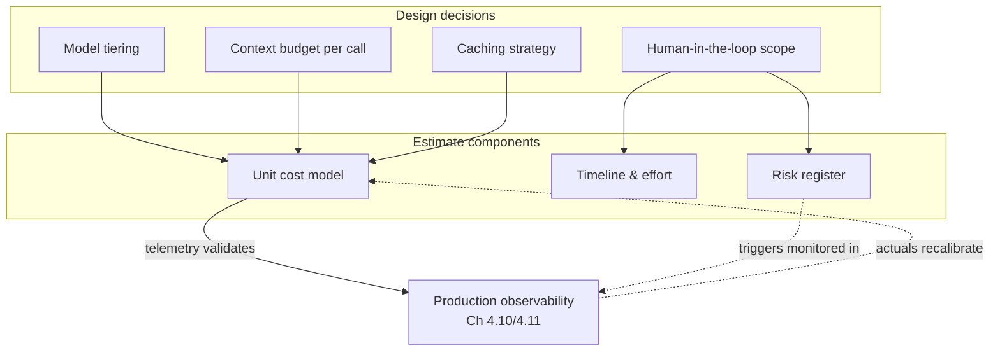

# Chapter 1.7 — Estimation: Time, Cost & Risk

| | |
|---|---|
| **Part** | 1 — Professional Foundation |
| **Maturity level** | 2 — Build |
| **Difficulty** | Intermediate |
| **Estimated study time** | 4 hours (reading 90 min, exercise 2.5 h) |
| **Prerequisites** | [Chapter 1.3](chapter-03-business-understanding.md); [Chapter 1.4](chapter-04-tradeoff-analysis.md) |

## Learning Objectives

After this chapter you will be able to:

1. Produce estimates as calibrated ranges with stated assumptions — never as naked points — for effort, cost, and timeline.
2. Do GenAI inference cost math fluently: tokens × price × volume, with the second-order terms (caching, retries, context growth) that dominate real bills.
3. Build and run a risk register: identified risks with probability, impact, owner, and trigger — refreshed as a living artifact, not a kickoff ritual.
4. Use reference-class forecasting to correct the inside view that makes AI project timelines systematically optimistic.

## Introduction

Estimation is the architect's discipline of being wrong in a controlled fashion. You cannot know what a GenAI system will cost to build, run, and de-risk — but you can bound it, state the assumptions the bounds depend on, and instrument reality to tell you early which assumption broke. That's the entire craft: not prophecy, but *managed uncertainty with an audit trail*.

Chapter 1.3 established why the numbers matter (they're how initiatives are judged); Chapter 1.4 used numbers as evidence in decisions. This chapter is where the numbers come from. GenAI adds a genuinely new estimation object — the inference bill, a marginal cost that scales with usage in ways classical software licensing never did — and a genuinely harder timeline problem: the last 20% of quality routinely costs more than the first 80%, breaking every straight-line extrapolation from demo progress. Architects who estimate GenAI projects like CRUD projects deliver the demo on time and the system a year late.

## Business Motivation

Estimation failures are how AI initiatives die *after* succeeding technically. The month-three inference-bill ambush (Chapter 1.1's Nordgren, Chapter 1.3's CFO scene) is an estimation failure: nobody multiplied demo unit costs by production volume. The quieter killer is timeline: a pilot that impressed in six weeks anchors an executive expectation that production is "another six weeks or so" — when the honest range is six to twelve *months* once evals, security review, ingestion hardening, and the long tail of quality are priced in. The gap between the anchor and reality gets spent as the architect's credibility, at the exchange rate of one trust unit per slipped announcement (Chapter 1.1's calibration currency).

The positive case is just as concrete: an architect who can produce a defensible cost model in a business-case meeting — range, assumptions, dominant driver, first optimization lever — changes the decision in the room. Estimates are the currency in which architecture participates in business decisions; an architect without them is an advisor without a vote.

## Theory

### Ranges, calibration, and the cone

A point estimate is a lie with confidence; a range is a claim you can be held to. The working form: *"90% confident between X and Y, assuming A, B, C — dominated by assumption B."* Three disciplines make ranges useful:

- **Three-point estimation.** Estimate optimistic (O), most-likely (M), pessimistic (P); combine as (O + 4M + P) / 6 (the PERT weighting). The exercise's value is less the arithmetic than the forced generation of P — asking "what does the bad version look like?" surfaces the risks the single-number instinct suppresses.
- **The cone of uncertainty.** Early estimates are legitimately wide (±4× at concept stage, narrowing as decisions land). The professional move is not to fake precision early but to *state the cone stage* and name what will narrow it: "±3× today; ±50% after the two-week retrieval spike." Estimation and spiking (Chapter 1.4) are the same investment.
- **Calibration.** Track your estimates against outcomes. Most engineers discover their "90% confident" ranges capture reality ~50% of the time — the fix is widening ranges until the hit rate matches the stated confidence. Calibration is trainable in weeks and is the single highest-leverage estimation skill, because a calibrated estimator's ranges can be *trusted arithmetic inputs* to business cases.

### The inside view and reference classes

Timeline optimism is structural, not moral: estimating from the inside ("sum of the tasks I can foresee") omits precisely the work you can't foresee — which in GenAI is systematic and nameable. **Reference-class forecasting** corrects it: find comparable completed projects and start from *their* actuals. The GenAI reference class is young but consistent, and its pattern is stable enough to teach:

> Demo: weeks. Production: months. The multiplier between them is 4–10×, and it hides in six places: evaluation infrastructure (building the golden set and judge pipeline — Chapter 4.7), the quality long tail (each point past ~90% costs more than the last), data plumbing (ingestion, permissions, freshness — Chapter 4.3), security & compliance review latency (calendar time, not effort — Chapter 1.5's Meridian), integration with enterprise systems, and organizational adoption work.

When an executive extrapolates from the demo, the architect's job is to name the multiplier and its six components *before* the anchor sets. That conversation is this chapter's highest-value deliverable.

### GenAI cost math

The first-order model everyone learns:

> monthly inference cost = requests/month × (input tokens × input price + output tokens × output price)

The second-order terms that dominate real bills:

- **Context growth.** Input tokens per request are not constant: RAG stuffs retrieved chunks (often 2–10K tokens), conversations accumulate history, agents accumulate tool results. Real systems' input:output ratios commonly run 10:1 to 50:1 — *input pricing dominates*, which is why prompt caching and context discipline (Chapter 4.11) are the levers that matter.
- **Multipliers on the request count.** Retries, guardrail check calls, judge calls in online evaluation, parallel agent branches, speculative prefetch: a "single user request" frequently triggers 3–8 model calls. Estimate the *call graph*, not the request.
- **The distribution, not the mean.** Cost concentrates: the p99 conversation (long documents, long history, agentic loops) can cost 100× the median. Estimate mean *and* tail, and design the budget enforcement (Chapter 7.8) the tail will need.
- **Non-inference costs.** Embedding/re-embedding the corpus (a re-index at 10× corpus growth is a real bill), vector store hosting, log/trace storage at LLM verbosity, and eval runs in CI (a full nightly eval suite can cost more than daily production traffic for low-volume systems).

Worked micro-example (assumptions stated, prices rounded for arithmetic): support assistant, 2,000 conversations/day, avg 6 turns; per turn ~4K input tokens (system prompt 800, history 1.2K, retrieved context 2K) and 250 output. At $3/M input, $15/M output: per conversation ≈ 6 × (4,000×$0.000003 + 250×$0.000015) ≈ 6 × ($0.012 + $0.00375) ≈ **$0.095**. Monthly ≈ 2,000 × 30 × $0.095 ≈ **$5.7K** — before the multiplier audit (guardrail calls +1 small-model call/turn; ~7% retry rate; judge sampling 5% of turns), which lands it near **$7K/month**, and before noting the lever: 800 tokens of static system prompt × every turn is the caching opportunity that takes ~20% off. This five-minute calculation, done at design time, is the whole discipline.

### Risk registers that actually run

A risk register is a table with a heartbeat: **risk, probability (coarse: H/M/L), impact (quantified where possible), owner (a name, not a team), mitigation or acceptance, and trigger** (the observable that says it's materializing). The GenAI standing risks worth seeding every register with: model behavior change on provider upgrade (trigger: eval regression on pinned suite), quality plateau below the fit criterion (trigger: three sprints of flat eval scores — the signal to escalate the scope/quality trade to the sponsor, per Chapter 1.6), inference cost drift (trigger: unit cost +20% over model), security-review latency (mitigate: Chapter 1.5's artifact discipline), data-access delays (the most underestimated schedule risk in enterprise AI — corpus access routinely takes longer than the build), and key-person concentration. The register's failure mode is ritualization — written at kickoff, reviewed never. The fix is mechanical: triggers are monitored quantities, and the register is a standing agenda item wherever status is already reviewed.

## Architecture Perspective

Estimation is not a phase before architecture; it is a *property of* the architecture. Every design decision moves the estimate, and mature architects read designs as cost-and-risk structures:

Two structural points. First, **estimability is a design virtue**: an architecture whose cost drivers are legible (one gateway metering all model calls — Chapter 7.9) can be estimated, monitored, and defended; one whose model calls are scattered across services can't, and its first honest cost number arrives as an invoice. Design the metering in. Second, the feedback edge is the discipline: estimates are *predictions that production telemetry grades*. The architect who compares actuals to estimates monthly gets calibrated and gets early warning; the one who files the spreadsheet after funding gets the ambush.

## Real-world Example

**Halvard & Roth** (fictional, 900-lawyer law firm) approved a contract-analysis pipeline after a spectacular three-week pilot. The sponsoring partner's plan assumed production in eight more weeks. The architect, Yusuf, was handed that anchor — and instead of accepting or refusing it, he priced it.

His counter-artifact was one page. Timeline as a range with the multiplier decomposed: eight weeks bought a robust demo; production was 5–8 months, itemized — six weeks building the eval set with associates' labeled clause extractions (no eval, no defensible quality claim to the malpractice insurers — a stakeholder the map had surfaced), four-to-eight weeks of document-plumbing against the firm's DMS with its matter-level permissions, six weeks of the quality long tail on the four contract types the pilot had cherry-picked around, and a security/client-confidentiality review whose *calendar* latency was eight weeks regardless of effort, so it was started in week one. Cost as a range: the pilot's per-document cost ($0.31) × projected volume said $9K/month, but his call-graph audit — clause-level extraction meant 12–20 model calls per document, plus a verification pass — put the honest range at $28–45K/month, dominated by input tokens on long leases; the stated lever was tiering (short contracts to a compact model) with a spike to price it. Risk register: six entries, the top one being *associate labeling time doesn't materialize* (probability H, impact: eval slip → everything slips; trigger: <20 labeled contracts by week 3; owner: the sponsoring partner herself — which converted her from anchor-setter to schedule-defender).

The estimate was not welcome, and it was accepted — partly because it arrived as ranges with named assumptions rather than a refusal, and partly because Yusuf attached the week-3 trigger that would prove or disprove his pessimism cheaply. Production landed in month seven, within range; the labeling risk fired on schedule and was escalated with the pre-agreed trigger instead of discovered in a slipped demo. Actual costs ran $31K/month; the recalibration meeting spent its time on the tiering spike (which took it to $19K) rather than on whether the architect could be trusted. The pilot partner's anchor had been wrong by 3×, and no credibility was spent, because the correction had been priced in writing before the anchor hardened.

## Hands-on Exercise

**Estimate [P06 — Production RAG Service](../../projects/README.md) end-to-end.** Assume: internal knowledge assistant, 5,000 employees, corpus of 200K documents, projected 1,500 conversations/day. ~2.5 hours.

1. **Cost model (60 min).** Build the unit-cost equation: tokens per turn (state your context-assembly assumptions), turns per conversation, the call-graph multiplier (guardrails, judge sampling, retries — pick and justify rates), current published prices for two model tiers (check the provider's official pricing page — prices move; your assumptions column is what makes the model durable). Produce monthly cost as a range (P10/P50/P90) plus the non-inference lines: embedding the corpus, re-embedding cadence, vector store, trace storage. Name the dominant driver and your first lever.
2. **Timeline (45 min).** Three-point estimate per workstream (eval infrastructure, ingestion/permissions, retrieval quality, security review, integration, adoption). Apply the demo-to-production lens: which of the six multiplier components hits this project hardest? State the cone stage and what narrows it.
3. **Risk register (30 min).** Eight risks minimum, seeded from the standing GenAI set plus two specific to this scenario. Every entry: probability, quantified impact, named owner, observable trigger.
4. **The one-pager (15 min).** Compress all three into the artifact you'd hand a sponsor (Chapter 1.5's SCQA): the ask, the range, the top assumption, the top risk, the trigger that tells us early.

**Acceptance criteria:**
- [ ] Cost model shows the call graph, not just requests; input:output token ratio is explicit
- [ ] All estimates are ranges with named assumptions; the dominant assumption is flagged
- [ ] Timeline decomposes the demo-to-production multiplier into named components
- [ ] Every risk has an observable trigger and a person (not a team) as owner
- [ ] The one-pager survives the test: a sponsor reading only it could state your range and your top risk aloud

## Enterprise Considerations

Enterprise estimation runs into machinery worth knowing in advance. **Budget cycles** quantize your ranges: an annual planning process wants one number twelve months out, precisely when your cone is widest — the professional answer is a funded discovery phase with a re-estimation gate, sold as de-risking (Chapter 6.10 formalizes this as phased business cases). **Procurement and vendor pricing** complicate the cost model: committed-use discounts, enterprise agreements, and provider price revisions (historically downward, but never contractually guaranteed) mean the unit prices in your model carry their own uncertainty band — date-stamp them. **Chargeback** (Chapter 7.9) turns your estimate into other departments' invoices, which converts estimation errors into political events; the metering-first architecture is the defense. And in regulated industries, cost of *compliance evidence* — eval documentation, audit trails, model-risk-management submissions (Chapter 4.14) — is a first-class estimate line that outsiders reliably omit; it can reach 20–30% of total effort in banking-grade deployments.

## Trade-offs

| Decision | Option A | Option B | Choose A when… | Choose B when… |
|----------|----------|----------|----------------|----------------|
| Estimate presentation | Full range + assumptions | Single planning number with stated confidence | Any decision-making context — ranges are the honest default | The process physically requires one number: give P70, label it P70, keep the range on file |
| Estimation investment | Spike first, estimate after | Estimate now from analogy | The decisive unknown is cheap to test (retrieval quality, extraction accuracy) | The spike costs more than the estimate's error (Chapter 1.4's consequence rule) |
| Cost posture | Conservative (P80 budget) | Aggressive (P50, monitored) | Cost overrun is politically fatal; chargeback contexts | Speed matters more than variance and telemetry + triggers are in place from day one |
| Timeline anchor response | Re-anchor immediately with decomposed range | Absorb and manage expectations gradually | Always the first — anchors harden within days; Yusuf's move is the pattern | Never; "gradually" is how the credibility gets spent |

## Common Mistakes

1. **Multiplying the demo** — extrapolating cost from demo unit prices without the call-graph audit, and timeline from demo velocity without the 4–10× decomposition. The two flavors of the same error, and the two most expensive sentences in enterprise AI: "it's basically working" and "so production is a few more weeks."
2. **Estimating the request, not the call graph** — forgetting guardrails, judges, retries, and agent branches; real bills run 3–8× the naive model on this term alone.
3. **Point estimates as social lubricant** — giving the single number because the range conversation is awkward. The awkwardness is the estimate doing its job; deferring it compounds it.
4. **The kickoff-only risk register** — a compliance artifact with no triggers and no heartbeat. If no register entry has fired or been retired in a quarter, the register is dead, not the risks.
5. **Ignoring calendar-time items** — security review, works-council consultation, data access grants, procurement. These cost little effort and months of elapsed time, and they parallelize *only if started early*; the estimate that sums effort and ignores elapsed time is fiction with a spreadsheet.
6. **Never grading the estimate** — filing the model at funding and meeting reality only at invoice time. Uncompared actuals are wasted tuition: the recalibration loop is where estimation skill actually comes from.

## Best Practices

1. **State every estimate as range + assumptions + dominant driver** — the three-part form makes the estimate arguable at the assumption level, which is where productive disagreement lives.
2. **Do the five-minute token math at design time, in the design review** — the worked-example discipline; it catches order-of-magnitude surprises while they're still diagram edits.
3. **Decompose the demo-to-production multiplier out loud, early** — name the six components to the sponsor before the pilot's velocity sets the anchor.
4. **Give risks triggers and put the triggers in dashboards** — a risk with a monitored trigger is managed; one without is a worry with paperwork.
5. **Grade yourself monthly** — actuals vs. estimate, in the same document, visible to the team. Calibration compounds; so does the trust from doing it in the open.
6. **Design for estimability** — one metered gateway, cost attribution per feature/tenant, eval-run cost tracked like production cost. If the architecture can't tell you what things cost, that's an architecture finding (Chapter 4.11 industrializes this).

## Architecture Checklist

Before funding, and refreshed at each phase gate:

- [ ] Unit-cost model exists with call-graph multipliers, token ratios, and date-stamped prices; P50 and tail both estimated
- [ ] Non-inference lines present: embedding/re-embedding, vector store, trace storage, CI eval runs
- [ ] Timeline is three-point per workstream with the demo-to-production components itemized; calendar-time items started, not just listed
- [ ] Cone stage stated, with the named spike or gate that narrows it
- [ ] Risk register live: owners are people, triggers are observable, review has a standing slot
- [ ] Metering/attribution designed in — the system can grade its own estimate
- [ ] Actuals-vs-estimate review scheduled (monthly) with recalibration authority

## Interview Questions

1. *"Estimate the monthly cost of a customer-support AI for a company with 50K support conversations a month."* — Strong answers narrate the model: tokens per turn with context assembly, turns per conversation, the call-graph multiplier, input-dominance, mean vs. tail — producing a range with flagged assumptions rather than fishing for the "right" number.
2. *"Your pilot took six weeks. The sponsor wants production in eight more. Respond."* — Strong answers re-anchor immediately with the decomposed multiplier, attach an early trigger that cheaply tests the disagreement, and keep the sponsor as an ally by pricing rather than refusing.
3. *"How do you handle estimating something you've never built?"* — Strong answers combine reference classes (find the completed analog), cone-stage honesty (wide range, named narrowing spike), and decomposition to the parts that *do* have references.
4. *"What's in your risk register for a RAG deployment, and how do you keep it alive?"* — Strong answers produce the standing set (provider behavior change, quality plateau, cost drift, review latency, data access, key person) and the mechanics: named owners, observable triggers wired to dashboards, standing review slot.

## Further Reading

- Steve McConnell, *Software Estimation: Demystifying the Black Art* — the cone of uncertainty, calibration, and range discipline; dated examples, permanently valid method.
- Douglas Hubbard, *How to Measure Anything* — calibration training and the value-of-information logic behind "spike only what flips decisions"; the companion to Chapters 1.4 and 1.7 both.
- Daniel Kahneman, *Thinking, Fast and Slow* (Part III) — the inside/outside view and planning fallacy, from the source; reference-class forecasting is the applied antidote.
- Your model providers' official pricing pages — reread quarterly, date-stamp what you copy into models; second-hand price tables are reliably stale.

## Summary

- Estimates are **ranges with assumptions and a dominant driver**, graded against actuals monthly — calibration, not prophecy, is the skill.
- GenAI cost math is **call-graph math**: input tokens dominate, multipliers (guardrails, judges, retries, agents) turn one request into many calls, and the tail costs 100× the median — estimate all three.
- The **demo-to-production multiplier is 4–10×** and decomposes into six nameable components; say them out loud before the pilot's velocity anchors the sponsor.
- **Calendar-time items** (security review, data access, consultation processes) are cheap in effort and fatal in elapsed time — start them in week one.
- Risk registers live or die by **observable triggers with named owners**, reviewed where status is already reviewed.
- **Estimability is an architecture property**: metered gateways and cost attribution let the system grade your predictions — design them in, and the ambush becomes a recalibration meeting.

---

**Previous:** [1.6 Requirements Engineering & Stakeholder Management](chapter-06-requirements-stakeholders.md) · **Next:** [Chapter 1.8 — Leadership & Influence Without Authority](chapter-08-leadership-influence.md) · **Related:** [4.11 Cost Engineering](../part-4-enterprise-genai-systems/chapter-11-cost-engineering.md), [6.10 TCO & the Business Case](../part-6-enterprise-architecture/chapter-10-tco-business-case.md), [Architecture review checklist](../../checklists/architecture-review-checklist.md)
