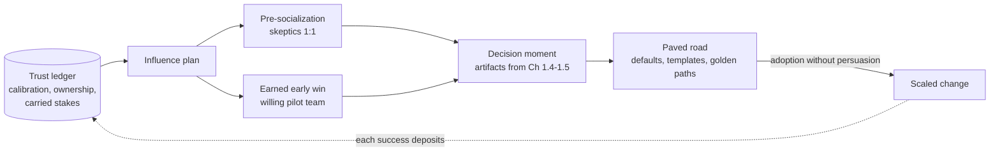

# Chapter 1.8 — Leadership & Influence Without Authority

| | |
|---|---|
| **Part** | 1 — Professional Foundation |
| **Maturity level** | 2 — Build |
| **Difficulty** | Intermediate |
| **Estimated study time** | 3–4 hours (reading 90 min, exercise 2 h) |
| **Prerequisites** | [Chapter 1.1](chapter-01-from-engineer-to-architect.md); [Chapter 1.5](chapter-05-communicating-architecture.md); [Chapter 1.6](chapter-06-requirements-stakeholders.md) |

## Learning Objectives

After this chapter you will be able to:

1. Explain why the architect role runs on influence rather than authority, and build the trust ledger that influence draws on.
2. Run a technical disagreement productively: steelmanning, evidence-seeking, decision rights, and disagree-and-commit — without leaving bodies.
3. Design and execute an influence plan for a change you cannot mandate: allies, sequence, artifacts, and the moment of ask.
4. Lead through the specific human dynamics of AI adoption: fear of replacement, over-trust and under-trust of model output, and expertise inversion.

## Introduction

Everything in this Part so far produces artifacts — trade-off analyses, diagrams, requirement sets, estimates. This chapter is about the force that makes artifacts move people. Architects almost never hold line authority over the engineers who build their designs, the security officers who approve them, or the executives who fund them. The role is *structurally* influence-based: you are paid to change the behavior of people who don't report to you, using nothing but evidence, artifacts, relationships, and credibility.

This is not a "soft skills" appendix. Influence failure is the most common way strong architects fail — the design was right, the analysis was sound, and the organization did something else anyway. And AI raises the emotional stakes of the game: you are frequently introducing systems that people fear, over-trust, or resent, into workflows they own. The architect who treats that as noise around the "real" technical work has misidentified the work.

## Business Motivation

The business case for influence skill is the cost of its absence, and the costs are large and specific. **The stalled mandate:** an architecture standard that teams route around costs the enterprise twice — once for the standard's development, once for the fragmentation it failed to prevent; standards adopted through influence stick, standards imposed without it leak. **The silent veto:** a security officer or works council who was informed late doesn't just delay this project (Chapters 1.5–1.6 priced that at weeks-to-months); they enter the *next* project pre-hardened, raising the cost of everything downstream. **The attrition tax:** architects who win arguments by escalation or exhaustion lose the engineers who make designs real — and in the current market, AI-capable engineers are the scarcest resource in the building. Conversely, an architect with a strong trust ledger ships faster at every step: reviews turn around quicker, estimates are believed, and proposals arrive at decision meetings pre-socialized. Influence is compounding infrastructure; organizations can't buy it, only grow it in people.

## Theory

### The trust ledger

Influence draws on trust the way spending draws on a balance, and the balance is built from observable behaviors, not charisma:

- **Calibration** (Chapter 1.1): claims that come true at the confidence stated. "This should work, and we'll know by Friday" — and then knowing by Friday — is a deposit. Every overclaim is a withdrawal at punitive interest.
- **Visible ownership of being wrong.** The fastest trust deposit available: "my estimate was off 2×; here's what I missed and what I've changed" (Chapter 1.7's open grading). Architects who are never wrong in public are architects nobody believes.
- **Predictable artifacts.** Trade-off analyses that show the losers, briefs that arrive before meetings, ADRs that record what was actually decided — the Chapter 1.4–1.5 discipline is trust-building machinery, not just decision hygiene.
- **Advocacy for others' interests.** The architect who surfaces the ops team's on-call burden in a design review — unprompted, when it would have been easier not to — earns a currency no presentation can. People follow those who have demonstrably carried their stakes.

The ledger is audience-specific: engineers price technical credibility (does the architect's code knowledge survive contact? — Chapter 1.1's build cadence), executives price outcome reliability, security prices candor about risk. Deposits in one account don't automatically transfer.

### Running disagreement well

Technical disagreement is the architect's daily weather; the skill is extracting the information in it without the damage. A working protocol:

1. **Steelman first.** Restate the opposing position so its holder says "yes, that's it — stronger than I put it." Until then, you're arguing with your model of them, and they know it.
2. **Convert positions to predictions.** "You expect self-hosting to be cheaper at our scale; I expect ops cost to dominate. What evidence would change each of our minds?" Disagreements about testable claims are cheap to settle (Chapter 1.4's spike logic); disagreements about identity ("I'm the kind of engineer who self-hosts") are not — and converting the former from the latter is the move.
3. **Locate the decision rights.** Much heat comes from ambiguity about *who decides*. Name it: architect decides with input? Team decides within guardrails? Escalation to whom? (Chapter 1.4's "named decider" and Chapter 6.3's decision governance formalize this.)
4. **Disagree and commit — honestly.** When you lose: state your disagreement once, on the record (the ADR's "options considered" is exactly the venue), then execute the decision *as if it were yours*. Sandbagged commitment — malicious compliance, told-you-so positioning — is the most corrosive behavior available to a senior person, and everyone can see it.
5. **Keep the relationship above the decision.** You will disagree with the same people for years; any single decision is worth less than the working relationship that must survive it.

### The influence plan

For changes you can't mandate — a new standard, an eval-first culture, a platform migration — improvisation loses to sequence. The plan:

- **Map the field** (Chapter 1.6's stakeholder machinery, repurposed): who decides, who influences the decider, who bears the cost of the change, who wins. The change's *cost-bearers* are your priority audience — unaddressed, they become the resistance.
- **Recruit before the meeting.** Decisions are made before decision meetings; the meeting ratifies. Pre-socialize with the key skeptic 1:1 — skeptics convert in private (where changing their mind is thinking) and harden in public (where it's losing).
- **Find the earned early win.** A pilot with a team that *wants* the change, scoped to produce visible, quotable results in weeks. One real adoption beats five approvals: proof travels farther than permission.
- **Make the right thing the easy thing.** Influence at scale is paved-road engineering: the checklist embedded in the PR template, the golden-path repo that has evals wired in already ([templates](../../templates/), [checklists](../../checklists/) — this repository's whole design is an influence artifact). Persuasion that requires ongoing persuasion doesn't scale; defaults do.
- **Time the ask.** Attach the change to a moment of felt need — the incident that made evals suddenly interesting, the invoice that made cost metering urgent. The same proposal is unfundable in March and obvious in June; part of influence is inventory management, keeping proposals ready for their moment.

### AI adoption: the human dynamics

Three dynamics are specific enough to AI to need names:

- **Replacement fear.** People asked to feed an AI system knowledge or labeled examples reasonably wonder whether they're training their replacement. It cannot be reframed away; it must be *addressed in the incentive structure* (Chapter 1.3's capacity-not-headcount framing, made true; visible career paths for the augmented role; the experts who train the system becoming its owners, not its victims — Kestrel's adjusters writing the rubric).
- **The trust oscillation.** Users start over-trusting model output (automation bias), get burned by a fluent wrong answer, and swing to under-trust (verifying everything, then abandoning — Chapter 1.2's erosion loop). Leading through it means *setting the calibration explicitly*: what the system is good at, where it fails, what the verification habit should be — and designing the UX to teach it (citations, confidence signals, Chapter 7.5's patterns).
- **Expertise inversion.** AI systems make junior people suddenly productive in domains where senior people's status rests on hard-won fluency — and senior resistance that looks technical is often status-protective. The architectural move is to recruit senior expertise into the places the system genuinely needs it (rubrics, edge cases, wrong-answer adjudication), converting the threatened into the indispensable.

## Architecture Perspective

Influence has an architecture: for any consequential change, there is a structure of people, artifacts, and sequence that either compounds or dissipates your effort. The map:

The structural insight: **artifacts are influence instruments with different ranges.** A conversation influences one room; a one-pager influences the rooms it's forwarded to; a paved road influences everyone who takes the default, indefinitely, without your presence. Architects who scale move their influence effort systematically rightward along that spectrum — from arguing cases to building the defaults that make arguing unnecessary. This is also the honest description of what a *standard* is (Chapter 6.9): crystallized influence, and it works exactly to the degree the influence was real before the crystallization.

## Real-world Example

**Vantora Systems** (fictional, 2,000-person software company) had a fragmentation problem: eleven product teams building LLM features, each with its own prompts-in-code, no evals, four different providers, and an aggregate inference bill growing 40% quarter over quarter. The platform architect, Adaeze, was asked to "standardize AI development" — with no authority over any product team.

Her first move was subtractive: she did not write the standard. A standard published into that field, she judged, would join the company's graveyard of unadopted mandates. Instead she spent three weeks on the map: the eleven tech leads (cost-bearers of any standard), the two teams burned by a recent model-upgrade regression (felt need — her timing asset), the CFO watching the bill (a powerful ally awaiting activation), and the most respected skeptic — a principal engineer, Marek, whose public position was "platform teams slow us down."

The Marek conversation was steelman-first: she restated his position well enough that he added to it, then converted it to a prediction — "if the gateway adds more than 5ms latency and any deploy friction, you're right and I'll drop it" — and made him the *evaluator* of the pilot rather than its audience. The pilot went to the team that wanted it (the one still bleeding from the upgrade regression), scoped to one quotable number. Six weeks later that team's tech lead — not Adaeze — presented the result: regression caught in CI by pinned evals before production, 22% cost reduction from caching they got "for free," 3ms measured overhead. Marek's public comment — "I evaluated it; it holds" — was worth more than any mandate available to anyone in the building.

Then, and only then, the paved road: a golden-path template with the gateway, eval harness, and cost metering pre-wired, so a new LLM feature started compliant by default. Nine of eleven teams adopted within two quarters — eight by default-taking, one by CFO gravity once the metering made costs visible per team. The standard document was written *last*, describing what was now true. Two years later it was still called "the Marek pilot" internally, which Adaeze considered the highest available compliment: the change had never been about her.

## Hands-on Exercise

**Build a real influence plan.** Choose an actual change you believe your organization should make and cannot be mandated by you — an eval requirement, an ADR practice, a gateway, a documentation standard. (No suitable context? Use Vantora's setup: you are the architect, design the plan before reading her moves — then compare.) ~2 hours.

1. **The field map (30 min).** Decider, influencers-of-decider, cost-bearers, winners, and the one key skeptic. For each: current position, what they'd need to see, your ledger balance with them (honest).
2. **The prediction conversion (20 min).** Write the skeptic's steelman in their voice — strong enough that they'd sign it. Convert the disagreement to a testable prediction with the evidence that would move each side.
3. **The early win design (30 min).** Which team wants this? Scope a pilot producing one quotable number in ≤6 weeks. Name the number now.
4. **The paved road sketch (20 min).** What default, template, or golden path would make the change self-adopting after the pilot? What's the smallest version?
5. **The sequence and the ask (20 min).** Order the moves; identify the felt-need moment you're waiting for or creating; write the one-sentence ask you'll make, to whom, when.

**Acceptance criteria:**
- [ ] Cost-bearers identified and addressed as the primary audience, not the resistance
- [ ] Steelman passes the "they'd sign it" test; disagreement converted to a prediction
- [ ] Pilot has a willing team, a ≤6-week horizon, and a pre-named quotable metric
- [ ] The paved-road version requires zero ongoing persuasion to keep working
- [ ] You can state your ledger balance with the decider honestly — and what deposit you'd make first if it's thin

## Enterprise Considerations

Enterprises formalize influence into structures you must work with rather than around. **Architecture review boards and CoEs** (Chapter 6.9) are influence institutionalized — a seat is leverage, but boards that only gate become routed-around; the Vantora lesson (adoption before mandate) applies to the institution itself. **Matrix organizations** multiply the ledgers you must maintain: the product line, the function, the region — each with its own decider and skeptic, and a change that's landed in one dimension can be vetoed from another; map all axes (Chapter 1.6). **Cultural variance is real**: pre-socialization is optional courtesy in some cultures and load-bearing process in others (consensus-building traditions like Japan's *nemawashi* make the pre-meeting *the* meeting); global architects calibrate the protocol per context, not just per person. And **works councils and unions** (Chapter 1.6) are influence stakeholders with statutory power — the trust ledger with them is built across years and projects, which is an argument for honest dealing on *this* project that pure project-optimization misses.

## Trade-offs

| Decision | Option A | Option B | Choose A when… | Choose B when… |
|----------|----------|----------|----------------|----------------|
| Change strategy | Influence-first (pilot → paved road → standard) | Mandate-first (standard → enforcement) | Default — you lack authority, and even with it, adoption quality matters | Genuine emergencies (security incident, legal exposure) where speed beats buy-in; pay the trust cost knowingly |
| The skeptic | Recruit as evaluator | Route around | Skeptic is respected and persuadable-by-evidence | Skeptic's objection is identity/status-based and immovable — then isolate the *argument*, never the person |
| Losing a decision | Disagree on record, commit fully | Escalate | The decision is within the decider's rights and survivable | One-way door with material risk the decider can't see — escalate once, with the artifact, then commit to the outcome |
| Where to spend influence | Few large battles | Many small defaults | A genuine one-way door is at stake | Default — paved roads compound; battles deplete |

## Common Mistakes

1. **Winning the argument, losing the adoption** — the review-board victory that teams quietly route around. Approval is not adoption; only adoption is adoption.
2. **Skipping pre-socialization** — walking a surprise into a decision meeting and converting persuadable skeptics into public opponents. Skeptics harden in public; the 1:1 is where minds actually change.
3. **Spending unearned trust** — making the big ask with a thin ledger. The plan says "deposit first": a carried stake, an owned mistake, a kept Friday-promise, *then* the ask.
4. **Mistaking status threat for technical objection** — rebutting the stated argument harder while the real objection (expertise inversion) goes unaddressed and re-arms. Address the status; the technical objection often dissolves.
5. **Sandbagged commitment** — executing a lost decision at half-effort with told-you-so positioning. Seniors watching learn that your commitment is conditional, which converts every future decision you're part of into a negotiation.
6. **The unfelt-need launch** — shipping the standard in March when the making-it-obvious incident arrives in June. Proposals have seasons; hold inventory.

## Best Practices

1. **Audit your ledger before every significant ask** — per audience, honestly; if the balance is thin, the first move is a deposit, not the ask.
2. **Steelman as a standing habit** — open contested discussions by restating the other position to its holder's satisfaction; it costs minutes and changes the entire register of the conversation.
3. **Convert every stuck disagreement to a prediction with evidence criteria** — then go get the evidence (Chapter 1.4's machinery is the shared court of appeal).
4. **Lose well, on the record, once** — the ADR's options-considered section is where your disagreement lives; your execution afterward is where your professionalism does.
5. **Build paved roads instead of winning arguments** — for any position you find yourself arguing repeatedly, ask what default, template, or tool would make the argument unnecessary, and build that instead.
6. **Give the win away** — the pilot team presents, the skeptic evaluates, the standard bears the org's name. Changes that stop being about you are the ones that survive you (and the credit compounds back anyway, with interest).

## Architecture Checklist

Before launching any change you cannot mandate:

- [ ] Field mapped: decider, influencers, cost-bearers, winners, key skeptic — with honest ledger balances
- [ ] Cost-bearers engaged as the primary audience; their burden addressed in the design, not the messaging
- [ ] Key skeptic pre-socialized 1:1; disagreement converted to a testable prediction where possible
- [ ] Early win scoped: willing team, ≤6 weeks, pre-named quotable metric
- [ ] Paved-road version designed — the change works without your ongoing presence
- [ ] Decision rights named for the contested calls; your disagree-and-commit line identified in advance
- [ ] AI-specific dynamics assessed: who fears replacement, where trust will oscillate, whose expertise inverts — with a move for each

## Interview Questions

1. *"Tell me about a time you drove a technical change without authority over the teams involved."* — Strong answers exhibit the machinery: field mapping, pre-socialization, a pilot with a willing team, defaults that scaled it — and name what they'd do differently. Weak answers describe being right and escalating.
2. *"A principal engineer publicly opposes your architecture. Walk me through your next two weeks."* — Strong answers go private-first, steelman, separate status from substance, convert to predictions, and consider making the opponent the evaluator; weak answers rebut harder in the same forum.
3. *"You lost a decision you believe is wrong. What now?"* — Strong answers distinguish door types: for two-way doors, disagree on record and commit fully; for one-way doors with unseen material risk, escalate once with the artifact, then commit. The word "commit" must appear and be meant.
4. *"How do you handle a team that fears your AI system will replace them?"* — Strong answers refuse the pure-messaging fix: incentive-structure changes, experts-become-owners moves, capacity framing made *true*, and the honest version of what the role becomes.

## Further Reading

- Robert Cialdini, *Influence: The Psychology of Persuasion* — the canonical taxonomy (reciprocity, social proof, commitment/consistency); read as a practitioner and as a defense manual.
- Jeffrey Pfeffer, *Managing With Power* — the unsentimental account of organizational power that engineers systematically underrate; uncomfortable and correct.
- Amy Edmondson, *The Fearless Organization* — psychological safety as the substrate of honest technical disagreement; the research base behind "skeptics harden in public."
- Gregor Hohpe, *The Software Architect Elevator* — third and final link in this Part; its "selling options" and enterprise-politics chapters are this chapter's field notes from the inside.

## Summary

- The architect role is **structurally influence-based**: you change the behavior of people who don't report to you, drawing on a **trust ledger** built from calibration, owned mistakes, predictable artifacts, and visibly carried stakes.
- Disagreement protocol: **steelman → convert to predictions → name decision rights → disagree-and-commit honestly** — and keep the relationship senior to the decision.
- Changes you can't mandate need an **influence plan**: map the field, engage cost-bearers first, pre-socialize skeptics privately, earn a quotable early win, then **build the paved road** — defaults scale where persuasion doesn't.
- Artifacts are influence instruments of increasing range: conversation < document < default. Scaling architects move rightward.
- AI adoption adds three human dynamics — **replacement fear, trust oscillation, expertise inversion** — each needing structural moves (incentives, calibration-setting UX, experts-become-owners), not messaging.
- Give the win away: changes that stop being about you are the ones that outlive you. This closes Part 1 — the professional machinery is now in place for the technical depth of Parts 2–7.

---

**Previous:** [1.7 Estimation: Time, Cost & Risk](chapter-07-estimation.md) · **Next:** [Part 2 — Artificial Intelligence](../part-2-artificial-intelligence/) · **Related:** [6.9 Architecture Governance](../part-6-enterprise-architecture/chapter-09-architecture-governance.md), [8.7 Mentoring & Building AI Teams](../part-8-professional-excellence/chapter-07-mentoring-building-teams.md), [8.8 Operating as a Principal Architect](../part-8-professional-excellence/chapter-08-principal-architect.md)
