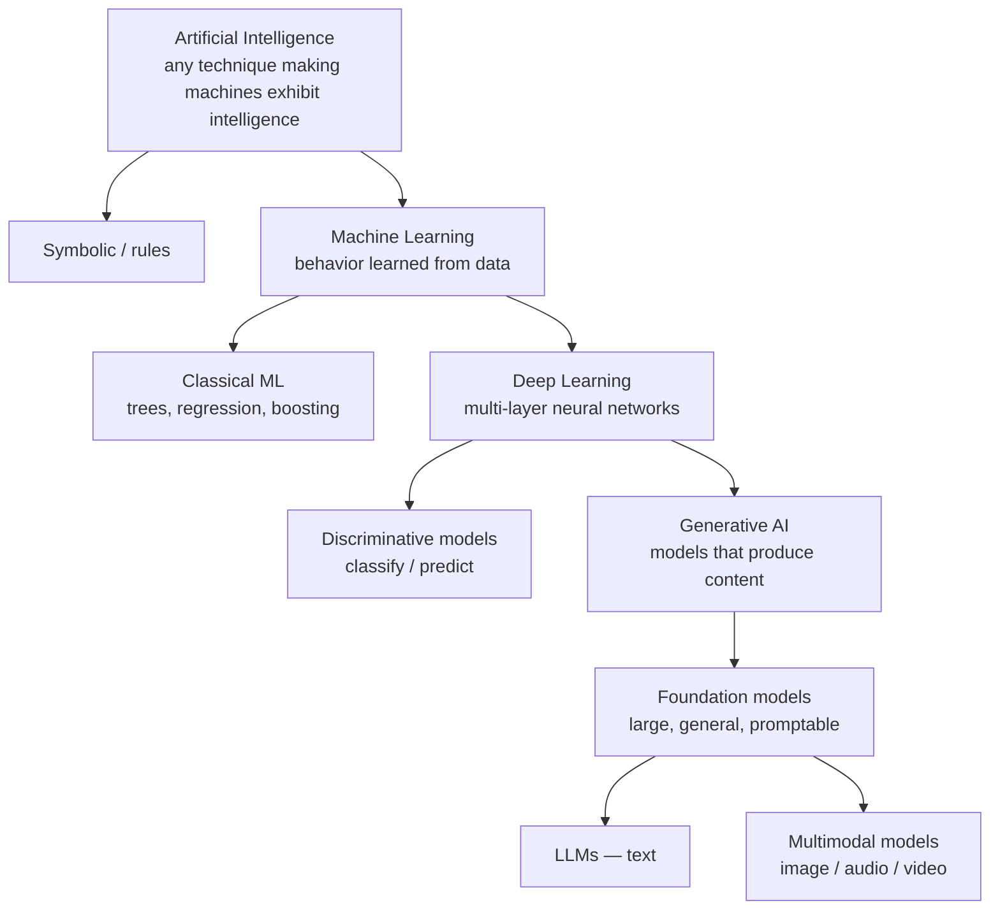

# Chapter 2.1 — The AI Landscape: History, Waves & Vocabulary

| | |
|---|---|
| **Part** | 2 — Artificial Intelligence |
| **Maturity level** | 1 — Understand |
| **Difficulty** | Beginner |
| **Estimated study time** | 2–3 hours (reading 90 min, exercise 1 h) |
| **Prerequisites** | None within Part 2; [Chapter 1.1](../part-1-professional-foundation/chapter-01-from-engineer-to-architect.md) for role context |

## Learning Objectives

After this chapter you will be able to:

1. Place the current GenAI wave in the sequence of AI approaches — symbolic systems, classical ML, deep learning, foundation models — and state what each wave could and couldn't do.
2. Use the vocabulary precisely: AI vs. ML vs. deep learning vs. generative AI vs. foundation models vs. LLMs, and correct their misuse in meetings without pedantry.
3. Recognize the recurring hype-cycle pattern and use it to calibrate stakeholder expectations and investment timing.
4. Identify which historical approach — not just the newest — actually fits a given enterprise problem.

## Introduction

Architects need history for a practical reason: every AI wave left behind techniques that still win in their niches, and every wave produced an expectations bubble whose shape repeats. The stakeholder who believes today's LLMs are six months from replacing the underwriting department is making the same calibration error made about expert systems in 1985 — and the architect who can name the pattern can manage the expectation without dismissing the genuine capability.

This chapter is deliberately the shortest technical on-ramp in Part 2. Its job is a correct map and a precise vocabulary; the mechanisms come in 2.2–2.6.

## Business Motivation

Vocabulary confusion costs real money. An enterprise that conflates "AI" with "LLMs" will buy a generative solution for a problem that a $50K classical classifier solves better, cheaper, and more auditably — fraud scoring, demand forecasting, and churn prediction remain classical-ML territory in most shops, and boards approving "AI budgets" rarely know the difference. The reverse error is as common: dismissing GenAI because a 2019-era chatbot project failed, as if the technology were the same. Architects are the translation layer; a shared, precise vocabulary in the steering committee is worth more than any single design decision, because every subsequent decision routes through it. And hype-cycle literacy has direct budget consequences: the organizations that invested in ML *fundamentals* (data quality, evaluation discipline) during the last trough entered the GenAI wave years ahead of competitors who had funded only demos.

## Theory

### The waves

**Symbolic AI / expert systems (1950s–1980s).** Intelligence as hand-written rules and logic. Strengths: transparent, auditable, deterministic — properties enterprises still love. Fatal limit: rules had to be written by humans, and the world outran the rule-writers (the "knowledge acquisition bottleneck"). Legacy: business-rules engines, and the lesson that *brittleness kills adoption*. The 1987–93 "AI winter" followed its overpromises.

**Classical machine learning (1990s–2012).** Intelligence as patterns *learned from data*: regression, decision trees, SVMs, gradient boosting. The paradigm inversion that still defines everything since: don't write the rules, learn them from examples. Strengths: strong on structured/tabular data, cheap, interpretable-ish, still state-of-the-art for much of enterprise prediction. Limit: features had to be engineered by hand; unstructured data (text, images) stayed hard.

**Deep learning (2012–2020).** Neural networks with many layers, unlocked by GPUs and big datasets (the 2012 ImageNet moment). The networks learn the *features themselves* — vision and speech fell within five years. Limit: each model was task-specific, needing large labeled datasets per task. Chapter 2.3 covers the mechanics.

**Foundation models & GenAI (2018–present).** Train one very large model on internet-scale unlabeled data (Chapter 2.5's transformer made this scalable); it acquires broad capabilities that *transfer* to tasks it was never explicitly trained for, steered by prompts rather than retraining. This is the discontinuity that matters architecturally: capability became a **general-purpose utility consumed through an API**, collapsing the marginal cost of language tasks that previously each needed a bespoke model, a labeled dataset, and an ML team.

### The vocabulary, nested

Precision points worth enforcing: **generative vs. discriminative** is about output (content vs. labels/scores), not quality; a **foundation model** is defined by generality and transfer, not just size; **LLM** is the text-specialized subset of foundation models, though usage is sloppy; and "**AI agent**" (Chapter 3.8) is an application *architecture* wrapped around a model, not a kind of model. When a stakeholder says "AI," your first clarifying question is which layer of this diagram they mean — the answer changes the build by an order of magnitude.

### The hype cycle as an operating tool

Every wave has run the same curve: breakthrough → inflated expectations → disillusionment trough → productive plateau. Two architect's uses. *Calibration:* in the expectations phase (where GenAI's outer edges still are), discount capability claims that lack evals, and expect the trough — plan initiatives that survive it by anchoring them in measured value (Chapter 1.3), not narrative. *Timing:* the trough is historically the best investment window — talent is available, tooling has matured, and competitors have retreated; the classical-ML plateau is precisely why it now runs quietly inside every bank. The professional stance is neither cheerleading nor cynicism: it's *dated, falsifiable expectations* — "here's what's measurable today; here's our review trigger."

### Choosing across waves

The waves coexist as a portfolio, and the architect's job is matching, not maximalism:

| Problem shape | Usually best served by |
|---|---|
| Tabular prediction (churn, fraud score, demand) | Classical ML — cheaper, faster, more auditable |
| Hard constraints, full auditability (eligibility rules, pricing tables) | Rules — deliberately boring |
| Perception (OCR, speech-to-text, image classification) | Deep learning, usually via managed APIs |
| Language understanding & generation, synthesis across documents, flexible instruction-following | Foundation models / LLMs |
| Composite enterprise problems | **Hybrids** — LLM for language surface, rules for constraints, classical ML for scoring (most real systems in this curriculum's [case studies](../../case-studies/README.md)) |

## Architecture Perspective

The foundation-model wave changed *where AI sits in the stack*. Pre-2020, "adding AI" meant an ML project: collect labels, train, host, maintain — AI as a bespoke component with a data-science team attached. Post-foundation-models, baseline language capability is an API call, and the architecture work moved *up*: retrieval, orchestration, evaluation, guardrails, cost control — the entire subject of Parts 3–5. Consequences the rest of this curriculum builds on: the build-vs-buy default flipped (consume capability; differentiate in your data and workflow integration — Chapter 4.13); the scarce skill moved from model training to *system* design around probabilistic components; and the vendor relationship became architectural — model providers are now infrastructure dependencies with the failure, pricing, and lock-in characteristics of any critical supplier (Chapters 5.9, 6.10). Meanwhile the earlier waves didn't leave the stack: the well-architected enterprise runs rules, classical ML, and foundation models side by side, each where its properties win — and the architect who can draw that boundary is worth more than one who can only prompt.

## Real-world Example

**Bellhaven Insurance** (Chapter 1.3's mid-size commercial insurer) illustrates the portfolio in one workflow. Their submission-intake system — the one Tomás built the business case for — is routinely described in board materials as "the AI intake platform." It is actually four waves in a trench coat: an LLM extracts fields from unstructured broker emails and PDFs (foundation model — the part impossible before 2020); a gradient-boosted classifier scores submission quality and routes priorities (classical ML — trained on ten years of tabular bind-rate data, and beating an LLM on both accuracy and cost for this job by a wide margin); a rules engine applies appetite filters (symbolic — because "we do not write coastal flood in Zone V" must be *certain*, not probable); and an OCR service reads scanned ACORD forms (deep learning, bought as an API). When a new CTO proposed "simplifying onto one LLM," the architecture team ran the comparison: the LLM matched the classifier's routing accuracy only with extensive prompting, at 40× the unit cost, with no stable audit story for regulators. The proposal died in one meeting — because the team could name what each wave was *for*.

## Hands-on Exercise

**Build a wave-map of a real AI portfolio.** Use your organization, or a company from the [case-study catalog](../../case-studies/README.md). ~1 hour.

1. **Inventory (20 min).** List every "AI" system in scope (marketing labels included). For each: which wave is it actually — rules, classical ML, deep learning, foundation model, hybrid?
2. **Mislabel hunt (15 min).** Find at least one system whose label and reality diverge ("AI-powered" rules engine; "chatbot" decision tree). Note what the mislabel costs — wrong expectations, wrong budget line, wrong team assigned.
3. **Fit audit (15 min).** Pick one system and argue in five sentences whether its wave is the *right* wave, using the problem-shape table.
4. **The glossary memo (10 min).** Write the five-definition memo (AI / ML / deep learning / GenAI / foundation model) you'd actually send to a steering committee — each definition one sentence, each with an in-house example.

**Acceptance criteria:**
- [ ] Every inventoried system assigned a wave, with hybrids decomposed
- [ ] One mislabel found and its cost articulated
- [ ] Fit audit references problem shape, cost, and auditability — not novelty
- [ ] Glossary memo uses only in-house examples and survives a non-technical read-aloud

## Enterprise Considerations

Enterprise AI portfolios are archaeological — every wave is present somewhere, usually undocumented. Three consequences. **Inventory before strategy:** the EU AI Act-style regulatory regimes (Chapter 2.8) require knowing what AI systems you run, including the 2009 rules engine someone relabeled "AI" for a budget cycle and the 2016 churn model nobody owns; the wave-map exercise above is, at enterprise scale, a compliance artifact. **Skills are wave-specific:** the team that maintains the gradient-boosting models is not interchangeable with the team building RAG systems, and "upskilling" plans that assume one AI skill set produce staffing gaps (Chapter 8.7). **Vendor claims need wave-translation:** procurement will forward you "AI-powered" product sheets weekly; the first triage question — *which wave, consumed how* — sorts genuine capability from relabeled rules faster than any demo.

## Trade-offs

| Decision | Option A | Option B | Choose A when… | Choose B when… |
|----------|----------|----------|----------------|----------------|
| Problem fit | Foundation model / LLM | Classical ML or rules | Language in, language out; low volume; flexibility beats unit cost | Tabular data, high volume, hard constraints, audit burden |
| Capability sourcing | Consume via API | Build/train in-house | Default post-2022 for language capability | The model *is* your moat, or data cannot leave (Chapters 4.13, 5.11) |
| Expectation posture | Ride the wave publicly | Quiet capability building | Talent attraction and market signaling matter now | Board has been burned before; trough is near — measured value survives troughs, narratives don't |
| Portfolio evolution | Migrate legacy ML to GenAI | Keep each wave where it wins | The legacy system's real problem is language-shaped | Almost everywhere else — Bellhaven's one-meeting rule |

## Common Mistakes

1. **Newest-wave maximalism** — routing every problem to an LLM because it's the current wave. The 40×-cost routing classifier is the canonical own-goal; the problem-shape table is the antidote.
2. **Judging the technology by the previous wave's failure** — "we tried chatbots in 2019" as an argument about 2026 systems. Name the discontinuity (task-specific models vs. promptable foundation models) and re-baseline.
3. **Letting "AI" stay undefined in governance documents** — budgets, policies, and risk registers that say "AI" without the taxonomy govern everything and nothing. The nested diagram belongs in the policy's first page.
4. **Confusing generative with better** — generative models *produce content*; when the job is a score or a class at scale, discriminative approaches usually dominate on every axis that matters.
5. **Hype-cycle timing errors in both directions** — betting the roadmap on capabilities that exist only in demos, or freezing all investment at the trough and paying the catch-up premium later. Dated, falsifiable expectation statements are the discipline.

## Best Practices

1. **Maintain the wave-map as a living inventory** — one page, every AI system, its wave, its owner; it serves strategy, staffing, and (increasingly) regulators simultaneously.
2. **Enforce the taxonomy in steering documents** — gently, once, in writing; after that the shared vocabulary compounds through every decision.
3. **Triage vendor "AI" claims with the wave question first** — which layer of the diagram, consumed how, evidenced by what evals.
4. **Default to hybrids** — LLM at the language surface, rules at the constraints, classical ML at the scores; single-wave purity is a smell in enterprise systems.
5. **Write expectations with dates and triggers** — "we expect X measurable by Q3; if not, we review" survives hype and trough alike (Chapter 1.7's calibration discipline applied to the technology itself).

## Architecture Checklist

Before any "add AI" initiative:

- [ ] The problem's shape is classified before the technology is chosen (tabular/perception/language/constraints)
- [ ] At least one non-foundation-model option was honestly considered (Chapter 1.4's boring option)
- [ ] The system's wave is recorded in the portfolio inventory with an owner
- [ ] Vocabulary in the initiative's documents matches the nested taxonomy
- [ ] Expectations are dated and falsifiable, with a review trigger
- [ ] Hybrid boundaries (what the LLM does vs. rules vs. classical ML) are explicit in the design

## Interview Questions

1. *"Explain the difference between AI, ML, and GenAI to a board member."* — Strong answers nest the terms in one breath each, with a concrete in-company example per layer, and land on why the distinction changes spend.
2. *"When would you choose classical ML over an LLM?"* — Strong answers produce the problem-shape logic (tabular, volume, auditability, unit cost) and a concrete case like routing/scoring, rather than framing LLMs as universally superior.
3. *"What's genuinely new about foundation models versus the deep learning wave?"* — Strong answers center transfer and promptability — capability as a general-purpose API rather than per-task training — and draw the architectural consequence: the work moved to the system around the model.
4. *"How do you keep a company investing sensibly through an AI hype cycle?"* — Strong answers use the cycle as a tool: eval-backed capability claims, value anchoring, dated expectations, and the trough as a buying opportunity.

## Further Reading

- Stuart Russell & Peter Norvig, *Artificial Intelligence: A Modern Approach* (4th ed.) — chapters 1–2 for the definitive history and taxonomy; the rest is reference.
- Rich Sutton, *The Bitter Lesson* (incompleteideas.net) — one page explaining why scale-plus-learning has repeatedly beaten hand-engineered knowledge; the single most predictive essay about AI's direction.
- Bommasani et al., *On the Opportunities and Risks of Foundation Models* (Stanford CRFM, arxiv.org/abs/2108.07258) — the paper that named the era; read the introduction and the "emergence and homogenization" framing.
- Gartner's hype cycle methodology pages (gartner.com) — read critically: useful as shared vocabulary with executives, not as forecasting.

## Summary

- AI has arrived in **four waves** — symbolic rules, classical ML, deep learning, foundation models — and all four are still in production, each where its properties win.
- The vocabulary **nests**: AI ⊃ ML ⊃ deep learning ⊃ generative AI ⊃ foundation models ⊃ LLMs; enforcing it in governance documents is cheap and compounds.
- The foundation-model discontinuity is **transfer + promptability**: language capability became an API-consumable utility, moving the architect's work up the stack to retrieval, evaluation, and orchestration.
- **Problem shape picks the wave**: tabular → classical ML; hard constraints → rules; perception → DL APIs; language → foundation models; real systems → hybrids.
- The hype cycle is an **operating tool**: dated falsifiable expectations, eval-backed claims, and troughs as buying opportunities.

---

**Previous:** [Part 2 index](README.md) · **Next:** [Chapter 2.2 — Machine Learning Fundamentals](chapter-02-machine-learning-fundamentals.md) · **Related:** [1.3 Business Understanding](../part-1-professional-foundation/chapter-03-business-understanding.md), [3.1 LLMs: Capabilities & Limits](../part-3-core-building-blocks-of-genai/chapter-01-llm-capabilities-limits.md), [4.13 Prompting vs. RAG vs. Fine-tuning](../part-4-enterprise-genai-systems/chapter-13-prompting-rag-finetuning.md)
