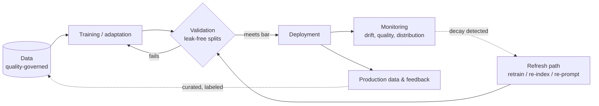

# Chapter 2.2 — Machine Learning Fundamentals

| | |
|---|---|
| **Part** | 2 — Artificial Intelligence |
| **Maturity level** | 1 — Understand |
| **Difficulty** | Beginner |
| **Estimated study time** | 3–4 hours (reading 2 h, exercise 90 min) |
| **Prerequisites** | [Chapter 2.1](chapter-01-ai-landscape.md); comfort with basic statistics helpful, not required |

## Learning Objectives

After this chapter you will be able to:

1. Explain the learning paradigms — supervised, unsupervised, self-supervised, reinforcement — and identify which one underlies any given system, including LLMs.
2. Reason about generalization: why models fail on data unlike their training data, and what overfitting/underfitting look like in practice.
3. Apply the train/validation/test discipline and spot data leakage — the failure that produces impressive demos and worthless systems.
4. State why data quality bounds every ML system's ceiling, and what that implies for the enterprise data work in Parts 4–6.

## Introduction

Everything in GenAI rests on a handful of machine-learning ideas that predate it by decades: learning from examples, generalizing to the unseen, and the eternal gap between performance on data you have and data you'll meet. Architects don't need to derive the math — but they must *reason* with these concepts daily, because they explain the failure modes stakeholders will ask about: why the model aces the demo and stumbles in production (distribution shift), why "99% accurate" can be a worthless claim (base rates, leakage), why more data sometimes fixes nothing (quality ceiling).

This chapter builds that reasoning kit. Chapter 2.3 extends it to neural networks, and Chapter 2.7 industrializes the evaluation half — but the concepts here are the ones you'll use in every design review for the rest of your career.

## Business Motivation

ML concept gaps cost enterprises in a specific, recurring way: **decisions made on illusory performance numbers**. A procurement team accepts a vendor's "97% accuracy" without asking about the test set's provenance (leaked? unrepresentative? cherry-picked?), and the fraud model that scored 97% in the bake-off catches 60% of real fraud — because production fraud doesn't resemble the vendor's curated benchmark. The gap between those numbers is measured in millions of unflagged losses, and the question that would have caught it ("how was the evaluation set constructed, and does it match our distribution?") costs nothing but literacy. The same literacy protects GenAI investments: understanding that LLMs are trained on *past* internet text explains their recency limits and drives the RAG architecture decision (Chapter 3.6); understanding distribution shift explains why an assistant tuned on last year's tickets degrades as products change, and prices the monitoring pipeline (Chapter 4.10) into the business case up front.

## Theory

### Learning paradigms

- **Supervised learning** — learn from labeled pairs (input → correct output): spam/not-spam, claim → payout band. The workhorse of enterprise prediction. Its cost center is *labels*: someone must produce thousands of correct answers, and label quality caps model quality.
- **Unsupervised learning** — find structure without labels: clustering customers, detecting anomalies, reducing dimensions. Cheaper (no labels) but harder to evaluate — "are these clusters *good*?" has no ground truth.
- **Self-supervised learning** — manufacture labels from the data itself: hide a word, predict it from context. This is the trick that unlocked foundation models — the internet becomes an effectively infinite labeled dataset, no human annotation required (Chapter 2.6 details LLM pre-training as exactly this).
- **Reinforcement learning** — learn from rewards for actions in an environment rather than per-example labels. Enterprise-rare directly, but architecturally relevant twice: it's the "RL" in RLHF alignment (Chapter 2.6), and its core problem — *specifying a reward that can't be gamed* — is Chapter 1.2's metric-gaming problem in mathematical form.

### Generalization: the whole game

A model's purpose is performance on data it has *never seen*. Everything else is bookkeeping. Three concepts organize the reasoning:

- **Overfitting** — the model memorized the training data's noise and coincidences instead of its signal: superb on training data, poor on new data. The student who memorized past exams.
- **Underfitting** — the model is too simple to capture the signal at all: poor everywhere.
- **The bias–variance intuition** — model capacity is a dial: too little capacity underfits, too much overfits *for a given amount of data*. More/better data moves the whole trade-off outward — which is why "get more data" and "get better data" beat model cleverness so often that it's an industry proverb.

**Distribution shift** is generalization's production-time enemy: the world drifts away from the training data. Products change, fraudsters adapt, language evolves, a pandemic rewrites customer behavior. All deployed models decay; the design questions are *how fast*, *how will we notice* (monitoring — Chapter 4.10), and *what's the refresh path* (retraining pipelines, or for LLM systems, refreshed retrieval corpora — Chapter 4.3).

### The evaluation discipline

The train/validation/test split is a contamination-control protocol: **train** on one set; tune choices on a **validation** set; report final performance once on a **test** set the process has never touched. The test set simulates the future — every time information from it leaks into development, the simulation degrades toward flattery.

**Data leakage** is the discipline's cardinal sin and it is *everywhere*: the target variable smuggled in via a proxy column (claims model "predicting" fraud from a field only populated after investigation), temporal leakage (training on March data, testing on January — the model saw the future), duplicate records straddling the split, or tuning-until-the-test-set-agrees (leakage by iteration). Leakage produces exactly one symptom: results too good, discovered too late. The architect's reflex when shown any impressive number: *how was the split constructed, and could the model have seen the answer?*

For GenAI, the same discipline reappears wearing new clothes: **benchmark contamination** (public test sets in the pre-training data — Chapter 2.7), and golden-set hygiene for evals (Chapter 4.7's versioned datasets are the train/test split reborn).

### Data quality: the ceiling

"Garbage in, garbage out" understates it — ML *amplifies* data pathologies. Labels encode their labelers: a model trained on historical hiring decisions learns historical hiring biases with mathematical fidelity (Chapter 2.8). Missing data is rarely random: the customers without income data are unlike those with. Historical data encodes historical *policy*: a credit model trained on approved loans learns nothing about the rejected — a structural blind spot no algorithm fixes. The strategic consequence for architects: **the durable AI advantage is data advantage**. Models are increasingly commodities (Chapter 2.1's utility shift); proprietary, well-governed, well-labeled data is not — which is why Part 6's data-governance chapters are load-bearing for AI strategy, not compliance decoration.

## Architecture Perspective

The ML lifecycle is an architecture with feedback loops, and the architect's job is making the loops real:

Three design consequences. First, **the refresh path is architecture, not operations**: a model without a designed, tested route from "drift detected" to "updated system in production" is a depreciating asset with no maintenance plan — for LLM systems the refresh path often runs through the retrieval corpus rather than the model, which is a core reason RAG wins so many Chapter 4.13 decisions. Second, **evaluation infrastructure is a first-class component**, not a project phase: the leak-free split, the representative eval set, the drift monitors — these outlive any individual model. Third, **the feedback edge is where compounding lives**: systems that capture and curate production outcomes into future training/eval data get better with use (Chapter 1.2's flywheel); systems that don't, only decay. Whether the "model" box holds a gradient-boosted tree or a frontier LLM changes the tools in every box — it changes nothing about the shape.

## Real-world Example

**Averline Retail Group** (Chapter 1.2's 900-store retailer) built a demand-forecasting model to cut inventory waste. The pilot results were extraordinary — 94% forecast accuracy, presented to the board — and the architect, Ines, was the one who refused to celebrate. Her leakage audit found it in a day: the training pipeline included a "warehouse allocation" column, which was set by planners *who had already seen early sales figures* — the model was "predicting" demand partly from a field that encoded the answer. The corrected model scored 78%.

What happened next is the reason the story is in this chapter. 78% honest was still worth seven figures annually against the 71% baseline heuristic — the *initiative* was sound; only the number had been fiction. But Ines had to walk the 94% back up to the board (Chapter 1.8's owned-mistake deposit, made on behalf of the team), and the recovery protocol she instituted became Averline policy: every reported model metric ships with its split-construction note ("temporal split, test = last 8 weeks, leakage audit signed by X"), and any metric above the known ceiling for the problem class triggers an audit *before* it travels upward, not after. Eighteen months later the same protocol caught a vendor's churn model whose bake-off numbers had been tuned against the test set — in procurement, before signature, where the question was worth exactly the contract's value.

## Hands-on Exercise

**Leakage hunt and honest evaluation.** No coding required, though optional. ~90 minutes.

1. **Paradigm mapping (20 min).** For each of: spam filter, customer clustering, LLM pre-training, RLHF, product recommendations, anomaly detection — name the paradigm, the "label" source, and the main evaluation difficulty.
2. **Leakage audit drill (40 min).** Below are four evaluation setups; find the flaw in each and state the honest redesign:
   a. Fraud model trained on 2023–2024 data, tested on a random 20% of the same rows (duplicates exist across months).
   b. Support-ticket classifier whose features include "assigned team" — set by the triage staff the model is meant to replace.
   c. Resume screener validated on the same dataset it was iteratively tuned against, 200+ iterations.
   d. RAG assistant evaluated on 50 questions written by the engineer who built the retrieval pipeline, referencing documents she chose.
3. **Ceiling memo (30 min).** Pick a prediction problem in your domain. Write a half-page memo: what data quality issues bound its ceiling (label noise, historical policy encoding, missingness), what number would make you suspicious, and what split construction you'd require.

**Acceptance criteria:**
- [ ] All six systems mapped to paradigms with label source identified (LLM pre-training → self-supervised is non-negotiable)
- [ ] All four leakage flaws found and named (temporal/duplicate, proxy-target, iteration leakage, author bias) with redesigns
- [ ] Ceiling memo names a specific "too good" threshold and the audit it would trigger

## Enterprise Considerations

Enterprise ML adds institutional weight to each concept. **Model risk management** (formalized in banking as SR 11-7-style regimes, spreading everywhere via AI regulation — Chapter 4.14) is essentially this chapter enforced by auditors: documented data lineage, split construction, validation independent of development, decay monitoring. **Label operations** are a budget line nobody plans for: sustained labeling of production data for monitoring and retraining costs real headcount, and the Chapter 1.6 move — domain experts writing rubrics and adjudicating hard cases — is how it's staffed without burning out specialists. **Vendor evaluation** is where the leakage reflex pays most visibly: insist on evaluation against *your* held-out data, constructed by *your* team, or treat the vendor's numbers as marketing (Averline's procurement catch is the template). And **data quality is an org-chart problem before it's a pipeline problem**: the teams that create the data rarely own the consequences of its quality — Chapter 6.7's governance structures exist to close exactly that loop.

## Trade-offs

| Decision | Option A | Option B | Choose A when… | Choose B when… |
|----------|----------|----------|----------------|----------------|
| Data vs. model investment | Spend on data quality & labels | Spend on model sophistication | Almost always first — the ceiling moves | Data is already clean, plentiful, well-labeled (rare) |
| Evaluation rigor | Strict temporal splits, independent test | Quick random splits | Production decisions, temporal data, vendor bake-offs | Early exploration, explicitly labeled as such |
| Refresh strategy | Scheduled retraining pipeline | Drift-triggered refresh | Predictable drift (seasonality), cheap retrains | Expensive retrains; good drift monitoring exists |
| Interpretability | Simpler, explainable model | Higher-capacity black box | Regulated decisions, appeal rights, debugging matters | Measured accuracy gap is large *and* explainability isn't required |

## Common Mistakes

1. **Accepting metrics without split provenance** — the vendor's 97%, the pilot's 94%. The question "how was the test set constructed?" is the cheapest risk control in applied ML.
2. **Random splits on temporal data** — letting the model see the future during training. Time-ordered problems get time-ordered splits, no exceptions.
3. **Iterating against the test set** — 200 tuning cycles later, the test set is a validation set and the reported number is fiction. Fresh held-out data for final claims.
4. **Treating deployment as the finish line** — every model decays; a system without drift monitoring and a refresh path is scheduled for silent failure (the ML twin of Chapter 1.7's ungraded estimate).
5. **Assuming more data fixes quality problems** — more biased data is more bias; more leaked data is more leakage. Volume amplifies whatever is there.
6. **Base-rate blindness** — "99% accurate" on 1%-incidence fraud describes a model that flags nothing. Accuracy without the confusion matrix (Chapter 2.7) is a number without a meaning.

## Best Practices

1. **Institute the split-provenance note** — every metric that travels upward carries its evaluation construction, one line; Averline's protocol is the template.
2. **Set "too good" tripwires** — know the plausible ceiling for each problem class; numbers above it trigger audits before celebration.
3. **Budget label operations as a standing line** — monitoring and refresh need continuous ground truth; plan the human loop, don't improvise it.
4. **Design the refresh path with the system** — drift detection → update → re-validation → deploy, tested like any other pipeline, whether the update is a retrain or a re-index.
5. **Demand evaluation on your data in every procurement** — held out, temporally honest, constructed by your side.
6. **Route the data-quality findings to Part 6 machinery** — each ceiling you hit is a governance case; log it where the data owners live, not just in the model repo.

## Architecture Checklist

For any system with a learned component (classical or LLM-based):

- [ ] Learning paradigm and label source identified — including for vendor components
- [ ] Evaluation splits documented: construction method, temporal handling, leakage audit owner
- [ ] Reported metrics carry split provenance and appropriate base-rate context
- [ ] Drift monitoring specified: what distributions are watched, what thresholds trigger action
- [ ] Refresh path designed and tested (retrain / re-index / re-prompt) with re-validation gate
- [ ] Production feedback capture is in the design — the flywheel edge exists
- [ ] Data-quality ceiling assessed and the binding constraints logged with data owners

## Interview Questions

1. *"A vendor claims 97% accuracy. What do you ask before believing it?"* — Strong answers interrogate the evaluation: test-set construction, temporal honesty, leakage vectors, base rates, and demand a bake-off on the buyer's held-out data.
2. *"Explain overfitting to a business stakeholder, and tell me how it shows up in GenAI systems."* — Strong answers use the memorization analogy, then bridge: prompts tuned against a small eval set until they're overfit to it, benchmark contamination, golden sets that stopped being representative.
3. *"What learning paradigm do LLMs use, and why does it matter architecturally?"* — Strong answers name self-supervised pre-training (labels manufactured from text itself), and draw consequences: no recency beyond training data (hence RAG), behavior shaped later by alignment (Chapter 2.6).
4. *"Your production model's performance is degrading. Walk me through your diagnosis."* — Strong answers reach for distribution shift first (what changed: inputs, base rates, upstream data pipelines?), check monitoring before touching the model, and end at the refresh path.

## Further Reading

- Andrew Ng, *Machine Learning Yearning* (free, deeplearning.ai) — the best short text on evaluation discipline, error analysis, and data-vs-model investment; written for practitioners, perfect for architects.
- Google, *Rules of Machine Learning* (developers.google.com/machine-learning/guides/rules-of-ml) — 43 battle-tested rules; rules 1–3 alone ("don't be afraid to launch without ML") justify the read.
- Christoph Molnar, *Interpretable Machine Learning* (free online) — for the explainability side of the trade-off table.
- Sculley et al., *Hidden Technical Debt in Machine Learning Systems* (NeurIPS 2015) — the classic paper on why the model is the small box in the architecture; the thesis Part 4 of this curriculum industrializes.

## Summary

- Four paradigms, one key to the era: **self-supervised learning** turned the internet into free training data and made foundation models possible.
- **Generalization is the whole game**: overfitting, underfitting, and distribution shift explain most "it worked in the demo" failures — and all deployed models decay.
- The **train/validation/test discipline** exists to keep performance claims honest; **leakage** is its ever-present enemy, and split provenance is the architect's cheapest control.
- **Data quality is the ceiling** and data advantage is the moat — models commoditize, well-governed proprietary data doesn't.
- Architecturally: evaluation infrastructure and the **refresh path** are first-class, permanent components; the feedback loop is where systems compound instead of decay.

---

**Previous:** [Chapter 2.1 — The AI Landscape](chapter-01-ai-landscape.md) · **Next:** [Chapter 2.3 — Deep Learning Fundamentals](chapter-03-deep-learning-fundamentals.md) · **Related:** [2.7 Evaluating ML Systems](chapter-07-evaluating-ml-systems.md), [4.7 Evaluation Systems](../part-4-enterprise-genai-systems/chapter-07-evaluation-systems.md), [6.7 Data Governance](../part-6-enterprise-architecture/chapter-07-data-governance-knowledge.md)
