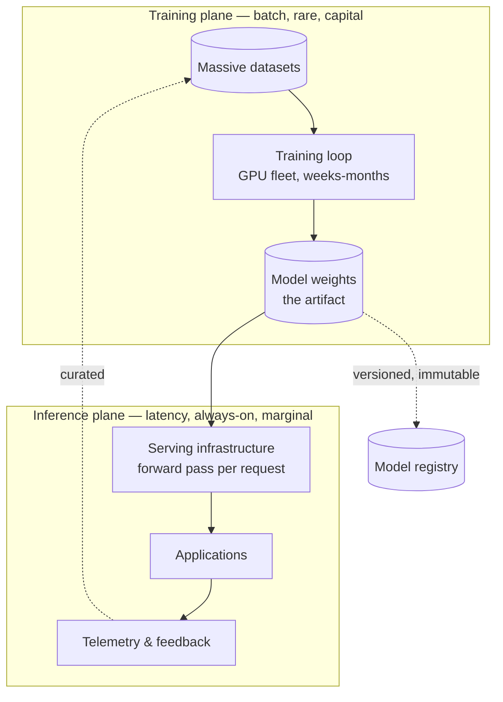

# Chapter 2.3 — Deep Learning Fundamentals

| | |
|---|---|
| **Part** | 2 — Artificial Intelligence |
| **Maturity level** | 1 — Understand |
| **Difficulty** | Beginner–Intermediate |
| **Estimated study time** | 3–4 hours (reading 2 h, exercise 90 min) |
| **Prerequisites** | [Chapter 2.2 — Machine Learning Fundamentals](chapter-02-machine-learning-fundamentals.md) |

## Learning Objectives

After this chapter you will be able to:

1. Explain what a neural network is and how training works — forward pass, loss, backpropagation, gradient descent — at whiteboard depth.
2. State what "representation learning" means and why it dissolved the feature-engineering bottleneck that limited classical ML.
3. Reason about the economics deep learning introduced: why GPUs, why scale, why training and inference costs behave the way they do.
4. Explain the scaling insight — more compute, data, and parameters yielding predictable improvement — that motivated the leap to foundation models.

## Introduction

Deep learning is the mechanism under every model in this curriculum. You will never implement backpropagation as an architect — but you will constantly reason about things that are *consequences of the mechanism*: why models need GPUs, why training is a batch process and inference a latency problem, why capabilities scale with size, why nobody can fully explain a specific output, and why "just look inside the model and fix it" is not an available move. This chapter builds the mechanism at exactly the depth those conversations require: enough to reason, not to publish (the Part 2 contract).

The payoff arrives immediately in Chapter 2.5, where the transformer is a specific neural architecture, and compounds through Part 5, where GPU economics and inference infrastructure are this chapter's concepts with invoices attached.

## Business Motivation

Two expensive executive misunderstandings trace directly to not knowing this chapter. The first: **"just fix the model's mistake"** — the belief that a wrong output can be patched like a bug. A neural network's behavior is distributed across billions of learned weights; there is no line of code where the error lives. The available remedies are architectural (retrieval grounding, guardrails, fine-tuning — Parts 3–4), each with a cost and timeline that the "bug fix" mental model catastrophically underestimates; architects who set this expectation early save quarters of stakeholder friction. The second: **compute-blind budgeting** — approving an AI roadmap without understanding that deep learning converted software economics from "developer time" to "developer time + industrial compute." Training runs are capital projects; inference is a marginal cost on every request (Chapter 1.7's math); GPU supply is a genuine procurement constraint (Chapter 5.2). Enterprises that learned this from their first invoice paid tuition; those whose architects taught it first, didn't.

## Theory

### The mechanism in four steps

A **neural network** is a function with millions-to-billions of tunable knobs (**parameters** / weights), built from layers of simple units: each unit computes a weighted sum of its inputs and applies a nonlinearity. Stack layers and the network can approximate essentially any input→output mapping — *if* the knobs are set right. Training is the knob-setting:

1. **Forward pass** — feed an example through; the network produces an output.
2. **Loss** — a number scoring how wrong that output is against the target.
3. **Backpropagation** — calculus (the chain rule, industrialized) computes, for every one of the billions of knobs, which direction would reduce the loss.
4. **Gradient descent** — nudge every knob a tiny step in its direction; repeat millions of times over the dataset.

That's the whole trick. Everything else — architectures, optimizers, tricks — is engineering to make this loop stable, fast, and effective at scale. Two properties of the result matter permanently for architects: the "knowledge" is **distributed** (smeared across all weights — no locatable fact, no patchable rule; the source of the "can't just fix it" reality), and the process is **statistical** (the network learned what reduced average loss on training data — Chapter 2.2's generalization logic governs everything it does on your data).

### Representation learning: why deep beat classical

Classical ML needed humans to design **features** — "for spam detection, count exclamation marks, check the sender domain…" — and feature quality capped model quality (Chapter 2.1's bottleneck). Deep networks learn the features *themselves*: early layers learn primitives (edges in images, character patterns in text), middle layers compose them (shapes, words, syntax), late layers assemble task-relevant abstractions (faces, sentiment, meaning). This is **representation learning**, and it is the single most important idea in the chapter, because **embeddings** ([Glossary](../../GLOSSARY.md)) — the vectors your RAG systems will retrieve by (Chapter 3.5) — are exactly these learned representations, exposed as a product. When you use an embedding model, you are renting the middle layers of a network that already learned what language means; semantic search works because "similar meaning" became "nearby vectors" as a *side effect of training*.

### The economics the mechanism dictates

- **Why GPUs:** the forward and backward passes are gigantic matrix multiplications — millions of independent multiply-adds. GPUs (and TPUs) do these in parallel; CPUs don't. This isn't a preference, it's a ~100× throughput gap, and it makes AI compute a distinct procurement category (Chapter 5.2).
- **Training vs. inference asymmetry:** training runs the loop billions of times over months on GPU fleets — a batch capital project, done rarely. Inference runs one forward pass per request — a latency-bound marginal cost, paid always. Almost all enterprise GenAI spend is inference (Chapter 4.11); almost all headline AI capex is training. Confusing the two produces nonsense budgets in both directions.
- **Why bigger got better — predictably:** the empirical **scaling laws** finding: loss falls as a smooth power law in parameters, data, and compute, holding across many orders of magnitude. Capability became *plannable* — you could budget a capability level — which is precisely why labs kept scaling and why foundation models exist (Chapter 2.1's discontinuity has this chapter's economics under it). Two caveats an architect should carry: specific *downstream* capabilities can appear unevenly (thresholdy "emergence" — contested but operationally real), and scaling laws describe pre-training loss, not your task's quality — your evals (Chapter 4.7) remain the only source of truth for that.
- **The interpretability trade:** what was gained in capability was paid in inspectability. A gradient-boosted tree can be audited feature by feature; a billion-parameter network cannot — post-hoc explanation tools exist but are approximations. This trade is why Chapter 2.2's interpretability row sometimes forces classical models in regulated decisions, and why GenAI governance (Chapter 4.14) leans on *behavioral* evidence (evals, monitoring) rather than internal inspection.

## Architecture Perspective

Deep learning's mechanism dictates the shape of every AI serving stack you'll design. The training/inference asymmetry splits the world into two planes with opposite characteristics:

Consequences you'll apply constantly. **The weights are an artifact, not a service**: versioned, immutable, promoted through environments like any release (Chapter 5.7's LLMOps pins model versions for exactly this reason — a provider swapping weights under a stable API name is a *release you didn't test*, and the deployment checklist's model-pinning line descends from this diagram). **The planes scale independently**: enterprises consuming models via API have outsourced the training plane entirely — the Chapter 2.1 utility shift, drawn as architecture — and their design surface is the inference plane: latency, throughput, cost, fallback (Chapters 5.3–5.9). **Inference is physics-bound**: a forward pass through N billion parameters has an irreducible compute cost; latency and unit cost are functions of model size, which is why model tiering (small models for easy work — Chapter 7.8) is an architectural pattern and not just thrift.

## Real-world Example

**Corvid Logistics** (Chapter 1.4's customs-document processor) hit this chapter's content eight months after Lena's tiered-extraction decision, when the finance team flagged that inference spend had grown 60% with no volume growth. The instinct in the room was vendor-blaming; the diagnosis was mechanism-literacy.

The investigation, led by a platform engineer, Priit, read like this chapter applied. First finding: a well-meaning prompt "improvement" had grown the per-document context by 3×— and since inference cost is a forward pass over every input token, the bill tracked token count, not document count (Chapter 1.7's input-dominance, now with a root cause). Second finding: the team had silently moved more traffic to the large model because "quality felt better," without evals showing it — paying the parameter-count physics tax on every easy document. The fixes were architectural, not contractual: context discipline (retrieval trimmed to what the extraction actually used), re-enforcement of the tiering router with eval evidence, and a *cost-per-document dashboard broken down by model tier and token type* so the next drift would be visible in days, not months. Spend dropped 45% with no measured quality loss. Priit's retro line earned its place on the team wiki: "Nobody did anything wrong except forget that every token goes through ten billion parameters. The bill is the physics."

## Hands-on Exercise

**Reason about the mechanism without the math.** ~90 minutes. (Optional deeper track: any "neural network from scratch" tutorial — recommended once in a career, not required here.)

1. **The explain-it drill (30 min).** Write three explanations of how a neural network learns: one for an engineer (may use "loss," "gradient"), one for an executive (no jargon, one analogy), one in exactly two sentences. Test the executive version aloud on a non-technical person; log where they frowned.
2. **The consequence chain (30 min).** For each mechanism fact, write the architectural consequence and the chapter where it lands: (a) knowledge is distributed across weights; (b) inference cost is proportional to model size × tokens; (c) embeddings are learned representations; (d) training is batch/rare, inference is always-on; (e) behavior is statistical, learned from data distribution.
3. **The bill diagnosis (30 min).** Corvid-style scenario: your inference spend rose 50%, volume flat. List, in the order you'd check them, five mechanism-grounded hypotheses and the telemetry that would confirm each.

**Acceptance criteria:**
- [ ] Executive explanation survives a live non-technical read-aloud without a definition request
- [ ] All five consequence chains land on a concrete design decision, not a restatement
- [ ] Bill diagnosis includes token growth, model-mix drift, and retry/call-graph inflation among the hypotheses, with named telemetry for each

## Enterprise Considerations

Enterprises meet this chapter's content through three doors. **Procurement:** GPU capacity — cloud-reserved, on-prem, or embedded in provider pricing — is a supply-constrained market with lead times and commitment discounts; the training/inference asymmetry should drive completely different purchasing postures for the two planes (Chapter 5.2), and finance teams need the asymmetry explained *before* the commit negotiations. **Sustainability reporting:** training and inference carbon footprints are now board-level ESG line items in large enterprises; the same telemetry that feeds cost dashboards (tokens × model size) feeds emissions estimates, and building it once for both is the architect's efficiency. **Explainability regimes:** in regulated decisions, the interpretability trade is a legal constraint, not a preference — some jurisdictions and use cases (credit, hiring — Chapter 2.8) effectively require reason codes that deep models can't natively give, forcing hybrid designs (deep model proposes, interpretable model or rule decides) that must be architected, not bolted on.

## Trade-offs

| Decision | Option A | Option B | Choose A when… | Choose B when… |
|----------|----------|----------|----------------|----------------|
| Model size | Larger (more capable, slower, costlier) | Smaller (cheaper, faster, less capable) | Task difficulty demands it *per evals* | The eval delta doesn't justify the physics tax — tier and route (Ch 7.8) |
| Capability sourcing | Rent inference (API) | Own the serving plane (self-host) | Default: no GPU-ops burden, provider absorbs training plane | Data constraints, unit economics at very high volume, or latency floors (Ch 5.3) |
| Explainability requirement | Deep model + behavioral evidence (evals, monitoring) | Interpretable model / hybrid with reason codes | Quality gap is decisive and regime accepts behavioral evidence | Regulated decisions requiring per-decision reasons |
| Deep vs. classical | Neural approaches | Gradient boosting / classical | Unstructured data (text, image, audio) | Tabular data — still classical's home turf (Ch 2.1) |

## Common Mistakes

1. **Treating model errors as patchable bugs** — assigning a ticket to "fix the hallucination in weights." The remedies are architectural (grounding, guardrails, fine-tuning); set the mental model early or re-set it expensively.
2. **Budgeting inference like software licensing** — flat-fee intuitions applied to a marginal-cost-per-token reality. Corvid's 60% surprise is the standard form; the per-tier, per-token dashboard is the standard fix.
3. **Ignoring the model-mix drift** — traffic migrating to the large model on vibes. Routing decisions are eval decisions (Chapter 3.10), and unrouted "quality feelings" are the physics tax with no receipt.
4. **Expecting internal inspection to satisfy auditors** — promising explainability a deep model can't deliver. Scope the evidence regime (behavioral vs. per-decision reasons) before committing the architecture.
5. **Conflating training capex headlines with your cost structure** — an API-consuming enterprise has no training plane; its money story is inference, and strategy documents that reason from training economics misallocate attention.
6. **Skipping the "why GPUs" conversation with infrastructure teams** — CPU-sized assumptions in capacity planning, discovered as a 100× throughput gap in load testing.

## Best Practices

1. **Teach the two-plane model in your first architecture deck** — training vs. inference, capital vs. marginal; it inoculates budgeting, procurement, and expectations in one slide.
2. **Pin model versions and treat weight changes as releases** — the artifact discipline; provider auto-upgrades go through your eval gate ([deployment checklist](../../checklists/deployment-checklist.md)).
3. **Instrument cost at token × tier granularity from day one** — the bill is the physics; make the physics observable (Chapters 4.10–4.11).
4. **Route by evals, not vibes** — every model-tier decision carries measured quality evidence; "feels better" is a hypothesis, not a routing rule.
5. **Scope the explainability regime before choosing the model class** — behavioral evidence or per-decision reasons; the answer partitions your design space (Chapter 1.6's constraint discipline).
6. **Keep one mechanism-literate explanation ready per audience** — the exercise's three versions, maintained like any artifact; you will use the executive one monthly.

## Architecture Checklist

For any system with a neural model in the path:

- [ ] Training and inference planes identified, with owner and cost model per plane (even when the training plane is a vendor's)
- [ ] Model versions pinned; upgrade path goes through eval gates
- [ ] Inference cost instrumented per token, tier, and feature — drift visible within days
- [ ] Model-size/tier choices carry eval evidence; a routing policy exists
- [ ] Explainability regime scoped and matched to model class (behavioral vs. per-decision)
- [ ] Latency budget reflects model-size physics; tiering considered before hardware
- [ ] Embedding models recognized as models too: versioned, and re-embedding cost planned (Ch 2.2's refresh path)

## Interview Questions

1. *"Explain how a neural network learns, at whiteboard level."* — Strong answers give the four-step loop (forward, loss, backprop, descent) cleanly, then volunteer the architectural consequences: distributed knowledge, statistical behavior, no patchable rules.
2. *"Why did deep learning displace feature engineering, and what's the GenAI-era artifact of that shift?"* — Strong answers explain representation learning and land on embeddings as rented representations — the foundation of semantic search and RAG.
3. *"Your CFO asks why the AI runs on special hardware and why the bill scales with usage."* — Strong answers deliver the matrix-multiplication/parallelism story in one breath and the two-plane economics in the next, ending with the levers (tokens, tiering, caching).
4. *"A regulator asks you to explain a specific model decision. What can and can't you offer?"* — Strong answers are honest about distributed weights and post-hoc approximation, offer behavioral evidence regimes, and describe the hybrid designs used when per-decision reasons are mandatory.

## Further Reading

- 3Blue1Brown, *Neural Networks* video series (3blue1brown.com) — the best visual intuition for the mechanism ever produced; two hours, permanent returns.
- Michael Nielsen, *Neural Networks and Deep Learning* (free online book) — the gentle mathematical version, for the optional deeper track.
- Kaplan et al., *Scaling Laws for Neural Language Models* (arxiv.org/abs/2001.08361) — the paper behind "capability became plannable"; read the figures and conclusions.
- Anthropic's interpretability research (anthropic.com/research) — the frontier of actually looking inside; read to calibrate what's real vs. aspirational in explainability claims.

## Summary

- The mechanism is one loop: **forward pass → loss → backpropagation → gradient descent**, repeated at industrial scale; its products are distributed, statistical, uninspectable-in-detail weights.
- **Representation learning** dissolved the feature bottleneck and gave the GenAI era its workhorse artifact: **embeddings** are rented learned representations.
- The economics follow the mechanism: **GPUs because matrix math**, **training as capital / inference as marginal cost**, and **scaling laws** that made capability plannable and foundation models inevitable.
- Architecture inherits a **two-plane world**: weights as versioned artifacts, serving as the enterprise design surface, cost as observable physics (tokens × parameters).
- What was gained in capability was paid in **interpretability** — scope the evidence regime (behavioral vs. per-decision) before choosing the model class.

---

**Previous:** [Chapter 2.2 — Machine Learning Fundamentals](chapter-02-machine-learning-fundamentals.md) · **Next:** [Chapter 2.4 — NLP Essentials](chapter-04-nlp-essentials.md) · **Related:** [2.5 The Transformer Architecture](chapter-05-transformer-architecture.md), [5.2 Compute for AI](../part-5-cloud-infrastructure-platform/chapter-02-compute-for-ai.md), [4.11 Cost Engineering](../part-4-enterprise-genai-systems/chapter-11-cost-engineering.md)
