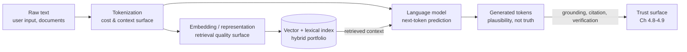

# Chapter 2.4 — NLP Essentials

| | |
|---|---|
| **Part** | 2 — Artificial Intelligence |
| **Maturity level** | 1 — Understand |
| **Difficulty** | Beginner–Intermediate |
| **Estimated study time** | 3 hours (reading 90 min, exercise 90 min) |
| **Prerequisites** | [Chapter 2.3 — Deep Learning Fundamentals](chapter-03-deep-learning-fundamentals.md) |

## Learning Objectives

After this chapter you will be able to:

1. Explain how text becomes numbers — tokenization and embeddings — and the practical consequences (costs, multilingual behavior, weird failure modes) that follow.
2. Trace the representation lineage from bag-of-words through word vectors to contextual embeddings, and say what each step fixed.
3. Explain language modeling — predicting the next token — and why this "simple" objective produces such broad capability.
4. Anticipate the language-specific behaviors of LLM systems: tokenization inequity across languages, subword artifacts, and vocabulary-boundary failures.

## Introduction

Natural language processing is the discipline the foundation-model wave swallowed — and everything it learned on the way down still governs how your systems behave. Tokenization decides what your API bills and why the model can't spell certain words backward; the embedding lineage explains what your vector search can and cannot match; the language-modeling objective explains both the fluency and the confabulation you'll manage for your whole career (Chapter 3.1).

This chapter is the last stop before the transformer (Chapter 2.5): it builds the text-to-numbers pipeline and the modeling objective, so that the architecture that industrialized both arrives with its purpose already clear.

## Business Motivation

NLP mechanics show up on invoices and in incident reports. **Tokenization is pricing:** the same paragraph costs 1× in English and often 2–4× in Thai, Hindi, or Burmese, because subword vocabularies were trained on English-heavy corpora and fragment other scripts into more tokens — a multilingual deployment budgeted on English token counts can miss its cost model by integer multiples, and latency (also per-token) degrades in the same ratio. **Embedding choice is retrieval quality:** an insurer whose German policy documents are searched with an English-centric embedding model will field "the AI can't find anything" complaints that no amount of prompt engineering fixes — the representation never learned the language properly (a procurement question, catchable before signature — Chapter 2.2's bake-off discipline). And **the next-token objective is the hallucination business risk in embryo**: models trained to continue text plausibly will continue it plausibly even when the truthful continuation is "I don't know" — the root cause behind every grounding architecture (RAG, citations, refusal design) you'll fund in Part 4.

## Theory

### Tokenization: text becomes units

Models don't read words; they read **tokens** — subword units from a fixed vocabulary (typically 30K–250K entries) learned by frequency: common words are single tokens (` the`), rarer words split (` unconscionable` → ` un`, `conscion`, `able`), and unfamiliar scripts fragment heavily. This design solves the open-vocabulary problem (any string is representable, no "unknown word" failures) at the cost of a family of artifacts every architect should recognize:

- **Cost and context inequity across languages** — the 2–4× fragmentation tax above; it also consumes context windows faster (a 100K-token window holds proportionally less Thai than English).
- **Character-level blindness** — the model sees ` strawberry` as one-or-few tokens, not eleven letters; counting letters, reversing strings, and precise character manipulation fail not from stupidity but from *representation* (the model literally doesn't see characters).
- **Boundary sensitivity** — `hello`, ` hello`, and `Hello` can be different tokens; numbers fragment unpredictably (`12345` may be `123`+`45`), which matters when your prompts embed IDs, codes, or tables (Chapter 3.4's structured-output discipline exists partly because of this).

Practical reflex: every model family ships a tokenizer; run your actual corpus through it *before* estimating costs or context budgets (Chapter 1.7's token math starts here).

### The embedding lineage: text becomes meaning

How NLP represented meaning, in three generations — each fixing its predecessor's blindness:

1. **Bag-of-words / TF-IDF (through 2013):** a document is its word counts, weighted by rarity. No meaning, no order — "dog bites man" equals "man bites dog" — but *exact term matching* with rarity weighting is genuinely powerful, survives today as **BM25**, and still beats semantic search for IDs, codes, names, and jargon. This is why hybrid retrieval (Chapter 4.2) exists: the 1990s and the 2020s each win on different queries.
2. **Static word vectors — word2vec/GloVe (2013–2018):** learn a vector per word from its contexts ("you shall know a word by the company it keeps"). Suddenly *similar words are nearby vectors*, and famously, arithmetic worked (king − man + woman ≈ queen). Fatal limit: one vector per word — "java" the island, language, and coffee share a single point.
3. **Contextual embeddings — ELMo/BERT onward (2018–):** the representation of each word is computed *in its sentence*, by a deep network (Chapter 2.3's representation learning at full power). "Bank" in "river bank" and "bank transfer" get different vectors. Modern **sentence/document embedding models** — the ones behind your vector store (Chapter 3.5) — are this generation, packaged: meaning-in-context as a service.

The architect's takeaways: embedding models are *trained artifacts* with training-data blind spots (languages, domains, jargon — test on your corpus); and lexical vs. semantic retrieval is not old-vs-new but a **portfolio** (the Chapter 2.1 wave lesson, in miniature).

### Language modeling: the objective that ate NLP

A **language model** assigns probabilities to sequences — operationally: *given tokens so far, predict the next one*. For decades this was a humble component (autocomplete, speech recognition rescoring). The era-defining discovery: trained at sufficient scale (Chapter 2.3's scaling laws) on sufficient text, this single self-supervised objective (Chapter 2.2) forces the model to internalize grammar, facts, style, reasoning patterns, and world regularities — because *predicting text well requires modeling the processes that produce text*. Translation, summarization, question answering, classification — the entire NLP task zoo that once needed bespoke systems — collapsed into "describe the task in the prompt, let the language model continue" (Chapter 2.1's foundation-model discontinuity, now with its mechanism visible).

Carry two permanent consequences. **Fluency and truth are different properties:** the objective rewards *plausible continuation*, and truth enters only insofar as the training corpus made truth the plausible thing to say; off-distribution or under-specified, the model produces confident plausibility — the [hallucination](../../GLOSSARY.md) you will architect around forever. **Everything is conditioning:** the prompt is not "instructions executed by a program" but *context that shifts the probability distribution* over continuations — which is why prompting is powerful, why it's never a guarantee, and why prompt injection (Chapter 4.9) is structurally hard: instructions and data are, to the objective, the same kind of thing — text that conditions what comes next.

## Architecture Perspective

The NLP pipeline inside every GenAI request has this chapter's three layers stacked, and each layer is a distinct failure and design surface:

Design consequences per surface. **Tokenization surface:** budget context and cost per *language and corpus*, not per generic "word count"; validate that IDs/codes survive tokenization in your prompts and outputs. **Representation surface:** the embedding model is an architecture decision of the same rank as the LLM choice — versioned (re-embedding cost — Chapter 2.3's checklist), evaluated on *your* languages and jargon, and deliberately paired with lexical search where exact matching matters. **Objective surface:** because the generator produces plausibility, *truth must be supplied architecturally* — retrieved grounding, citation contracts, refusal-on-no-context, verification passes (Chapters 3.6, 4.8); no prompt makes the objective itself truthful. Every RAG diagram in this curriculum is this figure elaborated.

## Real-world Example

**Meridian Health Partners** (Chapter 1.5's hospital network) expanded their clinician assistant to the network's Vietnamese-language patient-education documents, and the rollout produced a masterclass in this chapter. Symptom one: costs for the Vietnamese pilot ran 2.7× the English baseline per document — tokenization fragmentation, discovered on the invoice rather than in planning, because the cost model had used English token ratios (the fix took an afternoon; the budget conversation took longer). Symptom two: retrieval quality was dismal for Vietnamese queries — the embedding model, chosen a year earlier on English benchmarks, had thin Vietnamese training data; queries and documents landed in a smeared region of vector space where everything was vaguely similar to everything. The team's diagnostic instinct — tune the prompts — did nothing, because the failure was two layers below the prompt.

The recovery followed the pipeline diagram layer by layer: a multilingual embedding model bake-off *on Meridian's own corpus* (BM25 included as the boring baseline — it won outright for drug names and dosage codes, cementing the hybrid design); re-embedding of the affected corpus with the version bump handled as a release; and per-language cost and retrieval-quality dashboards so the next language expansion (Tagalog, planned) would be estimated from measured ratios, not English defaults. The architect's summary in the ADR became a Part 2 epigraph around the company: "The prompt is the last place to look. Most of what the system 'decides' was decided in the tokenizer and the embedding model before any instruction was read."

## Hands-on Exercise

**Touch all three layers with real tools.** ~90 minutes. Use any provider's tokenizer playground/library and any embedding API (official docs for current options).

1. **Tokenizer audit (30 min).** Run through a tokenizer: a paragraph of English; its translation in two other languages you care about; a product ID like `INV-2024-00871`; a phone number; `strawberry`. Record token counts and boundaries. Compute the cost ratio across your languages at current prices.
2. **Embedding probe (30 min).** Embed ~10 sentence pairs: synonyms phrased differently ("cancel my subscription" / "stop billing me"), same words different meaning ("bank transfer" / "river bank transfer"), domain jargon vs. plain speech, one pair in another language. Compute cosine similarities. Where does semantic similarity match your intuition, and where would BM25 have done better?
3. **Objective demonstration (20 min).** Ask any LLM three questions: one well-covered by training data, one plausible-but-fictional (an invented product's specs), one where the honest answer is "unknowable." Observe where fluency persists as truth departs. Note which architectural remedy (grounding, refusal design, verification) each failure calls for.
4. **The layer-diagnosis table (10 min).** Write the one-page table you'd give your team: symptom → which layer → first diagnostic step (e.g., "multilingual cost blowout → tokenization → run corpus through tokenizer").

**Acceptance criteria:**
- [ ] Token-count ratios computed for ≥3 languages on your own text, with cost implications stated
- [ ] Embedding probe includes at least one case where lexical search would beat semantic, identified as such
- [ ] Objective demonstration maps each observed failure to a named architectural remedy
- [ ] Layer-diagnosis table covers all three surfaces with concrete first steps

## Enterprise Considerations

Multilingual reality is the enterprise stress test of this chapter. Global firms discover that "we support 12 languages" means 12 different cost structures, 12 retrieval-quality profiles, and often 2–3 embedding models — governance must decide *per-language quality floors* (Chapter 1.6's fit criteria, language-indexed) rather than assuming English parity, and works councils in non-English jurisdictions notice quickly when the German assistant is measurably worse than the English one. Domain language is the second frontier: legal, medical, and engineering sublanguages are effectively low-resource languages to general-purpose embedding models — the bake-off-on-your-corpus discipline (Meridian's fix) belongs in procurement standard practice, and domain-adapted embeddings are a legitimate build-vs-buy decision (Chapter 4.13's logic applied one layer down). Finally, tokenizer and embedding versions are **compliance-relevant artifacts** in regulated deployments: a silent embedding-model upgrade changes retrieval behavior system-wide, which in a documented environment (Chapter 4.14) is a change-control event — pin them like model weights (Chapter 2.3's artifact discipline extends the full pipeline).

## Trade-offs

| Decision | Option A | Option B | Choose A when… | Choose B when… |
|----------|----------|----------|----------------|----------------|
| Retrieval representation | Semantic (embeddings) | Lexical (BM25) | Paraphrase, intent, cross-lingual matching | IDs, codes, names, jargon, exact phrases — and always as hybrid partner |
| Embedding model | General-purpose, English-centric | Multilingual / domain-adapted | Monolingual English, general domain | Any multilingual or deep-jargon corpus — validated on *your* data |
| Multilingual strategy | One model for all languages | Per-language model routing | Model demonstrably strong across your set | Measured quality/cost gaps justify routing complexity |
| Context budgeting | Generic tokens-per-word heuristics | Corpus-measured token ratios | Rough early sizing only | Anything that reaches a budget or an SLO (always, eventually) |

## Common Mistakes

1. **Budgeting multilingual systems at English token ratios** — the 2–4× invoice surprise. Measure your corpus through the actual tokenizer; it's an afternoon.
2. **Choosing embedding models from leaderboards** — public benchmarks are English-heavy and general-domain; your German insurance jargon isn't on them. Bake off on your own corpus (Chapter 2.2's vendor discipline, one layer down).
3. **Prompt-tuning a representation-layer failure** — Meridian's first instinct. When retrieval is bad or costs are weird, the prompt is the *last* layer to examine; work the pipeline left to right.
4. **Retiring lexical search because semantic is newer** — BM25 wins on exact-match query classes, permanently. The waves coexist (Chapter 2.1); hybrid is the default, not the compromise.
5. **Expecting character-level competence** — letter counting, string reversal, precise formatting of fragmenting tokens (long numbers, codes). Route such operations to code, not the model (Chapter 3.7's tool-use logic).
6. **Treating fluency as evidence of truth** — the objective's signature deception, institutionalized when demo reviewers rate confident answers as correct ones. Eval rubrics must score groundedness separately from fluency (Chapter 4.7).

## Best Practices

1. **Run every new corpus and language through the tokenizer before any estimate** — token ratios, ID/code integrity, context-window implications; one script, permanent habit.
2. **Bake off embedding models on your own documents with BM25 in the lineup** — the boring baseline keeps the semantic candidates honest and sizes the hybrid design.
3. **Version and pin the whole representation pipeline** — tokenizer, embedding model, index build — and treat upgrades as releases with re-embedding costs planned.
4. **Dashboard cost and retrieval quality per language** — parity is an assumption until measured; Meridian's dashboards are the template.
5. **Architect truth in explicitly** — grounding, citations, refusal-on-no-context; write it in the design as compensation for the objective, so reviewers understand it's structural, not decorative.
6. **Keep the layer-diagnosis table posted** — symptom → layer → first step; it converts this chapter into your team's triage muscle memory.

## Architecture Checklist

For any system that reads or generates natural language:

- [ ] Token ratios measured on the real corpus, per language; cost and context budgets use them
- [ ] IDs, codes, and numbers verified to survive tokenization in prompts and outputs
- [ ] Embedding model selected via bake-off on own data, multilingual/domain coverage verified, version pinned
- [ ] Hybrid retrieval (lexical + semantic) considered and the decision recorded
- [ ] Re-embedding cost and trigger (model upgrade, corpus growth) planned
- [ ] Groundedness architecturally supplied (retrieval, citations, refusal) — not delegated to the objective
- [ ] Per-language quality floors defined where multilingual (fit criteria, Chapter 1.6)

## Interview Questions

1. *"Why does the same document cost more to process in Hindi than English, and what do you do about it?"* — Strong answers explain subword fragmentation from English-heavy vocabularies, quantify the 2–4× range, and prescribe corpus-measured budgeting plus per-language dashboards.
2. *"Walk me through the evolution from TF-IDF to contextual embeddings, and why I should still care about BM25."* — Strong answers narrate the three generations with what each fixed, and defend the hybrid portfolio with concrete query classes lexical wins.
3. *"Why do LLMs hallucinate — mechanically, not morally?"* — Strong answers derive it from the next-token objective (plausibility, not truth), note when it's worst (off-distribution, under-specified), and list the architectural compensations.
4. *"Your multilingual RAG system has poor retrieval in one language. Diagnose."* — Strong answers work the pipeline: tokenizer fragmentation → embedding model's language coverage (bake-off on own corpus) → hybrid fallback — and explicitly *don't* start with the prompt.

## Further Reading

- Jurafsky & Martin, *Speech and Language Processing* (free 3rd-edition draft, web.stanford.edu/~jurafsky/slp3/) — the standard NLP text; the n-gram, embedding, and LLM chapters map directly onto this chapter's lineage.
- Mikolov et al., *Efficient Estimation of Word Representations in Vector Space* (arxiv.org/abs/1301.3781) — the word2vec paper; short, historic, and the vector-arithmetic results remain the best intuition pump for embeddings.
- Your model provider's tokenizer documentation and playground (official docs) — an hour of hands-on beats any secondhand description; repeat per provider you adopt.
- Robertson & Zaragoza, *The Probabilistic Relevance Framework: BM25 and Beyond* — for the lexical side's actual mechanics; skim for the intuition, keep for the reference.

## Summary

- **Tokenization** is where text meets money and limits: subword vocabularies make any string representable, at the price of language cost inequity, character blindness, and boundary artifacts — measure your own corpus, always.
- The **embedding lineage** (bag-of-words → static vectors → contextual) is a series of blindness fixes; modern embeddings are rented meaning-in-context, with training-data blind spots you must test for — and **lexical search remains a permanent portfolio member**.
- **Language modeling** — predict the next token — is the objective that ate NLP: broad capability from one self-supervised task, with two permanent shadows: fluency ≠ truth, and everything (instructions included) is just conditioning text.
- Architecturally, every request stacks three surfaces — tokenization (cost), representation (retrieval quality), objective (trust) — and **diagnosis works left to right; the prompt is the last place to look**.
- Truth is supplied by architecture — grounding, citations, refusal — never by the objective itself; Part 3 builds those components, starting with the machine that made it all scale: the transformer.

---

**Previous:** [Chapter 2.3 — Deep Learning Fundamentals](chapter-03-deep-learning-fundamentals.md) · **Next:** [Chapter 2.5 — The Transformer Architecture](chapter-05-transformer-architecture.md) · **Related:** [3.2 Tokens, Context Windows & Sampling](../part-3-core-building-blocks-of-genai/chapter-02-tokens-context-sampling.md), [3.5 Embeddings & Semantic Search](../part-3-core-building-blocks-of-genai/chapter-05-embeddings-semantic-search.md), [4.2 Advanced Retrieval](../part-4-enterprise-genai-systems/chapter-02-advanced-retrieval.md)
