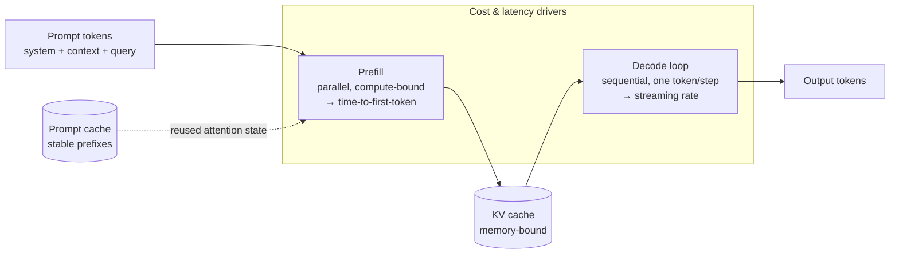

# Chapter 2.5 — The Transformer Architecture

| | |
|---|---|
| **Part** | 2 — Artificial Intelligence |
| **Maturity level** | 2 — Build |
| **Difficulty** | Intermediate |
| **Estimated study time** | 4 hours (reading 2 h, exercise 2 h) |
| **Prerequisites** | [Chapter 2.3](chapter-03-deep-learning-fundamentals.md); [Chapter 2.4](chapter-04-nlp-essentials.md) |

## Learning Objectives

After this chapter you will be able to:

1. Explain attention — the mechanism that lets every token consult every other token — and why it displaced recurrent architectures.
2. Trace a token's journey through a transformer: embeddings, attention layers, feed-forward layers, and the next-token prediction at the end.
3. Derive the operational characteristics architects live with — context-window limits, where compute actually goes as context grows, prefill vs. decode phases, KV caching — from the architecture itself.
4. Explain why transformers parallelize so well, and how that single property enabled the scaling that produced foundation models.

## Introduction

The transformer (from the 2017 paper *Attention Is All You Need*) is the machine under every model in this curriculum — every LLM, every embedding model, most multimodal systems. You will never modify one; you will spend your career on the *operational surface* it creates: why context windows exist and cost what they cost, why the first token is slow and the rest stream fast, why long prompts hurt latency more than long answers hurt throughput, why prompt caching works at all.

This is the payoff chapter of Part 2's technical arc: Chapter 2.3 gave you the training loop, Chapter 2.4 gave you tokens and the next-token objective — this chapter is the architecture that industrialized both. The depth contract holds: intuition-level mechanism, architect-level consequences, no derivations.

## Business Motivation

Transformer mechanics set the *unit economics and physical limits* of every GenAI business case, and architects who can't derive them from the architecture negotiate blind. Context windows are a hard capability boundary that stakeholders will ask to "just extend" — knowing *why* they exist (position-limited training, attention and KV-memory costs that grow with length) converts a "no" into a design conversation about retrieval and summarization strategies (Chapters 3.6, 4.6). Latency asymmetry — seconds to first token on a long prompt, then fast streaming — is the difference between a usable and an abandoned assistant UX, and it's a direct architectural consequence (prefill vs. decode) with direct architectural remedies (streaming, caching, prompt slimming — Chapter 4.12). And prompt caching, which routinely cuts 20–50% off inference bills (Chapter 4.11), is not a vendor gimmick but a property of how attention state (the KV cache) can be reused — an architect who understands the mechanism knows precisely what is cacheable (stable prefixes) and designs prompts to exploit it. In each case, the mechanism knowledge converts invoice-line mysteries into design levers.

## Theory

### The problem attention solved

Pre-2017 language models were **recurrent**: they read text token by token, left to right, compressing everything seen so far into a fixed-size running memory. Two fatal flaws: *long-range forgetting* (by token 500, token 3 is a rumor — pronouns lose antecedents, contracts lose their defined terms) and *sequential training* (token 500 can't be processed until 499 is done — no parallelism, so scaling hit a wall). The transformer's answer was radical: delete the recurrence. Process all tokens *simultaneously*, and let each token directly consult every other token, at any distance, in one step. That consultation is **attention**.

### Attention, at intuition level

For each token, the model computes three vectors — a **query** ("what am I looking for?"), a **key** ("what do I offer?"), and a **value** ("what do I contribute if selected?"). Each token's query is scored against every other token's key; the scores (normalized to weights) determine how much of each token's value flows into this token's updated representation. Concretely: processing "it" in *"The contract terminates if the supplier breaches it"*, the query for "it" scores highly against the key for "contract", and "contract"'s value flows in — "it" now *means* contract-ish things in all downstream computation. This is Chapter 2.4's contextual embedding, shown as mechanism.

Two multiplicities complete the picture. **Multi-head attention:** many attention patterns run in parallel per layer — one head may track syntax, another coreference, another proximity — giving the model several simultaneous "views" of the sequence. **Depth:** dozens of layers stack, each alternating attention (tokens exchange information) with **feed-forward** blocks (each token processes what it gathered — roughly, where stored knowledge lives). Representations grow more abstract layer by layer (Chapter 2.3's hierarchy), and at the top, the final representation of the last token becomes a probability distribution over the vocabulary: the next-token prediction (Chapter 2.4's objective).

### The consequences architects live with

Everything operationally distinctive about LLMs falls out of this design:

- **Parallel training → scale.** With no recurrence, every token position trains simultaneously — perfect for GPUs (Chapter 2.3's matrix math). This single property is why transformers could absorb internet-scale data and why scaling laws could be ridden to foundation models. Attention was the invention; *parallelism was the revolution*.
- **Context windows.** The model attends over a finite token span, bounded by position-encoding ranges it was trained for and by attention's cost. The [context window](../../GLOSSARY.md) is an architectural property, not a dial — "extending" it means retraining or algorithmic workarounds, which is why context is a *budget you design within* (retrieval, compaction — Parts 3–4), not a limit you complain about.
- **Quadratic attention — with an honest asterisk.** Every token attends to every other, so *attention's* compute grows with the square of sequence length. But attention is not the whole forward pass: at typical context lengths, total prefill compute is dominated by the feed-forward blocks, which scale *linearly* with tokens — which is why providers price input tokens linearly per token (with step-ups above length thresholds, not a quadratic curve), and why Chapter 1.7's linear cost arithmetic is correct as taught. The quadratic term is real at the long-context extreme — one reason windows are bounded, and why sub-quadratic variants remain a research frontier — but the case against "just paste everything into the prompt" never needed it: you pay linearly for every token whether or not the model used it, and quality degrades as relevant content dilutes into noise (lost-in-the-middle — Chapter 3.1). RAG wins on billing and quality, not on quadratic arbitrage.
- **Prefill vs. decode.** Serving a request has two phases. **Prefill:** the whole prompt is processed *in parallel* — compute-heavy, and the source of time-to-first-token latency (long prompt → slow first token). **Decode:** output tokens generate *one at a time* (each conditions on the last — generation is inherently sequential), each step cheap but serial — the streaming rhythm users see. One modern development raises decode's stakes: reasoning models spend thousands of *thinking tokens* deliberating before the visible answer (Chapter 2.6) — all decode, all serial, all billed as output — so for reasoning-heavy workloads the cost and latency center of gravity shifts from prefill to decode. UX and capacity planning both hang on this split (Chapters 4.12, 5.3).
- **KV caching.** During decode, the attention keys/values of all previous tokens are cached rather than recomputed — the memory-hungry trick that makes generation fast (and makes GPU *memory*, not just compute, the serving bottleneck — Chapter 5.3). **Prompt caching** extends the idea across requests: a stable prompt prefix (system prompt, tool definitions, few-shot examples) has identical attention state every time — providers cache it and charge a fraction for reuse. Design consequence, usable today: *put stable content first, volatile content last* in prompts; cacheability is a prompt-architecture property (Chapters 3.3, 4.11).

## Architecture Perspective

The transformer's request lifecycle *is* the LLM serving architecture; every operational property of the systems you'll design in Parts 4–5 attaches to a phase of it:

Read the diagram as a levers map. **Latency:** time-to-first-token is a prefill problem — attack it with shorter/cached prefixes and streaming UX, not with a faster model tier reflex; total generation time is a decode problem — attack it with output-length discipline and smaller models where evals allow. **Cost:** input tokens are prefill compute (and dominate context-heavy bills — Chapter 1.7), output tokens are decode — priced several times higher per token, and dominant in reasoning-heavy and long-generation workloads; caching converts repeated prefill into near-free reads, which is why prompt *structure* (stable-first ordering) is a cost-engineering decision made at design time. **Capacity:** concurrent requests contend for GPU memory via their KV caches — long contexts don't just cost compute, they crowd out throughput (Chapter 5.3's batching and serving math). An architect fluent in this one diagram can decompose almost any "the AI is slow/expensive" complaint into the correct phase and lever within minutes.

## Real-world Example

**Vantora Systems** (Chapter 1.8's platform team) hit a wall six months after the gateway rollout: the flagship support-assistant team reported that p95 time-to-first-token had crept from 1.2s to 6.8s, and their proposed fix — "move everything to the fastest model tier" — would have tripled their inference budget. The platform architect, Adaeze, ran the phase decomposition instead.

The trace data told the story in one afternoon. Latency growth tracked *prompt length* growth: over six months the team's prompt had accreted to 31K tokens — a 9K system prompt with policy rules bolted on after each incident, 14K of few-shot examples, 6K of retrieved context, and conversation history unbounded. All prefill; the model tier was irrelevant. The remediation followed the levers map: prompt restructured stable-first (system prompt and examples as a fixed prefix — instantly prompt-cacheable, cutting billed input for the prefix by an order of magnitude on cache hits); the incident-driven policy bolt-ons consolidated from 9K to 2K tokens (most were redundant paraphrases of each other — prompt review had no owner, Chapter 3.3's versioning discipline arrived here); retrieval trimmed from fixed top-10 to relevance-thresholded top-4 (evals showed no quality loss — Chapter 4.2); and history compacted beyond eight turns. Result: p95 TTFT 1.4s, inference cost *down* 38%, no model change, no quality regression on the eval suite. The postmortem's title became a platform-team koan: **"The model was never slow. The prompt was long."** The deeper fix was organizational: prompt size entered the team's dashboard next to latency and cost, because — as this chapter's diagram makes plain — it is the same number wearing three costumes.

## Hands-on Exercise

**Derive the operations from the architecture.** ~2 hours. Requires any LLM API with streaming (and ideally prompt caching — check your provider's official docs).

1. **Phase measurement (45 min).** Script three calls: (a) short prompt (~200 tokens) / long output; (b) long prompt (~20K tokens — paste documentation) / short output; (c) long prompt / long output. Measure time-to-first-token and tokens/second thereafter for each. Explain every difference using prefill/decode — write the explanation before looking at any pricing page.
2. **Cache experiment (30 min).** If your provider supports prompt caching: structure a prompt as [stable 5K-token prefix + volatile 100-token question]; send five variants of the question. Compare billed/cached token counts and TTFT across calls. Restructure with the volatile part *first* and observe the cache stop working. State the rule you just demonstrated.
3. **The context-cost estimate (20 min).** Using your provider's published pricing: cost a "paste the whole 200-page manual" architecture vs. a "retrieve 4 relevant chunks" architecture at 1,000 queries/day. Show the arithmetic (note it's linear per token — check whether your provider steps up the rate above a length threshold); note which line item dominates.
4. **The levers memo (25 min).** Write the one-page memo for Vantora's situation as if you were Adaeze: symptom, phase diagnosis, three levers in priority order, expected effect of each. Compare against the example above after writing.

**Acceptance criteria:**
- [ ] TTFT and streaming-rate differences measured and correctly attributed to prefill vs. decode
- [ ] Cache experiment demonstrates the stable-prefix rule with billed-token evidence (or a written provider-docs analysis where caching is unavailable)
- [ ] Context-cost estimate shows retrieval winning on billed tokens with real prices
- [ ] Levers memo attacks prompt structure before model tier

## Enterprise Considerations

At enterprise scale, transformer mechanics become procurement and platform policy. **Provider heterogeneity:** context limits, caching semantics, and long-context pricing differ by provider and change quarterly — a platform team (Chapter 7.9) should abstract these behind the gateway and publish *internal* context/caching guidance, so a hundred application teams don't each rediscover Vantora's lesson. **Capacity contracts:** provisioned-throughput agreements are priced in tokens-per-minute against the prefill/decode reality — teams that sign them without understanding KV-cache memory contention over-buy or under-provision (Chapter 5.3). **Long-context governance:** giant windows invite "paste the whole data room" workflows that are simultaneously the most expensive, slowest, *and* most privacy-exposed usage pattern (an entire corpus in a third-party prompt is a data-governance event — Chapter 4.14); enterprises increasingly set context-size budgets per use-case class as policy, not just as engineering hygiene. The pattern across all three: this chapter's physics, encoded into platform defaults, scales; encoded into tribal knowledge, doesn't.

## Trade-offs

| Decision | Option A | Option B | Choose A when… | Choose B when… |
|----------|----------|----------|----------------|----------------|
| Long context vs. retrieval | Stuff the window | Retrieve selectively (RAG) | Small stable corpus, deep cross-document reasoning, cost-insensitive | Default at scale — cheaper, faster, fresher, and quality often *better* (focused attention beats diluted) |
| Latency lever | Smaller/faster model tier | Prompt restructuring + caching + streaming | Evals show the smaller model holds quality | First, always — Vantora's order; model tier is the *second* lever |
| Prompt structure | Stable-first, cache-aligned | Ad-hoc ordering | Always — it's free money | Never; there is no B |
| Output control | Tight max-token limits, terse formats | Unconstrained generation | Throughput and cost matter (decode is serial) | Exploratory/creative use where length is the product |

## Common Mistakes

1. **Reaching for a faster model when the prompt is the problem** — TTFT complaints are usually prefill (prompt length) problems; the phase decomposition takes an afternoon and frequently *saves* money while fixing latency.
2. **Prompt accretion without ownership** — Vantora's 31K-token barnacle collection. Prompts grow monotonically unless someone owns their size; put token count on the dashboard.
3. **Cache-hostile prompt ordering** — volatile content (timestamps, user data, request IDs) interleaved into stable prefixes, silently zeroing the cache hit rate. Stable-first is a design rule, not a tip.
4. **Treating the context window as a goal** — "the new model has 1M context, let's use it all." The window is a *capacity*, billed per token on every request and diluting attention as it fills; the architecture question is what *earns* its place in context (Chapter 3.6).
5. **Ignoring decode's seriality in throughput plans** — capacity models that count requests but not output tokens; a verbose assistant halves your effective throughput without any traffic growth.
6. **Explaining limits as vendor stinginess** — telling stakeholders context/pricing constraints are provider policy rather than architecture physics; it forfeits the design conversation that retrieval and caching would win.

## Best Practices

1. **Decompose every latency/cost complaint by phase first** — prefill or decode, then pick the lever; the diagram is the triage protocol.
2. **Order prompts stable-first, always** — system prompt, tool definitions, examples, *then* retrieved context, *then* the volatile query; cacheability is designed, not hoped for.
3. **Put prompt token count on the team dashboard** — next to latency and cost, because it is causally upstream of both.
4. **Budget context like money** — each prompt component justifies its tokens (what does this 9K buy in eval score?); review at the same cadence as cost.
5. **Prefer retrieval to stuffing at scale** — billed-token arbitrage plus focus (lost-in-the-middle) plus freshness plus privacy; reserve full-window workflows for cases that measurably need cross-document reasoning.
6. **Stream by default in interactive UX** — decode's token-by-token rhythm is free perceived-latency relief; pair with tight output-format discipline.

## Architecture Checklist

For any LLM-serving design:

- [ ] TTFT and streaming-rate SLOs set separately, mapped to prefill and decode respectively
- [ ] Prompt structured stable-first; cache hit rate measured and alerted on
- [ ] Prompt token budget per component documented, with an owner for total size
- [ ] Context strategy justified: retrieval vs. long-context decision recorded with cost arithmetic (Chapter 1.4)
- [ ] Output length bounded per use case; throughput model counts output tokens, not just requests
- [ ] KV-cache memory contention reflected in capacity/concurrency planning (self-hosted) or provisioned-throughput sizing (managed)
- [ ] Provider context/caching semantics abstracted at the gateway, not re-solved per team

## Interview Questions

1. *"Explain attention to me, and then tell me why I — an executive — should care."* — Strong answers give the query/key/value intuition with a pronoun-resolution example, then pivot: attention's parallelism enabled scale (why these models exist), and every prompt token is paid attention and compute (why your bill tracks context size).
2. *"Why is the first token slow and the rest fast?"* — Strong answers name prefill (parallel processing of the whole prompt, compute-bound) vs. decode (sequential generation), and immediately list the levers: prompt slimming, caching, streaming.
3. *"When would you use a 1M-token context window instead of RAG?"* — Strong answers treat it as a trade (per-token cost at scale, latency, attention dilution, privacy exposure vs. cross-document reasoning and pipeline simplicity), demand the cost arithmetic, and default to retrieval at scale.
4. *"Your assistant's costs and latency both crept up 4× over six months with flat traffic. Diagnose."* — Strong answers go straight to prompt growth (accretion, unbounded history, over-retrieval), check cache hit rates, and cite the phase decomposition before mentioning model changes — Vantora's case is the reference shape.

## Further Reading

- Vaswani et al., *Attention Is All You Need* (arxiv.org/abs/1706.03762) — the origin; read the introduction and Figure 1, skim the rest, return later if curious.
- Jay Alammar, *The Illustrated Transformer* (jalammar.github.io) — the canonical visual walkthrough; the single best two hours for this chapter's mechanism.
- Andrej Karpathy, *Let's build GPT* (YouTube) — for the optional builder's track: a transformer from scratch in code, watchable at architect depth without doing the exercises.
- Your provider's prompt-caching and long-context documentation (official docs) — the operational semantics change; reread quarterly and encode into platform guidance.

## Summary

- **Attention** lets every token consult every other directly — query/key/value scoring — fixing recurrence's forgetting; stacked in multi-head layers alternating with feed-forward blocks, it ends in next-token prediction.
- The revolution was **parallel training**: no recurrence → every position trains at once → GPUs saturate → scaling laws get ridden → foundation models exist.
- The operational surface is derivable: **context windows** (trained positional range, attention and memory cost), **prefill vs. decode** (slow first token vs. streaming rhythm — with reasoning models' thinking tokens moving the cost center to decode), **KV/prompt caching** (reusable attention state — stable-prefix design), **workload-shaped cost dominance** (input for context-heavy, output for reasoning-heavy).
- The architect's triage: **decompose by phase, attack the prompt before the model tier** — length, structure, cache alignment, retrieval instead of stuffing.
- The transformer chapter closes the mechanism arc of Part 2: training loop (2.3) + tokens and objective (2.4) + this architecture = everything Part 3 consumes as components.

---

**Previous:** [Chapter 2.4 — NLP Essentials](chapter-04-nlp-essentials.md) · **Next:** [Chapter 2.6 — Training, Fine-tuning & Alignment](chapter-06-training-finetuning-alignment.md) · **Related:** [3.2 Tokens, Context Windows & Sampling](../part-3-core-building-blocks-of-genai/chapter-02-tokens-context-sampling.md), [4.12 Latency & Performance](../part-4-enterprise-genai-systems/chapter-12-latency-performance.md), [5.3 Model Serving](../part-5-cloud-infrastructure-platform/chapter-03-model-serving.md)
