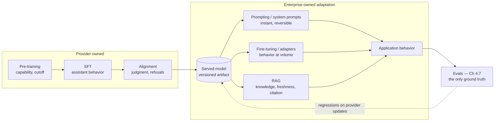

# Chapter 2.6 — Training, Fine-tuning & Alignment

| | |
|---|---|
| **Part** | 2 — Artificial Intelligence |
| **Maturity level** | 2 — Build |
| **Difficulty** | Intermediate |
| **Estimated study time** | 3–4 hours (reading 2 h, exercise 90 min) |
| **Prerequisites** | [Chapter 2.5 — The Transformer Architecture](chapter-05-transformer-architecture.md) |

## Learning Objectives

After this chapter you will be able to:

1. Trace the model production pipeline — pre-training, supervised fine-tuning, preference alignment — and state what each stage changes, costs, and leaves behind.
2. Distinguish what fine-tuning is *for* (behavior, style, format, domain fluency) from what it is *not* for (knowledge injection, facts that change) — and defend the distinction in a design review.
3. Explain RLHF and related alignment methods at intuition level, including their footprints in model behavior (helpfulness, refusals, sycophancy).
4. Make the adaptation decision — prompt, fine-tune, or RAG — as a first-pass judgment, with the full framework deferred to Chapter 4.13.

## Introduction

Chapters 2.3–2.5 built the machine; this chapter explains how the machine acquires its behavior — and why the model you call via API behaves like a helpful assistant rather than like the internet it was trained on. That gap is manufactured, in stages, and each stage is architecturally legible: pre-training explains what the model knows and when its knowledge ends; supervised fine-tuning explains why it follows instructions; preference alignment explains its helpfulness, its refusals, and its urge to agree with you.

For the enterprise architect this chapter carries one decision with money attached — *should we fine-tune?* — and one recurring diagnostic skill: recognizing which stage of the pipeline a given model behavior comes from, because the remedy differs by stage. It is the last conceptual chapter before evaluation (2.7) and governance (2.8) close out Part 2.

## Business Motivation

"We should fine-tune a model on our data" is among the most expensive sentences spoken in enterprise AI steering committees — not because fine-tuning is bad, but because it's usually proposed for the wrong job. The typical proposal imagines fine-tuning as *knowledge injection*: teach the model our products, policies, and documents. That job belongs almost always to retrieval (RAG — Chapter 3.6): fine-tuning is poor at adding facts, catastrophic at updating them (every policy change means retraining), and destroys the audit trail of *where an answer came from* (retrieval cites; weights don't — a compliance non-starter in regulated contexts, Chapter 4.14). The misdirected project costs six figures in data preparation and compute, ships months late, and underperforms a two-week RAG build. The correctly-directed version is real too: fine-tuning excels at *behavior* — consistent format, house style, domain-specific task patterns at high volume on small models — where it can cut unit costs 10× by letting a compact model do what previously needed a frontier one (Chapter 7.8's tiering, manufactured). The architect who can sort these two piles in the first meeting pays for this chapter a hundred times over.

## Theory

### Stage 1 — Pre-training: capability

The self-supervised marathon (Chapter 2.2): next-token prediction (Chapter 2.4) over trillions of tokens of internet-scale text, on GPU fleets, for months, at costs in the tens to hundreds of millions — Chapter 2.3's training plane at full industrial scale. The output (a **base model**) has absorbed grammar, facts, styles, reasoning patterns — and is *not an assistant*: prompted with a question, a base model may answer, continue the question, or produce a list of similar questions, because all are plausible text continuations. Two properties of this stage persist through everything downstream: the **knowledge cutoff** (the corpus ends on a date; everything after is invisible — the structural reason retrieval exists), and **the distribution is the behavior** (whatever biases, gaps, and styles the corpus had, the model has — Chapter 2.8's raw material). Enterprises essentially never run this stage; its economics are the *reason* the API-consumption default (Chapter 2.1) exists.

### Stage 2 — Supervised fine-tuning (SFT): behavior

Take the base model; continue training briefly on a much smaller, *curated* dataset of demonstrations — (instruction → good response) pairs, written or vetted by humans. The model's continuation habits reshape toward the demonstrated pattern: ask-then-answer, follow instructions, use the assistant persona. Same mechanism as pre-training (Chapter 2.3's loop), radically different data economics: thousands-to-millions of examples instead of trillions of tokens, hours-to-days instead of months. This stage is also the template for *your* fine-tuning: when an enterprise fine-tunes, it is doing SFT on its own demonstrations — which is why the binding constraint is always **demonstration quality and coverage** (Chapter 2.2's label discipline: the model becomes what your examples are, including their inconsistencies).

**Parameter-efficient fine-tuning (PEFT/LoRA)** deserves its one paragraph: instead of updating all weights, train small low-rank adapter matrices alongside frozen weights — a few percent of the cost, most of the behavioral effect, and adapters swap per-task at serving time. This is what makes enterprise fine-tuning economically routine where it's warranted, and what most managed fine-tuning APIs do under the hood.

### Stage 3 — Preference alignment: judgment

SFT teaches the pattern of helpfulness; alignment teaches *choices* — which of two valid responses is better, when to refuse, how to be harmless without being useless. The classic recipe, **RLHF**: collect human rankings over model outputs, train a **reward model** to predict those preferences, then optimize the SFT model against the reward model with reinforcement learning (Chapter 2.2's fourth paradigm, at last on stage). Variants matter less than the shape — RLAIF replaces human rankers with AI feedback at scale; Constitutional AI steers the feedback with explicit written principles; DPO folds preference data in without a separate reward model. What architects must retain is the *behavioral residue*:

- **Helpfulness pressure** — the model wants to give you something; combined with Chapter 2.4's plausibility objective, this is why "I don't know" is rare unless designed for (refusal behavior must be prompted and evaluated, not assumed — Chapter 1.6's wrong-answer policy).
- **Refusal contours** — safety training draws boundaries that occasionally clip legitimate enterprise use (a claims system discussing injuries; a security team discussing exploits); this is a *model-selection criterion* (Chapter 3.10) discovered in evals, not in datasheets.
- **Sycophancy** — optimizing for human approval teaches agreement; models drift toward telling users what they signal they want to hear. Design consequence: don't let the model's concurrence validate anything that matters (Chapter 4.7's LLM-as-judge biases start here).
- **Reward gaming** — the reward model is a proxy, and Chapter 1.2's Goodhart dynamics apply inside the training loop itself: verbose, confident, well-formatted answers score well and proliferate. The polish of model output is partly *trained polish*, not evidence of correctness.

### The adaptation decision, first pass

Where should *your* requirement be implemented? The pipeline gives the sorting rule:

| Requirement is about… | First resort | Why |
|---|---|---|
| Knowledge — facts, documents, freshness | **RAG** (Chapter 3.6) | Updatable, citable, auditable; weights are none of these |
| Behavior — format, style, task pattern | **Prompting**, then fine-tuning at volume | Prompting is reversible and instant; fine-tune when prompt length/consistency/unit cost justify it |
| Judgment — values, refusal boundaries | **Model selection** + system prompts + guardrails | You are choosing alignment residue, not creating it; guardrails enforce what prompts request (Chapter 4.8) |

Full decision framework with costs and evals: Chapter 4.13. The first-pass heuristic that survives every review: **fine-tuning changes how the model behaves; retrieval changes what it knows; if the sentence contains "our documents," the answer is retrieval.**

## Architecture Perspective

The pipeline is an architecture diagram, and reading it as one clarifies who owns what — and where your leverage is:

Three structural readings. **The ownership boundary is a risk boundary:** everything left of the API is the provider's — and it *changes* (new alignment training, revised refusal contours) under stable API names; a provider model update is a silent re-release of stages 1–3, which is why model pinning and eval gates on upgrades ([deployment checklist](../../checklists/deployment-checklist.md)) are non-negotiable, and why Chapter 1.7's risk register carries "model behavior change" as a standing entry. **Adaptation layers stack, not compete:** production systems typically run all three enterprise layers at once — a fine-tuned compact model, behind a system prompt, over RAG; the design question is which *requirement* lands in which layer (the sorting table), not which layer "wins." **Evals are the only stable ground:** every layer, both sides of the boundary, changes on its own schedule; the eval suite (Chapter 4.7) is the single fixed reference frame — which elevates it from testing tool to architectural keystone.

## Real-world Example

**Kestrel Assurance** (Chapter 1.6's claims-correspondence insurer) came out of Marta's requirements pass with two candidate "fine-tuning projects" — and the sorting rule sent them opposite ways. Proposal one: fine-tune on the policy manuals so the assistant "knows our products." Killed in one meeting: knowledge job, retrieval answer — the manuals changed quarterly (retraining treadmill), and the legal-liability constraint from the requirements workshop demanded *citations to the current manual*, which weights cannot produce. RAG shipped in three weeks.

Proposal two survived scrutiny and became the interesting one. The empathy-of-tone requirement — the one that had rejected factually perfect drafts as "cold" — was consuming 6K tokens of style instructions and few-shot examples per prompt on the frontier model, and per-letter cost was the business case's weak line (Chapter 1.7). This was a *behavior* job at volume: the team collected 3,000 adjuster-approved letters (the SFT demonstrations — with the works-council data agreement from Chapter 1.6 covering their use), and fine-tuned a compact model via the provider's managed LoRA offering. Results at the eval gate: tone-rubric scores *above* the prompted frontier model (consistency was the win — the fine-tune didn't have good and bad days), per-letter cost down 82%, and the 6K-token style preamble deleted (with a prefill-latency bonus, per Chapter 2.5). One quarter later the pipeline earned its risk-register entry: the provider updated the base model family, the team re-ran fine-tuning on the new base, and the eval suite caught a subtle regression — the new base's alignment was more hedging, and hedged empathy read as insincerity in the tone rubric. Two iterations of demonstration-set curation fixed it. Marta's ADR note distilled the chapter: *"Retrieval for what we know. Fine-tuning for how we sound. Evals because both of those sentences change under us."*

## Hands-on Exercise

**Sort, spec, and stress-test adaptation decisions.** ~90 minutes.

1. **The sorting drill (30 min).** For each requirement, assign the layer (prompt / fine-tune / RAG / model selection + guardrails) with a one-line justification: (a) answers must reflect this week's price list; (b) all output in a strict JSON schema, 500K calls/day; (c) assistant must never discuss competitors; (d) responses in the company's German formal register; (e) summaries must cite source paragraphs; (f) the model refuses medical questions our nurses must legally answer themselves; (g) support answers should match our resolved-ticket style.
2. **Fine-tune spec (30 min).** For case (g): write the half-page spec — demonstration data source and volume, quality-control plan for demonstrations (who vets, against what rubric), eval design (how you'd prove the fine-tune beats the prompted baseline), cost lines (data prep, training, and the re-training trigger), and the rollback story.
3. **Provider-update fire drill (30 min).** Your provider announces the model behind your fine-tune is deprecating in 90 days. Write the runbook: sequence of actions, eval gates, parallel-running strategy, and the decision points. (Kestrel's quarter-later episode is the reference.)

**Acceptance criteria:**
- [ ] Sorting drill: knowledge-shaped requirements (a, e) landed on RAG; behavior at volume (b, g) on fine-tuning; judgment/boundary cases (c, f) on prompts + guardrails + model selection — with reasons, not labels
- [ ] Fine-tune spec includes demonstration quality control and a *prompted-baseline comparison* eval — not just "train and hope"
- [ ] Fire-drill runbook has eval gates before traffic shifts and a tested rollback

## Enterprise Considerations

Enterprise fine-tuning arrives wrapped in obligations the demo never showed. **Data rights and privacy:** demonstration datasets built from employee- or customer-generated text need the same governance as any personal-data processing — consent basis, works-council agreements (Kestrel's), retention limits — and the resulting *weights* are a derived data artifact whose status (can it leave the region? who may use it?) legal will want defined (Chapter 4.14). **Artifact governance:** fine-tuned models and adapters multiply fast — per-task, per-language, per-brand — and without a registry with lineage (base model version, dataset version, eval results), an enterprise accumulates unreproducible behavior it cannot debug or defend; treat adapters with full Chapter 5.7 LLMOps discipline. **Provider dependency deepens:** a fine-tune binds you to a base model family and its deprecation schedule — the 90-day fire drill is not hypothetical, it's an annual event; contract reviews should read fine-tuning terms (portability of datasets, notice periods) with that in mind. **And the boring alternative stands:** at enterprise review boards, every fine-tuning proposal should carry the Chapter 1.4 null option — "prompted frontier model with caching" — priced honestly; a surprising fraction of proposals lose to it.

## Trade-offs

| Decision | Option A | Option B | Choose A when… | Choose B when… |
|----------|----------|----------|----------------|----------------|
| Behavior implementation | Prompting (instructions + examples) | Fine-tuning | Default: reversible, instant, no pipeline | High volume where prompt length hurts cost/latency; consistency demands it; evals prove the gain |
| Knowledge implementation | RAG | Fine-tuning on documents | Almost always: freshness, citations, auditability | Narrow, stable domain *fluency* (vocabulary, phrasing) — never for facts that change |
| Fine-tuning scope | PEFT/LoRA adapters | Full fine-tune | Default: cheap, swappable, managed offerings | Rare enterprise cases with extreme volume and provider support |
| Base for fine-tuning | Compact model + your SFT | Frontier model prompted | Task is narrow and demonstrable; unit cost at volume is the business case | Task needs frontier reasoning breadth; volume is modest |

## Common Mistakes

1. **Fine-tuning as knowledge injection** — the flagship error this chapter exists to prevent: facts belong in retrieval, where they update and cite; the fine-tuned "knowledge" is stale at first policy change and unauditable always.
2. **Skipping the prompted baseline** — shipping a fine-tune without proving it beats good prompting on evals; a large fraction of fine-tuning projects lose that comparison when it's finally run.
3. **Garbage demonstrations, faithful garbage** — SFT reproduces its dataset, inconsistencies included; demonstration curation is label ops (Chapter 2.2) and needs the same quality machinery.
4. **Treating provider model updates as free upgrades** — stages 1–3 re-released under your feet; unpinned models plus no eval gate equals silent behavior change in production (and fine-tunes must be *re-trained and re-gated* on new bases — Kestrel's regression).
5. **Reading alignment residue as facts about your domain** — the model's hedging, agreeableness, or refusal contours are training artifacts, not domain signals; sycophancy especially must never validate decisions (Chapter 4.7's judge-bias mitigations).
6. **Adapter sprawl without lineage** — a dozen fine-tunes, no registry, no reproducibility; six months later nobody can say what any of them was trained on or whether it's safe to retire.

## Best Practices

1. **Apply the sorting rule in the first meeting** — knowledge → RAG, behavior → prompt-then-fine-tune, judgment → selection + guardrails; write it into the proposal template so misdirected projects die as paragraphs, not budgets.
2. **Demand the prompted-baseline eval in every fine-tuning proposal** — the null option, measured; fund only the gap.
3. **Run demonstration datasets through label-ops discipline** — rubric, vetting, versioning; the dataset *is* the model.
4. **Pin models; gate upgrades with evals; rehearse the deprecation drill** — for base models and fine-tunes alike; make it a calendar event, not an emergency.
5. **Register every adapter with full lineage** — base version, dataset version, eval scores, owner; retire what can't be reproduced.
6. **Evaluate refusal contours during model selection** — run *your* legitimate-but-sensitive cases in the bake-off (Chapter 3.10); discovering over-refusal in production is discovering it from angry users.

## Architecture Checklist

For any adaptation decision (and standing, for any system on managed models):

- [ ] Each requirement sorted to its layer — knowledge/behavior/judgment — with the reasoning recorded (ADR)
- [ ] Fine-tuning proposals carry a measured prompted baseline and a unit-economics case (Chapter 1.7)
- [ ] Demonstration data has a quality rubric, a vetting owner, versioning, and cleared data rights
- [ ] Model versions pinned; provider updates pass eval gates before traffic; fine-tunes have a re-base runbook
- [ ] Adapter/model registry exists with full lineage; every artifact reproducible
- [ ] Refusal and hedging behavior evaluated against *your* use cases at selection time
- [ ] The eval suite is treated as the fixed reference frame — funded, versioned, and owned accordingly

## Interview Questions

1. *"The business wants to fine-tune a model on our knowledge base. Walk me through your response."* — Strong answers apply the sorting rule out loud: knowledge job → RAG (freshness, citations, auditability), then salvage the legitimate remainder (style/format at volume) as a properly-specified fine-tune candidate with a prompted baseline.
2. *"Explain RLHF and one way its residue shows up in production systems."* — Strong answers give the rank → reward model → RL loop at intuition level, then land a concrete residue: sycophancy corrupting LLM-as-judge, helpfulness pressure suppressing 'I don't know', refusal contours clipping legitimate use.
3. *"Your provider silently updated the model and your system's tone changed. What failed, and what's the fix?"* — Strong answers name the missing controls (pinning, upgrade eval gates), locate the cause in re-released alignment training, and extend the fix to fine-tune re-basing.
4. *"When does fine-tuning a small model beat prompting a frontier model?"* — Strong answers give the shape: narrow demonstrable task, high volume, consistency and unit cost as the drivers — with evals proving quality parity and the arithmetic proving the savings (Kestrel's 82% is the reference).

## Further Reading

- Ouyang et al., *Training language models to follow instructions with human feedback* (arxiv.org/abs/2203.02155) — the InstructGPT paper; the SFT + RLHF recipe that defined the assistant era, readable at figure level.
- Bai et al., *Constitutional AI: Harmlessness from AI Feedback* (arxiv.org/abs/2212.08073) — alignment steered by explicit principles; read for how judgment gets manufactured and inspected.
- Hu et al., *LoRA: Low-Rank Adaptation of Large Language Models* (arxiv.org/abs/2106.09685) — why enterprise fine-tuning is economically routine; abstract and introduction suffice.
- Your provider's fine-tuning documentation and data-use terms (official docs) — the operational and contractual reality of everything above; read before any proposal, reread at renewal.

## Summary

- Models are manufactured in three stages: **pre-training** (capability + cutoff), **SFT** (assistant behavior from curated demonstrations), **alignment** (judgment via preference optimization) — and each stage leaves legible residue in production behavior.
- The alignment residue to design around: **helpfulness pressure** (rare spontaneous "I don't know"), **refusal contours** (a selection criterion), **sycophancy** (never let agreement validate anything), **trained polish** (fluency ≠ correctness, again).
- The adaptation sorting rule: **knowledge → RAG; behavior → prompting, then fine-tuning at volume; judgment → model selection + prompts + guardrails.** If the sentence says "our documents," the answer is retrieval.
- **PEFT/LoRA** makes behavior fine-tuning routine; demonstration quality is the binding constraint, and the prompted baseline is the mandatory null option.
- The provider boundary is a risk boundary: model updates are silent re-releases of all three stages — **pin, gate with evals, rehearse deprecation** — and the eval suite is the only fixed reference frame in the whole stack.

---

**Previous:** [Chapter 2.5 — The Transformer Architecture](chapter-05-transformer-architecture.md) · **Next:** [Chapter 2.7 — Evaluating ML Systems](chapter-07-evaluating-ml-systems.md) · **Related:** [4.13 Prompting vs. RAG vs. Fine-tuning](../part-4-enterprise-genai-systems/chapter-13-prompting-rag-finetuning.md), [3.10 Model Selection & Benchmarking](../part-3-core-building-blocks-of-genai/chapter-10-model-selection-benchmarking.md), [5.7 LLMOps](../part-5-cloud-infrastructure-platform/chapter-07-llmops.md)
