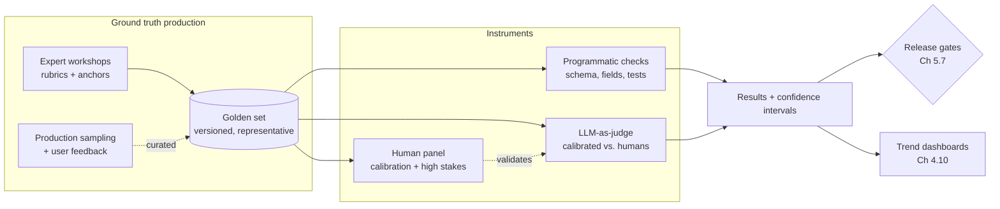

# Chapter 2.7 — Evaluating ML Systems

| | |
|---|---|
| **Part** | 2 — Artificial Intelligence |
| **Maturity level** | 2 — Build |
| **Difficulty** | Intermediate |
| **Estimated study time** | 3–4 hours (reading 2 h, exercise 90 min) |
| **Prerequisites** | [Chapter 2.2](chapter-02-machine-learning-fundamentals.md); [Chapter 2.6](chapter-06-training-finetuning-alignment.md) |

## Learning Objectives

After this chapter you will be able to:

1. Choose and interpret classification metrics — precision, recall, and their trade-off — and refuse "accuracy" where it misleads.
2. Explain why generative output evaluation is fundamentally harder than classification, and survey the method ladder: exact match, overlap metrics, rubric scoring, LLM-as-judge, human evaluation.
3. Read public LLM benchmarks critically: what they measure, how contamination corrupts them, and why leaderboard rank rarely predicts your task's quality.
4. Reason statistically about evaluation results: sample sizes, noise floors, and when a measured difference means nothing.

## Introduction

Part 2 has repeatedly deferred one question: *how do you know if any of this works?* Chapter 2.2 gave the splits discipline; 2.6 kept declaring evals "the only fixed reference frame." This chapter pays those debts. Evaluation is the load-bearing skill of applied AI — the difference between an architect who claims and an architect who knows — and it divides into two eras you must both master: **classification evaluation** (mature, exact, statistical) for the discriminative systems still running most enterprise prediction, and **generative evaluation** (young, contested, essential) for everything GenAI.

This is a concepts chapter: the reasoning tools. Chapter 4.7 industrializes them into pipelines, golden sets, CI gates, and judge validation at production scale; Chapter 3.10 applies them to model selection. What you build here is the judgment those chapters assume.

## Business Motivation

Evaluation illiteracy has a signature enterprise disaster: **the metric that lied**. A fraud model reports "99.2% accuracy" to the risk committee — on data where 0.9% of transactions are fraud, meaning a model that flags *nothing* scores 99.1%. The committee funds the rollout; the model catches under half of real fraud; the gap surfaces in the annual loss report, attributed to "AI underperformance" when it was arithmetic nobody checked. The generative-era version is subtler and now ubiquitous: a GenAI pilot is judged "impressive" on demos (unmeasured, cherry-picked, fluency-flattered — Chapter 2.4's trained polish doing its work), funded to production, and then discovered to be wrong in ways no one can quantify because no baseline was ever measured. Both disasters are prevented by the same inexpensive discipline — the right metric, on the right data, with the right sample size — and the architect is typically the only person in the room positioned to enforce it. Meanwhile the *benchmark* version costs enterprises in procurement: choosing models by leaderboard rank is choosing by a number that contamination and task mismatch have often already hollowed out; the private, task-specific eval (Chapter 3.10) is the only number that was ever about *you*.

## Theory

### Classification metrics: the confusion matrix and its children

Every binary decision system produces four outcomes: true positives, false positives, true negatives, false negatives. All classification metrics are ratios over this **confusion matrix**, and choosing among them is choosing *which error you care about*:

- **Accuracy** — share of all decisions correct. Meaningless under class imbalance (the fraud example); the first number to distrust in any vendor deck.
- **Precision** — of the items flagged, how many were right? The metric of *false-alarm cost* (each flagged transaction an analyst must review).
- **Recall** — of the items that should be flagged, how many were caught? The metric of *miss cost* (each missed fraud is a loss).
- **Precision and recall trade off** via the decision threshold: flag more aggressively and recall rises while precision falls. The threshold is a *business decision wearing a technical costume* — where it sits should be set by the relative cost of misses vs. false alarms (Chapter 1.3's play logic), not by a data scientist's default. F1 (their harmonic mean) and AUC (threshold-free ranking quality) are useful summaries, but the architect's question in every review is the plain one: *which error hurts us more, and does the metric reflect that?*

This machinery transfers directly into GenAI systems wherever a component makes a discrete call: retrieval (recall@k — did the relevant chunk make the top k?), guardrail filters (precision/recall over policy violations), routing classifiers, PII detectors. Generative systems are full of classification sub-problems, and they get the mature toolkit.

### Generative evaluation: the method ladder

Generation breaks the classification toolkit at the root: there is no single correct output. "Summarize this claim" has thousands of acceptable answers and infinitely many subtle failures; correctness is multi-dimensional (factual? grounded? complete? on-tone? safe?), and dimensions trade off. The response is a ladder of methods, each trading fidelity against cost:

1. **Exact/programmatic checks** — where structure permits: JSON schema validity, extracted fields equal ground truth, code passes tests, cited document exists. Cheap, perfectly reliable, underused — *design outputs to be checkable* (Chapter 3.4) and you convert generative evaluation back into classification wherever possible.
2. **Overlap metrics (BLEU/ROUGE-family)** — n-gram overlap with reference texts. Historic (machine translation), weak for open generation (a perfect answer phrased differently scores zero); know them to read papers, don't build gates on them.
3. **Rubric scoring** — decompose quality into named dimensions with anchored scales ("Faithfulness 1–5, where 5 = every claim traceable to source"). The workhorse: makes quality *discussable and consistent*, whether the scorer is human or model. Rubric design is requirements work (Chapter 1.6's fit criteria, operationalized — the example-sorting workshop produces exactly these anchors).
4. **LLM-as-judge** — a model scores outputs against the rubric. The scaling breakthrough of the generative era: evaluation at CI speed and production volume. Also a measurement instrument with *known systematic biases* — position (favors first answer shown), verbosity (favors longer), self-preference (favors its own family's style), and inherited sycophancy (Chapter 2.6) — every one manageable (randomize order, control length, cross-family judging) but only if treated as what it is: an instrument requiring **calibration against human labels** before its readings are trusted. An unvalidated judge is an opinion generator with a dashboard.
5. **Human evaluation** — domain experts scoring outputs; the gold standard and the cost ceiling. Deployed where it's irreplaceable: validating the judge, adjudicating hard cases, high-stakes sampling audits (Chapter 4.7's operating model is precisely this division of labor: humans calibrate, judges scale).

### Benchmarks: reading the public numbers

Public benchmarks (MMLU-family knowledge suites, coding benchmarks, arena-style preference leaderboards) serve one legitimate purpose for architects — coarse capability triage across model generations — and mislead beyond it for three structural reasons. **Contamination** (Chapter 2.2's leakage at civilizational scale): benchmarks published on the internet end up in training corpora; scores measure memorization mixed with capability in unknown proportions. **Task mismatch:** no benchmark measures *your* task — multi-turn German insurance correspondence under a liability blocklist is not on any leaderboard (Meridian's embedding lesson from Chapter 2.4, generalized). **Optimization pressure:** labs tune for visible benchmarks (Goodhart, Chapter 1.2 — the benchmark became the target). The professional posture: use public numbers to shortlist, then decide on a **private eval you built from your own data and rubrics** — never the reverse. Providers' claims deserve the Averline procurement question (Chapter 2.2): *evaluated on what, constructed by whom?*

### Statistical honesty: the noise floor

Evaluation results are samples, and samples fluctuate. On a 100-example eval set, an 85% vs. 87% comparison is nearly meaningless — the ±95% confidence interval on 100 binary outcomes spans roughly ±7–10 points; the "improvement" is likely noise. Working rules an architect can carry without a statistics degree: **know your noise floor** (for quick intuition: the standard error on a proportion is at worst ≈ 0.5/√n — so n=100 → ±5 points; n=400 → ±2.5; n=2,500 → ±1); **size the eval set to the decision** (blocking a release over a 2-point regression requires an eval set that can *see* 2 points); **beware repeated peeking** (checking the eval after every prompt tweak and keeping the best run is Chapter 2.2's iteration leakage — the number drifts flattering-ward); and **paired comparisons sharpen** (same inputs through both variants, compare per-item, is far more sensitive than comparing two independent averages). None of this is exotic — it is the difference between an evaluation program and a random-number ritual, and it's the [evaluation checklist's](../../checklists/evaluation-checklist.md) "know your noise floor" line, unpacked.

## Architecture Perspective

Evaluation is a *measurement system* — an architecture parallel to the serving architecture, with its own components, data flows, and failure modes:

Architectural readings. **Ground truth is manufactured, continuously:** the golden set is a living product with a supply chain (workshops, production sampling, curation) and a budget — Chapter 2.2's label operations, now with the GenAI twist that *rubrics* are as much the product as labels. **Instruments require calibration chains:** programmatic checks are self-evidently valid; judges are valid only through periodic human validation; humans are valid only with rubric anchoring and agreement measurement — every reading traces to a calibration, or it's noise with confidence. **The measurement system outlives every model it measures** (Chapter 2.6's fixed-reference-frame claim, now drawn): models, prompts, and providers rotate through the gates; the eval architecture persists — which is why it deserves platform-grade investment (Chapter 7.9's shared eval service) rather than per-project improvisation, and why P10 in the [project catalog](../../projects/README.md) builds exactly this.

## Real-world Example

**Halvard & Roth** (Chapter 1.7's law firm) provides the two-act version of this chapter. Act one, classification: the contract-analysis pipeline's clause-flagging component went to the risk committee with "96% accuracy" in the deck. The architect, Yusuf, rewrote the slide before it presented: flagged clauses were 4% of the corpus, so accuracy was the wrong instrument entirely — the honest numbers were 71% precision (of flagged clauses, how many truly problematic — each false alarm cost associate review minutes) and 88% recall (of truly problematic clauses, how many caught — each miss was malpractice exposure). The committee, seeing the real trade-off for the first time, made a real decision: push recall to 95% and accept precision falling to ~55%, because the miss cost dominated — the threshold moved for business reasons, on a slide any partner could read. The "accuracy" number never appeared again.

Act two, generative: the summarization component had been "evaluated" by partner impressions ("reads well"). Yusuf's team built the ladder instead: programmatic checks first (every cited clause must exist in the source — catching fabricated citations, the profession's nightmare, deterministically); a four-dimension rubric (faithfulness, completeness, materiality-ranking, register) anchored in a workshop where partners sorted 30 real summaries (Chapter 1.6's method producing Chapter 2.7's instrument); an LLM judge scored against the rubric — *after* a calibration round showed 84% agreement with partner labels on faithfulness but only 61% on materiality-ranking, so the judge gated faithfulness in CI while materiality went to human sampling. And the noise floor bit, memorably: an enthusiastic engineer announced a prompt change had "improved faithfulness 3%" — on the 80-item eval set, inside the ±6-point noise band. The set was expanded to 500 items before the next gate decision; the "improvement" evaporated. The firm's eval suite now outlives its third model migration, which Yusuf cites as the ROI: *"We've changed models twice and prompts forty times. The only thing that never got replaced is the thing that tells us whether the replacements worked."*

## Hands-on Exercise

**Build the reasoning kit end to end.** ~90 minutes. No infrastructure needed; a spreadsheet and any LLM suffice.

1. **Confusion-matrix drill (20 min).** A PII-detection guardrail on 10,000 outputs: 120 true PII leaks exist; the filter flags 200 outputs, of which 90 are true leaks. Compute precision, recall, and accuracy. Write the one-sentence business reading of each number, and state which single metric you'd put on the team dashboard and why.
2. **Rubric construction (30 min).** For a support-email-drafting assistant: write a three-dimension rubric (choose the dimensions; faithfulness to ticket facts should probably be one) with anchored 1–5 scales — each anchor a *concrete description*, not an adjective. Score two sample outputs (write them yourself, one subtly flawed) against it.
3. **Judge calibration mini-run (25 min).** Have an LLM score both outputs against your rubric, three times each (fresh contexts). Compare to your human scores. Note agreement, note variance across the three runs, and note any verbosity or position effects you can provoke by reordering. Write the two-sentence verdict: what would you trust this judge to gate, and what goes to humans?
4. **Noise-floor check (15 min).** Your eval set has 150 items; variant B beats variant A by 4 points (78% vs. 74% pass rate). Using the 0.5/√n rule, is this decidable? What n would you need to gate on a 4-point difference with room to spare? State the paired-comparison alternative.

**Acceptance criteria:**
- [ ] Drill 1: precision 45%, recall 75%, accuracy ≈98.6% — with the reading that accuracy flatters and the dashboard choice argued from error costs
- [ ] Rubric anchors are concrete enough that two strangers would score within 1 point of each other
- [ ] Judge verdict distinguishes gate-worthy dimensions from human-only dimensions based on observed agreement
- [ ] Noise-floor answer shows the arithmetic (150 → ±4 points: not decidable) and names paired comparison as the sharpener

## Enterprise Considerations

Enterprise evaluation is evaluation plus accountability. **Regulated regimes** (model risk management, EU AI Act-style conformity — Chapters 2.8, 4.14) convert this chapter into documentary obligations: metric definitions, dataset lineage, validation independence (the team that validates isn't the team that built — SR 11-7's core demand), and evidence that thresholds trace to risk appetite; your eval architecture *is* the compliance evidence, so build it documentable. **The eval-set access problem:** golden sets built from production data inherit that data's classification — a claims golden set is PHI/PII, needing the same access controls as production (an audit finding waiting to happen in most shops). **Cross-team metric politics:** when the platform team's judge gates the application team's release, rubric changes become governance events with due process (Chapter 6.9); version rubrics and judges like APIs, with deprecation notice. **And human evaluation is a labor question at scale:** sustained expert scoring is real headcount from billable professionals — Halvard & Roth's partners priced their calibration hours into the project — which is exactly why the calibration-chain architecture (humans calibrate instruments; instruments scale) is an economic design, not just a methodological one.

## Trade-offs

| Decision | Option A | Option B | Choose A when… | Choose B when… |
|----------|----------|----------|----------------|----------------|
| Metric under imbalance | Precision/recall pair, threshold by error cost | Accuracy / single summary | Always for imbalanced decisions | Balanced classes and genuinely symmetric error costs (rare) |
| Generative gating | Programmatic checks + calibrated judge | Human review of everything | Volume demands it; judge validated per dimension | Highest-stakes slices, judge-untrustable dimensions, calibration rounds |
| Eval set size | Large (small noise floor) | Small, fast, cheap | Gate decisions on small deltas; regression protection | Exploration, where you only care about big effects — labeled as such |
| Benchmark use | Private task-specific evals decide | Public leaderboards decide | Every real selection and release decision | Coarse shortlisting of candidates only |

## Common Mistakes

1. **Accuracy under imbalance** — the fraud slide, the eternal recurrence. Reflex: ask the base rate before accepting any single-number claim.
2. **Threshold set by default, not by error cost** — the precision/recall balance is a business decision; leaving it at 0.5 outsources risk appetite to a library default.
3. **Unvalidated judges gating releases** — an LLM judge without human calibration is automated opinion; validate per dimension, re-validate on judge-model changes (it's an instrument — it drifts).
4. **Demo-based "evaluation" of generative systems** — impressions of cherry-picked outputs, fluency-flattered (Chapter 2.4). If there's no rubric and no denominator, it isn't evaluation.
5. **Deciding inside the noise floor** — celebrating 2-point movements on 100-item sets; peeking repeatedly and keeping the best run. Know the ±, size the set, pair the comparisons.
6. **Leaderboard-driven procurement** — contamination + task mismatch + optimization pressure = a number about the benchmark, not about you. Shortlist publicly, decide privately.

## Best Practices

1. **Ask the four questions of every reported number** — metric? base rate? dataset provenance? sample size? — the complete first-pass audit, thirty seconds, catches most fictions (extends Chapter 2.2's split-provenance note).
2. **Design outputs to be programmatically checkable** — schemas, extractable fields, verifiable citations; every check you move down the ladder is cost and noise removed (Chapter 3.4's structured outputs pay their rent here).
3. **Build rubrics with domain experts sorting real examples** — the Chapter 1.6 workshop is the rubric factory; anchors from real sorted cases, not adjectives from meetings.
4. **Run the calibration chain explicitly** — humans anchor rubrics, judge validated per dimension against humans, gates only on validated dimensions; document the chain (it's the audit story too).
5. **Publish confidence intervals with every eval result** — a pass rate without a ± trains the organization to see noise as signal; the dashboard should render the band, not just the line.
6. **Treat the eval system as permanent infrastructure** — versioned sets, versioned rubrics, versioned judges, platform-owned; it will outlive every model it measures (Halvard & Roth's ROI line).

## Architecture Checklist

For any system with a learned component heading to production:

- [ ] Every metric chosen against the error-cost structure; no accuracy under imbalance; thresholds set by business decision
- [ ] Classification sub-components (retrieval, guardrails, routers) have confusion-matrix metrics, not vibes
- [ ] Generative quality decomposed into rubric dimensions with concrete anchors, built with domain experts
- [ ] Everything checkable programmatically is checked programmatically
- [ ] LLM judges calibrated against human labels per dimension; validation refreshed on judge changes; biases mitigated (order, length, cross-family)
- [ ] Eval set sized to the smallest delta the gates must detect; confidence intervals reported; paired comparisons used
- [ ] Public benchmarks used for shortlisting only; all decisions on private task evals
- [ ] Golden sets versioned, access-controlled to their data classification, and continuously replenished from production

## Interview Questions

1. *"A vendor reports 99% accuracy on fraud detection. Deconstruct that claim."* — Strong answers go base-rate first (accuracy under imbalance), demand the confusion matrix, ask about split provenance (Chapter 2.2), and reframe around the miss-vs-false-alarm cost structure with the threshold as a business decision.
2. *"How do you evaluate a system whose outputs have no single right answer?"* — Strong answers climb the ladder in order — maximize programmatic checkability, rubric with anchored dimensions from expert sorting, calibrated LLM-as-judge for scale, humans for calibration and high stakes — with the calibration chain explicit.
3. *"What are the failure modes of LLM-as-judge, and how do you run one responsibly?"* — Strong answers name position, verbosity, self-preference, and sycophancy; prescribe randomization, length control, cross-family judging; and insist on per-dimension human validation with periodic refresh.
4. *"Two prompt variants score 74% and 78% on your 150-item eval. Ship the winner?"* — Strong answers compute the noise floor (±4 points at n=150 — not decidable), propose paired comparison and/or set expansion, and generalize: gates must be sized to the deltas they claim to detect.

## Further Reading

- Andrew Ng, *Machine Learning Yearning* (deeplearning.ai) — re-linked from Chapter 2.2 deliberately: its error-analysis and metric-selection chapters are this chapter's classical half in 30 pages.
- Zheng et al., *Judging LLM-as-a-Judge with MT-Bench and Chatbot Arena* (arxiv.org/abs/2306.05685) — the paper that systematized judge biases and validation; the empirical basis for the calibration-chain discipline.
- Your provider's evaluation tooling documentation (official docs) — judge templates, eval APIs, grading harnesses; the operational layer over this chapter's concepts.
- Wasserstein & Lazar, *The ASA Statement on p-Values* (amstat.org) — a short, canonical antidote to significance theater; read once, misuse statistics less forever.

## Summary

- Classification evaluation is a solved toolkit: **confusion matrix → precision/recall chosen by error cost → threshold as business decision**; accuracy under imbalance is the eternal lie, and GenAI systems are full of classification sub-problems that deserve the toolkit.
- Generative evaluation climbs a ladder — **programmatic checks, overlap metrics (historic), anchored rubrics, calibrated LLM-as-judge, human gold standard** — trading fidelity against cost; design outputs checkable and the ladder gets cheaper.
- **LLM-as-judge is an instrument, not an oracle**: known biases, mandatory human calibration per dimension, re-validation on change.
- **Benchmarks shortlist; private evals decide** — contamination, task mismatch, and optimization pressure have hollowed public numbers for selection purposes.
- **Respect the noise floor**: ~0.5/√n, sets sized to the deltas gated, paired comparisons, no repeated-peeking fictions.
- The eval system is **permanent measurement infrastructure** with a calibration chain and a ground-truth supply line — it outlives every model it measures, and Chapter 4.7 builds it at industrial scale.

---

**Previous:** [Chapter 2.6 — Training, Fine-tuning & Alignment](chapter-06-training-finetuning-alignment.md) · **Next:** [Chapter 2.8 — Responsible AI: Ethics, Fairness & Regulation](chapter-08-responsible-ai.md) · **Related:** [4.7 Evaluation Systems & LLM-as-Judge](../part-4-enterprise-genai-systems/chapter-07-evaluation-systems.md), [3.10 Model Selection & Benchmarking](../part-3-core-building-blocks-of-genai/chapter-10-model-selection-benchmarking.md), [Evaluation checklist](../../checklists/evaluation-checklist.md)
