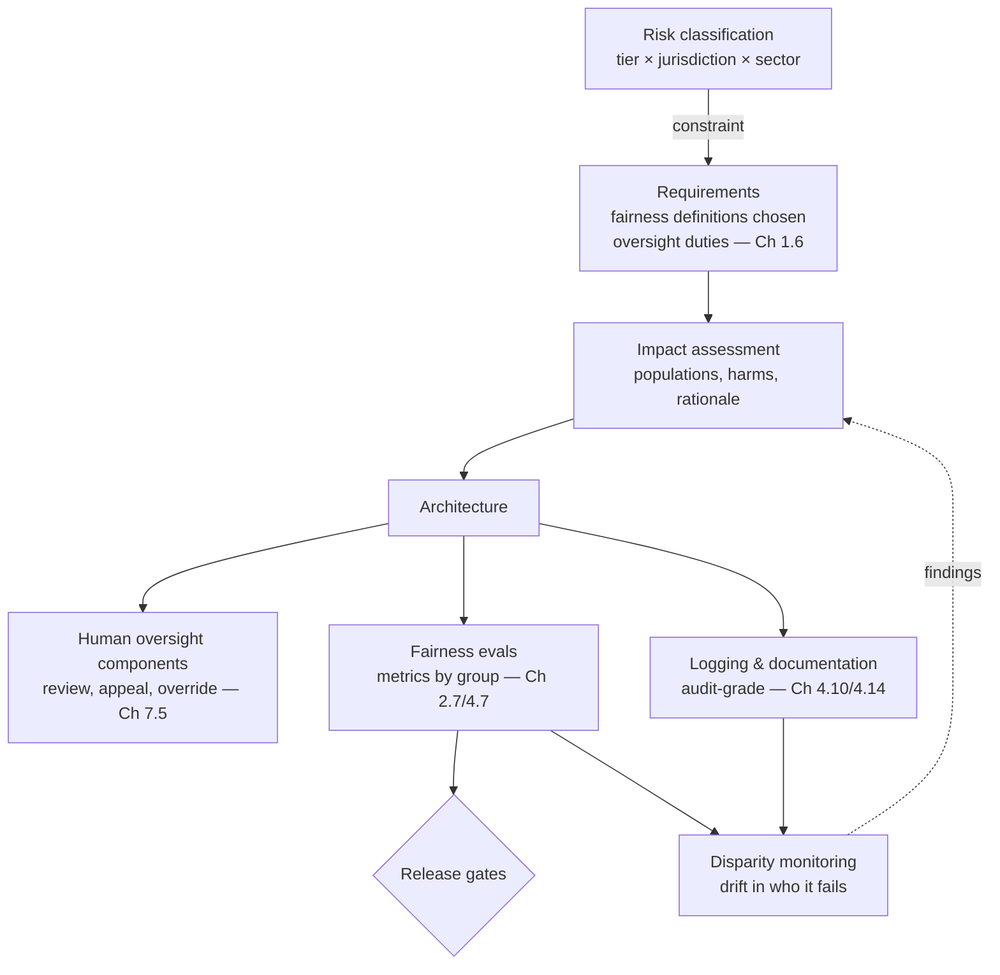

# Chapter 2.8 — Responsible AI: Ethics, Fairness & Regulation

| | |
|---|---|
| **Part** | 2 — Artificial Intelligence |
| **Maturity level** | 2 — Build |
| **Difficulty** | Intermediate |
| **Estimated study time** | 4 hours (reading 2 h, exercise 2 h) |
| **Prerequisites** | [Chapter 2.2](chapter-02-machine-learning-fundamentals.md); [Chapter 2.6](chapter-06-training-finetuning-alignment.md); [Chapter 2.7](chapter-07-evaluating-ml-systems.md) |

## Learning Objectives

After this chapter you will be able to:

1. Trace how bias enters AI systems — data, labels, objectives, deployment context — and why "the algorithm is neutral" is never true.
2. Apply fairness lenses (group vs. individual, and the impossibility of satisfying all definitions at once) as *design decisions to be made explicitly*, not compliance checkboxes.
3. Map the regulatory landscape — risk-tiered regimes like the EU AI Act, sectoral rules, and emerging global patterns — onto concrete architectural obligations.
4. Run responsible-AI as an engineering practice: impact assessment, documentation artifacts, human oversight design, and monitoring for disparate outcomes.

## Introduction

This chapter closes Part 2 by connecting everything before it to consequences. Chapter 2.2 showed that models learn their data's distribution with mathematical fidelity — this chapter is about what that means when the distribution encodes decades of human decisions about hiring, lending, healthcare, and policing. Chapter 2.6 showed that judgment is manufactured in training — this chapter asks whose judgment, and who is accountable. Chapter 2.7 built measurement — this chapter extends it to measuring *who* a system fails.

Two framings to reject at the outset. Responsible AI is not an ethics seminar bolted onto engineering — every topic here lands as a design decision, a measurable property, or a documentary artifact. And it is not merely compliance — the regulation is the floor, arriving late; the failures it responds to (biased screening tools, wrongful automated decisions, chatbots giving harmful advice) were architecture and evaluation failures first. The architect who masters this chapter doesn't just pass audits; they build systems that don't generate the incidents audits were invented for.

## Business Motivation

The costs here are not hypothetical and not small. **Regulatory exposure:** EU AI Act-style penalty regimes run to percentages of global turnover for prohibited practices and serious high-risk violations — GDPR-scale numbers that made privacy a board topic now apply to AI system classes; sectoral regulators (financial, employment, health) add their own enforcement. **Litigation:** discrimination claims arising from AI-assisted decisions (hiring screens, credit, tenant scoring) are an active and growing docket, and "the vendor's model did it" has not worked as a defense — the deploying enterprise owns the outcome. **The incident tax:** a public AI-bias story costs brand, talent, and often the *entire program* — the standard corporate response to an AI scandal is freezing every AI initiative for quarters, meaning one team's unmeasured system can price out the whole portfolio's roadmap. Against these, the responsible-AI machinery — impact assessments, fairness evals, oversight design, documentation — costs a low single-digit percentage of project budget and doubles as engineering quality work (the same golden sets, the same monitoring). It is among the cheapest insurance in the field, and it's increasingly not optional anyway.

## Theory

### How bias enters: the pipeline view

"Bias" in AI is not a moral property of algorithms; it's a *data-flow property* with entry points an architect can enumerate (extending Chapter 2.2's data-quality ceiling):

- **Historical bias** — the world that generated the data was itself unequal: lending data reflects decades of discriminatory lending; the model learns the discrimination as signal. Perfectly representative data of an unfair world reproduces the unfairness — this is the deepest entry point because *better sampling doesn't fix it*.
- **Representation bias** — some groups are thin in the data (Chapter 2.4's language inequity is exactly this): performance degrades where data is sparse, and the degradation lands on the already-underserved.
- **Label bias** — labels encode the labelers (Chapter 2.2): "creditworthy" learned from past approvals encodes past approvers; toxicity labels encode annotator demographics.
- **Objective/proxy bias** — the optimization target stands in for the real goal (Chapter 1.2's proxy problem with stakes raised): "healthcare cost" as a proxy for "healthcare need" famously underestimated Black patients' needs because historical access inequity made their costs lower at equal illness.
- **Deployment bias** — a system built for one context applied in another: a résumé screen tuned on tech-industry data deployed for nursing; a US-English toxicity filter moderating Nigerian English.

For LLMs specifically, add: pre-training corpora encode the internet's demographics and viewpoints (Chapter 2.6's stage 1); alignment encodes the preferences of raters and constitution-writers (stage 3); and generative harms extend beyond decisions to *representational* harms — stereotyped personas, erasure, differential quality of service by dialect or name (measurably worse answers for users signaling certain groups — a fairness property no classification metric catches, needing generative evaluation by group, Chapter 2.7's rubrics sliced by demographic dimension).

### Fairness: lenses, not a lever

"Fair" has multiple precise, *mutually incompatible* definitions — the impossibility results are mathematical, not political. The lenses an architect needs:

- **Group fairness** compares outcomes across groups: *demographic parity* (equal positive rates), *equalized odds* (equal error rates), *predictive parity* (equal precision). The impossibility core: when base rates differ across groups, equalized odds and predictive parity **cannot** both hold — choosing between them is choosing *which error equity matters more* (whose false positives, whose false negatives — Chapter 2.7's error-cost reasoning, now with justice attached).
- **Individual fairness** — similar individuals treated similarly; intuitive, but "similar" smuggles in the whole problem.
- **Procedural fairness** — the process is contestable: notice, explanation, appeal. Often the most *actionable* lens architecturally, because it converts to concrete components: reason codes (Chapter 2.3's explainability regimes), human review paths, appeal workflows (Chapter 7.5).

The design discipline that follows: **fairness definitions are requirements to be chosen explicitly, with stakeholders, documented with rationale** (Chapter 1.6's fit-criteria machinery — "the system shall satisfy equalized odds within X points across groups A/B on decision D, measured quarterly"). The unforgivable version is not choosing "wrong"; it's not choosing — leaving the fairness property to whatever the training data happened to produce, unmeasured. Note also what measurement requires: group metrics need group data, and collecting protected attributes is itself regulated — the standard resolution (collect for testing under strict access, never as model features) needs privacy-by-design (Chapter 4.14) and is a governance decision to make early, not discover late.

### The regulatory landscape: risk-tiered and converging

Jurisdictions differ; the *shape* is converging on risk tiers, and the EU AI Act is the template worth learning as a type specimen:

- **Prohibited practices** — social scoring, manipulative techniques, certain biometric uses: not mitigated, *not built*.
- **High-risk systems** — AI in employment, credit, education, essential services, law enforcement, medical devices: permitted with heavy obligations — risk management systems, data governance, technical documentation, logging, human oversight, accuracy/robustness standards, conformity assessment. Read that list against this curriculum: it is Chapters 1.6, 2.2, 2.7, 4.7, 4.10, 4.14 with legal force — the engineering you should do anyway, made mandatory and documentable.
- **Transparency-tier** — chatbots and generated content: users must know they're interacting with AI / seeing synthetic media.
- **GPAI/foundation-model obligations** — falling mostly on providers (documentation, evals, incident reporting), but *deployers inherit duties* too: using a model within its documented capabilities, maintaining oversight, logging.

Around the template: **sectoral rules** predate and outlast AI-specific law (credit reason codes, employment testing standards, medical-device regimes — your industry's regulator moved before Brussels did); **US-style patchwork** (state laws on hiring AI, biometric privacy, sectoral federal enforcement) rewards architecture that's *configurable per jurisdiction*; and **the classification question comes first in every project**: what tier is this system, in which jurisdictions, under whose sectoral rules — a Chapter 1.6 constraint that partitions the design space before any container is drawn (a "productivity assistant" that drafts performance-review inputs may be a high-risk employment system wearing a casual name — the *use*, not the label, decides).

### The practice: artifacts and machinery

Responsible AI operationalizes as a small set of recurring artifacts, all extensions of machinery this curriculum already builds: the **impact assessment** (structured pre-build analysis: affected populations, harm scenarios, fairness definition choices, oversight design — the systems-thinking pass of Chapter 1.2 pointed at people); **documentation regimes** (model cards, data sheets, decision records — Chapter 1.4's ADRs and Chapter 2.7's eval documentation, formatted for accountability); **human oversight that works** (not a rubber-stamp human — automation bias means unsupported reviewers approve at 95%+; effective oversight needs *designed disagreement support*: confidence display, contrary evidence, time, and accountability for overrides — Chapter 7.5's patterns with teeth); and **disparity monitoring** (Chapter 4.10's dashboards, sliced by group, watching for drift in *who* the system fails — because fairness properties decay like every other model property, Chapter 2.2).

## Architecture Perspective

Responsible AI is a cross-cutting concern with the same architectural status as security — and the same failure mode when treated as a final-phase review instead of a design property:

Three structural readings. **Classification is a one-way-door input** (Chapter 1.4): the risk tier determines whether you need conformity assessment, oversight components, and audit-grade logging — retrofitting these onto a shipped system costs multiples of designing them in, and the tier can *change with use* (feature creep that turns a drafting tool into a decision tool re-classifies the system — governance must watch scope, not just launch). **The machinery is shared, not parallel:** fairness evals ride the eval architecture (2.7), disparity monitoring rides observability (4.10), documentation rides ADR discipline (1.4) — responsible AI done well is mostly *pointing existing machinery at additional questions*, which is why its marginal cost is low and why teams with strong engineering practice absorb it easily while teams without it experience it as crushing bureaucracy. **Oversight is a component with an SLO:** review queues, appeal paths, and override mechanisms are load-bearing architecture — they need capacity planning (reviewer throughput), latency budgets (appeal resolution time), and their own quality monitoring (override rates, automation-bias indicators), exactly like any other component.

## Real-world Example

**Bellhaven Insurance** (Chapters 1.3, 2.1) decided to extend Tomás's submission-intake platform with a "renewal risk advisor" — scoring which commercial policies to flag for underwriter attention at renewal, with premium-adjustment suggestions. The architect assigned, Renata, ran the classification question first, and it changed everything: policy-renewal pricing touches an essential-service decision about businesses — in two of Bellhaven's operating jurisdictions this landed the system in the high-risk tier, and the insurance regulator's existing model-governance rules applied regardless. The "quick ML feature" was structurally a regulated decision system, and the design inherited obligations: documented data governance, chosen fairness properties, human oversight, audit logging, and annual validation.

The fairness pass produced the project's hardest meeting. The training data — ten years of renewal decisions — encoded a known historical pattern: small businesses in certain postal codes (correlating strongly with owner demographics) had been non-renewed at higher rates during a previous management era. Trained naively, the model reproduced it faithfully (Chapter 2.2's amplification, on schedule — caught because Renata's team *tested* outcome rates by proxy-group before anyone asked). The stakeholder decision was genuinely hard: equalizing flag rates across regions (demographic parity) would miss real geographic risk factors; equalizing error rates (equalized odds) was chosen instead, with the rationale documented — flagging isn't declining, and every flag routed to a human underwriter with *designed* disagreement support: the screen showed the model's top factors, the contrary evidence (years-as-customer, claims-free record), and required a stated reason for adverse action, feeding the appeal path required by the regulator anyway. Override rates by underwriter became a monitored metric — one underwriter's 2% override rate (versus a 15% median) triggered a coaching conversation about rubber-stamping, not a reprimand for the others.

The dénouement earned the case its place here: eighteen months in, the disparity dashboard — not a complaint, not an audit — caught error-rate drift against one region after a corpus refresh changed an upstream data source. Detection to correction took three weeks, documented end to end. When the regulator's thematic review of AI in underwriting arrived the following year, Bellhaven's submission was assembled from artifacts that already existed. The review team's exit note, which Renata framed: *"The firm was able to answer 'how do you know?' for every claim it made about the system."* That sentence is this chapter's exit criterion.

## Hands-on Exercise

**Run the responsible-AI pass on a realistic system.** Use [CS44 — Recruiting Screening Support](../../case-studies/README.md) (structured extraction + ranking assistance for hiring — deliberately chosen: employment is high-risk-tier almost everywhere). ~2 hours.

1. **Classification memo (25 min).** Determine the risk tier under an EU AI Act-style regime and identify one sectoral/jurisdictional layer that would apply in a market you know. List the top five obligations that follow. State what feature change would *raise* the classification (e.g., from "assists ranking" to "auto-rejects").
2. **Bias entry-point audit (30 min).** For this system, name a concrete mechanism for each: historical, representation, label, proxy, deployment bias — plus one LLM-specific entry (e.g., name/dialect effects in CV summarization). For each: the test that would detect it (Chapter 2.7 machinery, sliced by group).
3. **Fairness decision (30 min).** Choose the fairness definition(s) this system should satisfy, acknowledge what the choice sacrifices (the impossibility trade), state it as a Chapter 1.6 fit criterion with measurement cadence, and note what data collection the measurement requires and under what controls.
4. **Oversight design (35 min).** Design the human-review component: what the reviewer sees (including disagreement support — contrary evidence, confidence), what they must record, the appeal path, and the *metrics on the oversight itself* (override rates, review time, automation-bias tripwires). One diagram, half a page of prose.

**Acceptance criteria:**
- [ ] Classification memo derives obligations from tier + sector, and names the scope-creep trigger that would re-classify
- [ ] All five-plus-one bias entry points have concrete mechanisms *and* named detection tests
- [ ] Fairness choice is explicit about what it sacrifices and lands as a measurable fit criterion
- [ ] Oversight design includes disagreement support and metrics on the humans, not just the model

## Enterprise Considerations

At enterprise scale, responsible AI becomes an operating model question. **Governance structure:** someone must own the classification register (every AI system, its tier, its review date — Chapter 2.1's wave-map, now with legal stakes), the assessment pipeline, and the exception process; this typically lands as an AI governance board threaded into existing risk machinery (Chapter 6.9) — a parallel bureaucracy is the failure mode, integration is the success mode. **Vendor and model-provider diligence:** deployers inherit duties, so procurement needs AI-specific clauses — documentation sufficiency, eval evidence, incident notification, use-restriction flow-downs — and the Chapter 2.2 rule (evaluate on your data) extends to fairness properties (test the vendor's screen for disparate impact on *your* applicant pool; their benchmark says nothing about it). **The works-council/union dimension** (Chapters 1.6, 1.8) doubles here: systems touching employees trigger consultation rights in many jurisdictions *and* the responsible-AI machinery — one engagement process should serve both. **And incident readiness:** AI incidents (discriminatory outcome discovered, harmful advice at scale, regulator inquiry) need runbooks like security incidents — who convenes, what gets frozen, what gets disclosed to whom, on what clock; regimes increasingly mandate serious-incident reporting, and improvising the process during the incident is how a finding becomes a fine.

## Trade-offs

| Decision | Option A | Option B | Choose A when… | Choose B when… |
|----------|----------|----------|----------------|----------------|
| Fairness definition | Equalized odds (error-rate equity) | Demographic parity (outcome-rate equity) | Base rates differ for defensible reasons; decisions route to human review | Legacy inequity in base rates is itself the target; policy mandate |
| Protected-attribute data | Collect for testing, firewalled from features | Don't collect (proxy-based auditing only) | Legal basis exists; access controls are real | Collection is legally barred — accept weaker, proxy-based assurance and document the limit |
| Oversight depth | Human review on all adverse actions | Sampling + appeal path | High-risk tier, low volume, severe individual harm | Volume makes full review a rubber stamp — honest sampling beats fake totality |
| Compliance posture | Build to the strictest operating jurisdiction | Per-jurisdiction configuration | Simplicity wins; strictest regime is tolerable everywhere | Regimes genuinely conflict, or strictest-everywhere kills viable markets — pay the config complexity |

## Common Mistakes

1. **Skipping classification** — building first, checking tier later; the retrofit (oversight components, audit logging, conformity evidence) costs multiples, and prohibited-practice discoveries cost everything.
2. **Fairness by default** — shipping whatever the data produced, unmeasured. The impossibility results mean *someone* chose a fairness property; if it wasn't you, it was your training set's history.
3. **Rubber-stamp oversight** — a human in the loop with no disagreement support, approving at 97%; regulators increasingly test oversight *effectiveness*, and automation-bias literature says undesigned review is theater.
4. **Testing fairness once** — launch-time parity, then drift (Bellhaven's corpus refresh). Fairness properties decay; disparity monitoring is a dashboard, not a milestone.
5. **Treating vendor systems as someone else's problem** — deployer liability is the operative pattern; their model, your applicant pool, your lawsuit. Diligence and your-data testing, contractually enabled.
6. **Building the parallel bureaucracy** — a responsible-AI process disconnected from engineering machinery, experienced as pure friction and route-around-able (Chapter 1.8's adoption logic applies to governance too); the low-cost version *rides* the eval, observability, and ADR infrastructure you already run.

## Best Practices

1. **Classify at intake, register centrally, re-check on scope change** — tier × jurisdiction × sector as the first field in every AI project brief; feature creep re-classifies.
2. **Make the fairness decision an explicit, documented requirement** — chosen with stakeholders, stated as a fit criterion, with the sacrifice acknowledged (Chapter 1.4's named-losers discipline applied to justice).
3. **Slice every eval and every dashboard by group where stakes warrant** — fairness testing as a *dimension* of the 2.7/4.7 machinery, not a separate ceremony; same golden sets, additional cuts.
4. **Design oversight as a component with metrics** — disagreement support, capacity plan, override-rate monitoring, appeal SLO; staff it and measure the humans.
5. **Assemble compliance from engineering artifacts** — ADRs, eval reports, monitoring exports; if an auditor's question requires a document that doesn't already exist, the engineering practice has a gap (Bellhaven's exit note is the target state).
6. **Rehearse the AI incident** — tabletop the discriminatory-outcome scenario annually: freeze criteria, disclosure clocks, comms, regulator notification; the runbook's existence is itself evidence of a functioning risk system.

## Architecture Checklist

For any system making or informing decisions about people (and as a screen for all others):

- [ ] Risk classification done (tier × jurisdiction × sector), registered, with re-classification triggers on scope change
- [ ] Bias entry points audited pipeline-wide; each has a named detection test
- [ ] Fairness definition(s) chosen explicitly, documented with rationale and sacrifice, stated as measurable fit criteria
- [ ] Protected-attribute strategy resolved (collection basis, firewalls) before fairness measurement is promised
- [ ] Human oversight designed with disagreement support, capacity, and its own metrics; appeal path has an SLO
- [ ] Logging is audit-grade for the tier; documentation assembles from existing engineering artifacts
- [ ] Disparity monitoring live post-launch, sliced by group, with drift alerts and an owner
- [ ] Vendor components covered: diligence, your-data fairness testing, incident-notification clauses
- [ ] AI incident runbook exists and has been tabletopped

## Interview Questions

1. *"Your training data reflects historical discrimination. The model reproduces it. Walk me through your options."* — Strong answers refuse the false binary of "use it or don't": name the entry point (historical bias — sampling won't fix it), present the fairness-definition choice with its impossibility trade, propose mitigations (reweighting, constraint-based training, oversight routing), and insist the choice be made explicitly with stakeholders and documented.
2. *"What does the EU AI Act (or your jurisdiction's equivalent) actually change about how you architect?"* — Strong answers translate law to components: classification first, then oversight design, audit logging, documented evals, data governance — and note that it's mostly good engineering with legal force, cheap if your practice is strong, crushing if not.
3. *"Design human oversight for an AI hiring screen that actually works."* — Strong answers lead with automation bias: disagreement support (contrary evidence, confidence, time), accountability for overrides in both directions, metrics on the reviewers, honest sampling over fake totality at volume, and an appeal path with an SLO.
4. *"How do you test whether your customer-facing LLM treats user groups equitably?"* — Strong answers extend generative evaluation (Chapter 2.7) by group: rubric-scored quality sliced by dialect/name/language signals, representational-harm probes, disparity dashboards in production — and name the data-collection governance the measurement requires.

## Further Reading

- Barocas, Hardt & Narayanan, *Fairness and Machine Learning* (fairmlbook.org, free) — the standard text; the impossibility results and their proofs, readable at architect depth in the early chapters.
- The EU AI Act (official EUR-Lex consolidated text, and the Commission's implementation guidance) — read the risk-tier articles and Annex III (high-risk categories) directly; secondhand summaries age badly.
- Obermeyer et al., *Dissecting racial bias in an algorithm used to manage the health of populations* (Science, 2019) — the healthcare-cost proxy case; the single best worked example of objective bias.
- Mitchell et al., *Model Cards for Model Reporting* (arxiv.org/abs/1810.03993) — the documentation-artifact template that the industry's practice descends from.

## Summary

- Bias is a **pipeline property with enumerable entry points** — historical, representation, label, proxy, deployment, plus LLM-specific (corpus, alignment, representational harms) — each with a nameable detection test; "the algorithm is neutral" is never true because the data never is.
- Fairness definitions are **mutually incompatible by mathematics**: choosing which error equity matters is a design decision to make explicitly, with stakeholders, documented — the unforgivable version is not choosing.
- Regulation is converging on **risk tiers**: classify every system (tier × jurisdiction × sector) *first*, because the tier is a one-way-door constraint that determines oversight, logging, and documentation architecture — and scope creep re-classifies.
- The machinery is **shared, not parallel**: fairness evals ride Chapter 2.7, disparity monitoring rides 4.10, documentation rides 1.4 — responsible AI done well points existing engineering at additional questions.
- **Oversight is a component with metrics on the humans** — automation bias makes undesigned review theater; disagreement support, capacity, and override monitoring make it real.
- The exit criterion for the whole practice, and for Part 2: being able to answer **"how do you know?"** for every claim you make about the system. Part 3 now turns to building the systems themselves.

---

**Previous:** [Chapter 2.7 — Evaluating ML Systems](chapter-07-evaluating-ml-systems.md) · **Next:** [Part 3 — Core Building Blocks of Generative AI](../part-3-core-building-blocks-of-genai/) · **Related:** [4.14 Privacy, Compliance & AI Governance](../part-4-enterprise-genai-systems/README.md), [7.5 Human-in-the-Loop Patterns](../part-7-enterprise-ai-architecture-patterns/README.md), [6.9 Architecture Governance](../part-6-enterprise-architecture/README.md)
