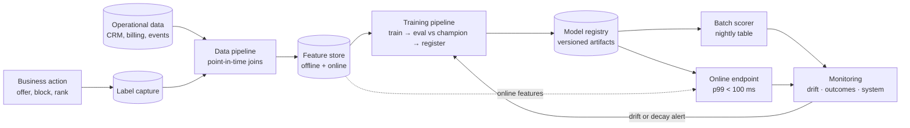

# Chapter 2.9 — Classical ML System Design

| | |
|---|---|
| **Part** | 2 — Artificial Intelligence |
| **Maturity level** | 2→3 — Build → Engineer |
| **Difficulty** | Intermediate |
| **Estimated study time** | 4 hours (reading 90 min, exercise 2.5 h) |
| **Prerequisites** | [2.2](chapter-02-machine-learning-fundamentals.md); [2.7](chapter-07-evaluating-ml-systems.md) |

## Learning Objectives

After this chapter you will be able to:

1. Recognize the four classical ML problem families that dominate enterprise demand — prediction, classification, forecasting, and ranking/recommendation — and name the standard solution shape for each.
2. Design a classical ML system end-to-end: data pipeline, feature engineering, training, serving (batch vs online), and monitoring for drift.
3. Explain why gradient-boosted trees on tabular data remain the enterprise workhorse, and defend that choice against "why not use an LLM?" pressure.
4. Specify the feedback loop — how predictions become labels — and identify when a system cannot learn because the loop is broken.

## Introduction

Parts 3–7 of this curriculum are about GenAI because that is where today's demand concentrates. But a large share of enterprise AI value still comes from a family of problems that predates LLMs and is not served well by them: *given structured historical data, predict a structured outcome.* Will this customer churn? Is this transaction fraudulent? How many units will this store sell next week? Which product should we show next?

An AI Solution Architect — as opposed to a GenAI-only architect — must be able to design these systems, estimate their cost, and, critically, recognize them on sight so they are not misdiagnosed as LLM problems (that decision framework is [2.11](chapter-11-choosing-the-right-ai-approach.md); this chapter builds the system-design competence it depends on). The good news: everything you learned in 2.2 and 2.7 applies directly; this chapter adds the *system* around the model.

## Business Motivation

Classical ML problems are usually attached to a directly measurable KPI, which makes their business cases the cleanest in AI. A telecom with 10M subscribers, 2% monthly churn, and ₹600 average revenue per user loses roughly ₹120 crore/month to churn; a model that identifies the top decile of at-risk customers with 3× lift, paired with a retention offer that saves even 10% of them, pays for its entire platform many times over. The cost of getting it wrong is equally concrete: a fraud model with a badly chosen threshold either bleeds fraud losses (recall too low) or blocks legitimate customers at checkout (precision too low) — both show up on next quarter's P&L. Architects are hired precisely because they can connect the 2.7 metrics to these money numbers.

## Theory

### The four problem families

| Family | Question shape | Canonical examples | Standard solution shape |
|---|---|---|---|
| **Prediction (regression)** | "How much / how many?" | LTV, delivery time, price | Gradient-boosted trees (GBTs), linear models |
| **Classification** | "Which bucket / yes-no?" | Churn, fraud, credit risk, lead scoring | GBTs, logistic regression |
| **Forecasting** | "What will this time series do?" | Demand, capacity, cash flow | Statistical baselines, GBTs with lag features, specialized forecasters |
| **Ranking / recommendation** | "Which items, in what order?" | Product recs, search ranking, next-best-action | Two-stage retrieve-then-rank (an ancestor of 4.2's funnel) |

The load-bearing observation: **on structured tabular data, gradient-boosted trees (XGBoost/LightGBM-class) remain the default winner** — cheaper to train and serve than deep learning by orders of magnitude, more accurate on tabular problems in most published and practical comparisons, and explainable enough for regulated use (feature attributions). Deep learning earns its complexity on unstructured inputs (images, audio, free text); LLMs earn theirs on language tasks (3.1). Tabular prediction is neither.

### The system around the model

The model is ~10% of a classical ML system. The architecture is the other 90%:

1. **Data pipeline** — assembling training data from operational systems, with the discipline that matters most: **point-in-time correctness**. Every feature must be computed *as it would have been known at prediction time*. Violating this — letting future information leak into training features — is called **leakage**, and it is the classical-ML equivalent of benchmark contamination (2.7): stellar offline metrics, useless production model.
2. **Feature engineering** — transforming raw records into model inputs (aggregates, ratios, recency/frequency features, encodings). Features are shared assets: the same "customer 90-day activity" feature feeds churn, credit, and marketing models, which is why mature platforms centralize them in a **feature store** whose real job is guaranteeing *training–serving consistency* — the feature computed offline for training must be byte-equivalent to the one computed online at inference.
3. **Training pipeline** — a reproducible, versioned job: data snapshot → features → train → evaluate against the previous champion → register. Deliberately boring; boring is the point (contrast with 2.10).
4. **Serving** — the first true architecture decision: **batch scoring** (score all customers nightly, write to a table; cheapest, fine for churn/marketing) vs **online inference** (score per request in <100 ms; required for fraud-at-checkout, search ranking). Choose batch unless the decision genuinely happens in-request.
5. **Monitoring** — three layers, in order of detection speed: *system* health (latency, errors), *drift* (input feature distributions and prediction distributions shifting vs training — an early-warning proxy), and *outcome* quality (actual accuracy/precision once labels arrive — the truth, but delayed by label lag).

### The feedback loop

Classical ML systems live or die on **label acquisition**: churn labels arrive 30–90 days after prediction; fraud labels arrive via chargebacks weeks later; some predictions (denied loans) never get labels at all — the system's own actions censor its future training data. Architect-level questions: *Where do labels come from? How delayed? Does acting on predictions bias the next training set?* A system with no reliable path from prediction to label cannot improve and will silently rot.

## Architecture Perspective

What this couples to: the *operational data platform* upstream (data quality is the ceiling — 2.2) and *business action systems* downstream (a churn score nobody acts on is a dashboard, not a system). What it forces: versioning of data + features + model *together* (a model artifact is meaningless without the feature definitions that feed it), and an explicit champion–challenger promotion gate — the direct ancestor of Part 4's eval-gated deployment.

## Real-world Example

**Meridian Telecom** (fictional, 8M subscribers) built churn prediction three times. V1: a data scientist's notebook, 0.89 AUC offline — never deployed; features couldn't be computed in production. V2: deployed via a nightly batch, but a feature ("days since last complaint *resolution*") used a field backfilled by an ops team days later — leakage; production lift was half of offline promise. V3: point-in-time feature pipeline, a shared feature store, champion–challenger promotion, drift alerts, and a monthly retrain triggered by label arrival. Result: sustained 2.7× lift in the top decile, feeding a retention desk that saves ~₹3.2 crore/month against a platform cost near ₹18 lakh/month. The model barely changed across versions — GBTs throughout. The *system* was the product.

## Hands-on Exercise

Build a churn classifier end-to-end on a public telco churn dataset — as a *system*, not a notebook: a training script that snapshots data, engineers ≥8 point-in-time-safe features, trains a GBT, evaluates precision@top-decile against a logistic-regression baseline, and writes a versioned model artifact; plus a batch scoring script that loads the artifact and produces a scored customer table; plus a drift check comparing this week's feature distributions to training.

**Acceptance criteria:**
- [ ] Training runs from one command and produces a versioned artifact + metrics report
- [ ] You can articulate, for every feature, why it involves no future information
- [ ] Batch scorer reuses the exact training-time feature code (no reimplementation)
- [ ] Drift check flags an artificially shifted feature (test it by corrupting one column)
- [ ] A one-page memo states the business action, the threshold chosen, and the money logic (2.7 metrics → ₹)

## Enterprise Considerations

Regulated classification (credit, insurance) triggers **model-risk-management** regimes: documented validation, challenger models, explainability (feature attributions on GBTs are standard evidence, and a reason deep learning is often *disallowed* here), and adverse-action reasons for declined customers. Data residency applies to features, not just raw data. Vendor angle: every cloud sells an ML platform (feature store + registry + pipelines); the lock-in lives in *pipeline definitions and feature code*, not the model — models are portable, platforms are not. Org reality: classical ML needs data engineering ownership; a model without a maintained pipeline is abandonware in six months.

## Trade-offs

| Decision | Option A | Option B | Choose A when… | Choose B when… |
|----------|----------|----------|----------------|----------------|
| Serving | Batch scoring | Online inference | Decision cycle is hours/days (churn, marketing) | Decision is in-request (fraud, ranking) |
| Model class | GBTs / linear | Deep learning | Tabular features, explainability, small team | Unstructured inputs or learned embeddings needed |
| Features | Pipeline-computed, versioned | Feature store platform | Few models, one team | Many models sharing features; online serving |
| Retraining | Scheduled (monthly) | Triggered (drift/decay) | Stable domain, cheap training | Fast-moving domain, monitored decay |

## Common Mistakes

1. **Leakage via future information** — features silently include post-outcome data; offline metrics dazzle, production disappoints. Prevent with point-in-time joins and a per-feature "how was this known at prediction time?" review.
2. **Notebook-to-nowhere** — model quality treated as the deliverable; no serving path, no feature parity. The V1 failure. Design serving *first*.
3. **Optimizing AUC instead of the decision** — the business acts on a threshold and a capacity ("call the top 5,000"); report precision/lift *at the operating point* (2.7's operating-point discipline).
4. **No drift monitoring** — the model decays silently as the world shifts; discovered quarters later via KPI erosion. Drift alerts are cheap; deploy them with the model, not after.
5. **Ignoring label lag and action bias** — retraining on labels the system's own interventions contaminated (treated customers who stayed look like "wouldn't have churned"). Hold out an untreated control slice.

## Best Practices

1. **Baseline first** — a logistic regression or heuristic sets the floor; complexity must buy measurable lift over it.
2. **Version data + features + model as one unit** — reproducibility means regenerating the artifact from the snapshot.
3. **Champion–challenger by default** — no model reaches production without beating the incumbent on the same frozen evaluation set.
4. **Design the label pipeline with the prediction pipeline** — if labels can't be captured, stop; the system cannot learn.
5. **Report money, not metrics** — every model review translates the operating point into the KPI it moves (the Part 1 business-fluency discipline, applied).

## Architecture Checklist

Before signing off a design touching this topic:

- [ ] Problem family named (prediction / classification / forecasting / ranking) and solution shape justified against a simple baseline
- [ ] Every feature passes point-in-time review; training–serving consistency mechanism identified
- [ ] Batch vs online serving decided from the *decision cadence*, with latency budget if online
- [ ] Label source, lag, and action-bias mitigation documented
- [ ] Drift monitoring + retraining trigger + champion–challenger gate specified
- [ ] Operating point chosen with the business, translated to KPI terms

## Interview Questions

1. Design a churn-prediction system for a subscription business — *strong answers cover point-in-time features, batch serving with rationale, label lag, drift-triggered retraining, and lift-at-capacity as the metric, before ever naming a model class.*
2. Why do gradient-boosted trees still beat deep learning on most tabular problems, and when would you switch? — *strong answers cite cost/accuracy/explainability on tabular data, and switch triggers: unstructured inputs, learned embeddings, or multimodal fusion.*
3. Your fraud model's offline AUC is 0.96 but production performance is mediocre. Diagnose. — *strong answers enumerate leakage, training–serving skew, drift between training snapshot and today, and threshold/operating-point mismatch — in that order of likelihood.*
4. What breaks when you retrain on data your own model influenced? — *strong answers explain intervention bias / censored labels and propose control holdouts.*

## Further Reading

- XGBoost and LightGBM official documentation — the workhorses; read the parameter-tuning guides to understand what actually matters (few things do).
- scikit-learn User Guide, "Common pitfalls" section — the canonical treatment of leakage and evaluation mistakes, provider-neutral.
- Google's "Rules of Machine Learning" (official Google developer docs) — battle-tested system-first heuristics; rules 1–10 alone justify the read.
- Your cloud provider's feature-store documentation (SageMaker / Vertex / Azure ML) — read one to make training–serving consistency concrete.

## Summary

- Four families — prediction, classification, forecasting, ranking — cover most enterprise classical ML; on tabular data, gradient-boosted trees are the defensible default.
- The model is ~10% of the system; pipelines, features, serving, and monitoring are the architecture.
- Point-in-time correctness is the discipline; leakage is the failure mode that fakes success offline.
- Batch vs online serving follows the decision cadence, not fashion.
- Labels are the system's fuel: know their source, their lag, and how acting on predictions biases them.
- Drift monitoring + champion–challenger promotion keep the system honest after launch — the habits Part 4 will apply to GenAI.

---

**Previous:** [2.8 Responsible AI](chapter-08-responsible-ai.md) · **Next:** [2.10 MLOps and LLMOps](chapter-10-mlops-vs-llmops.md) · **Related:** [2.7 Evaluating ML Systems](chapter-07-evaluating-ml-systems.md), [2.11 Choosing the Right AI Approach](chapter-11-choosing-the-right-ai-approach.md)
