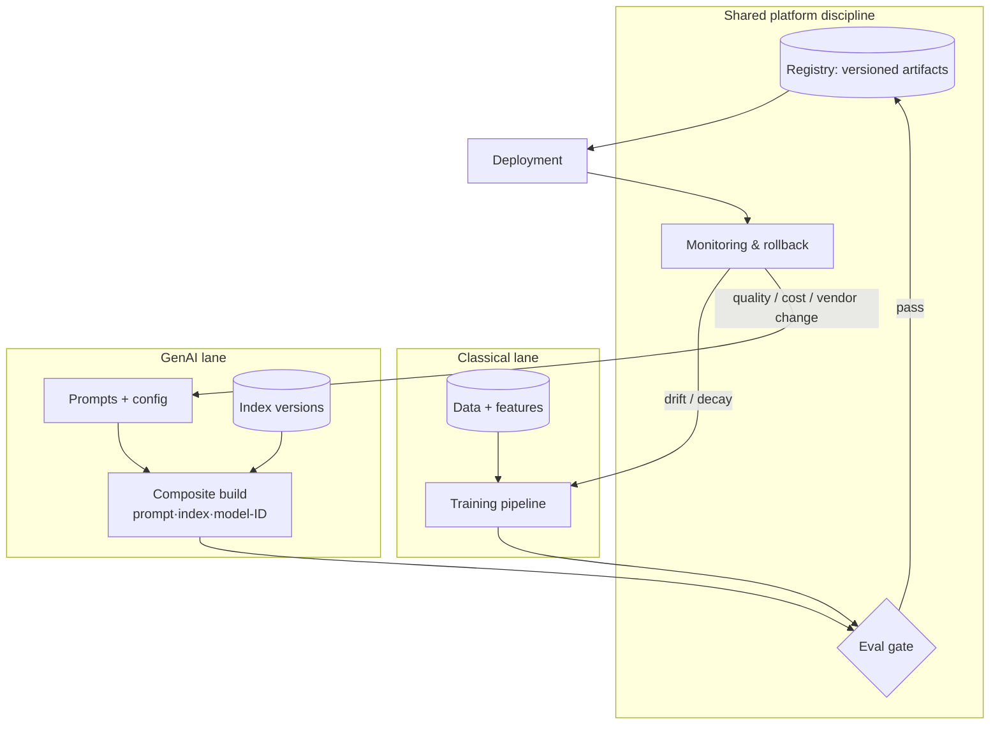

# Chapter 2.10 — MLOps and LLMOps: One Discipline, Two Lifecycles

| | |
|---|---|
| **Part** | 2 — Artificial Intelligence |
| **Maturity level** | 3 — Engineer |
| **Difficulty** | Intermediate |
| **Estimated study time** | 3 hours (reading 90 min, exercise 90 min) |
| **Prerequisites** | [2.9](chapter-09-classical-ml-system-design.md); [2.7](chapter-07-evaluating-ml-systems.md) |

## Learning Objectives

After this chapter you will be able to:

1. Draw both lifecycles — the classical MLOps loop and the LLMOps loop — and identify which artifacts are versioned, promoted, and rolled back in each.
2. Explain the central inversion: classical ML changes the *model* while prompts stay trivial; GenAI changes *prompts, retrieval, and orchestration* while the model stays frozen.
3. Map the shared discipline (versioning, eval gates, monitoring, rollback) across both, so one platform team can govern both families.
4. Decide, for a given organization, what operational tooling is genuinely needed versus platform theater.

## Introduction

Chapter 2.9 ended with pipelines, drift, and champion–challenger promotion — the operational discipline called **MLOps**. Parts 4–5 will teach the GenAI equivalent, now commonly called **LLMOps**. This chapter puts them side by side *once*, because architects who know only one keep making a predictable mistake: applying the wrong lifecycle to the other family — demanding training pipelines for systems that train nothing, or shipping prompt changes with no evaluation gate because "it's just text."

The deeper point is reassuring: it is **one discipline** — version everything that affects behavior, gate promotion on evaluation, monitor in production, keep rollback cheap — instantiated over two different sets of artifacts. Learn the discipline once; apply it twice.

## Business Motivation

Operational maturity is where AI budgets go to die or compound. Industry surveys have repeatedly found that a large fraction of ML models never reach production, and the dominant causes are operational (deployment, integration, monitoring), not modeling. On the GenAI side the failure is faster and more public: an unversioned prompt edit shipped straight to production changes behavior for every user instantly — one Friday-afternoon "small wording tweak" to a support assistant's system prompt can, for example, silently break its refusal behavior and generate a weekend of escalations, with no record of what changed or ability to roll back. An organization that can answer *"what exactly is running in production, what changed last Tuesday, and how do we get back to Monday?"* for both model families avoids both failure modes. That answer is what this chapter builds.

## Theory

### The two lifecycles

**Classical MLOps loop** (2.9's system, named): data snapshot → features → **train** → evaluate vs champion → register → deploy (batch/online) → monitor (drift, decay) → *retrain trigger* → repeat. The center of gravity is the **training pipeline**; the versioned unit is *data + features + model artifact*; change arrives on a cadence of weeks; the expensive step is training and validation.

**LLMOps loop** (previewing Parts 4–5): the model is a frozen vendor artifact — nothing is trained. The behavior-bearing artifacts are everything *around* it: system prompts and templates, retrieval configuration (chunking, embedding model, index version — 3.5/3.6), tool definitions and orchestration logic, model choice and parameters, guardrail configs. The loop: change any of those → run the **eval harness** (golden sets, judges — 4.7) → promote → deploy → monitor (quality, cost, safety) → repeat. Change arrives on a cadence of *hours*; the expensive step is evaluation, because output is open-ended language (2.7's generation-metrics problem).

### The inversion

| | Classical MLOps | LLMOps |
|---|---|---|
| The model | Yours; retrained regularly | Vendor's; frozen, occasionally *swapped* |
| Behavior lives in | Weights + features | Prompts + retrieval + orchestration |
| Versioned unit | Data + features + model | Prompt + config + index + model-ID (the *composite*) |
| Quality gate | Metrics vs champion on holdout | Eval harness: golden sets + judges |
| Drift means | Input/label distributions shift | Corpus staleness, usage shift, *silent vendor model updates* |
| Rollback | Previous model artifact | Previous composite config |
| Marginal cost center | Training compute | Inference tokens + evaluation |

Two consequences deserve emphasis. First, **model swap risk is the LLMOps analogue of retraining**: when a vendor deprecates a model version, every prompt and few-shot example was implicitly tuned to the old one — a swap is a full regression event requiring the complete eval harness, not a config edit. Second, **the composite is the deployable**: promoting a prompt v12 evaluated against index v3 into production running index v4 is an untested deployment, even though "nothing changed."

### The shared discipline

Across both: (1) *version every behavior-bearing artifact* — weights or wording, no difference in principle; (2) *no promotion without an evaluation gate* — champion–challenger and golden-set CI are the same idea; (3) *monitor the three layers* — system, distribution/drift, outcome quality; (4) *rollback must be one step* — a registry pointer flip or a config revert. An organization that has internalized these four for one family adopts the other family in weeks, not quarters. One that has internalized neither will fail at both — which is the honest diagnostic for "are we ready for GenAI?"

## Architecture Perspective

Where this sits organizationally: a **platform capability**, not a per-team reinvention — the registry, eval-gate pattern, and monitoring stack should be shared even though the lanes differ (Part 6 returns to this as governance; 5.x builds the GenAI lane in depth). What it forces on your designs: every project in this curriculum's [projects track](../../projects/) must declare its versioned composite and its gate — the [deployment checklist](../../checklists/deployment-checklist.md) encodes this.

## Real-world Example

**Kaveri Logistics** (fictional) ran a mature demand-forecasting practice (classical lane: weekly retrains, champion–challenger, drift alerts) and then launched a customer-service RAG assistant by a different team with none of that discipline — prompts edited in a dashboard, no golden set, no config history. Month 1: a prompt tweak to reduce verbosity also removed the grounding clause (3.6); hallucinated delivery promises followed; nobody could say what changed. The fix was not new tooling but *borrowed* discipline: prompts moved to git, a 150-question golden set gated merges, the retrieval index got version tags, and the composite (prompt SHA + index tag + model ID) became the deployable. Incident rate dropped to near zero; mean time to diagnose behavior changes fell from days to minutes — `git log` answered it. Total platform addition: one CI job and a config file.

## Hands-on Exercise

Take your Chapter 2.9 churn system and your Chapter 3.6 RAG exercise (or any small RAG build) and put both under one operational regime: a single `REGISTRY.md` (or lightweight registry) listing, for each, its current production version and full composite; an eval gate for each (champion comparison script for churn; a 25-question golden set with pass-threshold for RAG); and a rollback drill.

**Acceptance criteria:**
- [ ] Both systems' behavior-bearing artifacts are enumerated and versioned — nothing that changes behavior lives outside version control
- [ ] A deliberately bad change to each (a leaky feature; a de-grounded prompt) is *caught by the gate*, not by inspection
- [ ] Rollback of each is demonstrated in one step, and you can state what the step was
- [ ] A half-page memo: which parts of the two regimes turned out identical, and which genuinely differ

## Enterprise Considerations

Audit and model-risk regimes (2.8, 4.14) increasingly ask the same evidence for both families: what ran, when, evaluated how, approved by whom — the composite registry *is* that evidence. Vendor lock-in inverts across lanes: classical lock-in lives in pipelines and feature stores (2.9); GenAI lock-in lives in prompts tuned to a model and provider-specific tool formats — the eval harness is your portability insurance, because it prices a migration in an afternoon. Procurement note: "LLMOps platforms" are a crowded vendor category; the checklist above is the requirements filter — most organizations need git, a CI eval job, config-as-code deployment, and dashboards before they need any dedicated platform.

## Trade-offs

| Decision | Option A | Option B | Choose A when… | Choose B when… |
|----------|----------|----------|----------------|----------------|
| Ops platform | Extend existing DevOps (git + CI + config) | Dedicated ML/LLMOps product | Teams are small; discipline is the gap | Many teams/models; registry & lineage at scale |
| Prompt management | Prompts in git, deployed as config | Prompt-management SaaS | Engineering owns prompts | Non-engineers iterate prompts daily (still gate!) |
| Eval gating | Blocking CI gate | Advisory dashboards | Behavior changes ship to users | Early exploration, internal-only |
| Model upgrades | Pinned versions, deliberate swaps | Auto-track "latest" | Production, regulated, or tuned prompts | Throwaway prototypes only |

## Common Mistakes

1. **Prompt changes treated as copy edits** — shipped without evaluation because "it's just text." Prompts are behavior; gate them like code.
2. **Demanding training-lane tooling for GenAI** — months procuring feature stores and training pipelines for systems that train nothing. Map the artifacts first (the inversion table), then tool.
3. **Versioning the prompt but not the composite** — prompt v12 "passed evals" against an index that no longer exists in production. Promote composites, not components.
4. **Trusting vendor model stability** — treating a hosted model as a constant; pinned-version discipline and swap-regression drills are the mitigation.
5. **Two teams, two disciplines** — classical and GenAI ops built separately, doubling cost and splitting audit evidence. Share the registry, the gate pattern, and the dashboards.

## Best Practices

1. **Everything that changes behavior is versioned** — the one-sentence summary of both lifecycles.
2. **The composite is the deployable** — promote (prompt, config, index, model-ID) tuples in GenAI; (data, features, model) tuples in classical.
3. **Gates block, dashboards inform** — an evaluation that cannot stop a deployment is decoration.
4. **Pin model versions; rehearse swaps** — run the full harness against the successor *before* the deprecation date, on your schedule.
5. **Borrow maturity across lanes** — whichever lifecycle your organization runs well is the template; port the habits, not the tools.

## Architecture Checklist

Before signing off a design touching this topic:

- [ ] Behavior-bearing artifacts enumerated for the system's lane; each versioned; composite defined
- [ ] Promotion gate specified: what evaluation, what threshold, what it blocks
- [ ] Rollback path is one step and has been exercised, not just documented
- [ ] Monitoring covers system, drift (or staleness/usage shift), and outcome quality, with owners
- [ ] Model version pinned; upgrade/swap treated as a regression event with a rehearsal plan
- [ ] Ops evidence (what ran, when, evaluated how) is producible for audit without archaeology

## Interview Questions

1. Compare MLOps and LLMOps — *strong answers give the inversion (train-the-model vs freeze-the-model-change-the-surroundings), the composite-versioning consequence, and the shared four-part discipline, rather than tool name-dropping.*
2. A GenAI assistant's behavior changed in production and no deployment occurred. Enumerate causes. — *strong answers list vendor model update (unpinned), index refresh under a fixed prompt, config edited outside version control, traffic/usage shift, and upstream tool changes — and note that composite versioning eliminates the first three.*
3. What does "rollback" mean for a RAG system? — *strong answers roll back the composite and flag the hard case: the index, whose previous versions must be retained or reproducible.*
4. Your company runs excellent classical MLOps. What transfers to GenAI and what must be built new? — *strong answers transfer the discipline (registry, gates, monitoring, rollback) and build new the eval harness for open-ended output and prompt/config-as-code flow.*

## Further Reading

- Google Cloud's MLOps maturity-levels documentation — the canonical vocabulary for classical pipeline maturity (levels 0–2); short and load-bearing.
- Your model vendor's versioning and deprecation policy pages (e.g., Anthropic and OpenAI official docs) — read the actual deprecation windows; they set your swap-rehearsal calendar.
- Microsoft Learn's LLMOps guidance — a provider's articulation of the GenAI lane; useful as a checklist to argue with.
- MLflow official documentation (tracking + registry concepts) — one concrete open-source registry to make "versioned artifact" tangible, for both lanes.

## Summary

- MLOps and LLMOps are one discipline — version, gate, monitor, rollback — over two artifact sets.
- The inversion: classical retrains a model behind stable code; GenAI freezes the model and changes prompts, retrieval, and orchestration around it.
- The versioned, promotable, rollback-able unit in GenAI is the *composite*: prompt + config + index + model-ID.
- Vendor model swaps are regression events; pin versions and rehearse.
- Gates must block; unversioned behavior is the root cause behind "it changed and nobody knows why."
- Whichever lane your organization already runs well is the maturity template for the other — port habits, not tools.

---

**Previous:** [2.9 Classical ML System Design](chapter-09-classical-ml-system-design.md) · **Next:** [2.11 Choosing the Right AI Approach](chapter-11-choosing-the-right-ai-approach.md) · **Related:** [2.7 Evaluating ML Systems](chapter-07-evaluating-ml-systems.md), Part 4 (evaluation & production), Part 5 (LLMOps in depth)
