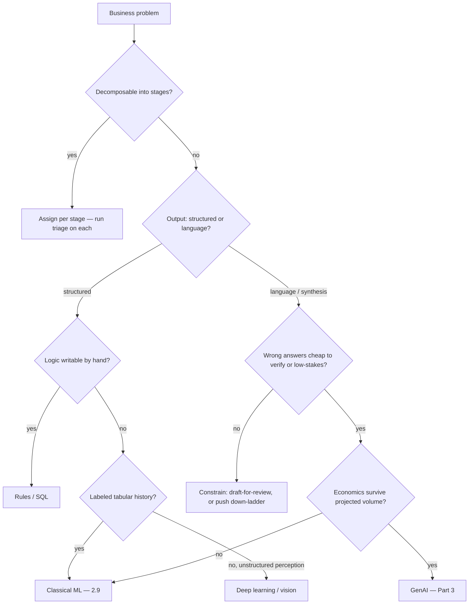

# Chapter 2.11 — Choosing the Right AI Approach

| | |
|---|---|
| **Part** | 2 — Artificial Intelligence |
| **Maturity level** | 4 — Architect |
| **Difficulty** | Intermediate |
| **Estimated study time** | 3 hours (reading 75 min, exercise 90 min) |
| **Prerequisites** | [2.2](chapter-02-machine-learning-fundamentals.md); [2.9](chapter-09-classical-ml-system-design.md); usefully revisited after Part 3 |

## Learning Objectives

After this chapter you will be able to:

1. Run a business problem through the five-question triage — decision shape, data shape, error tolerance, explainability demand, and economics — and land on rules, classical ML, deep learning, GenAI, a hybrid, or *no AI*.
2. Articulate, for any proposed LLM use, what specifically the LLM contributes that a cheaper rung of the ladder cannot — and reject the proposal when the answer is "nothing."
3. Decompose real enterprise problems into stages and assign the right approach *per stage* (the hybrid pattern that dominates real systems).
4. Defend an approach choice in writing — a one-page decision memo a CTO, a security board, and a finance team can each audit.

## Introduction

This is the chapter that most distinguishes an **AI Solution Architect** from a GenAI specialist. Parts 3–7 teach you to design LLM systems well; this chapter teaches you to decide *whether the LLM should be in the design at all*. It sits at the end of Part 2 because it needs everything before it — the problem families of 2.9, the operational costs of 2.10, the evaluation discipline of 2.7 — and it is deliberately placed *before* Part 3: you should carry this skepticism into the GenAI material, not bolt it on afterwards.

The failure this chapter prevents has a name in every enterprise that lived through 2023–2025: **LLM-shaped hammers**. Demand forecasting "with GenAI." Fraud detection "with agents." A chatbot in front of a lookup table. Each is a real pattern the author-persona of this curriculum has watched burn budget — not because LLMs failed, but because the problem was never a language problem.

## Business Motivation

The cost of misdiagnosis compounds through the whole lifecycle. Take one concrete shape: a lender routes loan-default risk scoring — tabular data, a yes/no decision, a regulator demanding reasons — to an LLM. Inference costs land 100–1000× above a gradient-boosted tree's (2.9). Accuracy is *worse*: the LLM pattern-matches on text serializations of features rather than learning from ten years of labeled outcomes. Explainability collapses from "here are the feature attributions" to a generated rationale no model-risk auditor will accept (2.8). And the operational regime (2.10) is the expensive open-ended-evaluation one instead of the boring metrics one. Four losses, one wrong fork. The reverse error also bills: teams hand-building brittle NLP pipelines — regex intent classifiers, template answers — for genuinely linguistic problems an LLM now solves in a week. Architects earn their title at this fork; everything downstream is execution.

## Theory

### The capability ladder

Order approaches by cost, determinism, and explainability — and spend down the ladder only when the problem forces you:

1. **Rules / lookup / SQL** — deterministic, free, fully auditable. If the logic can be written down, write it down.
2. **Classical ML** (2.9) — learns a mapping from *structured historical data* to a *structured outcome*. Needs labels; yields calibrated scores and attributions.
3. **Deep learning (task-specific)** — earns its complexity on *unstructured perception*: vision, audio, OCR. Usually consumed as a pretrained/vendor model, occasionally fine-tuned.
4. **GenAI / LLMs** (Part 3) — earns its cost on *language and synthesis*: understanding messy human input, generating fluent output, transforming across formats, orchestrating tools against instructions. Probabilistic; expensive per call; evaluation is the hard part (2.7, 4.7).
5. **Hybrid** — stages of one problem assigned to different rungs. Not a compromise: the *dominant* architecture of real enterprise systems, because real problems arrive as mixtures.

The architect's prime directive: **the cheapest rung that meets the requirement wins.** Every rung you climb must be paid for by something the lower rung demonstrably cannot do.

### The five-question triage

**Q1 — Decision shape.** Is the output a *structured value* (number, class, ranked list) or *language/synthesis* (explanation, draft, extraction from prose, dialogue)? Structured → rungs 1–3. Language → rung 4 becomes a candidate — a candidate, not a verdict.

**Q2 — Data shape.** Tabular history with labels → classical ML is purpose-built (2.9). Images/audio → rung 3. Documents, tickets, transcripts, conversations → the LLM's home turf (3.1). Mixed → decompose (see hybrids).

**Q3 — Error tolerance and verifiability.** What does one wrong answer cost, and can wrongness be *checked cheaply*? High-stakes + hard-to-verify output is the worst posture for probabilistic generation (3.1's verify-cheap logic); prefer deterministic rungs, or constrain the LLM to draft-for-human-review (P02's pattern). High tolerance or cheap verification opens the ladder.

**Q4 — Explainability demand.** Regulator-grade reasons (credit, insurance, employment — 2.8) → rungs 1–2, where attributions are real. A generated explanation is a *plausible narrative*, not an audit artifact — never present it as one.

**Q5 — Economics at volume.** Price per decision × decisions per day, honestly, including evaluation and ops (2.10). A ₹0.40 LLM call is invisible at 100 calls/day and a ₹1.2 crore/month line item at 10M. High-volume, low-value-per-decision workloads belong low on the ladder; low-volume, high-value synthesis (a contract review, an incident brief) justifies the top rung easily.

### Hybrids: decompose, then assign

Real problems are pipelines; the framework applies **per stage**. Canonical example — insurance claims intake: *documents arrive* (rung 3: OCR/vision extracts fields) → *risk scoring* (rung 2: GBT on extracted + historical tabular features) → *routing* (rung 1: thresholds and rules) → *customer communication* (rung 4: LLM drafts the status letter, grounded in the case record, human-approved for edge cases). Four stages, four rungs, one system — and each stage carries its own evaluation regime and failure modes. Monolithic "just have an agent do the claim" designs collapse the stages and inherit the worst properties of each. Project [P22](../../projects/p22-hybrid-claims-intake/) builds exactly this.

### Anti-patterns, named

- **LLM as calculator/database** — asking generation to do arithmetic or recall enterprise facts from weights (2.6's sorting rule: computation → tools, knowledge → retrieval).
- **Chatbot in front of a form** — a deterministic workflow (check balance, book slot) wrapped in open dialogue; slower for users, new failure surface, no new capability.
- **Forecasting with vibes** — time-series prediction via LLM; no access to the numeric history's structure, unbeatable by rung-2 baselines, at 1000× cost.
- **Agent where a pipeline suffices** (previewing 3.8/4.5) — dynamic planning loops for a fixed 4-step process; every step of nondeterminism must be bought by genuine variability in the task.
- **Prompt-engineered classification with abundant labels** — 50k labeled examples sitting unused while a prompt is tuned; rung 2 is cheaper, faster, calibrated, and boring. (Legitimate exception: LLM as *cold-start* classifier before labels exist — with a planned migration down the ladder.)

## Architecture Perspective

Note what the diagram encodes: GenAI is reached by *surviving* four filters, not by default. In system designs, the choice surfaces as a boundary decision — which components are deterministic, which are learned, which are generative — and 2.10 attaches a different operational lane to each. In your ADRs ([templates](../../templates/)), the approach choice is the first recorded decision, with the triage answers as its rationale; the [architecture review checklist](../../checklists/) should ask for it explicitly.

## Real-world Example

**Suvarna Retail** (fictional, 400 stores) asked for "GenAI demand forecasting" after a competitor's press release. The architect ran the triage in the first workshop: output is numeric per SKU-store-week (Q1: structured); five years of labeled sales history exist (Q2: tabular); errors are tolerable but *costed* in stockouts (Q3); merchandisers demand drivers, not prose (Q4); 2M forecasts/week (Q5: LLM economics absurd). Verdict: rung 2 — GBT forecaster with lag/seasonality features, beating the incumbent heuristic by 14% MAPE. The genuinely linguistic need surfaced in the same workshop from a different question — "why did we miss last week?" — and became a *separate, small* rung-4 system: an LLM that drafts a weekly variance narrative grounded in the forecaster's own outputs and promo calendar, read by 40 planners (low volume, cheap verification, high synthesis value). Two right-sized systems, ₹35 lakh under the original single-system budget, and a client who now trusts the architect's "no."

## Hands-on Exercise

Collect five AI use cases from your own organization or industry (mix obvious and contested ones). For each, run the five-question triage in writing and produce a **one-page decision memo**: recommended approach, the triage answers as rationale, the strongest case *for the rung above* and why it loses, cost-per-decision estimate at realistic volume, and the evaluation regime the choice commits you to (2.7/2.10). At least one case must resolve to a hybrid with per-stage assignments, and at least one to "rules / no AI."

**Acceptance criteria:**
- [ ] Five memos, each fitting one page, each auditable by a non-ML executive
- [ ] Every GenAI recommendation names what the LLM contributes that rung ≤3 cannot
- [ ] Every rejection of GenAI survives the strongest pro-LLM argument, stated fairly
- [ ] The hybrid case shows a stage diagram with a rung and an eval regime per stage
- [ ] Cost math is shown at projected volume, not pilot volume

## Enterprise Considerations

Governance regimes price the rungs differently: EU-AI-Act-style obligations (2.8) attach to *use cases* (credit, employment, biometrics) regardless of rung, but evidence burden is far cheaper to carry on rungs 1–2 — an underrated reason to stay low in regulated flows. Procurement pressure runs the other way: vendors and boards arrive LLM-first, and "GenAI" line items get funded while "logistic regression" does not — architects sometimes must *package* a hybrid honestly (the GenAI stage is real) without letting funding fashion redesign the system. Skills reality: rungs 2–3 need data-science capacity your organization may lack; a triage verdict the org cannot staff is a build-vs-buy decision (Part 6), not a redesign. Record all of it in the ADR — approach choices re-litigate forever without one.

## Trade-offs

| Decision | Option A | Option B | Choose A when… | Choose B when… |
|----------|----------|----------|----------------|----------------|
| Classification approach | Classical ML on labels | LLM prompt-based | Labels are abundant; volume high; calibration matters | Cold start, no labels, long-tail classes — with a migration plan |
| Uncertain fit | Prototype on the LLM rung fast | Build the down-ladder system first | Feasibility itself is the question; weeks matter | Requirement is clear; volume economics already decide |
| Mixed problem | Hybrid, per-stage assignment | Single-approach monolith | Stages differ in shape/stakes (usual case) | Genuinely uniform problem (rare — prove it) |
| Explanation need | Attributions from rungs 1–2 | LLM-generated narrative | Audit/regulatory consumption | Human-comfort consumption, clearly labeled as narrative |

## Common Mistakes

1. **Starting from the technology** — "where can we use GenAI?" inverts the triage and manufactures the anti-patterns. Start from decisions the business makes.
2. **Pilot-volume economics** — approving Q5 at 200 calls/day for a workload heading to 2M. Price the destination.
3. **Accepting generated rationales as explainability** — a fluent paragraph is not an attribution; auditors know the difference even when demos blur it.
4. **The false binary** — "LLM or nothing," skipping rules and classical ML entirely; the ladder has five rungs and the cheapest sufficient one wins.
5. **Never revisiting the verdict** — triage answers move (labels accumulate, model prices fall ~10× across recent years, volumes grow). Date-stamp the ADR and re-run at meaningful deltas — including *down*-migrations from LLM cold-starts.

## Best Practices

1. **Baseline before you climb** — a rules or logistic baseline is a day's work and converts approach debates into measured lift (2.9's discipline, generalized).
2. **Make "what does the LLM add?" a standing review question** — one sentence, specific, or the design descends a rung.
3. **Decompose by default** — stage diagrams before approach choices; assignment follows shape.
4. **Write the memo** — one page, five answers, cost math, eval commitment; the memo is the deliverable that separates architecture from opinion.
5. **Hold the "no" kindly** — pair every rejected GenAI proposal with the right-sized alternative *and* a genuine rung-4 opportunity elsewhere; skeptics who only say no stop being invited to the fork.

## Architecture Checklist

Before signing off a design touching this topic:

- [ ] The five triage answers are recorded in the ADR, with the decision date
- [ ] The chosen rung beats the rung below on a stated requirement, not a preference
- [ ] Any GenAI component's specific contribution is stated in one sentence
- [ ] Cost per decision is computed at projected volume, including evaluation and ops (2.10)
- [ ] Regulated flows: explainability evidence is attribution-grade where required
- [ ] Hybrid designs: every stage has its own rung, eval regime, and failure-mode note
- [ ] A revisit trigger is defined (volume ×10, labels available, price shift, regulation change)

## Interview Questions

1. A product VP wants "AI-powered fraud detection using GenAI." Walk your response. — *strong answers run the triage aloud (structured output, labeled tabular history, high volume → classical ML), locate the genuine GenAI slice if any (analyst case-summarization), and end with the memo, not a lecture.*
2. When is an LLM the right classifier? — *strong answers: no labels yet, long-tail or evolving classes, natural-language inputs, low volume — plus the migration-down-the-ladder plan once labels accumulate.*
3. Design document processing for 50k invoices/day. — *strong answers decompose: OCR/vision extraction → rules/validation → classical anomaly scoring → LLM only for exception narratives or messy free-text fields — with per-stage evals and the cost math that forbids LLM-per-invoice.*
4. What changed in this decision between 2023 and today, and what didn't? — *strong answers: prices fell and capabilities rose (Q5 thresholds moved; more language tasks clear Q3), but the triage structure, the labels-beat-prompts rule at volume, and the explainability line did not move.*

## Further Reading

- Google's "Rules of Machine Learning," Rule #1 ("Don't be afraid to launch a product without machine learning") — the down-ladder instinct, from the team that could afford any rung.
- Your model vendor's published pricing pages (Anthropic, OpenAI, Google official docs) — re-derive Q5 for one of your memos with live numbers; prices move, so bookmark rather than memorize.
- EU AI Act official summary (European Commission) — the use-case-based obligation structure behind Q4's regulatory line.
- Chapter [3.1](../part-3-core-building-blocks-of-genai/chapter-01-llm-capabilities-limits.md) — read it as this chapter's mirror: what LLMs are genuinely for.

## Summary

- Five rungs — rules, classical ML, deep learning, GenAI, hybrid — and the cheapest rung that meets the requirement wins.
- Five questions — decision shape, data shape, error tolerance/verifiability, explainability, economics at volume — settle the rung; record them in an ADR.
- Real problems decompose; hybrids with per-stage assignment are the dominant honest architecture, not a fallback.
- The named anti-patterns (LLM-as-database, chatbot-in-front-of-a-form, forecasting-with-vibes, agent-where-pipeline, prompts-despite-labels) are diagnosable in one meeting with this framework.
- Explainability: attributions are evidence; generated rationales are narrative — regulated flows need the former.
- The verdict has a shelf life — re-run the triage when volume, labels, prices, or regulation move; migrations go down the ladder as often as up.

---

**Previous:** [2.10 MLOps and LLMOps](chapter-10-mlops-vs-llmops.md) · **Next:** [Part 3 — Core Building Blocks of Generative AI](../part-3-core-building-blocks-of-genai/) · **Related:** [2.9 Classical ML System Design](chapter-09-classical-ml-system-design.md), [3.1 LLM Capabilities & Limits](../part-3-core-building-blocks-of-genai/chapter-01-llm-capabilities-limits.md), [P21](../../projects/p21-churn-prediction-service/), [P22](../../projects/p22-hybrid-claims-intake/)
