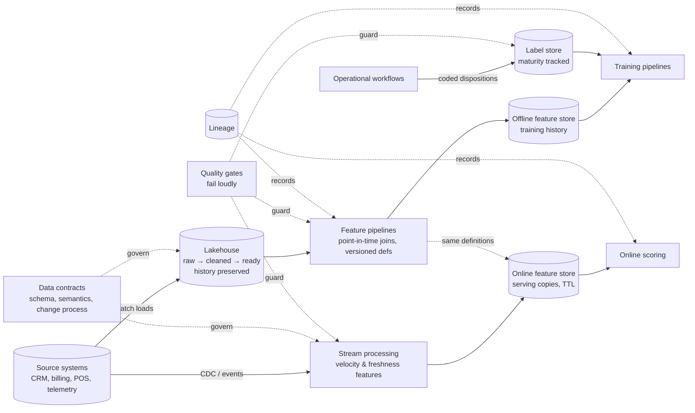

# Chapter 2.12 — Data Engineering & Feature Platforms for ML

| | |
|---|---|
| **Part** | 2 — Artificial Intelligence |
| **Maturity level** | 3 — Engineer |
| **Difficulty** | Advanced |
| **Estimated study time** | 4 hours (reading 2 h, exercise 2 h) |
| **Prerequisites** | [2.2](chapter-02-machine-learning-fundamentals.md); [2.9](chapter-09-classical-ml-system-design.md) |

## Learning Objectives

After this chapter you will be able to:

1. Map the ML data estate — lakehouse layers, warehouse, streams, and the feature/label/training stores that sit on them — and place each ML workload's reads and writes on that map.
2. Design feature pipelines that are point-in-time correct by construction, and choose the training–serving consistency mechanism (shared code path vs. feature store) that matches the team's scale.
3. Design labeling pipelines and data contracts as first-class system components — the parts that determine whether the model can learn and keep learning.
4. Run data quality as an engineering discipline: gates that fail loudly, lineage that answers "what fed this score?", and freshness SLOs per feature.

## Introduction

Chapter 2.9 said the model is ~10% of a classical ML system and the system is the rest. This chapter is about the biggest slice of the rest: the data engineering underneath. In practice this is where AI Solution Architects spend the largest share of their design time — not choosing models, but deciding how operational data becomes trustworthy features, how outcomes become labels, and how both stay correct as source systems change under them. GenAI architects have a parallel discipline (the corpus and ingestion work of [4.3](../part-4-enterprise-genai-systems/chapter-03-document-ingestion.md) and [5.5](../part-5-cloud-infrastructure-platform/chapter-05-data-architecture.md)); this chapter covers the estate those chapters deliberately skip — the *feature and label* estate that trained models live on.

The through-line: **every hard problem in this chapter is a consistency problem across time or across environments.** Point-in-time correctness is consistency across time (train on what you knew then). Training–serving parity is consistency across environments (compute the same feature the same way twice). Data contracts are consistency across team boundaries. Get the consistency mechanisms right and the rest is plumbing; get them wrong and you ship models that ace backtests and fail quietly in production ([2.9](chapter-09-classical-ml-system-design.md)'s leakage, now with its engineering countermeasures).

## Business Motivation

The business case for data-platform investment is invisible until it isn't. Bellhaven Insurance ran four models built by three teams; each team hand-rolled its own "customer tenure" and "claims in last 12 months" features against production replicas. The bill arrived in three currencies: **duplicated effort** (three implementations of the same twenty features, each subtly different), **silent disagreement** (the retention model and the cross-sell model disagreed about who was a long-tenure customer — reconciling that consumed a quarter's analytics capacity), and **an incident** (a source-system migration changed a date format; two of the three pipelines noticed, the third fed a mispriced-renewal model for five weeks — ~$800K of mispricing before a downstream KPI review caught it). None of these costs appears in a model-project budget, all of them are data-platform failures, and the architect who prices only "the model" will approve the next one. The positive case is compounding: the second model on a shared, gated, point-in-time-correct platform costs a fraction of the first — the amortization logic that Part 5 applies to GenAI platforms ([5.10](../part-5-cloud-infrastructure-platform/chapter-10-iac-platform-engineering.md)) starts here, years earlier, in the feature estate.

## Theory

### The ML data estate

Four storage roles matter to ML, whatever products implement them:

| Role | Holds | ML's relationship to it |
|---|---|---|
| **Lake / lakehouse** | Raw and refined operational history (commonly layered raw → cleaned → business-ready, the "medallion" idiom) | Where training data is assembled; where point-in-time reconstruction happens |
| **Warehouse** | Governed, aggregated business truth | Source for slowly-changing business features; where model outputs land for analysts |
| **Streams** | Events in motion (transactions, telemetry, clicks) | Source for fresh features (velocity counters); the only way to hit single-digit-ms feature freshness |
| **ML-specific stores** | Feature store (offline + online), label store, model registry, training snapshots | The consistency machinery this chapter designs |

Two flows feed the estate: **batch ingestion** (scheduled loads — sufficient for most features, [2.9](chapter-09-classical-ml-system-design.md)'s batch-by-default extended upstream) and **change data capture / event streams** (the operational system's changes as they happen — required when feature freshness is measured in seconds or minutes, as in fraud velocity features — [CS52](../../case-studies/cs52-card-fraud-scoring.md)). The architect's discipline: freshness is a *per-feature requirement derived from the decision cadence*, not a platform-wide aspiration. A churn model consuming week-old aggregates and a fraud model consuming 5-second velocity counters can — should — share an estate without sharing a freshness SLO.

### Point-in-time correctness, engineered

2.9 named the rule; here is the mechanism. A training row for entity *E* at prediction date *t* must join features computed from data *as it was known at t*. Three engineering realities break naive implementations:

- **Late-arriving data** — POS corrections land 48 hours later; chargebacks land in month two. The pipeline must reconstruct "known as of *t*" from event timestamps, not current table state ([CS51](../../case-studies/cs51-demand-forecasting-replenishment.md)).
- **Backfilled and mutated fields** — operational teams update records in place ("complaint resolution date" filled in days later — Varuna's V2 leak in [2.9](chapter-09-classical-ml-system-design.md)). Snapshot or CDC history is the only defense; a table that overwrites its past cannot train honest models.
- **Slowly changing dimensions** — the customer's segment *today* is not their segment last March. Point-in-time joins against dimension history, not current dimensions.

The test an architect asks of any training pipeline: *"replay a training row from six months ago — byte-identical?"* If the answer requires caveats, the backtests are fiction to some unknown degree.

### Training–serving consistency: shared code path vs. feature store

The feature computed offline for training must equal the feature computed online at inference. Two mechanisms, one decision:

- **Shared code path** — one feature module invoked by both the training pipeline and the scorer. Cheap, honest, sufficient for *one team, few models, batch serving* — P21's explicit choice, recorded as an ADR there.
- **Feature store** — a platform component with an offline store (training history, point-in-time join support) and an online store (low-latency serving copies), plus registration, backfill, and TTL machinery. It earns its complexity when any of these arrive: **many models sharing features** across teams (the reuse is the point), **online serving** (somebody must maintain the serving copies and their parity), or **streaming features** (the offline/online split becomes genuinely hard). 

The trap between them: *reimplementation* — a features notebook for training and a hand-written SQL for serving, drifting apart from day one. That is not a third option; it is the failure mode both mechanisms exist to prevent. The decision is reversible if feature *definitions* are code under version control from the start — the migration to a store is then a re-homing, not a rewrite.

### Labels and data contracts

**The label pipeline is a data product with the same engineering standards as features.** Its design questions come from 2.9 (source, lag, action bias); its engineering is: disposition capture built into the operational workflow (the claim outcome, the alert disposition, the override reason — captured as coded fields, not free text, at the moment of action — [CS53](../../case-studies/cs53-predictive-maintenance.md)'s disposition taxonomy); label maturity tracking (a label's arrival lag recorded so evaluation windows are honest); and provenance (which workflow version, which human, which instruction set produced this label — [CS24](../../case-studies/cs24-ediscovery-triage.md)'s labeler QC generalized).

**Data contracts** are the boundary discipline: an explicit, versioned agreement between a source system's owners and its ML consumers — schema, semantics, freshness, and a change process. The contract's value is organizational, not technical: it converts "the upstream team broke our model silently" into "the upstream team has a named obligation, and changes arrive as versioned proposals." Without contracts, every source migration is a potential Bellhaven incident; with them, breakage becomes a managed event. The GenAI estate rediscovers this as corpus freshness and ingestion contracts ([4.3](../part-4-enterprise-genai-systems/chapter-03-document-ingestion.md)); the ML estate needs it first and harder, because feature semantics are subtler than document formats.

### Data quality as an engineering discipline

Three mechanisms, in order of leverage:

1. **Gates** — assertions on every batch and stream (completeness, ranges, category validity, volume vs. expectation, schema conformance) that **fail loudly**: block the training run, quarantine the batch, page the owner. The design sin is silent tolerance — imputing or dropping bad data at scale without an alert converts data incidents into model mysteries.
2. **Lineage** — the ability to answer "what data fed this score?" and its inverse "which models consume this table?" — the first for debugging and audit ([CS55](../../case-studies/cs55-credit-risk-scoring-mrm.md)'s replayable decisions), the second for change-impact analysis (the contract's enforcement arm).
3. **Freshness monitoring** — per-feature staleness against its SLO, because a stale feature is a *silently wrong* feature: the pipeline runs green while serving yesterday's world ([CS52](../../case-studies/cs52-card-fraud-scoring.md)'s feature-freshness breach degrading exactly during attack bursts).

And one meta-rule from the case corpus: **check the instrument before accusing the world** — a fleet-wide feature shift is usually an upstream change, not a simultaneous change in reality ([CS53](../../case-studies/cs53-predictive-maintenance.md)/[CS56](../../case-studies/cs56-network-anomaly-detection.md)). Build the triage order into the runbook.

## Architecture Perspective

What this couples to: the operational estate upstream (through contracts) and every model of [2.9](chapter-09-classical-ml-system-design.md)'s four families downstream. What it forces: feature definitions as versioned code, history-preserving storage (you cannot be point-in-time correct on a table that overwrites its past), and label capture inside the operational workflow rather than bolted on after. What it makes cheap: the *second* model — which is the entire economic argument.

## Real-world Example

**Varuna Telecom** (8M subscribers, the operator of [2.9](chapter-09-classical-ml-system-design.md) and [CS56](../../case-studies/cs56-network-anomaly-detection.md)) reached three production models — churn, collections risk, and network-fault ranking — built by three teams. An architecture review found seventeen "customer activity" features implemented five different ways, two point-in-time violations (one inflating churn backtests by 6 AUC points), and no lineage: when billing migrated CRM vendors, nobody could list which models the migration would touch. The consolidation: one feature platform (offline store on the existing lakehouse; online store only for the collections model, the single online consumer), feature definitions moved into a shared versioned repository with owners, contracts signed with billing and CRM, and gates on every feed. Cost: two data engineers for two quarters plus ~₹9 lakh/month platform run-rate. Return, measured a year later: the fourth model (upsell propensity) shipped in five weeks instead of the historical two quarters — feature reuse covered 70% of its inputs — and the *next* source migration was a planned contract change with an impact list, not an incident. The review's conclusion, worth quoting in memos: "we had three model projects and zero platform; the platform was hiding inside all three, done badly, three times."

## Hands-on Exercise

Extend your 2.9 churn exercise into a mini feature platform. Restructure so that: (1) all features live in one versioned module with an owner comment and a point-in-time note per feature; (2) the training pipeline and the batch scorer import that module — delete any duplicated feature logic; (3) add two quality gates (row-volume vs. expectation; category-validity on one column) that *fail the run* and print an actionable message; (4) add one "late-arriving data" simulation — inject corrected records with event timestamps and show the training set reconstructs as-of correctly; (5) write a one-page platform memo: what a second model (collections) would reuse, what it would add, and when a feature store would earn its complexity here.

**Acceptance criteria:**
- [ ] One feature module; zero duplicated feature logic between training and scoring
- [ ] A corrupted batch is *blocked* by a gate with a message naming the failing check and the owner
- [ ] The late-data simulation produces a training set identical to what would have been known at prediction time (show the diff against the naive join)
- [ ] Feature definitions are versioned; you can name what changed between two versions
- [ ] The platform memo states the reuse economics for model #2 and the feature-store trigger conditions

## Enterprise Considerations

Governance meets this chapter head-on: data residency applies to *features and labels*, not just raw sources; retention and deletion obligations propagate into training snapshots (the right-to-be-forgotten reaches datasets — [4.14](../part-4-enterprise-genai-systems/chapter-14-privacy-compliance-governance.md)); and feature-level permissible-use review is a legal control in regulated scoring ([CS55](../../case-studies/cs55-credit-risk-scoring-mrm.md), [6.7](../part-6-enterprise-architecture/chapter-07-data-governance-knowledge.md)'s ownership discipline applied to the feature estate). Vendor angle: every cloud sells this stack (lakehouse + feature store + pipelines); the lock-in lives in pipeline and feature *definitions*, so keeping those in portable code is the exit strategy — the platform is replaceable, the definitions are the asset. Org reality: this chapter is a *team topology* question as much as a technical one — feature ownership without a named data-engineering owner decays into abandonware ([2.9](chapter-09-classical-ml-system-design.md)'s six-month warning), and the platform-vs-embedded staffing choice below is usually the real decision under review.

## Trade-offs

| Decision | Option A | Option B | Choose A when… | Choose B when… |
|----------|----------|----------|----------------|----------------|
| Consistency mechanism | Shared feature code path | Feature store platform | One team, few models, batch serving (P21) | Cross-team reuse, online serving, or streaming features |
| Feature freshness | Batch (hours/days) | Streaming (seconds) | Decision cadence tolerates staleness — most models | The decision is in-request and the signal is recent behavior (fraud velocity) |
| Estate shape | Warehouse-first | Lakehouse-first | Features derive from governed business aggregates; strong BI estate exists | Raw history, unstructured mix, heavy reconstruction needs |
| Data-eng staffing | Embedded in the ML team | Central platform team | One or two models; speed matters most | Many teams; contracts, gates, and lineage need one owner |

## Common Mistakes

1. **The irreproducible training set** — training data assembled by ad-hoc SQL nobody can re-run. Every reported metric becomes unverifiable. The snapshot-and-version discipline (2.9) starts with the *query*.
2. **Consistency by reimplementation** — training features in a notebook, serving features in hand-written service code, "kept in sync" by diligence. They drift by the second sprint; skew debugging then consumes more than the shared module would have cost.
3. **Backfills that rewrite history** — operational corrections applied in place destroy point-in-time reconstruction. If the platform cannot answer "what did this row say on March 3rd," it cannot train honest models.
4. **Quality checks only at ingestion** — data validated entering the lake, then transformed four times unguarded. Gates belong at every boundary that changes semantics, and especially before training and scoring.
5. **Labels as an afterthought** — the model project scopes features and training, and assumes labels "exist in the warehouse." They exist unowned, uncoded, and lagged. Design the label pipeline with the prediction pipeline or the system cannot improve (2.9's rule, now with an engineering owner).

## Best Practices

1. **Feature definitions are code: versioned, owned, reviewed** — whatever executes them (shared module or store), the definitions live in one governed place.
2. **Preserve history at the storage layer** — append or CDC, never overwrite-in-place, for anything feeding training. Point-in-time correctness is a storage property before it is a pipeline property.
3. **Gate loudly at every semantic boundary** — a blocked run with a named owner beats a trained model on quiet garbage, every time.
4. **Contract the upstream** — schema + semantics + freshness + change process, versioned, with the source team's name on it. Convert silent breakage into managed change.
5. **Design for the second model** — reuse is the platform's ROI; every feature added should be findable, documented, and computable by the next team ([1.7](../part-1-professional-foundation/chapter-07-estimation.md)'s estimation discipline will price the difference).

## Architecture Checklist

Before signing off a design touching this topic:

- [ ] Training-set assembly is a versioned, re-runnable pipeline against history-preserving storage
- [ ] Every feature has an owner, a point-in-time justification, and one governed definition
- [ ] Training–serving consistency mechanism named (shared path vs. store) with the trigger conditions for revisiting it
- [ ] Per-feature freshness requirement derived from the decision cadence; monitored against SLO
- [ ] Label pipeline designed: capture point in the workflow, coded dispositions, maturity tracking, provenance
- [ ] Data contracts exist for every upstream source, with a change process
- [ ] Quality gates at every semantic boundary; failures block and page, never silently impute
- [ ] Lineage answers both "what fed this score?" and "which models does this table feed?"

## Interview Questions

1. Your churn model's offline AUC is 0.91; the deployed version performs like 0.79. Walk me through your investigation. — *Strong answers go upstream in order: training–serving skew (reimplemented features), point-in-time violations in the training set, then drift — and name the parity check and replay test as the instruments, before touching the model.*
2. When does a feature store earn its complexity over a shared feature module? — *Strong answers give the three triggers (cross-team reuse, online serving, streaming features), note P21-style single-team cases where it doesn't, and make the migration cheap by versioning definitions from day one.*
3. Design the data platform for a bank that wants churn, fraud, and collections models within 18 months. — *Strong answers design for the second and third model (shared features, contracts, gates), split freshness per model (fraud streaming, others batch), and place labels and lineage as first-class components — before naming any vendor.*
4. A source-system migration is announced. What does a mature ML data platform do that an immature one cannot? — *Strong answers describe lineage-driven impact lists, contract change proposals, parallel-run validation through gates, and a planned cutover — versus discovering the migration via drift alerts (or worse, KPI erosion) weeks later.*

## Further Reading

- *Designing Data-Intensive Applications* (Kleppmann) — the storage, streaming, and consistency foundations this chapter stands on; chapters on batch and stream processing especially.
- Google's "Rules of Machine Learning" (official developer docs) — rules on pipelines, skew, and launching; the system-first canon.
- Feast documentation (open-source feature store) — read the concepts section to make offline/online stores, point-in-time joins, and TTL concrete, provider-neutrally.
- Great Expectations documentation (or your platform's data-quality tooling) — what production-grade gates look like in practice.

## Summary

- The ML data estate is the biggest slice of "the system around the model": lakehouse + streams + feature/label stores, joined by consistency machinery.
- Every hard problem here is a consistency problem — across time (point-in-time), environments (training–serving), or teams (contracts).
- Feature definitions are versioned, owned code; the shared-path-vs-feature-store choice follows team scale and serving needs, and stays reversible if definitions are governed from day one.
- The label pipeline is a designed data product — capture point, coded dispositions, maturity, provenance — not an assumption about the warehouse.
- Quality gates fail loudly at every semantic boundary; lineage answers both directions; freshness is per-feature, derived from the decision cadence.
- The platform's ROI is the second model — design for reuse, and price the platform into the first model's business case honestly.

---

**Previous:** [2.11 Choosing the Right AI Approach](chapter-11-choosing-the-right-ai-approach.md) · **Next:** [2.13 Forecasting Systems](chapter-13-forecasting-systems.md) · **Related:** [2.9 Classical ML System Design](chapter-09-classical-ml-system-design.md), [5.5 Data Architecture](../part-5-cloud-infrastructure-platform/chapter-05-data-architecture.md), [6.7 Data Governance](../part-6-enterprise-architecture/chapter-07-data-governance-knowledge.md), [CS51](../../case-studies/cs51-demand-forecasting-replenishment.md), [CS52](../../case-studies/cs52-card-fraud-scoring.md)
