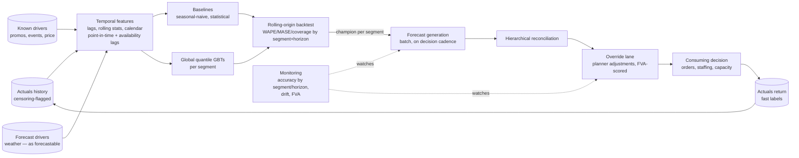

# Chapter 2.13 — Forecasting Systems

| | |
|---|---|
| **Part** | 2 — Artificial Intelligence |
| **Maturity level** | 3 — Engineer |
| **Difficulty** | Advanced |
| **Estimated study time** | 4 hours (reading 2 h, exercise 2 h) |
| **Prerequisites** | [2.7](chapter-07-evaluating-ml-systems.md); [2.9](chapter-09-classical-ml-system-design.md); [2.12](chapter-12-data-engineering-feature-platforms.md) |

## Learning Objectives

After this chapter you will be able to:

1. Frame a forecasting problem completely — horizon, granularity, hierarchy, cadence, exogenous drivers, and the decision that consumes the forecast — before any method is discussed.
2. Climb the forecasting methods ladder baseline-first: naive and seasonal-naive floors, statistical per-series models, gradient-boosted trees with temporal features as the enterprise workhorse, and the narrow cases where specialized deep forecasters earn their complexity.
3. Evaluate forecasts honestly: rolling-origin backtesting, scale-appropriate metrics (WAPE/MASE, and why plain MAPE misleads), prediction-interval calibration, and segment-level reporting.
4. Design the production system: batch cadence, hierarchical reconciliation, cold start, censoring, event calendars, and the governance of human overrides (forecast value added).

## Introduction

Forecasting received nine words in [2.9](chapter-09-classical-ml-system-design.md)'s family table; it deserves a chapter because it is architecturally *different* from the other classical families, not just another target column. Time makes everything conditional: evaluation must respect temporal order or it lies; features must respect what was knowable *and forecastable* at prediction time (a subtlety beyond 2.9's leakage rule — see the weather trap below); the output is usually a *distribution* consumed by an inventory or capacity calculation, not a point consumed by a human; and the incumbent competitor is not "no model" but a planner's judgment plus a spreadsheet — an incumbent that is sometimes genuinely good.

The through-line: **a forecast is an input to a decision under uncertainty, and the decision shapes every design choice** — horizon and granularity come from the decision's lead time and unit of action; the point-vs-probabilistic question comes from whether the decision is asymmetric (almost always); and the accuracy bar comes from what the decision loses per unit of error, not from leaderboard aesthetics ([2.11](chapter-11-choosing-the-right-ai-approach.md)'s "forecasting-with-vibes" anti-pattern has a mirror image: forecasting-with-precision-nobody-uses).

## Business Motivation

Forecast error is one of the few model errors with a direct line item. Under-forecast demand: stockouts, lost sales, expediting ([CS51](../../case-studies/cs51-demand-forecasting-replenishment.md)'s ₹22 crore/month). Over-forecast: waste, markdowns, idle capacity (₹14 crore/month, same case). Corvid Logistics — the running example below — staffs depots against predicted parcel volume: 8% systematic over-forecast is ~₹2.1 crore/year of idle staffing across 40 depots; the same under-forecast is missed same-day SLAs and contractual penalties. This is also the family where enterprises most often *already pay for forecasts* (planners, S&OP processes, vendor modules), so the business case is usually incremental: beat the incumbent process by enough to matter, prove it with the incumbent as the baseline, and count the planner hours the system redeploys. The architect's advantage over the pure data scientist: knowing that the deliverable is a better *decision loop* — forecast → order/staffing decision → outcome → learning — not a better curve.

## Theory

### Framing: six questions before any method

1. **Decision** — what consumes the forecast, with what lead time, at what unit? (Depot staffing needs depot×day, two weeks out; replenishment needs SKU×store×day, 1–14 days out.) The forecast spec is derived, not chosen.
2. **Horizon & cadence** — how far ahead, refreshed how often. Error grows with horizon; the system should report accuracy *by horizon step*, because "the model is 12% WAPE" is meaningless without "at day 7."
3. **Granularity & hierarchy** — forecasts at SKU×store roll up to store, region, and category totals that *other* consumers read. Incoherent levels (SKUs summing to ≠ the store forecast) destroy trust; reconciliation (below) is the fix.
4. **Seasonality layers** — weekly, monthly, annual, and calendar events (festivals, paydays, promotions). Multiple overlapping seasonalities are the norm, not the exception.
5. **Exogenous drivers** — promotions, price, weather, holidays. The critical split: drivers *known in advance* (planned promotions, calendar) vs. drivers *themselves forecast* (weather). Using **actual** future weather in a backtest is leakage of a subtle kind — production will only have the weather *forecast*; the backtest must use what would have been forecastable, or it inflates exactly the driver-dependent accuracy the business is buying.
6. **Data pathologies** — intermittent series (mostly zeros: spare parts, long-tail SKUs), short histories (new items — cold start), and **censoring** (recorded sales ≠ demand when stocked out; recorded volume ≠ demand when capacity-capped — [CS51](../../case-studies/cs51-demand-forecasting-replenishment.md)'s central trap).

### The methods ladder

Climb only as far as backtests justify ([2.9](chapter-09-classical-ml-system-design.md)'s baseline-first rule, at its most binding):

1. **Naive and seasonal-naive** — tomorrow = today; next Tuesday = last Tuesday. Not straw men: on stable series these are genuinely hard to beat, and they are the denominators of honest metrics (MASE) and honest business cases.
2. **Per-series statistical models** (exponential smoothing / ARIMA-class) — capture level, trend, and seasonality per series cheaply and interpretably. Strong when series are long, stable, and driver-light. Thousands of tiny models, embarrassingly parallel.
3. **Global GBT models with temporal features** — one model per segment across many series, with lag features, rolling statistics, calendar and event features, and series identity. The enterprise workhorse ([2.9](chapter-09-classical-ml-system-design.md)'s tabular observation extended in time): it learns across series (helping short-history ones), ingests drivers naturally, and outputs quantiles via quantile objectives. The M-competition era's consistent finding: well-featured global ML beats per-series statistics on large heterogeneous collections — *and* loses to seasonal-naive on the stablest slices, which is why segment reporting decides where each rung serves ([CS51](../../case-studies/cs51-demand-forecasting-replenishment.md)'s hybrid).
4. **Specialized deep / foundation forecasters** — earn consideration at very large scale with complex shared patterns, or when a pretrained forecaster's zero-shot start beats cold-starting your own. Treat exactly like rung 3→4 anywhere else ([2.11](chapter-11-choosing-the-right-ai-approach.md)): demand a backtested win over the GBT, priced.

**Probabilistic by default**: any forecast feeding an inventory, staffing, or capacity decision should ship prediction intervals (quantile regression at the needed quantiles is the pragmatic route). The consuming decision is asymmetric — the newsvendor logic lives downstream — and **interval calibration** (do 90% intervals contain ~90% of actuals, per segment?) becomes a first-class eval, because the decision consumes the interval, not the point.

### Honest evaluation

- **Rolling-origin backtesting** — train up to time *t*, forecast *t+1…t+h*, roll forward, repeat. The *only* honest protocol; random CV shuffles the future into training ([2.7](chapter-07-evaluating-ml-systems.md)'s leakage, temporal edition). The backtest must replay the production information set: data-availability lags (2.12), forecast-not-actual drivers, and the actual retraining cadence.
- **Metrics** — **WAPE** (weighted absolute percentage error: robust aggregate, weights big series appropriately); **MASE** (scaled to seasonal-naive: >1 means *worse than naive* — the most honest single number); plain **MAPE** misleads on small and intermittent series (division by near-zero explodes; zero actuals undefined) — ban it where zeros live. **Pinball/quantile loss and coverage** for intervals. Always **by segment and by horizon step**; the aggregate hides both where the model earns and where naive wins.
- **Forecast value added (FVA)** — measure each stage of the forecasting *process* (statistical baseline → model → human override) against the stage before it. Planner overrides that subtract accuracy are the norm, not the exception, in unexamined processes; FVA converts that from an opinion fight into a measurement, and is the governance instrument for the override lane.

### The production system

The system shape follows [2.9](chapter-09-classical-ml-system-design.md) and [CS51](../../case-studies/cs51-demand-forecasting-replenishment.md): batch by default (forecasts are consumed on the decision cadence), the feature/data machinery of 2.12 underneath (point-in-time with availability lags, event calendars as governed reference data, censoring flags), plus the forecasting-specific components: **reconciliation** (make hierarchy levels cohere — bottom-up, top-down, or optimal-combination; the architectural point is that *someone must own coherence* or finance and operations argue about whose number is real); **cold start** (attribute-based analogues until history accrues); **retraining cadence** matched to drift speed and label arrival (forecasting's mercy: actuals arrive fast — days, not months — making it the most forgiving classical family to operate, and a good *first* system for a team building ML muscle); and the **override lane** (planner adjustments captured, attributed, and FVA-scored — the human channel measured like any other model, [CS55](../../case-studies/cs55-credit-risk-scoring-mrm.md)'s lesson in a friendlier domain).

## Architecture Perspective

What is distinctive versus 2.9's generic diagram: the *two kinds* of driver inputs (known vs. forecast — the leakage boundary runs between them), the champion chosen *per segment* (the ladder serves different rungs to different slices), reconciliation as an owned step, and the override lane inside the measured system rather than after it. What it forces: backtests that replay the production information set, and an actuals loop fast enough to make weekly accuracy review meaningful.

## Real-world Example

**Corvid Logistics** (fictional, 40 depots, ~1.1M parcels/day) forecast depot×day volume for staffing, two weeks out. The incumbent: regional planners adjusting last year's numbers — and the first honest measurement showed the planners beating a naive baseline by 4% WAPE, a real incumbent. V1, a global GBT with lag/calendar features, beat seasonal-naive by 14% in backtest but *only matched the planners* in production for one embarrassing quarter — diagnosis: the backtest had used actual weather (leakage of the forecastable-driver kind); rebuilt against archived weather *forecasts*, the honest edge over planners was 6% WAPE, concentrated in event weeks and new-service-area depots. The FVA program then reshaped the process rather than the model: planner overrides helped in the two weeks around known disruptions (strikes, extreme weather — information the model lacked) and *subtracted* accuracy elsewhere; overrides were re-scoped to exception lanes with reasons, cutting override volume 70%. Money: ~6% WAPE improvement ≈ ₹1.3 crore/year in staffing efficiency plus measured SLA-penalty reduction, against a platform run-rate under ₹10 lakh/month on the existing 2.12 estate. The architecture lesson Corvid's review recorded: *the model was the easy third; the honest backtest and the override governance were where the value hid.*

## Hands-on Exercise

On a public multi-series retail dataset (M5 or similar): (1) build seasonal-naive and per-series exponential-smoothing baselines; (2) build one global GBT with ≥6 temporal features (lags, rolling means, day-of-week, month, event flags) and quantile outputs (P10/P50/P90); (3) evaluate with rolling-origin backtesting — at least 6 origins — reporting WAPE and MASE **by segment (volume tercile) and by horizon step (1, 7, 14)**, plus P10–P90 coverage; (4) deliberately create the weather-trap: add a "future actual" feature, show the backtest improvement, then remove it and write two sentences on why production could never have it; (5) write the one-page memo: which segments the GBT serves, which stay on naive/statistical, the interval the consuming decision should use, and the FVA question you would ask of any human override lane.

**Acceptance criteria:**
- [ ] MASE reported; you can state which segments are *worse than naive* and what you did about it
- [ ] Rolling-origin protocol implemented (no random splits anywhere); origins and windows documented
- [ ] P10–P90 coverage within 80–95% per volume tercile, or the miscalibration is diagnosed in the memo
- [ ] The leakage demonstration shows the inflated vs. honest delta explicitly
- [ ] The memo assigns champions per segment and derives the interval choice from the decision's asymmetry

## Enterprise Considerations

Forecasting is usually *organizationally owned* before it is ML-owned: S&OP processes, planner teams, and vendor demand-planning modules are incumbents with stakeholders — the architecture includes the process redesign, and FVA is the negotiation instrument that lets planners keep the lanes where they demonstrably add value ([1.6](../part-1-professional-foundation/chapter-06-requirements-stakeholders.md)'s stakeholder discipline applies more here than anywhere else in classical ML). Finance consumes forecasts too: revenue and cash-flow forecasts carry disclosure sensitivities, and a "forecast" that reaches investors is a governed artifact ([6.9](../part-6-enterprise-architecture/chapter-09-architecture-governance.md)). Build-vs-buy is live: demand-planning suites bundle rung-2 methods with workflow — the honest comparison is your rungs 1–3 *plus 2.12's estate* against their black box plus their workflow, evaluated on your backtest, not their brochure. And forecasting's fast label loop makes it the recommended *first* classical system for an organization building the 2.9/2.10 operating muscle — the same monitoring habits transfer to slower-labeled domains with the training wheels off.

## Trade-offs

| Decision | Option A | Option B | Choose A when… | Choose B when… |
|----------|----------|----------|----------------|----------------|
| Model scope | Per-series statistical | Global ML (GBT) | Long stable histories, few drivers, interpretability per series | Many heterogeneous series, shared patterns, rich drivers, short histories |
| Output | Point forecast | Probabilistic (quantiles) | Forecast is directional context for humans | A calculation consumes it (orders, staffing) — the usual case |
| Reconciliation | Bottom-up | Top-down / optimal combination | Bottom level is well-behaved; detail is where signal lives | Bottom is noisy/intermittent; aggregate stability matters most |
| Retraining | Scheduled (weekly/monthly) | Trigger-based (drift/decay) | Stable seasonality, cheap training — the default here | Fast regime changes; monitored decay between schedules |

## Common Mistakes

1. **Random cross-validation on time series** — the future leaks into training and every metric inflates. Rolling-origin or it isn't a backtest.
2. **The forecastable-driver trap** — backtesting with *actual* future weather/traffic/prices that production will only have as forecasts. Subtler than 2.9's leakage and endemic; replay the information set, including archived driver *forecasts*.
3. **MAPE on intermittent series** — division by near-zero actuals makes long-tail SKUs dominate or break the metric; conclusions invert. Use WAPE/MASE; report zeros-heavy segments separately.
4. **Treating sales as demand** — censored actuals (stockouts, capacity caps) teach the model to repeat the shortage ([CS51](../../case-studies/cs51-demand-forecasting-replenishment.md)). Flag censored periods; estimate uncensored demand or exclude deliberately.
5. **Point forecasts into asymmetric decisions** — the consumer needed P85 for the order calculation and got P50, so someone re-invents safety stock by folklore downstream. Ship calibrated quantiles and let the decision choose its point on the distribution.
6. **Ungoverned override lanes** — planner adjustments applied invisibly on top of the model, unmeasured. FVA-score every stage or the process quietly returns to vibes.

## Best Practices

1. **Seasonal-naive is a permanent resident** — it runs forever, in production, as the honesty floor; MASE keeps everyone honest about beating it ([CS51](../../case-studies/cs51-demand-forecasting-replenishment.md)).
2. **Report by segment × horizon, decide per segment** — champions are assigned where they win; a third of the estate on naive is a *finding*, not a failure.
3. **Calibrate intervals like they're the product** — because they are: the decision consumes the quantile.
4. **Replay the production information set in every backtest** — availability lags, forecast drivers, actual retraining cadence. The backtest is a simulation of operating the system, not of having been clairvoyant.
5. **Run FVA from day one** — it defends the model where it earns, defends the planners where *they* earn, and converts the override argument into a dashboard.

## Architecture Checklist

Before signing off a design touching this topic:

- [ ] The consuming decision, lead time, and action unit are written down; horizon/granularity/cadence derived from them
- [ ] Baselines (seasonal-naive + statistical) implemented first and kept running; MASE reported
- [ ] Backtest is rolling-origin and replays the production information set (availability lags, forecast-not-actual drivers)
- [ ] Metrics scale-appropriate (WAPE/MASE, not bare MAPE); reported by segment and horizon step
- [ ] Probabilistic output with coverage-tested intervals wherever a calculation consumes the forecast
- [ ] Censoring identified and handled; event/promotion calendars are governed reference data (2.12)
- [ ] Hierarchy reconciliation owned; one coherent set of numbers across levels
- [ ] Cold-start path for new series; override lane captured, attributed, and FVA-scored

## Interview Questions

1. Design a demand-forecasting system for a 1,500-store grocer. — *Strong answers derive the spec from the replenishment decision, establish seasonal-naive floors, propose segment-scoped global GBTs with quantile outputs, name stockout censoring and interval calibration, and put reconciliation and the batch window in the architecture — before any model tuning talk.*
2. Your forecast beats the baseline by 15% in backtest but doesn't move business results. List hypotheses in order. — *Strong answers: backtest leaked the information set (forecastable drivers, availability lags); the consuming decision ignores or overrides the forecast (FVA unmeasured); the gain sits in segments the decision doesn't act on; intervals miscalibrated so orders were wrong despite good points.*
3. When is plain MAPE the wrong metric, and what do you use instead? — *Strong answers: near-zero and intermittent actuals (explodes/undefined), asymmetric weighting of small series; WAPE for aggregates, MASE against seasonal-naive for honesty, quantile loss and coverage for probabilistic output.*
4. The planners say the model "doesn't understand our region" and want override rights. Respond as the architect. — *Strong answers grant a measured override lane, propose FVA scoring of every stage, predict (correctly) that overrides will win near known disruptions and lose elsewhere, and re-scope the lane to exceptions-with-reasons — process design, not a modeling argument.*

## Further Reading

- Hyndman & Athanasopoulos, *Forecasting: Principles and Practice* (free online, fpp3) — the canonical text: exponential smoothing, ARIMA, hierarchical reconciliation, and evaluation, all with worked code.
- The M5 competition papers and findings (International Journal of Forecasting) — the empirical record for global-ML-vs-statistical on large retail hierarchies, and where each wins.
- Nixtla's statsforecast/mlforecast documentation — modern, fast open-source baselines; the quickest route to honest rung-1/2 floors at scale.
- Your demand-planning vendor's methodology documentation (if one is incumbent) — read it before the build-vs-buy meeting; the comparison must be method-level, not brochure-level.

## Summary

- A forecast is an input to a decision under uncertainty; horizon, granularity, cadence, and the probabilistic question are all *derived* from that decision.
- Climb the ladder baseline-first: seasonal-naive floors → per-series statistical → global quantile GBTs (the workhorse) → specialized forecasters only on backtested, priced wins; assign champions per segment.
- Honest evaluation is rolling-origin, scale-appropriate (WAPE/MASE), by segment × horizon, with interval coverage tested — and the backtest must replay the production information set, including drivers as *forecasts*.
- Censoring, cold start, event calendars, and reconciliation are the system's real design surface; the 2.12 estate carries them.
- Human overrides are part of the measured system: FVA scores every stage of the process, and re-scopes rather than wins arguments.
- Fast labels make forecasting the most forgiving classical family to operate — the right first system for building the 2.9/2.10 muscle.

---

**Previous:** [2.12 Data Engineering & Feature Platforms for ML](chapter-12-data-engineering-feature-platforms.md) · **Next:** [Part 3 — Core Building Blocks of Generative AI](../part-3-core-building-blocks-of-genai/) · **Related:** [2.9 Classical ML System Design](chapter-09-classical-ml-system-design.md), [2.7 Evaluating ML Systems](chapter-07-evaluating-ml-systems.md), [CS51 Demand Forecasting](../../case-studies/cs51-demand-forecasting-replenishment.md), [2.11 Choosing the Right AI Approach](chapter-11-choosing-the-right-ai-approach.md)
