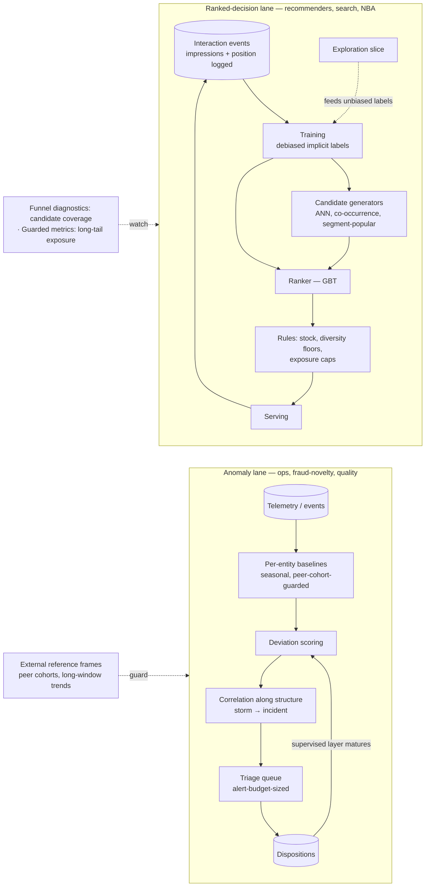

# Chapter 2.14 — Ranking, Recommenders & Anomaly Detection

| | |
|---|---|
| **Part** | 2 — Artificial Intelligence |
| **Maturity level** | 3 — Engineer |
| **Difficulty** | Advanced |
| **Estimated study time** | 4 hours (reading 2 h, exercise 2 h) |
| **Prerequisites** | [2.7](chapter-07-evaluating-ml-systems.md); [2.9](chapter-09-classical-ml-system-design.md); [2.12](chapter-12-data-engineering-feature-platforms.md) |

## Learning Objectives

After this chapter you will be able to:

1. Design two-stage ranking systems (candidate generation → ranking → rules) driven by implicit feedback, with the logging and debiasing that make implicit signals trainable.
2. Evaluate ranking honestly: offline metrics (recall@k, NDCG, coverage) as candidate filters, online experiments as the release gate, and the offline–online gap as a standing assumption.
3. Design anomaly detection when labels are scarce: learned baselines with external reference frames, alert budgets as the operating point, and the correlation/triage layer where the value concentrates.
4. Recognize and manage the hazard both families share — feedback loops, where the system trains on a world its own outputs shaped — and apply exploration as the standing antidote.

## Introduction

This chapter completes [2.9](chapter-09-classical-ml-system-design.md)'s problem-family table. Ranking/recommendation got five words there ("two-stage retrieve-then-rank"); anomaly detection wasn't in the table at all. They share a chapter for a structural reason: **both are systems that act on their own information diet.** A recommender is mostly trained on interactions with items *it chose to show*; an anomaly detector's baselines are learned from a stream *its own alerts cause operators to change*. In both, the naive build works impressively for a quarter and then quietly converges on its own reflection — the popularity loop in one case, sick-as-normal baselines in the other. The design discipline that prevents it — log what was shown, correct for position and exposure, keep an exploration budget, keep an external reference frame — is the chapter's real subject; the models are almost incidental.

They also share machinery with the GenAI estate: candidate generation runs on the same embedding-and-ANN infrastructure as RAG retrieval ([3.5](../part-3-core-building-blocks-of-genai/chapter-05-embeddings-semantic-search.md), [5.6](../part-5-cloud-infrastructure-platform/chapter-06-vector-search-infrastructure.md)) — [2.9](chapter-09-classical-ml-system-design.md)'s "ancestor of the retrieval funnel" runs in both directions, and an architect who knows one owns half of the other.

## Business Motivation

Ranking is where classical ML touches revenue most directly: recommendations drive 10–30% of sales at mature e-commerce operations, search ranking decides whether the catalog is findable at all, and next-best-action ranking is the monetization layer of most CRM estates. The money is real and so is the trap: engagement-optimized ranking without guarded metrics degrades the ecosystem it feeds on — [CS54](../../case-studies/cs54-product-recommendations.md)'s long-tail collapse cost ~0.3% short-term conversion to prevent and would have cost the marketplace's seller base to ignore. Anomaly detection's business case is asymmetric loss avoidance: fraud rings, failing machines, degrading networks, and billing errors all announce themselves as deviations *before* they announce themselves as losses — [CS56](../../case-studies/cs56-network-anomaly-detection.md) prices one hour of faster incident identification at ~$1.9M/year; [CS53](../../case-studies/cs53-predictive-maintenance.md) funds two years of platform from one avoided line-stop. In both families, the binding constraint is human attention — a shopper's screen, an operator's shift — and the architect's job is to spend that attention well, not to maximize a model metric ([2.7](chapter-07-evaluating-ml-systems.md)'s operating-point discipline, with attention as the budget).

## Theory

### Ranking: the two-stage funnel

One model cannot score two million items per request; the funnel is the answer everywhere it appears (recommendations, search, ads, next-best-action):

1. **Candidate generation** — cheap, high-recall retrieval of a few hundred plausible items from the full catalog: embedding similarity (ANN), co-occurrence ("bought together"), popularity-by-segment, and business sources (new arrivals, promotions). Multiple generators run in parallel; their union is the candidate set. This is retrieval engineering — [5.6](../part-5-cloud-infrastructure-platform/chapter-06-vector-search-infrastructure.md)'s infrastructure with product embeddings.
2. **Ranking** — an expensive, precise model (typically a GBT — [2.9](chapter-09-classical-ml-system-design.md)'s workhorse again) scores each candidate with user, item, context, and cross features.
3. **Business rules after the ranker** — stock, eligibility, diversity floors, exposure caps: deterministic constraints that must hold *exactly*, kept out of the model ([2.11](chapter-11-choosing-the-right-ai-approach.md)'s rung-1 in its proper place).

**Diagnostic discipline**: instrument the funnel so failures localize — *candidate coverage* (was the item the user eventually chose even in the candidate set?) separates retrieval misses from ranking misses. Teams that can't answer that question re-tune the wrong stage for a quarter ([CS54](../../case-studies/cs54-product-recommendations.md); the same localize-before-fixing rule as [3.5](../part-3-core-building-blocks-of-genai/chapter-05-embeddings-semantic-search.md)'s retrieval taxonomy).

### Implicit feedback and its biases

Nobody rates things; they click, dwell, add-to-cart, buy, skip. Implicit signals are abundant and systematically biased, and the biases are design inputs:

- **Position bias** — rank-1 items get clicked partly *because* they're rank-1. Log position at impression time (or it is unrecoverable) and debias when treating impressions-without-clicks as negatives.
- **Exposure bias** — users can only interact with what was shown; unshown items are unlabeled, not unwanted (the ranking twin of [CS30](../../case-studies/cs30-subrogation-opportunity-detection.md)'s censoring).
- **The popularity feedback loop** — popular items get shown, get interactions, get ranked higher, get shown more. Left alone, the catalog collapses onto its head. Countermeasures are architectural: an **exploration slice** of traffic (randomized or uncertainty-favoring exposure — the label diet the model cannot generate for itself), **coverage and long-tail exposure as guarded metrics**, and diversity floors in the rules layer.
- **Cold start** — new items ride content features (attributes, category, embeddings from descriptions); new users ride segment priors that update within-session. Both are permanent populations, not launch problems ([CS45](../../case-studies/cs45-learning-development-recommender.md)'s regime, where structure substitutes for scale entirely).

### Evaluating ranking: offline filters, online gates

Offline: **recall@k** for candidate generation (its whole job); **NDCG/MAP** for ranking quality; **coverage/diversity** for ecosystem health. These *select challengers*. The **release gate is an online experiment** — conversion or task-success per session with guardrails — because the offline–online gap is structural, not occasional: offline metrics score agreement with *logged* (biased) behavior, and a model can improve NDCG by predicting what users would have done anyway (zero incrementality — [CS54](../../case-studies/cs54-product-recommendations.md)'s +6%-offline model losing to control online). Chapter 2.17 will treat experimentation fully; the rule to carry now: **never ship a ranker on offline metrics alone.**

### Anomaly detection: the label-reality decision

The first question is [2.11](chapter-11-choosing-the-right-ai-approach.md)'s data-shape question in miniature: *what labels exist?*

- **Labels rich** (fraud with chargeback history): supervised classification — this is [2.9](chapter-09-classical-ml-system-design.md)/[CS52](../../case-studies/cs52-card-fraud-scoring.md) territory, not this section.
- **Labels scarce or absent** (new attack patterns, equipment failures, ops telemetry): **unsupervised baselines** — model each entity's *normal* (seasonality-aware statistical baselines, density/isolation methods on feature vectors) and score deviation. Covers the whole fleet on day one with zero labels ([CS53](../../case-studies/cs53-predictive-maintenance.md), [CS56](../../case-studies/cs56-network-anomaly-detection.md)).
- **The hybrid that ships**: unsupervised detection everywhere + a **supervised layer where dispositions accrue** — ranking alerts, or full classifiers for entity classes whose label history matures. The boundary moves as the label store grows; design the disposition taxonomy *before* the first model so it does ([CS53](../../case-studies/cs53-predictive-maintenance.md)'s label factory).

Three disciplines make detection deployable:

1. **The alert budget is the operating point** — thresholds derive from triage capacity (3 alerts/plant/day; 40 incidents/shift), then precision is improved *within* that budget. Recall-first tuning floods the queue and gets the system switched off — trust, once spent on false alarms, does not refund ([CS53](../../case-studies/cs53-predictive-maintenance.md)'s re-launch lesson).
2. **External reference frames** — self-referential adaptive baselines learn slow degradation as normal. Guard with long-window trends and *peer cohorts* (this entity vs. same-class entities under similar load — [CS56](../../case-studies/cs56-network-anomaly-detection.md)'s rule: adaptive normality always needs an external reference).
3. **Correlation and triage are where the value is** — raw anomaly scores at scale *increase* operator load; grouping deviations along structure (topology, asset hierarchy, causal ordering) into ranked, evidenced incidents is the product. Detection is the easy third ([CS56](../../case-studies/cs56-network-anomaly-detection.md)).

And the triage rule both families of case studies converged on: **a fleet-wide simultaneous anomaly is an upstream data change until proven otherwise** — check the instrument before accusing the world ([2.12](chapter-12-data-engineering-feature-platforms.md)'s meta-rule, now a runbook line).

## Architecture Perspective

The two lanes mirror each other: both close a loop through their own outputs (serving → events → training; alerts → operator action → telemetry), and both carry a deliberately *non-optimized* channel (exploration slice; ranking floor for high-magnitude novel anomalies) that keeps the loop honest. That non-optimized channel is the signature of a mature design in this chapter — its absence is the reflection-convergence failure in both families.

## Real-world Example

**Loomora** ([CS54](../../case-studies/cs54-product-recommendations.md)'s marketplace) hit a plateau: home-page recommendation conversion flat for two quarters despite three ranker upgrades. The funnel diagnostics told the story the model metrics couldn't: candidate coverage — *was the eventually-purchased item even in the 500 candidates?* — was 61% and falling, concentrated in newer catalog categories. The ranker had been blamed for a retrieval problem: the co-occurrence generator (dominant by traffic share) couldn't propose items without interaction history, and the popularity loop was starving exactly the categories the marketplace was onboarding. The fix was retrieval-side: a content-embedding generator for low-history items plus an exploration slice weighted toward new categories. Coverage recovered to 78%, and conversion moved for the first time in two quarters — **the ranker was never touched.** The postmortem's one-liner became a team rule: "we spent six weeks tuning the judge while the courtroom was missing the defendants." Ranking teams without coverage instrumentation repeat this story annually.

## Hands-on Exercise

On a public implicit-feedback dataset (MovieLens interactions treated as implicit, or an e-commerce clicks dataset): (1) build a **popularity-by-segment baseline** and measure recall@20 and NDCG@20 against a time-split holdout (train on earlier interactions, test on later — no random splits, [2.13](chapter-13-forecasting-systems.md)'s discipline transfers); (2) build a **two-stage system**: item-item co-occurrence + a content-similarity generator for candidates (union, ~200/user), then a GBT ranker with user/item/context features; (3) instrument **candidate coverage** separately from ranking metrics and report both; (4) report **catalog coverage** (share of items ever recommended) beside NDCG, and state what an exploration slice would change; (5) anomaly extension: take one KPI series from any public telemetry/sales dataset, build a seasonal-naive baseline band, tune the deviation threshold to a stated alert budget (≤2/week), and write five lines on what a peer cohort would add.

**Acceptance criteria:**
- [ ] Time-based split; you can explain what a random split would have leaked
- [ ] Recall@20 (candidates) and NDCG@20 (ranking) reported *separately* — you can say which stage limits the system
- [ ] Two-stage beats popularity on NDCG *and* you report the catalog-coverage price it paid (or didn't)
- [ ] One failure case traced end-to-end: a held-out item the system missed, localized to retrieval vs. ranking
- [ ] Anomaly extension: threshold derived from the alert budget, not from a score distribution aesthetic

## Enterprise Considerations

Ranking systems concentrate three governance surfaces: **fairness as exposure** (who gets shown the opportunity — [CS45](../../case-studies/cs45-learning-development-recommender.md)'s lesson, and a regulatory surface where ranking touches jobs, credit offers, or housing — [2.8](chapter-08-responsible-ai.md)); **ecosystem duty** (marketplace diversity, seller/supplier viability — guarded metrics are commitments, not dashboards); and **manipulation resistance** (sellers gaming co-occurrence, review fraud — the event pipeline needs anomaly detection of its own, the two lanes of this chapter feeding each other). Anomaly systems land in *operational* governance: alert-budget agreements with the consuming team are SLO-like commitments, and in safety-adjacent domains (industrial, medical) the suppression logic (maintenance windows, known-work) is itself change-controlled. Build-vs-buy: both families have dense vendor markets (recommendation-as-a-service; AIOps platforms) — evaluate on *your* funnel diagnostics and alert budgets, because vendor demos optimize the metrics this chapter teaches you to distrust ([6.10](../part-6-enterprise-architecture/chapter-10-tco-business-case.md)).

## Trade-offs

| Decision | Option A | Option B | Choose A when… | Choose B when… |
|----------|----------|----------|----------------|----------------|
| Recommender core | Content/structure-based | Collaborative (behavioral) | Sparse data, cold-start-heavy, explainability required ([CS45](../../case-studies/cs45-learning-development-recommender.md)) | Dense interactions at scale; behavior outperforms attributes ([CS54](../../case-studies/cs54-product-recommendations.md)) |
| Funnel shape | Single-stage scoring | Two-stage retrieve-then-rank | Small catalog (≤ ~10⁴ items) scores in budget | Large catalog; latency budget forces the funnel |
| Anomaly approach | Supervised classifier | Unsupervised baselines (+ supervised layer later) | Mature labels exist and cover the failure modes | Labels scarce/absent; novelty is the threat |
| Alert tuning | Recall-first | Budget-first (precision within capacity) | Missed events are catastrophic *and* triage capacity is elastic | Triage capacity is fixed — the usual case; trust is the scarce asset |

## Common Mistakes

1. **Training on clicks without impression/position logging** — the negatives are unrecoverable and the position bias is baked in. The log is the model ([CS54](../../case-studies/cs54-product-recommendations.md)); instrument before modeling.
2. **Shipping on offline metrics** — NDCG gains that predict logged behavior better can carry zero incrementality online. Offline selects challengers; experiments decide.
3. **No candidate-coverage instrumentation** — retrieval misses get billed to the ranker; quarters vanish tuning the wrong stage (Loomora's plateau).
4. **Ungated collaborative filtering on sparse data** — co-occurrence noise dressed as personalization; confidently irrelevant results destroy trust faster than no personalization ([CS45](../../case-studies/cs45-learning-development-recommender.md)'s density gate).
5. **Recall-first alerting** — the flooded queue teaches operators to ignore the system; the real failure arrives with an unread alert on record ([CS53](../../case-studies/cs53-predictive-maintenance.md)).
6. **Self-referential baselines** — adaptive normality without peer cohorts or long-window guards learns degradation as normal, rebuilding the blind spot the system was bought to remove ([CS56](../../case-studies/cs56-network-anomaly-detection.md)).

## Best Practices

1. **Log impressions with position from day zero** — the instrumentation decision outlives every model choice.
2. **Fund exploration explicitly** — a small randomized slice, risk-budgeted and monitored, is the price of unbiased labels in any system that shapes its own data ([CS30](../../case-studies/cs30-subrogation-opportunity-detection.md), [CS52](../../case-studies/cs52-card-fraud-scoring.md), [CS54](../../case-studies/cs54-product-recommendations.md) — the pattern generalizes).
3. **Guard the ecosystem metrics** — coverage, long-tail exposure, diversity beside the engagement metric; the single-metric optimum is a degenerate catalog or an inequitable queue.
4. **Size alerts to attention, then buy precision** — the budget is the contract with the consuming team; improvements happen inside it.
5. **Give every adaptive baseline an external reference** — peer cohorts, long-window trends, or periodic re-anchoring; self-reference converges on itself.
6. **Localize before tuning** — candidate coverage for funnels, per-stage metrics everywhere: know *which* stage failed before touching any of them.

## Architecture Checklist

Before signing off a design touching this topic:

- [ ] Impression + position logging designed before the first model; negatives debiased
- [ ] Funnel staged (generators → ranker → rules) with per-stage metrics and candidate-coverage instrumentation
- [ ] Cold-start paths for new items *and* new users; content/structure generators beside behavioral ones
- [ ] Exploration slice funded, risk-budgeted, and monitored; feedback-loop hazards named in the design doc
- [ ] Guarded metrics (coverage, exposure, diversity) chosen with the business and dashboarded
- [ ] Online experiment as the release gate; offline metrics demoted to challenger selection
- [ ] Anomaly lane: label reality assessed; unsupervised/supervised split justified; disposition taxonomy designed up front
- [ ] Alert budget agreed with the consuming team; thresholds derived from it; external reference frame guards every adaptive baseline

## Interview Questions

1. Design a product-recommendation system for a two-million-item marketplace. — *Strong answers build the two-stage funnel with multiple generators, name position/exposure bias and the logging that handles them, add rules-layer floors and caps, instrument candidate coverage, and gate release on an online experiment — the model class is the least interesting sentence.*
2. Your recommender's offline NDCG improved 6% but the A/B shows no conversion lift. Explain. — *Strong answers: the model predicts what users would have done anyway (no incrementality), offline metrics score agreement with biased logs, possible position-bias artifacts — and the response is experiment-gated releases, not offline-metric worship.*
3. You have 900 machines, 40 documented failures, and a mandate to "predict failures with AI." Architect it. — *Strong answers refuse the supervised framing the label count can't support: unsupervised per-asset baselines fleet-wide, disposition capture as the label factory, alert budgets from planner capacity, supervised layer earned per asset class as labels accrue ([CS53](../../case-studies/cs53-predictive-maintenance.md)'s shape).*
4. What do a recommender's popularity loop and an anomaly detector's adaptive baseline have in common, and what breaks it? — *Strong answers name the shared structure — the system trains on a world its own outputs shaped — and the shared antidote: a deliberately non-optimized channel (exploration slice; ranking floor/peer cohort) plus guarded metrics that watch for the collapse.*

## Further Reading

- Aggarwal, *Recommender Systems: The Textbook* — comprehensive and method-neutral; the collaborative/content/hybrid taxonomy and evaluation chapters especially.
- Google's Recommendation Systems course (developers.google.com/machine-learning/recommendation) — the candidate-generation/scoring/re-ranking funnel, concisely and provider-neutrally.
- Aggarwal, *Outlier Analysis* — the standard reference for anomaly-detection method families and their assumptions.
- scikit-learn User Guide: novelty and outlier detection — concrete, runnable baselines for the exercise's anomaly extension.

## Summary

- Ranking ships as a funnel — generators, ranker, rules — with per-stage metrics; candidate coverage separates retrieval misses from ranking misses, and localizing beats tuning.
- Implicit feedback is abundant and biased: log impressions with position, debias negatives, and fund exploration — the system cannot generate unbiased labels for itself.
- Offline ranking metrics select challengers; online experiments release them; the offline–online gap is structural.
- Anomaly detection follows label reality: unsupervised baselines fleet-wide, supervised layers where dispositions mature, and a disposition taxonomy designed before the first model.
- Alert budgets are the operating point; correlation/triage is the product; every adaptive baseline needs an external reference frame.
- Both families share one hazard — feedback loops — and one signature of mature design: the deliberately non-optimized channel that keeps the loop honest.

---

**Previous:** [2.13 Forecasting Systems](chapter-13-forecasting-systems.md) · **Next:** [2.15 MLOps Engineering](chapter-15-mlops-engineering.md) · **Related:** [2.9 Classical ML System Design](chapter-09-classical-ml-system-design.md), [5.6 Vector & Search Infrastructure](../part-5-cloud-infrastructure-platform/chapter-06-vector-search-infrastructure.md), [CS53](../../case-studies/cs53-predictive-maintenance.md), [CS54](../../case-studies/cs54-product-recommendations.md), [CS56](../../case-studies/cs56-network-anomaly-detection.md)
