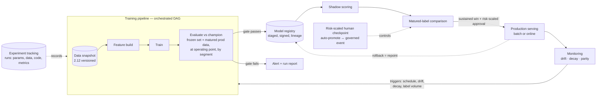

# Chapter 2.15 — MLOps Engineering

| | |
|---|---|
| **Part** | 2 — Artificial Intelligence |
| **Maturity level** | 3 — Engineer |
| **Difficulty** | Advanced |
| **Estimated study time** | 4 hours (reading 2 h, exercise 2 h) |
| **Prerequisites** | [2.9](chapter-09-classical-ml-system-design.md); [2.10](chapter-10-mlops-vs-llmops.md); [2.12](chapter-12-data-engineering-feature-platforms.md) |

## Learning Objectives

After this chapter you will be able to:

1. Engineer the training pipeline as a versioned, orchestrated, reproducible artifact — with experiment tracking that makes every reported number traceable to a run.
2. Design the model registry and promotion machinery: staged lifecycles, eval-gated promotion, and the rollout patterns (shadow, canary, champion–challenger) matched to each system's risk.
3. Design continuous training: retraining triggers, automated gates, and the human checkpoints that governed models require.
4. Choose platform maturity honestly — adopt tooling in order of felt pain, and recognize when "we need an ML platform" is premature ([2.10](chapter-10-mlops-vs-llmops.md)'s anti-platform-theater, now with the engineering to back it).

## Introduction

Chapter [2.10](chapter-10-mlops-vs-llmops.md) established the *conceptual* frame — one discipline (version everything that affects behavior, gate promotion on evaluation, monitor in production, keep rollback cheap), two artifact sets — and then spent its pages on the comparison. This chapter builds the classical lane's engineering, the half 2.10 compressed into one sentence: *data snapshot → features → train → evaluate vs. champion → register → deploy → monitor → retrain trigger*. Each arrow in that sentence is a component with failure modes, and the difference between a model that survives its second year and [2.9](chapter-09-classical-ml-system-design.md)'s "abandonware in six months" is almost entirely whether these components exist.

The through-line: **operational maturity is what makes model quality durable.** A well-validated model ([ml-model-validation checklist](../../checklists/ml-model-validation-checklist.md)) with no pipeline, registry, or retraining machinery is a snapshot of past competence decaying at the rate of the world's drift. The engineering in this chapter is how the validation disciplines of 2.7/2.9 keep being true *next* quarter, unattended.

## Business Motivation

MLOps debt is invisible until a person leaves. Bellhaven Insurance (the four-model estate of [2.12](chapter-12-data-engineering-feature-platforms.md)) ran retraining as a monthly ritual performed by one senior data scientist: hand-run notebooks, artifacts on a shared drive named `model_v3_final_FIXED.pkl`, no eval gate beyond eyeballing a metric. When she left, retraining simply stopped — for five months, across all four models, unnoticed because nothing *failed*; the models just aged. The renewal-pricing model's decay cost an estimated $1.1M before a rate-review caught it. The rebuild — orchestrated pipelines, experiment tracking, a registry with gated promotion, drift-triggered retraining — cost two engineers one quarter, and its real product was *survivability*: the estate now retrains, evaluates, and promotes with no single human as the load-bearing component. The economic frame for the memo: pipeline automation is insurance against silent decay and key-person risk, and its premium is a fraction of one incident ([6.10](../part-6-enterprise-architecture/chapter-10-tco-business-case.md)). The demo-to-production multiplier the GenAI world knows ([4.11](../part-4-enterprise-genai-systems/chapter-11-cost-engineering.md)) has a classical twin: the notebook-to-operated-system multiplier, and this chapter is that multiplier's bill of materials.

## Theory

### The training pipeline as an artifact

The unit of ML delivery is not the model; it is the **pipeline that produces the model**:

- **Orchestration** — the training flow as a DAG under a scheduler (data snapshot → feature build → train → evaluate → register), with retries, alerting, and idempotent steps. The orchestrator is whatever the organization already runs ([2.10](chapter-10-mlops-vs-llmops.md)'s git-and-CI-first stance); the property that matters is *the pipeline runs without a person*.
- **Experiment tracking** — every training run records its parameters, data snapshot/feature versions, code commit, metrics, and produced artifact, queryably. The test: *any number in any slide traces to a run ID*. Without it, "the model improved" is folklore; with it, the promotion gate has evidence to consume.
- **Reproducibility** — pinned environments, recorded seeds, versioned data ([2.12](chapter-12-data-engineering-feature-platforms.md)'s snapshots). The bar from the validation checklist — *a reviewer can reproduce the reported numbers* — is met here or nowhere. Perfect bitwise reproducibility can be costly (distributed training nondeterminism); the honest standard is *statistically equivalent reruns with documented variance* ([2.7](chapter-07-evaluating-ml-systems.md)'s noise floor, applied to your own pipeline).

### Registry and promotion

The **model registry** is the control point between training and serving: versioned artifacts with lineage (which run, which data, which features), staged lifecycle (candidate → staging → production → archived), and approvals where governance demands them ([CS55](../../case-studies/cs55-credit-risk-scoring-mrm.md)'s inventory is this registry plus regulatory duties). The registry's load-bearing property: **serving pulls only signed, staged artifacts from it** — no side-channel deploys, because the side channel is where untracked models come from.

**Promotion is an evaluation event, not a deployment event.** The gate: challenger vs. champion on a *frozen* evaluation set plus (where labels lag) recent matured production data, at the operating point, by segment — the [2.9](chapter-09-classical-ml-system-design.md) champion–challenger rule, mechanized. Rollout patterns, in ascending confidence cost:

- **Shadow** — the challenger scores live traffic, decisions still come from the champion; compare on matured labels with zero user impact ([CS52](../../case-studies/cs52-card-fraud-scoring.md)'s always-on shadow). The default first step for any consequential model.
- **Canary / progressive** — the challenger takes a small, monitored traffic slice, then grows. For systems where shadow can't capture interaction effects (ranking — the model changes what users see, [2.14](chapter-14-ranking-recommenders-anomaly-detection.md)).
- **Champion–challenger as standing structure** — not a one-off test but the permanent state: a challenger is always training, always shadowed, promoted when it wins sustainedly. Demotion is symmetric: a champion losing to the baseline pages someone ([CS51](../../case-studies/cs51-demand-forecasting-replenishment.md)).
- **Rollback** — repointing serving to the prior registry version, rehearsed, in minutes. If rollback requires a retrain, there is no rollback.

### Continuous training

Retraining automation closes 2.9's loop. **Triggers**, composable: *scheduled* (the default where drift is slow and training cheap — [2.13](chapter-13-forecasting-systems.md)'s weekly cadence), *drift-based* (PSI breach → early retrain — [drift checklist](../../checklists/drift-model-monitoring-checklist.md)), *decay-based* (matured-label performance below floor), and *data-based* (enough new labels accrued). **Gates make automation safe**: an auto-retrained model faces the same frozen-set, at-operating-point, by-segment comparison as any challenger — automation without the gate is how a data incident becomes a production model (the corrupted batch trains "successfully," evaluates terribly, and *the gate is what notices*; [2.12](chapter-12-data-engineering-feature-platforms.md)'s loud gates and this one are the same immune system at two layers). **Human checkpoints** are risk-scaled, not uniform: the forecasting model auto-promotes on a green gate; the credit model's promotion is an annual governed event with independent validation ([CS55](../../case-studies/cs55-credit-risk-scoring-mrm.md)) — the two-speed reality [2.10](chapter-10-mlops-vs-llmops.md)'s inversion table predicted, engineered.

### Serving operations and the maturity ladder

Serving inherits 2.9's batch/online split; the ops additions: **packaging** (models exported in portable formats, containerized with pinned dependencies — the artifact runs the same in evaluation and production), **parity checks** ([2.12](chapter-12-data-engineering-feature-platforms.md)'s online/offline feature comparison, scheduled), and **monitoring hooks** wired at deploy time, not after ([2.9](chapter-09-classical-ml-system-design.md): drift alerts ship *with* the model).

Adopt the machinery in order of felt pain — the maturity ladder, honestly:

| Level | State | Adopt next when… |
|---|---|---|
| 0 | Notebooks + manual deploys | You have *any* production model: version control, one training script, tracked runs |
| 1 | Scripted, tracked, registry-backed; manual retrain | Retraining is a recurring human chore, or a key person is load-bearing: orchestrate the DAG |
| 2 | Orchestrated pipelines; scheduled/triggered retraining with gates | Multiple teams duplicate this machinery: shared platform, shared feature estate ([2.12](chapter-12-data-engineering-feature-platforms.md)) |

Most organizations need level 1 and buy level 2's tooling first — the platform-theater 2.10 warned about. The architect's question is never "which MLOps platform?" but "which rung's pain do we actually feel?"

## Architecture Perspective

What this couples to: 2.12's data estate upstream (snapshots, features, labels are its products) and 2.9's serving/monitoring downstream. What it forces: one path to production (through the registry), evidence at every promotion (through tracking and gates), and a loop that runs unattended at exactly the autonomy level each model's risk tier permits. The GenAI parallel is 5.7's composite-manifest machinery — same skeleton, different versioned artifacts ([2.10](chapter-10-mlops-vs-llmops.md)'s thesis, now visible in the diagrams).

## Real-world Example

**Tembusu Bank** ([CS52](../../case-studies/cs52-card-fraud-scoring.md)/[CS55](../../case-studies/cs55-credit-risk-scoring-mrm.md)) runs both extremes of this chapter on one platform — the instructive part. The **fraud lane**: challengers train weekly, shadow-score all traffic continuously, and promote on a two-week sustained win over the champion on matured labels — human approval is one risk-officer click, because adversarial drift makes speed a control ([CS52](../../case-studies/cs52-card-fraud-scoring.md)'s decay-within-six-weeks reality). The **credit lane**: the identical pipeline/registry/tracking machinery, but promotion is an annual governed event with an independent-validation stage gate ([CS55](../../case-studies/cs55-credit-risk-scoring-mrm.md)) — the platform's job there is producing the evidence pack, not moving fast. The build sequence is the lesson: the team built the fraud lane's automation first (felt pain: weekly manual retrains), then discovered the credit lane needed *the same components at a different autonomy setting* — one platform, risk-scaled checkpoints, no second build. Their platform readme states the principle better than most vendor decks: "the pipeline is the same everywhere; what varies is who must say yes, and how often it runs."

## Hands-on Exercise

Operationalize your 2.9/2.12 churn system: (1) wrap training as a **parameterized, re-runnable pipeline** (script or lightweight DAG) with experiment tracking (MLflow or equivalent) — every run records data version, params, metrics, artifact; (2) stand up a **registry flow**: register the trained model with lineage, implement a promotion script that compares challenger vs. champion on a frozen eval set *at the operating point* and promotes only on a win, logging the comparison; (3) implement **shadow scoring**: the challenger scores the same batch as the champion, outputs compared and logged for a simulated week; (4) implement one **automated retraining trigger**: corrupt a feature's distribution in the incoming batch, show the drift check fires, retraining runs, and the gate *rejects* the model trained on corrupted data (this end-to-end failure rehearsal is the deliverable — P21's testable-DoD spirit); (5) rehearse **rollback**: repoint scoring to the previous registry version and prove it with one command.

**Acceptance criteria:**
- [ ] Any metric you report traces to a run ID; a rerun reproduces it within stated variance
- [ ] Serving loads models *only* from the registry; the promotion script is the only writer to production stage
- [ ] The drift-triggered retrain on corrupted data is **blocked by the gate**, with an actionable report
- [ ] Shadow comparison log shows champion/challenger divergence per batch
- [ ] Rollback executes in one command; you can state its time-to-effect
- [ ] A half-page memo places your system on the maturity ladder and names the *next* rung's trigger

## Enterprise Considerations

Governed industries make this chapter's machinery a compliance surface: the registry doubles as the model inventory's system-of-record, promotion gates produce the validation evidence, and lineage answers the examiner's replay questions ([CS55](../../case-studies/cs55-credit-risk-scoring-mrm.md), [mrm-fairness checklist](../../checklists/mrm-fairness-checklist.md)) — build the pack as pipeline output, never as a documentation sprint. Vendor landscape: every cloud bundles this stack (pipelines + tracking + registry + endpoints), and assembled open-source (MLflow-class tracking/registry + a general orchestrator) covers level 1–2 needs; the lock-in again lives in pipeline definitions, so portable definitions are the exit ([2.12](chapter-12-data-engineering-feature-platforms.md)'s rule extended). Org design: the maturity ladder is a staffing statement — level 1 is the ML team's own discipline; level 2's shared platform needs a named owner or it becomes the unowned middle everyone blames ([6.9](../part-6-enterprise-architecture/chapter-09-architecture-governance.md)'s enabling-governance shape). And the two-lane reality deserves an explicit ADR per model: *what is this model's promotion autonomy, and who must say yes* — the question that keeps fraud-lane speed from leaking into credit-lane governance.

## Trade-offs

| Decision | Option A | Option B | Choose A when… | Choose B when… |
|----------|----------|----------|----------------|----------------|
| Platform sourcing | Assemble (tracker + orchestrator + registry) | Integrated managed platform | Level 1 pain, one team, portability valued | Many teams, level 2 pain, platform owner exists |
| Promotion autonomy | Auto-promote on green gate | Human checkpoint | Fast-drift domains, reversible decisions, strong gates (fraud, forecasting) | Governed/regulated decisions; slow, audited cadence (credit — [CS55](../../case-studies/cs55-credit-risk-scoring-mrm.md)) |
| Rollout pattern | Shadow first | Canary first | Label lag allows offline comparison; zero user-impact rehearsal wanted | The model changes user behavior (ranking) so shadow can't see interaction effects |
| Retraining | Scheduled | Trigger-based (drift/decay) | Stable domain, cheap training, slow drift | Monitored decay between schedules; adversarial or fast-moving domains |

## Common Mistakes

1. **Platform before pain** — buying level-2 tooling at level-0 discipline; the platform becomes shelfware while notebooks still deploy models. Climb the ladder in order of felt pain.
2. **Auto-retraining without a gate** — the pipeline faithfully trains on a corrupted batch and ships it. Automation amplifies whatever the gate would have caught; no gate, no automation.
3. **The registry as a file share** — artifacts stored without lineage, stages, or a single serving path. Untracked side-channel deploys are how "which model is actually in production?" becomes a research project.
4. **Reproducibility theater** — seeds pinned, but data unversioned and environments drifting; reruns diverge and nobody knows which difference matters. Version data first ([2.12](chapter-12-data-engineering-feature-platforms.md)); state rerun variance honestly.
5. **One autonomy setting for all models** — either the credit model auto-promotes (a finding waiting to happen) or the fraud model waits for quarterly review (an adversary's gift). Promotion autonomy is per-model, risk-scaled, and written down.
6. **Rollback assumed, never rehearsed** — the "previous version" turns out unreproducible or incompatible with current features. Rehearse the repoint; if rollback needs a retrain, it isn't rollback.

## Best Practices

1. **One path to production** — through the pipeline, through the gate, through the registry. Every exception is a future incident with worse lineage.
2. **Evidence per promotion** — the gate's comparison (frozen set, operating point, segments) stored with the run; promotion decisions become auditable artifacts for free.
3. **Shadow by default for consequential models** — the cheapest honest rehearsal; keep a challenger always shadowed where drift is fast.
4. **Rehearse failure quarterly** — corrupted-batch drills, rollback drills, trigger tests. The 2.12 gates and this chapter's gates are one immune system; exercise it.
5. **Write the autonomy ADR per model** — trigger set, gate contents, who approves, rollback owner. One page; it is the operational constitution of the model.
6. **Track the notebook-to-operated multiplier** — when scoping model #N, price the pipeline/registry/monitoring work explicitly; it is the majority of the effort and the majority of the survivability ([1.7](../part-1-professional-foundation/chapter-07-estimation.md)).

## Architecture Checklist

Before signing off a design touching this topic:

- [ ] Training runs as an orchestrated, re-runnable pipeline; no human is load-bearing for retraining
- [ ] Experiment tracking links every reported metric to a run (params, data version, code, artifact)
- [ ] Reproducibility standard stated honestly (bitwise or statistical-with-variance) and tested
- [ ] Registry is the single source for serving; artifacts staged, signed, lineage-complete
- [ ] Promotion gate specified: frozen set + matured production data, operating point, segments; demotion path exists
- [ ] Rollout pattern chosen per model (shadow/canary/champion–challenger) with rationale
- [ ] Retraining triggers defined with owners; automated retrains face the same gate as any challenger
- [ ] Promotion autonomy risk-scaled per model and recorded as an ADR
- [ ] Rollback rehearsed; time-to-effect known

## Interview Questions

1. Your team's only ML engineer left, and nobody has retrained the churn model in four months. What failed architecturally, and what do you build first? — *Strong answers name key-person load-bearing as the failure (Bellhaven's shape), sequence the fix up the maturity ladder — tracked runs and a scripted pipeline before any platform — and add a decay alert so silent aging pages someone.*
2. Design the promotion machinery for a bank running both a fraud model and a credit-scoring model. — *Strong answers build one pipeline/registry/tracking platform with per-model autonomy: continuous shadow and fast promotion for fraud, annual governed events with independent validation for credit — and name the registry as the shared inventory ([CS52](../../case-studies/cs52-card-fraud-scoring.md)/[CS55](../../case-studies/cs55-credit-risk-scoring-mrm.md)).*
3. Your automated retraining shipped a bad model last night. Reconstruct what must have been missing. — *Strong answers enumerate the absent defenses in order: data-quality gates upstream (2.12), the eval gate at promotion (frozen set would have caught it), shadow before production, and rollback speed — then propose the corrupted-batch drill so absence is discovered in rehearsal, not production.*
4. When is shadow deployment insufficient, and what do you use instead? — *Strong answers identify systems whose outputs change the world they're measured in (ranking/recommendations — [2.14](chapter-14-ranking-recommenders-anomaly-detection.md)): shadow can't observe interaction effects, so canary/progressive rollout inside an experiment framework is the honest test.*

## Further Reading

- Sculley et al., "Hidden Technical Debt in Machine Learning Systems" (NeurIPS 2015) — the canonical argument that the model is the small box; a decade old and still the best framing.
- Google Cloud, "MLOps: Continuous delivery and automation pipelines in machine learning" — the maturity-levels document behind this chapter's ladder; provider-neutral in substance.
- MLflow documentation (tracking + model registry concepts) — the concrete open reference for runs, lineage, stages, and promotion.
- DVC documentation (data & pipeline versioning) — what versioned data and re-runnable pipelines look like without a heavyweight platform.

## Summary

- The unit of ML delivery is the pipeline, not the model; operational maturity is what makes model quality durable and removes key-person risk.
- Experiment tracking makes every number traceable to a run; reproducibility is stated honestly and tested, not assumed.
- The registry is the single path to production — staged, signed, lineage-complete; promotion is an evaluation event with evidence, and rollback is a rehearsed repoint.
- Continuous training composes triggers (schedule, drift, decay, labels) with gates; automation without gates amplifies incidents instead of preventing them.
- Promotion autonomy is per-model and risk-scaled — fraud-lane speed and credit-lane governance run on the same platform with different checkpoints.
- Climb the maturity ladder in order of felt pain; the platform question comes after the discipline question, never before.

---

**Previous:** [2.14 Ranking, Recommenders & Anomaly Detection](chapter-14-ranking-recommenders-anomaly-detection.md) · **Next:** [2.16 Perception Systems: Vision, OCR & Speech](chapter-16-perception-systems.md) · **Related:** [2.10 MLOps and LLMOps](chapter-10-mlops-vs-llmops.md), [2.12 Data Engineering & Feature Platforms](chapter-12-data-engineering-feature-platforms.md), [5.7 LLMOps](../part-5-cloud-infrastructure-platform/chapter-07-llmops.md), [CS52](../../case-studies/cs52-card-fraud-scoring.md), [CS55](../../case-studies/cs55-credit-risk-scoring-mrm.md), [P21](../../projects/p21-churn-prediction-service/README.md)
