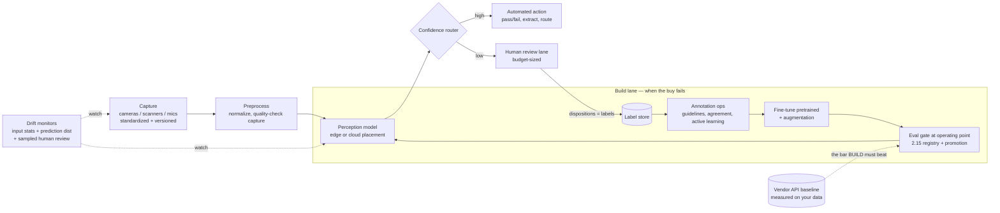

# Chapter 2.16 — Perception Systems: Vision, OCR & Speech

| | |
|---|---|
| **Part** | 2 — Artificial Intelligence |
| **Maturity level** | 3 — Engineer |
| **Difficulty** | Advanced |
| **Estimated study time** | 4 hours (reading 2 h, exercise 2 h) |
| **Prerequisites** | [2.3](chapter-03-deep-learning-fundamentals.md); [2.11](chapter-11-choosing-the-right-ai-approach.md); [2.12](chapter-12-data-engineering-feature-platforms.md) |

## Learning Objectives

After this chapter you will be able to:

1. Frame perception problems precisely — classification, detection, segmentation, OCR, speech — with their native metrics (mAP/IoU, CER/WER) and their operating points.
2. Run the perception build-vs-buy ladder honestly: vendor API → pretrained model → fine-tuned pretrained → custom, with annotation economics and volume pricing at the center of the decision.
3. Design the annotation pipeline when building: guidelines, agreement, active learning, augmentation — the data work that *is* most of the project.
4. Design perception deployment: edge vs. cloud placement, model compression, confidence-routed human review, and drift monitoring for a world seen through cameras and microphones.

## Introduction

[2.11](chapter-11-choosing-the-right-ai-approach.md) disposed of rung 3 — deep learning on unstructured perception — in two lines: "vision, audio, OCR; usually consumed as a pretrained/vendor model." That default is correct and this chapter is about earning it: knowing *when* it holds, when the domain gap breaks it, and how to build the fine-tuned alternative when it does. Perception is where [2.3](chapter-03-deep-learning-fundamentals.md)'s deep learning finally becomes an architecture decision rather than background: the models are convolutional and transformer families the architect selects rather than derives, and the design surface is everything around them — annotation economics, domain shift, edge placement, and the human-review lane.

Two through-lines. First, **perception is a data project wearing a model costume**: in a typical fine-tuning build, annotation and data curation consume more budget than all compute combined, and annotation quality caps model quality exactly as [2.2](chapter-02-machine-learning-fundamentals.md)'s ceiling predicts. Second, **the camera is part of the system**: perception models are exquisitely sensitive to *how* the world is captured (lighting, angle, resolution, microphone quality), which makes domain shift the dominant production failure and capture standardization the cheapest accuracy lever — often cheaper than any modeling work.

## Business Motivation

Perception unlocks the enterprise's non-textual data: quality inspection on production lines ([CS53](../../case-studies/cs53-predictive-maintenance.md) deferred exactly this), document digitization at intake ([P22](../../projects/p22-hybrid-claims-intake/README.md) buys it; this chapter is how you'd evaluate that buy), field-service photo diagnosis (CS33), and voice channels (P15). The money is concrete in both directions. Buying: vendor OCR at ~$1.50/1,000 pages is unbeatable at modest volume — a 40M-page/year processor pays $60K/year, well under the cost of building — and the arithmetic only flips one or two orders of magnitude up: at 500M pages/year the API bill is $750K/year against a one-time build plus modest self-host serving, *if* the accuracy holds, which only a measured comparison shows. (More often the flip driver isn't volume at all — it's domain gap, latency, or data residency, as Ironvale's case below shows.) Building: Ironvale's weld-inspection build (below) cost ~$130K all-in and removed a manual inspection bottleneck worth ~$900K/year — but only after a vendor API failed on their domain, which is the ordering discipline: **the buy option is the baseline the build must beat**, priced per unit at projected volume ([1.7](../part-1-professional-foundation/chapter-07-estimation.md), [6.10](../part-6-enterprise-architecture/chapter-10-tco-business-case.md)). The architect's failure modes are symmetric: building what a $200/month API serves, and renting forever what the domain demanded be built.

## Theory

### Problem families and their native metrics

| Family | Output | Native metrics | Operating-point reality |
|---|---|---|---|
| **Image classification** | Label per image | Accuracy, precision/recall per class | Class imbalance dominates (2% defect rate); threshold per class |
| **Object detection** | Boxes + labels | **mAP** at IoU thresholds | mAP summarizes; the *decision* consumes precision/recall at one confidence threshold |
| **Segmentation** | Per-pixel masks | IoU/Dice per class | Needed only when geometry matters (area, boundaries) — don't buy pixels you won't use |
| **OCR / document AI** | Text + layout | **CER/WER**, field-level accuracy | End metric is *field-level* correctness after post-processing, not raw character accuracy |
| **Speech (ASR)** | Transcript (+ diarization) | **WER**, entity accuracy, latency | Domain vocabulary and accents dominate WER; streaming vs. batch is an architecture fork |

Two disciplines transfer from everywhere else in the track: **evaluate at the operating point** the decision uses ([2.7](chapter-07-evaluating-ml-systems.md) — a detector's mAP is a research number; the line's false-reject rate at the chosen confidence threshold is the business number), and **calibrate confidence** if anything downstream routes on it — which it should (the review lane below).

### The build-vs-buy ladder

Climb only when the rung below measurably fails ([2.11](chapter-11-choosing-the-right-ai-approach.md)'s discipline, applied to perception):

1. **Vendor API / multimodal LLM** — the default. Generic OCR, common-object detection, mainstream ASR, and increasingly the multimodal LLMs of [3.9](../part-3-core-building-blocks-of-genai/chapter-09-multimodal-models.md) for open-ended visual understanding. Evaluate on *your* sampled data before committing — vendor accuracy claims describe their benchmark's world, not your cameras.
2. **Pretrained open model, as-is** — standard architectures with public weights, self-hosted. Buys data privacy, latency control, and per-unit economics at volume; accuracy ≈ the API's on generic domains.
3. **Fine-tuned pretrained model** — *the realistic "build."* Transfer learning from public weights on hundreds-to-thousands of *your* annotated examples closes domain gaps (your weld types, your form layouts, your shop-floor acoustics) that no generic model closes. From-scratch training is rung 4 and almost never justified outside frontier scale.
4. **Custom architecture / from scratch** — research territory; requires data volumes and teams most enterprises don't have. Demand extraordinary evidence.

**Decision drivers**, in the order they usually decide: *domain gap* (measured, not assumed — run the API on 200 labeled samples first); *unit economics at volume* (API per-call × projected volume vs. self-host serving + the annotation/build amortization); *latency and placement* (an on-line inspection at 200ms can't round-trip to a cloud API; edge forces rungs 2–3); *data privacy/residency* (images and voice are often the most regulated data in the estate — [4.14](../part-4-enterprise-genai-systems/chapter-14-privacy-compliance-governance.md)); *differentiation* (if the perception quality *is* the product, renting it caps you at parity).

### Annotation economics — the center of gravity

When you climb to rung 3, the project becomes an annotation project:

- **Cost structure** — per-label cost rises steeply with output complexity: image tags < bounding boxes < polygons/masks; domain-expert labels (radiology, welds) cost multiples of crowd labels. Budget honestly: 4,000 boxes at expert rates is real money, and it recurs as the domain evolves.
- **Annotation ops** — written guidelines with worked edge cases, overlap samples with agreement tracking, adjudication for contested cases, provenance per label — [2.12](chapter-12-data-engineering-feature-platforms.md)'s labeling discipline verbatim, with [CS24](../../case-studies/cs24-ediscovery-triage.md)'s lesson attached: labeler QC *is* model QC.
- **Stretching the budget** — **transfer learning** (the pretrained backbone is why 4,000 images suffice where 4 million once did); **active learning** (label the samples the current model is least certain about — routinely halves annotation volume to a target accuracy); **augmentation** (synthetic variation of lighting/rotation/noise — cheap robustness, and a partial rehearsal for domain shift); **synthetic data** (rendered or generated examples for rare classes — powerful for the 0.1% defect the line produces twice a month, validated against real holdouts).

### Deployment: placement, compression, review lanes, drift

- **Edge vs. cloud** — the fork is forced by latency (in-line inspection), connectivity ([CS13](../../case-studies/cs13-store-operations-copilot.md)/CS33's field reality), or privacy (voice that must not leave the premises). Edge brings **compression**: quantization, pruning, and distillation shrink models to device budgets, traded against measured accuracy at the operating point; portable runtimes (ONNX-class) keep the artifact provider-neutral. The registry/promotion machinery of [2.15](chapter-15-mlops-engineering.md) applies unchanged — plus a fleet-update problem (a thousand cameras don't blue/green like a service).
- **Confidence-routed human review** — the deployable pattern for consequential perception: high-confidence predictions act, low-confidence routes to humans, and *review dispositions become labels* — the perception edition of the label factory ([CS53](../../case-studies/cs53-predictive-maintenance.md)), and the mechanism that makes the model improve in production. Size the review lane like an alert budget ([2.14](chapter-14-ranking-recommenders-anomaly-detection.md)).
- **Perception drift** — the world changes *and so does the capture*: a replaced camera, new lighting, a re-arranged line, seasonal daylight, a new phone model's microphone. Monitor input statistics (brightness, contrast, audio SNR) as drift signals beside prediction distributions, keep **sampled human review** as the outcome plane (perception labels are cheap *in small sampled volumes* — use that), and treat capture hardware as versioned configuration: the [CS53](../../case-studies/cs53-predictive-maintenance.md) rule — check the instrument before accusing the world — is *literal* here.

## Architecture Perspective

What is distinctive: capture as a *versioned, monitored component* (the camera is in the architecture), the confidence router as the seam between automation and review, the vendor-API baseline as a permanent comparison (the buy option stays on the eval report the way seasonal-naive stays on the forecast report — [2.13](chapter-13-forecasting-systems.md)), and the review lane doubling as the label factory that feeds the build lane.

## Real-world Example

**Ironvale Components** ([CS53](../../case-studies/cs53-predictive-maintenance.md)'s manufacturer) automated weld-seam inspection on two lines. Sequence: (1) a vendor vision API, evaluated on 300 labeled seam images — 71% recall on their defect taxonomy; generic models had never seen their weld types; the *measured* failure justified climbing the ladder. (2) Fine-tuned pretrained detector: 4,100 expert-annotated images (~$60K of metallurgist time — the project's biggest line item), active learning after the first 1,500 cutting the projected annotation volume roughly in half, augmentation for lighting variation. (3) Result at the chosen operating point: 96.2% recall at a 3.1% false-reject rate — the false-reject budget negotiated with line management exactly like [CS53](../../case-studies/cs53-predictive-maintenance.md)'s alert budget, because a line that over-rejects gets the system bypassed. (4) Deployment at the edge (a compressed model on line-side hardware; the 200ms takt time made cloud round-trips a non-starter), uncertain seams routed to the existing inspector — whose dispositions now retrain the model quarterly. (5) Production incident worth the retelling: recall dropped 4 points in one week — drift monitors flagged input brightness first; a replaced lamp fixture, not a model problem. Total: ~$130K build against ~$900K/year of inspection bottleneck; the ADR's key line: *"the vendor API is re-evaluated annually — the day a generic model passes 95% recall on our holdout, we retire the fleet."* The buy option remains the standing challenger.

## Hands-on Exercise

On a public defect/quality image dataset (surface-defect or PCB-defect class datasets work): (1) establish the **buy baseline** — run a multimodal LLM or pretrained classifier zero-shot on a 150-image labeled sample; record accuracy and per-image cost at list pricing; (2) **fine-tune** a pretrained image classifier on the training split (transfer learning — freeze the backbone first, then unfreeze); (3) evaluate both **at an operating point** you choose from stated asymmetric costs (missed defect = 20× false alarm), reporting recall at the fixed false-alarm budget, per class; (4) apply two **augmentations** (brightness, rotation) and report the delta on a deliberately darkened test split — your domain-shift rehearsal; (5) write the **build-vs-buy memo**: annualized cost of each option at 1M images/year, the accuracy delta at the operating point, and the re-evaluation trigger you'd write into the ADR.

**Acceptance criteria:**
- [ ] Buy baseline measured on your labeled sample, not quoted from a vendor page
- [ ] Fine-tuned model beats the baseline at the *operating point* (or your memo honestly recommends buying)
- [ ] Class-level results reported; the rare class's recall is stated separately
- [ ] Domain-shift rehearsal quantified (accuracy on shifted split, before/after augmentation)
- [ ] Memo prices both options at volume and names the annual re-evaluation trigger

## Enterprise Considerations

Perception data is governance-heavy: faces, voices, license plates, and patient images carry biometric and privacy regimes beyond ordinary PII (consent for capture, retention limits, region-locked processing — [4.14](../part-4-enterprise-genai-systems/chapter-14-privacy-compliance-governance.md)); annotation vendors seeing your images are data processors with contracts to match. Safety-adjacent perception (medical imaging, driver monitoring, industrial safety interlocks) crosses into regulated-device territory — [CS04](../../case-studies/cs04-radiology-report-drafting.md)'s boundary discipline (where the architecture stops determines which regulator arrives) applies with force. The multimodal-LLM question belongs in every perception review now: [3.9](../part-3-core-building-blocks-of-genai/chapter-09-multimodal-models.md)'s models are genuine rung-1 options for open-ended visual understanding, and genuinely wrong for high-volume, fixed-taxonomy, latency-bound inspection — the [2.11](chapter-11-choosing-the-right-ai-approach.md) triage decides per problem, not per fashion. Org reality: a fine-tuned perception system needs a standing relationship with domain experts (annotation, adjudication, drift review) — budget their hours as a run-rate line, not a one-time project cost.

## Trade-offs

| Decision | Option A | Option B | Choose A when… | Choose B when… |
|----------|----------|----------|----------------|----------------|
| Sourcing | Vendor API / multimodal LLM | Fine-tuned self-hosted | Generic domain, modest volume, no latency/privacy constraint — the measured default | Measured domain gap, volume economics, edge latency, or data residency force it |
| Placement | Cloud | Edge | Latency tolerant, connectivity reliable, fleet small | In-line latency, disconnected sites, privacy-bound capture — accept compression + fleet-update cost |
| Label budget | More annotation | Active learning + augmentation + synthetic | Budget exists and edge cases demand real coverage | Expert labels are the bottleneck; uncertainty sampling stretches them |
| Rare-class strategy | Collect real examples | Synthetic generation | The class occurs often enough to collect in months | It doesn't (the twice-a-month defect) — synthesize, validate on every real example you have |

## Common Mistakes

1. **Trusting vendor accuracy claims** — benchmark numbers describe their data. Two days labeling 200 of *your* samples converts the buy decision from faith to measurement.
2. **Training on a different world than production** — lab-lit training images, shop-floor production images; the model ships great metrics and fails on contact. Capture training data through the production pipeline, and rehearse shift with augmentation.
3. **Benchmark metrics at the design review** — mAP and WER are model-selection numbers; the decision consumes recall at a false-alarm budget, or field-level accuracy after post-processing. Present the operating point ([2.7](chapter-07-evaluating-ml-systems.md)).
4. **Annotation as an afterthought** — unversioned guidelines, no agreement measurement, one annotator's drift baked permanently into the weights. The 2.12 labeling discipline applies at full strength.
5. **Ignoring the rare class** — 98% accuracy on a 2%-defect line can mean *zero defects caught*. Class-level reporting, always; imbalance handling by design.
6. **The camera outside the architecture** — capture hardware changed without notice is the top perception incident cause. Version it, monitor input statistics, and put "check the instrument" first in the runbook.

## Best Practices

1. **Measure the buy before funding the build** — and keep the buy on the eval report forever as the standing challenger (Ironvale's annual re-evaluation trigger).
2. **Spend on capture standardization before model sophistication** — fixed mounts, controlled lighting, mic placement: the cheapest accuracy in the field.
3. **Design the review lane as the label factory** — confidence routing sized to a budget, dispositions coded, quarterly retrains fed by production ([2.15](chapter-15-mlops-engineering.md)'s loop closed).
4. **Stretch expert labels with active learning** — label what the model is unsure about; halve the bill.
5. **Monitor the input, not just the output** — brightness, contrast, SNR as first-class drift signals; sampled human review as the outcome plane.
6. **Keep artifacts portable** — exported models in portable formats, per 2.15's packaging rule; edge fleets amplify lock-in costs.

## Architecture Checklist

Before signing off a design touching this topic:

- [ ] Problem family named with its native metric *and* the operating point the decision consumes
- [ ] Buy option measured on ≥150 labeled samples of production-pipeline data; the ladder climbed only on measured failure
- [ ] Annotation budgeted honestly (per-label cost × volume × recurrence) with ops discipline (guidelines, agreement, provenance)
- [ ] Class imbalance and rare-class strategy explicit; class-level reporting in every eval
- [ ] Placement (edge/cloud) derived from latency, connectivity, and privacy; compression validated at the operating point if edge
- [ ] Confidence-routed review lane sized to a budget; dispositions feed the label store
- [ ] Capture hardware versioned; input-statistics drift monitoring beside prediction monitoring
- [ ] Re-evaluation trigger for the buy option written into the ADR

## Interview Questions

1. The plant wants automated visual quality inspection. Walk me through your first month. — *Strong answers: label a few hundred production-pipeline images, measure the best vendor/multimodal option on them, negotiate the false-reject budget with line management, and only then decide the ladder rung — the model discussion comes last.*
2. When does a multimodal LLM beat a fine-tuned CV model for a vision task, and when is it the wrong answer? — *Strong answers: open-ended understanding, low volume, changing taxonomy, no latency bound → multimodal; fixed taxonomy at high volume, per-unit economics, in-line latency, measured domain gap → fine-tuned specialist; the 2.11 triage decides, and cost-per-inference at projected volume is the deciding arithmetic.*
3. Your deployed detector's accuracy dropped 5 points this week. Diagnose. — *Strong answers check capture first (hardware change, lighting, input-stats drift), then upstream preprocessing, then true domain evolution (new product variant) — and cite sampled human review as the instrument that quantifies it.*
4. You have budget for 2,000 expert labels and need 10× that coverage. Options? — *Strong answers: transfer learning as the force multiplier, active learning to choose the 2,000, augmentation for robustness, synthetic data for rare classes with real-data validation, and the confidence-routed review lane generating free labels in production.*

## Further Reading

- The fast.ai *Practical Deep Learning* course — the standard practical route to competent transfer learning; the first four lessons cover this chapter's build lane.
- torchvision fine-tuning tutorials (pytorch.org) — concrete, current reference code for classification and detection transfer learning.
- Your cloud provider's vision, document, and speech API documentation — *including the pricing pages*; the buy baseline is a measured cost, and quotas/latency live there too.
- Label-tooling documentation (e.g., CVAT or Label Studio) — what annotation ops, guidelines, and QC workflows look like in real tools.

## Summary

- Perception's default is buy (2.11's rung 3); this chapter is the discipline of *earning* the default — measure the vendor option on your data, and climb the ladder only on measured failure.
- The realistic build is fine-tuning pretrained models; the project's center of gravity is annotation economics — guidelines, agreement, active learning, augmentation.
- Evaluate at the operating point the decision consumes (recall at a false-alarm budget; field-level accuracy), per class — benchmark metrics select models, they don't sign off systems.
- The camera is part of the architecture: capture standardization is the cheapest accuracy, input-statistics monitoring is the earliest drift signal, and "check the instrument" is literal.
- Confidence-routed human review is the deployable pattern — and the label factory that makes production improve the model.
- Keep the buy option as the standing challenger with a written re-evaluation trigger; perception build decisions have shelf lives.

---

**Previous:** [2.15 MLOps Engineering](chapter-15-mlops-engineering.md) · **Next:** [2.17 Online Experimentation & A/B Testing](chapter-17-online-experimentation.md) · **Related:** [2.3 Deep Learning Fundamentals](chapter-03-deep-learning-fundamentals.md), [3.9 Multimodal Models](../part-3-core-building-blocks-of-genai/chapter-09-multimodal-models.md), [2.11 Choosing the Right AI Approach](chapter-11-choosing-the-right-ai-approach.md), [CS53](../../case-studies/cs53-predictive-maintenance.md), [P22](../../projects/p22-hybrid-claims-intake/README.md)
