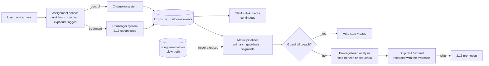

# Chapter 2.17 — Online Experimentation & A/B Testing

| | |
|---|---|
| **Part** | 2 — Artificial Intelligence |
| **Maturity level** | 3→4 — Engineer → Architect |
| **Difficulty** | Advanced |
| **Estimated study time** | 4 hours (reading 2 h, exercise 2 h) |
| **Prerequisites** | [2.7](chapter-07-evaluating-ml-systems.md); [2.9](chapter-09-classical-ml-system-design.md); [2.14](chapter-14-ranking-recommenders-anomaly-detection.md) |

## Learning Objectives

After this chapter you will be able to:

1. Design a controlled experiment: randomization unit, power analysis and minimum detectable effect, duration, and the A/A test that validates the machinery.
2. Choose the metric structure — one primary decision metric, guardrails with auto-stop, and honest proxies — and defend it against Goodharting.
3. Recognize and prevent the classic invalidators: peeking, sample-ratio mismatch, interference, novelty effects, and segment paradoxes.
4. Deploy experimentation as the release gate for ML systems, and choose honest alternatives (switchback, geo/cluster designs, holdouts, quasi-experiments) when unit-level A/B is impossible.

## Introduction

This chapter closes the classical track's evaluation arc. [2.7](chapter-07-evaluating-ml-systems.md) taught offline measurement; [2.14](chapter-14-ranking-recommenders-anomaly-detection.md) demoted offline metrics to challenger selection and promised the online half; this is it. The controlled experiment is the only instrument that measures what every business case actually claims — **incrementality**: what happened *because* the system shipped, versus what would have happened anyway. Offline metrics measure agreement with logged history; models can improve that agreement while changing nothing in the world ([CS54](../../case-studies/cs54-product-recommendations.md)'s +6%-offline model losing to control online is this chapter's founding parable).

The through-line: **an experiment is an instrument, and instruments must themselves be validated** — the same discipline [4.7](../part-4-enterprise-genai-systems/chapter-07-evaluation-systems.md) applies to LLM judges applies here: A/A tests before A/B trust, sample-ratio checks before results, pre-registered decisions before data. Most experiment failures are not statistical exotica; they are instrument failures — peeking, broken assignment, a metric that moved for reasons nobody predicted — and the defenses are engineering, not mathematics.

## Business Motivation

Experimentation is the difference between an AI portfolio that *reports* value and one that *proves* it. The stakes compound in both directions. Without experiments: Meridian Telecom's retention team ran churn-model campaigns for a year, "measuring" success by comparing offer-takers against last quarter — a comparison contaminated by seasonality, selection, and regression to the mean; the claimed ₹4 crore of saved revenue survived until the first holdout test, which priced the *true* incremental effect at roughly a third of that. Nobody had lied; the instrument had. With experiments: every percentage point of measured-vs-real gap is budget reallocated from folklore to what works — and mature experimentation platforms turn this from a statistics project into a habit (assignment, exposure logging, metric pipelines, guardrail auto-stops as shared infrastructure — the same amortization argument as every platform in this curriculum, [5.10](../part-5-cloud-infrastructure-platform/chapter-10-iac-platform-engineering.md)). For the AI Solution Architect specifically: the experiment is where your systems' claims get audited, and the architect who designs the audit into the rollout ([2.15](chapter-15-mlops-engineering.md)'s canary inside an experiment framework) never has to defend folklore in front of finance ([1.3](../part-1-professional-foundation/chapter-03-business-understanding.md)).

## Theory

### Design: unit, power, duration

- **Randomization unit** — user is the default (stable experience, clean attribution); session when carryover is negligible; **cluster** (store, region, depot) when the treatment operates at that level or users interfere; **time-slice (switchback)** when one shared system serves everyone (pricing, dispatch, a single inventory pool). The unit decides everything downstream: variance, sample size, and which interference stories you must answer.
- **Power analysis, before launch** — pick the **minimum detectable effect (MDE)** the business would act on ("we'd ship for +0.5% conversion"), compute the sample size that detects it with standard power, and derive the duration from traffic. The honest outcomes are frequently unwelcome: at 2% base rates ([2.9](chapter-09-classical-ml-system-design.md)'s churn) or small populations ([CS45](../../case-studies/cs45-learning-development-recommender.md)'s 28K employees), the MDE you can detect in a tolerable duration may exceed any plausible effect — *that discovery, made before launch, is the analysis working* ([2.7](chapter-07-evaluating-ml-systems.md)'s noise floor, now with a calendar attached). Underpowered experiments don't fail loudly; they return "no significant effect" indistinguishable from "no effect," and organizations ship or kill on noise.
- **Duration floors** — full weekly cycles (weekday ≠ weekend), and long enough to see past **novelty and primacy effects** (users poking the new thing, or resisting it, for a week). A treatment winning only in week one is an effect *of change*, not of the treatment.
- **A/A tests** — run the machinery with no treatment difference. Significant "effects" at above-nominal rates mean broken assignment, contaminated metrics, or mis-modeled variance (clustered units especially). The A/A is the instrument calibration ([4.7](../part-4-enterprise-genai-systems/chapter-07-evaluation-systems.md)'s judge-validation, experiment edition); platforms should run them continuously.

### Metrics: primary, guardrails, proxies

- **One primary metric, pre-registered** — chosen before launch, tied to the decision ("ship if X"). Twenty metrics at 95% confidence produce one false win on average; the primary-metric discipline is the multiple-comparisons defense that needs no statistics, only governance.
- **Guardrails with auto-stop** — the metrics the treatment must *not* harm: latency, error rates, revenue per session, complaint rates, and the ecosystem metrics of [2.14](chapter-14-ranking-recommenders-anomaly-detection.md) (long-tail exposure). Wire the stop, don't rely on someone watching ([CS54](../../case-studies/cs54-product-recommendations.md)'s guardrail auto-stop).
- **Paired metrics against Goodharting** — a single engagement metric optimized alone buys pushy recommendations and clickbait ranking; pair it with its counterweight (conversion *and* return rate; deflection *and* re-contact — [CS12](../../case-studies/cs12-conversational-shopping-assistant.md)/[CS32](../../case-studies/cs32-customer-care-deflection.md)'s discipline, now enforced by the experiment design).
- **Proxy honesty** — short experiments read proxies (clicks) for long outcomes (retention, LTV). Validate the proxy's correlation with the outcome on historical cohorts, and maintain **long-term holdouts** (a small slice never exposed to the treatment family) as the slow-truth instrument — the online twin of label-lag honesty ([CS52](../../case-studies/cs52-card-fraud-scoring.md)).

### Validity threats — the invalidator catalog

| Threat | What it looks like | Defense |
|---|---|---|
| **Peeking** | Checking daily, stopping on the first significant day — inflates false positives severalfold | Fixed horizon honored, or sequential methods *designed* for continuous monitoring; the platform enforces, not etiquette |
| **Sample-ratio mismatch (SRM)** | The observed split deviates from the planned ratio beyond chance — e.g., 52/48 *at large n* (at n=1M that is a five-alarm fire; at n=100 it is noise) | Automated chi-squared test against the planned ratio at a strict threshold (p < 0.001 is common); an SRM'd experiment's *result* is discarded **and the cause is root-caused** — the assignment or logging bug behind it is usually contaminating other live experiments too |
| **Interference** | Treatment units affect control units: shared inventory, marketplace sellers, social features, one model retrained on pooled data | Cluster or switchback designs; explicit interference story in the design doc |
| **Novelty/primacy** | Week-one effects that decay | Duration floors; report the time curve, not just the mean |
| **Segment paradoxes (Simpson's)** | Aggregate winner losing in every major segment (or vice versa) via mix shift | Pre-registered segment analysis; investigate mix before celebrating |
| **Survivorship in the metric** | "Average session quality" improves because the treatment drove marginal users away | Denominator discipline: intent-to-treat on all assigned units, not on survivors |

### Experimentation for ML systems

- **The release gate** — [2.15](chapter-15-mlops-engineering.md)'s canary rollout runs *inside* the experiment framework: the challenger's traffic slice is a randomized treatment with a primary metric and guardrails, not just an ops safety check. Shadow answers "does it score differently?"; the experiment answers "does it change outcomes?" — you need both, in that order.
- **Uplift framing for targeting models** — a churn model's campaign is measured against a **randomized holdout within the targeted group** (P21's control slice, formalized): offer-takers vs. non-takers is selection bias; targeted-with-offer vs. targeted-without-offer is the effect. The regression-to-the-mean trap lives here: high-risk customers revert toward baseline on their own; only the holdout separates the model's contribution from gravity.
- **When unit A/B is impossible** — regulated decisions where differential treatment is impermissible ([CS55](../../case-studies/cs55-credit-risk-scoring-mrm.md) relies on shadow + vintage analysis instead); two-sided markets where interference dominates (switchback by time, or geo experiments); tiny populations (accept quasi-experiments: difference-in-differences against matched controls, staggered rollouts — honest about their weaker assumptions, [CS51](../../case-studies/cs51-demand-forecasting-replenishment.md)'s store-cluster reality). The architect's rule: **name the counterfactual** — every impact claim implies one; the design's job is making it credible, and "last quarter" is almost never credible.
- **The platform, in maturity order** — (1) assignment service with exposure logging and SRM checks; (2) metric pipelines computing primary/guardrails from logged exposures; (3) guardrail auto-stop; (4) sequential monitoring and CUPED-class variance reduction when experiment velocity demands it. Build in pain order ([2.15](chapter-15-mlops-engineering.md)'s ladder discipline); a spreadsheet on top of correct assignment beats a dashboard on top of broken assignment.

## Architecture Perspective

What this couples to: [2.15](chapter-15-mlops-engineering.md)'s rollout machinery (the canary is a treatment arm; promotion consumes the decision) and [2.12](chapter-12-data-engineering-feature-platforms.md)'s event estate (exposure logging is another point-in-time-critical log — an exposure recorded without its variant and timestamp is an unanalyzable event). What it forces: pre-registration (the primary metric and decision rule exist before data), instrument validation as a standing process (A/A, SRM), and decisions recorded with their evidence — the experiment log becomes the portfolio's honesty ledger ([6.10](../part-6-enterprise-architecture/chapter-10-tco-business-case.md)'s benefits side, finally measured).

## Real-world Example

**Meridian Telecom** (the operator whose churn model anchors [2.9](chapter-09-classical-ml-system-design.md) and P21) took three attempts to measure its retention campaign honestly. **Attempt 1** — offer the top decile, compare their churn against last quarter's: a triumphant −31% that dissolved under scrutiny (seasonality + regression to the mean: the top decile was selected *because* it was extreme, and extremes revert). **Attempt 2** — compare offer-takers vs. decliners: worse (acceptance is self-selection; engaged customers both accept offers and stay). **Attempt 3** — the design this chapter teaches: randomized 10% holdout *inside* the targeted decile, primary metric 90-day retention, guardrail on offer cost per retained customer, powered for the MDE finance would act on (which forced a three-month window at their churn base rate — the power analysis set the calendar, not the quarterly review). Result: true incremental retention of ~9% against the holdout — a third of attempt 1's claim, *and the first number the CFO funded without argument*, because the counterfactual was credible. The team's writeup ended with the line this chapter exists to install: "the model was fine all along; the measurement was the product."

## Hands-on Exercise

Using simulation (a notebook and a random-number generator are the whole lab): (1) simulate a user population with a 2.5% baseline conversion; run a **power analysis** for a +0.3-point MDE — report required sample size and, at an assumed daily traffic, duration; (2) run **A/A tests** — 1,000 simulated null experiments at your chosen α; verify the false-positive rate lands near nominal, then *break* the assignment (make it correlate with an outcome-linked covariate) and show the A/A catches it; (3) demonstrate **peeking inflation** — the same 1,000 null experiments, but "check daily and stop on first significance": report the inflated false-positive rate; (4) simulate a true +0.3-point effect and analyze it correctly (fixed horizon, intent-to-treat), reporting the estimate with its interval; (5) add a **guardrail** metric the treatment harms and show the auto-stop rule firing; (6) write the half-page **experiment plan** you'd pre-register: unit, primary, guardrails, MDE, duration, decision rule, and the interference story.

**Acceptance criteria:**
- [ ] Power analysis produces sample size *and* calendar duration; you can state what happens to the MDE if the business wants results in half the time
- [ ] A/A false-positive rate ≈ nominal on clean assignment; broken assignment detected
- [ ] Peeking inflation quantified (you should see several-fold) and explained in two sentences
- [ ] Effect estimate uses intent-to-treat; you can explain what analyzing "survivors" would have biased
- [ ] The pre-registered plan names the counterfactual and the decision rule before any data exists

## Enterprise Considerations

Experimentation crosses governance surfaces that pure ML work doesn't: **differential treatment** of customers is itself regulated in credit, insurance, and employment (randomizing who gets a better price or a loan term is not a neutral act — legal review belongs in the experiment platform's intake, and [CS55](../../case-studies/cs55-credit-risk-scoring-mrm.md)-class decisions use shadow-plus-vintage designs precisely because A/B is impermissible); consent and transparency regimes may require disclosure of experimentation in terms of service; and works-council-style constraints reach employee-facing experiments ([CS45](../../case-studies/cs45-learning-development-recommender.md)). Organizationally, the experiment platform is a *neutral referee* and must be owned like one — metric definitions centralized ([2.12](chapter-12-data-engineering-feature-platforms.md)'s contracts, applied to metrics), decision rules pre-registered, and the experiment log auditable, because the moment results are contested, the platform's credibility is the product ([6.9](../part-6-enterprise-architecture/chapter-09-architecture-governance.md)'s enabling-governance shape: the paved road for proving impact). And the cultural reality an architect should set expectations for: **most experiments lose** — mature programs report a majority of ideas failing to beat control, which is the system working; an experiment program reporting 80% wins has an instrument problem, not a genius problem.

## Trade-offs

| Decision | Option A | Option B | Choose A when… | Choose B when… |
|----------|----------|----------|----------------|----------------|
| Randomization unit | User-level | Cluster / switchback | Treatments are independent per user; no shared-resource coupling | Interference is structural (marketplaces, shared inventory, one dispatch system) |
| Analysis regime | Fixed horizon | Sequential monitoring | Discipline holds and duration is tolerable — the simple honest default | Continuous decisions needed; adopt methods built for it, never ad-hoc peeking |
| Primary metric | North-star outcome | Validated proxy | The outcome moves within the experiment window | It doesn't (retention, LTV) — use the proxy, keep the long-term holdout honest |
| Coverage | Experiment everything | Ship-with-holdout | Traffic supports powered tests at decision velocity | Small populations or urgent ships — a permanent holdout is the minimum honesty |

## Common Mistakes

1. **Comparing to last period** — seasonality, mix shift, and regression to the mean masquerade as impact (Meridian's attempt 1). The counterfactual must be *concurrent and randomized*, or explicitly quasi-experimental with stated assumptions.
2. **Measuring takers vs. non-takers** — self-selection dressed as treatment effect (attempt 2). Intent-to-treat on randomized assignment is the analysis unit.
3. **Peeking with fixed-horizon statistics** — the false-positive rate quietly multiplies. Sequential methods exist for a reason; use them or don't look.
4. **Ignoring SRM** — a statistically significant deviation from the planned split is a broken instrument reporting plausible numbers. Test automatically (chi-squared, strict threshold); on failure, discard the result *and* root-cause the assignment bug — it rarely affects only one experiment.
5. **Underpowered tests read as "no effect"** — the absence of significance at an undetectable MDE is the absence of information. Power analysis before launch, and say "we cannot measure this" when true.
6. **Metric harvesting** — twenty metrics, one significant, victory declared. One pre-registered primary; everything else is exploratory and labeled so.
7. **Interference denial** — user-randomized tests on shared-inventory or two-sided systems dilute or invert effects. Name the interference story in every design.

## Best Practices

1. **Pre-register the decision, not just the metric** — "ship if primary ≥ X with guardrails clean" written before launch turns analysis from advocacy into arithmetic.
2. **Validate the instrument continuously** — standing A/A tests and automated SRM checks; trust the platform because it is tested, not because it is expensive.
3. **Make the canary an experiment** — every 2.15 rollout slice gets a primary metric and guardrails; ops safety and impact measurement are one motion.
4. **Keep a long-term holdout** — the slow-truth cohort that catches proxy drift and novelty decay; small, permanent, sacred.
5. **Report the time curve** — effects by week expose novelty; a mean hides it.
6. **Celebrate informative losses** — a well-powered null saved the roadmap a quarter of building the wrong thing; the experiment log's kill decisions are its ROI ([1.4](../part-1-professional-foundation/chapter-04-tradeoff-analysis.md)'s decision honesty, instrumented).

## Architecture Checklist

Before signing off a design touching this topic:

- [ ] Randomization unit chosen with the interference story written down
- [ ] Power analysis done: MDE the business would act on, sample size, calendar duration — or an explicit "cannot be measured at this scale" finding
- [ ] One pre-registered primary metric with a decision rule; guardrails wired to auto-stop
- [ ] SRM and A/A validation automated in the platform
- [ ] Analysis regime honest: fixed horizon honored, or sequential methods designed for monitoring
- [ ] Intent-to-treat analysis; segment analyses pre-registered
- [ ] Long-term holdout maintained for slow outcomes; proxy-outcome correlation validated
- [ ] For ML rollouts: the canary slice runs as an experiment arm feeding 2.15's promotion gate
- [ ] Where A/B is impermissible or impossible: the alternative design (switchback / geo / shadow+vintage / diff-in-diff) named with its assumptions

## Interview Questions

1. The retention team reports their churn-model campaign cut churn 31% versus last quarter. Interrogate the claim. — *Strong answers name seasonality, regression to the mean on a selected extreme decile, and self-selection if takers were compared; then design the honest measurement: randomized holdout within the targeted group, intent-to-treat, powered for the actionable MDE.*
2. Design the experiment for a new ranking model on a two-sided marketplace. — *Strong answers flag interference (sellers span variants), consider cluster/switchback designs, pair the conversion primary with ecosystem guardrails (long-tail exposure), and run the rollout as a canary-inside-experiment.*
3. Your A/B platform shows 80% of experiments winning. What do you check? — *Strong answers treat it as instrument failure: A/A false-positive rate, SRM, peeking practices, metric harvesting, and selection in what gets tested — before entertaining that four of five ideas are genuinely good.*
4. When would you *not* run an A/B test, and what replaces it? — *Strong answers: impermissible differential treatment (regulated credit — shadow + vintage analysis), structural interference (switchback/geo), underpowered populations (quasi-experiments with stated assumptions, or the honest "we cannot measure this"), and emergencies (ship with a permanent holdout).*

## Further Reading

- Kohavi, Tang & Xu, *Trustworthy Online Controlled Experiments* — the canon; the chapters on pitfalls and SRM are this chapter's threat catalog with two decades of receipts.
- Evan Miller, "How Not to Run an A/B Test" — the peeking problem in five minutes; the sequential-testing follow-ups for the fix.
- Your experimentation platform's documentation (or an open framework like GrowthBook/PlanOut-style) — assignment, exposure logging, and metric definitions in the concrete.
- CUPED and variance-reduction literature (Deng et al., "Improving the Sensitivity of Online Controlled Experiments") — when experiment velocity demands more power than traffic provides.

## Summary

- Experiments measure incrementality — the only thing business cases actually claim; offline metrics select challengers, experiments decide ships.
- Design is unit + power + duration: the randomization unit carries the interference story, and the power analysis (run before launch) either sets the calendar or delivers the valuable finding that the effect is unmeasurable at this scale.
- One pre-registered primary with a decision rule; guardrails auto-stop; paired metrics resist Goodharting; long-term holdouts keep proxies honest.
- Validate the instrument, not just the treatment: A/A tests, SRM checks, peeking discipline — most experiment failures are engineering failures.
- ML rollouts run canaries as experiment arms feeding the 2.15 promotion gate; targeting models measure against randomized holdouts within the targeted group.
- When A/B is impossible — regulation, interference, scale — name the counterfactual and choose the honest alternative; "compared to last quarter" is not one.

---

**Previous:** [2.16 Perception Systems: Vision, OCR & Speech](chapter-16-perception-systems.md) · **Next:** [Part 3 — Core Building Blocks of Generative AI](../part-3-core-building-blocks-of-genai/) · **Related:** [2.7 Evaluating ML Systems](chapter-07-evaluating-ml-systems.md), [2.14 Ranking, Recommenders & Anomaly Detection](chapter-14-ranking-recommenders-anomaly-detection.md), [2.15 MLOps Engineering](chapter-15-mlops-engineering.md), [4.7 Evaluation Systems](../part-4-enterprise-genai-systems/chapter-07-evaluation-systems.md), [CS54](../../case-studies/cs54-product-recommendations.md), [P21](../../projects/p21-churn-prediction-service/README.md)
