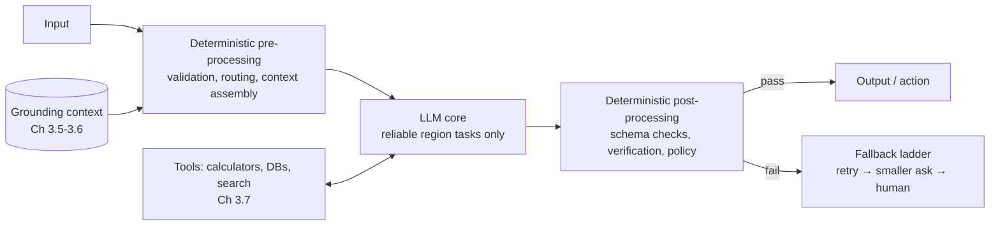

# Chapter 3.1 — LLMs: Capabilities, Limits & Failure Modes

| | |
|---|---|
| **Part** | 3 — Core Building Blocks of Generative AI |
| **Maturity level** | 1 — Understand |
| **Difficulty** | Beginner–Intermediate |
| **Estimated study time** | 3 hours (reading 90 min, exercise 90 min) |
| **Prerequisites** | [Part 2](../part-2-artificial-intelligence/README.md), especially [2.4](../part-2-artificial-intelligence/chapter-04-nlp-essentials.md)–[2.6](../part-2-artificial-intelligence/chapter-06-training-finetuning-alignment.md) |

## Learning Objectives

After this chapter you will be able to:

1. State what LLMs reliably do well, and design systems that lean on those strengths.
2. Name the structural failure modes — hallucination, arithmetic and precision failures, recency limits, instruction drift, context brittleness — and trace each to its Part 2 mechanism.
3. Apply the capability heuristic: verify-cheap vs. verify-expensive tasks, and reversible vs. consequential outputs.
4. Write the "capability contract" for a proposed LLM feature: what the model is trusted with, what the system compensates for, and what is out of scope.

## Introduction

Part 2 built the machine; Part 3 uses it as a component. This first chapter is the component's datasheet — the honest one, written the way you'd want a power supply's datasheet written: not the marketing envelope but the operating region, the derating curves, and the failure modes under load.

The discipline this chapter installs is *capability realism*: LLMs are simultaneously the most general software component ever shipped and one whose failures are probabilistic, fluent, and confidently delivered (Chapter 2.4's objective; Chapter 2.6's trained polish). Systems that work treat the model as a brilliant, tireless, occasionally-wrong collaborator and architect the *occasionally-wrong* part; systems that fail treat it as an oracle. Every subsequent chapter in Part 3 is a technique for widening the trustable region — structure (3.4), grounding (3.5–3.6), tools (3.7), verification (3.8) — and they all start from an accurate datasheet.

## Business Motivation

Capability misjudgment burns money in both directions. **Overtrust** produces the incidents that freeze programs: the assistant that invented a refund policy customers then demanded be honored; the legal brief with confabulated citations; the support bot confidently wrong about a safety procedure. Each is the same root cause — an unverified generative output treated as fact in a consequential path — and each costs somewhere between an embarrassing correction and a regulatory event (Chapter 2.8's incident tax). **Undertrust** is quieter and larger: enterprises that pilot an LLM on the one task it's bad at (precise arithmetic over tables, say), conclude "it doesn't work," and forfeit the dozens of tasks where it would have printed value — summarization, drafting, extraction, classification, transformation — the workhorse capabilities that are individually unglamorous and collectively worth most of GenAI's enterprise value. The architect's capability map is the corrective for both: it routes the right tasks to the model, the wrong tasks away from it, and the borderline tasks into designs with verification — and it converts the steering committee's question from "does AI work?" to "which of our tasks sit in the trustable region?"

## Theory

### The reliable region

What LLMs do well enough to build on, with the mechanism that explains why:

- **Transformation** — the deepest strength: text in, changed text out. Summarize, translate, rewrite for audience, convert format, adjust tone. The task's ceiling is defined by its *input* (everything needed is present), which suppresses the failure modes that come from the model supplying content. If a task can be phrased as transformation, phrase it that way.
- **Extraction & classification** — pull fields, label intents, route documents (the language surface of Chapter 2.1's hybrid systems). Verification is often cheap (schema checks, spot audits — Chapter 2.7's programmatic rung), which makes these the safest first deployments.
- **Drafting** — first versions of anything: emails, reports, code, plans. The economics work because *editing is cheaper than authoring*; the design contract is that a competent human (or downstream check) owns the final artifact (draft-not-send, Chapter 7.5).
- **Fluent synthesis over provided context** — answer questions from documents *given to it* (the basis of RAG, 3.6). Distinct from answering from memory, and dramatically more reliable.
- **Instruction-following & judgment at scale** — apply a rubric, a policy, or a style guide to thousands of items with better consistency than a bored human (the basis of LLM-as-judge, 2.7 — with its calibration duties).
- **Code** — generation, explanation, transformation; strong because code is dense in training data *and* cheap to verify (it runs or it doesn't — the verify-cheap property at its purest).

### The structural limits

Each limit traces to a mechanism — which matters, because mechanism-rooted limits don't vanish with the next model release; they attenuate, and the architecture must own them:

- **Hallucination** — fluent, confident, unsupported content (Chapter 2.4: the objective optimizes plausibility; Chapter 2.6: alignment adds helpfulness pressure against "I don't know"). Worst on: specifics from memory (citations, numbers, names, URLs), sparse topics, and questions premised on false assumptions. Attenuated by grounding, never eliminated — [Glossary](../../GLOSSARY.md): *managed, not fixed*.
- **Arithmetic & precision** — token-by-token generation over a subword vocabulary (Chapter 2.4's character blindness) makes multi-digit arithmetic, exact counting, and precise string manipulation unreliable. The fix is architectural and total: route computation to tools (3.7) — calculators, code execution, databases. Never let the model *be* the calculator in a consequential path.
- **Recency & the knowledge cutoff** — the corpus ended on a date (Chapter 2.6, stage 1); everything after doesn't exist unless supplied. Structural reason RAG and tool-use exist.
- **Instruction drift & context brittleness** — long prompts with many rules see later or middle content under-weighted ("lost in the middle"); instructions compete with each other and with strong priors from training. More instructions ≠ more control (Vantora's 9K-token rule pile, Chapter 2.5); prioritized, tested, minimal prompts win (3.3).
- **Sycophancy & suggestibility** — the model bends toward the user's framing (2.6's alignment residue): leading questions get led answers, asserted falsehoods get accommodated. Design consequence: never use the model's agreement as validation, and treat user-supplied premises as untrusted (a cousin of the injection problem, 4.9).
- **Variance** — the same input can produce different outputs (sampling, 3.2), and *quality* varies across runs. Systems must be designed for the distribution, not the best sample the demo happened to show.

### The two-axis heuristic

The fastest capability triage an architect can run on any proposed LLM task:

| | **Verification cheap** | **Verification expensive** |
|---|---|---|
| **Output reversible / low stakes** | Green zone — automate freely (drafts, tags, internal search) | Yellow — automate with sampling audits (bulk enrichment, summaries at scale) |
| **Output consequential** | Yellow — automate with mandatory verification in the path (extraction → schema check → human on exceptions) | Red — human owns the output; model assists only (medical advice, legal filings, irreversible actions) |

Verification cost is the hidden variable that decides most designs: code and structured extraction are verify-cheap (hence early wins); open-domain factual prose is verify-expensive (hence the hallucination incidents cluster there). Chapter 3.8 reuses this exact grid for agent autonomy.

### The capability contract

The datasheet operationalized: for every LLM feature, one short section in the design doc stating (1) **trusted with** — the tasks in the reliable region this feature leans on; (2) **compensated by** — the mechanism-rooted limits in play and the architectural compensation for each (grounding, tools, schema validation, human review); (3) **out of scope** — what the feature must refuse or route away (Chapter 1.6's refusal boundary, here derived from capability rather than policy). The contract is the artifact that makes capability realism reviewable — and it's the first thing the [architecture review checklist](../../checklists/architecture-review-checklist.md) should find.

## Architecture Perspective

Capability realism has one big architectural consequence: **the LLM is never the whole system — it's the probabilistic core of a deterministic shell.** The shell is where reliability is manufactured:

Read it as a division of labor derived from the datasheet: everything the model is structurally bad at (facts from memory → grounding; computation → tools; format guarantees → post-validation; consequence → fallback and human paths) is *placed outside the model*, in components that are deterministic and testable. Two design rules follow. **Narrow the ask:** the shell should present the model with the smallest, most transformation-shaped task possible — "extract these five fields from this document" outperforms "handle this claim" by orders of magnitude in reliability, and decomposition (3.8's workflows) is how big jobs become small asks. **Design the fallback ladder before launch:** probabilistic components fail as a rate, not an event; every LLM call needs a defined behavior for bad output (retry with feedback → degrade to a simpler capability → escalate to a human) — the ladder is what makes a 97%-reliable core into a 99.9%-reliable system, and it's a design artifact, not an ops improvisation (Chapter 5.9 industrializes it).

## Real-world Example

**Corvid Logistics** (Chapters 1.4, 2.3) provides the two-column story. Their wins all sat in the reliable region: the customs-document extraction (transformation + extraction, verify-cheap via field validation against the tariff database) that Lena's bake-off built, and a later broker-email drafting assistant (draft-not-send; brokers edited and sent). Both shipped on schedule, both still run.

The instructive failure was the "duty calculator" proposal: let the assistant answer brokers' "what will this shipment cost?" questions end-to-end. The pilot demo dazzled — until the capability-contract exercise, run late, exposed that the task stacked three red flags: multi-step arithmetic over tariff tables (precision limit), answers from memory about rates that change monthly (recency limit), and consequential output (brokers quote customers on it — verify-expensive, high stakes: the red quadrant). The redesign kept the LLM but moved it to the shell's edges: the model *parsed the broker's question into a structured query* (extraction — green zone) and *explained the result in plain language* (transformation — green zone), while the actual computation ran in the deterministic tariff engine the company already trusted (the tool, 3.7). The wrapped version shipped with a one-line capability contract that became the team's template: *"Trusted with: understanding the question and explaining the answer. Not trusted with: computing the answer."* Broker satisfaction beat the pure-LLM pilot's scores — the explanations were as fluent, and the numbers were now always right.

## Hands-on Exercise

**Build the datasheet by breaking things.** Any capable LLM via API or chat. ~90 minutes.

1. **Probe the limits (40 min).** Construct and run one probe per failure mode, and record verbatim outputs: (a) hallucination — request a citation/URL for a plausible but obscure claim; (b) precision — 4-digit multiplication and a character-counting task; (c) recency — a question whose answer changed after the training cutoff; (d) instruction drift — a 15-rule prompt where rule 3 and rule 12 conflict; (e) sycophancy — assert a false premise confidently and ask a follow-up; (f) variance — one open-ended task, five runs, note the quality spread.
2. **Map to mechanism (20 min).** For each observed failure, write one line tracing it to its Part 2 mechanism (objective, tokenization, cutoff, alignment residue, sampling).
3. **Write a capability contract (30 min).** For a feature you might really build (or Corvid's duty-question assistant): trusted-with / compensated-by / out-of-scope, plus the two-axis grid placement and the fallback ladder in three lines.

**Acceptance criteria:**
- [ ] All six probes executed with recorded outputs; at least four produced the predicted failure
- [ ] Every failure traced to a named Part 2 mechanism, not just described
- [ ] Capability contract places the task on the two-axis grid and derives the design from the placement
- [ ] Fallback ladder has three rungs with concrete triggers

## Enterprise Considerations

The capability conversation inside an enterprise is as much expectation management as engineering. **Executive calibration:** leadership's mental model is set by consumer chat experiences — impressive breadth, invisible failure rate; the architect's standing job is replacing "does it work?" with the two-axis grid in every steering conversation (a one-slide artifact that reframes the whole portfolio). **Capability drift cuts both ways:** models improve across releases — last year's red-zone task may be yellow now, so capability contracts deserve revisit dates (Chapter 1.4's triggers) — but improvements also shift behavior (2.6's re-release problem), so the contract's *compensations* stay even when the failure rate drops; you de-risk by architecture, not by release notes. **Legal exposure maps the grid:** consequential-output cells are where disclaimers, human-review requirements, and record-keeping concentrate (2.8's oversight machinery); counsel should see the grid, not just the feature list. **And the portfolio view matters:** an enterprise's green-zone task inventory (summarization, extraction, drafting across every department) is usually worth more than its moonshot — the capability map doubles as a value-discovery instrument (Chapter 1.3's KPI trees, seeded from the green zone).

## Trade-offs

| Decision | Option A | Option B | Choose A when… | Choose B when… |
|----------|----------|----------|----------------|----------------|
| Task framing | Narrow, decomposed asks | One broad end-to-end ask | Default — reliability compounds per narrow step | Exploration/prototyping, or genuinely holistic judgment tasks with human review |
| Failure posture | Design fallback ladder up front | Ship and handle failures reactively | Any consequential path | Throwaway internal tools, explicitly labeled |
| Capability boundary | Model assists, deterministic system decides | Model decides end-to-end | Consequential + verify-expensive (red/yellow zones) | Green zone with monitoring |
| Undertrust vs. overtrust bias | Start conservative, expand with evidence | Start ambitious, retract on incidents | Regulated domains, external users | Internal tools with tolerant users and good telemetry |

## Common Mistakes

1. **Demo-region ≠ operating region** — judging capability from best-case samples (variance hides in demos; the distribution ships to production). Evaluate on the distribution (2.7), always.
2. **Letting the model be the calculator** — arithmetic, counting, precise lookups in consequential paths. Corvid's duty calculator is the canonical redesign; tools exist for this (3.7).
3. **Asking for facts from memory when context could be supplied** — the difference between hallucination-prone recall and reliable synthesis-over-context is *which architecture you chose*, not which model.
4. **Piling on instructions instead of testing them** — instruction drift means rule 23 isn't followed anyway; minimal, prioritized, eval-tested prompts (3.3) beat constitutions.
5. **Using model agreement as validation** — sycophancy makes "I asked it to double-check and it confirmed" worthless; verification must be independent (tools, retrieval, humans, or a differently-prompted check — never the same conversation).
6. **Writing the capability contract after the incident** — the contract is a design-time artifact; post-incident it's just the root-cause analysis with regrets.

## Best Practices

1. **Run the two-axis triage on every proposed LLM task** — thirty seconds that routes green-zone work to fast automation and red-zone work to assist-only designs.
2. **Phrase tasks as transformations over supplied content wherever possible** — it's the single highest-leverage reframing in applied LLM work.
3. **Put a capability contract in every design doc** — trusted-with / compensated-by / out-of-scope, with a revisit date; make it the review's first stop.
4. **Build the fallback ladder as a first-class component** — retry-with-feedback, degrade, escalate; test each rung like any other path.
5. **Compensate by mechanism, not by hope** — for each limit in play, name the architectural compensation (grounding/tools/validation/human) in the design; "the next model will be better" is not a compensation.
6. **Maintain the green-zone inventory** — a living list of verify-cheap, reversible tasks across the business; it's your value pipeline and your safest sequencing (Chapter 1.3).

## Architecture Checklist

For any feature with an LLM in the path:

- [ ] Task placed on the two-axis grid; design matches the quadrant
- [ ] Capability contract written: trusted-with / compensated-by / out-of-scope, with revisit date
- [ ] Every mechanism-rooted limit in play has a named architectural compensation
- [ ] Computation, exact lookup, and current facts routed to tools/retrieval, not model memory
- [ ] Fallback ladder defined with triggers; each rung tested
- [ ] Verification is independent of the generating conversation
- [ ] Evaluation covers the output *distribution* (variance), not showcase samples

## Interview Questions

1. *"What are LLMs actually good at, and what should never be delegated to them?"* — Strong answers give the reliable region (transformation, extraction, drafting, synthesis-over-context, judgment-at-scale) with the verify-cheap logic, and the structural limits with mechanisms — not a vibes-based list.
2. *"Why do LLMs hallucinate citations specifically?"* — Strong answers stack the mechanisms: plausibility objective + helpfulness pressure + specifics-from-memory being the sparsest, most confabulation-prone ask — and give the architectural answer (grounding with verifiable citations, 3.6).
3. *"A PM proposes an LLM feature that computes customer refunds conversationally. Respond."* — Strong answers run the triage out loud (arithmetic + consequential + verify-expensive → red), then redesign rather than refuse: model parses and explains, deterministic engine computes — Corvid's shape.
4. *"How do you design for a component that's right 95% of the time?"* — Strong answers reject the premise that 95% ships as-is: narrow the ask, add independent verification, build the fallback ladder, monitor the rate — the deterministic shell that turns a rate into an SLO.

## Further Reading

- Anthropic, *Building Effective Agents* (anthropic.com/engineering) — re-linked from Chapter 1.1; its "start simple, add autonomy only as needed" doctrine is this chapter's shell principle applied forward.
- Liu et al., *Lost in the Middle: How Language Models Use Long Contexts* (arxiv.org/abs/2307.03172) — the context-brittleness evidence base; read the figures.
- Kalai & Vempala, *Why Language Models Hallucinate* (and successor literature) — for the theoretical grounding that hallucination is structural, not incidental; skim for the argument shape.
- Your provider's model documentation and system-card (official docs) — the vendor's own statement of capabilities and limits; read it as a datasheet and test its claims against your probes.

## Summary

- LLMs have a **reliable region** — transformation, extraction, drafting, synthesis over supplied context, judgment at scale, code — and its common thread is *the input contains what's needed and the output is checkable*.
- The limits are **mechanism-rooted** (hallucination ← plausibility objective; precision ← tokenization; recency ← cutoff; drift ← attention over long instruction piles; sycophancy ← alignment) — they attenuate across releases but never vanish, so **architecture owns them**.
- Triage every task on **verification cost × consequence**; the quadrant dictates the design, from free automation to assist-only.
- Build the **deterministic shell**: narrow asks, grounding and tools for what the model lacks, post-validation, and a tested fallback ladder — that's how a 97% component becomes a 99.9% system.
- The **capability contract** (trusted-with / compensated-by / out-of-scope) makes all of this reviewable, and the rest of Part 3 supplies the compensations it references.

---

**Previous:** [Part 3 index](README.md) · **Next:** [Chapter 3.2 — Tokens, Context Windows & Sampling](chapter-02-tokens-context-sampling.md) · **Related:** [2.4 NLP Essentials](../part-2-artificial-intelligence/chapter-04-nlp-essentials.md), [2.6 Training, Fine-tuning & Alignment](../part-2-artificial-intelligence/chapter-06-training-finetuning-alignment.md), [7.5 Human-in-the-Loop Patterns](../part-7-enterprise-ai-architecture-patterns/README.md)
