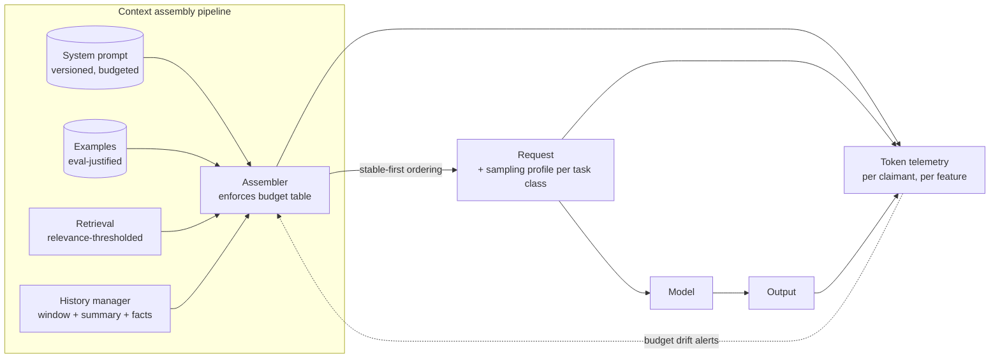

# Chapter 3.2 — Tokens, Context Windows & Sampling

| | |
|---|---|
| **Part** | 3 — Core Building Blocks of Generative AI |
| **Maturity level** | 2 — Build |
| **Difficulty** | Intermediate |
| **Estimated study time** | 3 hours (reading 90 min, exercise 90 min) |
| **Prerequisites** | [2.4 NLP Essentials](../part-2-artificial-intelligence/chapter-04-nlp-essentials.md); [2.5 The Transformer](../part-2-artificial-intelligence/chapter-05-transformer-architecture.md); [3.1](chapter-01-llm-capabilities-limits.md) |

## Learning Objectives

After this chapter you will be able to:

1. Manage the context window as a budget: allocate tokens across system prompt, examples, retrieved context, history, and output — and defend the allocation.
2. Set sampling parameters (temperature, top-p) deliberately per use case, and stop treating them as magic dials.
3. Design conversation-history strategies — truncation, compaction, summarization — that survive long sessions.
4. Convert token mechanics into operating policy: budgets in design docs, token telemetry in dashboards, context discipline in code review.

## Introduction

Part 2 explained tokens (2.4) and the window (2.5) as mechanisms; this chapter turns them into a management discipline. Every LLM call you will ever design allocates one scarce resource — context tokens — across competing claimants, and every output is drawn from a probability distribution whose shape you control with a handful of parameters. Most teams manage neither: prompts accrete (Vantora's 31K tokens, Chapter 2.5), history grows unbounded, temperature stays at the default because nobody owns it, and the resulting cost, latency, and variance surprises get blamed on the model.

This is the shortest-leverage chapter in Part 3: nothing here is deep, everything here is daily, and the difference between teams that practice it and teams that don't shows up directly on the invoice and the latency dashboard.

## Business Motivation

Token discipline is money with a small delay. The mechanisms from Chapter 2.5 price it: input tokens dominate real bills (10:1 to 50:1 input:output ratios), prefill drives time-to-first-token, and caching pays only for disciplined prompt structure — so an undisciplined context is simultaneously the biggest cost line, the biggest latency line, and a foregone discount. Concrete enterprise shape: a 20-person team's assistant at 5K conversations/day, carrying 8K tokens of unmanaged context per turn versus a budgeted 3K, is paying roughly 2.5× on the dominant cost line for *no measured quality gain* — typically five figures monthly, discovered at budget review. Sampling discipline is risk with a small delay: a temperature left high in an extraction pipeline manufactures variance exactly where the business wanted determinism (Chapter 3.1's variance limit, self-inflicted), and the resulting "the AI is inconsistent" complaint is a configuration bug wearing a capability costume. Both disciplines are free; both defaults are expensive.

## Theory

### The context window as a budget

Every request's window divides among five claimants, each with a different value curve:

1. **System prompt** — instructions, role, rules. High value per token *up to a point*, then instruction drift (3.1) sets in; the marginal rule is often net-negative. Stable → cache it (2.5's stable-first rule).
2. **Examples (few-shot)** — behavior demonstrations (3.3). Powerful, expensive (hundreds–thousands of tokens each), and stable → prime caching candidates. Their budget question: does example N still earn its tokens on the evals?
3. **Retrieved context** — the RAG payload (3.6). The claimant with the *most variable* value: a relevant chunk is the answer; an irrelevant one is noise that dilutes attention (2.5's lost-in-the-middle) and costs money. Relevance-thresholded, not fixed-k (Vantora's top-10→top-4 lesson).
4. **Conversation history** — the memory claimant, and the one that grows without governance. Strategies below.
5. **Output reservation** — the response needs room; long-output tasks (reports, code) need explicit reservation or they truncate mid-sentence.

The management artifact is a **token budget table** in the design doc — claimant, allocation, justification, owner — reviewed like any other budget (Chapter 2.5's checklist made concrete). The management *habit* is marginal-value questioning: for each claimant, what does the last thousand tokens buy on the eval suite? Teams that ask this quarterly run 2–4K-token prompts; teams that don't, run 20K.

### History strategies

Conversations outgrow windows; the strategy decides what survives:

- **Sliding window (truncate oldest)** — simple, predictable; loses early commitments ("I told you my account number at the start"). Fine for short transactional sessions.
- **Summarization/compaction** — periodically compress older turns into a summary the model wrote (Kestrel and Vantora both landed here). Preserves gist, loses verbatim detail — dangerous when exact earlier content matters (numbers, IDs, quoted policy); pair with…
- **Structured memory extraction** — pull load-bearing facts (entities, decisions, constraints) into a persistent structured store, re-injected as compact context. More engineering, best fidelity-per-token; this is the pattern agents' long tasks require (3.8, 4.6).
- **The honest hybrid** most production systems run: recent turns verbatim + rolling summary + extracted key facts, with the split points tuned on evals and the whole assembly *tested at the long-session boundary* — the place where history bugs live and demos never go.

### Sampling: the shape of the output distribution

The model outputs a probability distribution per token (2.4); sampling parameters decide how it's drawn from:

- **Temperature** scales the distribution's sharpness: near 0, always take the top token (as deterministic as the stack allows — caveat below); higher, spread probability toward alternatives (diversity, creativity, and error rate rise together).
- **Top-p (nucleus)** truncates the tail: sample only from the smallest token set covering probability p. In practice: set one of temperature/top-p per use case, leave the other near default, and *never* tune both blindly.
- **Working defaults by task**: extraction, classification, structured outputs, judging → temperature ≈ 0 (you want the mode, not the distribution); drafting and conversation → moderate (0.5–0.8 flavored to taste); ideation/creative variants → higher, with selection downstream. These are starting points to be eval-confirmed, not physics.
- **Two honesty notes.** *Determinism is approximate*: even at temperature 0, serving-stack realities (batching, floating point, provider changes) can vary outputs — design for idempotency by architecture (3.4's validation), not by sampling promises. And *sampling doesn't fix capability*: temperature 0 makes hallucinations consistent, not absent; the compensations remain architectural (3.1).

### Reasoning-token budgets

Modern models can spend tokens "thinking" before answering (extended reasoning modes, priced as output). Architecturally these are a *quality-latency-cost dial per request class*: generous budgets for hard analysis tasks, minimal for extraction and routing. The design mistake is uniformity — one global setting means overpaying on easy calls and underthinking hard ones; route by task class (Chapter 7.8's tiering logic, applied within a model).

## Architecture Perspective

Token flow is a system property, not a per-prompt property — the architecture view is the pipeline that *assembles* each request's context, with governance at each stage:

Three structural points. **The assembler is a real component** — the code that builds prompts deserves the same review, testing, and ownership as any service; most context pathologies (unbounded history, duplicate injections, budget-blind retrieval) are assembler bugs, and making it one component makes them findable. **Sampling profiles belong in configuration, not code** — a named profile per task class (`extraction: t=0`, `drafting: t=0.7`), versioned and centrally visible, ends the scattered-magic-numbers era and makes 3.10's model migrations testable. **Telemetry per claimant closes the loop** — a dashboard that shows tokens by component (system/examples/retrieval/history/output) per feature is what converts budget tables from documents into operating reality; Vantora's "prompt size on the dashboard" is this, decomposed to actionable granularity (which claimant grew?).

## Real-world Example

**Meridian Health Partners** (Chapters 1.5, 2.4) hit the history problem where it hurts: clinicians used the assistant in long shifts — sessions of 60+ turns — and two incidents arrived the same week. First, a nurse re-asked about a dosage discussed forty turns earlier; the sliding-window truncation had dropped it, the model answered *from memory instead of from the earlier grounded answer*, and the discrepancy (caught by the nurse — the human in the loop doing its job) triggered an incident review. Second, the cost dashboard flagged that long sessions were carrying 40K+ tokens of history per turn — the assistant was, per the review's phrase, "re-reading the whole shift to answer 'thanks.'"

The redesign was this chapter as a checklist. History became the honest hybrid: last 10 turns verbatim, a rolling clinical-session summary, and — the load-bearing piece — *structured fact extraction* for exactly the categories the incident exposed (medications and dosages discussed, patients referenced, open questions), re-injected every turn in under 400 tokens with provenance links back to the grounded answers. The token budget table went into the design doc (system 1.2K cached, facts 400, summary 600, verbatim ≤4K, retrieval ≤3K thresholded, output reserve 1.5K — under 11K worst-case, from 40K+). Sampling got profiles: the extraction pipeline had been running at the conversational default temperature — variance in *structured clinical fact extraction*, discovered only because someone finally looked — and went to 0. Cost per long session dropped 71%; the dosage-recall eval (a new long-session suite, because the old evals never crossed turn 15) went from failing to green. The review's one-liner joined the platform wiki: *"The window is a budget. Nobody had been signing the checks."*

## Hands-on Exercise

**Instrument, budget, and tune a real call path.** Any LLM API. ~90 minutes.

1. **Budget table (25 min).** For a chat assistant you'd build (or Meridian's): draft the five-claimant token budget with justifications, worst-case total, and cache-alignment ordering. State the marginal-value question you'd ask of each claimant at review.
2. **History stress test (30 min).** Simulate a 30-turn session (scripted user turns are fine) under (a) naive full history and (b) sliding window of 8 turns. Plant a critical fact at turn 3 and query it at turn 25 under both. Record token counts per turn and the fact-recall outcome. Sketch the hybrid strategy that fixes what (b) broke without (a)'s cost.
3. **Sampling profiles (25 min).** Run the same extraction task (pull 5 fields from a messy paragraph) 10× at temperature 0 and 10× at 0.9. Diff the outputs; count structural variance. Then run an ideation task ("five subject lines") at both and compare usefulness. Write the two-line profile policy your results justify.
4. **Telemetry sketch (10 min).** Define the per-claimant token dashboard: metrics, dimensions (feature, model, task class), and the two alerts you'd set first.

**Acceptance criteria:**
- [ ] Budget table covers all five claimants with worst-case arithmetic and cache ordering
- [ ] Stress test demonstrates the turn-3 fact failing under sliding window, with token-count evidence for why full history is unaffordable
- [ ] Sampling runs show measured variance at high temperature on extraction and justified diversity on ideation
- [ ] Dashboard sketch decomposes by claimant — not just total tokens

## Enterprise Considerations

At enterprise scale, token discipline becomes platform policy. **Budgets as guardrails:** the gateway (7.9) should *enforce* per-feature context ceilings and reject or truncate-with-alert over-budget requests — advisory budgets decay, enforced ones don't; pair with per-tenant/per-feature token quotas so one team's accretion can't consume shared provisioned throughput (5.4). **Profiles as governance:** sampling profiles centrally registered means audit questions ("was the clinical extraction deterministic?") have answers, and model migrations (3.10) re-validate a finite profile set rather than archaeology-in-code. **History retention is a privacy surface:** conversation memory — verbatim turns, summaries, extracted facts — is stored personal data with retention duties (4.14); the history strategy chosen here decides *what exists to be breached or subpoenaed*, and structured fact extraction needs the same classification discipline as any database of user statements (Meridian's medication facts are PHI, full stop). **And multilingual budgets differ:** 2.4's token inequity means the same budget table serves different effective content per language — per-language budget validation belongs in any multilingual rollout.

## Trade-offs

| Decision | Option A | Option B | Choose A when… | Choose B when… |
|----------|----------|----------|----------------|----------------|
| History strategy | Hybrid (verbatim + summary + facts) | Simple sliding window | Long sessions, load-bearing earlier facts | Short transactional sessions; engineering budget is tight |
| Context posture | Lean, budgeted, thresholded | Generous, "more context can't hurt" | Always at scale — cost, latency, *and* focus (lost-in-the-middle) | Never as policy; occasionally per-request for hard cases |
| Sampling for pipelines | Temperature ≈ 0 | Default/moderate | Extraction, routing, judging, anything schema'd | Human-facing prose where sameness reads robotic |
| Reasoning budget | Routed per task class | Uniform global setting | Mixed workloads (most systems) | Single-purpose systems with homogeneous difficulty |

## Common Mistakes

1. **Unbounded history** — the default of every naive chat implementation; cost grows linearly per turn, quality degrades via dilution, and the failure (Meridian's dropped dosage) hides past the demo horizon. Test at turn 40, not turn 4.
2. **Fixed top-k retrieval regardless of relevance** — paying for noise that actively dilutes attention. Threshold on relevance; let k vary (4.2 refines this).
3. **Default temperature in deterministic pipelines** — manufactured variance in extraction and judging; the cheapest bug fix in this curriculum.
4. **Budgetless prompts** — no table, no owner, no marginal-value review → monotonic accretion (2.5's barnacle dynamic). The budget table is one review-hour per quarter.
5. **Ignoring the output reservation** — long-form tasks truncating mid-answer because input claimants ate the window; reserve explicitly.
6. **Trusting temperature-0 determinism as a contract** — serving stacks vary; idempotency comes from validation and design (3.4), not sampling settings.
7. **Summarizing away load-bearing specifics** — compaction that loses the account number, the dosage, the quoted clause; extract structured facts *before* summarizing over them.

## Best Practices

1. **Ship a token budget table with every design** — five claimants, worst case, cache ordering, owner; review quarterly with the marginal-value question.
2. **Build context assembly as one owned component** — testable, reviewed, with the budget enforced in code.
3. **Register sampling profiles per task class** — versioned configuration, temperature 0 for pipelines by default, migrations re-validate the profile set.
4. **Run the long-session eval suite** — plant facts early, query late; the boundary where history strategies fail is a standing test, not an incident discovery.
5. **Decompose token telemetry by claimant** — the dashboard answers "which component grew?" or it answers nothing.
6. **Extract facts before you summarize** — structured memory for load-bearing specifics, prose summary for gist; provenance links so grounded answers stay grounded.

## Architecture Checklist

For any conversational or context-assembled LLM system:

- [ ] Token budget table exists: five claimants, justifications, worst-case arithmetic, owner
- [ ] Context assembly is a single owned, tested component; budget enforced, not advised
- [ ] Prompt ordered stable-first; cache hit rate on the dashboard (2.5)
- [ ] History strategy explicit and tested at long-session boundaries; load-bearing facts extracted structurally with provenance
- [ ] Sampling profiles registered per task class; pipelines at temperature ≈ 0; no magic numbers in code
- [ ] Output reservation explicit for long-form tasks
- [ ] Token telemetry per claimant per feature, with budget-drift alerts
- [ ] History stores classified and retention-governed as personal data where applicable

## Interview Questions

1. *"Your assistant's quality degrades in long conversations. Diagnose."* — Strong answers enumerate the history suspects in order: truncation dropping load-bearing facts, dilution/lost-in-the-middle from unbounded context, summary lossiness on specifics — and prescribe the hybrid with structured fact extraction, plus the long-session eval that should have caught it.
2. *"How do you decide what goes into the context window?"* — Strong answers present the five-claimant budget with marginal-value logic and cache-aware ordering, not "whatever seems relevant."
3. *"When do you change temperature, and what do you never expect it to do?"* — Strong answers give the task-class profiles (0 for pipelines, moderate for prose, high for ideation-with-selection), and the two disclaimers: approximate determinism, and no capability fixes — hallucination at temperature 0 is just consistent hallucination.
4. *"Walk me through cutting an assistant's token spend 50% without hurting quality."* — Strong answers work the claimants: cache the stable prefix, threshold retrieval, hybrid the history, trim eval-unjustified examples, reserve output — with evals gating each cut (Vantora and Meridian as reference shapes).

## Further Reading

- Your provider's context-window, prompt-caching, and sampling documentation (official docs) — the operational semantics this chapter manages; reread on every major model adoption.
- Liu et al., *Lost in the Middle* (arxiv.org/abs/2307.03172) — re-linked from 3.1 deliberately: it's the evidence base for lean-context posture.
- Holtzman et al., *The Curious Case of Neural Text Degeneration* (arxiv.org/abs/1904.09751) — the nucleus-sampling paper; read for why naive high-temperature sampling degrades.
- Anthropic's context-management engineering posts (anthropic.com/engineering) — practitioner patterns for compaction and long-running context; directly applicable to the history strategies here.

## Summary

- The context window is a **budget with five claimants** — system prompt, examples, retrieval, history, output reserve — each with a value curve, an owner, and a marginal-value question; the budget table is the artifact, per-claimant telemetry is the enforcement.
- **History needs a strategy**: sliding windows drop load-bearing facts, naive retention is unaffordable, summaries lose specifics — production systems run the hybrid (verbatim + summary + structured facts with provenance) and test at the long-session boundary.
- **Sampling is configuration, not magic**: temperature ≈ 0 for pipelines, moderate for prose, high only with downstream selection — registered as named profiles, never scattered in code; determinism is approximate and fixes no capability limits.
- **Reasoning budgets route by task class**, like every other quality-cost dial.
- The disciplines here are free and their absence is expensive — this chapter is the daily practice layer under everything Part 3 builds next, starting with the prompt itself (3.3).

---

**Previous:** [Chapter 3.1 — LLMs: Capabilities, Limits & Failure Modes](chapter-01-llm-capabilities-limits.md) · **Next:** [Chapter 3.3 — Prompt Engineering as an Engineering Discipline](chapter-03-prompt-engineering.md) · **Related:** [2.5 The Transformer](../part-2-artificial-intelligence/chapter-05-transformer-architecture.md), [4.11 Cost Engineering](../part-4-enterprise-genai-systems/README.md), [4.12 Latency & Performance](../part-4-enterprise-genai-systems/README.md)
