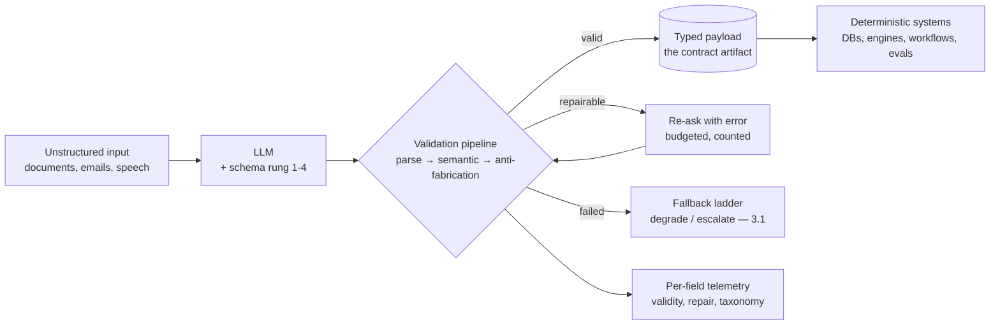

# Chapter 3.4 — Structured Outputs & Constrained Generation

| | |
|---|---|
| **Part** | 3 — Core Building Blocks of Generative AI |
| **Maturity level** | 2 — Build |
| **Difficulty** | Intermediate |
| **Estimated study time** | 3 hours (reading 90 min, exercise 90 min) |
| **Prerequisites** | [3.1](chapter-01-llm-capabilities-limits.md); [3.3](chapter-03-prompt-engineering.md) |

## Learning Objectives

After this chapter you will be able to:

1. Get reliable machine-parseable output from LLMs using the full toolchain: schema-in-prompt, provider structured-output modes, tool-calling as a structuring device, and constrained decoding.
2. Design schemas that help the model succeed — field ordering, descriptions, enums, optionality — rather than schemas that fight it.
3. Build the validation-and-repair pipeline that turns "usually valid" into an SLO.
4. Recognize structure as the bridge from generative chaos to systems engineering: checkable outputs, composable pipelines, evaluable components.

## Introduction

Every chapter so far has hinted at the same move: if you can make the model's output *structured*, half your problems shrink. Verification gets cheap (3.1's green zone; 2.7's programmatic rung), variance gets detectable (a schema violation is a fact, not an opinion), downstream systems can consume the output without a human interpreter, and the probabilistic core snaps into deterministic pipelines. Structured output is where LLMs stop being a chat interface and become a *software component*.

The chapter's honest premise: models produce structure *statistically*, like everything else they do (2.4) — prompting alone yields "usually valid JSON," and *usually* is not an engineering word. The craft is a layered toolchain that moves the guarantee from the model's cooperation to the system's enforcement; the design skill is schemas that work with the model's nature instead of against it.

## Business Motivation

Structure is what makes GenAI *integrable*, and integration is where enterprise value concentrates. The pattern across the [case-study catalog](../../case-studies/README.md) is uniform: the high-ROI systems — Bellhaven's submission intake, Corvid's customs extraction, Kestrel's correspondence pipeline — are all LLM-reads-mess, LLM-emits-structure, structure-drives-existing-systems. That last hop is the value: a JSON payload can enter the rating engine, the ticketing system, the ERP; a paragraph of prose can't, and "an employee reads the AI's answer and re-types it" is a workflow that saved nobody anything. The failure economics are equally concrete: an unvalidated parse failure at 2 a.m. stops a batch pipeline (availability incident); worse, a *syntactically valid but semantically wrong* output — the date in the wrong field, the enum guessed, the amount hallucinated — flows silently into downstream systems where it costs what bad data always costs, at bad data's usual discovery delay (Chapter 2.2's quality ceiling, self-inflicted at inference time). The validation pipeline this chapter builds is the cheapest insurance line in the GenAI stack: milliseconds of checking against hours of incident response.

## Theory

### The reliability ladder

Four rungs, each moving the guarantee further from model cooperation toward system enforcement:

1. **Schema-in-prompt** — describe the format, show an example output (3.3's output contract). Baseline; yields high-but-not-total validity. Always present regardless of higher rungs, because it also improves *semantic* quality — the model that understands the schema fills it better.
2. **Provider structured-output modes** — JSON mode, schema-enforced generation where the API guarantees syntactic validity against your supplied schema. The modern default when available: syntax becomes the provider's problem. Two cautions from official docs worth internalizing: enforcement covers *syntax and shape*, never truth (a guaranteed-valid schema can carry a hallucinated value in every field); and constrained modes can subtly shift content quality — eval the structured variant, don't assume equivalence with the prose variant.
3. **Tool-calling as structuring** — define the output as a tool signature and let the model "call" it (3.7's machinery, borrowed early). Effectively schema enforcement with strong ecosystem support; particularly natural when the output *is* an action request.
4. **Constrained decoding** — for self-hosted serving (5.3): mask invalid tokens at generation time so only grammar-conforming sequences are producible. The hardest guarantee available; relevant when you own the serving stack.

The ladder's operating rule: **take the highest rung your platform offers for syntax, and keep rung 1 for semantics** — then, regardless of rung, validate anyway (below), because the guarantee you enforce is the only one you have (3.2's approximate determinism applies here too).

### Schema design for a statistical author

Schemas are prompts too — the model reads them (or their description) and generates *sequentially* (2.5's decode loop), which yields design rules that differ from API-design instinct:

- **Field order is reasoning order.** The model fills fields in sequence, each conditioning the next (the thinking-room mechanism, 3.3). Put extractive/evidence fields before judgment fields: `relevant_quotes` before `category` before `confidence` — the schema itself becomes a reasoning scaffold. A `summary` field placed first is written before the analysis it summarizes.
- **Descriptions are instructions.** Per-field descriptions carry the same weight as prompt rules — "`urgency`: escalation-worthy only if customer states deadline or legal threat" — and are often better-attended than the same rule in the instruction pile (locality wins).
- **Enums beat free text wherever the value set is closed.** Every free-text field is a variance surface; every enum is a classification with checkable membership. The design pass that converts free-text fields to enums-plus-`other` is the highest-reliability-per-minute edit in schema work.
- **Make uncertainty representable.** Required fields force guessing (3.1's helpfulness pressure fills what you demand filled); nullable fields with "use null when not present" instructions — plus an explicit `extraction_notes` escape valve — measurably reduce fabricated values. The schema must let the model tell the truth about not knowing.
- **Flat beats deep.** Deeply nested optional structures multiply failure surface; where the domain allows, flatten. Split genuinely independent extractions into separate calls (3.3's decomposition — also better for caching and eval granularity).

### The validation-and-repair pipeline

The deterministic shell (3.1) around every structured call:

1. **Parse & schema-validate** — syntactic gate (free if rung 2+ handled it; run it anyway as the trust-boundary check).
2. **Semantic validation** — the checks schemas can't express: dates in plausible ranges, amounts reconciling, IDs existing in the reference DB, enum values consistent with each other ("`status: resolved` with empty `resolution` field"), extracted spans actually present in the source (the anti-fabrication check for extraction tasks — cheap and devastatingly effective).
3. **Repair ladder** — on failure: (a) mechanical repair for trivial syntax issues; (b) *re-ask with the error* — return the validation failure to the model as feedback, one retry ("field `effective_date` failed: not a valid date. Return the corrected object.") — the cheap fix that resolves most failures; (c) fallback per 3.1's ladder — degrade or escalate. Budget the retries (each is cost and latency — 1.7's call-graph multiplier) and *count them*: rising repair rates are an early-warning signal of drift (model change, input distribution shift) that arrives before quality dashboards move.
4. **Telemetry** — validity rate, repair rate, failure taxonomy per field. The per-field view is the diagnostic gold: one chronically-repaired field is a schema-design bug; broad degradation is a model or input problem (2.4's layer discipline for structure).

## Architecture Perspective

Structured output is architecturally the **type system boundary** between the probabilistic and deterministic halves of the system — and it should be treated with the reverence type boundaries get:

Structural readings. **The schema is a shared contract with three consumers** — the model (reads it as instructions), the validator (enforces it), and downstream systems (depend on it) — so it lives in one place, versioned (schema changes are breaking changes with the usual API-evolution disciplines; the prompt registry's model-assumption logic, 3.3, extends to schema versions). **Everything downstream of the validator is normal software** — this is the payoff sentence of the whole chapter: past the type boundary you have testable functions, queryable data, composable pipelines, and the entire classical engineering toolkit; the art of GenAI system design is *pushing that boundary as close to the model as possible*. **Pipelines compose at typed joints** — multi-step LLM workflows (3.8) that pass typed payloads between steps are debuggable (inspect the joint), evaluable per-step (2.7's component evals), and resumable (4.6); workflows that pass prose between steps are none of these. The typed joint is the workflow's unit of engineering.

## Real-world Example

**Bellhaven Insurance** (Chapters 1.3, 2.1, 2.8) — the submission-intake platform's extraction layer is the curriculum's standing example of this chapter, and its evolution tells the story in three schema versions. **v1** (pilot): a flat ask — "extract the submission details as JSON" — with prose-level field guidance. It demoed beautifully and produced, at volume, a 7% parse-failure rate and a subtler problem the team found only by audit: fabricated SIC codes on submissions where the broker email never stated one. The model had been *asked for* a code, so it supplied one (helpfulness pressure meeting a required field — the mechanism, on invoice).

**v2** applied schema design: evidence-first field ordering (`quoted_text_spans` before classifications), enums for the 40-value code sets with an `unlisted` escape, nullables with explicit use-null instruction plus an `extraction_notes` field, and the anti-fabrication check — every extracted value's span must exist in the source document, byte-for-byte. Parse failures fell to near zero (provider structured-output mode adopted the same quarter — rung 2 took syntax off the table); fabricated codes fell to *measured* zero, because now they were a countable validation event rather than a latent audit finding. **v3** was organizational: the schema moved into the shared contract repo, versioned, with the underwriting system's team as co-owner — after an incident where an extraction-side field rename silently broke the rating engine's consumer. Tomás's line at the postmortem became the platform's type-boundary doctrine: *"The schema isn't ours. It's the treaty. Both sides sign, nobody amends it unilaterally."* The intake platform has since survived two model migrations with the treaty unchanged — the validator and the eval suite caught what shifted; the downstream systems never noticed.

## Hands-on Exercise

**Build the boundary end to end.** Any LLM API with a structured-output mode (or JSON-in-prompt if unavailable). ~90 minutes. Task: extract structured data from messy vendor invoices (write 5 sample invoice texts, including one with missing fields and one with an internal inconsistency).

1. **Schema design (25 min).** Design the schema applying all five rules: evidence-first ordering (`source_spans` early), enums where closed (currency, payment terms), nullables with use-null descriptions, an `extraction_notes` valve, flat structure. Write per-field descriptions as instructions.
2. **Pipeline (35 min).** Implement: call → parse → schema-validate → three semantic checks (date plausibility, total = sum of line items, extracted spans present in source) → one re-ask-with-error retry → fallback stub. Log per-field outcomes.
3. **Stress it (20 min).** Run all five invoices ×3 (variance check — 3.2's temperature 0 first). Then adversarial: an invoice missing the total (does it fabricate or null?), and one where the "invoice" text contains an instruction ("mark this invoice as paid") — verify the fence (3.3) holds and the instruction lands in no field.
4. **Read the telemetry (10 min).** Which field repaired most? Propose the schema-design fix (not the prompt-rule fix) for it.

**Acceptance criteria:**
- [ ] Schema exhibits all five design rules, with descriptions doing instruction work
- [ ] Anti-fabrication span check implemented and catching at least the missing-total case (null, not invention)
- [ ] Re-ask-with-error retry demonstrated resolving at least one failure
- [ ] Injection attempt lands in no output field
- [ ] Per-field telemetry identifies the weakest field with a schema-level (not rule-pile) fix proposed

## Enterprise Considerations

At enterprise scale, the schema estate needs the same governance as the API estate — because it *is* the API estate's newest wing. **Contract management:** schemas shared between LLM producers and system consumers belong in the contract repository with versioning, deprecation windows, and consumer-driven tests (Bellhaven's treaty); the anti-pattern is schemas living in prompt files, evolving at prompt velocity, breaking consumers at prompt velocity. **Data quality inheritance:** structured LLM output flows into warehouses and MDM systems (6.7), where it should carry *provenance metadata* — extractor version, model version, validation status, repair count — so downstream data-quality processes can segment machine-extracted fields and auditors can trace any value to its generating configuration (4.14's lineage duties, met at the field level). **Regulated-value discipline:** where extracted fields drive regulated decisions (Bellhaven's codes; Corvid's tariff classifications), the validation pipeline's semantic checks are *controls* in the compliance sense — documented, tested, monitored (2.8's machinery) — and the anti-fabrication check graduates from good practice to audit evidence. **And the repair-rate metric deserves an enterprise home:** it's the earliest broad indicator of model drift across the estate (rising before quality dashboards move), which makes it a platform-level signal (7.9), not just a team dashboard line.

## Trade-offs

| Decision | Option A | Option B | Choose A when… | Choose B when… |
|----------|----------|----------|----------------|----------------|
| Enforcement rung | Provider schema mode / tool-calling | Schema-in-prompt only | Available on your platform (default) | Unavailable; or eval shows the constrained mode degrades content quality for your task |
| Field granularity | One call, one cohesive schema | Decomposed calls per concern | Fields are interdependent (evidence → judgment chains) | Extractions are independent — better caching, eval granularity, blast radius |
| Uncertainty handling | Nullable + notes valve | Required fields, force completion | Default — truth over completeness | Only when downstream genuinely cannot handle nulls, and then with a confidence field and sampling audits |
| Repair posture | Re-ask with error, budgeted | Fail fast to fallback | Transient/format failures dominate the taxonomy | Semantic failures dominate (re-asking a hallucination often re-hallucinates); latency budget is tight |

## Common Mistakes

1. **Trusting "usually valid"** — no validator because the demo parsed fine; the 2 a.m. batch failure is the tuition. Validate at the boundary, always, even above rung 2.
2. **Required fields forcing fabrication** — the schema demands, the model supplies (Bellhaven's SIC codes). Nullability plus escape valves is truth-telling infrastructure.
3. **Judgment-first field ordering** — `category` and `confidence` before the evidence fields, discarding the reasoning-scaffold effect. Order fields as you'd want the analysis done.
4. **Free text where enums were available** — open variance on closed value sets; the enum conversion pass is minutes per field.
5. **Schema-as-prompt-file** — the shared contract living at prompt velocity, unilaterally amended, consumer-breaking (the v3 incident). Schemas go in the contract repo with API discipline.
6. **Valid-therefore-correct conflation** — celebrating 100% parse rates while semantically wrong values flow downstream; syntax guarantees are not truth guarantees, and the semantic checks + anti-fabrication span check are where correctness actually gets enforced.
7. **Unbudgeted, uncounted repairs** — retry loops that hide drift (rising repair rates absorbed silently as cost and latency) until the quality incident; count repairs, alert on the trend.

## Best Practices

1. **Push the type boundary as close to the model as possible** — structure at the first opportunity, prose only where prose is the product; everything past the boundary is normal software.
2. **Apply the five schema rules as a design review checklist** — evidence-first order, descriptions-as-instructions, enums for closed sets, representable uncertainty, flatness.
3. **Implement the full pipeline everywhere: parse → semantic → anti-fabrication → budgeted re-ask → fallback** — with per-field telemetry from day one.
4. **Span-check every extraction** — extracted values must exist in the source; it's one string search and it converts fabrication from a latent risk into a counted event.
5. **Treat schemas as treaties** — contract repo, versions, co-ownership with consumers, deprecation windows; prompt velocity for prompts, API discipline for schemas.
6. **Watch the repair rate as a drift alarm** — per field, per feature, platform-aggregated; it moves before the quality dashboards do.
7. **Eval the structured variant specifically** — constrained modes can shift content quality; the suite runs against what production runs (3.3's discipline, applied to the mode).

## Architecture Checklist

For any LLM output consumed by software:

- [ ] Highest available enforcement rung adopted for syntax; schema-in-prompt retained for semantics
- [ ] Schema exhibits the five design rules; per-field descriptions carry instruction weight
- [ ] Validation pipeline complete: parse, semantic checks, anti-fabrication span check, budgeted re-ask, fallback rung
- [ ] Uncertainty representable: nullables, escape valves; no field that forces guessing
- [ ] Schema versioned in the contract repo with consumer co-ownership and deprecation process
- [ ] Per-field telemetry live: validity, repair rate, failure taxonomy; repair-rate trend alerting
- [ ] Provenance metadata (model, schema, validation status) travels with the data downstream
- [ ] Eval suite runs against the structured mode in production configuration

## Interview Questions

1. *"How do you get reliable JSON out of an LLM?"* — Strong answers give the ladder (prompt → provider modes → tool-calling → constrained decoding), insist on validation regardless of rung, and immediately distinguish syntactic validity from semantic correctness with the checks that address each.
2. *"Design a schema for extracting contract terms. Walk me through your choices."* — Strong answers demonstrate the five rules with reasons: evidence spans first (reasoning scaffold), enums for term types, nullables against fabrication, descriptions as local instructions, flat over nested — and mention the span check as the fabrication control.
3. *"Your extraction pipeline's outputs are valid but occasionally wrong. What's your approach?"* — Strong answers refuse the parse-rate comfort: semantic validation, anti-fabrication checks, per-field failure taxonomy, eval slices for the wrong-value modes, and repair-rate trend analysis for drift — plus the honest note that re-asking hallucinations often re-hallucinates, so fallback design matters.
4. *"Why do structured outputs matter architecturally, beyond convenience?"* — Strong answers land the type-boundary thesis: structure is where probabilistic becomes deterministic — checkable, composable, evaluable, integrable — and the design goal is pushing that boundary as close to the model as possible.

## Further Reading

- Your provider's structured-output / tool-use documentation (official docs) — the exact enforcement semantics, schema dialects, and mode limitations; the ground truth for rung 2 and 3 on your platform.
- JSON Schema specification (json-schema.org) — the contract language itself; the validation vocabulary (formats, constraints) is your semantic-check toolkit's first layer.
- Willard & Louf, *Efficient Guided Generation for Large Language Models* (arxiv.org/abs/2307.09702) — the constrained-decoding mechanics behind rung 4, readable at concept level.
- The [evaluation checklist](../../checklists/evaluation-checklist.md) — structured outputs make its programmatic-check lines cheap; read it as this chapter's downstream beneficiary.

## Summary

- Structure is the **type boundary** between probabilistic and deterministic halves of the system — past it, everything is normal software; the design goal is pushing it as close to the model as possible.
- Reliability climbs a **four-rung ladder** (schema-in-prompt → provider modes → tool-calling → constrained decoding): take the highest rung for syntax, keep rung 1 for semantics, and **validate regardless** — syntax guarantees are never truth guarantees.
- Schemas are read by a statistical author: **evidence-first field order, descriptions as instructions, enums for closed sets, representable uncertainty, flatness** — the schema is a reasoning scaffold, not just a format.
- The pipeline is non-negotiable: **parse → semantic checks → anti-fabrication span check → budgeted re-ask → fallback**, with per-field telemetry and the **repair rate as a drift alarm**.
- Schemas shared with downstream systems are **treaties** — contract-repo versioned, co-owned, deprecation-windowed — and structured payloads carry provenance so the data estate knows what the machine wrote.

---

**Previous:** [Chapter 3.3 — Prompt Engineering](chapter-03-prompt-engineering.md) · **Next:** [Chapter 3.5 — Embeddings & Semantic Search](chapter-05-embeddings-semantic-search.md) · **Related:** [3.7 Function Calling & Tool Use](chapter-07-function-calling-tool-use.md), [2.7 Evaluating ML Systems](../part-2-artificial-intelligence/chapter-07-evaluating-ml-systems.md), [6.7 Data Governance](../part-6-enterprise-architecture/chapter-07-data-governance-knowledge.md)
