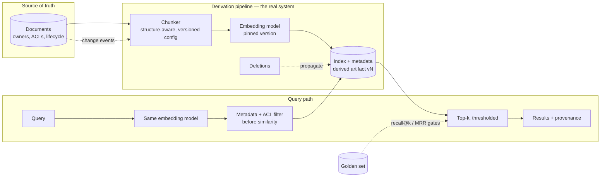

# Chapter 3.5 — Embeddings & Semantic Search

| | |
|---|---|
| **Part** | 3 — Core Building Blocks of Generative AI |
| **Maturity level** | 2 — Build |
| **Difficulty** | Intermediate |
| **Estimated study time** | 4 hours (reading 90 min, exercise 2.5 h) |
| **Prerequisites** | [2.4 NLP Essentials](../part-2-artificial-intelligence/chapter-04-nlp-essentials.md); [3.2](chapter-02-tokens-context-sampling.md) |

## Learning Objectives

After you complete this chapter you will be able to:

1. Build a working semantic search index: chunking, embedding, storage, similarity query — and explain every choice in it.
2. Choose chunking strategies deliberately (size, overlap, structure-awareness) and know why chunking is the highest-leverage quality decision in the pipeline.
3. Measure retrieval quality with recall@k and MRR against a golden set — before any generation is involved.
4. Operate embeddings as versioned infrastructure: model pinning, re-embedding, index lifecycle, and the metadata that makes retrieval governable.

## Introduction

Chapter 2.4 established what embeddings are — learned representations where semantic similarity becomes geometric proximity — and why they're rented artifacts with training-data blind spots (languages, domains). Chapter 2.3 established the mechanism (representation learning) and the discipline (embedding models are models: versioned, with re-embedding as the refresh path). This chapter builds the *system* around them.

Semantic search is the first multi-component system in Part 3, and the quiet foundation of the era's dominant architecture: RAG (3.6) is semantic search with a generator bolted on, and most "AI can't find anything" complaints are retrieval failures wearing a generation costume (Meridian's Vietnamese incident, 2.4). This chapter isolates retrieval so you learn it as its own discipline — with its own quality metrics, its own failure modes, and its own operational lifecycle — before the generator arrives to blur the diagnosis.

The chapter's through-line is unglamorous and decisive: **the quality of semantic search is determined mostly upstream of the vector math** — in chunking, metadata, and embedding-model fit — and measured mostly by disciplines you already own (2.7's golden sets and metrics). Teams that internalize this ship retrieval that works; teams that don't, tune similarity thresholds forever.

## Business Motivation

Enterprise search is a long-standing, quantified pain: knowledge workers spend a fifth or more of their time looking for information that exists, and classical keyword search over enterprise corpora has disappointed for decades because *people don't remember the words documents used* — they remember meanings. Semantic search is the first technology that closes that gap at commodity cost, which is why internal knowledge retrieval ([P05](../../projects/README.md)) is the most common first GenAI deployment and among the most reliably valuable: verify-cheap (the user sees the sources — 3.1's green zone), incremental (works alongside existing search), and foundational (the same index powers the RAG systems that follow). The failure economics are proportionate: a retrieval layer that misses 30% of relevant documents caps every downstream system at 70% — no prompt, model, or generation cleverness recovers what retrieval never surfaced — which makes retrieval quality the *binding constraint* on most GenAI investments and its measurement (cheap, this chapter) the highest-information eval money buys.

## Theory

### The pipeline

Semantic search is four stages, each a quality lever:

1. **Chunking** — split documents into retrieval units. The decisions: *size* (too large → multiple topics per vector, smeared meaning, wasted context budget when retrieved; too small → fragments without enough context to be understood or to answer anything; working range for prose: a few hundred tokens), *overlap* (adjacent-chunk overlap insures against boundary-split facts; costs index size), and — the lever that outweighs both — *structure-awareness*: split on real boundaries (sections, headings, paragraphs, table rows, clause boundaries in contracts) rather than fixed character counts, and keep structural context *with* the chunk (the section heading, the document title, the effective date — a chunk that says "the deductible is $500" is dangerous without "Policy form B, effective 2024" attached). Chunking is where domain knowledge enters the pipeline; it is document-type-specific by nature, and generic splitters are the pipeline's most common silent quality ceiling.
2. **Embedding** — each chunk through the embedding model (2.4's selection discipline: bake-off on *your* corpus and languages, BM25 in the lineup) into a vector. Also embedded: the *query*, at search time, by the same model — the symmetry that makes matching work, and the reason embedding-model changes require full re-embedding (a query in model-B space finds nothing useful in a model-A index).
3. **Indexing & storage** — vectors plus, critically, **metadata**: source, date, language, access-control labels, document type, structural context. Approximate nearest-neighbor indexes (HNSW-family) make similarity search fast at scale — the mechanics are Chapter 5.6's subject; what matters architecturally here is that **metadata filtering is applied *before or during* similarity search** (filter to the tenant, the ACL scope, the date range — *then* rank by similarity), because filtering after retrieval means the top-k was consumed by documents the user couldn't see, and relevant accessible ones never surfaced. Tenancy and permissions live in this stage or nowhere (4.1 raises the stakes).
4. **Query & ranking** — embed the query, retrieve top-k by similarity, return with scores. First-order knobs: k and the similarity threshold (relevance-thresholded beats fixed-k — 3.2), both tuned on the golden set, not guessed. Second-order improvements — hybrid lexical+semantic, reranking, query rewriting — are Chapter 4.2's subject; this chapter's discipline is making the *first-order* pipeline measurable and sound, because the advanced layers amplify a good foundation and merely decorate a bad one.

### Measuring retrieval — before generation

Retrieval is a ranking problem with mature metrics (2.7's classification toolkit, adapted), and it must be measured *in isolation*:

- **The golden set**: queries paired with the chunks/documents that should be retrieved — built from real user questions (or 1.6's workshop method), including hard negatives (documents that look relevant but aren't — the near-miss policy version, the superseded procedure), versioned like any eval asset.
- **Recall@k** — of the relevant items, how many appear in the top k? The headline metric, because it bounds everything downstream: if recall@5 is 0.6, your RAG system starts 40% blind.
- **MRR (mean reciprocal rank)** — how high does the first relevant item rank? Matters because context position matters (2.5's lost-in-the-middle) and because k budgets are token budgets (3.2).
- **The diagnostic split**: when end-to-end quality is bad, retrieval metrics *localize the fault* — good recall + bad answers = generation problem (3.6's territory); bad recall = this chapter's territory, and the failure taxonomy continues downward: is it chunking (the answer exists but was split/contextless), embedding fit (query and document phrasings don't land near each other — 2.4's domain/language gaps), metadata (filtered out wrongly), or corpus (the answer isn't there — a content gap, not a search gap)? Each has a different owner and fix; the taxonomy prevents the eternal wrong move of tuning thresholds against a chunking problem.

### The operational lifecycle

Embeddings are infrastructure with a lifecycle (2.2's refresh path, instantiated):

- **Versioning** — embedding model + chunking config + index build = one versioned artifact set; any component change rebuilds the set (Bellhaven's treaty logic applied to the index).
- **Freshness** — documents change; the pipeline that detects changes and re-chunks/re-embeds *incrementally* is a real system with real failure modes (missed updates = stale answers with confident citations). Freshness SLA is a requirement (1.6), not an aspiration.
- **Deletion** — right-to-be-forgotten and document retirement must propagate to chunks and vectors ([RAG checklist](../../checklists/rag-design-checklist.md)); orphaned chunks of deleted documents are a compliance incident in waiting (4.14).
- **Cost & scale** — embedding cost is linear in corpus size and *recurring* (every re-embedding, every model upgrade); index memory/storage scales with vectors × dimensions; both belong in the 1.7 cost model at 1× and 10× corpus.

## Architecture Perspective

Semantic search's architecture lesson is that **the index is a derived, rebuildable artifact — and the pipeline that derives it is the real system**:

Design consequences. **Rebuildability is the escape hatch for every mistake** — wrong chunking, wrong model, wrong metadata schema are all recoverable *if* the pipeline is automated and the source of truth is clean; teams that hand-curated their index are trapped by their first bad decision (and the embedding-model upgrade, which *will* come — 2.4's version discipline — becomes a planned rebuild rather than a crisis). **The query path and derivation path share exactly one contract** — the embedding model version and the metadata schema; drift between them (query embedded with model B against a model-A index; a filter field the chunker stopped populating) is the class of bug that returns *plausible wrong results* rather than errors, which is why the versioned-artifact-set discipline is load-bearing. **ACL filtering placement is a security architecture decision made here** — before-similarity filtering at the index level, with the user's permissions resolved at query time; every alternative (post-filtering, separate "cleaned" corpora that drift, trusting the generator to withhold) has failed publicly and repeatedly (4.1 and the [security checklist](../../checklists/security-checklist.md) inherit this line).

## Real-world Example

**Halvard & Roth** (Chapters 1.7, 2.7) built firm-wide semantic search over matter documents as the foundation for their contract-analysis ambitions — and their first index was a textbook of upstream failures diagnosed by downstream symptoms. Associates reported the system "found the wrong versions of everything": queries about current clauses surfaced superseded drafts; questions about specific matters returned similar clauses from *other clients' matters* (caught in pilot, before it became the confidentiality incident it would have been — the post-hoc ACL filter was consuming top-k slots with documents the associate couldn't open, and worse, revealing their existence).

The rebuild, led by the same Yusuf of the estimation and eval stories, worked the taxonomy. Chunking went structure-aware: contracts split on clause boundaries with the clause number, defined-term context, document date, and *matter ID* attached to every chunk — the generic 1,000-character splitter had been cutting clauses mid-sentence and orphaning "the foregoing notwithstanding" fragments that embedded as noise. ACL and matter-scoping moved to before-similarity filtering, resolved from the DMS permissions at query time (the walls the firm already maintained, finally respected by the new system). Version-awareness became metadata: `superseded_by` fields, with the default filter excluding superseded drafts and an explicit toggle for the associates whose work *was* draft archaeology. And the golden set — 150 real associate queries with partner-adjudicated relevant chunks, hard negatives deliberately including superseded versions — turned the rebuild from faith into measurement: recall@5 went from 0.58 to 0.86, and the metric became the standing gate for every subsequent pipeline change. Yusuf's summary at the practice-group demo: *"We didn't touch the vector math. We fixed what we fed it and what we filtered. The math was never the problem."*

## Hands-on Exercise

**Build and measure a real index.** Any embedding API + any vector store (a local library suffices). Corpus: 30–50 real documents you can use (project docs, public policies, manuals). ~2.5 hours.

1. **Two chunkers (40 min).** Implement (a) naive fixed-size (500 tokens, no overlap, no context) and (b) structure-aware (split on headings/paragraphs, 15% overlap, heading + doc title prepended to each chunk, source/date metadata attached). Index both with the same embedding model.
2. **Golden set (30 min).** Write 20 realistic queries with judged relevant chunks (spend the time — this artifact outlives the exercise). Include 3 hard negatives (superseded/near-miss content) and 2 queries whose answers *aren't in the corpus*.
3. **Measure (30 min).** Recall@5 and MRR for both indexes. Then run the no-answer queries and observe what similarity scores come back — set the relevance threshold that would have refused them, and re-measure recall at that threshold.
4. **Diagnose (30 min).** For every miss in the better index, assign the taxonomy bucket (chunking / embedding fit / metadata / corpus gap) with one line of evidence. Fix the largest bucket's top issue; re-measure.
5. **Lifecycle drill (20 min).** Change one source document; walk your re-embedding path (even manually) and verify the index updates *and* the old chunks are gone. Delete a document; verify no orphan chunks answer for it.

**Acceptance criteria:**
- [ ] Structure-aware chunking measurably beats naive on recall@5 (it will; quantify it)
- [ ] Threshold chosen from the no-answer queries' score distribution, with the recall trade measured
- [ ] Every miss taxonomized with evidence; one fix executed and re-measured
- [ ] Deletion leaves no orphaned chunks (prove it with a query)
- [ ] Golden set versioned and kept — 3.6's exercise builds on it

## Enterprise Considerations

Enterprise semantic search is where the data estate's chronic conditions become acute. **The corpus is the product:** index quality inherits document quality — duplicates, obsolete versions, and ungoverned copies (the SharePoint pathology) surface *verbatim* in results, which makes semantic search deployments involuntary data-governance audits (6.7); the mature move is treating the findings as the governance business case rather than the search project's embarrassment. **Permissions are usually the schedule risk:** resolving "who may see this document" across DMS, wiki, file shares, and legacy systems into query-time ACL filters is routinely the longest workstream (1.7's calendar-time items) — start it first, and treat any corpus whose permissions can't be resolved as *out of scope* rather than approximately included. **Embedding residency:** sending the corpus through an external embedding API is a data-processing event with residency and vendor-terms implications (4.14) — for sensitive corpora, self-hosted embedding models (5.3) are a common compromise since embedding models are small enough to make it practical. **And index sprawl arrives fast:** every team building its own index over the same documents multiplies cost, staleness bugs, and ACL re-implementations — the shared retrieval service is among the first platform components enterprises should centralize (7.9, and P12's ingestion platform).

## Trade-offs

| Decision | Option A | Option B | Choose A when… | Choose B when… |
|----------|----------|----------|----------------|----------------|
| Chunk size | Smaller (precise, context-poor) | Larger (contextual, smeared) | Factoid lookup, tight token budgets | Discursive content where answers span paragraphs — and tune on the golden set, not on priors |
| Chunking strategy | Structure-aware, per document type | Generic fixed-size | Default for any corpus that matters | Throwaway prototypes; genuinely structureless text |
| Embedding hosting | Managed API | Self-hosted model | Default: no ops burden | Residency/sensitivity constraints; very high re-embedding volume |
| Index freshness | Event-driven incremental updates | Scheduled full rebuilds | Sources emit change events; freshness SLA is tight | Small corpora where nightly rebuilds are cheap and simple wins |

## Common Mistakes

1. **Generic chunking on structured documents** — contracts, policies, and manuals split at character counts, orphaning clauses from their context; the single most common silent ceiling on retrieval quality.
2. **Chunks without provenance context** — "the deductible is $500" with no policy, version, or date attached; dangerous in retrieval, catastrophic when a generator cites it (3.6).
3. **Post-similarity ACL filtering** — top-k consumed by inaccessible documents, existence leakage, and missed accessible results; filter before or during, at the index.
4. **Tuning thresholds against a chunking problem** — the taxonomy exists to prevent exactly this; localize the fault class before turning knobs.
5. **No golden set** — retrieval "evaluated" by trying a few queries and nodding; recall@k on 100+ judged queries is cheap and it is the *binding-constraint* measurement of the whole GenAI investment.
6. **Embedding-model change without full re-embedding** — model-B queries against a model-A index: plausible, wrong, and silent; the versioned artifact set is the guard.
7. **Deletion that doesn't propagate** — orphaned chunks answering for retired or right-to-be-forgotten documents; test deletion end-to-end, with a query, on a schedule.

## Best Practices

1. **Invest in chunking first** — structure-aware, per document type, with structural context and provenance metadata attached to every chunk; it outyields every downstream optimization.
2. **Build the golden set before the index ships** — real queries, judged chunks, hard negatives; recall@5 and MRR as standing gates on every pipeline change.
3. **Filter before similarity** — ACLs, tenancy, dates, versions at the index level, resolved at query time from the systems of record.
4. **Version the artifact set as one unit** — embedding model + chunker config + index; rebuild on any component change; keep the pipeline automated so rebuilds are boring.
5. **Threshold on relevance, calibrated from no-answer queries** — know what "nothing relevant" scores look like in your corpus, and refuse below it (the honesty that 3.6's refusal behavior depends on).
6. **Treat freshness and deletion as tested paths with SLAs** — change events to index updates, deletions to zero orphans, both verified continuously rather than assumed.
7. **Centralize retrieval early** — one governed index per corpus, shared as a service, before team-level sprawl bakes in.

## Architecture Checklist

For any semantic search or retrieval layer:

- [ ] Chunking is structure-aware per document type; every chunk carries structural context and provenance metadata
- [ ] Embedding model chosen by bake-off on own corpus/languages (BM25 baseline included), version pinned
- [ ] Metadata schema includes ACL labels, dates, versions, tenancy; filtering applies before/during similarity
- [ ] Golden set exists (real queries, judged chunks, hard negatives); recall@k and MRR gate pipeline changes
- [ ] Relevance threshold calibrated from no-answer score distributions; fixed-k avoided
- [ ] Artifact set (model + chunker + index) versioned as a unit; rebuild pipeline automated
- [ ] Freshness SLA defined and monitored; deletion propagation tested with queries
- [ ] Embedding and index costs modeled at 1× and 10× corpus (1.7)

## Interview Questions

1. *"Your RAG system gives bad answers. How do you determine whether retrieval or generation is at fault?"* — Strong answers isolate retrieval with recall@k against a golden set (good recall + bad answers → generation; bad recall → work the retrieval taxonomy: chunking, embedding fit, metadata, corpus gap), and refuse to tune anything before localizing.
2. *"Walk me through your chunking strategy for a corpus of insurance policies."* — Strong answers are structure-aware and domain-specific: clause/section boundaries, provenance context attached (form, version, effective date), overlap rationale, size tuned on a golden set — and name generic fixed-size splitting as the anti-pattern.
3. *"How do you handle document permissions in semantic search?"* — Strong answers put ACL labels in index metadata, resolve user permissions at query time, filter before similarity — and can explain the three failure modes of post-filtering (consumed top-k, existence leakage, missed results).
4. *"What breaks when you upgrade your embedding model, and what's your process?"* — Strong answers name the space incompatibility (full re-embedding, not incremental), the versioned artifact set, the golden-set regression gate, and the cost line the upgrade re-incurs — treating it as a planned rebuild with a bake-off justifying it (2.4).

## Further Reading

- Your embedding provider's model documentation and the MTEB leaderboard (huggingface.co/spaces/mteb/leaderboard) — for *shortlisting only*; the deciding eval is your own corpus bake-off (2.7's benchmark discipline applies verbatim).
- Malkov & Yashunin, *Efficient and robust approximate nearest neighbor search using HNSW graphs* (arxiv.org/abs/1603.09320) — the index structure under most vector stores; concept-level read, full mechanics in Chapter 5.6.
- The [RAG design checklist](../../checklists/rag-design-checklist.md) — this chapter implements its corpus, retrieval, and access-control sections; read it now as a preview of 4.1's full scope.
- Lewis et al., *Retrieval-Augmented Generation for Knowledge-Intensive NLP Tasks* (arxiv.org/abs/2005.11401) — the RAG paper, as the bridge to the next chapter.

## Summary

- Semantic search is a four-stage pipeline — **chunk, embed, index+metadata, query** — and quality is determined mostly **upstream of the vector math**: structure-aware chunking with provenance context is the highest-leverage decision in it.
- **Measure retrieval in isolation**: golden set with hard negatives, recall@k (the binding constraint on everything downstream), MRR, and the four-bucket failure taxonomy (chunking / embedding fit / metadata / corpus) that localizes faults before any knob turns.
- **Filter before similarity** — ACLs, tenancy, versions at the index level — or inherit the three failure modes of post-filtering, including the confidentiality incident.
- The index is a **derived, rebuildable artifact**; the derivation pipeline is the real system — versioned as one unit with the embedding model and chunker, with freshness and deletion as tested, SLA'd paths.
- Retrieval built and measured this way is the foundation the next chapter assembles into the era's defining architecture: **RAG** (3.6).

---

**Previous:** [Chapter 3.4 — Structured Outputs](chapter-04-structured-outputs.md) · **Next:** [Chapter 3.6 — RAG Fundamentals](chapter-06-rag-fundamentals.md) · **Related:** [2.4 NLP Essentials](../part-2-artificial-intelligence/chapter-04-nlp-essentials.md), [4.2 Advanced Retrieval](../part-4-enterprise-genai-systems/chapter-02-advanced-retrieval.md), [5.6 Vector & Search Infrastructure](../part-5-cloud-infrastructure-platform/chapter-06-vector-search-infrastructure.md)
