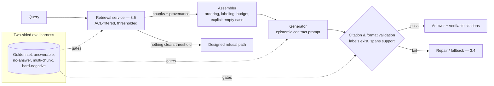

# Chapter 3.6 — RAG Fundamentals

| | |
|---|---|
| **Part** | 3 — Core Building Blocks of Generative AI |
| **Maturity level** | 2 — Build |
| **Difficulty** | Intermediate |
| **Estimated study time** | 4 hours (reading 90 min, exercise 2.5 h) |
| **Prerequisites** | [3.3](chapter-03-prompt-engineering.md); [3.5](chapter-05-embeddings-semantic-search.md) |

## Learning Objectives

After this chapter you will be able to:

1. Assemble the full RAG loop — retrieve, assemble, generate, cite — and explain what each stage contributes and can break.
2. Write the generation-side contract: grounding instructions, citation requirements, and refusal-on-no-context behavior.
3. Evaluate RAG with the two-sided discipline: retrieval metrics (3.5) plus generation metrics (faithfulness, answer relevance) — and localize failures across the seam.
4. Explain *why* RAG is the era's default knowledge architecture: freshness, permissions, auditability, and cost — not just accuracy.

## Introduction

Retrieval-Augmented Generation is the architecture this curriculum has been assembling piece by piece: the plausibility objective that makes ungrounded generation untrustworthy (2.4), the synthesis-over-context strength that makes grounded generation reliable (3.1), the context budget that retrieval must respect (3.2), the grounding prompt contract (3.3), and the measured retrieval layer (3.5). This chapter clicks the pieces together and adds the parts that only exist at the seam: context assembly, citation mechanics, refusal behavior, and two-sided evaluation.

A framing to install before the details: RAG is not "a way to make the model smarter." It is a **knowledge architecture decision** — the choice to keep knowledge *outside* the model, in systems that can be updated, permissioned, audited, and cited, and to bring it to the model per-request (2.6's sorting rule: knowledge → retrieval). Everything distinctive about RAG's enterprise dominance follows from that placement, not from accuracy alone.

## Business Motivation

RAG dominates enterprise GenAI for four business reasons, and accuracy is only the first. **Freshness:** the model's knowledge ends at its cutoff (2.6); the business's knowledge changes daily — RAG's answer reflects the price list as of this morning's re-index, at re-indexing cost rather than retraining cost. **Permissions:** an enterprise cannot serve one employee's knowledge to another (Halvard & Roth's matter walls, 3.5); RAG inherits document ACLs per-request — the *only* knowledge architecture that can, since weights (2.6) and prompts shared across users cannot. **Auditability:** "where did this answer come from?" has an answer — these chunks, this document, this version — which is the difference between deployable and undeployable in regulated contexts (4.14), and the mechanism behind citations users can verify (3.1's verify-cheap conversion: RAG turns open-domain answering from verify-expensive to verify-cheap by attaching the evidence). **Unit economics:** retrieving 3K relevant tokens beats stuffing 300K-token corpora into context (2.5's quadratic arbitrage) and beats fine-tuning's retraining treadmill on every knowledge change. The composite: RAG is usually the *cheapest system that can be made trustworthy* for enterprise question-answering — which is why it's the default, and why its failure modes (confidently citing stale or wrong context) matter enough to get this chapter's second half.

## Theory

### The loop

```
query → [retrieve] → chunks → [assemble] → prompt → [generate] → answer + citations → [verify/render]
```

- **Retrieve** — Chapter 3.5's pipeline, consumed as a service: ACL-filtered, relevance-thresholded, provenance-carrying chunks. Everything about its quality was determined there; this chapter *trusts but verifies* it (evaluation section).
- **Assemble** — the underrated stage. Decisions that live here: *ordering* (relevance-ordered, with the strongest evidence early — 2.5's attention position effects), *formatting* (chunks clearly delimited, labeled with their provenance — "Document: Policy B, §4.2, effective 2024-01" — so the model can cite and the fence holds, 3.3), *budget enforcement* (retrieval gets its 3.2 allocation; over-budget retrievals get truncated by relevance, never mid-chunk), and *the empty case* (when nothing clears the threshold, the assembler must say so explicitly to the generator — "no relevant documents found" — rather than passing an empty section the model will improvise past).
- **Generate** — the grounded prompt contract (3.3, now in full): answer *only* from the provided context; cite the provenance label for every factual claim; when the context doesn't contain the answer, say so in the designated refusal format — *don't supplement from memory*. That last clause is the load-bearing one: the model's parametric knowledge is the confound RAG exists to control, and the prompt must actively suppress it for claims of fact. (Nuance for practice: pure suppression is task-dependent — a coding assistant blends parametric skill with retrieved API docs legitimately; a policy assistant must not blend. State the epistemic contract per use case.)
- **Cite & verify** — citations rendered as *verifiable links to the chunk's source location*, not decorative bracketed numbers; and — the cheap check with outsized returns — **citation validation** in the shell (3.4's pipeline logic): does every cited label exist in the provided context? A model citing "Document 7" when six were provided is a caught hallucination; a fabricated-but-plausible citation is the RAG failure mode that destroys user trust fastest, and it's programmatically detectable (2.7's rung 1).

### The failure modes at the seam

RAG fails in ways neither pure retrieval nor pure generation exhibits:

- **Grounded-but-wrong** — retrieval surfaced a stale/superseded/wrong-jurisdiction chunk; generation faithfully cited it. The *system* lied with a verifiable citation. Fix is upstream (3.5's version metadata and filters), but detection needs end-to-end evals with hard-negative documents in the corpus.
- **Right-context-ignored** — the answer was in the provided chunks; the model answered from memory anyway (or blended). Detected by faithfulness evals; mitigated by the epistemic contract, evidence-first assembly, and — where stakes warrant — extraction-then-answer decomposition (quote the relevant spans first, then answer from the quotes: 3.4's evidence-first schema logic applied to generation).
- **Synthesis-across-chunks errors** — each chunk true, the combination wrong (two policy versions merged into a hybrid rule that exists nowhere). The taxonomy's hardest class; mitigated by version-consistent retrieval filters and surfaced by golden questions that *require* multi-chunk synthesis.
- **Refusal miscalibration** — both directions: improvising when it should refuse (threshold too low, contract too weak) and refusing when the answer was present (contract so aggressive the model won't commit — the over-refusal cousin of 2.6's alignment residue). Both are measurable: the no-answer queries and answerable queries in the golden set gate the two error rates respectively (2.7's precision/recall logic applied to refusal — this *is* Chapter 1.6's wrong-answer policy, made operational).

### Two-sided evaluation

RAG evaluation composes the disciplines you already have, plus seam metrics:

| Layer | Metric | Source |
|---|---|---|
| Retrieval | recall@k, MRR on golden set | 3.5, unchanged |
| Generation: **faithfulness** | every claim supported by provided context (rubric or judge — calibrated, 2.7) | the anti-hallucination metric |
| Generation: **answer relevance** | does it answer the question asked | distinct failure: faithful digression |
| Seam: **citation validity** | cited labels exist; cited spans support the claims | programmatic + judge |
| Seam: **refusal calibration** | improvise-rate on no-answer set; refusal-rate on answerable set | the two-sided error |

The operating discipline: **localize before fixing** (3.5's taxonomy, extended across the seam) — bad answers with good recall and low faithfulness → generation contract; bad answers with bad recall → 3.5's taxonomy; good faithfulness citing bad chunks → corpus/metadata. Teams without the split tune prompts against retrieval bugs and chunking against prompt bugs, forever.

## Architecture Perspective

RAG's architecture is the deterministic shell (3.1) at system scale — and its defining property is that **trust is manufactured at the seams, not in the model**:



Readings. **The assembler is the seam's owner** — a real component (3.2) with the ordering, labeling, budget, and empty-case logic in tested code; most "mysterious" RAG failures are assembler behaviors nobody owned. **The refusal path is designed, not emergent** — a distinct, styled, useful response ("I couldn't find this in the policy library — here's how to reach the policy team") triggered by the threshold, not left to whatever the model does with thin context; it's a *feature* with its own UX and its own eval line. **Citation validation is the trust gate** — programmatic, cheap, in the shell, catching the failure mode users forgive least. And **the loop generalizes**: swap the retrieval service's index for a database query, an API call, or a search engine and the same architecture — retrieve, assemble with provenance, generate under contract, validate citations — is how *every* grounded system works; RAG-over-documents is the special case you learn first (3.7's tool use generalizes the retrieve step; agentic retrieval in 4.2 makes the loop iterative).

## Real-world Example

**Meridian Health Partners** (Chapters 1.5, 2.4, 3.2) — the clinician assistant is this chapter's system, and its maturation traces the failure taxonomy. Launch quality was good: the 3.5-grade retrieval layer (structure-aware protocol chunking, ACL filtering) and a solid grounding prompt. Three incidents in the first two quarters built the rest of the architecture.

Incident one: **grounded-but-wrong**. A nurse followed a correctly-cited answer about a sedation protocol — from the *previous version*, updated six weeks earlier; the re-indexing pipeline had silently missed the update (a freshness failure, 3.5's lifecycle) and the citation's confidence made it worse. Fixes: freshness SLA monitoring with staleness alerts, `superseded_by` metadata with default filtering (Halvard & Roth's pattern), and — the seam-level addition — effective-date rendering *in the citation itself*, so the human in the loop could see "effective 2025-03" and judge. Incident two: **improvisation past thin context**. A question about a rare drug interaction cleared the relevance threshold with two marginally-related chunks; the model answered fluently, blending them with parametric knowledge. The blend was caught by a pharmacist, and the fix was three-layered: threshold recalibrated from the no-answer distribution (3.5), the epistemic contract hardened with extraction-then-answer for clinical queries (quote spans, then answer only from quotes), and the refusal path *designed* — the "not found" response now routes to the clinical pharmacology line with one tap, which turned refusals from dead ends into the assistant's most-praised behavior in the next user survey. Incident three: **the eval gap** — neither incident's class had been in the golden set. The set was rebuilt to the four-class structure (answerable, no-answer, multi-chunk synthesis, hard-negative with superseded versions planted), and faithfulness + citation-validity became release gates. The medical director's assessment, quoted in the platform's annual review: *"The system earned clinical trust the day it started saying 'I don't know — call pharmacy' instead of guessing beautifully."*

## Hands-on Exercise

**Assemble RAG on your 3.5 index.** Continues the previous chapter's exercise — same corpus, same golden set, extended. ~2.5 hours.

1. **The generator contract (30 min).** Write the grounded prompt (3.3's six components): epistemic contract (answer only from context; cite chunk labels; designated refusal format), delimited chunk section with provenance labels, extraction-then-answer structure for the response (quoted spans, then answer, then citations).
2. **The assembler (40 min).** Implement: relevance-ordered assembly with provenance labels, retrieval token budget (≤3K) with by-relevance truncation, and the explicit empty case below your 3.5 threshold routing to a designed refusal response.
3. **Citation validation (20 min).** Post-generation check: every cited label exists in the provided set; flag any answer whose claims cite nothing. Wire failures to one re-ask (3.4's ladder).
4. **Two-sided eval (45 min).** Extend your golden set to the four classes (add 3 multi-chunk synthesis questions; plant one superseded document as a hard negative). Run end-to-end; score faithfulness (rubric — judge yourself, or an LLM judge with your 2.7 caveats), citation validity (programmatic), and both refusal error rates. Produce the localization table: every failure assigned to retrieval / assembly / generation / corpus.
5. **Break it on purpose (15 min).** Feed a query whose answer exists only in your head, not the corpus — verify refusal. Then lower the threshold to zero and watch the improvisation return. You now know what the threshold buys.

**Acceptance criteria:**
- [ ] Epistemic contract produces refusals on no-answer queries and answers with valid citations on answerable ones — both rates measured
- [ ] Empty case is explicit and styled — not thin-context improvisation
- [ ] Citation validation catches a planted invalid citation (fabricate one to test the check)
- [ ] Hard-negative (superseded doc) either filtered by metadata or caught by the eval — you know which
- [ ] Localization table assigns every failure a layer with evidence

## Enterprise Considerations

Enterprise RAG concentrates the obligations of every layer it composes. **The trust chain must be complete to be worth anything:** document ACLs (3.5) → assembler provenance → validated citations → rendered source links — one broken link (a citation that renders but doesn't resolve; a chunk whose ACL label went stale) and the audit story collapses; end-to-end trust-chain testing belongs in the release gate, not the incident review. **Knowledge ownership becomes visible:** RAG answers are only as good as the corpus's owners keep it, which converts "whose document is this and when was it last reviewed?" from a governance nicety (6.7) into a production dependency — mature deployments surface document-owner and review-date *in the citation*, recruiting users into the freshness police. **Legal exposure moves to the corpus:** a customer-facing RAG system's answers are, functionally, publications of the corpus — stale policy chunks become misrepresentation risks (Chapter 3.1's invented-refund-policy incident, industrialized), which is why customer-facing deployments (CS09, CS32) pair RAG with tighter thresholds, narrower corpora, and human escalation than internal ones. **And the platform question arrives immediately:** most enterprises need many RAG applications over overlapping corpora — the shared retrieval service (3.5's centralization), the shared eval harness, and the shared assembler conventions are the difference between a RAG *capability* and twelve divergent RAG projects (7.2 catalogs the patterns; P06 builds the reference implementation).

## Trade-offs

| Decision | Option A | Option B | Choose A when… | Choose B when… |
|----------|----------|----------|----------------|----------------|
| Epistemic contract | Strict grounding (context-only for facts) | Blended (parametric + retrieved) | Policy/legal/clinical — anything with a corpus of record | Skill tasks (coding with docs); general assistance where the corpus is advisory |
| Refusal posture | Conservative threshold, rich refusal UX | Permissive threshold, more answers | Wrong answers cost more than no answers (1.6's policy) | Exploratory/internal use; strong human verification downstream |
| Generation structure | Extraction-then-answer (quote, then conclude) | Direct answer with citations | High stakes; faithfulness eval shows blending | Latency/cost-sensitive paths where direct performs on evals |
| Where to spend next | Retrieval quality (4.2's ladder) | Generation/prompt tuning | Recall is the binding constraint (it usually is) | Recall is high and faithfulness is the gap |

## Common Mistakes

1. **Treating RAG as a bolt-on** — "add a vector DB" without the assembler, the contract, the refusal path, or the two-sided evals; the demo works, the seams are unowned, the incidents are pre-scheduled.
2. **Decorative citations** — bracketed numbers that resolve to nothing verifiable, or aren't validated for existence; unverifiable citations are worse than none because they *borrow* trust.
3. **Improvisation past thin context** — no calibrated threshold, no explicit empty case; the model does what the objective does (2.4). Meridian's incident two is the standard form.
4. **The missing no-answer eval class** — golden sets built only from answerable questions measure everything except the failure users punish most; all four classes, always.
5. **Prompt-tuning retrieval failures** (and vice versa) — the seam makes misattribution easy and the localization table is the antidote; no fix ships without a layer assignment.
6. **Stale-index confidence** — freshness failures that ship correct-looking, well-cited, wrong answers; the SLA, the staleness alerts, and dates-in-citations are the package (grounded-but-wrong is a *system* lie, and the system must be built to blush).
7. **One RAG per team** — corpus, assembler, evals and ACL logic re-invented divergently; centralize the layers that are shared before sprawl calcifies.

## Best Practices

1. **Own the assembler** — ordering, labeling, budget, empty case in one tested component; it's the seam, and the seam is where RAG lives or dies.
2. **State the epistemic contract per use case** — strict grounding for corpora of record, declared blending where legitimate; never leave the parametric/retrieved boundary implicit.
3. **Design the refusal as a feature** — styled, useful, routed (Meridian's pharmacy line); measure both refusal error rates and treat them as the wrong-answer policy's operational form.
4. **Validate citations programmatically, always** — existence in-shell, span-support by judge where stakes warrant; render citations as resolvable links with dates.
5. **Run the four-class golden set as the release gate** — answerable, no-answer, multi-chunk, hard-negative; faithfulness and citation validity alongside 3.5's retrieval metrics.
6. **Localize before fixing** — the table with a layer assignment per failure is the diagnostic discipline that keeps both sides of the seam honest.
7. **Put freshness in the user's view** — effective dates in citations, staleness alerts in ops; recruit the humans into the trust chain.

## Architecture Checklist

For any RAG deployment:

- [ ] Retrieval layer meets 3.5's checklist (ACL-before-similarity, thresholds, golden set, lifecycle)
- [ ] Assembler owns ordering, provenance labeling, budget enforcement, and the explicit empty case
- [ ] Epistemic contract stated and eval-verified; extraction-then-answer where stakes warrant
- [ ] Refusal path designed, styled, routed, and measured in both error directions
- [ ] Citation validation in the shell; citations render as verifiable, dated source links
- [ ] Four-class golden set gates releases; faithfulness and citation validity scored (judge calibrated per 2.7)
- [ ] Failure localization table maintained; no fix without a layer assignment
- [ ] Trust chain tested end-to-end: ACL → provenance → citation → resolvable source
- [ ] Freshness SLA monitored; grounded-but-wrong class specifically evaluated (planted hard negatives)

## Interview Questions

1. *"Why did RAG become the default enterprise architecture — and what would make you *not* use it?"* — Strong answers give the four business reasons (freshness, permissions, auditability, unit economics) beyond accuracy, and the counter-cases: behavior problems (fine-tune — 2.6), skill tasks with no corpus of record, tiny stable corpora (long context), and knowledge that *is* the model's strength.
2. *"A user shows you a RAG answer with a perfect citation that's factually wrong. Diagnose."* — Strong answers enumerate grounded-but-wrong: stale index (freshness), superseded version (metadata), wrong-jurisdiction chunk (filtering), synthesis-across-chunks — and note that generation was *faithful*; the retrieval/corpus side owns it, and dates-in-citations plus hard-negative evals are the systemic fix.
3. *"How do you keep the model from answering out of its own head?"* — Strong answers stack the mechanisms: epistemic contract, evidence-first assembly, extraction-then-answer, calibrated refusal threshold with an explicit empty case, faithfulness evals as the measurement — and acknowledge suppression is per-use-case, not absolute.
4. *"What does a complete RAG evaluation look like?"* — Strong answers produce the two-sided table (retrieval metrics + faithfulness + answer relevance + citation validity + both refusal error rates), the four-class golden set, and the localization discipline — refusing end-to-end scores that can't assign failures to layers.

## Further Reading

- Lewis et al., *Retrieval-Augmented Generation for Knowledge-Intensive NLP Tasks* (arxiv.org/abs/2005.11401) — the origin paper; read for the framing, not the implementation details, which the field has since rebuilt.
- Your provider's RAG and citation guidance (official docs) — grounding-prompt patterns, citation APIs where offered, and context-formatting recommendations tuned to their models.
- The [RAG design checklist](../../checklists/rag-design-checklist.md) — this chapter and 3.5 implement most of it; 4.1–4.3 complete it at production scale.
- Es et al., *RAGAS: Automated Evaluation of Retrieval Augmented Generation* (arxiv.org/abs/2309.15217) — one systematization of the two-sided metric set; read critically with 2.7's judge-calibration discipline.

## Summary

- RAG is a **knowledge architecture decision** — knowledge outside the model, brought per-request — and its enterprise dominance rests on **freshness, permissions, auditability, and unit economics**, with accuracy as the fourth benefit, not the first.
- The loop is **retrieve → assemble → generate → cite/validate**, and the underrated stages are the seams: the **assembler** (ordering, labeling, budget, explicit empty case) and the **citation validator** (programmatic existence checks, resolvable dated links).
- The distinctive failure modes live at the seam — **grounded-but-wrong, right-context-ignored, cross-chunk synthesis errors, refusal miscalibration** — and each has a designed control and an eval class.
- Evaluation is **two-sided plus seam metrics**: retrieval's recall@k, generation's faithfulness and relevance, citation validity, and both refusal error rates — with **localization before fixing** as the operating discipline.
- The **refusal path is a feature**: designed, styled, routed, and measured — the system that says "I don't know — here's who does" earns the trust that guessing beautifully destroys.

---

**Previous:** [Chapter 3.5 — Embeddings & Semantic Search](chapter-05-embeddings-semantic-search.md) · **Next:** [Chapter 3.7 — Function Calling & Tool Use](chapter-07-function-calling-tool-use.md) · **Related:** [4.1 Production RAG Architecture](../part-4-enterprise-genai-systems/chapter-01-production-rag.md), [4.2 Advanced Retrieval](../part-4-enterprise-genai-systems/chapter-02-advanced-retrieval.md), [RAG design checklist](../../checklists/rag-design-checklist.md)
