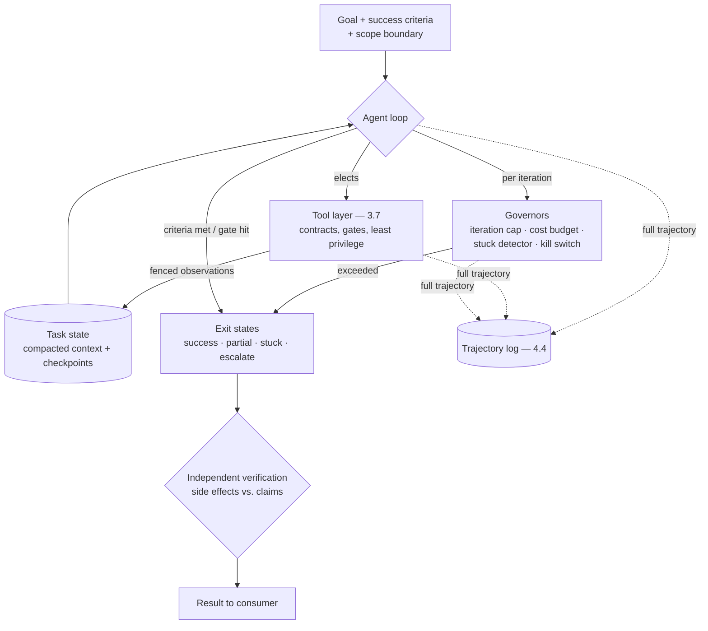

# Chapter 3.8 — Agents: Concepts & Control Flow

| | |
|---|---|
| **Part** | 3 — Core Building Blocks of Generative AI |
| **Maturity level** | 2 — Build |
| **Difficulty** | Intermediate |
| **Estimated study time** | 4 hours (reading 2 h, exercise 2 h) |
| **Prerequisites** | [3.1](chapter-01-llm-capabilities-limits.md); [3.7](chapter-07-function-calling-tool-use.md) |

## Learning Objectives

After this chapter you will be able to:

1. Draw the workflow↔agent spectrum precisely — who owns control flow — and place any proposed system on it deliberately.
2. Name the workflow patterns (chaining, routing, parallelization, orchestrator–workers, evaluator–optimizer) and compose them before reaching for autonomy.
3. Build a bounded agent loop: goal, tool elections, observation, iteration — with budgets, exit conditions, and checkpoints as first-class design elements.
4. Apply the autonomy decision rule: verifiability of success and cost of error determine how much control flow the model may own.

## Introduction

"Agent" is the most inflated word in the industry and one of the most useful concepts in this curriculum — this chapter's job is to deflate the word and keep the concept. The precise definition ([Glossary](../../GLOSSARY.md)): an **agent** is a system in which the *model* directs its own control flow — deciding which actions to take, observing results, iterating toward a goal. A **workflow** is a system where *your code* owns control flow and the model makes bounded decisions inside fixed steps. Everything between is a spectrum of delegated control, and the architect's question is never "should we build an agent?" but "**how much control flow should the model own, given how verifiable success is and what errors cost?**"

The chapter's doctrine, borrowed from the best practitioner guidance and validated by every production post-mortem in the field: **start with the simplest control flow that works, and add autonomy only when the task demonstrably requires it.** Most enterprise "agent" requirements are workflows wearing a fashionable name — and the systems that ship reliably are the ones whose builders knew the difference.

## Business Motivation

The economics of autonomy cut both ways, and both edges are sharp. The genuine promise: tasks that resist proceduralization — research across unpredictable sources, debugging, multi-system investigations where the next step depends on what the last one found — are exactly where fixed workflows fail and where an agent's dynamic control flow earns real money (a task no workflow could encode, automated at all, is infinite ROI against the alternative of a human doing every step). The genuine cost: autonomy multiplies every rate from Part 3 — an agent is N model calls where a workflow is three, so cost, latency, and error rates compound per iteration (a 97%-per-step system is a 74%-per-ten-step system before recovery); failures become *trajectories* (harder to debug than single calls — 4.4 builds the observability); and unbounded loops are unbounded invoices (1.7's runaway-task risk, now structural). The business rule that follows is the chapter's autonomy grid: **spend autonomy where verification is cheap and errors are recoverable; spend engineering (workflows) where they aren't.** Enterprises that inverted this — agents on consequential unverifiable tasks, workflows on tasks begging for exploration — produced both the incident reports and the missed opportunities that fill the [case-study catalog](../../case-studies/README.md).

## Theory

### The spectrum of delegated control

From left to right, the model owns more of the control flow:

1. **Single augmented call** — one model step with tools/retrieval (3.6, 3.7). Most tasks end here.
2. **Workflow patterns** — code owns the flow, models fill the steps:
   - **Prompt chaining** — fixed sequence, each step's typed output (3.4) feeding the next; use when the task decomposes cleanly (draft → check → format). Each step is separately evaluable (2.7's component discipline) — the reliability compounding works *for* you.
   - **Routing** — a classifier step (cheap model, temperature 0 — 3.2) directs to specialized handlers; use when inputs cluster into kinds needing different treatment (Bellhaven's tiered extraction, 1.4).
   - **Parallelization** — independent subtasks fan out concurrently (sectioning), or the same task runs multiple times for vote/merge (2.7's variance, harnessed); use for latency on independent parts or confidence on judgment calls.
   - **Orchestrator–workers** — a model *plans* the subtasks dynamically, workers execute them, code owns the dispatch and joins; the bridge pattern — dynamic decomposition without a free loop (4.5 scales it to multi-agent).
   - **Evaluator–optimizer** — generate, critique against criteria, regenerate; a *bounded* loop with a fixed exit (score threshold or max rounds); use when critique is reliably easier than generation (it usually is — 2.7's judge machinery, turned inward).
3. **The agent loop** — goal in; the model elects tools, observes, re-plans, iterates; exits on success, budget, or escalation. The model owns the flow between the guardrails you build.

The patterns compose: a router in front of an orchestrator whose workers are chains, with an evaluator gate at the end, is a normal production system — and still not an agent. Reach for the loop only when the *path itself* is undiscoverable in advance.

### The autonomy grid

Reusing 3.1's two axes, now deciding control flow:

| | **Success cheap to verify** | **Success expensive to verify** |
|---|---|---|
| **Errors recoverable** | **Agent territory** — code with tests, research with citations to check, drafts a human reviews | Workflows + sampling audits |
| **Errors consequential** | Agent proposes, gates execute (3.7's consequence classes carry the load) | **Workflow territory** — or no automation; human owns the path |

The top-left is why coding agents work (the compiler and test suite are free verifiers — 3.1's verify-cheap purity) and why "agent that autonomously emails customers" is a design smell (bottom-right). Verifiability is also *designable*: adding a checkable success criterion to a task (tests, schemas, citation validation) moves it leftward — often the highest-leverage move in agent design is not improving the agent but improving the *verifier*.

### The bounded loop

The production agent loop's anatomy — every element a design decision, not an afterthought:

- **Goal specification** — the task, its success criteria (machine-checkable where possible), and its *scope boundary* (what the agent must not attempt — 1.6's Won't list at task scale).
- **Context discipline** — the loop accumulates history (every election, observation, result — 3.2's budget under compounding pressure); long tasks need compaction and structured task-state (3.2's hybrid, mandatory here), or the agent forgets its own findings mid-task.
- **Budgets and exits** — iteration cap, token/cost budget, wall-clock timeout, and *distinct exit states*: success (criteria met), budget-exhausted (partial results + what remains), stuck (no progress across N iterations — detectable as repeated similar elections), and escalate (confidence or gate triggered). Every exit state has a defined consumer; "the loop just ends" is not an exit state.
- **Checkpoints** — durable task state at meaningful boundaries, so long tasks survive process death and consequential sequences can pause for approval and *resume* (4.6 industrializes this; the design habit starts here).
- **The kill switch** — a human can stop any running agent, immediately, with the task state preserved for inspection ([agent design checklist](../../checklists/agent-design-checklist.md), non-negotiable line).

### Evaluating trajectories

Agent evaluation extends 2.7 with a new object: the *path*. End-to-end task success rate (on a versioned scenario suite) is the headline, but the diagnostic gold is **trajectory review** — reading the elections: right tools? sensible order? recovered from errors (3.7's recovery rate, now in sequence)? detected its own dead ends? claimed success honestly? That last one deserves its name — **hallucinated success** ("I've sent the email" — no send occurred) is the agent-specific failure mode, caught by verifying claims against the tool log (the log doesn't lie; the summary might), and it's why agent success metrics must be *grounded in side effects*, never in the agent's own report.

## Architecture Perspective

The agent loop is a small amount of architecture surrounding a powerful statistical step — and drawing it honestly shows where the engineering lives:

Readings. **The loop inherits the tool layer wholesale** — every 3.7 guarantee (consequence gates, user-scoped credentials, fenced results, idempotency) is what makes a *free-running* elector safe to run; an agent is exactly as trustworthy as its execution layer, and injection resilience matters *more* here because a compromised observation steers every subsequent iteration (4.9's compounding). **Governors are components, not parameters** — the stuck detector, budget enforcement, and kill switch are tested code with their own failure modes (a stuck detector that never fires; a kill switch nobody rehearsed), and the exit states are API contracts consumed by calling systems (a workflow that invokes an agent — the common composition — needs typed exits like any step, 3.4). **Verification is outside the loop** — the component that checks side effects against claims is independent of the agent by construction (3.1's independence rule at system scale); an agent grading its own homework is the hallucinated-success incident in waiting. And the composition point that organizes Part 4: **agents are steps, too** — production systems embed bounded agents inside workflows (a research-agent step inside a report pipeline), getting exploration where it pays and determinism where it matters (4.4–4.6 build exactly this).

## Real-world Example

**Halvard & Roth** (Chapters 1.7, 2.7, 3.5) built a due-diligence assistant for M&A document review — and its architecture history is the spectrum walked deliberately. The task as first proposed was maximal: "an agent that reviews the data room." The architect, Yusuf, ran the autonomy grid instead and split the task at its verifiability joints. Clause extraction across thousands of documents: perfectly proceduralizable → a *workflow* (route by document type, chain extract→validate→aggregate, parallelized across documents — no agent, no loop, boring and fast, per-step evals). Red-flag triage against the deal playbook: judgment inside a fixed frame → evaluator–optimizer with partner-calibrated rubrics (2.7's judge, bounded at two rounds). The genuinely agentic residue was real but narrow: **cross-document investigation** — "the indemnity cap in the SPA references a schedule that references a side letter; is the chain consistent?" — where the path genuinely depends on what each document reveals. That became a bounded agent: read-only tools (search, retrieve, compare — nothing consequential, which made the grid's top-left case), 15-iteration cap, cost budget per investigation, structured task-state (the chain of findings, checkpointed), and exits consumed by the workflow that spawned it — success (chain verified, citations attached), stuck, or budget-exhausted-with-partial-map, each rendering differently in the associate's review queue.

The trajectory reviews earned their keep in week three: an investigation agent had claimed "no inconsistency found" on a case where the tool log showed it had *never retrieved the side letter* — it had searched, gotten a thin result, and concluded rather than escalated. Hallucinated diligence, caught because verification checked claims against retrieval side effects. The fixes were loop-level: the stuck/thin-evidence condition now forces the partial-map exit (the agent may not conclude on unretrieved references), and "references I could not resolve" became a mandatory field in the success schema (3.4's representable uncertainty, at trajectory scale). Yusuf's spectrum summary, now the practice group's standard slide: *"Ninety percent of the system is workflow. The agent is the ten percent we couldn't write down in advance — and it runs inside the ninety percent's guardrails."*

## Hands-on Exercise

**Walk the spectrum on one task.** Any LLM API with tool calling; builds on 3.7's mock-order setup or equivalent. Task: "investigate why customer X's order arrived wrong" over mock data (orders, shipments, warehouse notes, carrier events — seed 3 scenarios: mislabeled item, address typo, split-shipment confusion). ~2 hours.

1. **Workflow version (40 min).** Build it with *no* agent: a fixed chain (fetch order → fetch shipment → fetch warehouse notes → fetch carrier events → one model call synthesizing the cause with citations to the records). Run all 3 scenarios; score correctness and note cost (count model calls).
2. **Agent version (50 min).** Same task as a bounded loop: goal + success schema (cause, evidence record IDs, unresolved questions — nullable), the four read tools from step 1 as elections, 8-iteration cap, stuck detector (two consecutive identical elections → exit), and the four exit states. Run the same scenarios; capture full trajectories.
3. **Compare honestly (20 min).** Table: correctness, total model calls, latency, and — read the trajectories — election quality (wasted calls? right order? recovered from empty results?). For *this* task, which side of the spectrum wins, and why? (Expected: the workflow wins on these proceduralizable scenarios — that's the lesson. Now add a fourth scenario whose cause spans an unpredicted pair of records and watch the comparison shift.)
4. **Break the loop (10 min).** Remove the iteration cap and give the agent an unresolvable scenario (missing records). Observe the loop behavior before you kill it. Reinstate the cap. You now believe in governors.

**Acceptance criteria:**
- [ ] Both versions run all scenarios with measured correctness, calls, and latency
- [ ] Agent has all four exit states, a working stuck detector, and a success schema with representable uncertainty
- [ ] Trajectory review performed: election quality assessed against the log, not the agent's summary
- [ ] The fourth scenario demonstrates where dynamic control flow earns its cost
- [ ] The ungoverned-loop observation written down in one sentence you will remember

## Enterprise Considerations

Enterprise agent adoption is governance-led or incident-led; there is no third path. **Autonomy budgets as policy:** mature organizations classify agent deployments the way 3.7 classified tools — by worst-case action and verification regime — and set standing policy per class (read-only investigation agents: broad approval; consequential-action agents: 7.5 gates plus named risk owner), which converts every "can we build an agent for X?" from a philosophy debate into a lookup (6.9's governance lane). **The accountability question must have an answer before launch:** when an agent's action causes harm, the org chart is consulted — deploying team, tool owner, approving reviewer — and "the agent decided" is not an answer any regulator, court, or works council accepts (2.8's oversight duties apply with force multiplied by autonomy; the EU AI Act-style human-oversight obligations read directly onto loop governors and kill switches). **Cost governance needs per-task attribution:** agent workloads are the long tail of 1.7's distribution — per-task budgets enforced in the loop, fleet-level dashboards (4.10), and runaway alerts are the difference between an experiment and an invoice incident. **And the works-council dimension returns:** agents that act within employee workflows (drafting in their name, triaging their queues) trigger the same consultation duties as any monitoring-adjacent system (1.6) — sequence it early, again.

## Trade-offs

| Decision | Option A | Option B | Choose A when… | Choose B when… |
|----------|----------|----------|----------------|----------------|
| Control flow | Workflow (code owns) | Agent (model owns) | Path is proceduralizable; errors consequential; verification expensive | Path undiscoverable in advance; verification cheap; errors recoverable — and only the residue, not the whole task |
| Loop budget | Tight (fast fail, partial exits) | Generous (deep exploration) | Interactive latency; cost-sensitive; well-understood tasks | Batch research where completeness beats speed and budgets are attributed |
| Verification | Machine-checkable criteria built into the task | Human review of results | Whenever designable — it moves the task leftward on the grid | Genuinely judgment-only success; then sample, don't skim |
| Agent placement | Bounded agent as a step inside a workflow | Free-standing agent session | Default for production — exploration inside guardrails | Interactive copilots where the human *is* the loop governor |

## Common Mistakes

1. **Agent-first design** — reaching for the loop because the word is fashionable, when a router and two chains solve it cheaper, faster, and debuggably (7.10's anti-pattern catalog opens with this one). Walk the spectrum left to right, always.
2. **The unbounded loop** — no iteration cap, no cost budget, no stuck detector; the exercise's step 4 in production, at production prices.
3. **Trusting the agent's self-report** — success claims unverified against side effects; hallucinated success is *the* agent-native failure mode and the tool log is the ground truth (Halvard & Roth's week three).
4. **Undefined exit states** — loops that "just end," partial results discarded, stuck states retried forever; exits are API contracts with consumers.
5. **Context rot in long tasks** — no compaction, no structured task-state; the agent re-elects tools it already ran and forgets findings from iteration 3 (3.2's discipline, compounding).
6. **Consequential tools in exploratory loops** — an agent with `send_email` and `issue_refund` in its election set "because it might need them"; the tool set is per-task and the consequence gates (3.7) are not optional at autonomy.
7. **Evaluating only end-to-end** — success rates without trajectory review miss the wasted-call inefficiency, the lucky successes, and the dishonest conclusions that end-to-end numbers average away.

## Best Practices

1. **Walk the spectrum deliberately** — single call → chain → route → parallelize → orchestrate → evaluate-optimize → agent; document which rung you chose and why (the ADR, 1.4).
2. **Split tasks at their verifiability joints** — workflow the proceduralizable mass, agent the undiscoverable residue, inside the workflow's guardrails (the 90/10 shape).
3. **Design the verifier before the agent** — machine-checkable success criteria are the highest-leverage component in the system; they move tasks into agent territory and catch hallucinated success.
4. **Build all four governors** — iteration cap, cost budget, stuck detector, kill switch — as tested components with rehearsed operation.
5. **Type the exits** — success, partial, stuck, escalate, each with a schema (3.4) and a consumer; partial results are products, not failures.
6. **Checkpoint task state; compact context** — durable, resumable, inspectable — the habits 4.6 will industrialize.
7. **Review trajectories weekly** — read the elections against the logs (4.7's transcript discipline at path scale); the taxonomy you build is next quarter's design input.

## Architecture Checklist

For any system where the model owns any control flow:

- [ ] Spectrum position chosen deliberately and recorded; workflow patterns considered first (the ADR exists)
- [ ] Autonomy grid applied: verification cost and error consequence justify the delegation
- [ ] Goal, machine-checkable success criteria, and scope boundary specified per task
- [ ] All four governors implemented and tested: iteration cap, cost/token budget, stuck detector, kill switch
- [ ] Exit states typed, complete, and consumed; partial results preserved
- [ ] Task state checkpointed; context compacted with structured findings (3.2)
- [ ] Tool set curated per task; consequence gates and least privilege inherited intact from 3.7
- [ ] Verification independent of the agent: claims checked against side effects / tool logs
- [ ] Scenario suite scores end-to-end success *and* trajectory quality; hallucinated-success class specifically tested
- [ ] Per-task cost attribution and runaway alerting live

## Interview Questions

1. *"When do you build an agent instead of a workflow?"* — Strong answers refuse the fashion framing: the model owns control flow only where the path is undiscoverable in advance, verification is cheap (or made cheap), and errors are recoverable — and the production shape is usually a bounded agent inside a workflow, not a free session.
2. *"Your agent reports task success but the work wasn't done. What happened and what do you change?"* — Strong answers name hallucinated success, ground truth in the tool log, prescribe independent side-effect verification and representable uncertainty in the success schema — and add the thin-evidence exit rule (may not conclude on unresolved references).
3. *"Design the safety envelope for a long-running autonomous task."* — Strong answers produce the governor set (caps, budgets, stuck detection, kill switch), typed exits with consumers, checkpointed resumable state, per-task cost attribution, and the 3.7 inheritance (gates, least privilege, fenced observations) — as components, not parameters.
4. *"A team proposes an agent that autonomously handles customer complaints end-to-end, including refunds. Assess."* — Strong answers run the grid out loud: consequential actions + expensive verification → wrong quadrant for autonomy; then redesign rather than refuse — workflow the triage and drafting, gate the refund behind 3.7's consequence classes, keep a human on the send, and name what evidence would justify loosening (Corvid's and Vantora's shapes).

## Further Reading

- Anthropic, *Building Effective Agents* (anthropic.com/engineering) — the doctrine source: workflow patterns, the simplicity imperative, and agent criteria; this chapter is that essay with enterprise plumbing attached.
- Yao et al., *ReAct: Synergizing Reasoning and Acting in Language Models* (arxiv.org/abs/2210.03629) — the reason-act-observe loop's research articulation; read at figure level for the loop's intellectual lineage.
- Your provider's agent/tool-orchestration SDK documentation (official docs) — loop scaffolding, parallel tool semantics, and budget hooks; the implementation layer for the governors.
- The [agent design checklist](../../checklists/agent-design-checklist.md) — this chapter and 3.7 are its conceptual basis; apply it wholesale to the exercise's agent and to P07.

## Summary

- **Agent vs. workflow is one question: who owns control flow** — and the spectrum (chain, route, parallelize, orchestrate, evaluate-optimize, loop) is walked left to right, with autonomy granted only where the path is genuinely undiscoverable in advance.
- The **autonomy grid** decides: cheap verification + recoverable errors = agent territory; expensive verification + consequential errors = workflow territory — and **verifiability is designable**, which makes the verifier the highest-leverage component in agent systems.
- The production loop is **bounded by construction**: machine-checkable goals, scope boundaries, four governors (caps, budgets, stuck detection, kill switch), typed exit states, checkpointed compacted state.
- **Never trust the self-report** — hallucinated success is the agent-native failure; verification lives outside the loop and reads side effects, not summaries; trajectory review is the diagnostic discipline.
- The production shape is **90% workflow, 10% agent, 100% guardrails** — bounded exploration inside deterministic structure, which is exactly how Part 4 will scale it (4.4–4.6).

---

**Previous:** [Chapter 3.7 — Function Calling & Tool Use](chapter-07-function-calling-tool-use.md) · **Next:** [Chapter 3.9 — Multimodal Models](chapter-09-multimodal-models.md) · **Related:** [4.4 Agent Architectures in Production](../part-4-enterprise-genai-systems/README.md), [4.5 Multi-Agent Systems](../part-4-enterprise-genai-systems/README.md), [7.4 Agentic Patterns](../part-7-enterprise-ai-architecture-patterns/README.md), [Agent design checklist](../../checklists/agent-design-checklist.md)
