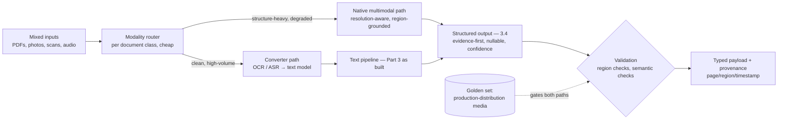

# Chapter 3.9 — Multimodal Models

| | |
|---|---|
| **Part** | 3 — Core Building Blocks of Generative AI |
| **Maturity level** | 2 — Build |
| **Difficulty** | Intermediate |
| **Estimated study time** | 3 hours (reading 90 min, exercise 90 min) |
| **Prerequisites** | [3.1](chapter-01-llm-capabilities-limits.md); [3.4](chapter-04-structured-outputs.md); [2.5](../part-2-artificial-intelligence/chapter-05-transformer-architecture.md) |

## Learning Objectives

After this chapter you will be able to:

1. Explain how multimodality works at architect depth — non-text inputs become tokens in the same transformer — and derive the consequences: costs, context pressure, and text-like failure modes.
2. Design vision-input systems (documents, photos, screens) with the capability realism of 3.1: what visual understanding is reliable, what hallucinates, what routes to specialized tools.
3. Make the modality-pipeline decision: native multimodal model vs. specialized converters (OCR, ASR) feeding a text model — per task, on evals.
4. Extend the era's disciplines — structured outputs, grounding, evaluation — across modalities without re-deriving them.

## Introduction

Multimodality is best understood as a *widening of the input door*, not a new kind of system. Modern foundation models accept images (and increasingly audio and video) by encoding them into token sequences the same transformer attends over (2.5) — which means nearly everything this curriculum has built transfers: the capability grid (3.1), the context budget (3.2 — images are *expensive* tokens), structured outputs (3.4 — extract from an invoice photo into the same treaty schema), grounding and citation (3.6 — now citing regions and timestamps), and evaluation (2.7 — golden sets now contain images).

What's genuinely new is a set of modality-specific failure modes and one recurring architecture decision — *native multimodal vs. convert-then-process* — plus the enterprise reality that most business information is locked in visual formats: scanned documents, forms, photos, screens, diagrams. This chapter covers exactly that delta, at the usual depth contract; production-scale ingestion is 4.3's subject and voice latency engineering is 4.12's.

## Business Motivation

The business case for multimodality is unlocked corpus: the majority of enterprise documents that matter — invoices, delivery notes, contracts as scanned PDFs, claim photos, engineering drawings, forms with handwriting — never were clean text, and the systems Part 3 has built so far can't read them. Every workflow this curriculum's case studies automate has a visual front door: Bellhaven's broker submissions arrive as scanned ACORD forms (the OCR line item in Chapter 2.1's trench coat), Corvid's customs paperwork is stamped and photographed, insurance claims begin with photos of dented cars and water-damaged kitchens (CS27). Where classical OCR pipelines extracted *characters* and lost structure, multimodal models read *documents* — layout, tables, checkboxes, stamps, the relationship between a signature and its date line — collapsing multi-stage extraction pipelines into single calls with structured outputs. The risk side funds the chapter's realism sections: visual hallucination is *harder for humans to catch* than textual (a confidently misread meter value or medication label looks exactly like a correctly read one downstream), and per-image costs multiplied by enterprise document volumes make the modality-pipeline decision a real money decision (a page image can cost 10–50× the tokens of its extracted text — routing *everything* through vision is the multimodal era's version of frontier-model-for-everything, 2.1).

## Theory

### The mechanism, briefly

Images enter the model through an encoder that converts them into a sequence of embedding vectors — effectively "visual tokens" — interleaved with text tokens in the same context window and attended over by the same layers (2.5's machinery, unchanged). Three consequences follow directly. **Cost and context pressure:** an image consumes hundreds to thousands of token-equivalents (resolution-dependent; check your provider's exact accounting — official docs), so 3.2's budget discipline applies with multiplied stakes — a 50-page scanned contract as images is a context-window and invoice event. **Resolution is a quality parameter:** detail the encoder didn't capture doesn't exist for the model — small text, fine print, and dense tables need resolution-aware handling (tiling, zoom-on-region strategies), and "the model missed it" is often "the encoding dropped it." **The failure modes are text-like:** the same plausibility objective (2.4) now completes *visual* readings — a smudged digit becomes a confident wrong digit, an empty field gets a plausible value, a chart's trend gets described from the caption's suggestion rather than the pixels. Visual hallucination is the same animal in a new coat, and the same compensations apply (grounding, structured outputs with representable uncertainty, verification).

### The capability map, visual edition

Extending 3.1's datasheet to vision — the reliable region: **document understanding** (printed text, layout, tables, forms — the standout enterprise capability, now rivaling or beating classical OCR pipelines *especially* where structure matters); **description and classification** (what's in the image, scene understanding, damage-vs-no-damage triage); **diagram and chart reading** (good and improving, with a fabrication risk on precise values — treat read-off numbers as candidates, not facts); **screen understanding** (UI states, error dialogs — the substrate of computer-use agents, which inherit 3.8's full governor discipline plus new injection surfaces: on-screen content is untrusted input). The unreliable region: **precise measurement and counting** (3.1's counting limit, visually — "how many rivets" and "what angle" route to specialized CV tools via 3.7); **fine-grained identification** (specific part numbers, faces — the latter also a 2.8 regulatory minefield: biometric use sits in prohibited/high-risk tiers); **spatial precision** (exact coordinates, pixel-accurate localization — improving, still verify); and **handwriting at the margins** (legible handwriting works; a doctor's scrawl needs confidence fields and human fallback).

### The modality-pipeline decision

The recurring architecture choice — send pixels to a multimodal model, or convert first (OCR/ASR) and process text?

| | **Native multimodal** | **Convert-then-process** |
|---|---|---|
| Strengths | Layout/visual context preserved; one call; handles what converters mangle (tables, forms, mixed content) | Cheap at volume (text tokens); auditable intermediate (the transcript/OCR text is inspectable); mature tooling; searchable/indexable artifact |
| Weaknesses | Cost per page; no inspectable intermediate; visual hallucination lands directly in output | Conversion losses cascade (2.4's layer discipline: garbage transcript → confident garbage summary); structure often destroyed |
| Choose when | Structure carries meaning (forms, tables, diagrams); conversion demonstrably loses what matters | High volume + simple layout; the intermediate artifact is itself required (compliance transcripts, searchable archives) |

The production answer is usually **routed hybrid** (2.1's portfolio logic): a cheap classifier or heuristic (page has tables/handwriting/stamps → vision; clean printed prose → OCR+text model) — Bellhaven-style tiering across modalities, decided per document class on a golden set with both pipelines measured (2.7). For audio the same table holds with ASR as the converter, plus one addition: paralinguistic content (tone, hesitation, speaker changes) survives only the native path, and latency-critical voice (4.12) has its own real-time stack.

### Cross-modal grounding and evaluation

The 3.6 disciplines extend: **grounding** means answers about an image cite *regions* (bounding boxes, page/section references) and answers about audio cite *timestamps* — same trust chain, new address format, same programmatic validation opportunity (does the cited region exist? does it plausibly contain the claim?). **Structured extraction** carries 3.4 wholesale: evidence-first schemas ("transcribe the field's visible text" before "interpret its value"), nullable fields against the empty-box-gets-plausible-value failure, confidence fields on anything read from degraded sources, and span checks become *region* checks. **Evaluation** extends the golden set with images/audio and adds modality-specific classes: degraded inputs (blur, skew, noise — the production distribution, not the demo's clean scans), adversarial layouts (the value *near* the wrong label), and the fabrication probes (empty fields, cropped tables, illegible regions — does the model say "illegible" or invent?). Representative input distribution matters double here: models perform very differently on clean PDFs vs. phone photos of crumpled paper, and the eval set must look like production's camera roll, not the vendor's brochure.

## Architecture Perspective

Multimodal systems add one component class — the modality router — and stress two existing ones; the shape:

Readings. **The router is a cost-and-quality policy in code** — like 7.8's model tiering, it's decided on measured per-class evidence and revisited as vision pricing falls and capability rises (a trade-off with a scheduled revisit date, 1.4); its telemetry (volume and quality per path per class) is what keeps the decision honest. **Provenance gets a new address format and the trust chain must carry it** — page, region, timestamp flow from extraction through validation to the rendered citation (3.6's chain), and the media itself needs governed storage: claim photos and voice recordings are often *more* sensitive than text (faces, voices, homes — biometric-adjacent under 2.8's regimes; PHI in Meridian's world), with retention and access rules that the architecture must enforce from ingestion. **And the context budget meets its stress test** — multi-image tasks (compare these five damage photos; read this 30-page scan) force explicit media budgeting: which pages enter at what resolution, what gets summarized-then-dropped (3.2's compaction, for pixels), and what routes to page-at-a-time workflows (3.8's chaining) rather than one giant context.

## Real-world Example

**Kestrel Assurance** (Chapters 1.6, 2.6, 3.3) extended the claims platform to intake: claimant-submitted photos and scanned forms, previously a manual-triage queue with a four-day backlog. The build was this chapter's decision table executed. Document class analysis first: incoming media split into typed claim forms (clean, printed, high-volume), supporting documents (receipts, medical letters — mixed quality), and damage/incident photos (phone-camera distribution: blur, glare, odd angles). The router sent the first class down the converter path (OCR + the existing text pipeline — at volume, 8× cheaper per document, and the OCR text fed the searchable claim record the auditors wanted anyway); the second and third went native multimodal with evidence-first schemas — for receipts: transcribe-then-interpret fields, nullable amounts, confidence scores; for photos: damage description, *category* (from the adjusters' rubric — 1.6's workshop method, now sorting photos), and a mandatory `image_quality_issues` field.

Two incidents shaped the mature system. First, the fabrication class arrived on schedule: a water-damage claim's photo set included one image of a *dry* room, and the model's description — anchored by the claim context in the prompt — reported "visible water staining" (the plausibility objective completing the story; 3.1's suggestibility, visually). The fix was mechanism-honest: photo description now runs *context-blind* (the model sees the image before any claim narrative — assembly-order as a bias control, 3.6's evidence-first at the pipeline level), and cross-checks between blind description and claim narrative became an adjuster-facing flag ("claimant reports water damage; photo 3 shows none"), which turned a hallucination vector into a *fraud-signal feature* — the incident review's phrase, "we weaponized the disagreement," went on the platform wiki. Second, the resolution lesson: receipt totals were misreading at 4× the eval rate — production receipts arrived as full-table photos where the receipt was 15% of the frame; a detect-crop-zoom preprocessing step (deterministic, cheap) fixed what no prompt could. Triage backlog went from four days to same-day; the region-grounded citations (every extracted field links to its patch of the source image) made the adjuster review *faster* than reading originals — the trust chain paying rent as UX.

## Hands-on Exercise

**Build and stress a vision extraction path.** Any multimodal LLM API. Materials: photograph 6 real receipts/invoices yourself — include one blurry, one crumpled, one at a bad angle (the production distribution). ~90 minutes.

1. **Schema and call (25 min).** Extraction schema per 3.4 with the visual additions: transcribe-then-interpret field pairs, nullables, per-field confidence, `image_quality_issues`. Extract all six; note token cost per image vs. what the extracted text would have cost.
2. **Fabrication probes (20 min).** Crop one receipt to remove the total; extract — null or invented? Then extract with a *leading prompt* ("this receipt is for approximately €200 of office supplies") — does the anchor bend the reading? Record both.
3. **The pipeline comparison (25 min).** Run your two cleanest receipts through any OCR (or manual transcription) + your 3.4 text pipeline. Compare against native vision: field accuracy, cost, and what each path lost (structure? characters?). Write the two-line routing policy your six receipts justify.
4. **Region grounding (20 min).** For your best extraction, have the model return approximate region references per field (or page/quadrant); manually verify three. State which fields you'd trust region-checks to validate programmatically.

**Acceptance criteria:**
- [ ] Schema exhibits transcribe-then-interpret, nullables, confidence, and quality-issue fields
- [ ] Fabrication probes documented: the cropped-total behavior and the leading-prompt effect, verbatim
- [ ] Pipeline comparison has measured accuracy and cost per path, and a routing policy with a class boundary
- [ ] Degraded images (blur/crumple/angle) results compared against clean — the production-distribution gap quantified

## Enterprise Considerations

Multimodal deployments inherit the document estate's chaos and the media estate's sensitivities. **The intake reality:** enterprise "documents" are decades of scanner settings, fax artifacts, and phone photos — the eval set must be sampled from the *actual* intake stream (Kestrel's camera-roll distribution), and preprocessing (deskew, crop, enhance) is unglamorous deterministic engineering that outperforms prompt work on degraded media every time (4.3 builds the industrial version). **Media is high-sensitivity data:** photos contain faces, homes, license plates, and bystanders; voice recordings are biometric-adjacent identifiers; medical images are PHI at maximum classification — governed storage, retention, redaction capability (blur-before-store policies), and 2.8's tier analysis apply *from the first pilot*, because the pilot's S3 bucket of claim photos is already a regulated data store. **Provider terms differ by modality:** image/audio retention, human-review clauses, and training-use terms in provider agreements are often modality-specific — procurement reads them per modality (4.14), not once per vendor. **And accessibility cuts both ways:** multimodal capability is an accessibility *asset* (voice interfaces, image description for vision-impaired users — often the strongest early business case) and an obligation (interfaces that assume one modality exclude users; public-sector deployments, CS35, carry statutory accessibility duties the architecture must design for).

## Trade-offs

| Decision | Option A | Option B | Choose A when… | Choose B when… |
|----------|----------|----------|----------------|----------------|
| Pipeline | Native multimodal | Convert-then-process | Structure carries meaning; converters mangle it; volume affordable | Clean high-volume media; the intermediate artifact is required; cost dominates |
| Resolution handling | Preprocess (crop/zoom/tile) deterministically | Send full frames, let the model cope | Fine detail matters (receipts, fine print, dense tables) | Scene-level tasks (damage triage, classification) |
| Visual grounding | Region-cited, context-blind first reads | Direct contextual reading | Fabrication risk, fraud surface, audit needs (Kestrel's shape) | Low-stakes description; latency-tight paths |
| Media retention | Minimal, redacted, short-lived | Full archive | Default under privacy regimes | Legal/regulatory hold requires it — then governed like the sensitive store it is |

## Common Mistakes

1. **Demo-clean evals, production-dirty inputs** — golden sets of crisp PDFs gating a phone-photo intake stream; the 4× receipt miss is the standard bill. Sample the eval set from real intake.
2. **Vision for everything** — routing clean printed text through per-image pricing out of pipeline simplicity; the router exists because the cost asymmetry is 10–50×.
3. **Context-anchored visual readings** — letting the claim narrative prime the photo description; assembly order is a bias control, and blind-first-read is the cheap fix (Kestrel's dry room).
4. **Treating read-off numbers as facts** — chart values, meter readings, and totals extracted without confidence fields or verification; visual hallucination ships digits that *look* verified.
5. **Ignoring resolution as a variable** — "the model can't read receipts" when the receipt was 200 pixels wide; deterministic preprocessing beats prompt archaeology.
6. **Ungoverned media stores** — the pilot's photo bucket accumulating faces and homes without retention, access controls, or tier analysis; media sensitivity work starts at ingestion, not at audit.
7. **Re-deriving disciplines per modality** — building separate eval, schema, and grounding practices for vision instead of extending 3.4/3.6/2.7; the delta is small and the machinery transfers.

## Best Practices

1. **Route by document class, on measured evidence** — the modality router as versioned policy with per-class telemetry and a scheduled revisit (vision economics move quarterly).
2. **Preprocess deterministically before prompting** — detect, crop, deskew, zoom; the cheapest quality wins in the modality live before the model.
3. **Read blind, then compare** — context-free first extraction for anything with fabrication or fraud surface; disagreements between blind read and narrative are signal, not noise.
4. **Extend the 3.4 schema kit visually** — transcribe-then-interpret pairs, nullables, confidence, quality-issue fields, region references; extraction from pixels is still extraction.
5. **Build golden sets from the real intake distribution** — degraded classes included and specifically probed for fabrication (empty fields, cropped regions, illegible zones).
6. **Govern media as high-sensitivity data from day one** — classification, retention, redaction, access; the provider's modality-specific terms read and recorded.
7. **Carry provenance in the new address format** — page/region/timestamp through the whole trust chain to the rendered citation; region-linked review UX is a speed feature, not just an audit feature.

## Architecture Checklist

For any system ingesting non-text media:

- [ ] Modality router exists with per-class routing policy, measured on a golden set covering both paths
- [ ] Eval set sampled from production intake distribution; degraded and fabrication-probe classes included
- [ ] Deterministic preprocessing (crop/deskew/zoom) applied before model calls where detail matters
- [ ] Extraction schemas carry transcribe-then-interpret, nullables, confidence, quality-issue, and region fields
- [ ] Fabrication controls in place: blind-first reads where stakes warrant; read-off values verified or flagged
- [ ] Media stores governed: classification, retention, redaction, access controls from first pilot
- [ ] Provider terms reviewed per modality (retention, training use, human review)
- [ ] Provenance (page/region/timestamp) flows end-to-end to rendered, verifiable citations
- [ ] Image/audio token costs in the 1.7 model; media context budgets explicit for multi-page/multi-image tasks

## Interview Questions

1. *"When do you use a multimodal model versus OCR-plus-text-model?"* — Strong answers produce the decision table (structure preservation vs. cost and auditable intermediates), land on the routed hybrid with per-class evidence, and note the revisit cadence as vision economics shift.
2. *"How does visual hallucination differ from textual, and what do you do about it?"* — Strong answers name the mechanism continuity (plausibility objective completing visual reads: smudged digits, empty fields, context-anchored descriptions), the detection difficulty downstream, and the control stack: blind reads, transcribe-then-interpret, confidence fields, region-grounded verification.
3. *"Design the intake pipeline for insurance claim photos."* — Strong answers cover the distribution (phone-camera reality → preprocessing and representative evals), the schema (rubric categories, quality issues, blind description), the fraud-signal opportunity (narrative-vs-photo disagreement), and the media governance (sensitivity, retention, faces).
4. *"What transfers from text-LLM engineering to multimodal, and what's genuinely new?"* — Strong answers claim most of it transfers (capability grid, budgets, structured outputs, grounding, eval discipline) and isolate the real delta: token-expensive inputs, resolution as a quality parameter, region/timestamp provenance, the modality router, and media-grade data governance.

## Further Reading

- Your provider's vision/audio documentation (official docs) — image token accounting, resolution handling, file limits, and modality-specific terms; the operational ground truth, re-read per provider and quarter.
- Radford et al., *Learning Transferable Visual Models From Natural Language Supervision* (CLIP, arxiv.org/abs/2103.00020) — the contrastive text-image representation lineage behind modern multimodality; intuition-level read.
- Your jurisdiction's biometric and image-privacy rules (official sources; GDPR Art. 9-adjacent guidance where applicable) — the legal frame for faces, voices, and media retention that 2.8 previewed.
- The [RAG design checklist](../../checklists/rag-design-checklist.md) — its ingestion lines ("document formats handled… extraction quality spot-checked") are this chapter's checklist hooks; 4.3 completes them.

## Summary

- Multimodality is **the same transformer with a wider door**: images and audio become token sequences, so the era's disciplines — capability grids, budgets, schemas, grounding, evals — **transfer rather than restart**; the delta is modality-specific failure modes and economics.
- The enterprise value is **unlocked corpus** — forms, scans, photos, and screens where most business information actually lives — with document understanding as the standout reliable capability.
- The recurring decision is the **modality pipeline**: native multimodal (structure preserved, expensive) vs. convert-then-process (cheap, auditable intermediate, lossy) — resolved as a **routed hybrid** per document class, on golden-set evidence, revisited as economics shift.
- Visual hallucination is the plausibility objective in pixels: **blind-first reads, transcribe-then-interpret, confidence fields, and region-grounded citations** are the control stack — and narrative-vs-image disagreement can be weaponized as signal.
- Media is **high-sensitivity data from the first pilot** — faces, voices, homes; governance starts at ingestion, and provider terms read per modality.
- One chapter remains in Part 3: choosing among the models all these systems consume — **selection and benchmarking** (3.10).

---

**Previous:** [Chapter 3.8 — Agents: Concepts & Control Flow](chapter-08-agents-concepts.md) · **Next:** [Chapter 3.10 — Model Selection & Benchmarking](chapter-10-model-selection-benchmarking.md) · **Related:** [4.3 Document Ingestion at Enterprise Scale](../part-4-enterprise-genai-systems/README.md), [4.12 Latency & Performance](../part-4-enterprise-genai-systems/README.md), [2.8 Responsible AI](../part-2-artificial-intelligence/chapter-08-responsible-ai.md)
