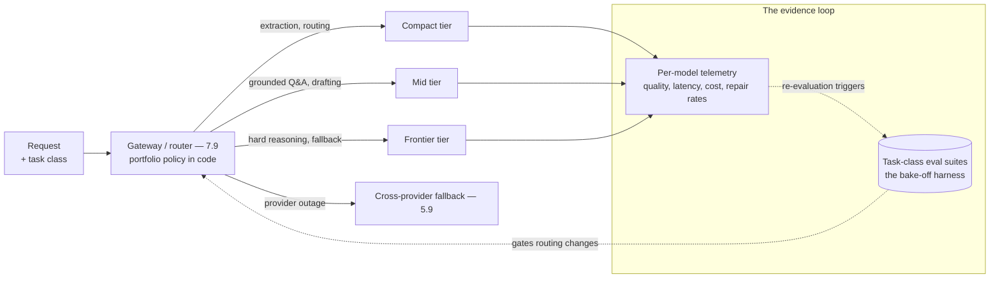

# Chapter 3.10 — Model Selection & Benchmarking

| | |
|---|---|
| **Part** | 3 — Core Building Blocks of Generative AI |
| **Maturity level** | 2 — Build |
| **Difficulty** | Intermediate |
| **Estimated study time** | 4 hours (reading 90 min, exercise 2.5 h) |
| **Prerequisites** | [2.7 Evaluating ML Systems](../part-2-artificial-intelligence/chapter-07-evaluating-ml-systems.md); [1.4 Trade-off Analysis](../part-1-professional-foundation/chapter-04-tradeoff-analysis.md); Chapters 3.1–3.9 |

## Learning Objectives

After this chapter you will be able to:

1. Run a structured model bake-off: shortlist from public signals, decide on private task evals, score across capability, latency, cost, and operational fit.
2. Treat model selection as a *portfolio* decision — a tiered set of models with routing — rather than a single-winner contest.
3. Evaluate the dimensions datasheets don't show: refusal contours, instruction-following under your prompts, tool-election reliability, long-context behavior, language coverage.
4. Manage the selection over time: re-evaluation triggers, migration playbooks, and the provider-relationship dimension of what is really an infrastructure decision.

## Introduction

This capstone chapter of Part 3 assembles the curriculum's machinery into its most recurring decision: *which model?* — asked at every project start, every provider release, every pricing change, and every quarterly review. You already own every component: the trade-off apparatus with weighted criteria and gates (1.4), the benchmark skepticism and private-eval discipline (2.7), the golden sets from every chapter's exercise, the cost math (1.7), and the capability datasheet (3.1). What this chapter adds is the *procedure* — and the reframe that makes the procedure sane: model selection is not a one-time contest producing a winner; it is **portfolio management of an infrastructure dependency**, revisited on triggers, with routing as the standing answer to "which one?"

The reframe matters because the question's premise is usually wrong. Production systems (Bellhaven's tiers, Vantora's gateway, Kestrel's fine-tuned compact model behind a frontier fallback) run *sets* of models matched to task classes — the portfolio was the answer in every worked example this curriculum has built, and the bake-off's real product is the routing policy, not the trophy.

## Business Motivation

Model selection is among the largest recurring financial decisions in a GenAI program, and both error directions are expensive. **Overselection** — the frontier model as default for everything — is the most common silent budget leak: the capability delta between model tiers is real but *task-dependent*, and for extraction, routing, classification, and templated drafting (the enterprise volume workhorses — 3.1's green zone), measured quality parity at 5–20× cost difference is the routine bake-off finding (Corvid's 40× routing-classifier discovery, 2.1; Kestrel's 82% cost cut, 2.6). **Underselection** — the cheap model where the task punishes it — costs more but hides better: quality degradation below the fit criterion (1.6) surfaces as eroding user trust (1.2's draining stock) rather than as an invoice line, and is regularly misdiagnosed as a prompt or retrieval problem. The procedural stakes are just as real: selection without private evals is procurement by leaderboard (2.7's hollowed numbers), selection without re-evaluation triggers is a decision rotting in place while the market moves quarterly, and selection without a migration playbook converts every provider deprecation notice (2.6's 90-day fire drill) into an emergency. The bake-off harness — built once, reused forever — is what turns all of this from recurring crisis into recurring routine.

## Theory

### The procedure

**1. Frame per task class, not per organization.** "Which model should the company use?" is malformed (1.4's framing discipline). The unit of selection is the *task class* — extraction, grounded Q&A, drafting, judging, tool-orchestration — each with its own criteria weights and its own winner. The org-level artifact is the portfolio and its routing policy.

**2. Shortlist from public signals — cheaply and briefly.** Leaderboards, provider documentation, peer reports: legitimate for *triage* (which 3–5 candidates merit private evaluation), useless for decision (2.7's contamination, mismatch, optimization pressure). Include the tier below your instinct (the boring option, 1.4) and, where relevant, an open-weights candidate for the sovereignty/cost axis (5.11).

**3. Decide on private task evals.** The golden sets you already maintain (3.3's prompt suites, 3.5–3.6's retrieval and faithfulness sets, 3.7's election scenarios) *are* the bake-off instrument — run each candidate through the task class's suite, with 2.7's full discipline: sized sets (noise floors kill bake-offs quietly: a 3-point delta on 100 items decides nothing), paired comparisons, calibrated judges (cross-family judging especially — a judge from candidate A's family scoring candidate A is the self-preference bias on payroll).

**4. Score the dimensions datasheets don't show.** The differentiators in practice are rarely headline capability:
- **Instruction-following under *your* prompts** — models differ sharply in how they handle long system prompts, output contracts, and negative instructions; your 3.3 suite measures this directly.
- **Refusal contours** — run your legitimate-but-sensitive cases (2.6's residue; the claims system discussing injuries); over-refusal discovered in production is discovered from angry users.
- **Tool-election reliability** — 3.7's scenario suite per candidate; election accuracy varies more across models than prose quality does.
- **Structured-output fidelity** — schema adherence rates and repair-rate baselines (3.4) per candidate.
- **Long-context behavior** — retrieval-from-context at *your* typical assembly sizes, not the advertised maximum (2.5's lost-in-the-middle varies by model).
- **Language and domain coverage** — per-language eval slices where you operate multilingually (2.4's inequities are model-specific).
- **Latency profile** — TTFT and streaming rate at your prompt sizes (2.5's phases), p95 not mean, measured not quoted.
- **Variance** — multiple runs per item; a model that's right 90% with low variance may beat one that's right 92% with wild swings, depending on the task's tolerance (3.1).

**5. Score operational fit — the infrastructure half.** Rate limits and provisioned-throughput terms at your projected volume (5.4), data-use and retention terms per your classification (4.14 gates, not weights), regional availability vs. residency constraints (1.6's one-way doors), deprecation policy and notice periods (2.6), caching and batch pricing (4.11's levers), fine-tuning availability if 2.6's sorting rule points there, and ecosystem maturity (SDKs, tool protocols). These frequently *gate* candidates the capability evals loved.

**6. Decide as a portfolio with routing.** The output artifact: per task class, a primary model, a fallback (different provider where feasible — 5.9's failover), and the routing policy with its eval evidence; plus the ADR (1.4) with losers preserved and **re-evaluation triggers** named — a new model generation in the family, a >25% price move, a quality regression on the pinned suite, volume crossing a tier boundary, or six months elapsed, whichever first.

### The migration playbook

Selection's steady-state companion (2.6's fire drill, generalized): enumerate affected prompts and suites from the registries (3.3's model-assumption fields), re-run everything against the candidate, fix or re-tune failures (expect prompt adjustments — prompts encode model quirks), re-validate judges if the judge model moves (2.7), shadow-run at production traffic, stage the rollout with instant rollback (5.7), and *keep the old model's access until the new one has survived a full traffic cycle*. A rehearsed migration takes weeks; an unrehearsed one takes a quarter and a trust withdrawal.

## Architecture Perspective

Model selection's architectural expression is the **routing layer** — the component that makes the portfolio operational and the selection reversible:

Readings. **The router makes selection a two-way door** (1.4): with task-class routing in one governed place, a model swap is a policy change behind an eval gate rather than a codebase migration — which is precisely why the gateway pattern (7.9) earns its platform investment, and why *applications reference task classes, never model IDs* (the indirection that keeps 200 services from hard-coding 200 selection decisions). **The evidence loop is the standing bake-off** — per-model telemetry (quality signals, latency percentiles, cost, repair rates — 3.4's drift alarm now comparative) against the pinned suites means re-evaluation triggers fire on data, and the next bake-off starts from a warm harness instead of a blank page. **Fallback is selection too** — the cross-provider fallback's eval evidence must exist *before* the outage (a fallback never tested against the suite is a hope, not an architecture), and prompt portability across the primary/fallback pair is a design constraint worth paying for in slightly-less-tuned prompts (the trade-off recorded, 1.4).

## Real-world Example

**Vantora Systems** (Chapters 1.8, 2.5, 3.7) institutionalized this chapter after living its absence. The pre-gateway era's selection process was archaeology: eleven teams, six models, chosen by whoever built each feature first, with the flagship team's model choice traceable to a conference demo. The gateway rollout (1.8's story) created the *place* for a portfolio policy; the bake-off harness created the policy itself.

The build was deliberate about the undocumented dimensions. The harness bundled the estate's existing suites — the support team's faithfulness set, the helpdesk's 60 tool-election scenarios (3.7), the German and Polish language slices (the EU expansion made per-language evals a gate, not a nicety), and a new refusal-contour set built from twelve months of over-refusal complaints (the IT-security team's legitimate exploit-discussion cases had been silently failing on one provider's safety tuning — discovered in the complaint queue, now a standing eval class). First full bake-off results reshaped the portfolio against instinct twice: the mid-tier incumbent lost the tool-election class to a *cheaper* competitor (election accuracy 94% vs. 88% — nobody had predicted it because nobody had measured it), and the frontier tier kept only two task classes (complex multi-document analysis, and fallback-on-low-confidence) — routing evidence moved 60% of frontier traffic down a tier at quality parity, cutting model spend 34% in a quarter (the CFO ally from 1.8 got her slide).

The steady state proved the design. When a provider announced a 90-day deprecation (2.6's drill, arriving on schedule), the migration ran the playbook: registry enumeration flagged 23 prompts with the old model's assumptions, suite re-runs caught four regressions (two fixed by prompt adjustments, one by re-tuning a judge, one by re-routing the task class entirely), shadow traffic ran two weeks, staged rollout completed with one rollback-and-fix cycle — six weeks, no incidents, no war room. Adaeze's summary at the platform review became the chapter's thesis: *"We don't pick models anymore. We maintain a portfolio with evidence. The models change quarterly; the harness is forever."*

## Hands-on Exercise

**Run a real two-model bake-off.** Two models from different tiers or providers (any accessible pair). Reuse your Part 3 artifacts — this exercise is their payoff. ~2.5 hours.

1. **Frame and criteria (25 min).** Pick two task classes you've built suites for (e.g., 3.3's triage prompt, 3.7's tool elections). Per class: weighted criteria (1.4's discipline — weights before scores), gates (e.g., schema-adherence floor), and the cost/latency envelope from 1.7's math at a stated volume.
2. **Run the suites (50 min).** Both models through both suites, paired comparison, 3 runs per item where variance matters (3.2's profiles held constant). Add two probes per model: a refusal-contour case (legitimate-but-sensitive for your domain) and a long-prompt instruction-following case (your fullest 3.3 prompt).
3. **Score honestly (30 min).** Fill the matrix with evidence per cell (1.4); compute the noise floor for your suite sizes (2.7 — state what deltas your n can and cannot resolve); apply gates before weights.
4. **Decide as a portfolio (25 min).** Output: per task class, primary + fallback + routing policy; the ADR with losers and re-evaluation triggers; and the one-paragraph migration note (what would re-run if you swapped).

**Acceptance criteria:**
- [ ] Weights and gates fixed before any scoring; evidence in every cell
- [ ] Noise floor computed and respected — no claims your n can't support
- [ ] Refusal and instruction-following probes run and recorded per model
- [ ] Output is a portfolio (per-class routing + fallback), not a single winner
- [ ] ADR includes losers, triggers, and the migration note

## Enterprise Considerations

At enterprise scale, model selection is procurement, geopolitics, and platform governance braided together. **The vendor relationship is an infrastructure relationship:** enterprise agreements (committed spend, provisioned throughput, custom terms on data use and retention) shape the portfolio's economics as much as list prices — and negotiating leverage *is* the portfolio (a demonstrated, eval-backed ability to route traffic elsewhere is worth percentage points at renewal; single-provider dependence is priced accordingly by both sides). **Concentration risk gets board-level attention:** provider outages, capability regressions, and terms changes are correlated across everything routed to one vendor — the cross-provider fallback tier is partly a resilience control (5.9) and partly a governance requirement in regulated industries' third-party-risk regimes (6.10's vendor lock-in surfaces, 4.14's operational-resilience rules). **Sovereignty constraints partition the portfolio before capability does:** residency, sector rules, and public-sector procurement (5.11, CS35's world) can gate entire provider families per jurisdiction — the portfolio is per-region in multinationals, and the harness must run per-region slices. **And selection authority needs governance:** who may add a model to the portfolio, who owns the harness, and how teams request routing changes is a 6.9 lane — the failure mode being shadow selection (teams bypassing the gateway for the new shiny model), which the platform prevents the 1.8 way: by making the paved road genuinely better, with the harness as the evidence.

## Trade-offs

| Decision | Option A | Option B | Choose A when… | Choose B when… |
|----------|----------|----------|----------------|----------------|
| Portfolio breadth | Two providers, tiered | Single provider, all tiers | Resilience, leverage, regulated third-party-risk regimes | Small estate; ops simplicity dominates; terms are exceptional — with the concentration risk recorded |
| Default tier | Cheapest that passes the suite | Frontier as default | Volume task classes with measured parity (the routine finding) | Genuinely hard tasks; exploration phases before suites exist |
| Re-evaluation cadence | Trigger-based (releases, prices, regressions) | Calendar-only | Default — the market moves on events, not quarters | As the backstop trigger (6 months), never the only one |
| Open-weights candidate | In every bake-off | Managed APIs only | Sovereignty/residency gates in play; unit economics at extreme volume (5.3) | No GPU-ops capability and no gating constraints — but re-check yearly |

## Common Mistakes

1. **Selecting by leaderboard** — public benchmarks as the decision instead of the shortlist; 2.7's three structural reasons (contamination, mismatch, optimization pressure) each independently invalidate it.
2. **One winner for everything** — the org-wide model decree; task classes have different winners, and the portfolio-with-routing is the correct output shape (the routine 5–20× savings live here).
3. **Skipping the undocumented dimensions** — refusal contours, election reliability, long-prompt behavior, language slices; the dimensions that differ most across models are exactly the ones datasheets omit (Vantora's two surprises).
4. **Bake-offs inside the noise floor** — deciding on deltas the suite size can't resolve (2.7's arithmetic); size the suites to the decision or defer the decision.
5. **Same-family judging** — candidate A's sibling scoring candidate A; cross-family judges or programmatic metrics for bake-offs, always.
6. **No re-evaluation triggers** — the selection ADR without expiry conditions, rotting while the market moves quarterly; triggers named at decision time (1.4's revisit discipline).
7. **The unrehearsed migration** — no playbook, no registry of model assumptions, no shadow phase; the deprecation notice becomes a war room instead of a six-week routine.
8. **Applications hard-coding model IDs** — 200 services each owning a selection decision; task-class indirection at the gateway is the architectural fix, and it's cheap only if adopted early.

## Best Practices

1. **Maintain the harness as permanent infrastructure** — the bundled task-class suites, refusal and language slices, latency probes; warm-startable for any candidate in days (2.7's "the harness is forever").
2. **Select per task class; publish the portfolio** — primary, fallback, routing policy, and eval evidence per class, visible to every team through the gateway's documentation.
3. **Fix weights and gates before running candidates** — 1.4's sequence, non-negotiable in a decision this politically loaded (every team has a favorite).
4. **Probe what datasheets don't show** — your prompts, your refusal cases, your languages, your assembly sizes, your tool scenarios; the private delta is the real delta.
5. **Name the triggers in the ADR** — releases, price moves, regressions, volume boundaries, elapsed time; and wire the regression trigger to the standing telemetry.
6. **Rehearse the migration yearly** — the playbook run against a low-stakes task class as a drill; deprecations arrive on the provider's schedule, not yours.
7. **Keep a tested cross-provider fallback for critical paths** — eval-evidenced before the outage, prompt-portable by design, exercised on a schedule (5.9's discipline).

## Architecture Checklist

For any organization consuming foundation models (all of them):

- [ ] Selection framed per task class; portfolio (primary/fallback/routing) is the output artifact
- [ ] Private eval harness exists: task-class suites, refusal contours, language slices, latency probes at real prompt sizes
- [ ] Public benchmarks used for shortlisting only; decisions on private evals with noise floors respected
- [ ] Operational-fit gates applied: data terms, residency, rate limits, deprecation policy, caching/batch economics
- [ ] Gateway routes by task class; applications never hard-code model IDs
- [ ] Per-model telemetry (quality, latency p95, cost, repair rates) feeds re-evaluation triggers
- [ ] ADR per selection: weights-before-scores, losers preserved, triggers named
- [ ] Migration playbook written and rehearsed; model assumptions tracked in prompt/suite registries
- [ ] Cross-provider fallback eval-evidenced and exercised for critical paths

## Interview Questions

1. *"How would you choose a model for a new enterprise use case?"* — Strong answers run the procedure: frame per task class, shortlist publicly, decide on private task evals with noise-floor honesty, score the undocumented dimensions and operational gates, output a portfolio with routing and triggers — and cite the harness as reusable infrastructure.
2. *"The new frontier model just topped every leaderboard. The CTO wants to switch. Respond."* — Strong answers neither comply nor dismiss: leaderboards shortlist (2.7's three reasons), so the answer is a warm-harness bake-off in days, task classes where it wins get routed on evidence, and the migration playbook governs the swap — turning executive enthusiasm into a cheap, fast, honest test (1.8's prediction conversion).
3. *"What model differences don't show up in benchmarks but matter in production?"* — Strong answers enumerate the hidden dimensions: refusal contours, instruction-following under long real prompts, tool-election accuracy, schema fidelity and repair rates, long-context retrieval at real assembly sizes, per-language quality, latency profiles, variance — each with how to measure it.
4. *"Your provider deprecates your main model with 90 days' notice. Walk me through it."* — Strong answers execute the playbook: registry enumeration of model-assumed artifacts, full suite re-runs, prompt re-tuning and judge re-validation, shadow traffic, staged rollout with rollback, old-model access retained through a full cycle — as a routine, because it was rehearsed (Vantora's six weeks, no war room).

## Further Reading

- Your providers' model documentation, deprecation policies, and enterprise terms (official docs) — the operational-fit half of every selection; date-stamp what enters your models (1.7).
- Chatbot Arena / LMSYS methodology notes (lmarena.ai) — understand what preference leaderboards measure (and don't) before citing them in a shortlist memo; pairs with 2.7's benchmark critique.
- Anthropic's model selection and migration guidance (docs.anthropic.com) — a provider's own articulation of tiering, capability trade-offs, and upgrade practice; read alongside competitors' equivalents for the full picture.
- The [GSAC evaluation checklist](../../checklists/evaluation-checklist.md) and your Part 3 exercise artifacts — the harness you already own; this chapter's procedure is their assembly manual.

## Summary

- Model selection is **portfolio management of an infrastructure dependency**: per task class, primary + fallback + routing policy, evidenced by private evals, revisited on named triggers — never a one-time contest with an org-wide winner.
- The procedure: **shortlist publicly, decide privately** — your task-class suites are the instrument, with 2.7's full discipline (noise floors, paired comparisons, cross-family judges).
- The differentiators live off the datasheet: **refusal contours, instruction-following under your prompts, tool-election reliability, schema fidelity, long-context behavior at your sizes, language slices, latency profiles, variance** — and operational gates (terms, residency, deprecation policy) that veto what capability loved.
- The **gateway's task-class indirection makes selection reversible** (a two-way door), the standing telemetry makes triggers data-driven, and the **rehearsed migration playbook** turns deprecations into routine.
- The harness is forever; the models are quarterly. This closes Part 3: you now hold every component — capabilities, context, prompts, structure, retrieval, RAG, tools, agents, modalities, selection. **Part 4 assembles them into enterprise systems.**

---

**Previous:** [Chapter 3.9 — Multimodal Models](chapter-09-multimodal-models.md) · **Next:** [Part 4 — Enterprise GenAI Systems](../part-4-enterprise-genai-systems/) · **Related:** [2.7 Evaluating ML Systems](../part-2-artificial-intelligence/chapter-07-evaluating-ml-systems.md), [1.4 Trade-off Analysis](../part-1-professional-foundation/chapter-04-tradeoff-analysis.md), [7.8 Cost & Performance Patterns](../part-7-enterprise-ai-architecture-patterns/chapter-08-cost-performance-patterns.md)
