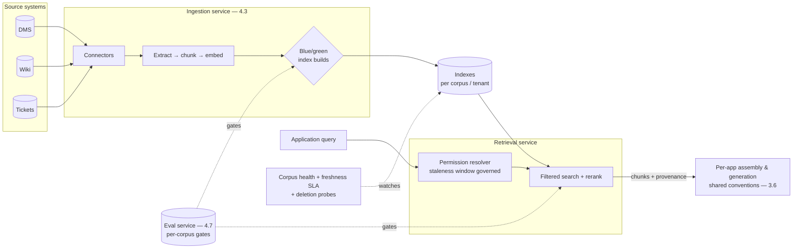

# Chapter 4.1 — Production RAG Architecture

| | |
|---|---|
| **Part** | 4 — Enterprise GenAI Systems |
| **Maturity level** | 3 — Engineer |
| **Difficulty** | Advanced |
| **Estimated study time** | 4 hours (reading 2 h, exercise 2 h) |
| **Prerequisites** | [3.5](../part-3-core-building-blocks-of-genai/chapter-05-embeddings-semantic-search.md); [3.6](../part-3-core-building-blocks-of-genai/chapter-06-rag-fundamentals.md) |

## Learning Objectives

After this chapter you will be able to:

1. Scale the 3.5/3.6 RAG loop into a production architecture: separated services, index lifecycle management, and multi-corpus federation.
2. Design ACL-aware retrieval that survives an adversarial audit: permission resolution, staleness windows, and existence-leak prevention.
3. Operate RAG as a product: freshness SLAs, quality regression gates, corpus health monitoring, and the incident classes specific to retrieval systems.
4. Decide the multi-tenancy and federation questions: one index or many, per-tenant isolation models, and cross-corpus query routing.

## Introduction

Part 3 built RAG as a system; this chapter runs it as a *service* — the difference being everything that appears when the corpus is two million documents across nine source systems, the users are the whole company plus customers, the permissions model is inherited from twenty years of organizational archaeology, and the answer quality is somebody's SLA. Nothing conceptual changes: the loop is still retrieve → assemble → generate → cite, the taxonomy still localizes failures, the two-sided evals still gate releases. What changes is that every component becomes a *shared, governed, always-on* service with its own failure modes, and three concerns that were paragraphs in Part 3 become the chapter's core: **index lifecycle at scale**, **permissions under adversarial scrutiny**, and **multi-corpus/multi-tenant structure**.

## Business Motivation

Production RAG is where the enterprise's knowledge-access business case (3.6's four reasons) meets its operating costs, and the delta between a project and a platform is measured in both directions. Run as per-team projects, RAG multiplies: five teams over the same policy corpus means five ingestion pipelines with five staleness bugs, five ACL implementations with five audit findings, and five eval harnesses with none of them maintained — the sprawl Chapter 3.5 warned about, at production prices (a mid-size enterprise's duplicated-RAG bill routinely reaches seven figures in engineering time before anyone consolidates). Run as a platform, RAG compounds: one governed retrieval service amortizes ingestion, permissions, and evaluation across every consumer, and each new application's marginal cost drops toward prompt-and-assembly work ([P06](../../projects/README.md) builds the reference; 7.9 catalogs the platform patterns). The risk side is starker: permission failures in production RAG are *data-breach events* — the wrong person retrieving the M&A memo, the customer seeing another tenant's contract — with breach-notification duties and regulatory consequences (4.14), and they are the single most common serious incident class in enterprise RAG deployments. The ACL architecture is not a feature; it's the license to operate.

## Theory

### From loop to service topology

Production separates the loop's stages into independently scaled, owned services:

- **Ingestion service** (4.3's full subject) — source connectors, extraction, chunking, embedding, index writes; batch and event-driven lanes; the *only* writer to indexes.
- **Retrieval service** — query embedding, permission resolution, filtered search, (4.2's rerank stage); a read-optimized API consumed by every application; owns the retrieval SLO (p95 latency, recall gates).
- **Assembly & generation** — per-application (prompts and epistemic contracts differ by use case — 3.6), but built on shared conventions (the assembler library, citation validation) so the trust chain stays uniform.
- **Evaluation service** (4.7) — golden sets, judges, and regression gates as shared infrastructure, with per-corpus and per-application suites.

The separation matters because the scaling profiles differ (ingestion is bursty-batch, retrieval is latency-bound always-on), the ownership differs (ingestion sits with data teams, retrieval with platform, assembly with product teams), and the *blast radius* differs — an ingestion bug corrupts an index rebuild; a retrieval bug is a live incident.

### Index lifecycle at scale

3.5's versioned-artifact-set discipline, industrialized:

- **Blue/green index deployments** — a new chunker config, embedding model, or metadata schema builds a parallel index; the golden-set gates (recall@k, and 3.6's end-to-end suite) run against it; traffic cuts over with rollback available. Index changes are *releases* ([deployment checklist](../../checklists/deployment-checklist.md): "embeddings and index rebuilt together").
- **Freshness as a per-corpus SLA** — policy documents may need hour-level freshness; archived contracts, weekly. The SLA drives the pipeline architecture (event-driven vs. scheduled — 3.5's trade-off) and is *monitored as a first-class metric*: indexed-version lag per source, with staleness alerts (Meridian's incident-one fix, now standing infrastructure).
- **Deletion propagation with proof** — right-to-be-forgotten and document retirement flow through to chunks, vectors, *and caches* within a defined window, verified by automated probes (query for the deleted content; expect nothing) — because "we deleted it from the source" is not an answer an auditor accepts about the index.
- **Corpus health monitoring** — the index's input-side dashboard: ingestion failure rates per source, extraction quality samples, chunk-size distributions drifting (a source system's format change arrives as a chunking anomaly before it arrives as a quality complaint), and orphan detection.

### Permissions under adversarial scrutiny

3.5 established filter-before-similarity; production adds the hard parts:

- **Permission resolution** — the user's effective access, computed at query time from the systems of record (DMS ACLs, directory groups, matter walls). The design tension: live resolution per query is correct but latency-expensive; cached/materialized permission sets are fast but introduce a **staleness window** — the revoked user who can still retrieve for N minutes. The window's acceptable size is a *risk decision made explicitly with security* (1.4, with 4.14 in the room), not an engineering default; high-sensitivity corpora justify live checks or short TTLs with revocation-triggered invalidation.
- **Existence-leak prevention** — result counts, "no access" errors that differ from "no results," similarity scores over forbidden documents: all leak the existence of what the user can't see (Halvard & Roth's pilot catch, 3.5). The contract: filtered-out content is *indistinguishable from nonexistent* at every layer of the response.
- **The audit answer** — for any past query: who asked, what permission set applied, what was retrievable, what was retrieved. This requires logging the *resolved permission context* per query (not just the user ID), retention-governed like the sensitive log it is (4.10, 4.14).

### Multi-corpus and multi-tenancy

Two distinct questions, often conflated. **Federation** (one user, many corpora): a router directs queries to relevant corpora (metadata-based, or a cheap classifier — 3.8's routing pattern), results merge with per-corpus provenance; the design risk is score comparability across indexes (similarity scores from different embedding spaces don't compare — merge by rank or rerank jointly, 4.2). **Tenancy** (many customers, shared infrastructure): the isolation ladder — shared index with tenant-ID filtering (cheapest; one filter bug from disaster — acceptable only with defense-in-depth: filter enforced at the index API *and* validated post-retrieval), per-tenant indexes/namespaces (the workhorse default: blast-radius containment at manageable cost), per-tenant infrastructure (regulated/sovereign customers — 5.11). The choice is a 1.4 one-way-door analysis: migration between tenancy models at scale is a re-ingestion of everything (7.9 treats the platform view).

## Architecture Perspective

Readings. **The retrieval service is the trust boundary's enforcement point** — permission resolution and filtering live in one audited component, not re-implemented per application; every consumer inherits the same guarantee, and the audit answer has one place to look. **Indexes are cattle, sources are truth** (3.5's rebuildability, now doctrine): every index must be reconstructible from sources by pipeline alone — which is what makes blue/green cheap, embedding migrations routine (3.10's playbook), and corruption recoverable. **The eval service gates both sides** — ingestion changes (new chunker → golden-set regression run against the green index) and retrieval changes (rerank model swap → same gates), because 3.5's lesson holds at scale: most quality regressions enter through the pipeline, not the query path.

## Real-world Example

**Halvard & Roth** (3.5's rebuild) hit production's three walls in year two, in order. **Scale wall:** the matter corpus crossed two million documents and the nightly full re-index stopped fitting in the night; the move to event-driven incremental ingestion (DMS change feeds) exposed that four source systems had no change events — those stayed on scheduled crawls with *explicitly downgraded freshness SLAs*, documented per corpus, which turned a hidden inconsistency into a stated contract (associates now see "index current as of…" per source in the UI). **Permission wall:** the firm's conflicts team ran an adversarial audit — a partner moved off a matter retained retrieval access for up to 40 minutes (the cached permission TTL). The risk decision went to the general counsel: matter-wall revocations now trigger immediate cache invalidation (an event the DMS already emitted), while routine group changes keep the 40-minute TTL — a two-tier staleness policy matching control criticality, recorded as the ADR the next audit started from. **Tenancy wall:** the firm launched a client-facing deal-room Q&A (external users, per-client corpora) — and the internal shared-index-with-filters model was rejected *by the architecture team itself* for the external product: per-client namespaces with separate encryption scopes, because "one filter bug from a client seeing another client's deal documents" failed the 1.4 consequence test at any probability. The internal and external products now share the ingestion pipeline and eval harness but not the tenancy model — the reference example, the team notes, of the same platform making *different* risk trades per audience.

## Hands-on Exercise

**Design (on paper) and probe (in code) the production concerns.** Extends your 3.5/3.6 build. ~2 hours.

1. **Service topology (30 min).** Draw your 3.6 system re-architected as services: ingestion, retrieval (with permission resolver), per-app assembly, eval. Mark owners, SLOs, and the blast radius of each component's failure.
2. **Blue/green drill (30 min).** Change your chunker config (e.g., overlap 15%→25%); build a second index; run your 3.5 golden set against both; write the cutover/rollback decision from the numbers.
3. **Permission adversarial probe (30 min).** Add mock ACLs to your corpus (three users, overlapping access). Implement filter-before-similarity, then attack it: verify "no access" is indistinguishable from "no results," verify a revoked user's access (simulate a cache TTL) and write the staleness-window statement you'd take to security.
4. **Deletion proof (30 min).** Delete a document; run the automated probe (query its unique content; expect nothing — including from any cache); write the propagation-window statement.

**Acceptance criteria:**
- [ ] Topology names owners, SLOs, and blast radii — not just boxes
- [ ] Blue/green decision is made from golden-set numbers, with rollback stated
- [ ] Existence-leak check passes; staleness window stated as a risk decision with a TTL and an invalidation trigger
- [ ] Deletion probe is automated and passes, cache included

## Enterprise Considerations

Production RAG's enterprise life is dominated by three standing negotiations. **Source-system politics:** every connector is a dependency on another team's system, change feed, and API budget — the ingestion roadmap is mostly *organizational* sequencing (1.8's influence machinery: the source teams are cost-bearers), and the honest architecture treats sources without reliable change events as lower-freshness corpora *by contract* rather than pretending. **The permission systems of record are rarely one system:** effective access is the intersection of directory groups, application ACLs, legal holds, and walls maintained in different places on different clocks — the permission resolver is an integration project of 6.6-grade difficulty, and it's on the critical path (1.7's calendar-time discipline: start it first). **And the platform funding model shapes the architecture:** chargeback per consumer (7.9) requires per-application attribution in the retrieval service from day one; shared-cost models breed the tragedy-of-the-commons corpus (everyone ingests, nobody curates) that 6.7's governance exists to prevent — the corpus-owner-and-review-date-in-citations move (3.6) is the platform's cheapest curation lever.

## Trade-offs

| Decision | Option A | Option B | Choose A when… | Choose B when… |
|----------|----------|----------|----------------|----------------|
| Permission checks | Live resolution per query | Cached with TTL + invalidation events | High-sensitivity corpora; latency budget allows | Default at scale — with the two-tier policy for critical revocations |
| Tenancy | Per-tenant namespaces | Shared index + tenant filter | External users; regulated tenants; the consequence test fails | Internal, uniform-sensitivity corpora — with defense-in-depth on the filter |
| Freshness | Event-driven incremental | Scheduled crawls | Sources emit change events; SLA is tight | No change feeds — then *state* the downgraded SLA, per source |
| Index change process | Blue/green with eval gates | In-place mutation | Always for chunker/embedding/schema changes | Metadata-only updates within a tested contract |

## Common Mistakes

1. **Per-team RAG sprawl** — five pipelines, five ACL bugs, five staleness stories over one corpus; consolidate the retrieval and ingestion layers before the fifth team starts (the platform decision is cheapest early).
2. **Permission filtering re-implemented per application** — the trust boundary scattered across consumers, each a separate audit surface; one enforcing service, inherited by all.
3. **The unstated staleness window** — permission caches nobody has sized as a risk decision; the audit will size it for you (Halvard & Roth's 40 minutes), on its terms.
4. **"Deleted from the source" as deletion** — orphaned chunks, vectors, and cached results answering for retired documents; probes or it didn't happen.
5. **In-place index mutations** — chunker tweaks applied live, unrebuildable states accumulating, no gate and no rollback; indexes are releases.
6. **Score-merging across indexes** — federated results ranked by incomparable similarity scores from different embedding spaces; merge by rank or rerank jointly.
7. **Freshness monitoring by complaint** — the stale-answer incident as the detection mechanism; indexed-version lag is a dashboard metric with an alert, per source, per SLA.

## Best Practices

1. **One retrieval service, one permission enforcement point** — audited, inherited by every consumer; the trust boundary has an address.
2. **Blue/green everything that touches the index** — chunker, embedder, schema; golden-set gates on the green side; cutover with rollback.
3. **Two-tier staleness policy** — immediate invalidation for critical revocations (walls, terminations), TTL for routine changes; sized with security, recorded as an ADR.
4. **Freshness SLAs per corpus, monitored as lag, surfaced to users** — "current as of" in the UI recruits the humans (3.6's move) and disciplines the pipeline.
5. **Automated deletion probes on a schedule** — query-for-the-deleted as a standing test, caches included; the compliance answer is a green check, not a belief.
6. **Choose tenancy by the consequence test, not the cost sheet** — and expect different answers for internal and external audiences on the same platform.
7. **Watch corpus health upstream of quality** — ingestion failures, extraction samples, chunk-distribution drift; the pipeline anomaly precedes the user complaint by weeks.

## Architecture Checklist

For any RAG system serving more than one team or any external user:

- [ ] Service topology separates ingestion, retrieval, assembly, eval — with owners, SLOs, blast radii
- [ ] Permission resolution centralized in the retrieval service; existence-leak contract verified adversarially
- [ ] Staleness windows stated, tiered, and signed off as risk decisions with invalidation triggers
- [ ] Indexes rebuildable from sources by pipeline alone; blue/green with eval gates for all index-affecting changes
- [ ] Freshness SLA per corpus; indexed-version lag monitored and surfaced to users
- [ ] Deletion propagation probed automatically, caches included, within a stated window
- [ ] Tenancy model chosen by consequence test; external tenants isolated at namespace level or stronger
- [ ] Federation merges by rank or joint rerank, never raw cross-index scores
- [ ] Per-consumer attribution (queries, tokens, cost) built into the retrieval API
- [ ] Audit answer reconstructible: user, resolved permissions, retrievable set, retrieved set, per query

## Interview Questions

1. *"What changes when RAG goes from one team's app to an enterprise service?"* — Strong answers name the three walls: index lifecycle (blue/green, freshness SLAs, deletion proofs), permissions under audit (central enforcement, staleness windows, existence leaks), and multi-corpus/tenancy structure — plus the service topology with differentiated scaling and ownership.
2. *"Design ACL-aware retrieval for a law firm."* — Strong answers put resolution in one service, filter before similarity, handle matter-wall revocations with event-driven invalidation vs. TTL for routine changes (the two-tier policy as an explicit risk decision), and volunteer the existence-leak contract and the audit-reconstruction requirement.
3. *"A customer of your multi-tenant RAG product asks how you guarantee they'll never see another tenant's documents. Answer as the architect."* — Strong answers give the isolation ladder honestly, justify the chosen rung by consequence (per-tenant namespaces + defense-in-depth as the external default), and describe the adversarial testing and audit evidence rather than asserting confidence.
4. *"Your index quality regressed and nobody changed the query path. Where do you look?"* — Strong answers go upstream: ingestion pipeline changes, source-format drift arriving as chunking anomalies, embedding-version mismatch, permission-filter changes — the corpus-health dashboard and the blue/green discipline as both detection and prevention.

## Further Reading

- The [RAG design checklist](../../checklists/rag-design-checklist.md) — this chapter completes its access-control and operations sections; apply it end-to-end to P06.
- Your vector store's / search platform's multi-tenancy and namespace documentation (official docs) — isolation primitives differ materially across products; the tenancy ladder maps onto them differently per choice (5.6 evaluates the products).
- Your provider's data-deletion and retention documentation (official docs) — the cache and provider-side halves of the deletion proof.
- Grand corpus of public RAG postmortems (engineering blogs of major deployers) — read for the incident classes: staleness, permission leaks, silent ingestion failures; the patterns repeat with remarkable fidelity.

## Summary

- Production RAG is the Part 3 loop **run as a governed service**: separated ingestion/retrieval/assembly/eval services with distinct scaling, owners, and blast radii — one retrieval service as the single permission-enforcement point.
- **Index lifecycle is release engineering**: blue/green builds gated by golden sets, freshness as per-corpus SLAs monitored as lag, deletion proven by automated probes — indexes are cattle, sources are truth.
- **Permissions are the license to operate**: filter-before-similarity centrally enforced, staleness windows sized as explicit risk decisions with tiered invalidation, existence leaks tested adversarially, and the audit answer reconstructible per query.
- **Tenancy and federation are one-way doors**: choose by consequence test (external users get namespaces or stronger), merge federated results by rank, and expect different models per audience on the same platform.
- The next two chapters go deeper into the two halves this one delegated: **retrieval quality** (4.2) and **ingestion at scale** (4.3).

---

**Previous:** [Part 4 index](README.md) · **Next:** [Chapter 4.2 — Advanced Retrieval](chapter-02-advanced-retrieval.md) · **Related:** [3.5 Embeddings & Semantic Search](../part-3-core-building-blocks-of-genai/chapter-05-embeddings-semantic-search.md), [3.6 RAG Fundamentals](../part-3-core-building-blocks-of-genai/chapter-06-rag-fundamentals.md), [7.9 Platform & Multi-tenancy Patterns](../part-7-enterprise-ai-architecture-patterns/chapter-09-platform-multitenancy-patterns.md)
