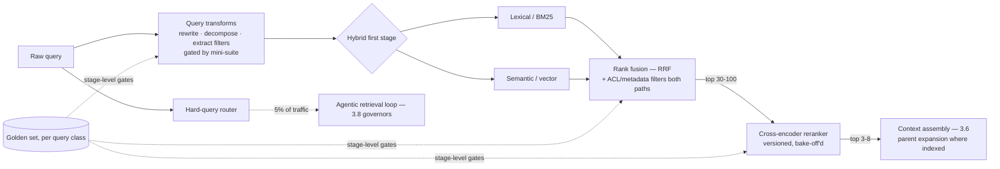

# Chapter 4.2 — Advanced Retrieval

| | |
|---|---|
| **Part** | 4 — Enterprise GenAI Systems |
| **Maturity level** | 3 — Engineer |
| **Difficulty** | Advanced |
| **Estimated study time** | 4 hours (reading 2 h, exercise 2 h) |
| **Prerequisites** | [3.5](../part-3-core-building-blocks-of-genai/chapter-05-embeddings-semantic-search.md); [3.6](../part-3-core-building-blocks-of-genai/chapter-06-rag-fundamentals.md); [4.1](chapter-01-production-rag.md) |

## Learning Objectives

After this chapter you will be able to:

1. Build hybrid retrieval — lexical + semantic with rank fusion — and know why it's the production default, not an optimization.
2. Deploy reranking as a second stage: what cross-encoders buy, what they cost, and where in the latency budget they fit.
3. Apply query-side transformations — rewriting, decomposition, expansion — matched to the query pathologies they fix.
4. Run the retrieval-improvement loop as measurement-driven engineering: taxonomy → targeted fix → golden-set gate, never technique-collecting.

## Introduction

Chapter 3.5 built first-order retrieval and made it measurable; this chapter is the ladder above it — the second-order techniques that close the gap between recall@5 of 0.75 and the 0.9+ that production quality bars demand. The framing discipline matters more than any individual technique: every method here is a *targeted fix for a named failure class* from 3.5's taxonomy (chunking failures got fixed there; this chapter fixes matching failures and ranking failures), and the improvement loop is always the same — read the golden-set misses, name the class, apply the matching technique, re-measure. Teams that skip the diagnosis and install techniques from conference talks accumulate latency and complexity with unmeasured returns; the chapter's job is to make you the other kind of team.

## Business Motivation

Retrieval quality is the binding constraint (3.5) — so the last ten points of recall are worth more than any other ten points in the stack, and they're also the expensive ones. The business shape: a support-deflection system at recall@5 = 0.75 fails to surface the answer for a quarter of answerable questions — those become escalations (cost) or, worse, improvised answers (3.6's failure modes, trust cost); moving to 0.9 converts most of that quartile directly into the system's value proposition, and the techniques that get you there (hybrid, reranking) cost single-digit milliseconds-to-hundreds and fractions of a cent per query — among the best ROI in the stack *when they're the right fix*. The countervailing business fact funds the chapter's discipline: each technique adds latency, cost, and operational surface (another model to version, another stage to monitor), and installed against the wrong failure class it adds them for nothing — the measurement-driven loop is what keeps the retrieval stack an asset rather than an accretion (Vantora's prompt-pile lesson, 2.5, has an exact retrieval analog).

## Theory

### Hybrid retrieval: the production default

2.4 planted this: lexical (BM25) and semantic search win *different query classes* — exact identifiers, codes, names, and rare jargon for lexical; paraphrase, intent, and cross-lingual matching for semantic. Production query streams always contain both classes, so single-mode retrieval always leaves a measured hole (run your golden set split by query class and see). The architecture: run both searches, merge with **reciprocal rank fusion** (RRF — combine by rank position, not by score, since BM25 scores and cosine similarities are incomparable; 4.1's federation rule is the same math) — robust, tuning-light, and the standard first upgrade. The design detail that matters: keep *both indexes* fed by the same ingestion pipeline and metadata schema (one chunk store, two index projections), so filters (ACL, tenancy — 4.1) apply identically to both paths.

### Reranking: precision as a second stage

First-stage retrieval (bi-encoder embeddings) scores query and document *independently* — fast, scalable, and blind to fine-grained interaction ("does this chunk actually answer *this* question, or just share its topic?"). A **cross-encoder reranker** reads query and candidate *together* and scores the pair — far more accurate, far more expensive (a model inference per candidate), which dictates the funnel architecture: first stage retrieves generously (top 30–100, hybrid), the reranker reorders, the top 3–8 survivors enter the context (3.2's budget served better: fewer, better chunks — which often *improves* generation via focused attention, 2.5, while cutting tokens). Costs to design for: latency (tens of ms to ~200ms per query depending on model and candidate count — it must fit the 3.6 loop's budget, 4.12), another versioned model in the stack (3.10's portfolio logic applies: rerankers get bake-offs and migration playbooks too), and the eval discipline — the reranker's gate metric is *precision@k and MRR uplift over the fused first stage* on your golden set, not a leaderboard number (2.7, always).

### Query-side transformations

The query is the retrieval system's most hostile input — short, ambiguous, jargon-mismatched, multi-part. Transformations fix named pathologies:

- **Query rewriting** (an LLM cleans the query: expands acronyms, resolves conversation references — "what about the deductible?" → "what is the deductible in policy form B?") fixes *conversational context loss* — mandatory for chat-based RAG, where the raw last turn is often unsearchable (the rewriter consumes the 3.2 history to produce a standalone query).
- **Decomposition** (split multi-part questions into sub-queries, retrieve per part, merge) fixes *compound questions* whose parts live in different documents — the retrieval-side cousin of 3.8's orchestrator pattern.
- **Expansion / HyDE-style techniques** (generate hypothetical answer text and search with *it*, or add synonyms/related terms) fix *vocabulary mismatch* — queries phrased in user language against documents in expert language (2.4's register gap). Costs an LLM call of latency; measure whether hybrid already covers it before adding.
- **Metadata extraction from the query** ("last quarter's policy" → date filter; "for Germany" → jurisdiction filter) fixes *filterable intent lost in embedding* — routing structured constraints to the metadata system (3.5) where they're exact, instead of hoping the vector space encodes them.

Each transformation is an LLM call in the query path — latency, cost, and a new failure surface (the rewriter can *change the question*; its own mini-suite gates it — 3.3's discipline applies to query prompts too). Install per measured pathology, not as a set.

### Structure-aware and iterative retrieval

Two frontier patterns worth knowing at architect level. **Parent-child / context-expansion retrieval**: index small chunks for matching precision, but return the *parent section* (or expand a window) for generation context — decoupling the matching unit from the context unit, which resolves 3.5's size trade-off rather than compromising on it. **Agentic retrieval**: for questions where one retrieval round can't suffice (the answer requires following references — Halvard & Roth's investigation agent, 3.8), a bounded loop retrieves, reads, reformulates, and retrieves again — powerful, expensive, and governed by everything 3.8 established (budgets, exits, trajectory evals); it's a *task-class escalation*, not a default (route the hard 5% of queries to it — 7.8's tiering logic applied to retrieval depth). **GraphRAG-style knowledge structures** (entities and relations extracted at ingestion, traversed at query time) serve corpus-wide synthesis questions ("what themes recur across all customer complaints?") that similarity search structurally can't — a different data structure for a different question class, with its own heavy ingestion cost (7.7 catalogs the pattern; adopt only against the named question class).

## Architecture Perspective

The advanced stack is a **funnel with governed stages**, each stage a versioned component with its own gate:

Readings. **Every stage is separately measurable** — the funnel's virtue is that recall@100 (first stage), precision@8 (post-rerank), and end-to-end faithfulness (3.6) localize regressions to a stage, exactly as 3.5's taxonomy localized them to a layer; a stack without stage-level metrics is un-debuggable by construction. **Latency is a budget allocated across stages** (4.12's discipline previewed): transforms + first stage + rerank must fit the retrieval SLO, which is why rerank candidate counts and transform usage are *per-query-class policies* (cheap path for simple queries, full funnel for hard ones — the router pattern again), not global settings. **The stack is a portfolio of versioned models** — embedding model, reranker, rewriter prompt — each with 3.10's lifecycle: pinned versions, bake-off harnesses, migration playbooks; an unversioned reranker swap is the same silent-regression vector as an unpinned LLM (2.6).

## Real-world Example

**Vantora Systems** (2.5, 3.7, 3.10) upgraded the support assistant's retrieval when its recall plateau became the quality ceiling — and the upgrade is the improvement loop textbook. The diagnosis pass first: 200 golden-set misses read and taxonomized (3.5's discipline) — 38% were *identifier queries* (error codes, product SKUs) where semantic search returned thematically-similar-but-wrong chunks; 24% were *conversational fragments* ("and on Windows?") unsearchable as raw queries; 19% were *vocabulary mismatch* (customer phrasing vs. documentation register); the rest chunking-and-corpus issues routed back to 3.5-grade fixes. The fixes matched the classes: hybrid with RRF (the identifier class — recall on that slice went from 0.41 to 0.93, BM25 doing exactly what 2.4 promised), a conversation-aware query rewriter (the fragment class — with its own 40-case mini-suite after an early version *changed questions*: "and on Windows?" once became "how to install on Windows" when the topic was uninstalling; the suite now gates rewriter prompt changes), and a reranker evaluated *last* — because after hybrid and rewriting, the remaining precision gap was small; the bake-off showed +4 points MRR for 80ms p95, which the interactive latency budget accepted for the full-funnel path but not the autocomplete path (per-class policy, recorded).

The plateau story has a coda that earned its place in the platform's onboarding deck. Six months later, a new engineer proposed adding HyDE "because it's best practice." The taxonomy said vocabulary mismatch was now 4% of misses — hybrid had eaten most of it. The proposal died in one meeting, replaced by the actual top class (multi-document synthesis questions → a bounded agentic-retrieval route for the hard slice). Adaeze's review comment became the chapter's epigraph in Vantora's internal wiki: *"We don't install techniques. We fix named failure classes and re-measure. The taxonomy decides, not the conference talk."*

## Hands-on Exercise

**Run the improvement loop on your own stack.** Extends the 3.5/3.6 build. ~2 hours.

1. **Taxonomize your misses (30 min).** Run your golden set; collect every query where recall@5 missed. Bucket by class: identifier/exact-match, vocabulary mismatch, conversational fragment (add 5 conversational queries if your set lacks them), compound question, chunking/corpus (route those back). Quantify the buckets.
2. **Hybrid (40 min).** Add BM25 over the same chunk store; implement RRF merging (k=60 constant is standard). Re-measure overall and *per class* — the identifier class should move dramatically; note what didn't move.
3. **One transformation, gated (30 min).** Pick the transformation matching your largest surviving class (likely a rewriter if you added conversational queries). Implement it with a 10-case mini-suite including two does-it-change-the-question probes. Re-measure.
4. **The rerank decision (20 min).** Don't build it — *decide* it: from your post-hybrid numbers, write the half-page memo (1.4 format): what precision gap remains, what a reranker would cost in latency and operations, and whether your numbers justify it. Either answer is fine; the evidence is the deliverable.

**Acceptance criteria:**
- [ ] Miss taxonomy quantified by class before any technique installed
- [ ] Hybrid's per-class impact measured — including the classes it didn't help
- [ ] Transformation gated by its own mini-suite with question-integrity probes
- [ ] Rerank memo argues from your measured gap, not from best practice
- [ ] Every change's effect stated against the noise floor (2.7)

## Enterprise Considerations

At enterprise scale the advanced stack meets governance and multilingual reality. **Stage sprawl across teams:** when the retrieval service (4.1) is shared, its funnel configuration becomes platform policy — per-query-class stage policies, reranker versions, and transform prompts are governed artifacts with the 6.9 change process, because a rewriter prompt tweak now touches every consuming application (the composition-ownership problem, 3.3, at the platform layer). **Multilingual funnels multiply everything:** BM25 needs per-language analyzers, embedding coverage varies by language (2.4), rerankers have their own language profiles, and rewriters must not translate-and-lose-intent — per-language golden-set slices (3.10) gate the whole funnel, and the honest architecture accepts *different funnel configurations per language* where the evidence demands it. **Domain-specific retrieval tuning is a build-vs-buy frontier:** fine-tuned embedding or reranker models on your click/feedback data (the 4.7 feedback loop feeding retrieval training — the compounding flywheel, 1.2) can outperform general models materially, but inherit 2.6's full artifact-governance duties; most enterprises sequence it after the funnel plateaus, not before. **And the feedback loop needs privacy review:** using user clicks and query logs as retrieval training signal is personal-data processing (4.14) — consent basis and retention rules before the flywheel spins.

## Trade-offs

| Decision | Option A | Option B | Choose A when… | Choose B when… |
|----------|----------|----------|----------------|----------------|
| First stage | Hybrid (lexical + semantic, RRF) | Semantic only | Default — identifier and jargon classes exist in every real stream | Corpus provably free of exact-match classes (rare) or infra constraints, measured |
| Reranking | Cross-encoder second stage | Fused first stage only | Measured precision gap at your k; latency budget fits | Post-hybrid gap is small (Vantora's finding); latency-critical paths |
| Query transforms | Per-pathology, mini-suite-gated | None (raw query) | Conversational RAG (rewriter is near-mandatory); measured mismatch classes | Standalone well-formed queries; every transform must earn its latency |
| Hard queries | Route small % to agentic retrieval | One-shot funnel for all | Reference-following/synthesis class named in the taxonomy | The class doesn't exist in your stream — don't build the loop speculatively |

## Common Mistakes

1. **Technique-collecting** — installing hybrid + HyDE + reranker + agentic loops as a "best-practice stack" without a miss taxonomy; unmeasured latency and complexity accretion (the anti-pattern this chapter exists to prevent).
2. **Comparing scores across retrieval modes** — merging BM25 and cosine scores numerically; rank-based fusion or joint reranking, always (the math is incomparable — 4.1's federation rule).
3. **The ungated rewriter** — a query transform that changes questions, silently corrupting retrieval for a slice of traffic; transforms are prompts and get 3.3's suite discipline.
4. **Reranking into a blown latency budget** — 100-candidate cross-encoding on an interactive path; the funnel's candidate counts are per-class latency policies (4.12).
5. **One funnel configuration for all languages** — the English-tuned stack quietly failing the German slice (2.4's inequities compound per stage); per-language slices gate, per-language configs where evidence demands.
6. **ACL filters on one path only** — hybrid's lexical path forgetting the permission filter the vector path applies; both projections share the metadata contract (4.1's enforcement point covers both) — this is a security bug, not a quality bug.
7. **Skipping the per-class measurement** — celebrating overall recall while the identifier class sits at 0.4; the aggregate hides exactly what the taxonomy reveals.

## Best Practices

1. **Taxonomy before technique** — read the misses, quantify the classes, match the fix; re-measure per class against the noise floor. The loop is the method.
2. **Hybrid as the default first stage** — one chunk store, two index projections, RRF, filters enforced on both paths.
3. **Rerank into a funnel, sized by latency budget** — generous first-stage k, small surviving context set; per-query-class policies for candidate counts.
4. **Gate every query transform with its own mini-suite** — including question-integrity probes; rewriters are prompts with blast radius.
5. **Version the whole stack like models** — embedder, reranker, transform prompts: pinned, bake-off'd, migration-playbooked (3.10 applies to every stage).
6. **Slice everything by language and query class** — the funnel config is per-slice policy, and the gates run per slice.
7. **Route retrieval depth like model tier** — cheap path for easy queries, full funnel for hard ones, agentic loop for the named synthesis class; depth is a cost-quality dial (7.8).

## Architecture Checklist

For any retrieval stack beyond first-order:

- [ ] Miss taxonomy exists, quantified by class, refreshed on a cadence; every installed technique maps to a class
- [ ] Hybrid first stage with rank-based fusion; ACL/metadata filters enforced on both projections
- [ ] Reranker (if present) justified by measured precision uplift; candidate counts fit the latency budget per query class
- [ ] Query transforms gated by mini-suites with question-integrity probes
- [ ] Stage-level metrics live: first-stage recall, post-rerank precision/MRR, transform effect — regressions localize to a stage
- [ ] All stack components versioned with bake-off and migration discipline (3.10)
- [ ] Per-language slices gate the funnel; per-slice configurations where evidence demands
- [ ] Agentic/deep retrieval, if present, routed to a named hard class with 3.8's full governors

## Interview Questions

1. *"Your RAG system's recall plateaued at 0.75. Walk me through getting to 0.9."* — Strong answers start with the miss taxonomy, not a technique list: quantify the classes, then match — hybrid for identifiers, rewriting for conversational loss, expansion for vocabulary mismatch, rerank for the precision residue — each re-measured per class; and they route chunking-class misses back to the pipeline.
2. *"Why hybrid retrieval, mechanically?"* — Strong answers give the bi-modal query reality (2.4's lexical/semantic split), the incomparable-scores problem and RRF's rank-based answer, and the operational detail: one chunk store, two projections, filters on both.
3. *"When is a reranker worth it, and what does it cost?"* — Strong answers explain the bi-encoder/cross-encoder interaction gap, the funnel shape it dictates, the measured-uplift-over-fused-baseline gate, and the three costs: latency per candidate, another versioned model, per-class candidate policies — plus Vantora's honest finding that post-hybrid gaps are sometimes too small to justify it.
4. *"What can go wrong with query rewriting?"* — Strong answers name the question-integrity failure (the rewriter answering a different question), prescribe the mini-suite with integrity probes, and generalize: every transform is an LLM call in the hot path with 3.3's full artifact duties.

## Further Reading

- Cormack, Clarke & Buettcher, *Reciprocal Rank Fusion outperforms Condorcet and individual rank learning methods* (SIGIR 2009) — the RRF paper; two pages, permanently useful.
- Nogueira & Cho, *Passage Re-ranking with BERT* (arxiv.org/abs/1901.04085) — the cross-encoder reranking lineage; read at figure level.
- Gao et al., *Precise Zero-Shot Dense Retrieval without Relevance Labels* (HyDE, arxiv.org/abs/2212.10496) — the hypothetical-document technique; adopt only against the named vocabulary-mismatch class.
- Your search platform's hybrid and reranking documentation (official docs) — RRF parameters, analyzer configuration per language, reranker integration points; the operational layer per product.

## Summary

- Advanced retrieval is **targeted fixes for named failure classes**: the improvement loop — taxonomize misses, match technique to class, re-measure per class against the noise floor — is the method; technique-collecting is the anti-pattern.
- **Hybrid (lexical + semantic + RRF) is the production default**, because real query streams are bi-modal; one chunk store, two projections, filters enforced on both.
- **Reranking is a funnel stage**: generous first-stage k, cross-encoder precision on the survivors, smaller-better context sets — justified by measured uplift, sized by latency budget, versioned like any model.
- **Query transforms fix query pathologies** — rewriting for conversational loss (near-mandatory in chat), decomposition for compound questions, expansion for vocabulary mismatch, metadata extraction for filterable intent — each an LLM call gated by its own mini-suite.
- **Depth routes like tier**: cheap paths for easy queries, full funnel for hard ones, bounded agentic retrieval for the named synthesis class — and the whole stack carries 3.10's versioning, bake-off, and migration discipline per stage.

---

**Previous:** [Chapter 4.1 — Production RAG Architecture](chapter-01-production-rag.md) · **Next:** [Chapter 4.3 — Document Ingestion at Enterprise Scale](chapter-03-document-ingestion.md) · **Related:** [3.5 Embeddings & Semantic Search](../part-3-core-building-blocks-of-genai/chapter-05-embeddings-semantic-search.md), [2.4 NLP Essentials](../part-2-artificial-intelligence/chapter-04-nlp-essentials.md), [7.7 Knowledge & Data Patterns](../part-7-enterprise-ai-architecture-patterns/chapter-07-knowledge-data-patterns.md)
