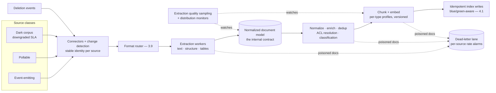

# Chapter 4.3 — Document Ingestion at Enterprise Scale

| | |
|---|---|
| **Part** | 4 — Enterprise GenAI Systems |
| **Maturity level** | 3 — Engineer |
| **Difficulty** | Advanced |
| **Estimated study time** | 3–4 hours (reading 2 h, exercise 90 min) |
| **Prerequisites** | [3.5](../part-3-core-building-blocks-of-genai/chapter-05-embeddings-semantic-search.md); [3.9](../part-3-core-building-blocks-of-genai/chapter-09-multimodal-models.md); [4.1](chapter-01-production-rag.md) |

## Learning Objectives

After this chapter you will be able to:

1. Design the industrial ingestion pipeline: connectors, extraction, normalization, enrichment, chunking, embedding, index writes — with idempotency and failure isolation at each stage.
2. Handle the real enterprise corpus: format zoo, tables and layout, duplicates and near-duplicates, versions, and the quality long tail.
3. Build ingestion observability: per-stage failure taxonomy, extraction quality sampling, and the pipeline-health signals that precede quality complaints.
4. Operate the lifecycle at scale: change detection per source class, backfills and reprocessing campaigns, and deletion as a pipeline citizen.

## Introduction

Ingestion is the least glamorous and most consequential system in the RAG stack — the place where 3.5's "the quality is determined upstream" becomes an industrial reality. Everything downstream — retrieval (4.2), generation (3.6), the audit story (4.1) — consumes what this pipeline produces, and no downstream technique recovers what extraction mangled, chunking orphaned, or the connector silently dropped.

The chapter's honest frame: enterprise ingestion is **data engineering with a document-shaped twist**, and its difficulty is distributional. The demo corpus is clean PDFs; the production corpus is a twenty-year archaeological dig — scanned faxes, PowerPoint decks with the content in speaker notes, Excel files pretending to be documents, seven near-identical copies of every policy, and the one load-bearing table that every extractor destroys differently. The pipeline that survives contact is built for the distribution, instrumented per stage, and rebuildable by design.

## Business Motivation

Ingestion quality is invisible until it's expensive. The visible costs arrive as downstream incidents wearing other systems' names: the "retrieval failure" that was a dropped connector (the source went stale for six weeks; nobody's dashboard noticed), the "hallucination" that was a mangled table (the extractor linearized a rate table into word soup; the model read it plausibly and wrong), the "compliance finding" that was a deletion that never propagated (4.1's probe, failed). Each gets triaged as a model or retrieval problem first — burning diagnosis time at the wrong layer (2.4's discipline: work upstream) — and each traces to pipeline engineering that would have cost a fraction of the incident. The positive case is equally concrete: ingestion is the *shared* layer (4.1's platform economics) — one pipeline serving every index and application means extraction improvements, dedup, and freshness fixes compound across the whole estate, which is why [P12](../../projects/README.md) treats the ingestion platform as a product with internal customers, SLAs, and a roadmap, not a script collection.

## Theory

### The pipeline stages

1. **Connectors & change detection** — per-source adapters pulling documents and, critically, *changes*. The source classes: event-emitting systems (webhooks, change feeds — the good case), pollable systems (list-and-diff on a schedule), and the dark corpus (file shares, email archives — crawled, with checksum-based change detection). 4.1's rule: sources without reliable change signals get *explicitly downgraded freshness SLAs* — the pipeline's honesty starts at the connector.
2. **Extraction** — bytes to text-plus-structure. The format zoo demands a routing layer (3.9's modality router is the same component): native-digital PDFs vs. scanned (OCR/vision path), office formats (including speaker notes, comments, and tracked changes — *decide explicitly* what's content), HTML (boilerplate stripping), email (threading, signatures, disclaimers). **Tables are the boss fight**: naive extraction linearizes them into meaninglessness; production pipelines detect tables and route them to structure-preserving extraction (vision models increasingly win here — 3.9's decision table), storing them as structured objects or markdown that survives chunking. Extraction output is a **normalized document model** — text, structure tree, tables, metadata — the pipeline's internal contract (every downstream stage consumes it; extractor changes don't ripple).
3. **Normalization & enrichment** — cleanup (encoding, whitespace, boilerplate), then the metadata that retrieval lives on (3.5): source, dates, ACL labels resolved from the source system, language detection, document type classification, and **deduplication** — exact (checksums) and near-duplicate (shingling/similarity), because enterprise corpora are 20–40% copies and the retrieval experience of seven near-identical top-5 results is a quality failure all its own (canonicalize: pick the authoritative copy via source-priority rules, link the rest).
4. **Chunking & embedding** — 3.5's craft, executed by config-versioned workers; per-document-type chunking profiles (the structure-awareness lives here), embedding with the pinned model, batch-optimized (embedding cost at corpus scale is a real line — 1.7).
5. **Index writes** — idempotent upserts keyed on stable document+chunk identity, transactional per document (never half a document's chunks), blue/green-aware (4.1).

### Pipeline engineering properties

The properties that separate industrial from artisanal:

- **Idempotency everywhere** — every stage re-runnable on the same input without duplication or corruption; the property that makes retries, backfills, and disaster recovery boring (stable IDs are the foundation: document identity that survives renames and moves is a per-source design problem worth real thought).
- **Failure isolation with a dead-letter lane** — one poisoned document (the 4GB PDF, the encrypted attachment, the format from 1997) must not stall the pipeline; it routes to a dead-letter queue with full context for triage, and *the dead-letter rate per source is a dashboard metric* — rising DLQ is the earliest signal of a source-format change.
- **Reprocessing as a first-class operation** — extractor upgrades, chunker changes, new enrichments all mean "re-run N million documents through stage X onward"; the pipeline that treats this as a designed campaign (rate-limited, progress-tracked, blue/green-targeted) upgrades continuously; the one that doesn't, freezes at its launch-day quality.
- **Deletion as a pipeline citizen** — deletes flow through the same stages as creates (detect → propagate → verify), with 4.1's probes as the acceptance test.

### Ingestion observability

The pipeline's dashboard answers "is the corpus healthy?" before users ask "why are answers bad?":

- **Per-stage, per-source metrics**: throughput, latency, failure and DLQ rates, freshness lag (indexed-version age vs. source — 4.1's SLA metric).
- **Extraction quality sampling** — the stage that can't be schema-validated gets *sampled*: a continuous trickle of extracted documents rendered side-by-side with sources for human (or vision-model judge — 2.7's calibration duties) review, scored on a rubric (text completeness, table integrity, structure preservation); the sample rate concentrates on new sources and post-upgrade periods. This is the pipeline's eval suite, and it catches the mangled-table class before generation does.
- **Distribution monitors** — chunk-size distributions, language mix, document-type mix per source: a format change upstream arrives as a distribution shift here, weeks before it arrives as a user complaint (2.2's drift discipline, applied to the pipeline's own outputs).

## Architecture Perspective

Readings. **The normalized document model is the pipeline's API** — extractors, enrichers, and chunkers evolve independently against it; it's the schema-treaty discipline (3.4) applied internally, and it's what makes the reprocessing campaign tractable (re-run from the stage that changed, not from bytes). **The pipeline is the only writer** (4.1's topology): all index mutations flow through it, which is what makes indexes rebuildable, audits answerable, and blue/green possible — any side-door writer forfeits all three. **Batch and streaming are lanes, not architectures** — the same stages serve event-driven single-document flows (freshness) and million-document campaigns (backfills, reprocessing); designing the stages once and the lanes as scheduling is the maintainable shape (4.6's orchestration machinery runs the campaigns).

## Real-world Example

**Bellhaven Insurance** (1.3, 2.1, 3.4) scaled the intake platform's ingestion from broker emails to the full policy-and-claims document estate — 14 million documents across a DMS, three legacy systems, and a file-share archipelago — and the war stories map the chapter. **The table incident:** commercial property schedules (the rate-bearing tables underwriters live on) were being linearized by the PDF extractor; the RAG system's answers about coverage limits were fluent and wrong (the "hallucination" that wasn't — the model faithfully read soup). The fix built the format router's table path: detection, vision-model extraction to structured markdown (3.9's decision table applied), and — the lasting change — *table integrity became a rubric line in extraction quality sampling*, with property schedules over-sampled. **The duplicate plague:** the first index contained each policy wording an average of 6.2 times (broker copies, claims copies, email attachments); retrieval returned five near-identical chunks per query, burying the differentiated content. Near-dup detection with source-priority canonicalization (DMS beats file share beats email attachment) cut the index 61% and measurably *improved* recall@5 — less noise, same signal, smaller bill. **The silent connector:** a legacy system's API credential expired; the connector failed quietly for five weeks; the freshness-lag dashboard existed but had no alert threshold for that source (it was "the stable one"). The incident review's fix was mechanical — lag alerts on every source, no exceptions — and cultural: the pipeline team adopted the "every source lies eventually" doctrine, and the DLQ-rate and distribution monitors got the same no-exceptions treatment. Tomás's platform-review line: *"Our worst quality incidents were never in the AI. They were in the plumbing, wearing the AI's jersey."*

## Hands-on Exercise

**Build a miniature industrial pipeline.** ~90 minutes. Corpus: assemble 25 deliberately messy documents — include 2 scanned/photographed pages, 3 with real tables, 4 near-duplicates of one document, one huge file, one corrupt/empty file.

1. **Stages with isolation (40 min).** Implement the pipeline as discrete stages over a normalized document model (a dict/JSON contract): route (digital vs. scan path), extract (table-aware for at least one path), enrich (checksum dedup + near-dup detection via shingling or embedding similarity; source/date metadata), chunk (your 3.5 profiles), write (idempotent upserts on stable IDs). Poisoned files must land in a DLQ with context, not crash the run.
2. **Idempotency proof (15 min).** Run the full pipeline twice; prove the index is identical (counts, checksums). Modify one document; re-run; prove only its chunks changed.
3. **Quality sampling (20 min).** Render 3 extracted documents (including a table one) side-by-side with sources; score against a 3-line rubric (text completeness, table integrity, structure). Note what the table path saved vs. naive extraction.
4. **The reprocessing campaign (15 min).** Change your chunking profile; re-run *from the chunking stage only* (the normalized model makes this possible); verify the index reflects it and nothing upstream re-executed.

**Acceptance criteria:**
- [ ] Poisoned files in DLQ with context; pipeline completes despite them
- [ ] Double-run produces identical index; single-doc change touches only its chunks
- [ ] Near-duplicates canonicalized (one authoritative copy indexed, others linked)
- [ ] Table extraction demonstrably survives to the chunk level
- [ ] Stage-targeted reprocessing works without upstream re-execution

## Enterprise Considerations

Enterprise ingestion is where the data estate's ownership questions become production dependencies. **Connector governance:** every connector embeds assumptions about someone else's system — API contracts, rate limits, semantic quirks — and source-system upgrades break connectors on the source team's schedule, not yours; the mature posture is connector contract tests run continuously (the handshake that fails loudly instead of the credential that expires silently) plus a named contact per source (6.7's ownership registry doing double duty). **Content-decision policies need owners:** whether speaker notes, tracked changes, comments, and email disclaimers are "content" is a *policy* question with legal weight (tracked changes in contracts; privileged comments in legal docs — a discoverability and confidentiality decision, not an extraction default), decided per corpus with its owner and recorded. **Sensitive-content scanning belongs in the pipeline:** ingestion is the natural checkpoint for PII/secret detection (the credential pasted into a wiki page, now retrievable by everyone with wiki access — a real and recurring incident class); flag-and-quarantine at the enrichment stage, with 4.8's machinery. **And ingestion cost is a capacity plan:** embedding at corpus scale, vision-extraction at page scale, and reprocessing campaigns are batch compute with real bills (1.7's non-inference lines) — the campaign calendar belongs in the budget cycle, and batch pricing lanes (4.11) exist for exactly this workload.

## Trade-offs

| Decision | Option A | Option B | Choose A when… | Choose B when… |
|----------|----------|----------|----------------|----------------|
| Extraction quality | Vision-model path for structure-heavy docs | Classical extractors everywhere | Tables/layout carry meaning; sampling shows classical mangles them | Clean digital text at volume — route, don't blanket (3.9) |
| Dedup aggressiveness | Near-dup canonicalization | Exact-dup only | Corpus has copy culture (email, shares) — most do | Near-dups are meaningfully distinct versions (then it's *versioning*, 3.5, not dedup) |
| Freshness architecture | Event-driven per source | Scheduled crawls | Sources emit events; SLA tight | No events — with the SLA downgrade stated, per 4.1 |
| Pipeline evolution | Reprocessing campaigns from the changed stage | Full re-ingestion each change | Normalized model exists (it should) | Contract itself changed — the rare full rebuild |

## Common Mistakes

1. **Triaging pipeline failures at the model layer** — the mangled table diagnosed as hallucination, the stale source as retrieval failure; work upstream first (2.4's discipline; Bellhaven's jersey line).
2. **Naive table extraction** — linearized rate tables read fluently and wrong; tables get detection, a structure-preserving path, and a rubric line in sampling.
3. **No dead-letter lane** — the poisoned document stalling the nightly run, or worse, silently skipped without record; isolate, queue, alarm on the rate.
4. **Unstable document identity** — IDs that change on rename/move, producing duplicate chunks and broken deletion; identity design per source is foundational, not incidental.
5. **The silent connector** — no lag alert because the source was "stable"; every source lies eventually — no-exceptions monitoring.
6. **Skipping dedup** — the seven-copies index degrading retrieval and multiplying cost; canonicalize with source priority.
7. **Launch-day pipeline freeze** — no reprocessing capability, so extractor and chunker improvements never reach the existing corpus; the campaign machinery is what lets quality compound.
8. **Ingestion-side ACL resolution skipped** — chunks indexed without permission labels "to add later"; 4.1's enforcement point has nothing to enforce, and the retrofit is a full reprocess.

## Best Practices

1. **Route by format and structure; give tables their own path** — the modality router (3.9) is the pipeline's front door, and table integrity is a first-class quality dimension.
2. **Define the normalized document model early and treat it as a treaty** — the internal contract that decouples stages and enables targeted reprocessing.
3. **Make every stage idempotent on stable identity** — the property that makes everything else (retries, backfills, recovery) boring.
4. **Instrument per stage, per source: DLQ rates, freshness lag, distribution monitors — no exceptions** — the pipeline anomaly precedes the quality complaint.
5. **Sample extraction quality continuously** — side-by-side rubric review, over-sampling new sources and post-upgrade windows; it's the eval suite for the stage that can't self-validate.
6. **Canonicalize near-duplicates with source-priority rules** — smaller index, better retrieval, cheaper bill.
7. **Build the reprocessing campaign as a product feature** — rate-limited, tracked, stage-targeted, blue/green-aimed; quality improvements must reach the whole corpus.
8. **Resolve ACLs and scan for sensitive content at ingestion** — the pipeline is the checkpoint; retrofits are full reprocesses.

## Architecture Checklist

For any ingestion pipeline feeding retrieval:

- [ ] Source classes identified; change detection per class; freshness SLAs stated (and downgraded where honest)
- [ ] Format router in place; tables detected and structure-preservingly extracted; scanned/photographed path exists
- [ ] Normalized document model defined, versioned, and treated as the internal contract
- [ ] Stable document/chunk identity per source; all writes idempotent; per-document transactionality
- [ ] Dead-letter lane with context capture and per-source rate alarms
- [ ] Dedup (exact + near) with canonicalization rules; versions handled as versions, not dups
- [ ] ACL labels resolved and sensitive-content scanning applied at ingestion
- [ ] Per-stage/per-source observability: throughput, failures, DLQ, freshness lag, output distributions — alerts without exceptions
- [ ] Extraction quality sampling running with a rubric; concentrated on new/changed paths
- [ ] Reprocessing campaigns supported from any stage; deletion flows the same stages with probes (4.1)

## Interview Questions

1. *"What makes enterprise document ingestion hard, when parsing a PDF is a solved problem?"* — Strong answers go distributional: the format zoo and its router, tables as the boss fight, duplicates and identity, silent source failures, and the observability that catches pipeline problems before they masquerade as model problems.
2. *"Your RAG answers about pricing tables are fluent and wrong. Diagnose."* — Strong answers suspect extraction first (linearized tables), verify via the normalized model and sampling rubric, fix with the table path — and note the general lesson: upstream layers wear downstream jerseys.
3. *"Design change detection across a DMS with webhooks, a legacy API, and a file share."* — Strong answers differentiate per source class (events, poll-and-diff, checksummed crawl), state per-source freshness SLAs honestly, and add the no-exceptions lag alerting that catches the silent connector.
4. *"How do you upgrade your extractor across a 10-million-document corpus?"* — Strong answers use the machinery: normalized model enables stage-targeted reprocessing, campaign tooling (rate limits, progress, cost as batch compute), blue/green index target, quality sampling concentrated on the new path, golden-set gates before cutover (4.1).

## Further Reading

- Your extraction toolchain's documentation (official docs of your PDF/OCR/office-format libraries and vision-extraction providers) — capability boundaries per format are the router's design input; re-survey annually, the vision path moves fast (3.9).
- Broder, *On the resemblance and containment of documents* (the shingling paper) — the classic near-duplicate technique; concept-level read.
- The [RAG design checklist](../../checklists/rag-design-checklist.md) — its corpus and ingestion lines are this chapter's contract; P12 implements the full platform.
- Data engineering canon on idempotent pipelines and dead-letter patterns (e.g., *Designing Data-Intensive Applications*, Kleppmann — the reliability chapters) — the substrate discipline this chapter applies to documents.

## Summary

- Ingestion is **data engineering for the document distribution you actually have**: format router with a real table path, normalized document model as the internal treaty, idempotent stages on stable identity, dead-letter isolation.
- **The pipeline's failures wear downstream jerseys** — mangled tables read as hallucination, stale connectors as retrieval failure; per-stage observability (DLQ rates, freshness lag, distribution monitors, extraction sampling) catches them at the true layer, weeks earlier.
- **Duplicates, versions, and identity** are corpus-scale quality problems: near-dup canonicalization with source priority shrinks the index and improves retrieval simultaneously.
- **Reprocessing campaigns are the pipeline's upgrade path** — stage-targeted, blue/green-aimed, budgeted as batch compute; without them, corpus quality freezes at launch day.
- ACL resolution, sensitive-content scanning, and deletion all live *in* the pipeline — the checkpoint everything must pass; retrofits are full reprocesses. With the knowledge side industrialized, the next chapters turn to **agents in production** (4.4–4.6).

---

**Previous:** [Chapter 4.2 — Advanced Retrieval](chapter-02-advanced-retrieval.md) · **Next:** [Chapter 4.4 — Agent Architectures in Production](chapter-04-agent-architectures-production.md) · **Related:** [3.9 Multimodal Models](../part-3-core-building-blocks-of-genai/chapter-09-multimodal-models.md), [4.1 Production RAG](chapter-01-production-rag.md), [6.7 Data Governance](../part-6-enterprise-architecture/README.md)
