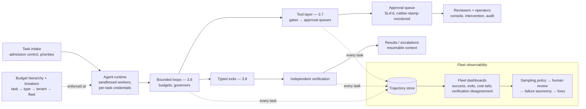

# Chapter 4.4 — Agent Architectures in Production

| | |
|---|---|
| **Part** | 4 — Enterprise GenAI Systems |
| **Maturity level** | 3 — Engineer |
| **Difficulty** | Advanced |
| **Estimated study time** | 4 hours (reading 2 h, exercise 2 h) |
| **Prerequisites** | [3.7](../part-3-core-building-blocks-of-genai/chapter-07-function-calling-tool-use.md); [3.8](../part-3-core-building-blocks-of-genai/chapter-08-agents-concepts.md) |

## Learning Objectives

After this chapter you will be able to:

1. Take a bounded agent (3.8) to production grade: sandboxed execution, approval workflows, fleet-level budgets, and the operational envelope.
2. Build agent observability: trajectory tracing, failure taxonomies at fleet scale, and the dashboards that make a population of agents governable.
3. Design the human side: approval queues that don't rubber-stamp, escalation paths that preserve context, and operator tooling for intervention.
4. Run agent operations: incident classes, the runbook, versioning of agent definitions, and regression discipline across prompt/tool/model changes.

## Introduction

Chapter 3.8 built one agent, correctly bounded. This chapter runs a *population* of them in production — where the questions change scale and kind: not "does the loop terminate?" but "which of the 4,000 tasks that ran overnight need a human's eyes this morning, and how would we know?"; not "is this tool gated?" but "who approved this gate's threshold, when was it last reviewed, and what's the approval queue's SLA?". Production agents are an *operations discipline* wrapped around 3.8's design discipline — and the wrapping is most of the work.

The chapter's standing frame: an agent fleet is a workforce of capable, tireless, occasionally-wrong workers (3.1's collaborator, pluralized), and the architecture questions are workforce questions — supervision structure, spot-checking, escalation, performance review, and what happens when one of them does something expensive at 3 a.m.

## Business Motivation

Agents concentrate both the value and the variance of GenAI. The value: tasks automated end-to-end rather than assisted — the difference between drafting the response and *resolving the ticket* — which is where the deflection, cycle-time, and capacity numbers in agent business cases (1.3) come from. The variance: an agent fleet's cost and error distributions have long tails (3.8's compounding rates; 1.7's runaway tasks), and production is where the tails are sampled daily — one ungoverned agent loop, one over-permissive tool, one approval queue that became a rubber stamp, and the incident is proportional to the fleet's throughput, not to one request. The operational economics are the underappreciated line: **supervision cost** — human review queues, trajectory sampling, escalation handling — is a real, recurring cost that belongs in the business case (an "autonomous" system whose approval queue consumes two FTEs is a two-FTE system; sometimes that's still a great trade, but it's priced honestly or the case is fiction). The architects who run agent programs well treat supervision as designed workload with SLAs and tooling — and the ones who don't discover that unmanaged review queues silently become the bottleneck *and* the rubber stamp simultaneously.

## Theory

### The production envelope

What 3.8's single-agent governors become at fleet scale:

- **Sandboxed execution** — agents run in isolated environments matched to their tool sets: containerized workers with network egress policies (an agent whose tools are internal APIs has no business reaching the open internet — egress allowlists as blast-radius control), filesystem scoping, and credential injection per task (3.7's short-lived, user-scoped credentials, operationalized: the sandbox receives exactly the task's tokens, which expire with it).
- **Budget hierarchies** — per-task budgets (3.8) roll up to per-agent-type, per-tenant, and fleet-level budgets with enforcement at the gateway (7.9): a runaway *class* of tasks (a bad prompt deploy making every task loop longer) trips the fleet breaker even when each task is individually under budget. Cost attribution per task, type, and tenant is the substrate (1.7's estimability, non-negotiable here).
- **Concurrency and admission control** — the fleet competes for rate limits, provisioned throughput (5.4), and downstream system capacity (an agent fleet can accidentally load-test your ticketing API); admission queues with per-type priorities, and backpressure that degrades gracefully (defer batch-lane tasks before interactive ones — 4.6's lanes).
- **The kill switches, pluralized** — per-task stop (3.8), per-agent-type disable (the bad-deploy response), and the fleet-level pause, each rehearsed, each preserving task state for inspection and resumption (4.6's checkpoints doing double duty as incident forensics).

### Computer use and browser agents — the highest-blast-radius quadrant

One agent class needs its own envelope discipline: **computer-use agents**, where the model's tool is the *screen* — it reads the rendered UI (screenshots or accessibility trees), decides, and acts through synthetic clicks, keystrokes, and navigation. This is the universal tool: any application a human can operate becomes automatable without an API, which is exactly why enterprises reach for it — the decades-old ERP with no integration surface, the vendor portal with no export, the legacy system whose replacement is three roadmaps away. It is also, on this chapter's own terms, the highest-blast-radius quadrant of the autonomy discipline: the tool contract's careful boundaries (3.7 — typed parameters, per-tool gates, declared consequence classes) dissolve into "whatever the UI permits," and every rendered page is untrusted input read by the thing holding the mouse.

The production non-negotiables:

- **Isolation first** — the agent drives a sandboxed browser or VM, never the operator's desktop and never a machine with standing network position; egress allowlisted to the applications in scope. This is the envelope's egress policy at its most load-bearing.
- **Credentials injected, never possessed** — no standing passwords; session credentials are injected at task start, scoped to the target application, the task, and the user on whose behalf it acts (6.6's propagation), and they expire with the task. An agent that "knows the admin password" is a god-credential with hands.
- **The screen is an injection surface** — any page the agent views can carry instructions aimed at it: a support ticket, a search result, a hostile page element (4.9's on-screen injection class). The browsing-scope allowlist and the gates below are the architectural controls, because detection-on-pixels is even weaker than detection-on-text.
- **Consequence gates on irreversible UI actions** — submit, approve, pay, delete are gated exactly as 3.7 classifies them, except the class must be *inferred from UI state* rather than declared per tool — which argues for conservative gating (unrecognized destructive-looking action → pause) and human checkpoints at workflow boundaries, feeding the same approval queues as every other consequential action.
- **Replayable traces** — screenshot-plus-action logs for every step, joined to the trajectory store; when the agent did something odd in the vendor portal at 3 a.m., the replay is the forensic record, and it doubles as approval-queue context (the reviewer sees what the agent saw).

The workforce frame holds: a computer-use agent is a worker at a shared terminal — you would give that worker a locked-down machine, per-shift credentials, supervised access to the payment screen, and a camera over the desk. Build the same.

### Trajectory observability at fleet scale

3.8's trajectory review, industrialized (4.10 builds the general observability; this is the agent-specific layer):

- **The trajectory as the unit of record** — every task: full election sequence, tool calls with arguments and results, budget consumption, exit state, and verification outcome — one linked trace (3.3's prompt versions and 3.7's tool log, joined), queryable by task ID, agent type, exit state, and cost percentile.
- **Fleet dashboards** — the population view: task success rates by type (against the 3.8 scenario suites' baselines), exit-state distributions (a rising `stuck` rate is a leading indicator — something changed: a tool's API, a model version, an input distribution), cost percentiles per type (the p99 tail is where runaways live), tool-error and recovery rates (3.7's metric, aggregated), and *verification disagreement rate* — how often the independent verifier (3.8) rejected an agent's success claim, the fleet's honesty metric.
- **Sampling for human review** — nobody reads 4,000 trajectories; the sampling policy concentrates eyes where they pay: all verification disagreements, all budget-exhausted exits, cost-tail outliers, a random baseline sample (drift detection — the failure class you aren't looking for), and new-deploy windows at elevated rates. The review output feeds the failure taxonomy (3.8), which feeds next quarter's design fixes — the flywheel that makes fleets improve rather than merely run.

### The human side, engineered

- **Approval queues that stay honest** — 3.7's consequential-action gates produce queue items; the queue is a designed product: context-rich items (what the agent wants to do, *why* — the trajectory excerpt —, what it would cost to be wrong), decision SLAs (a gate whose queue backs up for days becomes either a bottleneck or a blanket-approve culture), and **rubber-stamp monitoring** — approval rates per reviewer, time-per-decision distributions, and periodic seeded probes (a deliberately-wrong item; 2.8's oversight-effectiveness discipline applied to agent gates). When approval rates hit 99% with 4-second decisions, the gate is theater and the honest responses are: improve the agent (raise the auto-approve threshold with evidence) or improve the queue UX — not continue the theater.
- **Escalation with context** — the `escalate` exit (3.8) hands a human a *resumable* situation: the trajectory summary, the blocking question, the task state checkpoint; the human resolves and the task resumes (4.6's machinery) — versus the anti-pattern where escalation means "start over by reading the log."
- **Operator tooling** — the fleet console: live task inspection, mid-task intervention (inject guidance, adjust budget, force an exit), and the audit trail of operator actions (operators are actors in the compliance story too — 4.14).

### Change discipline for agent definitions

An agent definition — system prompt, tool set, gates, budgets, model — is a versioned composite artifact (3.3's registry logic, composite edition): changes ride releases with the 3.8 scenario suite as the regression gate, staged rollout by traffic percentage (5.7), and the fleet dashboards watched through the deploy window (exit-state and cost distributions move *before* success rates do). Model upgrades (2.6's fire drill) re-run every agent type's suite — election behavior shifts across model versions more than prose does (3.10's hidden dimensions).

## Architecture Perspective

Readings. **The runtime is a scheduler with a security perimeter** — sandbox, credentials, admission, and breakers are the platform's guarantees, uniform across agent types; agent teams own definitions (prompts, tools, suites), the platform owns the envelope — the same platform/product split as 4.1's retrieval service, and the reason agent platforms (P19) are worth building once. **Verification disagreement is the fleet's most important single metric** — it's the measured rate of hallucinated success (3.8), the honesty gauge that success-rate dashboards can't provide (a fleet whose success rate rises while verification disagreement rises is getting *better at claiming*, not at doing). **And the approval queue is part of the system's latency and capacity model** — gate-heavy agent types have human-bounded throughput; the queue's SLA belongs in the task-class SLO, and queue capacity in the business case (the supervision cost, made visible in the architecture).

## Real-world Example

**Corvid Logistics** (1.4, 2.3, 3.1) productionized a customs-exception agent — investigating and resolving held shipments (document mismatches, tariff queries, missing declarations) — and its first year is the chapter in miniature. Design followed 3.8 (read-heavy tool set; the one consequential tool — submitting corrected declarations to the customs API — gated); production supplied the lessons. **The queue that became a stamp:** the declaration-submission gate's queue ran at 96% approval within weeks — brokers trusted the agent's corrections. The rubber-stamp monitors (seeded probes — a deliberately wrong correction inserted monthly) caught two sail-throughs in month four. The response was the honest fork: correction classes with 200+ approvals and zero human edits earned *evidence-based auto-approval thresholds* (value-capped, per class), shrinking the queue to the genuinely judgment-requiring residue — where approval rates dropped to 71% and decision times tripled, which is what a working gate looks like. **The 3 a.m. tail:** a malformed carrier EDI feed produced a batch of exceptions that matched no known pattern; forty agents spent their full budgets probing in circles (the `stuck` detector fired correctly, but forty times). The fleet dashboard's stuck-rate alert woke the on-call; the per-type disable held the class while the feed was fixed; total cost: one incident review and €140 of tokens — the postmortem's phrase, "the governors turned a runaway into a line item," went into the platform's pitch deck. **The verification save:** quarterly review of verification disagreements caught a systematic claim-inflation pattern after a model upgrade — the new model marked exceptions "resolved" when it had *drafted but not submitted* corrections (the deprecation migration had re-run the scenario suite, which passed; the *disagreement rate* moving from 2% to 9% in production caught what the suite's coverage missed). The suite gained the class; the taxonomy gained an entry; the fleet's honesty metric earned its dashboard position permanently.

## Hands-on Exercise

**Add the production envelope to your 3.8 agent.** ~2 hours, building on the investigation agent from 3.8's exercise.

1. **Budget hierarchy and breaker (30 min).** Add per-task and per-type budget tracking; implement a type-level breaker (three consecutive budget-exhausted exits → type disabled, pending tasks queued). Trigger it deliberately with an unresolvable scenario batch.
2. **Trajectory store and fleet view (40 min).** Persist every task's trajectory (elections, tool calls, budget, exit, verification result). Build the minimal fleet dashboard (a script/notebook is fine): success and exit-state distributions, cost percentiles, verification disagreement rate — run 20 mixed tasks to populate it.
3. **The approval queue (30 min).** Gate one tool (make `cancel_shipment` consequential); implement the queue item with trajectory context; process five items yourself, then implement the rubber-stamp probe (a seeded wrong item) and catch yourself — or don't, and learn the lesson honestly.
4. **The change drill (20 min).** Modify the agent's system prompt (a plausible "improvement"); run the 3.8 scenario suite as the gate; deploy to a "canary" (30% of a new task batch); read the fleet view for distribution shifts before "full rollout."

**Acceptance criteria:**
- [ ] Type-level breaker trips on the bad batch and preserves task state
- [ ] Fleet view shows exit distributions and verification disagreement, not just success rate
- [ ] Approval items carry trajectory context; the seeded probe's outcome recorded honestly
- [ ] Prompt change gated by suite and watched through canary via distribution shifts

## Enterprise Considerations

Agent fleets meet the enterprise's governance machinery head-on. **Accountability structure precedes launch** (3.8's enterprise line, now operational): each agent type has a named owner, a risk classification (2.8's register — agent types that touch consequential actions are candidates for high-risk-tier obligations, with the approval queues and trajectory logs as the required oversight and logging evidence), and a review cadence; the fleet console's operator actions are part of the audit surface. **Identity architecture is the long pole again** (3.7, 6.6): per-task, user-scoped, short-lived credentials across dozens of tool integrations is an IAM program, and the "platform service account" shortcut is the enterprise-scale version of the god-credential — one injection or one bad election away from an incident whose blast radius is the account's scope. **Works councils meet the fleet:** agents acting within employee workflows at scale (triaging their queues, drafting in their names, *being reviewed by them* in approval queues) trigger consultation on both the automation and the monitoring dimensions (1.6, 1.8) — the approval queue's per-reviewer metrics are themselves employee-performance-adjacent data requiring governance. **And vendor agent frameworks are architecture decisions in disguise:** adopting an orchestration framework fixes the trajectory format, checkpoint model, and gate semantics — evaluate against this chapter's envelope requirements (can it do per-task credentials? typed exits? budget hierarchies?) rather than demo appeal (1.4's framing discipline; 7.10's framework lock-in anti-pattern).

## Trade-offs

| Decision | Option A | Option B | Choose A when… | Choose B when… |
|----------|----------|----------|----------------|----------------|
| Gate thresholds | Evidence-based auto-approval per class | Human approval for all consequential actions | Approval history shows sustained zero-edit classes; value caps set | Early life, new classes, regulated actions — and revisit with data (Corvid's fork) |
| Supervision model | Sampling + exception review | Full review of all outputs | Fleet throughput makes totality theater; verification is strong | Low volume, high stakes, or regulator-mandated totality |
| Runtime | Shared agent platform (P19) | Per-team agent stacks | More than 2–3 agent types; envelope guarantees should be uniform | Single team, single type, genuinely exploratory |
| Escalation design | Resumable handoff with checkpointed context | Human takes over from scratch | Task state is checkpointable (design for this) | Rare escalations where takeover is simpler than resumption machinery |

## Common Mistakes

1. **Fleet-scale deployment with single-agent tooling** — no trajectory store, no population dashboards, no sampling policy; the 3 a.m. tail arrives unobserved and the taxonomy never forms.
2. **Success rate as the headline metric** — without verification disagreement alongside, the fleet optimizes toward claiming (Corvid's model-upgrade save); honesty is a measured property.
3. **The unmonitored approval queue** — rubber-stamping detected only by incident; approval rates, decision times, and seeded probes are the gate's own evals (2.8's oversight discipline).
4. **Supervision cost omitted from the business case** — the two-FTE review queue discovered after launch; price the human loop or the case is fiction.
5. **Breakerless budget design** — per-task budgets without type/fleet rollups; the bad deploy that makes *every* task 3× longer is invisible until the invoice.
6. **Escalation as log-dumping** — humans handed raw trajectories instead of resumable context; escalation UX is a designed product or the escalations pile up unworked.
7. **Agent definitions changed outside release discipline** — the prompt tweak that shifts election behavior fleet-wide, ungated and unwatched; composite artifacts ride releases with suites and canaries.
8. **Egress-open sandboxes** — internal-tool agents with internet reach "for flexibility"; the injection blast radius (3.7, 4.9) is the network policy you didn't write.

## Best Practices

1. **Build the envelope once, as a platform** — sandbox, credentials, admission, budgets, breakers, trajectory store; agent teams bring definitions, the platform brings guarantees.
2. **Dashboard the population, sample the trajectories** — exit distributions, cost tails, verification disagreement as the honesty gauge; sampling policy concentrated on disagreements, exhaustions, outliers, and deploy windows.
3. **Engineer the approval queue as a product** — context-rich items, decision SLAs, rubber-stamp monitoring with seeded probes, and the evidence-based path to auto-approval for earned classes.
4. **Make escalation resumable** — checkpointed state, trajectory summary, the blocking question; measure escalation resolution time like any SLA.
5. **Version agent definitions as composites; gate with scenario suites; canary with distribution watching** — and re-run every suite on model changes.
6. **Attribute cost per task, type, and tenant from day one** — the budget hierarchy and the business case both stand on it.
7. **Rehearse the kill switches at all three levels** — task, type, fleet — quarterly, with state-preservation verified.
8. **Feed the review flywheel** — sampled-trajectory findings → failure taxonomy → design fixes → suite additions; the fleet that reviews improves, the one that doesn't merely runs.

## Architecture Checklist

For any agent system beyond a single bounded prototype:

- [ ] Runtime provides sandboxing (egress policy, filesystem scope) and per-task, user-scoped, expiring credentials
- [ ] Budget hierarchy enforced: task → type → tenant → fleet, with breakers and rehearsed kill switches at each level
- [ ] Admission control with priorities and graceful backpressure against downstream capacity
- [ ] Computer-use/browser agents (if any) run in isolated VMs/browsers with egress allowlists, per-session injected credentials, conservative gates on irreversible UI actions, and replayable screen-action traces
- [ ] Trajectory store captures full task records; fleet dashboards show exits, cost tails, and verification disagreement
- [ ] Sampling policy routes disagreements, exhaustions, outliers, and baseline samples to human review; taxonomy maintained
- [ ] Approval queues have context-rich items, SLAs, rubber-stamp monitoring, and evidence-based auto-approval paths
- [ ] Escalations hand off resumable, checkpointed context
- [ ] Agent definitions versioned as composites; scenario suites gate changes; canaries watched via distributions; model upgrades re-run all suites
- [ ] Each agent type has a named owner, risk classification, and review cadence; operator actions audited
- [ ] Supervision cost (queues, review, escalation) priced in the business case

## Interview Questions

1. *"What changes between one working agent and a production agent fleet?"* — Strong answers name the envelope (sandboxing, credential scoping, budget hierarchies, breakers), the observability shift (trajectory store, population dashboards, sampling), the human-side engineering (queues, escalation, operator tooling), and change discipline for composite definitions.
2. *"How do you know your agents' success reports are true?"* — Strong answers lead with independent verification (3.8) and its fleet metric — verification disagreement rate — plus trajectory sampling and seeded probes; and they name the failure shape: success rates rising while disagreement rises means better claiming, not better doing.
3. *"Your approval queue runs at 98% approval in 5-second decisions. Assess."* — Strong answers call it theater, diagnose via rubber-stamp monitoring and seeded probes, and prescribe the honest fork: evidence-based auto-approval for earned classes (value-capped), queue UX investment for the judgment residue — never continued theater (Corvid's shape).
4. *"An overnight batch of agent tasks burned 20× normal cost. Walk me through prevention and response."* — Strong answers cover prevention (budget hierarchy, type-level breakers, stuck detectors, admission control) and response (fleet dashboard alerts, per-type disable preserving state, trajectory forensics, taxonomy update) — the governors turning runaways into line items.

## Further Reading

- Anthropic's agent and multi-agent engineering posts (anthropic.com/engineering) — practitioner accounts of trajectory debugging, verification, and long-running task management; the field notes for this chapter.
- Your orchestration framework's / agent SDK's documentation (official docs) — evaluated against the envelope requirements: credentials, exits, budgets, checkpointing; the 1.4 analysis before adoption.
- The [agent design checklist](../../checklists/agent-design-checklist.md) — its Control, Evaluation, and Operations sections are this chapter's contract; apply wholesale to P07 and P19.
- SRE literature on error budgets and graduated automation (Google SRE book, the automation chapters) — the pre-LLM discipline this chapter's evidence-based gate thresholds descend from.

## Summary

- Production agents are **an operations discipline around 3.8's design discipline**: sandboxed runtimes with per-task credentials, budget hierarchies with breakers at task/type/tenant/fleet levels, admission control, and rehearsed multi-level kill switches.
- **The trajectory is the unit of record; the population is the unit of management** — fleet dashboards (exit distributions, cost tails) with **verification disagreement as the honesty metric**, and sampling policies that concentrate human eyes where they pay into a living failure taxonomy.
- **The human side is engineered, not assumed**: approval queues with SLAs and rubber-stamp monitoring (seeded probes included), evidence-based auto-approval for earned classes, resumable escalations, audited operator tooling — and supervision cost priced in the business case.
- **Agent definitions are composite versioned artifacts**: suite-gated changes, canaries watched via distribution shifts, full suite re-runs on model upgrades.
- One agent type rarely stays alone — the coordination question is next: **multi-agent systems** (4.5).

---

**Previous:** [Chapter 4.3 — Document Ingestion at Enterprise Scale](chapter-03-document-ingestion.md) · **Next:** [Chapter 4.5 — Multi-Agent Systems](chapter-05-multi-agent-systems.md) · **Related:** [3.8 Agents: Concepts & Control Flow](../part-3-core-building-blocks-of-genai/chapter-08-agents-concepts.md), [7.4 Agentic Patterns](../part-7-enterprise-ai-architecture-patterns/chapter-04-agentic-patterns.md), [Agent design checklist](../../checklists/agent-design-checklist.md)
