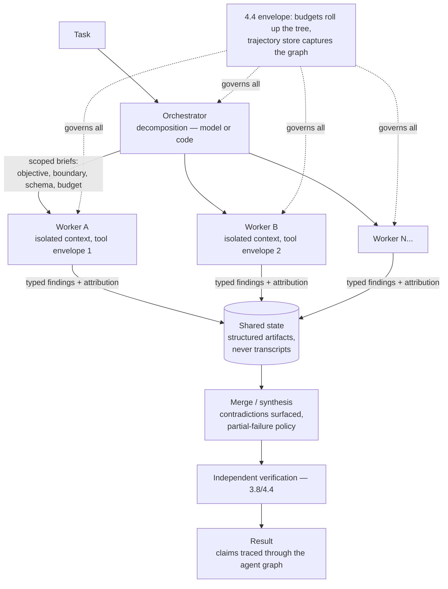

# Chapter 4.5 — Multi-Agent Systems

| | |
|---|---|
| **Part** | 4 — Enterprise GenAI Systems |
| **Maturity level** | 3 — Engineer |
| **Difficulty** | Advanced |
| **Estimated study time** | 3–4 hours (reading 2 h, exercise 90 min) |
| **Prerequisites** | [3.8](../part-3-core-building-blocks-of-genai/chapter-08-agents-concepts.md); [4.4](chapter-04-agent-architectures-production.md) |

## Learning Objectives

After this chapter you will be able to:

1. State when multiple agents genuinely beat one — and recognize the majority of cases where they don't.
2. Design the two production-proven coordination patterns — orchestrator–workers and sequential handoff — with explicit contracts for context transfer.
3. Engineer the hard part: shared state, context isolation vs. sharing, result merging, and conflict handling between agents.
4. Evaluate and debug multi-agent systems: attribution across agents, emergent failure modes, and cost governance for agent swarms.

## Introduction

Multi-agent systems carry the field's most seductive imagery — teams of AI specialists collaborating like a firm — and its most consistent over-engineering. The sober starting point: **a "multi-agent system" is a distributed system whose components are probabilistic**, which means it inherits every classical distributed-systems difficulty (partial failure, state consistency, coordination overhead) *plus* every LLM difficulty (variance, hallucination, context limits), multiplied. The burden of proof sits with the architecture: one well-tooled agent (3.8) with a clean workflow around it (the 90/10 shape) is the baseline every multi-agent proposal must beat on evals, not on diagrams.

That said, the legitimate cases are real and growing — parallel exploration at scale, context-window partitioning, and genuine role specialization — and when they apply, the coordination patterns and state disciplines in this chapter are the difference between a system and a séance.

## Business Motivation

The business case for multi-agent is *throughput and coverage on decomposable work*, and it's narrower than the hype suggests. Where it's real: research and analysis tasks whose subtasks are independent (breadth-first investigation across many sources, documents, or hypotheses — an orchestrator fanning out twenty workers finishes in the time of the slowest worker, and the context-window arithmetic works because each worker's findings compress into a summary before merging: twenty 50K-token investigations become twenty 1K-token reports, 3.2's compaction at architecture scale). Where it's imaginary: sequential work relabeled ("the researcher agent, then the writer agent, then the editor agent" — that's a prompt chain, 3.8, wearing costumes; the multi-agent framing adds coordination overhead and debugging opacity for zero parallelism), and role-play theater (agents "debating" to simulate deliberation, which mostly samples the same model's distribution multiple times at multiple times the cost — 2.7's variance methods do it honestly and cheaply). The cost profile enforces discipline: multi-agent systems multiply token spend by the worker count (the fan-out is a cost fan-out — 4.4's budget hierarchies are load-bearing here), so the eval-backed question is always *does the parallel structure buy quality or latency that a single agent with better tools can't* — and the honest answer is often no.

## Theory

### When multiple agents win

Three legitimate triggers, each mechanical rather than metaphorical:

1. **Parallelizable breadth** — the task decomposes into independent subtasks whose *results* compose (research fan-out, per-document analysis, hypothesis exploration); the win is wall-clock and coverage.
2. **Context-window partitioning** — the working material exceeds any single context even with compaction; workers hold disjoint slices and export compressed findings (the summarize-before-merge discipline is what makes this work — raw-context merging just moves the overflow).
3. **Genuine specialization with different tool envelopes** — not "personas" but *different capability and permission sets*: a read-everything research worker and a write-gated action worker with disjoint credentials (3.7's least privilege as a decomposition principle — the separation is a *security* structure, not just an organizational one).

Absent all three, use a single agent or a workflow — and record the decision (1.4).

### The two patterns that ship

- **Orchestrator–workers** — a lead agent (or deterministic code — often better) decomposes the task, spawns workers with *scoped subtasks*, and merges results. The design surface: the **subtask contract** (each worker gets a self-contained brief — objective, scope boundary, output schema (3.4), budget — because workers don't share the orchestrator's context and under-specified briefs produce confidently irrelevant work); the **merge step** (results as typed payloads merged by code or a dedicated synthesis call — with source attribution preserved so the final output's claims trace to workers' evidence, 3.6's citation chain extended one hop); and **partial-failure policy** (a worker's budget-exhausted exit (3.8) must not sink the task — merge what succeeded, note the gaps, the fleet's typed exits doing their job).
- **Sequential handoff** — agent A completes a phase and hands the task to agent B (triage → resolution; investigation → drafting). The design surface is the **handoff contract**: what state transfers (a structured summary + key artifacts, not the raw transcript — context hygiene), what authority transfers (B's tool envelope differs from A's), and the anti-pattern to avoid: chains of more than 2–3 handoffs, where each transfer loses information (the telephone game with token budgets) and accountability blurs — long chains are usually a workflow (4.6) wearing agent costumes.

Peer-to-peer/blackboard architectures (agents freely messaging a shared space) remain research territory: emergent coordination is emergent failure surface, and no production case in this curriculum's catalog justifies the debugging opacity. If tempted, write the 1.4 analysis and watch it lose.

### State, isolation, and conflict

- **Shared state is a database, not a group chat** — workers coordinate through *structured artifacts* (task boards, finding stores, typed checkpoints — 4.6's durable state), never by reading each other's transcripts (which burns context, couples prompts, and turns variance into contagion).
- **Isolation is the default; sharing is a designed exception** — each worker's context contains its brief and its own work; anything shared (the orchestrator's plan, prior findings) enters as fenced, labeled data (3.3), deliberately selected. The failure this prevents: **cross-agent contamination** — one worker's hallucination entering another's context as apparent fact and compounding (the multi-agent version of 3.6's grounded-but-wrong, with the corpus replaced by a colleague).
- **Conflicts are merge-step work** — when workers return contradictory findings, the merge must *surface* the contradiction (with both sources) rather than silently pick one; contradiction-surfacing is a feature (Kestrel's weaponized disagreement, 3.9, at agent scale) and a required schema element in research-fleet outputs.

### Evaluation and attribution

Multi-agent evaluation extends 4.4: **end-to-end task success** on scenario suites (the system is the unit users experience), plus **per-role evals** (each worker type has its own suite — a research worker's faithfulness, an orchestrator's decomposition quality — because end-to-end failures need attribution to a role before they're fixable: 3.5's localization discipline, one more time), plus the multi-agent-specific classes: **decomposition failures** (the orchestrator's plan missed a necessary subtask — no worker can save a bad plan), **merge failures** (correct worker findings, wrong synthesis), and **contamination traces** (a wrong claim's provenance tracked *through* the agent graph — which requires the attribution chain in every artifact). Cost evaluation is per-task *and* per-role: the fleet dashboards (4.4) gain a decomposition dimension (which roles consume the budget, and does the fan-out width pay).

## Architecture Perspective

Readings. **The orchestrator is the highest-leverage and highest-risk role** — a decomposition error is unfixable downstream (no worker excellence recovers a missing subtask), which argues for the most capable model *or* deterministic decomposition where the task structure is known (the recurring finding: code decomposes better than models for well-understood task shapes; save model-driven decomposition for genuinely novel structures — 3.8's spectrum applied to the planning step itself). **Budgets and trajectories are trees, not lists** — the 4.4 envelope extends naturally: per-worker budgets roll up to per-task, the trajectory store captures the spawn graph, and the kill switch prunes subtrees; a multi-agent runtime without tree-structured accounting is unaccountable by construction. **The attribution chain is the debugging lifeline** — every artifact carries its producing role and evidence links, so the wrong claim in the final report traces backward through merge → worker → tool call in minutes rather than archaeology (the multi-agent extension of 3.3's prompt-version-on-every-trace).

## Real-world Example

**Halvard & Roth** (3.5, 3.8) scaled the due-diligence system to full data-room review — and the multi-agent decision was made twice, once wrong. The first attempt followed the imagery: a "deal team" of persona agents (researcher, risk analyst, drafter, reviewer) passing work sequentially. It was slower than the workflow it replaced (four handoffs, each losing context), cost 3× (each persona re-reading material its predecessor had read), and its failures were unattributable ("the review agent missed it" — but the drafter had dropped the finding the researcher had correctly flagged: the telephone game, measured). The retrospective killed the personas and applied the triggers: what was *actually* parallel? Per-document analysis — hundreds of documents, independent first-pass review. What was actually sequential? The synthesis. What needed different envelopes? Nothing — until the client-notification drafting step, which touched a send-adjacent tool and got its own gated worker.

The rebuilt system is the pattern textbook: deterministic decomposition (the data-room index *is* the task list — no model needed to plan it), a fan-out of identical document-analysis workers (isolated contexts, one document each, typed findings with clause-level citations, per-worker budgets), a merge stage that clusters findings and *surfaces contradictions* (two workers reading related agreements differently became a flagged item for associate review — the feature partners cite most), and one bounded investigation agent (3.8's original) spawned per unresolved cross-document reference. Cost per data room dropped 60% against the persona version; wall-clock dropped 75% against the single-agent baseline (the fan-out doing its one true job); and the attribution chain turned "the AI missed a change-of-control clause" from a crisis into a five-minute trace (worker 34's finding was correct; the merge's clustering had buried it — a merge bug, fixed that week, added to the merge suite). Yusuf's closing note in the ADR: *"We didn't need a team of colleagues. We needed a very wide reading room and one good investigator."*

## Hands-on Exercise

**Build orchestrator–workers honestly and compare.** Extends 3.8's exercise. ~90 minutes.

1. **The parallel case (40 min).** Task: "summarize the key risks across these 8 documents" (use 8 texts with planted, partially contradictory risk statements). Build: deterministic decomposition (one worker per document), isolated worker contexts with a scoped brief and typed finding schema (risk, evidence quote, source), a merge step that clusters and surfaces the planted contradiction, and per-worker budgets rolling up.
2. **The baseline (20 min).** Same task, single agent with all 8 documents (or sequential reading with compaction). Compare: wall-clock, total tokens, findings coverage, contradiction detection.
3. **Contamination probe (15 min).** Deliberately corrupt one worker's finding (inject a fabricated risk); verify the merge carries its attribution so the fabrication traces to worker N — then add a verification rule (evidence quote must exist in the source document — 3.4's span check) that catches it automatically.
4. **The decision memo (15 min).** From your measurements: when does the fan-out pay for this task class? Write the three-trigger assessment (parallelism, context partitioning, envelope specialization) as the 1.4 record.

**Acceptance criteria:**
- [ ] Workers run isolated with scoped briefs; findings are typed with source attribution
- [ ] Merge surfaces the planted contradiction rather than resolving it silently
- [ ] Comparison table: latency, tokens, coverage vs. the single-agent baseline — honest numbers
- [ ] Contamination traced via attribution and then caught by the span-check rule
- [ ] Decision memo names which trigger (if any) justified the structure

## Enterprise Considerations

Multi-agent systems amplify every 4.4 enterprise concern along the tree. **Governance reads the graph:** risk classification (2.8) applies per role *and* per composition — a read-only research fleet is one class; add a single write-gated worker and the composite system's classification changes (the envelope-specialization trigger cuts both ways: it isolates risk *and* concentrates review attention where it belongs). **Cost governance needs the tree** — chargeback and budget alerts on fan-out systems require spawn-graph attribution (which task, which tenant, which role burned the tokens), and the fan-out width itself becomes a governed parameter (a config change from 10 to 50 workers is a 5× cost change wearing a tuning costume — it rides release discipline, 4.4). **Cross-team agent composition is an integration contract:** when team A's orchestrator spawns team B's specialist worker (the platform vision, P19), the subtask brief and finding schema are inter-team APIs with 3.4's treaty discipline — versioned, owned, deprecation-windowed; the alternative is the enterprise's agents coupling through prompt folklore. **And the audit story must traverse the graph:** regulated deployments need the 4.1-style reconstruction — which roles, which briefs, which findings, which merge decisions — per final output; the attribution chain isn't just debugging, it's the evidence (4.14).

## Trade-offs

| Decision | Option A | Option B | Choose A when… | Choose B when… |
|----------|----------|----------|----------------|----------------|
| Structure | Single agent / workflow | Multi-agent | Default — until a trigger (parallel breadth, context partition, envelope split) is measured | A trigger holds and evals show the fan-out pays |
| Decomposition | Deterministic (code) | Model-driven orchestrator | Task structure is known (the index is the plan) | Genuinely novel structures; then the strongest model, with decomposition evals |
| Worker context | Fully isolated + scoped brief | Shared context/transcripts | Default — contamination control and cost | Never transcripts; selected artifacts as fenced data only |
| Handoff chains | ≤2 handoffs, structured contracts | Longer persona chains | Always | Never — long chains are workflows in costume (Halvard & Roth's first attempt) |

## Common Mistakes

1. **Personas instead of parallelism** — sequential role-play chains that add cost and opacity to what a prompt chain does cleanly; the three triggers or nothing.
2. **Transcript-sharing as coordination** — workers reading each other's raw contexts: contamination, coupling, and token burn; structured artifacts through shared state, always.
3. **Under-specified briefs** — workers spawned with a sentence and no boundary/schema/budget, returning confidently irrelevant work; the subtask contract is the orchestrator's real output.
4. **Silent conflict resolution** — the merge picking one of two contradictory findings without surfacing; contradictions are signal (and in diligence, they're the product).
5. **Raw-context merging** — fan-in that concatenates worker transcripts and overflows the window the fan-out existed to escape; summarize-before-merge is the discipline.
6. **Model-driven decomposition of known structures** — paying orchestrator tokens and variance to re-derive a plan the document index already contains; code plans known shapes.
7. **Flat accounting on tree-shaped systems** — budgets and traces that don't capture the spawn graph; unattributable cost and undebuggable failures by construction.
8. **Skipping the baseline** — no single-agent comparison, so the fan-out's value is asserted, not measured; the baseline is the eval (Halvard & Roth ran it second; run it first).

## Best Practices

1. **Demand a trigger and a measured baseline** — parallel breadth, context partitioning, or envelope specialization, with the single-agent comparison on the suite; record the decision.
2. **Prefer deterministic decomposition; scope every brief** — objective, boundary, output schema, budget; the brief is a contract, tested like one.
3. **Isolate contexts; share through typed artifacts; fence everything shared** — contamination control as the default posture.
4. **Design the merge as a first-class component** — clustering, contradiction surfacing, partial-failure policy, attribution preservation; give it its own suite (the merge bug is a real class).
5. **Verify findings mechanically where possible** — evidence-span checks per worker output (3.4) catch fabrication before it merges.
6. **Extend the 4.4 envelope tree-wise** — budgets roll up the spawn graph, trajectories capture it, kill switches prune it, dashboards slice by role.
7. **Keep handoffs to two, with structured contracts** — state summary + artifacts + authority delta; beyond two, redesign as a workflow.
8. **Treat cross-team agent contracts as APIs** — versioned briefs and schemas with treaty discipline (3.4).

## Architecture Checklist

For any system with more than one agent:

- [ ] A named trigger justifies the structure; the single-agent baseline was measured and lost
- [ ] Decomposition is deterministic where the structure is known; model-driven only for novel shapes, with its own evals
- [ ] Every worker gets a scoped brief: objective, boundary, output schema, budget
- [ ] Worker contexts isolated; shared material enters as selected, fenced artifacts — never transcripts
- [ ] Shared state is structured storage with typed artifacts and attribution on every entry
- [ ] Merge surfaces contradictions, handles partial failure, preserves the evidence chain; has its own suite
- [ ] Mechanical verification (span checks) applied to worker findings before merge
- [ ] Budgets, trajectories, and kill switches are tree-structured (4.4's envelope extended)
- [ ] Per-role evals plus end-to-end suites; failure classes include decomposition, merge, and contamination
- [ ] Handoff chains ≤2 with structured contracts; cross-team briefs/schemas versioned as APIs

## Interview Questions

1. *"When do multiple agents beat one?"* — Strong answers give the three mechanical triggers (parallel breadth, context partitioning, envelope specialization), name the baseline discipline, and volunteer the anti-pattern: sequential personas are prompt chains in costume.
2. *"Design a system to analyze a 500-document data room."* — Strong answers use deterministic decomposition (the index is the plan), isolated per-document workers with typed cited findings, a contradiction-surfacing merge, one bounded investigator for cross-references, and tree-structured budgets — Halvard & Roth's shape, derivable from principles.
3. *"A wrong claim appeared in your multi-agent system's final report. Walk me through the trace."* — Strong answers walk the attribution chain backward: final claim → merge decision → worker finding → evidence span → tool call; and name the three suspect classes (worker fabrication, contamination, merge error) with the control for each (span checks, isolation, merge suite).
4. *"Why is 'agents debating' usually a poor design?"* — Strong answers demystify: it samples one model's distribution repeatedly at multiplied cost; 2.7's variance-and-vote methods achieve the ensemble honestly, and genuine deliberation value requires genuinely different information or envelopes — the triggers again.

## Further Reading

- Anthropic's multi-agent research system engineering post (anthropic.com/engineering) — the production orchestrator–workers account this chapter's pattern section reflects; note the summarize-before-merge and scoped-brief disciplines.
- Classical distributed-systems literature (Kleppmann, *Designing Data-Intensive Applications* — the consistency and partial-failure chapters) — the substrate discipline; multi-agent systems are distributed systems first.
- The [agent design checklist](../../checklists/agent-design-checklist.md) — its multi-agent lines ("coordination pattern named, shared-state contract defined") are this chapter's checklist hooks.
- 7.4 Agentic Patterns (when written) — the pattern-form treatment of orchestrator–workers, handoff, and their consequences.

## Summary

- A multi-agent system is **a distributed system with probabilistic components** — it inherits both fields' difficulties, so the burden of proof is a **named trigger** (parallel breadth, context partitioning, envelope specialization) plus a **measured single-agent baseline**.
- Two patterns ship: **orchestrator–workers** (scoped briefs, isolated contexts, typed attributed findings, contradiction-surfacing merge, partial-failure policy) and **short sequential handoff** (≤2, structured contracts); personas and free-form debate are costumes on cheaper structures.
- **Isolation is the default; sharing is designed** — structured artifacts through shared state, never transcripts; contamination is the multi-agent-native failure, controlled by fencing, span checks, and attribution.
- **Everything governs tree-wise**: budgets roll up the spawn graph, trajectories capture it, evals attribute failures to decomposition/worker/merge — and deterministic code plans known structures better than models do.
- The coordination machinery that runs all of this durably — queues, checkpoints, resumption, human steps — is the next chapter: **orchestration and workflow design** (4.6).

---

**Previous:** [Chapter 4.4 — Agent Architectures in Production](chapter-04-agent-architectures-production.md) · **Next:** [Chapter 4.6 — Orchestration & Workflow Design](chapter-06-orchestration-workflows.md) · **Related:** [3.8 Agents](../part-3-core-building-blocks-of-genai/chapter-08-agents-concepts.md), [7.4 Agentic Patterns](../part-7-enterprise-ai-architecture-patterns/README.md), [Agent design checklist](../../checklists/agent-design-checklist.md)
