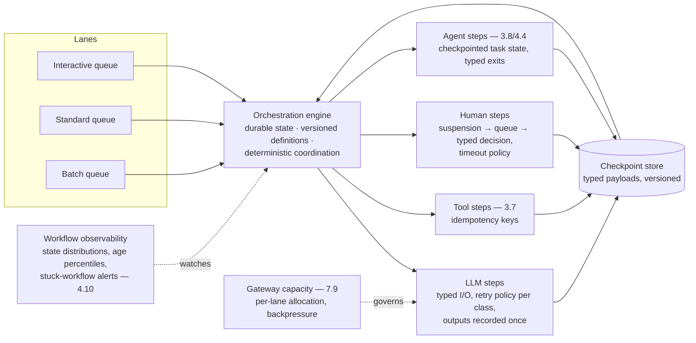

# Chapter 4.6 — Orchestration & Workflow Design

| | |
|---|---|
| **Part** | 4 — Enterprise GenAI Systems |
| **Maturity level** | 3 — Engineer |
| **Difficulty** | Advanced |
| **Estimated study time** | 3–4 hours (reading 2 h, exercise 90 min) |
| **Prerequisites** | [3.4](../part-3-core-building-blocks-of-genai/chapter-04-structured-outputs.md); [3.8](../part-3-core-building-blocks-of-genai/chapter-08-agents-concepts.md); [4.4](chapter-04-agent-architectures-production.md) |

## Learning Objectives

After this chapter you will be able to:

1. Design durable LLM workflows: checkpointed state, idempotent steps, resumption after failure, and versioning of in-flight work.
2. Apply the queue-and-worker substrate: backpressure, retry policies matched to LLM failure modes, and lane separation (interactive, standard, batch).
3. Integrate human steps as first-class workflow states — approvals, reviews, escalations — with SLAs and timeout policies.
4. Choose the orchestration machinery deliberately: durable-execution engines vs. queue-based assembly vs. agent-framework runtimes.

## Introduction

Everything Part 4 has built — RAG services, ingestion campaigns, agent fleets, multi-agent trees — runs *on* something, and this chapter is that something: the orchestration layer that makes multi-step, long-running, partially-human, failure-prone work *durable*. The discipline is classical (queues, state machines, idempotency — the workflow engineering enterprises have done for decades) with LLM-specific twists that change real design decisions: steps that are expensive and slow (a model call is not a database write — retrying it costs real money and seconds), steps that are *probabilistic* (a retry may succeed for a different reason than the failure — or produce a different answer), steps that wait on humans (4.4's approval queues, now as workflow states), and in-flight work that outlives prompt and model versions (a 3-week-old suspended workflow resumes into a world where the prompt registry moved — 5.7's versioning meets its hardest case).

The chapter's frame: **the workflow is the system of record for work in progress** — when a task is "somewhere in the pipeline," the orchestration state is the answer to where, and everything else (retries, resumption, audit, operator intervention) follows from taking that seriously.

## Business Motivation

Orchestration quality is invisible until the failure arrives mid-task — and mid-task is where enterprise LLM work lives. The shapes: a document-processing campaign (4.3) dies at document 800,000 of 2 million — without checkpointed, idempotent steps, the restart reprocesses (and re-pays for) the first 800,000 (embedding and vision-extraction dollars, 1.7's batch lines, spent twice); a claims workflow (Kestrel's) waits four days on an adjuster approval — without durable suspension, that's a held connection, a timeout, or an in-memory state lost to the Tuesday deploy; a multi-agent research task (4.5) is 40 minutes into a 50-minute run when a provider hiccup kills one worker — without partial-failure recovery, the whole tree re-runs. Each failure class converts directly to money (re-run compute), latency (SLA breaches on restarts), or trust (the "lost" claim that was actually a lost workflow state). The positive case is capability, not just resilience: durable orchestration is what makes the *long-running* business processes — the multi-day, multi-approval, multi-system flows where enterprise value concentrates (CS03's prior-auth, CS47's financial close) — automatable at all; without it, GenAI stays confined to the request-response window, which is to say, to the shallow end.

## Theory

### Durable state and the checkpoint discipline

The core pattern: workflow state lives in **durable storage** (not process memory), advanced by **steps** whose completion is recorded transactionally, so any crash resumes from the last completed step. LLM-specific design points:

- **Checkpoint the typed payloads, not the conversation** — steps communicate through 3.4's typed joints, and *those* are what's persisted; if a step internally used an agent loop, its checkpoint is the loop's task state (3.8), not its transcript. The checkpoint is the resumption contract, and it's versioned like the schema it is.
- **Idempotency per step, with LLM nuance** — classical idempotency (same input → safe re-execution) needs a decision for probabilistic steps: on retry, *reuse the recorded output* if the step completed (never re-roll a completed LLM step — you paid for it, and a different answer now corrupts downstream consistency), and if it didn't complete, re-execute knowing the output may differ (downstream steps must depend on the *checkpoint*, never on side memories of a previous attempt). Side-effecting steps (tool calls — 3.7) carry idempotency keys as always.
- **Determinism boundaries** — durable-execution engines (temporal-style) replay workflow code to reconstruct state, which requires the *orchestration logic* to be deterministic while the *steps* (LLM calls) are not; the discipline is strict separation — all randomness, model calls, and I/O inside steps, pure coordination in the workflow definition. Mixing them produces the class of bug where a replayed workflow diverges from its own history.

### Retry policy for probabilistic steps

LLM steps fail in modes that classical retry policies mishandle; the matched policy:

| Failure mode | Right response |
|---|---|
| Transport/timeout, 5xx, rate limit | Classical: exponential backoff + jitter; respect provider retry-after; route around via fallback model (3.10) on sustained failure |
| Output validation failure (3.4) | Re-ask with error, budgeted (the 3.4 ladder — it's a *quality* retry, counted separately from transport retries) |
| Content refusal / policy trip | **Don't blind-retry** — refusals are often deterministic for the input; route to the designed fallback (rephrase step, human queue) — retrying a refusal ten times is ten bills for one answer |
| Budget/iteration exhaustion (3.8) | Not a retry — a typed exit with a partial-result consumer |
| Semantic failure (wrong but valid) | Not retryable at this layer at all — that's eval and design territory (4.7); workflows that "retry until the answer looks right" are Goodharting themselves |

The policy is per-step-class configuration, versioned with the workflow — and *retry storms* are the fleet-level risk (4.4's breakers): a provider brownout turning 10,000 in-flight workflows into synchronized retry waves is the LLM version of the thundering herd, damped by jitter, budgets, and admission control at the gateway.

### Lanes, queues, and backpressure

The workload taxonomy that shapes the substrate: **interactive** (a user is waiting — seconds matter, retries are tight, degradation is a UX decision — 3.1's fallback ladder), **standard** (minutes-to-hours — approvals, document flows), and **batch** (campaigns — 4.3's reprocessing, overnight fleets; throughput matters, latency doesn't, and batch pricing lanes (4.11) cut the bill materially for exactly this class). Lanes get separate queues, separate provider capacity allocations (one team's batch campaign must not starve the interactive lane's rate limits — 4.4's admission control, formalized), and separate SLOs. Backpressure flows *up* the lanes: when capacity tightens, batch defers first, standard queues deepen second, interactive degrades last and loudest.

### Humans as workflow states

The 4.4 approval queue, generalized: a human step is a **suspension point** — the workflow persists, a work item enters the human's queue (context-rich, 4.4's discipline), and the workflow resumes on decision. The design surface: **timeout policy per human step** (what happens when nobody decides — escalate up a chain, auto-decide conservatively, or park with alerting; "wait forever" is a policy too, and usually the wrong one), **delegation and absence handling** (the approver on vacation is a workflow-availability problem — queues are role-addressed, not person-addressed), and **the human's decision is a typed step output** like any other (recorded, auditable, feeding the same checkpoint chain — the 2.8 oversight evidence produced as a side effect of the architecture).

### Versioning in-flight work

The hard problem unique to long-running workflows: work suspended for days resumes into changed code, prompts, and models. The disciplines: **workflow definitions are versioned, and in-flight instances pin their version** (new work starts on v43; the 3-week-old instance completes on v41 — engines support this; your prompt/model references must too, which is why steps reference registry versions (3.3) rather than "latest"); **migration is explicit** — where v41-in-flight *must* move to v43 (a security fix), the migration is a designed operation on checkpointed state, tested like the schema migration it is; and **the eval question** — a workflow completing on pinned old versions is *correct by its contract* but may be worse by current standards; the fleet dashboards (4.4) slice by version so the long tail of old-version completions is visible, not silent.

## Architecture Perspective

Readings. **The engine choice is a 1.4 analysis with three real options**: durable-execution engines (replay-based — strongest guarantees, strictest determinism discipline, a learning curve teams underestimate), queue-plus-state-machine assembly (maximum control, most self-built reliability engineering), and agent-framework runtimes (convenient for agent-heavy work, evaluated against 4.4's envelope before trusted with general workflows) — the deciding criteria are the team's operational maturity and the workload's human-step and duration profile, and the losing move is deciding by demo (7.10's framework lock-in, third appearance). **Workflow observability is state-distribution monitoring** — the fleet view (4.4) extended: how many instances in each state, age percentiles per state (a step whose p95 age grows is clogging — the human queue that backed up, the provider that slowed), and stuck-workflow alerts (instances beyond their class's age envelope) — the operational question "where is everything?" answered by dashboard rather than archaeology. **And the checkpoint store is a compliance asset** — the complete, typed, versioned history of what happened, who decided, and what the system knew at each step is the 4.14 audit narrative generated structurally; treat its retention and access accordingly (it contains everything the steps contained — classify it like the data it holds).

## Real-world Example

**Kestrel Assurance** (1.6, 3.3, 3.9) rebuilt the claims-correspondence flow on durable orchestration after two formative incidents. The first: a Tuesday-afternoon deploy restarted the correspondence service, and 312 in-flight claims — drafted letters awaiting adjuster review, held in process memory — vanished; the letters were re-drafted (twice-paid tokens, the small cost) but 14 claims missed their regulatory response deadline (the real cost, with a filing). The rebuild made every claim a durable workflow instance: intake (3.9's pipeline) → retrieval and drafting (typed payloads checkpointed) → adjuster review (a human step with a 48-hour timeout escalating to the team lead's queue — the vacation problem solved by role-addressing) → liability-blocklist validation (3.3's contract as a workflow gate) → dispatch (idempotency-keyed; the retry that must never double-send). The second incident stress-tested the design ten months later: a provider brownout during a Monday peak failed 40% of drafting steps for 25 minutes. The matched retry policy held — transport retries with jitter absorbed the brief failures, sustained ones routed to the fallback model (3.10's portfolio earning its keep), refusals (a handful, from the fallback's different contours — 2.6) went to the human queue rather than retry loops, and the state dashboard showed the standard lane's age percentiles swelling and draining in real time while the interactive lane (customer-facing status queries) stayed green on its protected allocation. Total business impact: 90 minutes of added latency on the standard lane, zero lost work, zero deadline misses. The version discipline got its test too: a compliance-driven prompt fix (a new mandatory disclosure line) had to reach *in-flight* drafts — the explicit migration re-ran the drafting step for 60 suspended instances from their checkpoints, gated by the 3.3 suite, documented as the change-control event it was. Marta's operations review line: *"The workflow engine is where our promises to the regulator physically live."*

## Hands-on Exercise

**Build a durable mini-workflow and kill it repeatedly.** Any queue + storage (a database table and a worker loop suffice; a durable-execution engine if you want the deeper lesson). ~90 minutes. Scenario: a three-step document flow — extract (LLM step, typed output), human review (simulated queue with timeout), publish (side-effecting step with idempotency key).

1. **Durable steps (40 min).** Implement the workflow with checkpointed state: each step's typed output recorded transactionally; the engine resumes from the last completed step. LLM step outputs are recorded once — a resumed workflow *reuses* the recorded extraction, never re-rolls it.
2. **Kill drill (20 min).** Kill the worker mid-step-2 (before the human decision); restart; verify resumption with no re-extraction and no lost state. Kill it mid-step-3 after the side effect fired; verify the idempotency key prevents double-publish on resume.
3. **Retry policy (15 min).** Inject failures into the LLM step: a transient (timeout → backoff retry), a validation failure (→ one re-ask, 3.4), and a simulated refusal (→ route to human queue, no retry). Verify each takes its designed path and count the retries per class.
4. **Timeout and versioning (15 min).** Let the human step time out → escalation queue. Then "deploy" a v2 of the extraction prompt and verify: new instances use v2, the suspended instance completes on v1 (pinned), and write the two-line migration policy for when v1-in-flight must move.

**Acceptance criteria:**
- [ ] Both kill drills pass: no lost state, no re-rolled completed LLM step, no double-publish
- [ ] Three failure classes take three designed paths (backoff / re-ask / human-route), counted separately
- [ ] Human timeout escalates per policy; decisions are typed, recorded step outputs
- [ ] Version pinning demonstrated for in-flight work, with the migration policy stated

## Enterprise Considerations

Orchestration is where GenAI meets the enterprise's existing process estate — usually BPM suites, ticketing systems, and RPA already running the business's workflows. **Integration beats replacement:** the LLM workflow layer typically *embeds within* existing process machinery (a BPM step that invokes an LLM sub-workflow; a ticket state that triggers a drafting flow) rather than replacing it — the boundaries are integration contracts (6.4) and the honest architecture names which engine is the system of record for which state (two engines both believing they own a claim's state is a reconciliation incident on a schedule). **The suspension estate needs governance:** thousands of suspended instances waiting on humans is operational inventory — aging reports, ownership per queue, and the periodic sweep for orphans (the workflow waiting on a decision from a reorganized-away role) belong to someone's operating rhythm (4.4's supervision cost line, extended). **Checkpoint retention meets data law:** checkpoints contain the personal data their steps processed — retention schedules, deletion propagation (4.1's probes reaching into workflow history), and the tension between audit-trail duties (keep everything) and minimization duties (keep nothing) resolved explicitly per data class with legal (4.14). **And capacity contracts span lanes:** provisioned throughput (5.4) allocated per lane, with the batch lane's campaigns calendar-coordinated (4.3) — the enterprise version of the exercise's protected interactive allocation.

## Trade-offs

| Decision | Option A | Option B | Choose A when… | Choose B when… |
|----------|----------|----------|----------------|----------------|
| Engine | Durable-execution platform | Queue + state-machine assembly | Long-running, human-step-heavy, audit-heavy workloads; team can absorb the model | Simple short flows; maximum control; existing queue expertise |
| Completed-step retries | Reuse recorded output | Re-execute on resume | Always for completed LLM steps | Only for genuinely stateless, cheap, deterministic steps |
| Human timeout | Escalation chains | Conservative auto-decision | Judgment steps; someone must decide | Low-stakes gates where the conservative default is safe and SLA-critical |
| In-flight migration | Pin to version, complete on old | Migrate checkpointed state | Default — cheapest, correct by contract | Security/compliance fixes that must reach in-flight work; then designed, gated, documented |

## Common Mistakes

1. **In-memory workflow state** — the Tuesday deploy erasing 312 claims; if the process's death loses work, there is no workflow, only hope.
2. **Re-rolling completed LLM steps on resume** — paying twice and corrupting downstream consistency with a different answer; recorded outputs are the contract.
3. **One retry policy for all failure modes** — blind exponential backoff retrying refusals ten times, or validation failures treated as transport; the matched policy table, per step class.
4. **Unprotected interactive lanes** — the batch campaign consuming the rate limits while users wait; lanes with separate allocations and upward backpressure.
5. **Human steps without timeout policy** — workflows waiting forever on the departed approver; role-addressed queues, escalation chains, and aging sweeps.
6. **"Latest" references in long-running work** — the suspended instance resuming into a moved prompt registry; steps pin registry versions, definitions pin their own.
7. **The determinism violation** — model calls or clock reads in the coordination logic of a replay-based engine; the workflow that diverges from its own history on replay.
8. **Retry storms** — synchronized retries across thousands of instances during provider brownouts; jitter, budgets, and gateway admission as the dampers.

## Best Practices

1. **Checkpoint typed payloads transactionally; resume from the last completed step** — the workflow is the system of record for work in progress.
2. **Record LLM step outputs once; reuse on resume; key every side effect** — idempotency with the probabilistic nuance handled.
3. **Match retry policy to failure mode, per step class, versioned** — transport backs off, validation re-asks, refusals route, exhaustion exits.
4. **Run three lanes with separate queues, allocations, and SLOs** — batch defers first, interactive degrades last.
5. **Make human steps first-class states** — role-addressed queues, timeout policies with escalation, typed recorded decisions.
6. **Pin versions for in-flight work; migrate explicitly when you must** — gated, tested, documented as change control.
7. **Watch state distributions and age percentiles** — the clogged step announces itself weeks before the incident, if anyone is looking.
8. **Choose the engine with a written 1.4 analysis** — the workload's duration/human/audit profile against the team's operational maturity; never by demo.

## Architecture Checklist

For any multi-step LLM system:

- [ ] Workflow state durable and transactional; kill-tested resumption from any step boundary
- [ ] Completed LLM step outputs recorded and reused; side-effecting steps idempotency-keyed
- [ ] Retry policy per failure class (transport / validation / refusal / exhaustion), with storm damping (jitter, budgets, admission)
- [ ] Lanes separated (interactive/standard/batch) with per-lane capacity allocation, SLOs, and upward backpressure
- [ ] Human steps: role-addressed queues, context-rich items (4.4), timeout and escalation policy, typed recorded decisions
- [ ] Workflow definitions and step artifact references (prompts, models, schemas) versioned; in-flight instances pinned; migration path designed
- [ ] Determinism boundary enforced (coordination pure, steps effectful) where replay-based engines are used
- [ ] State-distribution and age-percentile dashboards with stuck-instance alerting
- [ ] Checkpoint store classified, retention-governed, and reachable by deletion propagation
- [ ] Engine choice recorded as an ADR with the workload-profile criteria

## Interview Questions

1. *"Design a document-processing pipeline that survives crashes, provider outages, and deploys."* — Strong answers build on durable checkpoints with typed payloads, idempotent steps with recorded LLM outputs, matched retry policies, lane separation, and state-distribution observability — and mention the kill drill as the acceptance test.
2. *"How do LLM steps change classical workflow retry design?"* — Strong answers give the matched-policy table: expensive completed steps are reused not re-rolled, validation failures re-ask via 3.4's ladder, refusals route instead of retry, and semantic failures aren't retryable at this layer at all — plus retry-storm damping at fleet scale.
3. *"A claim workflow has waited 5 days on an approver who left the company. What failed?"* — Strong answers name the missing machinery: person-addressed instead of role-addressed queues, no timeout/escalation policy, no aging sweep — and the design that prevents it (human steps as governed workflow states with SLAs).
4. *"Your compliance team needs a prompt fix applied to 400 suspended workflow instances. Walk me through it."* — Strong answers treat it as a designed migration: identify pinned versions, re-run the affected step from checkpoints, gate with the prompt's suite, document as change control — versus the naive "they'll get it when they resume" (they won't; they're pinned) or the reckless unpinned-latest (Kestrel's disciplined version as the reference).

## Further Reading

- Temporal's documentation on durable execution and determinism constraints (docs.temporal.io) — the deepest articulation of the replay model and its disciplines, useful even if you choose differently.
- Your queue platform's delivery-semantics documentation (official docs — at-least-once vs. exactly-once claims read skeptically) — the substrate contract idempotency must be designed against.
- Kleppmann, *Designing Data-Intensive Applications* — the exactly-once, idempotency, and consistency chapters; third appearance in this Part, because the substrate discipline is the same.
- The [deployment checklist](../../checklists/deployment-checklist.md) — its versioning and rollback lines extend to workflow definitions and in-flight migrations; apply to P19's platform.

## Summary

- The orchestration layer is **the system of record for work in progress**: durable, transactional checkpoints of typed payloads, resumption from the last completed step, kill-tested by discipline.
- LLM steps bend classical rules: **completed outputs are recorded and reused** (never re-rolled), retries are **matched to failure mode** (backoff / re-ask / route / exit — never blind), and storms are damped at the fleet level.
- **Lanes** (interactive/standard/batch) get separate queues, allocations, and SLOs, with backpressure deferring batch first and degrading interactive last.
- **Humans are workflow states**: role-addressed, timeout-governed, escalation-chained, with typed recorded decisions that double as oversight evidence.
- **In-flight work pins its versions**; migrations are designed, gated operations — and the checkpoint store is a classified compliance asset. The machinery that *measures* everything running on this substrate is next: **evaluation systems** (4.7).

---

**Previous:** [Chapter 4.5 — Multi-Agent Systems](chapter-05-multi-agent-systems.md) · **Next:** [Chapter 4.7 — Evaluation Systems & LLM-as-Judge](chapter-07-evaluation-systems.md) · **Related:** [3.4 Structured Outputs](../part-3-core-building-blocks-of-genai/chapter-04-structured-outputs.md), [4.4 Agent Architectures](chapter-04-agent-architectures-production.md), [Deployment checklist](../../checklists/deployment-checklist.md)
