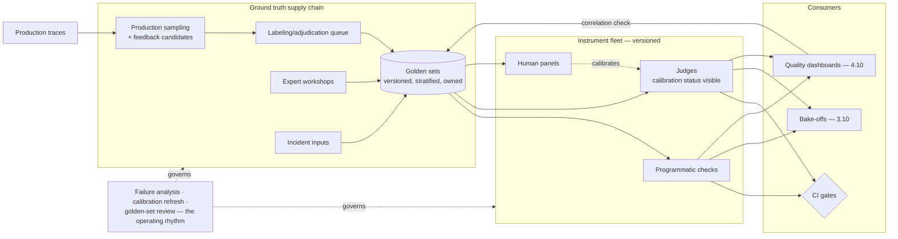

# Chapter 4.7 — Evaluation Systems & LLM-as-Judge

| | |
|---|---|
| **Part** | 4 — Enterprise GenAI Systems |
| **Maturity level** | 3 — Engineer |
| **Difficulty** | Advanced |
| **Estimated study time** | 4 hours (reading 2 h, exercise 2 h) |
| **Prerequisites** | [2.7 Evaluating ML Systems](../part-2-artificial-intelligence/chapter-07-evaluating-ml-systems.md); [3.3](../part-3-core-building-blocks-of-genai/chapter-03-prompt-engineering.md) |

## Learning Objectives

After this chapter you will be able to:

1. Build the evaluation *system* — golden-set supply chain, judge fleet, CI gates, online monitoring — as permanent shared infrastructure, not per-project scripts.
2. Run LLM-as-judge responsibly at scale: rubric engineering, calibration programs, drift management, and the judge's own lifecycle.
3. Close the offline↔online loop: production sampling into golden sets, implicit signals wired to traces, and the correlation checks that keep offline evals honest.
4. Operate evaluation as an organizational function: ownership, failure-analysis cadence, and the eval-driven development workflow.

## Introduction

Chapter 2.7 built the concepts — metrics, the method ladder, judge biases, noise floors. This chapter builds the *machine*: the evaluation infrastructure that every preceding Part 4 chapter has been depending on by reference (4.1's gates, 4.2's per-class slices, 4.4's scenario suites, 4.6's release gates). The claim made in 2.7 — the measurement system outlives every model it measures — becomes an architecture here, with a supply chain (ground truth production), instruments (judges, programmatic checks), consumers (CI gates, dashboards, bake-offs), and an operating rhythm (failure analysis, calibration refresh).

The framing shift from 2.7 to here is *industrial*: not "how do I evaluate this output?" but "how does an organization with forty LLM systems know, continuously and cheaply, whether any of them got worse — and *which part*?" The answer is a platform (P10 builds it; 7.9 places it), and this chapter is its design document.

## Business Motivation

Evaluation infrastructure is the highest-ROI shared investment in a GenAI program, for a compounding reason: it's the *precondition for velocity everywhere else*. Every change this curriculum has described — prompt edits (3.3), retrieval tuning (4.2), model migrations (3.10), agent-definition deploys (4.4), workflow versioning (4.6) — is gated by evals; an organization whose evals are per-project scripts pays the gate cost repeatedly and skips it under pressure (the skipped gate being how regressions ship), while one with a shared eval service pays once and gates everything. The negative case is quantifiable in incident post-mortems: the majority of production GenAI quality incidents in mature organizations trace to *ungated changes* — the prompt hotfix, the silent model upgrade, the reranker swap — every one preventable by machinery that existed but wasn't wired to that change path. And the strategic case: eval assets are the organization's accumulated definition of "good" — rubrics encoding expert judgment (Kestrel's adjusters, Halvard & Roth's partners), golden sets encoding hard-won edge cases — an appreciating, proprietary asset (2.2's data moat, in evaluation form) that transfers across every model generation while the models themselves commoditize (3.10's "the harness is forever").

## Theory

### The eval platform's four subsystems

1. **Ground truth supply chain** — golden sets as *products with pipelines* (2.7's manufacturing claim, industrialized): sourced from expert workshops (1.6's sorting method — the cold-start), production sampling (the steady state: traces sampled by the 4.4-style policies — failures, outliers, randoms — flow into a labeling queue), and user feedback (thumbs and edits wired to traces, arriving as *candidate* labels needing adjudication, not truth). The supply chain's disciplines: versioned datasets with review-before-merge (changes to ground truth are changes to the definition of good — they get diffs and approvers), stratification maintained deliberately (the set's class mix managed against production's — 3.6's four-class structure per system type), access control matching the data's classification (2.7's enterprise line), and *staleness management* — golden sets rot as products and policies change; each set carries a review cadence and an owner.
2. **The instrument fleet** — programmatic checks (the cheapest rung, maximized by 3.4's structured-output discipline), judges (below), and human panels (the calibration source and high-stakes sampler). The fleet is *versioned and registered* like any model portfolio (3.10): every instrument's readings carry its version, so a metric shift decomposes into "the system changed" vs. "the ruler changed" — the confusion that unversioned instruments make undiagnosable.
3. **Consumers** — CI gates (per-artifact suites with thresholds and noise-floor-honest sizing — 2.7), release canaries (4.4's distribution-watching), bake-off harnesses (3.10), and the trend dashboards (4.10) where quality lives next to latency and cost.
4. **The operating rhythm** — failure-analysis sessions (reading transcripts, not just scores — the taxonomy factory), calibration refreshes, golden-set reviews, and the eval-driven development loop: *write the eval before the feature* (the fit criterion (1.6) as executable spec — teams that adopt this loop report the same effect test-driven development did: the eval clarifies the requirement before code exists to pass it).

### Judge engineering at scale

The 2.7 cautions, operationalized into a program:

- **Rubric engineering** — decomposed dimensions with anchored scales, built from expert example-sorting (1.6), each dimension *separately* judged (one mega-prompt scoring five dimensions produces correlated mush; five focused judge calls produce diagnosable readings — 3.3's decomposition, applied to judging). Rubrics are versioned artifacts with the treaty discipline (3.4): a rubric change re-baselines every trend line built on it, so it's a governed event.
- **The calibration program** — per dimension, per system type: a human-labeled calibration set, agreement measured (with chance-corrected statistics, not raw percentages), a minimum agreement bar for gate duty, and *scheduled re-calibration* — on judge-model changes (mandatory — 3.10's migration playbook includes the judge), on rubric changes, and on a time cadence (drift happens without any named change: input distributions move under the judge). A judge's calibration status is metadata every consumer can see; gating on an expired calibration is a flagged violation.
- **Bias controls as standing configuration** — position randomization, length normalization or penalty, cross-family judging for bake-offs (3.10), and *sycophancy isolation*: the judge never sees the system's confidence or the user's satisfaction, only the artifact and the rubric (2.6's residue, walled off).
- **The judge's economics** — judging is inference (1.7's call-graph multiplier: a 5%-sampled, 3-dimension judge adds 15% to per-request model calls); the levers are the same as production's — small models for well-calibrated easy dimensions, tiering (7.8), batch lanes for offline suites (4.6) — and judge cost belongs on the eval platform's own dashboard.

### The offline↔online loop

The correlation discipline that keeps the whole apparatus honest: offline evals *predict*; online reality *grades the prediction*. The machinery: **online quality signals** (implicit — acceptance, edit distance, retries, escalations, task abandonment — wired to traces; explicit — ratings — treated as biased candidate labels), **the correlation check** (periodically: do offline suite scores predict online signals across releases? — where they diverge, the golden set has drifted from production's distribution, and the supply chain has work), and **the incident backstop** — every production quality incident's inputs enter the golden set (the "regression test from every bug" discipline, evaluation edition) so the suite monotonically accumulates the organization's failure history. This loop is what 2.2 called the flywheel, with evaluation as the flywheel's bearing: systems whose production experience feeds their evals get better; systems whose evals froze at launch get confidently stale.

## Architecture Perspective

Readings. **The platform is multi-tenant by design** (7.9): forty systems share the judge fleet, the labeling queue, the gate machinery, and the dashboard substrate, while owning their *content* — golden sets, rubrics, thresholds; the split is the 4.4 platform/product pattern again, and the shared layer is where the calibration program's fixed costs amortize. **Every reading is versioned four ways** — system version (what was measured), instrument version (what measured it), dataset version (against what), rubric version (by what standard) — the provenance quadruple that makes any metric movement decomposable in minutes; readings without it are trend lines built on sand. **And the gate wiring is the whole game operationally** — the platform's value is realized only where change paths *cannot bypass it*: prompt registry deploys (3.3), index blue/greens (4.1), agent definitions (4.4), workflow versions (4.6), model migrations (3.10) all route through CI gates by construction, which is an integration project with each of those systems and the reason the eval platform is sequenced early (P10 before P13–P19 in the [project catalog's](../../projects/README.md) logic).

## Real-world Example

**Meridian Health Partners** (1.5, 3.2, 3.6) consolidated evaluation after counting the cost of not doing so: an internal review found nine LLM systems with nine eval approaches — three with none beyond launch demos, four with unversioned scripts whose numbers nobody could reproduce, and two good ones (the clinician assistant's four-class suite from 3.6, and the pharmacy team's) that shared nothing. The platform build followed this chapter's shape, and two episodes from its first year illustrate the machinery earning its keep.

The first: **the calibration catch**. The platform's judge fleet standardized on one judge model; six months in, that model's scheduled upgrade (3.10's playbook, applied to the instrument) triggered mandatory re-calibration — and the faithfulness dimension's agreement with the human panel dropped from 86% to 71% on the clinical-summary rubric. The old judge had been *stricter* than the new one about unsupported causal language ("the medication improved symptoms" vs. "symptoms improved after the medication") — a distinction the clinical rubric cared about intensely and the new judge's defaults didn't. The fix was rubric engineering (explicit anchors for causal-claim handling, two few-shot exemplars) that restored agreement to 88% — but the platform lead's point at the review was the counterfactual: *without the calibration program, the judge swap would have silently loosened the faithfulness gate on every clinical system simultaneously* — the exact shape of incident (an instrument change wearing a quality-improvement costume) that unversioned eval scripts can never even detect.

The second: **the correlation drift**. The nurse-facing assistant's offline scores held steady through Q3 while its online escalation rate crept up 40%. The correlation check flagged the divergence; failure analysis on sampled escalations found the cause — a new hospital-system acquisition had added a patient population whose medication regimens (and question patterns) the golden set barely represented. The supply chain did its job: two hundred sampled-and-adjudicated production cases from the new population entered the set (stratification deliberately rebalanced), offline scores promptly *dropped* to match online reality, and the retrieval fixes (4.2's taxonomy: corpus gaps, mostly) were gated against the now-honest suite. The platform's annual report rendered the lesson in one sentence: *"An eval suite that stays green while production degrades isn't measuring the product — it's measuring the past."*

## Hands-on Exercise

**Build the miniature platform around your Part 3 artifacts.** ~2 hours. You have golden sets (3.5, 3.6), prompt suites (3.3), and scenario suites (3.8) — this exercise gives them the platform treatment.

1. **Registry and provenance (30 min).** Put your eval assets under the four-way versioning: create a manifest per suite (dataset version, rubric version, instrument version, thresholds) and a runner that stamps every result with the quadruple plus the system version measured. Re-run a suite and verify two results are comparable by manifest.
2. **A calibrated judge (40 min).** Take your 3.6 faithfulness rubric; label 15 outputs yourself (the human panel of one — acknowledge the limitation); run an LLM judge three times per item with position/length controls; compute agreement. Write the calibration record: dimension, agreement, bar for gate duty (is 15 items enough? — 2.7's noise floor says no; state what n you'd need).
3. **Gate wiring (25 min).** Wire one real change path: your 3.3 prompt suite as a pre-"deploy" gate on prompt changes — a script that refuses the registry update if the suite regresses beyond the noise floor. Demonstrate a blocked bad change and a passed good one.
4. **The supply-chain loop (25 min).** Take three "production" failures (from any prior exercise's misses); adjudicate and add them to the golden set as a *versioned change with a diff and rationale*; re-run the suite and record the new baseline. You've run one revolution of the flywheel.

**Acceptance criteria:**
- [ ] Every result carries the provenance quadruple; two runs comparable by manifest
- [ ] Calibration record exists with honest agreement statistics and an honest n-adequacy statement
- [ ] The gate demonstrably blocks a regressing change and passes a clean one
- [ ] Golden-set change is versioned with rationale; baseline re-established

## Enterprise Considerations

The eval platform's enterprise life is governance-heavy because it *is* the governance instrument. **Validation independence** (2.7's SR 11-7 line, now structural): in regulated deployments, the team that owns a system's golden set and thresholds should not be the team whose bonus depends on the system shipping — the platform enables the separation (shared machinery, independent content ownership) that per-project scripts structurally prevent; model-risk-management functions increasingly *require* it. **The labeling operation is a workforce** (2.2's label ops, at platform scale): adjudication queues need staffing models, quality control on the labelers themselves (agreement monitoring, gold-seeded items — the same discipline applied one level up), and domain-expert time budgeted as the recurring cost it is (Halvard & Roth's partner hours; Meridian's clinician panels — priced into the platform's operating cost, not scavenged). **Rubrics are policy documents:** in regulated contexts the faithfulness rubric for clinical summaries or the suitability rubric for financial advice encodes compliance positions — legal and compliance review rubric changes (the 6.9 lane), and rubric version history is audit evidence. **And cross-organizational benchmarking stays private:** eval assets encode competitive knowledge (your failure taxonomy is a map of your hard cases) — sharing suites with vendors for bake-offs needs the same data-governance review as sharing any proprietary dataset (3.10's harness, guarded accordingly).

## Trade-offs

| Decision | Option A | Option B | Choose A when… | Choose B when… |
|----------|----------|----------|----------------|----------------|
| Platform vs. scripts | Shared eval service | Per-team eval code | More than ~3 LLM systems; any regulated system | Genuinely one system, one team — and revisit at the second |
| Judge scope | Focused single-dimension judges | One multi-dimension judge call | Gate duty; diagnosability matters | Exploratory scoring where cost dominates and correlated readings are tolerable |
| Gate strictness | Hard blocks at thresholds | Warn-and-ship with review | Regression classes with incident history; regulated dimensions | Early-life systems where the suite's own calibration is still maturing — labeled as such |
| Online signals | Full implicit-signal instrumentation | Explicit ratings only | Default — implicit signals are higher-volume and less biased | Privacy constraints limit behavioral capture (with the correlation check weakened, acknowledged) |

## Common Mistakes

1. **Per-project eval scripts at organizational scale** — nine systems, nine methodologies, zero comparability, and the gate that exists but isn't wired; the platform decision is overdue at system three.
2. **Unversioned instruments** — the judge model upgrades silently and every trend line jumps; the ruler changed and nobody can prove it (Meridian's counterfactual). Four-way provenance, always.
3. **Calibration as a launch ritual** — validated once, drifting ever after; re-calibration is scheduled and triggered (judge changes, rubric changes, time), with status visible to every consumer.
4. **Golden sets frozen at launch** — green suites over degrading production (the correlation drift); the supply chain runs continuously or the suite measures the past.
5. **Mega-judge prompts** — five dimensions in one call producing correlated, undiagnosable scores; decompose the judging like any other task (3.3).
6. **Feedback as truth** — user thumbs entering golden sets unadjudicated; ratings are biased candidates (selection effects, sycophancy rewards — 2.6), and adjudication is the filter.
7. **Gates that changes can route around** — the eval platform as an optional courtesy; value is realized only where the change paths *cannot bypass* it, which is an integration project, not a policy memo.
8. **Ignoring judge economics** — the 15% call-graph overhead nobody budgeted (1.7); judge cost is a dashboard line with the same tiering levers as production.

## Best Practices

1. **Build the platform at system three, not system nine** — shared supply chain, instrument fleet, gates, and dashboards; content ownership stays with teams.
2. **Version everything four ways** — system, instrument, dataset, rubric — on every reading; metric movements decompose or they mislead.
3. **Run calibration as a program** — per dimension, chance-corrected, with bars for gate duty, triggered re-validation, and visible status.
4. **Operate the ground-truth supply chain** — production sampling into adjudication queues, incident inputs as mandatory additions, stratification managed, staleness reviewed on cadence.
5. **Write the eval before the feature** — fit criteria (1.6) as executable specs; the eval-driven loop clarifies requirements and pre-builds the gate.
6. **Read transcripts on a rhythm** — failure-analysis sessions as the taxonomy factory (2.7's discipline, scheduled); scores locate problems, transcripts explain them.
7. **Check offline↔online correlation quarterly** — divergence is a supply-chain work order, not a mystery.
8. **Wire the gates into every change path by construction** — prompts, indexes, agents, workflows, models; the bypass that exists will be used.

## Architecture Checklist

For evaluation infrastructure serving multiple LLM systems:

- [ ] Shared platform: supply chain, instrument fleet, gates, dashboards — with per-team content ownership
- [ ] Golden sets versioned, stratified, access-controlled, owned, and review-scheduled; changes diffed and approved
- [ ] Production sampling and incident inputs flow into adjudication queues; labeler quality itself monitored
- [ ] Judges: decomposed dimensions, anchored rubrics (versioned as policy where regulated), bias controls standing, calibration program with visible status and triggered refresh
- [ ] Every reading carries the provenance quadruple (system/instrument/dataset/rubric versions)
- [ ] CI gates wired into all change paths (prompt, index, agent, workflow, model) without bypass; thresholds noise-floor-honest
- [ ] Online implicit signals wired to traces; offline↔online correlation checked on cadence
- [ ] Judge and eval-run costs dashboarded with tiering/batch levers applied
- [ ] Validation independence structured where regulation demands it
- [ ] Failure-analysis rhythm scheduled; taxonomy maintained and fed back to design

## Interview Questions

1. *"Design the evaluation infrastructure for a company with thirty LLM systems."* — Strong answers produce the four subsystems (supply chain, instrument fleet, consumers, rhythm), the platform/content ownership split, four-way provenance, and the gate-wiring-by-construction point — not a list of metrics.
2. *"Your judge model is being deprecated. What's at risk and what's the process?"* — Strong answers treat the judge as a versioned instrument: mandatory re-calibration against human panels per dimension, rubric adjustments to restore agreement, re-baselining of trend lines, and the counterfactual risk (silently shifted gates across every consuming system) that justifies the ceremony.
3. *"Offline evals are green; users are complaining. Diagnose."* — Strong answers reach for correlation drift: the golden set no longer matches production's distribution (new populations, new query classes), verified via the correlation check and failure analysis on sampled complaints, fixed through the supply chain — plus the standing prevention (continuous sampling, incident inputs, stratification management).
4. *"How do you keep LLM-as-judge honest enough to gate releases?"* — Strong answers run the program: decomposed dimensions, anchored rubrics from expert sorting, chance-corrected agreement bars, bias controls (position, length, cross-family, sycophancy isolation), triggered re-calibration, and visible calibration status — with human panels as the recurring anchor, not a launch ritual.

## Further Reading

- Zheng et al., *Judging LLM-as-a-Judge* (arxiv.org/abs/2306.05685) — re-linked from 2.7; the bias catalog this chapter's controls operationalize.
- Your provider's evaluation tooling and judge documentation (official docs) — graders, eval APIs, and judge templates; the build-vs-buy input for the instrument fleet.
- Cohen's kappa and chance-corrected agreement literature (any standard statistics reference) — the honest agreement arithmetic the calibration program runs on.
- The [evaluation checklist](../../checklists/evaluation-checklist.md) — this chapter is that checklist expanded into an architecture; P10 implements it as a product.

## Summary

- Evaluation at organizational scale is a **platform with four subsystems**: a ground-truth supply chain (workshops → production sampling → adjudication → versioned golden sets), a versioned instrument fleet, gate-and-dashboard consumers, and an operating rhythm (failure analysis, calibration, set reviews).
- **Judges are governed instruments**: decomposed dimensions, anchored versioned rubrics, standing bias controls, and a calibration program with agreement bars, triggered refreshes, and visible status — the ruler is versioned or the trend lines lie.
- **Every reading carries four-way provenance** (system/instrument/dataset/rubric), making metric movements decomposable; every change path routes through gates *by construction*.
- The **offline↔online loop** keeps it honest: implicit signals wired to traces, correlation checked on cadence, incidents feeding the sets — a green suite over degrading production is measuring the past.
- Eval assets — rubrics, golden sets, taxonomies — are the organization's **appreciating proprietary definition of good**, outliving every model they measure. What the evals *enforce* at runtime is next: **guardrails** (4.8).

---

**Previous:** [Chapter 4.6 — Orchestration & Workflow Design](chapter-06-orchestration-workflows.md) · **Next:** [Chapter 4.8 — Guardrails & Content Safety](chapter-08-guardrails-content-safety.md) · **Related:** [2.7 Evaluating ML Systems](../part-2-artificial-intelligence/chapter-07-evaluating-ml-systems.md), [3.10 Model Selection](../part-3-core-building-blocks-of-genai/chapter-10-model-selection-benchmarking.md), [Evaluation checklist](../../checklists/evaluation-checklist.md)
